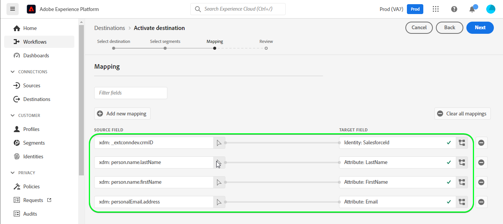

# [!DNL Salesforce CRM] connection

## Información general {#overview}

[Salesforce CRM](https://www.salesforce.com/) es una plataforma popular de administración de la relación con los clientes (CRM).

Esta [!DNL Adobe Experience Platform] [destino](/help/destinations/home.md) aprovecha el [API de REST de Salesforce](https://developer.salesforce.com/docs/atlas.en-us.api_rest.meta/api_rest/dome_composite_upsert_example.htm?q=contacts), que le permite actualizar las identidades dentro de un segmento en Salesforce CRM.

Salesforce CRM utiliza OAuth 2 con Concesión de contraseña como mecanismo de autenticación para comunicarse con la API de REST de Salesforce. Las instrucciones para autenticarse en la instancia de Salesforce CRM se detallan a continuación, en la sección [Autenticar en destino](#authenticate) para obtener más información.

## Casos de uso {#use-cases}

Como especialista en marketing, puede ofrecer experiencias personalizadas a los usuarios en función de los atributos de sus perfiles de Adobe Experience Platform. Puede generar segmentos a partir de los datos sin conexión y enviarlos a Salesforce CRM para que se muestren en las fuentes de los usuarios en cuanto los segmentos y perfiles se actualicen en Adobe Experience Platform.

## Requisitos previos {#prerequisites}

### Requisitos previos en el Experience Platform {#prerequisites-in-experience-platform}

Antes de activar los datos en el destino de Salesforce CRM, debe tener una [esquema](/help/xdm/schema/composition.md), [conjunto de datos](https://experienceleague.adobe.com/docs/platform-learn/tutorials/data-ingestion/create-datasets-and-ingest-data.html?lang=en)y [segmentos](https://experienceleague.adobe.com/docs/platform-learn/tutorials/segments/create-segments.html?lang=en) creado en [!DNL Experience Platform].

### Requisitos previos de Salesforce CRM {#prerequisites-destination}

Tenga en cuenta los siguientes requisitos previos de Salesforce para exportar datos de Platform a su cuenta de Salesforce:

#### Necesita una cuenta de Salesforce {#prerequisites-account}

Vaya a Salesforce [prueba](https://www.salesforce.com/in/form/signup/freetrial-sales/) para registrar y crear una cuenta de Salesforce, si todavía no la tiene.

#### Configurar una aplicación conectada {#prerequisites-connected-app}

A continuación, debe configurar un [aplicación conectada](https://help.salesforce.com/s/articleView?id=sf.connected_app_create.htm&amp;language=en_US&amp;r=https%3A%2F%2Fhelp.salesforce.com%2F&amp;type=5) en su cuenta de Salesforce, si todavía no tiene una.

Dentro de la aplicación conectada, asegúrese de que [Configuración de OAuth](https://help.salesforce.com/s/articleView?id=connected_app_create_api_integration.htm&amp;type=5&amp;language=en_US) está activada.

Asegúrese también de que la variable [ámbitos](https://help.salesforce.com/s/articleView?id=connected_app_create_api_integration.htm&amp;type=5&amp;language=en_US) a continuación se seleccionan.

* ``chatter_api``
* ``lightning``
* ``visualforce``
* ``content``
* ``openid``
* ``full``
* ``api``
* ``web``
* ``refresh_token``
* ``offline_access``

#### Crear campo personalizado en Salesforce {#prerequisites-custom-field}

Cree el campo personalizado de tipo `Text Area Long` qué Experience Platform utilizará para actualizar el estado del segmento dentro de Salesforce CRM.
Consulte la documentación de Salesforce para [crear campos personalizados](https://help.salesforce.com/s/articleView?id=sf.adding_fields.htm&amp;type=5) si necesita más instrucciones.

>[!IMPORTANT]
>
> Asegúrese de que no haya caracteres de espacio en blanco en el nombre del campo. En su lugar, utilice el guión bajo `(_)` como separador.

>[!NOTE]
>
> * Los objetos de Salesforce están restringidos a 25 campos externos, consulte [Atributos de campo personalizados](https://help.salesforce.com/s/articleView?id=sf.custom_field_attributes.htm&amp;type=5).
> * Esta restricción implica que solo podrá tener un máximo de 25 miembros de segmentos de Experience Platform activos en cualquier momento.
> * Si ha alcanzado este límite en Salesforce, deberá eliminar el atributo personalizado de Salesforce que se utilizó para almacenar el estado del segmento en segmentos antiguos dentro de Experience Platform antes de poder usar un nuevo mappingId.

Consulte la documentación de Adobe Experience Platform para [Grupo de campos de esquema Detalles de pertenencia a segmentos](/help/xdm/field-groups/profile/segmentation.md) si necesita instrucciones sobre los estados de los segmentos.

#### Recopilar credenciales de Salesforce {#gather-credentials}

Tenga en cuenta los siguientes elementos antes de autenticarse en el destino de Salesforce CRM:

| Credencial | Descripción | Ejemplo |
| --- | --- | --- |
| <ul><li>Prefijo de dominio de Salesforce</li></ul> | Consulte [Prefijo de dominio de Salesforce](https://help.salesforce.com/s/articleView?id=sf.domain_name_setting_login_policy.htm&amp;type=5) para obtener más información. | <ul><li>Si su dominio es el siguiente, necesita el valor resaltado.  <i>`d5i000000isb4eak-dev-ed`.my.salesforce.com</i></li></ul> |
| <ul><li>Clave del consumidor</li><li>Secreto del consumidor</li></ul> | Consulte la [Documentación de Salesforce](https://help.salesforce.com/s/articleView?id=sf.connected_app_rotate_consumer_details.htm&amp;type=5) si necesita más instrucciones. | <ul><li>r23kxxxxxxx0z05xxxxxx</li><li>ipxxxxxxxxxxT4xxxxxxxxx</li></ul> |

## Identidades compatibles {#supported-identities}

Salesforce CRM admite la actualización de identidades descritas en la siguiente tabla. Más información sobre [identidades](/help/identity-service/namespaces.md).

| Identidad de Target | Descripción | Consideraciones |
|---|---|---|
| SalesforceId | Identificador CRM de Salesforce personalizado que admite la asignación de cualquier identidad. | Obligatorio. Puede enviar cualquier [identidad](../../../identity-service/namespaces.md) a [!DNL Salesforce CRM] destino, siempre que lo asigne a la variable `SalesforceId`. |

## Tipo de exportación y frecuencia {#export-type-frequency}

Consulte la tabla siguiente para obtener información sobre el tipo y la frecuencia de exportación de destino.

| Elemento | Tipo | Notas |
---------|----------|---------|
| Tipo de exportación | **[!UICONTROL Basado en perfiles]** | <ul><li>Está exportando todos los miembros de un segmento, junto con los campos de esquema deseados *(por ejemplo: dirección de correo electrónico, número de teléfono, apellidos)*, según la asignación de campos.</li><li> Los estados de segmentos de plataforma se exportan a [!DNL Salesforce CRM] especificando su atributo de campo personalizado correspondiente en [!DNL Salesforce CRM] en el **[!UICONTROL Activar destino]** > **[!UICONTROL Programar exportación de segmentos]** > **[!UICONTROL ID de asignación]** campo .</li></ul> |
| Frecuencia de exportación | **[!UICONTROL Transmisión]** | <ul><li>Los destinos de flujo continuo son conexiones basadas en API &quot;siempre activadas&quot;. Tan pronto como un perfil se actualiza en el Experience Platform en función de la evaluación de segmentos, el conector envía la actualización descendente a la plataforma de destino. Más información sobre [destinos de flujo continuo](/help/destinations/destination-types.md#streaming-destinations).</li></ul> |

{style=&quot;table-layout:auto&quot;}

## Conectarse al destino {#connect}

>[!IMPORTANT]
> 
>Para conectarse al destino, necesita la variable **[!UICONTROL Administrar destinos]** [permiso de control de acceso](/help/access-control/home.md#permissions). Lea el [información general sobre el control de acceso](/help/access-control/ui/overview.md) o póngase en contacto con el administrador del producto para obtener los permisos necesarios.

Para conectarse a este destino, siga los pasos descritos en la sección [tutorial de configuración de destino](../../ui/connect-destination.md). En el flujo de trabajo de configuración de destino, rellene los campos que aparecen en las dos secciones siguientes.

### Autenticar en destino {#authenticate}

Para autenticarse en el destino, rellene los campos obligatorios y seleccione **[!UICONTROL Conectarse al destino]**.

* **[!UICONTROL Contraseña]**: La contraseña de su cuenta de Salesforce.
* **[!UICONTROL ID de cliente]**: La clave de consumidor de la aplicación conectada a Salesforce.
* **[!UICONTROL Secreto del cliente]**: El Secreto del consumidor de la aplicación conectada de Salesforce.
* **[!UICONTROL Nombre de usuario]**: El nombre de usuario de su cuenta de Salesforce.

Si los detalles proporcionados son válidos, la interfaz de usuario muestra un **Conectado** con una marca de verificación verde, puede continuar con el siguiente paso.

### Rellenar detalles de destino {#destination-details}

Para configurar los detalles del destino, rellene los campos opcionales y requeridos a continuación. Un asterisco junto a un campo en la interfaz de usuario indica que el campo es obligatorio.

* **[!UICONTROL Nombre]**: Un nombre por el cual reconocerá este destino en el futuro.
* **[!UICONTROL Descripción]**: Descripción que le ayudará a identificar este destino en el futuro.
* **[!UICONTROL Dominio personalizado]**: Su dominio de Salesforce.

### Habilitar alertas {#enable-alerts}

Puede activar las alertas para recibir notificaciones sobre el estado del flujo de datos a su destino. Seleccione una alerta de la lista para suscribirse y recibir notificaciones sobre el estado de su flujo de datos. Para obtener más información sobre las alertas, consulte la guía de [suscripción a alertas de destinos mediante la interfaz de usuario](../../ui/alerts.md).

Cuando haya terminado de proporcionar detalles para la conexión de destino, seleccione **[!UICONTROL Siguiente]**.

## Activar segmentos en este destino {#activate}

>[!IMPORTANT]
> 
>Para activar los datos, necesita la variable **[!UICONTROL Administrar destinos]**, **[!UICONTROL Activar destinos]**, **[!UICONTROL Ver perfiles]** y **[!UICONTROL Ver segmentos]** [permisos de control de acceso](/help/access-control/home.md#permissions). Lea el [información general sobre el control de acceso](/help/access-control/ui/overview.md) o póngase en contacto con el administrador del producto para obtener los permisos necesarios.

Lectura [Activar perfiles y segmentos en destinos de exportación de segmentos de flujo continuo](/help/destinations/ui/activate-segment-streaming-destinations.md) para obtener instrucciones sobre la activación de segmentos de audiencia en este destino.

### Consideraciones de asignación y ejemplo {#mapping-considerations-example}

Para enviar correctamente los datos de audiencia de Adobe Experience Platform al destino de Salesforce CRM, debe pasar por el paso de asignación de campos. La asignación consiste en la creación de un vínculo entre los campos de esquema del Modelo de datos de experiencia (XDM) en la cuenta de Platform y sus equivalentes correspondientes desde el destino de destino. Para asignar correctamente los campos XDM a los campos de destino de Salesforce CRM, siga estos pasos:

1. En el paso Asignación , haga clic en **[!UICONTROL Añadir nueva asignación]**, verá una nueva fila de asignación en la pantalla .

   

1. En la ventana seleccionar campo de origen, al seleccionar el campo de origen, elija la opción **[!UICONTROL Seleccionar atributos]** y añada las asignaciones que desee.

   

1. En la ventana select target field , seleccione el campo target y elija la **[!UICONTROL Seleccionar área de nombres de identidad]** y añada las asignaciones que desee.

   

1. Para los atributos personalizados, en la ventana seleccionar campo de destino , seleccione el campo de destino y elija el **[!UICONTROL Seleccionar atributos personalizados]** , a continuación proporcione el nombre de atributo de destino deseado y añada las asignaciones deseadas.

   

1. Por ejemplo, puede añadir la siguiente asignación entre el esquema de perfil XDM y el [!DNL Salesforce CRM] instancia:

   |  | Esquema de perfil XDM | [!DNL Salesforce CRM] Instancia | Obligatorio |
   |---|---|---|---|
   | Atributos | <ul><li>person.name.firstName</code></li><li>person.name.lastName</code></li><li>personalEmail.address</code></li></ul> | <ul><li>Nombre</code></li><li>Apellido</code></li><li>Correo electrónico</code></li></ul> |
   | Identidades | <ul><li>crmID</code></li></ul> | <ul><li>SalesforceId</code></li></ul> | Sí |

1. A continuación se muestra un ejemplo con estas asignaciones:

   

### Programar exportación de segmentos y ejemplo {#schedule-segment-export-example}

Al realizar el [Programar exportación de segmentos](/help/destinations/ui/activate-segment-streaming-destinations.md#scheduling) debe asignar manualmente los segmentos de Platform al atributo de campo personalizado en Salesforce.

Para ello, seleccione cada segmento e introduzca el atributo de campo personalizado correspondiente de Salesforce en la **[!UICONTROL ID de asignación]** campo .

>[!IMPORTANT]
>
>* El valor utilizado para la variable **[!UICONTROL ID de asignación]** debe coincidir exactamente con el nombre del atributo de campo personalizado creado en Salesforce.
>* Asegúrese de que el nombre del atributo de campo personalizado que ha creado en Salesforce no utilice el carácter de espacio en blanco.

A continuación se muestra un ejemplo:

## Validación de la exportación de datos {#exported-data}

Para validar que ha configurado correctamente el destino, siga los pasos a continuación:

1. Select **[!UICONTROL Destinos]** > **[!UICONTROL Examinar]** para navegar a la lista de destinos.
   

1. Seleccione el destino y valide que el estado es **[!UICONTROL enabled]**.
   

1. Cambie a la **[!DNL Activation data]** y, a continuación, seleccione un nombre de segmento.
   

1. Monitorice el resumen del segmento y asegúrese de que el recuento de perfiles corresponde al recuento creado dentro del segmento.
   

1. Inicie sesión en el sitio web de Salesforce y, a continuación, vaya a la **[!DNL Apps]** > **[!DNL Contacts]** y compruebe si se han añadido los perfiles del segmento.
   

1. Haga clic en un contacto y compruebe si los campos se actualizan. Verá que el estado del segmento del Experience Platform se ha actualizado con respecto al atributo de campo personalizado correspondiente que se ha proporcionado en la variable **ID de asignación** durante el **[!UICONTROL Activar destino]** > **[!UICONTROL Programar exportación de segmentos]** paso a paso.
   

## Uso y gobernanza de los datos {#data-usage-governance}

Todo [!DNL Adobe Experience Platform] Los destinos de cumplen las políticas de uso de datos al administrar los datos. Para obtener información detallada sobre cómo [!DNL Adobe Experience Platform] exige el control de datos; consulte [Información general sobre la administración de datos](/help/data-governance/home.md).

## Errores y solución de problemas {#errors-and-troubleshooting}

### Se han encontrado errores desconocidos al insertar eventos en el destino {#unknown-errors}

Cuando compruebe que se ejecute un flujo de datos, si ve el siguiente mensaje de error, compruebe que el ID de asignación que ha proporcionado en [!DNL Salesforce CRM] para su segmento de Platform es válido y existe dentro de [!DNL Salesforce CRM].

## Recursos adicionales {#additional-resources}

Información útil adicional de [Portal para desarrolladores de Salesforce](https://developer.salesforce.com/) a continuación:
* [Crear un registro](https://developer.salesforce.com/docs/atlas.en-us.api_rest.meta/api_rest/dome_sobject_create.htm)
* [Audiencias de recomendación personalizadas](https://developer.salesforce.com/docs/atlas.en-us.236.0.chatterapi.meta/chatterapi/connect_resources_recommendation_audiences_list.htm)
* [Uso de recursos compuestos](https://developer.salesforce.com/docs/atlas.en-us.api_rest.meta/api_rest/using_composite_resources.htm?q=composite)
* [Introducción](https://developer.salesforce.com/docs/atlas.en-us.api_rest.meta/api_rest/quickstart.htm)

### Límites {#limits}

Salesforce equilibra las cargas de transacciones imponiendo límites de solicitud, tasa y tiempo de espera. Consulte la [Límites y asignaciones de solicitudes de API](https://developer.salesforce.com/docs/atlas.en-us.salesforce_app_limits_cheatsheet.meta/salesforce_app_limits_cheatsheet/salesforce_app_limits_platform_api.htm) para obtener más información.