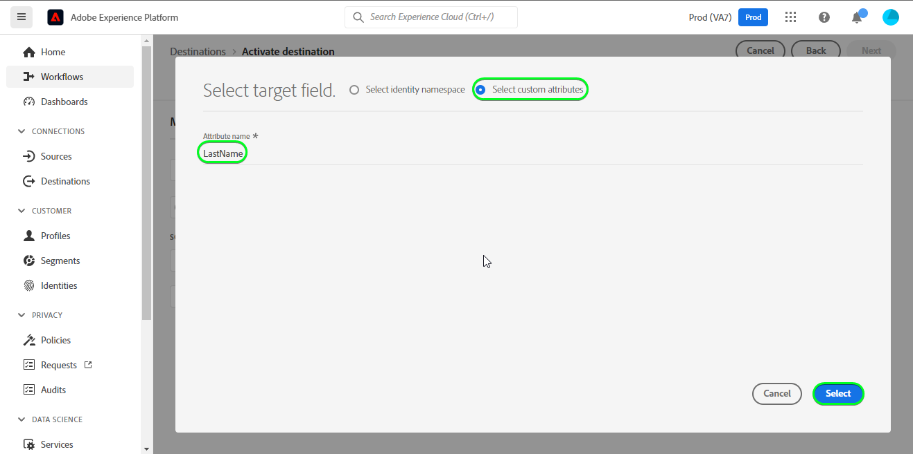

# [!DNL Salesforce CRM] connection

## Información general {#overview}

[[!DNL Salesforce CRM]](https://www.salesforce.com/crm/) es una plataforma popular de administración de la relación con los clientes (CRM) y es compatible con lo siguiente:

* [Posibles clientes](https://developer.salesforce.com/docs/atlas.en-us.object_reference.meta/object_reference/sforce_api_objects_lead.htm) - Un posible cliente es el nombre de una persona o empresa que puede (o no) estar interesada en los productos o servicios que vende.
* [Contactos](https://developer.salesforce.com/docs/atlas.en-us.object_reference.meta/object_reference/sforce_api_objects_contact.htm) - Un contacto es una persona con la que uno de sus representantes ha establecido una relación y ha sido calificado como cliente potencial.

Esta [!DNL Adobe Experience Platform] [destino](/help/destinations/home.md) aprovecha el [[!DNL Salesforce composite API]](https://developer.salesforce.com/docs/atlas.en-us.api_rest.meta/api_rest/resources_composite_sobjects_collections_update.htm), que admite ambos tipos de perfiles descritos anteriormente.

When [activación de segmentos](#activate), puede seleccionar entre posibles clientes o contactos y actualizar atributos y segmentar datos en [!DNL Salesforce CRM].

[!DNL Salesforce CRM] utiliza OAuth 2 con Concesión de contraseña como mecanismo de autenticación para comunicarse con la API de REST de Salesforce. Instrucciones para autenticarse en su [!DNL Salesforce CRM] más abajo, en la [Autenticar en destino](#authenticate) para obtener más información.

## Casos de uso {#use-cases}

Como especialista en marketing, puede ofrecer experiencias personalizadas a los usuarios en función de los atributos de sus perfiles de Adobe Experience Platform. Puede generar segmentos a partir de los datos sin conexión y enviarlos a Salesforce CRM para que se muestren en las fuentes de los usuarios en cuanto los segmentos y perfiles se actualicen en Adobe Experience Platform.

## Requisitos previos {#prerequisites}

### Requisitos previos en el Experience Platform {#prerequisites-in-experience-platform}

Antes de activar los datos en el destino de Salesforce CRM, debe tener una [esquema](/help/xdm/schema/composition.md), [conjunto de datos](https://experienceleague.adobe.com/docs/platform-learn/tutorials/data-ingestion/create-datasets-and-ingest-data.html?lang=en)y [segmentos](https://experienceleague.adobe.com/docs/platform-learn/tutorials/segments/create-segments.html?lang=en) creado en [!DNL Experience Platform].

### Requisitos previos en [!DNL Salesforce CRM] {#prerequisites-destination}

Tenga en cuenta los siguientes requisitos previos en [!DNL Salesforce CRM], para exportar datos de Platform a su cuenta de Salesforce:

#### Necesita una cuenta de Salesforce {#prerequisites-account}

Vaya a Salesforce [prueba](https://www.salesforce.com/in/form/signup/freetrial-sales/) para registrar y crear una cuenta de Salesforce, si todavía no la tiene.

#### Configurar una aplicación conectada {#prerequisites-connected-app}

A continuación, debe configurar un [aplicación conectada](https://help.salesforce.com/s/articleView?id=sf.connected_app_create.htm&amp;language=en_US&amp;r=https%3A%2F%2Fhelp.salesforce.com%2F&amp;type=5) en su cuenta de Salesforce, si todavía no tiene una.

Dentro de la aplicación conectada, asegúrese de que [Configuración de OAuth](https://help.salesforce.com/s/articleView?id=connected_app_create_api_integration.htm&amp;type=5&amp;language=en_US) está activada.

Asegúrese también de que la variable [ámbitos](https://help.salesforce.com/s/articleView?id=connected_app_create_api_integration.htm&amp;type=5&amp;language=en_US) a continuación se seleccionan.

* ``chatter_api``
* ``lightning``
* ``visualforce``
* ``content``
* ``openid``
* ``full``
* ``api``
* ``web``
* ``refresh_token``
* ``offline_access``

#### Crear campo personalizado en Salesforce {#prerequisites-custom-field}

Cree el campo personalizado de tipo `Text Area Long`, que el Experience Platform utilizará para actualizar el estado del segmento en [!DNL Salesforce CRM].
Consulte la documentación de Salesforce para [crear campos personalizados](https://help.salesforce.com/s/articleView?id=sf.adding_fields.htm&amp;type=5) si necesita más instrucciones.

>[!IMPORTANT]
>
>Asegúrese de que no haya caracteres de espacio en blanco en el nombre del campo. En su lugar, utilice el guión bajo `(_)` como separador.

>[!NOTE]
>
>* Los objetos de Salesforce están restringidos a 25 campos externos, consulte [Atributos de campo personalizados](https://help.salesforce.com/s/articleView?id=sf.custom_field_attributes.htm&amp;type=5).
>* Esta restricción implica que solo puede tener un máximo de 25 miembros de segmentos de Experience Platform activos en cualquier momento.
>* Si ha alcanzado este límite en Salesforce, debe eliminar el atributo personalizado de Salesforce que se utilizó para almacenar el estado del segmento en segmentos antiguos dentro de Experience Platform antes de una nueva **[!UICONTROL ID de asignación]** se puede usar.

Consulte la documentación de Adobe Experience Platform para [Grupo de campos de esquema Detalles de pertenencia a segmentos](/help/xdm/field-groups/profile/segmentation.md) si necesita instrucciones sobre los estados de los segmentos.

#### Recopilar credenciales de Salesforce {#gather-credentials}

Tenga en cuenta los elementos siguientes antes de autenticarse en la variable [!DNL Salesforce CRM] destino:

| Credencial | Descripción | Ejemplo |
| --- | --- | --- |
| <ul><li>Prefijo de dominio de Salesforce</li></ul> | Consulte [Prefijo de dominio de Salesforce](https://help.salesforce.com/s/articleView?id=sf.domain_name_setting_login_policy.htm&amp;type=5) para obtener más información. | <ul><li>Si su dominio es el siguiente, necesita el valor resaltado.  <i>`d5i000000isb4eak-dev-ed`.my.salesforce.com</i></li></ul> |
| <ul><li>Clave del consumidor</li><li>Secreto del consumidor</li></ul> | Consulte la [Documentación de Salesforce](https://help.salesforce.com/s/articleView?id=sf.connected_app_rotate_consumer_details.htm&amp;type=5) si necesita más instrucciones. | <ul><li>r23kxxxxxxx0z05xxxxxx</code></li><li>ipxxxxxxxxxxT4xxxxxxxxx</code></li></ul> |

### Límites de protección  {#guardrails}

Salesforce equilibra las cargas de transacciones imponiendo límites de solicitud, tasa y tiempo de espera. Consulte la [Límites y asignaciones de solicitudes de API](https://developer.salesforce.com/docs/atlas.en-us.salesforce_app_limits_cheatsheet.meta/salesforce_app_limits_cheatsheet/salesforce_app_limits_platform_api.htm) para obtener más información.

>[!IMPORTANT]
>
>When [activación de segmentos](#activate) debe seleccionar entre *Contacto* o *Posible cliente* tipos. Debe asegurarse de que los segmentos tengan la asignación de datos adecuada según el tipo seleccionado.

## Identidades compatibles {#supported-identities}

[!DNL Salesforce CRM] admite la actualización de identidades descritas en la siguiente tabla. Más información sobre [identidades](/help/identity-service/namespaces.md).

| Identidad de Target | Descripción | Consideraciones |
|---|---|---|
| `SalesforceId` | La variable [!DNL Salesforce CRM] identificador de las identidades de contacto o posible cliente que exporta o actualiza a través del segmento. | Obligatorio |

## Tipo de exportación y frecuencia {#export-type-frequency}

Consulte la tabla siguiente para obtener información sobre el tipo y la frecuencia de exportación de destino.

| Elemento | Tipo | Notas |
---------|----------|---------|
| Tipo de exportación | **[!UICONTROL Basado en perfiles]** | <ul><li>Está exportando todos los miembros de un segmento, junto con los campos de esquema deseados *(por ejemplo: dirección de correo electrónico, número de teléfono, apellidos)*, según la asignación de campos.</li><li> Cada estado de segmento en [!DNL Salesforce CRM] se actualiza con el estado del segmento correspondiente de Platform, en función de la variable **[!UICONTROL ID de asignación]** valor proporcionado durante el [programación de segmentos](#schedule-segment-export-example) paso a paso.</li></ul> |
| Frecuencia de exportación | **[!UICONTROL Transmisión]** | <ul><li>Los destinos de flujo continuo son conexiones basadas en API &quot;siempre activadas&quot;. Tan pronto como un perfil se actualiza en el Experience Platform en función de la evaluación de segmentos, el conector envía la actualización descendente a la plataforma de destino. Más información sobre [destinos de flujo continuo](/help/destinations/destination-types.md#streaming-destinations).</li></ul> |

{style=&quot;table-layout:auto&quot;}

## Conectarse al destino {#connect}

>[!IMPORTANT]
>
>Para conectarse al destino, necesita la variable **[!UICONTROL Administrar destinos]** [permiso de control de acceso](/help/access-control/home.md#permissions). Lea el [información general sobre el control de acceso](/help/access-control/ui/overview.md) o póngase en contacto con el administrador del producto para obtener los permisos necesarios.

Para conectarse a este destino, siga los pasos descritos en la sección [tutorial de configuración de destino](../../ui/connect-destination.md). En el flujo de trabajo de configuración de destino, rellene los campos que aparecen en las dos secciones siguientes.

Within **[!UICONTROL Destinos]** > **[!UICONTROL Catálogo]** buscar [!DNL Salesforce CRM]. También puede localizarlo en la sección **[!UICONTROL CRM]** categoría.

### Autenticar en destino {#authenticate}

Para autenticarse en el destino, rellene los campos obligatorios y seleccione **[!UICONTROL Conectarse al destino]**.

* **[!UICONTROL Contraseña]**: La contraseña de su cuenta de Salesforce.
* **[!UICONTROL Dominio personalizado]**: Su dominio de Salesforce.
* **[!UICONTROL ID de cliente]**: La clave de consumidor de la aplicación conectada a Salesforce.
* **[!UICONTROL Secreto del cliente]**: El Secreto del consumidor de la aplicación conectada de Salesforce.
* **[!UICONTROL Nombre de usuario]**: El nombre de usuario de su cuenta de Salesforce.

Si los detalles proporcionados son válidos, la interfaz de usuario muestra un **[!UICONTROL Conectado]** con una marca de verificación verde, puede continuar con el siguiente paso.

### Rellenar detalles de destino {#destination-details}

Para configurar los detalles del destino, rellene los campos opcionales y requeridos a continuación. Un asterisco junto a un campo en la interfaz de usuario indica que el campo es obligatorio.

* **[!UICONTROL Nombre]**: Un nombre por el cual reconocerá este destino en el futuro.
* **[!UICONTROL Descripción]**: Descripción que le ayudará a identificar este destino en el futuro.
* **[!UICONTROL Tipo de ID de Salesforce]**: Select **[!UICONTROL Contacto]** si las identidades que desea exportar o actualizar son del tipo *Contacto*. Select **[!UICONTROL Posible cliente]** si las identidades que desea exportar o actualizar son del tipo *Posible cliente*.

### Habilitar alertas {#enable-alerts}

Puede activar las alertas para recibir notificaciones sobre el estado del flujo de datos a su destino. Seleccione una alerta de la lista para suscribirse y recibir notificaciones sobre el estado de su flujo de datos. Para obtener más información sobre las alertas, consulte la guía de [suscripción a alertas de destinos mediante la interfaz de usuario](../../ui/alerts.md).

Cuando haya terminado de proporcionar detalles para la conexión de destino, seleccione **[!UICONTROL Siguiente]**.

## Activar segmentos en este destino {#activate}

>[!IMPORTANT]
>
>Para activar los datos, necesita la variable **[!UICONTROL Administrar destinos]**, **[!UICONTROL Activar destinos]**, **[!UICONTROL Ver perfiles]** y **[!UICONTROL Ver segmentos]** [permisos de control de acceso](/help/access-control/home.md#permissions). Lea el [información general sobre el control de acceso](/help/access-control/ui/overview.md) o póngase en contacto con el administrador del producto para obtener los permisos necesarios.

Lectura [Activar perfiles y segmentos en destinos de exportación de segmentos de flujo continuo](/help/destinations/ui/activate-segment-streaming-destinations.md) para obtener instrucciones sobre la activación de segmentos de audiencia en este destino.

### Consideraciones de asignación y ejemplo {#mapping-considerations-example}

Para enviar correctamente los datos de audiencia de Adobe Experience Platform a [!DNL Salesforce CRM] destino, debe pasar por el paso de asignación de campos. La asignación consiste en la creación de un vínculo entre los campos de esquema del Modelo de datos de experiencia (XDM) en la cuenta de Platform y sus equivalentes correspondientes desde el destino de destino. Para asignar correctamente los campos XDM a la variable [!DNL Salesforce CRM] campos de destino, siga estos pasos:

1. En el **[!UICONTROL Asignación]** paso, seleccione **[!UICONTROL Añadir nueva asignación]**, verá una nueva fila de asignación en la pantalla .
   

1. En el **[!UICONTROL Seleccionar campo de origen]** , seleccione **[!UICONTROL Seleccionar área de nombres de identidad]** o **[!UICONTROL Seleccionar atributos]** categoría y seleccione `crmID`.
   

1. En el **[!UICONTROL Seleccionar campo de destino]** , seleccione **[!UICONTROL Seleccionar área de nombres de identidad]** categoría y seleccione `SalesforceId`.
   

   * Añada la siguiente asignación entre el esquema de perfil XDM y el [!DNL Salesforce CRM] instancia:
   | Esquema de perfil XDM | [!DNL Salesforce CRM] Instancia | Obligatorio |
   |---|---|---|
   | `crmID` | `SalesforceId` | Sí |

   * **[!UICONTROL Seleccionar atributos personalizados]**: seleccione esta opción para asignar el campo de origen a un atributo personalizado que haya definido en la variable **[!UICONTROL Nombre del atributo]** campo . Consulte la [[!DNL Salesforce CRM] documentación](https://help.salesforce.com/s/articleView?id=sf.custom_field_attributes.htm&amp;type=5) para obtener instrucciones sobre los atributos admitidos.
      

   * Si está trabajando con *Contactos* dentro del segmento, consulte la Referencia de objeto en Salesforce para [Contacto](https://developer.salesforce.com/docs/atlas.en-us.object_reference.meta/object_reference/sforce_api_objects_contact.htm) para definir asignaciones para los campos que se van a actualizar.
   * Puede identificar los campos obligatorios buscando la palabra *Requerido*, que se menciona en las descripciones de campo en el vínculo anterior.
   * En función de los campos que desee exportar o actualizar, agregue asignaciones entre el esquema de perfil XDM y el [!DNL Salesforce CRM] instancia:

   | Esquema de perfil XDM | [!DNL Salesforce CRM] Instancia | Notas |
   | --- | --- | --- |
   | `person.name.lastName` | `LastName` | `Required`. Apellido del contacto de hasta 80 caracteres. |
   | `person.name.firstName` | `FirstName` | El nombre del contacto puede contener hasta 40 caracteres. |
   | `personalEmail.address` | `Email` | La dirección de correo electrónico del contacto. |

   * A continuación se muestra un ejemplo con estas asignaciones:
      

   * Si está trabajando con *Posibles clientes* dentro del segmento, consulte la Referencia de objeto en Salesforce para [Posible cliente](https://developer.salesforce.com/docs/atlas.en-us.object_reference.meta/object_reference/sforce_api_objects_lead.htm) para definir asignaciones para los campos que se van a actualizar.
   * Puede identificar los campos obligatorios buscando la palabra *Requerido*, que se menciona en las descripciones de campo en el vínculo anterior.
   * En función de los campos que desee exportar o actualizar, agregue asignaciones entre el esquema de perfil XDM y el [!DNL Salesforce CRM] instancia:

   | Esquema de perfil XDM | [!DNL Salesforce CRM] Instancia | Notas |
   | --- | --- | --- |
   | `person.name.lastName` | `LastName` | `Required`. Apellido del contacto de hasta 80 caracteres. |
   | `b2b.companyName` | `Company` | `Required`. La compañía del líder. |
   | `personalEmail.address` | `Email` | La dirección de correo electrónico del contacto. |

   * A continuación se muestra un ejemplo con estas asignaciones:
      

### Programar exportación de segmentos y ejemplo {#schedule-segment-export-example}

Al realizar el [Programar exportación de segmentos](/help/destinations/ui/activate-segment-streaming-destinations.md#scheduling) debe asignar manualmente los segmentos de Platform al atributo de campo personalizado en Salesforce.

Para ello, seleccione cada segmento e introduzca el atributo de campo personalizado correspondiente de Salesforce en la **[!UICONTROL ID de asignación]** campo .

>[!IMPORTANT]
>
>* El valor utilizado para la variable **[!UICONTROL ID de asignación]** debe coincidir exactamente con el nombre del atributo de campo personalizado creado en Salesforce.
>* Asegúrese de que el nombre del atributo de campo personalizado que ha creado en Salesforce no utilice el carácter de espacio en blanco.

A continuación se muestra un ejemplo:

## Validación de la exportación de datos {#exported-data}

Para validar que ha configurado correctamente el destino, siga los pasos a continuación:

1. Select **[!UICONTROL Destinos]** > **[!UICONTROL Examinar]** para navegar a la lista de destinos.
   

1. Seleccione el destino y valide que el estado es **[!UICONTROL enabled]**.
   

1. Cambie a la **[!UICONTROL Datos de activación]** y, a continuación, seleccione un nombre de segmento.
   

1. Monitorice el resumen del segmento y asegúrese de que el recuento de perfiles corresponde al recuento creado dentro del segmento.
   

1. Finalmente, inicie sesión en el sitio web de Salesforce y valide si los perfiles del segmento se han agregado o actualizado.
   * Si *Contactos* dentro del segmento Plataforma , vaya a la **[!DNL Apps]** > **[!DNL Contacts]** página.
      

   * Seleccione un *Contacto* y compruebe si los campos se actualizan. Puede ver cada estado de segmento en [!DNL Salesforce CRM] se actualizó con el estado del segmento correspondiente de Platform, en función de la variable **[!UICONTROL ID de asignación]** valor proporcionado durante el [programación de segmentos](#schedule-segment-export-example).
      

   * Si *Posibles clientes* dentro del segmento Plataforma y, a continuación, vaya a la **[!DNL Apps]** > **[!DNL Leads]** página.
      

   * Seleccione un *Posible cliente* y compruebe si los campos se actualizan. Puede ver cada estado de segmento en [!DNL Salesforce CRM] se actualizó con el estado del segmento correspondiente de Platform, en función de la variable **[!UICONTROL ID de asignación]** valor proporcionado durante el [programación de segmentos](#schedule-segment-export-example).
      

## Uso y gobernanza de los datos {#data-usage-governance}

Todo [!DNL Adobe Experience Platform] Los destinos de cumplen las políticas de uso de datos al administrar los datos. Para obtener información detallada sobre cómo [!DNL Adobe Experience Platform] exige el control de datos; consulte [Información general sobre la administración de datos](/help/data-governance/home.md).

## Errores y solución de problemas {#errors-and-troubleshooting}

### Se han encontrado errores desconocidos al insertar eventos en el destino {#unknown-errors}

Al comprobar la ejecución de un flujo de datos, si obtiene el siguiente mensaje de error: `Unknown errors encountered while pushing events to the destination. Please contact the administrator and try again.`

Para solucionar este error, compruebe que la variable **[!UICONTROL ID de asignación]** ha proporcionado [!DNL Salesforce CRM] para su segmento de Platform es válido y existe dentro de [!DNL Salesforce CRM].

## Recursos adicionales {#additional-resources}

Información útil adicional de [Portal para desarrolladores de Salesforce](https://developer.salesforce.com/) a continuación:
* [Introducción](https://developer.salesforce.com/docs/atlas.en-us.api_rest.meta/api_rest/quickstart.htm)
* [Crear un registro](https://developer.salesforce.com/docs/atlas.en-us.api_rest.meta/api_rest/dome_sobject_create.htm)
* [Audiencias de recomendación personalizadas](https://developer.salesforce.com/docs/atlas.en-us.236.0.chatterapi.meta/chatterapi/connect_resources_recommendation_audiences_list.htm)
* [Uso de recursos compuestos](https://developer.salesforce.com/docs/atlas.en-us.api_rest.meta/api_rest/using_composite_resources.htm?q=composite)
* Este destino aprovecha el [Actualizar varios registros](https://developer.salesforce.com/docs/atlas.en-us.api_rest.meta/api_rest/resources_composite_sobjects_collections_update.htm) en lugar de [Actualizar registro único](https://developer.salesforce.com/docs/atlas.en-us.api_rest.meta/api_rest/dome_composite_upsert_example.htm?q=contacts) Llamada de API.