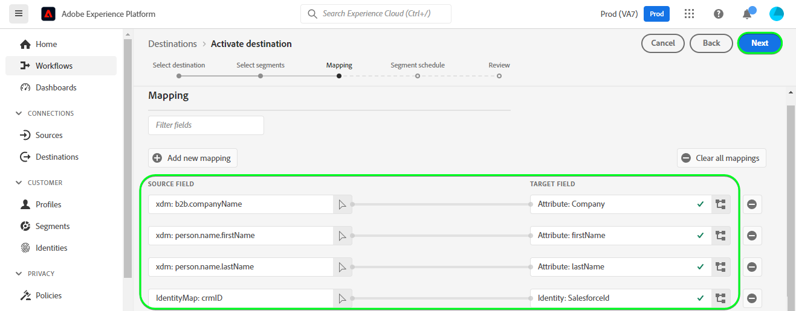

# [!DNL Salesforce CRM] conexión

## Información general {#overview}

[[!DNL Salesforce CRM]](https://www.salesforce.com/crm/) es una popular plataforma de administración de la relación con los clientes (CRM) y admite los tipos de perfiles que se describen a continuación:

* [Posibles clientes](https://developer.salesforce.com/docs/atlas.en-us.object_reference.meta/object_reference/sforce_api_objects_lead.htm) - Un posible cliente es el nombre de una persona o empresa que puede (o no) estar interesada en los productos o servicios que vende.
* [Contactos](https://developer.salesforce.com/docs/atlas.en-us.object_reference.meta/object_reference/sforce_api_objects_contact.htm) - Un contacto es una persona con la que uno de sus representantes ha establecido una relación y ha sido calificado como cliente potencial.

Esta [!DNL Adobe Experience Platform] [destino](/help/destinations/home.md) aprovecha el [[!DNL Salesforce composite API]](https://developer.salesforce.com/docs/atlas.en-us.api_rest.meta/api_rest/resources_composite_sobjects_collections_update.htm), que admite ambos tipos de perfiles descritos anteriormente.

Cuándo [activar segmentos](#activate), puede seleccionar entre posibles clientes o contactos y actualizar los atributos y los datos de audiencia en [!DNL Salesforce CRM].

[!DNL Salesforce CRM] utiliza OAuth 2 con concesión de contraseña como mecanismo de autenticación para comunicarse con la API de REST de Salesforce. Instrucciones para autenticarse en su [!DNL Salesforce CRM] más abajo, en la sección [Autenticar en el destino](#authenticate) sección.

## Casos de uso {#use-cases}

Como experto en marketing, puede ofrecer experiencias personalizadas a los usuarios en función de los atributos de sus perfiles de Adobe Experience Platform. Puede crear audiencias a partir de los datos sin conexión y enviarlas a Salesforce CRM para actualizar la pertenencia a CRM en cuanto se actualicen las audiencias y los perfiles en Adobe Experience Platform.

## Requisitos previos {#prerequisites}

### Requisitos previos en Experience Platform {#prerequisites-in-experience-platform}

Antes de activar datos en el destino de Salesforce CRM, debe tener un [esquema](/help/xdm/schema/composition.md), a [conjunto de datos](https://experienceleague.adobe.com/docs/platform-learn/tutorials/data-ingestion/create-datasets-and-ingest-data.html?lang=es), y [segmentos](https://experienceleague.adobe.com/docs/platform-learn/tutorials/segments/create-segments.html) creado en [!DNL Experience Platform].

### Requisitos previos en [!DNL Salesforce CRM] {#prerequisites-destination}

Tenga en cuenta los siguientes requisitos previos [!DNL Salesforce CRM], para exportar datos de Platform a su cuenta de Salesforce:

#### Necesita tener un [!DNL Salesforce] account {#prerequisites-account}

Vaya a la [!DNL Salesforce] [prueba](https://www.salesforce.com/in/form/signup/freetrial-sales/) página para registrarse y crear una [!DNL Salesforce] cuenta, si aún no dispone de una.

#### Configuración de una aplicación conectada en [!DNL Salesforce] {#prerequisites-connected-app}

En primer lugar, debe configurar una [[!DNL Salesforce] aplicación conectada](https://help.salesforce.com/s/articleView?id=sf.connected_app_create.htm&amp;language=en_US&amp;r=https%3A%2F%2Fhelp.salesforce.com%2F&amp;type=5) dentro de su [!DNL Salesforce] cuenta, si aún no dispone de una. [!DNL Salesforce CRM] aprovechará la aplicación conectada para conectarse a [!DNL Salesforce].

A continuación, habilite [!DNL OAuth Settings for API Integration] para el [!DNL Salesforce connected app]. Consulte la [[!DNL Salesforce]](https://help.salesforce.com/s/articleView?id=connected_app_create_api_integration.htm&amp;type=5&amp;language=en_US) documentación para obtener instrucciones.

Además, asegúrese de que las variables [ámbitos](https://help.salesforce.com/s/articleView?id=connected_app_create_api_integration.htm&amp;type=5&amp;language=en_US) Las que se mencionan a continuación están seleccionadas para la [!DNL Salesforce connected app].

* ``chatter_api``
* ``lightning``
* ``visualforce``
* ``content``
* ``openid``
* ``full``
* ``api``
* ``web``
* ``refresh_token``
* ``offline_access``

Por último, asegúrese de que la variable `password` la concesión está habilitada dentro de su [!DNL Salesforce] cuenta. Consulte la [!DNL Salesforce] [Flujo de nombre de usuario y contraseña de OAuth 2.0 para escenarios especiales](https://help.salesforce.com/s/articleView?id=sf.remoteaccess_oauth_username_password_flow.htm&amp;type=5) documentación de si necesita ayuda.

>[!IMPORTANT]
>
>Si su [!DNL Salesforce] El administrador de la cuenta ha restringido el acceso a rangos de IP de confianza. Debe ponerse en contacto con ellos para obtener [IP del Experience Platform](/help/destinations/catalog/streaming/ip-address-allow-list.md) incluido en la lista de permitidos. Consulte la [!DNL Salesforce] [Restringir el acceso a intervalos de IP fiables para una aplicación conectada](https://help.salesforce.com/s/articleView?id=sf.connected_app_edit_ip_ranges.htm&amp;type=5) documentación de si necesita instrucciones adicionales.

#### Creación de campos personalizados dentro de [!DNL Salesforce] {#prerequisites-custom-field}

Al activar audiencias en [!DNL Salesforce CRM] destino, debe introducir un valor en la variable **[!UICONTROL ID de asignación]** para cada audiencia activada, en el campo **[Programación de audiencia](#schedule-segment-export-example)** paso.

[!DNL Salesforce CRM] requiere este valor para leer e interpretar correctamente las audiencias que llegan desde Experience Platform y actualizar su estado de audiencia en [!DNL Salesforce]. Consulte la documentación del Experience Platform para [Grupo de campos de esquema Detalles de pertenencia a audiencia](/help/xdm/field-groups/profile/segmentation.md) si necesita orientación sobre los estados de audiencia.

Para cada audiencia que active desde Platform a [!DNL Salesforce CRM], debe crear un campo personalizado del tipo `Text Area (Long)` dentro [!DNL Salesforce]. Puede definir la longitud de caracteres de campo de cualquier tamaño entre 256 y 131 072 caracteres según sus necesidades comerciales. Consulte la [!DNL Salesforce] [Tipos de campos personalizados](https://help.salesforce.com/s/articleView?id=sf.custom_field_types.htm&amp;type=5) para obtener más información sobre los tipos de campos personalizados. Consulte también la [!DNL Salesforce] documentación para [crear campos personalizados](https://help.salesforce.com/s/articleView?id=mc_cab_create_an_attribute.htm&amp;type=5&amp;language=en_US) si necesita ayuda para la creación de campos.

>[!IMPORTANT]
>
>No incluya espacios en blanco en el nombre del campo. En su lugar, utilice el guion bajo `(_)` como separador.
>En [!DNL Salesforce] debe crear campos personalizados con una **[!UICONTROL Nombre de campo]** que coincide exactamente con el valor especificado en **[!UICONTROL ID de asignación]** para cada segmento de Platform activado. Por ejemplo, la captura de pantalla siguiente muestra un campo personalizado denominado `crm_2_seg`. Al activar una audiencia en este destino, añada `crm_2_seg` as **[!UICONTROL ID de asignación]** para rellenar audiencias de audiencia de Experience Platform en este campo personalizado.

Ejemplo de creación de campos personalizados en [!DNL Salesforce], *Paso 1: Selección del tipo de datos*, se muestra a continuación:

Ejemplo de creación de campos personalizados en [!DNL Salesforce], *Paso 2: Introduzca los detalles del campo personalizado*, se muestra a continuación:

>[!TIP]
>
>* Para distinguir entre campos personalizados utilizados para audiencias de Platform y otros campos personalizados dentro de [!DNL Salesforce] puede incluir un prefijo o un sufijo reconocible al crear el campo personalizado. Por ejemplo, en lugar de `test_segment`, use `Adobe_test_segment` o `test_segment_Adobe`
>* Si ya ha creado otros campos personalizados en [!DNL Salesforce], puede utilizar el mismo nombre que el segmento de Platform para identificar fácilmente la audiencia en [!DNL Salesforce].

>[!NOTE]
>
>* Los objetos de Salesforce están restringidos a 25 campos externos. Consulte [Atributos de campo personalizados](https://help.salesforce.com/s/articleView?id=sf.custom_field_attributes.htm&amp;type=5).
>* Esta restricción implica que solo puede tener un máximo de 25 suscripciones a la audiencia de Experience Platform activas en cualquier momento.
>* Si ha alcanzado este límite en Salesforce, debe eliminar de Salesforce los atributos personalizados que se utilizaron para almacenar el estado de audiencia en audiencias antiguas de Experience Platform antes que una nueva **[!UICONTROL ID de asignación]** se puede utilizar.

#### Reunir [!DNL Salesforce CRM] credenciales {#gather-credentials}

Tenga en cuenta los elementos siguientes antes de autenticarse en el [!DNL Salesforce CRM] destino:

| Credencial | Descripción | Ejemplo |
| --- | --- | --- |
| `Username` | Su [!DNL Salesforce] nombre de usuario de cuenta. | |
| `Password` | Su [!DNL Salesforce] contraseña de la cuenta. | |
| `Security Token` | Su [!DNL Salesforce] token de seguridad que adjuntará más adelante al final de su [!DNL Salesforce] Contraseña para crear una cadena concatenada para utilizarla como **[!UICONTROL Contraseña]** cuando [autenticación en el destino](#authenticate).  Consulte la [!DNL Salesforce] documentación para [restablecer el token de seguridad](https://help.salesforce.com/s/articleView?id=sf.user_security_token.htm&amp;type=5) para aprender a regenerarlo desde el [!DNL Salesforce] si no dispone del token de seguridad. |  |
| `Custom Domain` | Su [!DNL Salesforce] prefijo de dominio.   Consulte la [[!DNL Salesforce] documentación](https://help.salesforce.com/s/articleView?id=sf.domain_name_setting_login_policy.htm&amp;type=5) para obtener información sobre cómo obtener este valor de [!DNL Salesforce] interfaz. | Si su [!DNL Salesforce] el dominio es  *`d5i000000isb4eak-dev-ed`.my.salesforce.com*,  usted necesitará `d5i000000isb4eak-dev-ed` como el valor. |
| `Client ID` | Su Salesforce `Consumer Key`.   Consulte la [[!DNL Salesforce] documentación](https://help.salesforce.com/s/articleView?id=sf.connected_app_rotate_consumer_details.htm&amp;type=5) para obtener información sobre cómo obtener este valor de [!DNL Salesforce] interfaz. | |
| `Client Secret` | Su Salesforce `Consumer Secret`.   Consulte la [[!DNL Salesforce] documentación](https://help.salesforce.com/s/articleView?id=sf.connected_app_rotate_consumer_details.htm&amp;type=5) para obtener información sobre cómo obtener este valor de [!DNL Salesforce] interfaz. | |

### Mecanismos de protección {#guardrails}

[!DNL Salesforce] equilibra las cargas de transacción mediante la imposición de límites de solicitud, tasa y tiempo de espera. Consulte la [Límites y asignaciones de solicitudes de API](https://developer.salesforce.com/docs/atlas.en-us.salesforce_app_limits_cheatsheet.meta/salesforce_app_limits_cheatsheet/salesforce_app_limits_platform_api.htm) para obtener más información.

Si su [!DNL Salesforce] el administrador de la cuenta ha impuesto restricciones de IP, deberá agregar lo siguiente [Direcciones IP del Experience Platform](/help/destinations/catalog/streaming/ip-address-allow-list.md) a su [!DNL Salesforce] rangos de IP de confianza de las cuentas. Consulte la [!DNL Salesforce] [Restringir el acceso a intervalos de IP fiables para una aplicación conectada](https://help.salesforce.com/s/articleView?id=sf.connected_app_edit_ip_ranges.htm&amp;type=5) documentación de si necesita instrucciones adicionales.

>[!IMPORTANT]
>
>Cuándo [activar segmentos](#activate) debe seleccionar entre *Contacto* o *Posible cliente* tipos. Debe asegurarse de que las audiencias tengan la asignación de datos adecuada según el tipo seleccionado.

## Identidades admitidas {#supported-identities}

[!DNL Salesforce CRM] admite la actualización de identidades que se describe en la tabla siguiente. Más información sobre [identidades](/help/identity-service/namespaces.md).

| Identidad de destino | Descripción | Consideraciones |
|---|---|---|
| `SalesforceId` | El [!DNL Salesforce CRM] identificador de las identidades de contacto o posible cliente que exporta o actualiza a través del segmento. | Obligatorio |

## Tipo y frecuencia de exportación {#export-type-frequency}

Consulte la tabla siguiente para obtener información sobre el tipo y la frecuencia de exportación de destino.

| Elemento | Tipo | Notas |
---------|----------|---------|
| Tipo de exportación | **[!UICONTROL Basado en perfiles]** | <ul><li>Está exportando todos los miembros de un segmento, junto con los campos de esquema deseados *(por ejemplo: dirección de correo electrónico, número de teléfono, apellidos)*, según la asignación de campo.</li><li> Cada estado de audiencia en [!DNL Salesforce CRM] se actualiza con el estado de audiencia correspondiente de Platform, en función de la variable **[!UICONTROL ID de asignación]** valor proporcionado durante la [programación de audiencia](#schedule-segment-export-example) paso.</li></ul> |
| Frecuencia de exportación | **[!UICONTROL Transmisión]** | <ul><li>Los destinos de streaming son conexiones basadas en API &quot;siempre activadas&quot;. Tan pronto como se actualiza un perfil en Experience Platform según la evaluación de audiencias, el conector envía la actualización de forma descendente a la plataforma de destino. Más información sobre [destinos de streaming](/help/destinations/destination-types.md#streaming-destinations).</li></ul> |

{style="table-layout:auto"}

## Conexión al destino {#connect}

>[!IMPORTANT]
>
>Para conectarse al destino, necesita el **[!UICONTROL Administrar destinos]** [permiso de control de acceso](/help/access-control/home.md#permissions). Lea el [información general de control de acceso](/help/access-control/ui/overview.md) o póngase en contacto con el administrador del producto para obtener los permisos necesarios.

Para conectarse a este destino, siga los pasos descritos en la sección [tutorial de configuración de destino](../../ui/connect-destination.md). En el flujo de trabajo de configuración de destino, rellene los campos enumerados en las dos secciones siguientes.

En **[!UICONTROL Destinos]** > **[!UICONTROL Catálogo]** buscar [!DNL Salesforce CRM]. También puede encontrarlo en la sección **[!UICONTROL CRM]** categoría.

### Autenticarse en el destino {#authenticate}

Para autenticarse en el destino, rellene los campos obligatorios a continuación y seleccione **[!UICONTROL Conectar con destino]**. Consulte la [Reunir [!DNL Salesforce CRM] credenciales](#gather-credentials) para obtener cualquier guía.
| Credencial | Descripción | | — | — | | **[!UICONTROL Nombre de usuario]** | Su [!DNL Salesforce] nombre de usuario de cuenta. | | **[!UICONTROL Contraseña]** | Una cadena concatenada compuesta por su [!DNL Salesforce] contraseña de la cuenta adjunta a su [!DNL Salesforce] Token de seguridad. El valor concatenado adopta la forma de `{PASSWORD}{TOKEN}`.  Tenga en cuenta que no utilice llaves ni espacios. Por ejemplo, si su [!DNL Salesforce] La contraseña es `MyPa$$w0rd123` y [!DNL Salesforce] El token de seguridad es `TOKEN12345....0000`, el valor concatenado que utilizará en el **[!UICONTROL Contraseña]** el campo es `MyPa$$w0rd123TOKEN12345....0000`. | | **[!UICONTROL Dominio personalizado]** | Su [!DNL Salesforce] prefijo de dominio.  Por ejemplo, si el dominio es *`d5i000000isb4eak-dev-ed`.my.salesforce.com*, debe proporcionar lo siguiente `d5i000000isb4eak-dev-ed` como el valor. | | **[!UICONTROL ID de cliente]** | Su [!DNL Salesforce] aplicación conectada `Consumer Key`. | | **[!UICONTROL Secreto del cliente]** | Su [!DNL Salesforce] aplicación conectada `Consumer Secret`. |

Si los detalles proporcionados son válidos, la interfaz de usuario muestra un **[!UICONTROL Conectado]** estado con una marca de verificación verde, puede continuar con el siguiente paso.

### Rellenar detalles de destino {#destination-details}

Para configurar los detalles del destino, rellene los campos obligatorios y opcionales a continuación. Un asterisco junto a un campo en la interfaz de usuario indica que el campo es obligatorio.
* **[!UICONTROL Nombre]**: Un nombre con el que reconocerá este destino en el futuro.
* **[!UICONTROL Descripción]**: Una descripción que le ayudará a identificar este destino en el futuro.
* **[!UICONTROL Tipo de ID de Salesforce]**:
   * Seleccionar **[!UICONTROL Contacto]** si las identidades que desea exportar o actualizar son del tipo *Contacto*.
   * Seleccionar **[!UICONTROL Posible cliente]** si las identidades que desea exportar o actualizar son del tipo *Posible cliente*.

### Habilitar alertas {#enable-alerts}

Puede activar alertas para recibir notificaciones sobre el estado del flujo de datos a su destino. Seleccione una alerta de la lista a la que suscribirse para recibir notificaciones sobre el estado del flujo de datos. Para obtener más información sobre las alertas, consulte la guía de [suscripción a alertas de destinos mediante la IU](../../ui/alerts.md).

Cuando haya terminado de proporcionar detalles para la conexión de destino, seleccione **[!UICONTROL Siguiente]**.

## Activar públicos en este destino {#activate}

>[!IMPORTANT]
> 
>* Para activar los datos, necesita el **[!UICONTROL Administrar destinos]**, **[!UICONTROL Activar destinos]**, **[!UICONTROL Ver perfiles]**, y **[!UICONTROL Ver segmentos]** [permisos de control de acceso](/help/access-control/home.md#permissions). Lea el [información general de control de acceso](/help/access-control/ui/overview.md) o póngase en contacto con el administrador del producto para obtener los permisos necesarios.
>* Para exportar *identidades*, necesita el **[!UICONTROL Ver gráfico de identidad]** [permiso de control de acceso](/help/access-control/home.md#permissions).   {width="100" zoomable="yes"}

Leer [Activación de perfiles y audiencias en destinos de exportación de audiencia de streaming](/help/destinations/ui/activate-segment-streaming-destinations.md) para obtener instrucciones sobre cómo activar audiencias en este destino.

### Consideraciones sobre asignación y ejemplo {#mapping-considerations-example}

Para enviar correctamente los datos de audiencia de Adobe Experience Platform a [!DNL Salesforce CRM] destino, debe ir a través del paso de asignación de campos. La asignación consiste en crear un vínculo entre los campos de esquema del Modelo de datos de experiencia (XDM) en la cuenta de Platform y sus equivalentes correspondientes desde el destino de destino.

Atributos especificados en la variable **[!UICONTROL Campo de destino]** debe tener exactamente el nombre descrito en la tabla de asignaciones de atributos, ya que estos atributos formarán el cuerpo de la solicitud.

Atributos especificados en la variable **[!UICONTROL Campo de origen]** no siga ninguna de estas restricciones. Puede asignarlo en función de sus necesidades, pero asegúrese de que el formato de los datos de entrada sea válido según el [[!DNL Salesforce] documentación](https://help.salesforce.com/s/articleView?id=sf.custom_field_attributes.htm&amp;type=5). Si los datos de entrada no son válidos, la llamada de actualización a [!DNL Salesforce] fallará y sus contactos o posibles clientes no se actualizarán.

Para asignar correctamente los campos XDM a [!DNL (API) Salesforce CRM] campos de destino, siga estos pasos:

1. En el **[!UICONTROL Asignación]** paso, seleccione **[!UICONTROL Añadir nueva asignación]**, verá una nueva fila de asignación en la pantalla.
   
1. En el **[!UICONTROL Seleccionar campo de origen]** , seleccione la **[!UICONTROL Seleccionar atributos]** y seleccione el atributo XDM o elija el **[!UICONTROL Seleccionar área de nombres de identidad]** y seleccione una identidad.
1. En el **[!UICONTROL Seleccionar campo de destino]** , seleccione la **[!UICONTROL Seleccionar área de nombres de identidad]** y seleccione una identidad o elija **[!UICONTROL Seleccionar atributos personalizados]** y seleccione un atributo o defina uno con la variable **[!UICONTROL Nombre de atributo]** según sea necesario. Consulte la [[!DNL Salesforce CRM] documentación](https://help.salesforce.com/s/articleView?id=sf.custom_field_attributes.htm&amp;type=5) para obtener instrucciones sobre los atributos admitidos.
   * Repita estos pasos para agregar las siguientes asignaciones entre el esquema de perfil XDM y [!DNL (API) Salesforce CRM]:

   **Trabajar con contactos**

   * Si está trabajando con *Contactos* dentro del segmento, consulte la Referencia de objeto en Salesforce para [Contacto](https://developer.salesforce.com/docs/atlas.en-us.object_reference.meta/object_reference/sforce_api_objects_contact.htm) para definir asignaciones para los campos que se van a actualizar.
   * Puede identificar los campos obligatorios buscando la palabra *Requerido*, que se menciona en las descripciones de los campos en el vínculo anterior.
   * Según los campos que desee exportar o actualizar, agregue asignaciones entre el esquema de perfil XDM y [!DNL (API) Salesforce CRM]: Notas de |Campo de origen|Campo de destino| | | — | — | — | |`IdentityMap: crmID`|`Identity: SalesforceId`|`Mandatory`| |`xdm: person.name.lastName`|`Attribute: LastName`| `Mandatory`. Apellidos del contacto de hasta 80 caracteres. |\
     |`xdm: person.name.firstName`|`Attribute: FirstName`| El nombre del contacto puede tener hasta 40 caracteres. | |`xdm: personalEmail.address`|`Attribute: Email`| La dirección de correo electrónico del contacto. |

   * A continuación se muestra un ejemplo con estas asignaciones:
     

   **Uso de posibles clientes**

   * Si está trabajando con *Posibles clientes* dentro del segmento, consulte la Referencia de objeto en Salesforce para [Posible cliente](https://developer.salesforce.com/docs/atlas.en-us.object_reference.meta/object_reference/sforce_api_objects_lead.htm) para definir asignaciones para los campos que se van a actualizar.
   * Puede identificar los campos obligatorios buscando la palabra *Requerido*, que se menciona en las descripciones de los campos en el vínculo anterior.
   * Según los campos que desee exportar o actualizar, agregue asignaciones entre el esquema de perfil XDM y [!DNL (API) Salesforce CRM]: Notas de |Campo de origen|Campo de destino| | | — | — | — | |`IdentityMap: crmID`|`Identity: SalesforceId`|`Mandatory`| |`xdm: person.name.lastName`|`Attribute: LastName`| `Mandatory`. Apellidos del posible cliente de hasta 80 caracteres. |\
     |`xdm: b2b.companyName`|`Attribute: Company`| `Mandatory`. La compañía del líder. | |`xdm: personalEmail.address`|`Attribute: Email`| La dirección de correo electrónico del posible cliente. |

   * A continuación se muestra un ejemplo con estas asignaciones:
     

Cuando haya terminado de proporcionar las asignaciones para la conexión de destino, seleccione **[!UICONTROL Siguiente]**.

### Programar exportación de audiencias y ejemplo {#schedule-segment-export-example}

Al realizar la [Programar exportación de audiencias](/help/destinations/ui/activate-segment-streaming-destinations.md#scheduling) Este paso requiere asignar manualmente las audiencias activadas desde Platform a su campo personalizado correspondiente en [!DNL Salesforce].

Para ello, seleccione cada segmento y, a continuación, introduzca el nombre del campo personalizado en [!DNL Salesforce] en el [!DNL Salesforce CRM] **[!UICONTROL ID de asignación]** field. Consulte la [Creación de campos personalizados dentro de [!DNL Salesforce]](#prerequisites-custom-field) para obtener instrucciones y prácticas recomendadas sobre la creación de campos personalizados en [!DNL Salesforce].

Por ejemplo, si su [!DNL Salesforce] el campo personalizado es `crm_2_seg`, especifique este valor en [!DNL Salesforce CRM] **[!UICONTROL ID de asignación]** para rellenar audiencias de audiencia de Experience Platform en este campo personalizado.

Un campo personalizado de ejemplo de [!DNL Salesforce] se muestra a continuación:
![[!DNL Salesforce] Captura de pantalla de IU que muestra el campo personalizado.](../../assets/catalog/crm/salesforce/salesforce-custom-field.png)

Ejemplo que indica la ubicación del [!DNL Salesforce CRM] **[!UICONTROL ID de asignación]** se muestra a continuación:

Como se muestra arriba, [!DNL Salesforce] **[!UICONTROL Nombre de campo]** coincide exactamente con el valor especificado en [!DNL Salesforce CRM] **[!UICONTROL ID de asignación]**.

Según el caso de uso, todas las audiencias activadas se pueden asignar a la misma [!DNL Salesforce] campo personalizado o a diferentes **[!UICONTROL Nombre de campo]** in [!DNL Salesforce CRM]. Un ejemplo típico basado en la imagen mostrada arriba podría ser.
| [!DNL Salesforce CRM] nombre del segmento | [!DNL Salesforce] **[!UICONTROL Nombre de campo]** | [!DNL Salesforce CRM] **[!UICONTROL ID de asignación]** | | — | — | — | | crm_1_seg | `crm_1_seg` | `crm_1_seg` | | crm_2_seg | `crm_2_seg` | `crm_2_seg` |

Repita esta sección para cada segmento de Platform activado.

## Validar exportación de datos {#exported-data}

Para comprobar que ha configurado correctamente el destino, siga los pasos a continuación:

1. Seleccionar **[!UICONTROL Destinos]** > **[!UICONTROL Examinar]** para ir a la lista de destinos.
   

1. Seleccione el destino y valide que el estado es **[!UICONTROL activado]**.
   

1. Cambie a la **[!UICONTROL Datos de activación]** y, a continuación, seleccione un nombre de audiencia.
   

1. Monitorice el resumen de audiencia y asegúrese de que el recuento de perfiles corresponde al recuento creado dentro del segmento.
   

1. Finalmente, inicie sesión en el sitio web de Salesforce y valide si los perfiles de la audiencia se han agregado o actualizado.

   **Trabajar con contactos**

   * Si ha seleccionado *Contactos* en el segmento de Platform, vaya a **[!DNL Apps]** > **[!DNL Contacts]** página.
     

   * Seleccione una *Contacto* y compruebe si los campos se han actualizado. Puede ver que cada estado de la audiencia en [!DNL Salesforce CRM] se ha actualizado con el estado de audiencia correspondiente de Platform, según el **[!UICONTROL ID de asignación]** valor proporcionado durante la [programación de audiencia](#schedule-segment-export-example).
     

   **Uso de posibles clientes**

   * Si ha seleccionado *Posibles clientes* en el segmento de Platform y, a continuación, vaya a **[!DNL Apps]** > **[!DNL Leads]** página.
     

   * Seleccione una *Posible cliente* y compruebe si los campos se han actualizado. Puede ver que cada estado de la audiencia en [!DNL Salesforce CRM] se ha actualizado con el estado de audiencia correspondiente de Platform, según el **[!UICONTROL ID de asignación]** valor proporcionado durante la [programación de audiencia](#schedule-segment-export-example).
     

## Uso de datos y gobernanza {#data-usage-governance}

Todo [!DNL Adobe Experience Platform] Los destinos de cumplen con las políticas de uso de datos al gestionar los datos. Para obtener información detallada sobre cómo [!DNL Adobe Experience Platform] aplica la gobernanza de datos. Consulte la [Resumen de gobernanza de datos](/help/data-governance/home.md).

## Errores y solución de problemas {#errors-and-troubleshooting}

### Se detectaron errores desconocidos al insertar eventos en el destino {#unknown-errors}

* Al comprobar la ejecución de un flujo de datos, puede encontrar el siguiente mensaje de error: `Unknown errors encountered while pushing events to the destination. Please contact the administrator and try again.`
  

   * Para corregir este error, compruebe que la variable **[!UICONTROL ID de asignación]** que ha proporcionado en el flujo de trabajo de activación a la [!DNL Salesforce CRM] el destino coincide exactamente con el valor del tipo de campo personalizado que ha creado en [!DNL Salesforce]. Consulte la [Creación de campos personalizados dentro de [!DNL Salesforce]](#prerequisites-custom-field) para obtener instrucciones.

* Al activar un segmento, puede obtener un mensaje de error: `The client's IP address is unauthorized for this account. Allowlist the client's IP address...`
   * Para solucionar este error, póngase en contacto con su [!DNL Salesforce] administrador de cuentas que agregar [Direcciones IP del Experience Platform](/help/destinations/catalog/streaming/ip-address-allow-list.md) a su [!DNL Salesforce] rangos de IP de confianza de las cuentas. Consulte la [!DNL Salesforce] [Restringir el acceso a intervalos de IP fiables para una aplicación conectada](https://help.salesforce.com/s/articleView?id=sf.connected_app_edit_ip_ranges.htm&amp;type=5) documentación de si necesita instrucciones adicionales.

## Recursos adicionales {#additional-resources}

Información útil adicional del [Portal para desarrolladores de Salesforce](https://developer.salesforce.com/) se muestra a continuación:
* [Introducción](https://developer.salesforce.com/docs/atlas.en-us.api_rest.meta/api_rest/quickstart.htm)
* [Crear un registro](https://developer.salesforce.com/docs/atlas.en-us.api_rest.meta/api_rest/dome_sobject_create.htm)
* [Audiencias de recomendaciones personalizadas](https://developer.salesforce.com/docs/atlas.en-us.236.0.chatterapi.meta/chatterapi/connect_resources_recommendation_audiences_list.htm)
* [Uso de recursos compuestos](https://developer.salesforce.com/docs/atlas.en-us.api_rest.meta/api_rest/using_composite_resources.htm?q=composite)
* Este destino aprovecha el [Actualización de varios registros](https://developer.salesforce.com/docs/atlas.en-us.api_rest.meta/api_rest/resources_composite_sobjects_collections_update.htm) API en lugar de [Actualizar registro único](https://developer.salesforce.com/docs/atlas.en-us.api_rest.meta/api_rest/dome_composite_upsert_example.htm?q=contacts) Llamada de API.