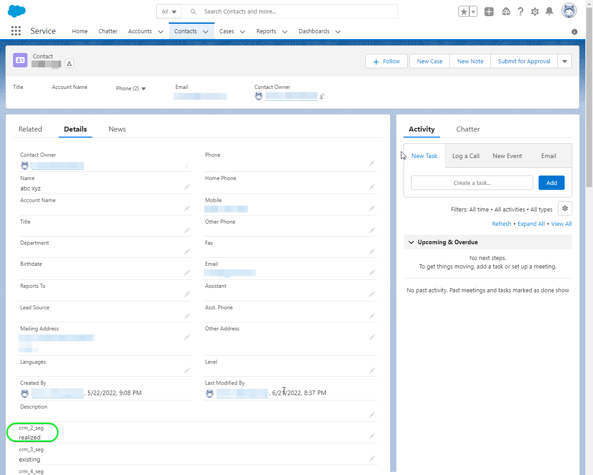

# [!DNL Salesforce CRM] connection

## Información general {#overview}

[[!DNL Salesforce CRM]](https://www.salesforce.com/crm/) es una plataforma popular de administración de la relación con los clientes (CRM) y es compatible con lo siguiente:

* [Posibles clientes](https://developer.salesforce.com/docs/atlas.en-us.object_reference.meta/object_reference/sforce_api_objects_lead.htm) - Un posible cliente es el nombre de una persona o empresa que puede (o no) estar interesada en los productos o servicios que vende.
* [Contactos](https://developer.salesforce.com/docs/atlas.en-us.object_reference.meta/object_reference/sforce_api_objects_contact.htm) - Un contacto es una persona con la que uno de sus representantes ha establecido una relación y ha sido calificado como cliente potencial.

Esta [!DNL Adobe Experience Platform] [destino](/help/destinations/home.md) aprovecha el [[!DNL Salesforce composite API]](https://developer.salesforce.com/docs/atlas.en-us.api_rest.meta/api_rest/resources_composite_sobjects_collections_update.htm), que admite ambos tipos de perfiles descritos anteriormente.

When [activación de segmentos](#activate), puede seleccionar entre posibles clientes o contactos y actualizar atributos y segmentar datos en [!DNL Salesforce CRM].

[!DNL Salesforce CRM] utiliza OAuth 2 con Concesión de contraseña como mecanismo de autenticación para comunicarse con la API de REST de Salesforce. Instrucciones para autenticarse en su [!DNL Salesforce CRM] más abajo, en la [Autenticar en destino](#authenticate) para obtener más información.

## Casos de uso {#use-cases}

Como especialista en marketing, puede ofrecer experiencias personalizadas a los usuarios en función de los atributos de sus perfiles de Adobe Experience Platform. Puede generar segmentos a partir de los datos sin conexión y enviarlos a Salesforce CRM para que se muestren en las fuentes de los usuarios en cuanto los segmentos y perfiles se actualicen en Adobe Experience Platform.

## Requisitos previos {#prerequisites}

### Requisitos previos en el Experience Platform {#prerequisites-in-experience-platform}

Antes de activar los datos en el destino de Salesforce CRM, debe tener una [esquema](/help/xdm/schema/composition.md), [conjunto de datos](https://experienceleague.adobe.com/docs/platform-learn/tutorials/data-ingestion/create-datasets-and-ingest-data.html?lang=en)y [segmentos](https://experienceleague.adobe.com/docs/platform-learn/tutorials/segments/create-segments.html?lang=en) creado en [!DNL Experience Platform].

### Requisitos previos en [!DNL Salesforce CRM] {#prerequisites-destination}

Tenga en cuenta los siguientes requisitos previos en [!DNL Salesforce CRM], para exportar datos de Platform a su cuenta de Salesforce:

#### Debe tener un [!DNL Salesforce] account {#prerequisites-account}

Vaya a la [!DNL Salesforce] [prueba](https://www.salesforce.com/in/form/signup/freetrial-sales/) página para registrar y crear una [!DNL Salesforce] cuenta, si todavía no tiene una.

#### Configurar una aplicación conectada dentro de [!DNL Salesforce] {#prerequisites-connected-app}

En primer lugar, debe configurar un [[!DNL Salesforce] aplicación conectada](https://help.salesforce.com/s/articleView?id=sf.connected_app_create.htm&amp;language=en_US&amp;r=https%3A%2F%2Fhelp.salesforce.com%2F&amp;type=5) dentro de su [!DNL Salesforce] cuenta, si todavía no tiene una. [!DNL Salesforce CRM] aprovechará la aplicación conectada a la que se conecta [!DNL Salesforce].

A continuación, active [!DNL OAuth Settings for API Integration] para el [!DNL Salesforce connected app]. Consulte la [[!DNL Salesforce]](https://help.salesforce.com/s/articleView?id=connected_app_create_api_integration.htm&amp;type=5&amp;language=en_US) documentación para obtener instrucciones.

Además, asegúrese de que la variable [ámbitos](https://help.salesforce.com/s/articleView?id=connected_app_create_api_integration.htm&amp;type=5&amp;language=en_US) se seleccionan para la variable [!DNL Salesforce connected app].

* ``chatter_api``
* ``lightning``
* ``visualforce``
* ``content``
* ``openid``
* ``full``
* ``api``
* ``web``
* ``refresh_token``
* ``offline_access``

Por último, asegúrese de que la variable `password` la concesión está habilitada dentro de su [!DNL Salesforce] cuenta. Consulte la [!DNL Salesforce] [Flujo de nombre de usuario y contraseña de OAuth 2.0 para escenarios especiales](https://help.salesforce.com/s/articleView?id=sf.remoteaccess_oauth_username_password_flow.htm&amp;type=5) documentación si necesita ayuda.

>[!IMPORTANT]
>
>Si su [!DNL Salesforce] el administrador de la cuenta tiene acceso restringido a rangos de IP de confianza, debe ponerse en contacto con ellos para obtener [IP del Experience Platform](/help/destinations/catalog/streaming/ip-address-allow-list.md) incluido en la lista de permitidos. Consulte la [!DNL Salesforce] [Restringir el acceso a intervalos de IP de confianza para una aplicación conectada](https://help.salesforce.com/s/articleView?id=sf.connected_app_edit_ip_ranges.htm&amp;type=5) documentación si necesita orientación adicional.

#### Cree campos personalizados dentro de [!DNL Salesforce] {#prerequisites-custom-field}

Al activar segmentos en la variable [!DNL Salesforce CRM] destino, debe introducir un valor en la variable **[!UICONTROL ID de asignación]** para cada segmento activado, en la variable **[Programación de segmentos](#schedule-segment-export-example)** paso a paso.

[!DNL Salesforce CRM] requiere que este valor lea e interprete correctamente los segmentos que llegan del Experience Platform y que actualice su estado de segmento en [!DNL Salesforce]. Consulte la documentación del Experience Platform para [Grupo de campos de esquema Detalles de pertenencia a segmentos](/help/xdm/field-groups/profile/segmentation.md) si necesita instrucciones sobre los estados de los segmentos.

Para cada segmento que active de Platform a [!DNL Salesforce CRM], debe crear un campo personalizado del tipo `Text Area (Long)` en [!DNL Salesforce]. Puede definir la longitud del carácter de campo de cualquier tamaño entre 256 y 131.072 caracteres según sus necesidades comerciales. Consulte la [!DNL Salesforce] [Tipos de campos personalizados](https://help.salesforce.com/s/articleView?id=sf.custom_field_types.htm&amp;type=5) página de documentación para obtener información adicional sobre los tipos de campo personalizados. Consulte también [!DNL Salesforce] documentación para [crear campos personalizados](https://help.salesforce.com/s/articleView?id=mc_cab_create_an_attribute.htm&amp;type=5&amp;language=en_US) si necesita asistencia para la creación de campos.

>[!IMPORTANT]
>
>No incluya caracteres de espacio en blanco en el nombre del campo. En su lugar, utilice el guión bajo `(_)` como separador.
>Within [!DNL Salesforce] debe crear campos personalizados con un **[!UICONTROL Nombre del campo]** que coincida exactamente con el valor especificado en **[!UICONTROL ID de asignación]** para cada segmento de Platform activado. Por ejemplo, la captura de pantalla siguiente muestra un campo personalizado llamado `crm_2_seg`. Al activar un segmento en este destino, agregue `crm_2_seg` como **[!UICONTROL ID de asignación]** para rellenar audiencias de segmento de Experience Platform en este campo personalizado.

Ejemplo de creación de campos personalizados en [!DNL Salesforce], *Paso 1: Selección del tipo de datos*, se muestra a continuación:

Ejemplo de creación de campos personalizados en [!DNL Salesforce], *Paso 2: Introduzca los detalles del campo personalizado*, se muestra a continuación:

>[!TIP]
>
>* Para distinguir entre campos personalizados utilizados para segmentos de Platform y otros campos personalizados dentro de [!DNL Salesforce] puede incluir un prefijo o sufijo reconocible al crear el campo personalizado. Por ejemplo, en lugar de `test_segment`, use `Adobe_test_segment` o `test_segment_Adobe`
>* Si ya tiene otros campos personalizados creados en [!DNL Salesforce], puede utilizar el mismo nombre que el segmento de Platform para identificar fácilmente el segmento en [!DNL Salesforce].

>[!NOTE]
>
>* Los objetos de Salesforce están restringidos a 25 campos externos, consulte [Atributos de campo personalizados](https://help.salesforce.com/s/articleView?id=sf.custom_field_attributes.htm&amp;type=5).
>* Esta restricción implica que solo puede tener un máximo de 25 miembros de segmentos de Experience Platform activos en cualquier momento.
>* Si ha alcanzado este límite en Salesforce, debe eliminar los atributos personalizados de Salesforce que se utilizaron para almacenar el estado del segmento en segmentos antiguos dentro de Experience Platform antes de crear un **[!UICONTROL ID de asignación]** se puede usar.

#### Recopilar [!DNL Salesforce CRM] credenciales {#gather-credentials}

Tenga en cuenta los elementos siguientes antes de autenticarse en la variable [!DNL Salesforce CRM] destino:

| Credencial | Descripción | Ejemplo |
| --- | --- | --- |
| `Username` | Su [!DNL Salesforce] nombre de usuario de la cuenta. |  |
| `Password` | Su [!DNL Salesforce] contraseña de la cuenta. |  |
| `Security Token` | Su [!DNL Salesforce] token de seguridad que adjuntará más adelante al final de su [!DNL Salesforce] Contraseña para crear una cadena concatenada que se utilizará como **[!UICONTROL Contraseña]** when [autenticarse en el destino](#authenticate).  Consulte la [!DNL Salesforce] documentación para [restablecer el token de seguridad](https://help.salesforce.com/s/articleView?id=sf.user_security_token.htm&amp;type=5) para aprender a regenerarla desde el [!DNL Salesforce] si no tiene el token de seguridad. |  |
| `Custom Domain` | Su [!DNL Salesforce] prefijo de dominio.   Consulte la [[!DNL Salesforce] documentación](https://help.salesforce.com/s/articleView?id=sf.domain_name_setting_login_policy.htm&amp;type=5) para obtener este valor de la variable [!DNL Salesforce] interfaz. | Si su [!DNL Salesforce] el dominio es  *`d5i000000isb4eak-dev-ed`.my.salesforce.com*,  necesitará `d5i000000isb4eak-dev-ed` como valor. |
| `Client ID` | Su Salesforce `Consumer Key`.   Consulte la [[!DNL Salesforce] documentación](https://help.salesforce.com/s/articleView?id=sf.connected_app_rotate_consumer_details.htm&amp;type=5) para obtener este valor de la variable [!DNL Salesforce] interfaz. |  |
| `Client Secret` | Su Salesforce `Consumer Secret`.   Consulte la [[!DNL Salesforce] documentación](https://help.salesforce.com/s/articleView?id=sf.connected_app_rotate_consumer_details.htm&amp;type=5) para obtener este valor de la variable [!DNL Salesforce] interfaz. |  |

### Mecanismos de protección {#guardrails}

[!DNL Salesforce] equilibra las cargas de transacciones imponiendo límites de solicitud, tasa y tiempo de espera. Consulte la [Límites y asignaciones de solicitudes de API](https://developer.salesforce.com/docs/atlas.en-us.salesforce_app_limits_cheatsheet.meta/salesforce_app_limits_cheatsheet/salesforce_app_limits_platform_api.htm) para obtener más información.

Si su [!DNL Salesforce] el administrador de la cuenta ha impuesto restricciones de IP, deberá agregar [Direcciones IP del Experience Platform](/help/destinations/catalog/streaming/ip-address-allow-list.md) a su [!DNL Salesforce] rangos de IP de confianza de las cuentas. Consulte la [!DNL Salesforce] [Restringir el acceso a intervalos de IP de confianza para una aplicación conectada](https://help.salesforce.com/s/articleView?id=sf.connected_app_edit_ip_ranges.htm&amp;type=5) documentación si necesita orientación adicional.

>[!IMPORTANT]
>
>When [activación de segmentos](#activate) debe seleccionar entre *Contacto* o *Posible cliente* tipos. Debe asegurarse de que los segmentos tengan la asignación de datos adecuada según el tipo seleccionado.

## Identidades compatibles {#supported-identities}

[!DNL Salesforce CRM] admite la actualización de identidades descritas en la siguiente tabla. Más información sobre [identidades](/help/identity-service/namespaces.md).

| Identidad de Target | Descripción | Consideraciones |
|---|---|---|
| `SalesforceId` | La variable [!DNL Salesforce CRM] identificador de las identidades de contacto o posible cliente que exporta o actualiza a través del segmento. | Obligatorio |

## Tipo de exportación y frecuencia {#export-type-frequency}

Consulte la tabla siguiente para obtener información sobre el tipo y la frecuencia de exportación de destino.

| Elemento | Tipo | Notas |
---------|----------|---------|
| Tipo de exportación | **[!UICONTROL Basado en perfiles]** | <ul><li>Está exportando todos los miembros de un segmento, junto con los campos de esquema deseados *(por ejemplo: dirección de correo electrónico, número de teléfono, apellidos)*, según la asignación de campos.</li><li> Cada estado de segmento en [!DNL Salesforce CRM] se actualiza con el estado del segmento correspondiente de Platform, en función de la variable **[!UICONTROL ID de asignación]** valor proporcionado durante el [programación de segmentos](#schedule-segment-export-example) paso a paso.</li></ul> |
| Frecuencia de exportación | **[!UICONTROL Transmisión]** | <ul><li>Los destinos de flujo continuo son conexiones basadas en API &quot;siempre activadas&quot;. Tan pronto como un perfil se actualiza en el Experience Platform en función de la evaluación de segmentos, el conector envía la actualización descendente a la plataforma de destino. Más información sobre [destinos de flujo continuo](/help/destinations/destination-types.md#streaming-destinations).</li></ul> |

{style=&quot;table-layout:auto&quot;}

## Conectarse al destino {#connect}

>[!IMPORTANT]
>
>Para conectarse al destino, necesita la variable **[!UICONTROL Administrar destinos]** [permiso de control de acceso](/help/access-control/home.md#permissions). Lea el [información general sobre el control de acceso](/help/access-control/ui/overview.md) o póngase en contacto con el administrador del producto para obtener los permisos necesarios.

Para conectarse a este destino, siga los pasos descritos en la sección [tutorial de configuración de destino](../../ui/connect-destination.md). En el flujo de trabajo de configuración de destino, rellene los campos que aparecen en las dos secciones siguientes.

Within **[!UICONTROL Destinos]** > **[!UICONTROL Catálogo]** buscar [!DNL Salesforce CRM]. También puede localizarlo en la sección **[!UICONTROL CRM]** categoría.

### Autenticar en destino {#authenticate}

Para autenticarse en el destino, rellene los campos obligatorios a continuación y seleccione **[!UICONTROL Conectarse al destino]**. Consulte la [Recopilar [!DNL Salesforce CRM] credenciales](#gather-credentials) para obtener más información.
| Credencial | Descripción | | — | — | | **[!UICONTROL Nombre de usuario]** | Su [!DNL Salesforce] nombre de usuario de la cuenta. | | **[!UICONTROL Contraseña]** | Una cadena concatenada compuesta por [!DNL Salesforce] la contraseña de la cuenta adjunta a su [!DNL Salesforce] Token de seguridad. El valor concatenado adopta la forma de `{PASSWORD}{TOKEN}`.  Tenga en cuenta que no utilice llaves ni espacios. Por ejemplo, si su [!DNL Salesforce] La contraseña es `MyPa$$w0rd123` y [!DNL Salesforce] El token de seguridad es `TOKEN12345....0000`, el valor concatenado que utilizará en la variable **[!UICONTROL Contraseña]** el campo es `MyPa$$w0rd123TOKEN12345....0000`. | | **[!UICONTROL Dominio personalizado]** | Su [!DNL Salesforce] prefijo de dominio.  Por ejemplo, si su dominio es *`d5i000000isb4eak-dev-ed`.my.salesforce.com*, debe proporcionar `d5i000000isb4eak-dev-ed` como valor. | | **[!UICONTROL ID de cliente]** | Su [!DNL Salesforce] aplicación conectada `Consumer Key`. | | **[!UICONTROL Secreto del cliente]** | Su [!DNL Salesforce] aplicación conectada `Consumer Secret`. |

Si los detalles proporcionados son válidos, la interfaz de usuario muestra un **[!UICONTROL Conectado]** con una marca de verificación verde, puede continuar con el siguiente paso.

### Rellenar detalles de destino {#destination-details}

Para configurar los detalles del destino, rellene los campos opcionales y requeridos a continuación. Un asterisco junto a un campo en la interfaz de usuario indica que el campo es obligatorio.
* **[!UICONTROL Nombre]**: Un nombre por el cual reconocerá este destino en el futuro.
* **[!UICONTROL Descripción]**: Descripción que le ayudará a identificar este destino en el futuro.
* **[!UICONTROL Tipo de ID de Salesforce]**:
   * Select **[!UICONTROL Contacto]** si las identidades que desea exportar o actualizar son del tipo *Contacto*.
   * Select **[!UICONTROL Posible cliente]** si las identidades que desea exportar o actualizar son del tipo *Posible cliente*.

### Habilitar alertas {#enable-alerts}

Puede activar las alertas para recibir notificaciones sobre el estado del flujo de datos a su destino. Seleccione una alerta de la lista para suscribirse y recibir notificaciones sobre el estado de su flujo de datos. Para obtener más información sobre las alertas, consulte la guía de [suscripción a alertas de destinos mediante la interfaz de usuario](../../ui/alerts.md).

Cuando haya terminado de proporcionar detalles para la conexión de destino, seleccione **[!UICONTROL Siguiente]**.

## Activar segmentos en este destino {#activate}

>[!IMPORTANT]
>
>Para activar los datos, necesita la variable **[!UICONTROL Administrar destinos]**, **[!UICONTROL Activar destinos]**, **[!UICONTROL Ver perfiles]** y **[!UICONTROL Ver segmentos]** [permisos de control de acceso](/help/access-control/home.md#permissions). Lea el [información general sobre el control de acceso](/help/access-control/ui/overview.md) o póngase en contacto con el administrador del producto para obtener los permisos necesarios.

Lectura [Activar perfiles y segmentos en destinos de exportación de segmentos de flujo continuo](/help/destinations/ui/activate-segment-streaming-destinations.md) para obtener instrucciones sobre la activación de segmentos de audiencia en este destino.

### Consideraciones de asignación y ejemplo {#mapping-considerations-example}

Para enviar correctamente los datos de audiencia de Adobe Experience Platform a [!DNL Salesforce CRM] destino, debe pasar por el paso de asignación de campos. La asignación consiste en la creación de un vínculo entre los campos de esquema del Modelo de datos de experiencia (XDM) en la cuenta de Platform y sus equivalentes correspondientes desde el destino de destino.

Los atributos especificados en la variable **[!UICONTROL Campo de destino]** debe llamarse exactamente como se describe en la tabla de asignaciones de atributos, ya que estos atributos formarán el cuerpo de la solicitud.

Los atributos especificados en la variable **[!UICONTROL Campo de origen]** no seguir ninguna restricción de este tipo. Puede asignarlo según sus necesidades. Sin embargo, asegúrese de que el formato de los datos de entrada sea válido según la variable [[!DNL Salesforce] documentación](https://help.salesforce.com/s/articleView?id=sf.custom_field_attributes.htm&amp;type=5). Si los datos de entrada no son válidos, la llamada de actualización a [!DNL Salesforce] fallará y sus contactos/posibles clientes no se actualizarán.

Para asignar correctamente los campos XDM a la variable [!DNL (API) Salesforce CRM] campos de destino, siga estos pasos:

1. En el **[!UICONTROL Asignación]** paso, seleccione **[!UICONTROL Añadir nueva asignación]**, verá una nueva fila de asignación en la pantalla .
   
1. En el **[!UICONTROL Seleccionar campo de origen]** , seleccione **[!UICONTROL Seleccionar atributos]** y seleccione el atributo XDM o elija el **[!UICONTROL Seleccionar área de nombres de identidad]** y seleccione una identidad.
1. En el **[!UICONTROL Seleccionar campo de destino]** , seleccione **[!UICONTROL Seleccionar área de nombres de identidad]** y seleccione una identidad o elija **[!UICONTROL Seleccionar atributos personalizados]** y seleccione un atributo o defina uno utilizando **[!UICONTROL Nombre del atributo]** como sea necesario. Consulte la [[!DNL Salesforce CRM] documentación](https://help.salesforce.com/s/articleView?id=sf.custom_field_attributes.htm&amp;type=5) para obtener instrucciones sobre los atributos admitidos.
   * Repita estos pasos para añadir las siguientes asignaciones entre el esquema de perfil XDM y [!DNL (API) Salesforce CRM]:

   **Uso de contactos**

   * Si está trabajando con *Contactos* dentro del segmento, consulte la Referencia de objeto en Salesforce para [Contacto](https://developer.salesforce.com/docs/atlas.en-us.object_reference.meta/object_reference/sforce_api_objects_contact.htm) para definir asignaciones para los campos que se van a actualizar.
   * Puede identificar los campos obligatorios buscando la palabra *Requerido*, que se menciona en las descripciones de campo en el vínculo anterior.
   * En función de los campos que desee exportar o actualizar, agregue asignaciones entre el esquema de perfil XDM y [!DNL (API) Salesforce CRM]: |Campo de origen|Campo de destino| Notas | | — | — | — | |`IdentityMap: crmID`|`Identity: SalesforceId`|`Mandatory`| |`xdm: person.name.lastName`|`Attribute: LastName`| `Mandatory`. Apellido del contacto de hasta 80 caracteres. |\
      |`xdm: person.name.firstName`|`Attribute: FirstName`| Nombre del contacto de hasta 40 caracteres. | |`xdm: personalEmail.address`|`Attribute: Email`| La dirección de correo electrónico del contacto. |

   * A continuación se muestra un ejemplo con estas asignaciones:
      

   **Uso de posibles clientes**

   * Si está trabajando con *Posibles clientes* dentro del segmento, consulte la Referencia de objeto en Salesforce para [Posible cliente](https://developer.salesforce.com/docs/atlas.en-us.object_reference.meta/object_reference/sforce_api_objects_lead.htm) para definir asignaciones para los campos que se van a actualizar.
   * Puede identificar los campos obligatorios buscando la palabra *Requerido*, que se menciona en las descripciones de campo en el vínculo anterior.
   * En función de los campos que desee exportar o actualizar, agregue asignaciones entre el esquema de perfil XDM y [!DNL (API) Salesforce CRM]: |Campo de origen|Campo de destino| Notas | | — | — | — | |`IdentityMap: crmID`|`Identity: SalesforceId`|`Mandatory`| |`xdm: person.name.lastName`|`Attribute: LastName`| `Mandatory`. Apellido del posible cliente de hasta 80 caracteres. |\
      |`xdm: b2b.companyName`|`Attribute: Company`| `Mandatory`. La compañía del líder. | |`xdm: personalEmail.address`|`Attribute: Email`| La dirección de correo electrónico del posible cliente. |

   * A continuación se muestra un ejemplo con estas asignaciones:
      

Cuando haya terminado de proporcionar las asignaciones para la conexión de destino, seleccione **[!UICONTROL Siguiente]**.

### Programar exportación de segmentos y ejemplo {#schedule-segment-export-example}

Al realizar el [Programar exportación de segmentos](/help/destinations/ui/activate-segment-streaming-destinations.md#scheduling) paso debe asignar manualmente segmentos activados desde Platform a su campo personalizado correspondiente en [!DNL Salesforce].

Para ello, seleccione cada segmento e introduzca el nombre del campo personalizado de [!DNL Salesforce] en el [!DNL Salesforce CRM] **[!UICONTROL ID de asignación]** campo . Consulte la [Cree campos personalizados dentro de [!DNL Salesforce]](#prerequisites-custom-field) para obtener instrucciones y prácticas recomendadas sobre la creación de campos personalizados en [!DNL Salesforce].

Por ejemplo, si su [!DNL Salesforce] el campo personalizado es `crm_2_seg`, especifique este valor en la variable [!DNL Salesforce CRM] **[!UICONTROL ID de asignación]** para rellenar audiencias de segmento de Experience Platform en este campo personalizado.

Un campo personalizado de ejemplo de [!DNL Salesforce] se muestra a continuación:
![[!DNL Salesforce] Captura de pantalla de la interfaz de usuario que muestra el campo personalizado.](../../assets/catalog/crm/salesforce/salesforce-custom-field.png)

Ejemplo que indica la ubicación de la variable [!DNL Salesforce CRM] **[!UICONTROL ID de asignación]** se muestra a continuación:

Como se muestra arriba, la variable [!DNL Salesforce] **[!UICONTROL Nombre del campo]** coincide exactamente con el valor especificado en [!DNL Salesforce CRM] **[!UICONTROL ID de asignación]**.

Según el caso de uso, todos los segmentos activados se pueden asignar al mismo [!DNL Salesforce] campo personalizado o a diferente **[!UICONTROL Nombre del campo]** en [!DNL Salesforce CRM]. Podría ser un ejemplo típico basado en la imagen mostrada arriba.
| [!DNL Salesforce CRM] nombre del segmento | [!DNL Salesforce] **[!UICONTROL Nombre del campo]** | [!DNL Salesforce CRM] **[!UICONTROL ID de asignación]** | | — | — | — | | crm_1_seg | `crm_1_seg` | `crm_1_seg` | | crm_2_seg | `crm_2_seg` | `crm_2_seg` |

Repita esta sección para cada segmento de Platform activado.

## Validación de la exportación de datos {#exported-data}

Para validar que ha configurado correctamente el destino, siga los pasos a continuación:

1. Select **[!UICONTROL Destinos]** > **[!UICONTROL Examinar]** para navegar a la lista de destinos.
   

1. Seleccione el destino y valide que el estado es **[!UICONTROL enabled]**.
   

1. Cambie a la **[!UICONTROL Datos de activación]** y, a continuación, seleccione un nombre de segmento.
   

1. Monitorice el resumen del segmento y asegúrese de que el recuento de perfiles corresponde al recuento creado dentro del segmento.
   

1. Finalmente, inicie sesión en el sitio web de Salesforce y valide si los perfiles del segmento se han agregado o actualizado.

   **Uso de contactos**

   * Si ha seleccionado *Contactos* dentro del segmento Plataforma , vaya a la **[!DNL Apps]** > **[!DNL Contacts]** página.
      

   * Seleccione un *Contacto* y compruebe si los campos se actualizan. Puede ver cada estado de segmento en [!DNL Salesforce CRM] se actualizó con el estado del segmento correspondiente de Platform, en función de la variable **[!UICONTROL ID de asignación]** valor proporcionado durante el [programación de segmentos](#schedule-segment-export-example).
      

   **Uso de posibles clientes**

   * Si ha seleccionado *Posibles clientes* dentro del segmento Plataforma y, a continuación, vaya a la **[!DNL Apps]** > **[!DNL Leads]** página.
      

   * Seleccione un *Posible cliente* y compruebe si los campos se actualizan. Puede ver cada estado de segmento en [!DNL Salesforce CRM] se actualizó con el estado del segmento correspondiente de Platform, en función de la variable **[!UICONTROL ID de asignación]** valor proporcionado durante el [programación de segmentos](#schedule-segment-export-example).
      

## Uso y gobernanza de los datos {#data-usage-governance}

Todo [!DNL Adobe Experience Platform] Los destinos de cumplen las políticas de uso de datos al administrar los datos. Para obtener información detallada sobre cómo [!DNL Adobe Experience Platform] exige el control de datos; consulte [Información general sobre la administración de datos](/help/data-governance/home.md).

## Errores y solución de problemas {#errors-and-troubleshooting}

### Se han encontrado errores desconocidos al insertar eventos en el destino {#unknown-errors}

* Al comprobar la ejecución de un flujo de datos, podría encontrar el siguiente mensaje de error: `Unknown errors encountered while pushing events to the destination. Please contact the administrator and try again.`

   

   * Para solucionar este error, compruebe que la variable **[!UICONTROL ID de asignación]** que proporcionó en el flujo de trabajo de activación para la variable [!DNL Salesforce CRM] el destino coincide exactamente con el valor del tipo de campo personalizado creado en [!DNL Salesforce]. Consulte la [Cree campos personalizados dentro de [!DNL Salesforce]](#prerequisites-custom-field) para obtener más información.

* Al activar un segmento, puede obtener un mensaje de error: `The client's IP address is unauthorized for this account. Allowlist the client's IP address...`
   * Para solucionar este error, póngase en contacto con su [!DNL Salesforce] administrador de cuentas para agregar [Direcciones IP del Experience Platform](/help/destinations/catalog/streaming/ip-address-allow-list.md) a su [!DNL Salesforce] rangos de IP de confianza de las cuentas. Consulte la [!DNL Salesforce] [Restringir el acceso a intervalos de IP de confianza para una aplicación conectada](https://help.salesforce.com/s/articleView?id=sf.connected_app_edit_ip_ranges.htm&amp;type=5) documentación si necesita orientación adicional.

## Recursos adicionales {#additional-resources}

Información útil adicional de [Portal para desarrolladores de Salesforce](https://developer.salesforce.com/) a continuación:
* [Introducción](https://developer.salesforce.com/docs/atlas.en-us.api_rest.meta/api_rest/quickstart.htm)
* [Crear un registro](https://developer.salesforce.com/docs/atlas.en-us.api_rest.meta/api_rest/dome_sobject_create.htm)
* [Audiencias de recomendación personalizadas](https://developer.salesforce.com/docs/atlas.en-us.236.0.chatterapi.meta/chatterapi/connect_resources_recommendation_audiences_list.htm)
* [Uso de recursos compuestos](https://developer.salesforce.com/docs/atlas.en-us.api_rest.meta/api_rest/using_composite_resources.htm?q=composite)
* Este destino aprovecha el [Actualizar varios registros](https://developer.salesforce.com/docs/atlas.en-us.api_rest.meta/api_rest/resources_composite_sobjects_collections_update.htm) en lugar de [Actualizar registro único](https://developer.salesforce.com/docs/atlas.en-us.api_rest.meta/api_rest/dome_composite_upsert_example.htm?q=contacts) Llamada de API.