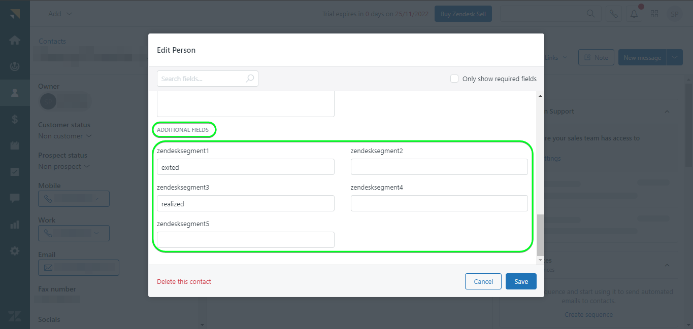

# [!DNL Zendesk] conexión

[[!DNL Zendesk]](https://www.zendesk.com) es una solución de servicio al cliente y una herramienta de ventas.

Esta [!DNL Adobe Experience Platform] [destino](/help/destinations/home.md) aprovecha el [[!DNL Zendesk] API de contactos](https://developer.zendesk.com/api-reference/sales-crm/resources/contacts/), a **creación y actualización de identidades** dentro de una audiencia como contactos dentro de [!DNL Zendesk].

[!DNL Zendesk] utiliza tokens de portador como mecanismo de autenticación para comunicarse con el [!DNL Zendesk] API de contactos. Instrucciones para autenticarse en su [!DNL Zendesk] más abajo, en la sección [Autenticar en el destino](#authenticate) sección.

## Casos de uso {#use-cases}

El departamento de servicio al cliente de una plataforma B2C multicanal quiere garantizar una experiencia personalizada sin problemas para sus clientes. El departamento puede crear audiencias a partir de sus propios datos sin conexión para crear nuevos perfiles de usuario o actualizar la información de perfil existente de diferentes interacciones (por ejemplo, compras, devoluciones, etc.) y enviar estas audiencias de Adobe Experience Platform a [!DNL Zendesk]. Tener la información actualizada en [!DNL Zendesk] garantiza que el agente de servicio al cliente tenga la información reciente del cliente disponible inmediatamente, lo que permite respuestas y resolución más rápidas.

## Requisitos previos {#prerequisites}

### Requisitos previos del Experience Platform {#prerequisites-in-experience-platform}

Antes de activar los datos en [!DNL Zendesk] destino, debe tener un [esquema](/help/xdm/schema/composition.md), a [conjunto de datos](https://experienceleague.adobe.com/docs/platform-learn/tutorials/data-ingestion/create-datasets-and-ingest-data.html?lang=es), y [segmentos](https://experienceleague.adobe.com/docs/platform-learn/tutorials/segments/create-segments.html) creado en [!DNL Experience Platform].

Consulte la documentación del Experience Platform para [Grupo de campos de esquema Detalles de pertenencia a audiencia](/help/xdm/field-groups/profile/segmentation.md) si necesita orientación sobre los estados de audiencia.

### [!DNL Zendesk] requisitos previos {#prerequisites-destination}

Para exportar datos de Platform a su [!DNL Zendesk] cuenta necesita tener un [!DNL Zendesk] cuenta.

#### Reunir [!DNL Zendesk] credenciales {#gather-credentials}

Tenga en cuenta los elementos siguientes antes de autenticarse en el [!DNL Zendesk] destino:

| Credencial | Descripción | Ejemplo |
| --- | --- | --- |
| `Bearer token` | El token de acceso que ha generado en su [!DNL Zendesk] cuenta.   Siga la documentación para [generar un [!DNL Zendesk] token de acceso](https://developer.zendesk.com/documentation/sales-crm/first-call/#1-generate-an-access-token) si no tiene uno. | `a0b1c2d3e4...v20w21x22y23z` |

## Mecanismos de protección {#guardrails}

El [Precios y límites de tarifa](https://developer.zendesk.com/api-reference/sales-crm/rate-limits/#pricing) La página detalla [!DNL Zendesk] Límites de API asociados a su cuenta. Debe asegurarse de que los datos y la carga útil se encuentren dentro de estas restricciones.

## Identidades admitidas {#supported-identities}

[!DNL Zendesk] admite la actualización de identidades que se describe en la tabla siguiente. Más información sobre [identidades](/help/identity-service/namespaces.md).

| Identidad de destino | Ejemplo | Descripción | Obligatorio |
|---|---|---|---|
| `email` | `test@test.com` | Dirección de correo electrónico del contacto. | Sí |

## Tipo y frecuencia de exportación {#export-type-frequency}

Consulte la tabla siguiente para obtener información sobre el tipo y la frecuencia de exportación de destino.

| Elemento | Tipo | Notas |
---------|----------|---------|
| Tipo de exportación | **[!UICONTROL Basado en perfiles]** | <ul><li>Está exportando todos los miembros de un segmento, junto con los campos de esquema deseados *(por ejemplo: dirección de correo electrónico, número de teléfono, apellidos)*, según la asignación de campo.</li><li> Cada estado del segmento en [!DNL Zendesk] se actualiza con el estado de audiencia correspondiente de Platform, en función de la variable **[!UICONTROL ID de asignación]** valor proporcionado durante la [programación de audiencia](#schedule-segment-export-example) paso.</li></ul> |
| Frecuencia de exportación | **[!UICONTROL Transmisión]** | <ul><li>Los destinos de streaming son conexiones basadas en API &quot;siempre activadas&quot;. Tan pronto como se actualiza un perfil en Experience Platform según la evaluación de audiencias, el conector envía la actualización de forma descendente a la plataforma de destino. Más información sobre [destinos de streaming](/help/destinations/destination-types.md#streaming-destinations).</li></ul> |

{style="table-layout:auto"}

## Conexión al destino {#connect}

>[!IMPORTANT]
>
>Para conectarse al destino, necesita el **[!UICONTROL Ver destinos]** y **[!UICONTROL Administrar destinos]** [permisos de control de acceso](/help/access-control/home.md#permissions). Lea el [información general de control de acceso](/help/access-control/ui/overview.md) o póngase en contacto con el administrador del producto para obtener los permisos necesarios.

Para conectarse a este destino, siga los pasos descritos en la sección [tutorial de configuración de destino](../../ui/connect-destination.md). En el flujo de trabajo de configuración de destino, rellene los campos enumerados en las dos secciones siguientes.

En **[!UICONTROL Destinos]** > **[!UICONTROL Catálogo]** buscar [!DNL Zendesk]. También puede encontrarlo en la sección **[!UICONTROL CRM]** categoría.

### Autenticarse en el destino {#authenticate}

Rellene los campos obligatorios siguientes. Consulte la [Reunir [!DNL Zendesk] credenciales](#gather-credentials) para obtener cualquier guía.
* **[!UICONTROL Token de portador]**: El token de acceso que ha generado en su [!DNL Zendesk] cuenta.

Para autenticarse en el destino, seleccione **[!UICONTROL Conectar con destino]**.

Si los detalles proporcionados son válidos, la interfaz de usuario muestra un **[!UICONTROL Conectado]** estado con una marca de verificación verde. A continuación, puede continuar con el paso siguiente.

### Rellenar detalles de destino {#destination-details}

Para configurar los detalles del destino, rellene los campos obligatorios y opcionales a continuación. Un asterisco junto a un campo en la interfaz de usuario indica que el campo es obligatorio.

* **[!UICONTROL Nombre]**: Un nombre con el que reconocerá este destino en el futuro.
* **[!UICONTROL Descripción]**: Una descripción que le ayudará a identificar este destino en el futuro.

### Habilitar alertas {#enable-alerts}

Puede activar alertas para recibir notificaciones sobre el estado del flujo de datos a su destino. Seleccione una alerta de la lista a la que suscribirse para recibir notificaciones sobre el estado del flujo de datos. Para obtener más información sobre las alertas, consulte la guía de [suscripción a alertas de destinos mediante la IU](../../ui/alerts.md).

Cuando haya terminado de proporcionar detalles para la conexión de destino, seleccione **[!UICONTROL Siguiente]**.

## Activar públicos en este destino {#activate}

>[!IMPORTANT]
> 
>* Para activar los datos, necesita el **[!UICONTROL Ver destinos]**, **[!UICONTROL Activar destinos]**, **[!UICONTROL Ver perfiles]**, y **[!UICONTROL Ver segmentos]** [permisos de control de acceso](/help/access-control/home.md#permissions). Lea el [información general de control de acceso](/help/access-control/ui/overview.md) o póngase en contacto con el administrador del producto para obtener los permisos necesarios.
>* Para exportar *identidades*, necesita el **[!UICONTROL Ver gráfico de identidad]** [permiso de control de acceso](/help/access-control/home.md#permissions).   {width="100" zoomable="yes"}

Leer [Activación de perfiles y audiencias en destinos de exportación de audiencia de streaming](/help/destinations/ui/activate-segment-streaming-destinations.md) para obtener instrucciones sobre cómo activar audiencias en este destino.

### Consideraciones sobre asignación y ejemplo {#mapping-considerations-example}

Para enviar correctamente los datos de audiencia de Adobe Experience Platform a [!DNL Zendesk] destino, debe ir a través del paso de asignación de campos. La asignación consiste en crear un vínculo entre los campos de esquema del Modelo de datos de experiencia (XDM) en la cuenta de Platform y sus equivalentes correspondientes desde el destino de destino.

Atributos especificados en la variable **[!UICONTROL Campo de destino]** debe tener exactamente el nombre descrito en la tabla de asignaciones de atributos, ya que estos atributos formarán el cuerpo de la solicitud.

Atributos especificados en la variable **[!UICONTROL Campo de origen]** no siga ninguna de estas restricciones. Puede asignarlo según sus necesidades, pero si el formato de datos no es correcto cuando se inserta en [!DNL Zendesk] se producirá un error.

Para asignar correctamente los campos XDM a [!DNL Zendesk] campos de destino, siga estos pasos:

1. En el **[!UICONTROL Asignación]** paso, seleccione **[!UICONTROL Añadir nueva asignación]**. Verá una nueva fila de asignación en la pantalla.
1. En el **[!UICONTROL Seleccionar campo de origen]** , seleccione la **[!UICONTROL Seleccionar atributos]** y seleccione el atributo XDM o elija el **[!UICONTROL Seleccionar área de nombres de identidad]** y seleccione una identidad.
1. En el **[!UICONTROL Seleccionar campo de destino]** , seleccione la **[!UICONTROL Seleccionar área de nombres de identidad]** y seleccione una identidad de destino o elija la **[!UICONTROL Seleccionar atributos]** y seleccione uno de los atributos de esquema admitidos.
   * Repita estos pasos para agregar las siguientes asignaciones obligatorias, también puede agregar cualquier otro atributo que desee actualizar entre el esquema de perfil XDM y su [!DNL Zendesk] instancia: |Campo de origen|Campo de destino| Obligatorio| |—|—|—| |`xdm: person.name.lastName`|`xdm: last_name`| Sí | |`IdentityMap: Email`|`Identity: email`| Sí | |`xdm: person.name.firstName`|`xdm: first_name`| |

   * A continuación se muestra un ejemplo con estas asignaciones:
     

>[!IMPORTANT]
>
>El `Attribute: last_name` y `Identity: email` las asignaciones de destino son obligatorias para este destino. Si faltan estas asignaciones, se ignorarán las demás asignaciones y no se enviarán a [!DNL Zendesk].

Cuando haya terminado de proporcionar las asignaciones para la conexión de destino, seleccione **[!UICONTROL Siguiente]**.

### Programar exportación de audiencias y ejemplo {#schedule-segment-export-example}

En el [[!UICONTROL Programar exportación de audiencias]](/help/destinations/ui/activate-segment-streaming-destinations.md#scheduling) del flujo de trabajo de activación, debe asignar manualmente las audiencias de Platform al atributo de campo personalizado en [!DNL Zendesk].

Para ello, seleccione cada segmento e introduzca el atributo de campo personalizado correspondiente en [!DNL Zendesk] en el **[!UICONTROL ID de asignación]** field.

A continuación se muestra un ejemplo:

## Validar exportación de datos {#exported-data}

Para comprobar que ha configurado correctamente el destino, siga los pasos a continuación:

1. Seleccionar **[!UICONTROL Destinos]** > **[!UICONTROL Examinar]** y vaya a la lista de destinos.
1. A continuación, seleccione el destino y cambie a **[!UICONTROL Datos de activación]** y, a continuación, seleccione un nombre de audiencia.
   

1. Monitorice el resumen de audiencia y asegúrese de que el recuento de perfiles corresponde al recuento dentro del segmento.
   

1. Inicie sesión en [!DNL Zendesk] sitio web y, a continuación, vaya al **[!UICONTROL Contactos]** para comprobar si se han añadido los perfiles de la audiencia. Esta lista se puede configurar para mostrar columnas para los campos adicionales creados con la audiencia**[!UICONTROL ID de asignación]** y estados de audiencia.
   

1. También puede explorar en profundidad un individuo **[!UICONTROL Persona]** y marque la **[!UICONTROL Campos adicionales]** que muestra el nombre y los estados de la audiencia.
   

## Uso de datos y gobernanza {#data-usage-governance}

Todo [!DNL Adobe Experience Platform] Los destinos de cumplen con las políticas de uso de datos al gestionar los datos. Para obtener información detallada sobre cómo [!DNL Adobe Experience Platform] aplica la gobernanza de datos. Consulte la [Resumen de gobernanza de datos](/help/data-governance/home.md).

## Recursos adicionales {#additional-resources}

Información útil adicional del [!DNL Zendesk] Esta documentación es:
* [Realización de la primera llamada](https://developer.zendesk.com/documentation/sales-crm/first-call/)
* [Campos personalizados](https://developer.zendesk.com/api-reference/sales-crm/requests/#custom-fields)

### Changelog

Esta sección recoge la funcionalidad y las actualizaciones significativas de la documentación realizadas en este conector de destino.

+++ Ver registro de cambios

| Mes de lanzamiento | Tipo de actualización | Descripción |
|---|---|---|
| Abril de 2023 | Actualización de documentación | <ul><li>Hemos actualizado la [casos de uso](#use-cases) con un ejemplo más claro de cuándo se beneficiarían los clientes de utilizar este destino.</li> <li>Hemos actualizado la [asignación](#mapping-considerations-example) para reflejar las asignaciones correctas necesarias. El `Attribute: last_name` y `Identity: email` las asignaciones de destino son obligatorias para este destino. Si faltan estas asignaciones, se ignorarán las demás asignaciones y no se enviarán a [!DNL Zendesk].</li> <li>Hemos actualizado la [asignación](#mapping-considerations-example) con ejemplos claros de asignaciones obligatorias y opcionales.</li></ul> |
| Marzo de 2023 | Versión inicial | Versión de destino inicial y publicación de documentación. |

{style="table-layout:auto"}

+++
