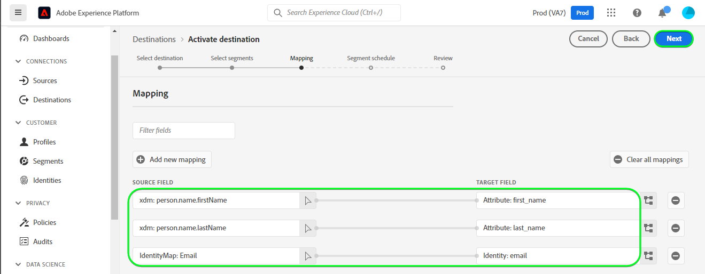

# [!DNL Zendesk] connection

[[!DNL Zendesk]](https://www.zendesk.com) es una solución de servicio al cliente y una herramienta de ventas.

Esta [!DNL Adobe Experience Platform] [destino](/help/destinations/home.md) aprovecha el [[!DNL Zendesk] API de contactos](https://developer.zendesk.com/api-reference/sales-crm/resources/contacts/), a **crear y actualizar identidades** dentro de un segmento como contactos dentro de [!DNL Zendesk].

[!DNL Zendesk] utiliza tokens de portador como mecanismo de autenticación para comunicarse con el [!DNL Zendesk] API de contactos. Instrucciones para autenticarse en su [!DNL Zendesk] más abajo, en la [Autenticar en destino](#authenticate) para obtener más información.

## Casos de uso {#use-cases}

El departamento de servicio al cliente de una plataforma B2C multicanal quiere garantizar una experiencia personalizada sin fisuras para sus clientes. El departamento puede generar segmentos a partir de sus propios datos sin conexión para crear nuevos perfiles de usuario o actualizar la información de perfil existente a partir de diferentes interacciones (por ejemplo, compras, devoluciones, etc.) y envíe estos segmentos desde Adobe Experience Platform a [!DNL Zendesk]. Tener la información actualizada en [!DNL Zendesk] garantiza que el agente de servicio al cliente disponga de la información reciente del cliente inmediatamente disponible, lo que permite obtener respuestas y una resolución más rápidas.

## Requisitos previos {#prerequisites}

### Requisitos previos del Experience Platform {#prerequisites-in-experience-platform}

Antes de activar los datos en la variable [!DNL Zendesk] destino, debe tener un [esquema](/help/xdm/schema/composition.md), [conjunto de datos](https://experienceleague.adobe.com/docs/platform-learn/tutorials/data-ingestion/create-datasets-and-ingest-data.html?lang=en)y [segmentos](https://experienceleague.adobe.com/docs/platform-learn/tutorials/segments/create-segments.html?lang=en) creado en [!DNL Experience Platform].

Consulte la documentación del Experience Platform para [Grupo de campos de esquema Detalles de pertenencia a segmentos](/help/xdm/field-groups/profile/segmentation.md) si necesita instrucciones sobre los estados de los segmentos.

### [!DNL Zendesk] requisitos previos {#prerequisites-destination}

Para exportar datos de Platform a su [!DNL Zendesk] cuenta que necesita tener una [!DNL Zendesk] cuenta.

#### Recopilar [!DNL Zendesk] credenciales {#gather-credentials}

Tenga en cuenta los elementos siguientes antes de autenticarse en la variable [!DNL Zendesk] destino:

| Credencial | Descripción | Ejemplo |
| --- | --- | --- |
| `Bearer token` | El token de acceso que ha generado en su [!DNL Zendesk] cuenta.   Siga la documentación para [generar un [!DNL Zendesk] token de acceso](https://developer.zendesk.com/documentation/sales-crm/first-call/#1-generate-an-access-token) si no tiene uno. | `a0b1c2d3e4...v20w21x22y23z` |

## Mecanismos de protección {#guardrails}

La variable [Precios y límites de tasa](https://developer.zendesk.com/api-reference/sales-crm/rate-limits/#pricing) detalles de la página [!DNL Zendesk] Límites de API asociados a su cuenta. Debe asegurarse de que los datos y la carga útil se encuentran dentro de estas restricciones.

## Identidades compatibles {#supported-identities}

[!DNL Zendesk] admite la actualización de identidades descritas en la siguiente tabla. Más información sobre [identidades](/help/identity-service/namespaces.md).

| Identidad de Target | Ejemplo | Descripción | Obligatorio |
|---|---|---|---|
| `email` | `test@test.com` | Dirección de correo electrónico del contacto. | Sí |

## Tipo de exportación y frecuencia {#export-type-frequency}

Consulte la tabla siguiente para obtener información sobre el tipo y la frecuencia de exportación de destino.

| Elemento | Tipo | Notas |
---------|----------|---------|
| Tipo de exportación | **[!UICONTROL Basado en perfiles]** | <ul><li>Está exportando todos los miembros de un segmento, junto con los campos de esquema deseados *(por ejemplo: dirección de correo electrónico, número de teléfono, apellidos)*, según la asignación de campos.</li><li> Cada estado de segmento en [!DNL Zendesk] se actualiza con el estado del segmento correspondiente de Platform, en función de la variable **[!UICONTROL ID de asignación]** valor proporcionado durante el [programación de segmentos](#schedule-segment-export-example) paso a paso.</li></ul> |
| Frecuencia de exportación | **[!UICONTROL Transmisión]** | <ul><li>Los destinos de flujo continuo son conexiones basadas en API &quot;siempre activadas&quot;. Tan pronto como un perfil se actualiza en el Experience Platform en función de la evaluación de segmentos, el conector envía la actualización descendente a la plataforma de destino. Más información sobre [destinos de flujo continuo](/help/destinations/destination-types.md#streaming-destinations).</li></ul> |

{style="table-layout:auto"}

## Conectarse al destino {#connect}

>[!IMPORTANT]
>
>Para conectarse al destino, necesita la variable **[!UICONTROL Administrar destinos]** [permiso de control de acceso](/help/access-control/home.md#permissions). Lea el [información general sobre el control de acceso](/help/access-control/ui/overview.md) o póngase en contacto con el administrador del producto para obtener los permisos necesarios.

Para conectarse a este destino, siga los pasos descritos en la sección [tutorial de configuración de destino](../../ui/connect-destination.md). En el flujo de trabajo de configuración de destino, rellene los campos que aparecen en las dos secciones siguientes.

Within **[!UICONTROL Destinos]** > **[!UICONTROL Catálogo]** buscar [!DNL Zendesk]. También puede localizarlo en la sección **[!UICONTROL CRM]** categoría.

### Autenticar en destino {#authenticate}

Complete los campos obligatorios a continuación. Consulte la [Recopilar [!DNL Zendesk] credenciales](#gather-credentials) para obtener más información.
* **[!UICONTROL Token del portador]**: El token de acceso que ha generado en su [!DNL Zendesk] cuenta.

Para autenticarse en el destino, seleccione **[!UICONTROL Conectarse al destino]**.

Si los detalles proporcionados son válidos, la interfaz de usuario muestra un **[!UICONTROL Conectado]** con una marca de verificación verde. A continuación, puede continuar con el paso siguiente.

### Rellenar detalles de destino {#destination-details}

Para configurar los detalles del destino, rellene los campos opcionales y requeridos a continuación. Un asterisco junto a un campo en la interfaz de usuario indica que el campo es obligatorio.

* **[!UICONTROL Nombre]**: Un nombre por el cual reconocerá este destino en el futuro.
* **[!UICONTROL Descripción]**: Descripción que le ayudará a identificar este destino en el futuro.

### Habilitar alertas {#enable-alerts}

Puede activar las alertas para recibir notificaciones sobre el estado del flujo de datos a su destino. Seleccione una alerta de la lista para suscribirse y recibir notificaciones sobre el estado de su flujo de datos. Para obtener más información sobre las alertas, consulte la guía de [suscripción a alertas de destinos mediante la interfaz de usuario](../../ui/alerts.md).

Cuando haya terminado de proporcionar detalles para la conexión de destino, seleccione **[!UICONTROL Siguiente]**.

## Activar segmentos en este destino {#activate}

>[!IMPORTANT]
>
>Para activar los datos, necesita la variable **[!UICONTROL Administrar destinos]**, **[!UICONTROL Activar destinos]**, **[!UICONTROL Ver perfiles]** y **[!UICONTROL Ver segmentos]** [permisos de control de acceso](/help/access-control/home.md#permissions). Lea el [información general sobre el control de acceso](/help/access-control/ui/overview.md) o póngase en contacto con el administrador del producto para obtener los permisos necesarios.

Lectura [Activar perfiles y segmentos en destinos de exportación de segmentos de flujo continuo](/help/destinations/ui/activate-segment-streaming-destinations.md) para obtener instrucciones sobre la activación de segmentos de audiencia en este destino.

### Consideraciones de asignación y ejemplo {#mapping-considerations-example}

Para enviar correctamente los datos de audiencia de Adobe Experience Platform a [!DNL Zendesk] destino, debe pasar por el paso de asignación de campos. La asignación consiste en la creación de un vínculo entre los campos de esquema del Modelo de datos de experiencia (XDM) en la cuenta de Platform y sus equivalentes correspondientes desde el destino de destino.

Los atributos especificados en la variable **[!UICONTROL Campo de destino]** debe llamarse exactamente como se describe en la tabla de asignaciones de atributos, ya que estos atributos formarán el cuerpo de la solicitud.

Los atributos especificados en la variable **[!UICONTROL Campo de origen]** no seguir ninguna restricción de este tipo. Puede asignarlo en función de sus necesidades, pero si el formato de los datos no es correcto al insertarlo en [!DNL Zendesk] resultará en un error.

Para asignar correctamente los campos XDM a la variable [!DNL Zendesk] campos de destino, siga estos pasos:

1. En el **[!UICONTROL Asignación]** paso, seleccione **[!UICONTROL Añadir nueva asignación]**. Verá una nueva fila de asignación en la pantalla.
1. En el **[!UICONTROL Seleccionar campo de origen]** , seleccione **[!UICONTROL Seleccionar atributos]** y seleccione el atributo XDM o elija el **[!UICONTROL Seleccionar área de nombres de identidad]** y seleccione una identidad.
1. En el **[!UICONTROL Seleccionar campo de destino]** , seleccione **[!UICONTROL Seleccionar área de nombres de identidad]** y seleccione una identidad de objetivo, o bien elija la **[!UICONTROL Seleccionar atributos]** y seleccione uno de los atributos de esquema admitidos.
   * Repita estos pasos para añadir las siguientes asignaciones obligatorias, también puede añadir cualquier otro atributo que desee actualizar entre el esquema de perfil XDM y el [!DNL Zendesk] instancia: |Campo de origen|Campo de destino| Obligatorio| |—|—|—| |`xdm: person.name.lastName`|`xdm: last_name`| Sí | |`IdentityMap: Email`|`Identity: email`| Sí | |`xdm: person.name.firstName`|`xdm: first_name`| |

   * A continuación se muestra un ejemplo con estas asignaciones:
      

>[!IMPORTANT]
>
>La variable `Attribute: last_name` y `Identity: email` las asignaciones de destino son obligatorias para este destino. Si faltan estas asignaciones, se ignorará cualquier otra asignación y no se enviará a [!DNL Zendesk].

Cuando haya terminado de proporcionar las asignaciones para la conexión de destino, seleccione **[!UICONTROL Siguiente]**.

### Programar exportación de segmentos y ejemplo {#schedule-segment-export-example}

En el [[!UICONTROL Programar exportación de segmentos]](/help/destinations/ui/activate-segment-streaming-destinations.md#scheduling) paso del flujo de trabajo de activación, debe asignar manualmente los segmentos de Platform al atributo de campo personalizado en [!DNL Zendesk].

Para ello, seleccione cada segmento e introduzca el atributo de campo personalizado correspondiente en [!DNL Zendesk] en el **[!UICONTROL ID de asignación]** campo .

A continuación se muestra un ejemplo:

## Validación de la exportación de datos {#exported-data}

Para validar que ha configurado correctamente el destino, siga los pasos a continuación:

1. Select **[!UICONTROL Destinos]** > **[!UICONTROL Examinar]** y vaya a la lista de destinos.
1. A continuación, seleccione el destino y cambie a la **[!UICONTROL Datos de activación]** y, a continuación, seleccione un nombre de segmento.
   

1. Monitorice el resumen del segmento y asegúrese de que el recuento de perfiles corresponde al recuento dentro del segmento.
   

1. Inicie sesión en la [!DNL Zendesk] sitio web y, a continuación, vaya a la **[!UICONTROL Contactos]** para comprobar si se han añadido los perfiles del segmento. Esta lista se puede configurar para que muestre las columnas de los campos adicionales creados con el segmento **[!UICONTROL ID de asignación]** y estados de segmentos.
   

1. También puede explorar en profundidad un individuo **[!UICONTROL Persona]** y marque **[!UICONTROL Campos adicionales]** que muestra el nombre del segmento y los estados del segmento.
   

## Uso y gobernanza de los datos {#data-usage-governance}

Todo [!DNL Adobe Experience Platform] Los destinos de cumplen las políticas de uso de datos al administrar los datos. Para obtener información detallada sobre cómo [!DNL Adobe Experience Platform] exige el control de datos; consulte [Información general sobre la administración de datos](/help/data-governance/home.md).

## Recursos adicionales {#additional-resources}

Información útil adicional de [!DNL Zendesk] la siguiente es la documentación:
* [Realización de la primera llamada](https://developer.zendesk.com/documentation/sales-crm/first-call/)
* [Campos personalizados](https://developer.zendesk.com/api-reference/sales-crm/requests/#custom-fields)

### Cambio

Esta sección captura la funcionalidad y las actualizaciones significativas de la documentación realizadas en este conector de destino.

+++ Ver registro de cambios

| Mes de lanzamiento | Tipo de actualización | Descripción |
|---|---|---|
| Abril de 2023 | Actualización de documentación | <ul><li>Hemos actualizado el [casos de uso](#use-cases) con un ejemplo más claro de cuándo los clientes se beneficiarían de este destino.</li> <li>Hemos actualizado el [asignación](#mapping-considerations-example) para reflejar las asignaciones necesarias correctas. La variable `Attribute: last_name` y `Identity: email` las asignaciones de destino son obligatorias para este destino. Si faltan estas asignaciones, se ignorará cualquier otra asignación y no se enviará a [!DNL Zendesk].</li> <li>Hemos actualizado el [asignación](#mapping-considerations-example) con ejemplos claros de asignaciones obligatorias y opcionales.</li></ul> |
| Marzo de 2023 | Versión inicial | Versión de destino inicial y publicación de documentación. |

{style="table-layout:auto"}

+++