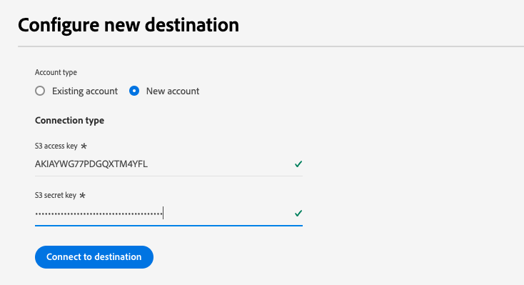

# [!DNL Acxiom Data Enhancement] conexión de destino

>[!NOTE]
>
>El [!DNL Acxiom Data Enhancement] el destino está en versión beta.  El equipo de Acxiom crea y mantiene este conector de destino y esta página de documentación. Para cualquier consulta o solicitud de actualización, póngase en contacto con ellos directamente en acxiom-adobe-help@acxiom.com.

## Información general {#overview}

Utilice el conector de mejora de datos Acxiom para proporcionar datos descriptivos adicionales a los perfiles de Adobe para su uso en aplicaciones de análisis, segmentación y segmentación. Con cientos de elementos disponibles, esto permite a los usuarios segmentar y modelar mejor los datos, lo que da como resultado una segmentación y un modelado predictivo más precisos.

Este tutorial proporciona los pasos para crear una [!DNL Acxiom Data Enhancement] conexión de destino y flujo de datos mediante la interfaz de usuario de Adobe Experience Platform.  Este conector se utiliza para entregar datos al servicio de mejora Acxiom mediante Amazon S3 como punto de caída.

## Casos de uso {#use-cases}

Para ayudarle a comprender mejor cómo y cuándo debe utilizar el destino de mejora de datos de Acxiom, aquí hay casos de uso de ejemplo que los clientes de Adobe Experience Platform pueden solucionar mediante este destino.

### Mejore los datos de clientes {#enhance-customer-data}

Este conector deben utilizarlo los profesionales de marketing con el objetivo de mejorar la eficacia de sus estrategias de divulgación añadiendo elementos descriptivos seleccionados a sus perfiles de Adobe y utilizándolos para dirigir mejor las campañas.

Por ejemplo, como experto en marketing, es posible que desee profundizar en el conocimiento de las audiencias existentes enriqueciendo sus perfiles con datos adicionales. Al hacerlo, mejorará las estrategias de segmentación y segmentación, lo que dará lugar a un aumento en la personalización y conversión de campañas.

El caso de uso se ejecuta mediante una combinación de conectores de origen y destino.

Para empezar, debe exportar los registros de cliente existentes para enriquecerlos con este conector de destino. El servicio de Acxiom buscaría el archivo, lo recuperaría, lo enriquecería con los datos de Acxiom y generaría un archivo.

A continuación, el cliente utilizaría la tarjeta de fuente de ingesta de datos de Acxiom correspondiente para volver a introducir los perfiles de cliente hidratados en Adobe Real-Time CDP.

## Requisitos previos {#prerequisites}

>[!IMPORTANT]
>
>* Para conectarse al destino, necesita el **[!UICONTROL Ver destinos]** y **[!UICONTROL Administrar destinos]**, **[!UICONTROL Activar destinos]**, **[!UICONTROL Ver perfiles]**, y **[!UICONTROL Ver segmentos]** [permisos de control de acceso](/help/access-control/home.md#permissions). Lea el [información general de control de acceso](/help/access-control/ui/overview.md) o póngase en contacto con el administrador del producto para obtener los permisos necesarios.
>* Para exportar *identidades*, necesita el **[!UICONTROL Ver gráfico de identidad]** [permiso de control de acceso](/help/access-control/home.md#permissions).   {width="100" zoomable="yes"}

## Audiencias compatibles {#supported-audiences}

Esta sección describe qué tipo de audiencias puede exportar a este destino.

| Origen de audiencia | Admitido | Descripción |
|-----------------------------|-----------|---------------------------------------------------------------------------------------------------------------------|
| [!DNL Segmentation Service] | ✓ | Audiencias generadas mediante el Experience Platform [Servicio de segmentación](../../../segmentation/home.md). |
| Cargas personalizadas | x | Audiencias [importado](../../../segmentation/ui/overview.md#import-audience) en el Experience Platform desde archivos CSV. |

{style="table-layout:auto"}

## Tipo y frecuencia de exportación {#export-type-frequency}

Consulte la tabla siguiente para obtener información sobre el tipo y la frecuencia de exportación de destino.

| Elemento | Tipo | Notas |
|------------------|--------------------------------|------------------------------------------------------------------------------------------------------------------------------------------------------------------------------------------------------------------------------------------------------------------------------------------------------------------------|
| Tipo de exportación | **[!UICONTROL Basado en perfiles]** | Va a exportar todos los miembros de un segmento, junto con los campos de esquema deseados (por ejemplo: dirección de correo electrónico, número de teléfono, apellidos), tal como se elige en la pantalla seleccionar atributos de perfil del [flujo de trabajo de activación de destino](/help/destinations/ui/activate-batch-profile-destinations.md#select-attributes). |
| Frecuencia de exportación | **[!UICONTROL Lote]** | Los destinos por lotes exportan archivos a plataformas descendentes en incrementos de tres, seis, ocho, doce o veinticuatro horas. Más información sobre [destinos basados en archivos por lotes](/help/destinations/destination-types.md#file-based). |

{style="table-layout:auto"}

## Conexión al destino {#connect}

>[!IMPORTANT]
>
>Para conectarse al destino, necesita el **[!UICONTROL Ver destinos]** y **[!UICONTROL Administrar y activar destinos de conjuntos de datos]** [permisos de control de acceso](/help/access-control/home.md#permissions). Lea el [información general de control de acceso](/help/access-control/ui/overview.md) o póngase en contacto con el administrador del producto para obtener los permisos necesarios.

### Autenticarse en el destino {#authenticate}

Para autenticarse en el destino, rellene los campos obligatorios y seleccione **[!UICONTROL Conectar con destino]**.

Para acceder al bloque en Experience Platform, debe proporcionar valores válidos para las siguientes credenciales:

| Credencial | Descripción |
|---------------|----------------------------------------------------------------------------------------------------------|
| Clave de acceso de S3 | ID de clave de acceso para el bloque. Puede recuperar este valor desde la variable [!DNL Acxiom] equipo. |
| Clave secreta de S3 | El ID de clave secreta de su cubo. Puede recuperar este valor desde la variable [!DNL Acxiom] equipo. |
| Nombre del segmento | Este es el espacio en el que se compartirán los archivos. Puede recuperar este valor desde la variable [!DNL Acxiom] equipo. |

### Nueva cuenta

Para definir una nueva ubicación de Acxiom Managed S3:

### Cuenta existente

Las cuentas ya definidas con la tarjeta de mejora de datos Acxiom aparecerán en una lista emergente y, cuando se seleccione, proporcionará detalles sobre la cuenta.  Esto se muestra a continuación en el ejemplo de la interfaz de usuario de, cuando navega a **Destinos** > **Cuentas**;

### Rellenar detalles de destino {#destination-details}

Para configurar los detalles del destino, rellene los campos obligatorios y opcionales a continuación. Un asterisco junto a un campo en la interfaz de usuario indica que el campo es obligatorio.

* **Nombre (obligatorio)** - El nombre en el que se guardará el destino
* **Descripción** - Breve explicación del propósito del destino
* **Nombre del contenedor (obligatorio)** - Nombre del contenedor de Amazon S3 configurado en S3
* **Ruta de carpeta (obligatorio)** - Si se utilizan subdirectorios en un bloque, se debe definir una ruta o &#39;/&#39; para hacer referencia a la ruta raíz.
* **Tipo de archivo** : seleccione el Experience Platform de formato que debe utilizar para los archivos exportados. En este momento, el único tipo de archivo que esperará el procesamiento de Acxiom es CSV

>[!IMPORTANT]
>
>Al seleccionar la opción CSV, *Delimitador*, *Carácter comillas*, *Carácter de escape*, *Valor vacío*, *Valor nulo*, *Formato de compresión*, y *Incluir archivo de manifiesto* se presentarán las opciones, el siguiente documento explica esta configuración con más detalle [configurar las opciones de formato](../../ui/batch-destinations-file-formatting-options.md).

### Habilitar alertas {#enable-alerts}

Puede activar alertas para recibir notificaciones sobre el estado del flujo de datos a su destino. Seleccione una alerta de la lista a la que suscribirse para recibir notificaciones sobre el estado del flujo de datos. Para obtener más información sobre las alertas, consulte la guía de [suscripción a alertas de destinos mediante la IU](../../ui/alerts.md).

Cuando haya terminado de proporcionar detalles para la conexión de destino, seleccione **[!UICONTROL Siguiente]**.

## Activar públicos en este destino {#activate}

>[!IMPORTANT]
>
>* Para activar los datos, necesita el **[!UICONTROL Ver destinos]**, **[!UICONTROL Activar destinos]**, **[!UICONTROL Ver perfiles]**, y **[!UICONTROL Ver segmentos]** [permisos de control de acceso](/help/access-control/home.md#permissions). Lea el [información general de control de acceso](/help/access-control/ui/overview.md) o póngase en contacto con el administrador del producto para obtener los permisos necesarios.
>* Para exportar *identidades*, necesita el **[!UICONTROL Ver gráfico de identidad]** [permiso de control de acceso](/help/access-control/home.md#permissions).   {width="100" zoomable="yes"}

Leer [Activar datos de audiencia en destinos de exportación de perfiles por lotes](/help/destinations/ui/activate-batch-profile-destinations.md) para obtener instrucciones sobre cómo activar audiencias en este destino.

### Sugerencias de asignación

El procesamiento correcto de archivos en el lado Acxiom requiere elementos de nombre y dirección. Aunque no todos los elementos son necesarios, proporcionar todo lo posible ayudará a que la coincidencia tenga éxito.

En la tabla siguiente se proporcionan sugerencias de asignación. Se enumeran los atributos del lado del destino que utiliza el procesamiento Acxiom y a los que los clientes pueden asignar atributos de perfil. Trate estos elementos como sugerencias, ya que no todos los elementos son necesarios y los valores de origen dependerán de las necesidades de la cuenta.

| Campo de destino | Descripción de origen |
|--------------|-------------------------------------------------------------|
| name | El valor person.name.fullName en Experience Platform. |
| firstName | El valor person.name.firstName en Experience Platform. |
| lastName | El valor person.name.lastName en Experience Platform. |
| dirección1 | El valor mailaddress.street1 en el Experience Platform. |
| dirección2 | El valor mailaddress.street2 en el Experience Platform. |
| city | El valor de mailAddress.city en Experience Platform. |
| estado | El valor mailaddress.state en el Experience Platform. |
| zip | El valor de mailAddress.postalCode en Experience Platform. |

>[!NOTE]
>
>Si asigna campos adicionales no enumerados anteriormente en el flujo de datos, estos se incluirán en la exportación de datos, pero el procesamiento Acxiom los ignorará.

## Validar exportación de datos {#exported-data}

Para comprobar si los datos se han exportado correctamente, compruebe su [!DNL Amazon S3 Storage] y asegúrese de que los archivos exportados contienen las poblaciones de perfiles esperadas.

## Pasos siguientes

Al seguir este tutorial, ha creado correctamente un flujo de datos para exportar datos de perfil de Experience Platform a su [!DNL Acxiom] ubicación de S3 administrada. A continuación, debe ponerse en contacto con su representante de Acxiom con el nombre de la cuenta, los nombres de archivo y la ruta del bloque para que se pueda configurar el procesamiento.

## Uso de datos y gobernanza {#data-usage-governance}

Todo [!DNL Adobe Experience Platform] Los destinos de cumplen con las políticas de uso de datos al gestionar los datos. Para obtener información detallada sobre cómo [!DNL Adobe Experience Platform] aplica la gobernanza de datos, lea la [Resumen de gobernanza de datos](/help/data-governance/home.md).

## Recursos adicionales {#additional-resources}

*Acxiom Infobase:* https://www.acxiom.com/wp-content/uploads/2022/02/fs-acxiom-infobase_AC-0268-22.pdf
