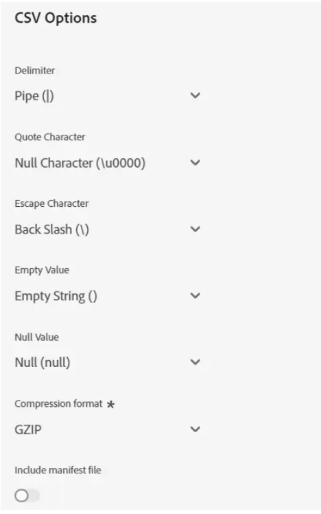
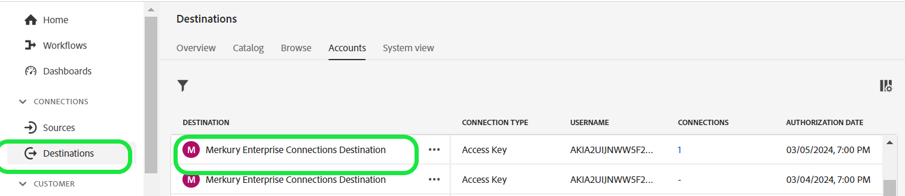

# Destino de conexiones de Merkury Enterprise

>[!NOTE]
>
>El conector de destino y la página de documentación los crea y mantiene el equipo [!DNL Merkury]. Para cualquier consulta o solicitud de actualización, comuníquese con el representante de la cuenta de [!DNL Merkury].

## Información general {#overview}

Use el destino [!DNL Merkury Enterprise Connections] para entregar públicos a [!DNL Merkury] de forma segura. [!DNL Merkury] facilita a los especialistas en marketing la coincidencia y el envío de audiencias basadas en personas a las conexiones de TV/CTV, editor y tecnología de publicidad premium de [!DNL Merkury] con más de 80 direcciones. [!DNL Merkury] cuenta con la tecnología de un gráfico completo de identidad de consumidor adulto de EE. UU. de más de 268 millones de personas.

Siga los pasos de esta página de documentación para crear una conexión de destino [!DNL Merkury Connections] y activar audiencias mediante la interfaz de usuario [!DNL Adobe Experience Platform].

>[!NOTE]
>
>Si desea activar audiencias en destinos multimedia con su cuenta de [!DNL Merkury Connect], use el destino [!DNL Merkury Connections] en su lugar.

## Casos de uso {#use-cases}

* **Activación de medios digitales**: Coincidencia y entrega sencillos de sus perfiles de audiencia a más de 50 editores con direccionamiento premium y conexiones de tecnología publicitaria de [!DNL Merkury].
* **Mejorar la eficiencia**: Mejore el alcance de los medios a los que se puede dirigir sin cookies, mejore la eficacia de los objetivos y la rentabilidad de la inversión en Advertising (ROAS).

## Requisitos previos {#prerequisites}

>[!IMPORTANT]
>
>* Para conectarse al destino, necesita **Ver destinos** y **Administrar destinos**, **Activar destinos**, **Ver perfiles** y **Ver segmentos** [[permisos de control de acceso]](https://experienceleague.adobe.com/en/docs/experience-platform/access-control/home#permissions). Lea [[descripción general del control de acceso]](https://experienceleague.adobe.com/en/docs/experience-platform/access-control/ui/overview) o póngase en contacto con el administrador del producto para obtener los permisos necesarios.
>* Para exportar *identidades*, necesita el **Ver gráfico de identidad** [[permiso de control de acceso]](https://experienceleague.adobe.com/en/docs/experience-platform/access-control/home#permissions).\

## Identidades admitidas {#supported-identities}

| Identidad de destino | Descripción | Consideraciones |
|---|---|---|
| GAID | GOOGLE ADVERTISING ID | Seleccione la identidad de destino GAID cuando su identidad de origen sea un área de nombres GAID. |
| IDFA | Apple ID para anunciantes | Seleccione la identidad de destino IDFA cuando la identidad de origen sea un área de nombres IDFA. |
| ECID | Experience Cloud ID | Un área de nombres que representa ECID. También se puede hacer referencia a este área de nombres mediante los siguientes alias: &quot;Adobe Marketing Cloud ID&quot;, &quot;[!DNL Adobe Experience Cloud] ID&quot;, &quot;[!DNL Adobe Experience Platform] ID&quot;. Consulte el siguiente documento sobre [ECID](/help/identity-service/features/ecid.md) para obtener más información. |
| phone_sha256 | Números de teléfono con hash con el algoritmo SHA256 | Los números de teléfono con hash SHA256 y texto sin formato son compatibles con [!DNL Adobe Experience Platform]. Si el campo de origen contiene atributos sin hash, marque la opción **[!UICONTROL Apply transformation]** para que [!DNL Experience Platform] ponga en hash automáticamente los datos durante la activación. |
| email_lc_sha256 | Direcciones de correo electrónico con el algoritmo SHA256 | [!DNL Adobe Experience Platform] admite direcciones de correo electrónico con hash SHA256 y texto sin formato. Si el campo de origen contiene atributos sin hash, marque la opción **[!UICONTROL Apply transformation]** para que [!DNL Experience Platform] ponga en hash automáticamente los datos durante la activación. |
| extern_id | ID de usuario personalizados | Seleccione esta identidad de destino cuando la identidad de origen sea un área de nombres personalizada. |

{style="table-layout:auto"}

## Audiencias compatibles {#supported-audiences}

Esta sección describe qué tipo de audiencias puede exportar a este destino.

| Origen de audiencia | Admitido | Descripción |
|---------|----------|----------|
| [!DNL Segmentation Service] | Sí | Audiencias generadas a través del [servicio de segmentación](../../../segmentation/home.md) de Experience Platform. |
| Todos los demás orígenes de audiencia | No | Esta categoría incluye todos los orígenes de audiencia fuera de las audiencias generadas a través de [!DNL Segmentation Service]. Obtenga información acerca de [varios orígenes de audiencia](/help/segmentation/ui/audience-portal.md#customize). Algunos ejemplos son: <ul><li> audiencias de carga personalizadas [importadas](../../../segmentation/ui/audience-portal.md#import-audience) a Experience Platform desde archivos CSV,</li><li> audiencias de similitud, </li><li> audiencias federadas, </li><li> audiencias generadas en otras aplicaciones de Experience Platform, como [!DNL Adobe Journey Optimizer], </li><li> y más. </li></ul> |

{style="table-layout:auto"}

Audiencias compatibles por tipo de datos de audiencia:

| Tipo de datos de audiencia | Admitido | Descripción | Casos de uso |
|--------------------|-----------|-------------|-----------|
| [Audiencias de personas](/help/segmentation/types/people-audiences.md) | Sí | Basado en perfiles de clientes, lo que le permite dirigirse a grupos específicos de personas para campañas de marketing. | Compradores frecuentes, abandonadores del carro de compras |
| [Audiencias de la cuenta](/help/segmentation/types/account-audiences.md) | No | Segmente a individuos dentro de organizaciones específicas para estrategias de marketing basadas en cuentas. | Marketing B2B |
| [Audiencias potenciales](/help/segmentation/types/prospect-audiences.md) | No | Dirija la actividad a personas que aún no sean clientes, pero que compartan características con la audiencia a la que va dirigida. | Prospección con datos de terceros |
| [Exportaciones de conjuntos de datos](/help/catalog/datasets/overview.md) | No | Colecciones de datos estructurados almacenados en el lago de datos [!DNL Adobe Experience Platform]. | Informes, flujos de trabajo de ciencia de datos |

{style="table-layout:auto"}

## Tipo y frecuencia de exportación {#export-type-frequency}

Consulte la tabla siguiente para obtener información sobre el tipo y la frecuencia de exportación de destino.

| **Elemento** | **Tipo** | **Notas** |
|---|---|---|  
| Tipo de exportación | **Basado en perfil** | Va a exportar todos los miembros de un segmento, junto con los campos de esquema deseados (por ejemplo: dirección de correo electrónico, número de teléfono, apellidos), tal como se eligió en la pantalla Seleccionar atributos de perfil del [[flujo de trabajo de activación de destino]](https://experienceleague.adobe.com/en/docs/experience-platform/destinations/ui/activate/activate-batch-profile-destinations#select-attributes). |
| Frecuencia | **Lote** | Los destinos por lotes exportan archivos a plataformas descendentes en incrementos de tres, seis, ocho, doce o veinticuatro horas. Más información sobre [[destinos de frecuencia basados en archivos por lotes]](https://experienceleague.adobe.com/en/docs/experience-platform/destinations/destination-types#file-based). |

{style="table-layout:auto"}

## Conectar con el destino {#connect}

>[!IMPORTANT]
>
>Para conectarse al destino, necesita **Ver destinos** y **Administrar y activar destinos de conjuntos de datos** [[permisos de control de acceso]](https://experienceleague.adobe.com/en/docs/experience-platform/access-control/home#permissions). Lea [[descripción general del control de acceso]](https://experienceleague.adobe.com/en/docs/experience-platform/access-control/ui/overview) o póngase en contacto con el administrador del producto para obtener los permisos necesarios.

Para conectarse a este destino, siga los pasos descritos en [[tutorial de configuración de destino]](https://experienceleague.adobe.com/en/docs/experience-platform/destinations/ui/connect-destination). En el flujo de trabajo de configuración de destino, rellene los campos enumerados en las dos secciones siguientes.

### Autenticarse en el destino {#authenticate}

Para autenticarse en el destino, rellene los campos obligatorios y seleccione **Conectar con destino**.

Para acceder al bloque en Experience Platform, debe proporcionar valores válidos para las siguientes credenciales:

| **Credencial** | **Descripción** |
|---|---|
| Clave de acceso | ID de clave de acceso para el bloque. Puede recuperar este valor del equipo de Merkury. |
| Clave secreta | El ID de clave secreta de su cubo. Puede recuperar este valor del equipo de Merkury. |
| Nombre del segmento | Este es el espacio en el que se compartirán los archivos. Puede recuperar este valor del equipo de Merkury. |

{style="table-layout:auto"}

### Rellenar detalles de destino {#destination-details}

Para configurar los detalles del destino, rellene los campos obligatorios y opcionales a continuación. Un asterisco junto a un campo en la interfaz de usuario indica que el campo es obligatorio.

* **Nombre (obligatorio)** - El nombre en el que se guardará el destino
* **Descripción** - Breve explicación del propósito del destino
* **Nombre del contenedor (obligatorio)** - Nombre del contenedor de Amazon S3 configurado en S3
* **Ruta de acceso a la carpeta (obligatoria)**: si se usan subdirectorios en un bloque, se debe definir una ruta de acceso o &#39;/&#39; para hacer referencia a la ruta de acceso raíz.
* **Tipo de archivo**: seleccione el formato que Experience Platform debe usar para los archivos exportados. Consulte con su equipo de Mercury el tipo de archivo esperado para su cuenta.

>[!NOTE]
>
>Al seleccionar la opción CSV, se presentarán las opciones Delimitador, Comilla, Carácter de escape, Valor vacío, Valor nulo, Formato de compresión e Incluir archivo de manifiesto. Consulte con su equipo de Mercury la configuración adecuada para su cuenta.

### Cuenta existente {#existing-account}

Las cuentas ya definidas mediante el destino Conexiones de Merkury Enterprise aparecen en una lista emergente. Cuando se selecciona, puede ver los detalles de la cuenta en el carril derecho. Vea el ejemplo desde la interfaz de usuario cuando vaya a **Destinos** > **Cuentas**:

## Habilitar alertas {#enable-alerts}

Puede activar alertas para recibir notificaciones sobre el estado del flujo de datos a su destino. Seleccione una alerta de la lista a la que suscribirse para recibir notificaciones sobre el estado del flujo de datos. Para obtener más información sobre las alertas, consulte la guía sobre [suscripción a alertas de destinos mediante la interfaz de usuario](https://experienceleague.adobe.com/en/docs/experience-platform/destinations/ui/alerts).

Cuando termine de proporcionar detalles para la conexión de destino, seleccione **Siguiente**.

## Activar públicos en este destino {#activate}

>[!IMPORTANT]
>
>* Para activar los datos, necesita los permisos de control de acceso de **Ver destinos**, **Activar destinos**, **Ver perfiles** y **Ver segmentos**. Lea la descripción general del control de acceso o póngase en contacto con el administrador del producto para obtener los permisos necesarios.
>* Para exportar identidades, necesita el permiso de control de acceso **Ver gráfico de identidad**.

Lea [Activar datos de audiencia en destinos de exportación de perfiles por lotes](https://experienceleague.adobe.com/en/docs/experience-platform/destinations/ui/activate/activate-batch-profile-destinations) para obtener instrucciones sobre cómo activar audiencias en este destino.

## Sugerencias de asignación {#mapping-suggestions}

El procesamiento correcto de archivos en el lado [!DNL Merkury] requiere elementos de nombre y dirección. Aunque no todos los elementos son necesarios, proporcionar todo lo posible ayudará a que la coincidencia tenga éxito.

Las sugerencias de asignación se proporcionan en la tabla siguiente, que enumera los atributos del lado de destino que usa el procesamiento [!DNL Merkury] al que los clientes pueden asignar atributos de perfil. Trate estos elementos como sugerencias, ya que no todos los elementos son necesarios y los valores de origen dependerán de las necesidades de la cuenta.

| Campo de destino | Descripción de Source |
|---|---|
| id | Campo de identidad que se utilizará para asignar datos de [!DNL Merkury] a Experience Platform a través del conector de Source [!DNL Merkury Enterprise Identity] |
| Input_First_Name | El valor `person.name.firstName` en Experience Platform. |
| Input_Last_Name | El valor `person.name.lastName` en Experience Platform. |
| Input_Address_Line_1 | El valor `mailingAddress.street` en Experience Platform. |
| Input_City | El valor `mailingAddress.city` en Experience Platform. |
| Input_State_Province_Code | El valor `mailingAddress.state` en Experience Platform. Utilícelo si el estado está en el formulario de código de dos caracteres. |
| Input_State_Province_Name | El valor `mailingAddress.state` en Experience Platform. Utilícelo si el estado es el nombre completo del estado |
| Input_Postal_Code | El valor `mailingAddress.postalCode` en Experience Platform. |
| Input_Email_Address | El valor que desea asignar como dirección de correo electrónico de perfiles. |
| Input_Phone | El valor que desea asignar como número de teléfono de los perfiles. |

{style="table-layout:auto"}

## Validar exportación de datos {#validate-data-export}

Para comprobar si los datos se han exportado correctamente, compruebe el contenedor de almacenamiento de Amazon S3 y asegúrese de que los archivos exportados contienen las poblaciones de perfiles esperadas.

## Uso de datos y gobernanza {#data-usage-governance}

Todos los destinos de [!DNL Adobe Experience Platform] cumplen con las políticas de uso de datos al administrar los datos. Para obtener información detallada sobre cómo [!DNL Adobe Experience Platform] aplica el control de datos, lea la [Información general sobre el control de datos](https://experienceleague.adobe.com/en/docs/experience-platform/data-governance/home).

## Próximos pasos {#next-steps}

Ha creado correctamente un flujo de datos para exportar datos de perfil de Experience Platform a su ubicación de S3 administrada de [!DNL Merkury]. A continuación, debe ponerse en contacto con su representante de [!DNL Merkury] y proporcionarle el nombre de la cuenta, los nombres de archivo y la ruta de acceso del bloque para que se pueda configurar el procesamiento.
