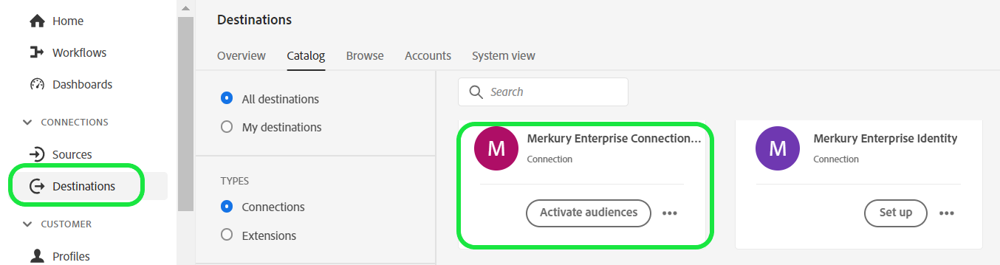

# Destino de conexiones de Merkury Enterprise

>[!NOTE]
>
>El conector de destino y la página de documentación los crea y mantiene el [!DNL Merkury] equipo. Para cualquier consulta o solicitud de actualización, póngase en contacto con su [!DNL Merkury] representante de cuentas.

## Información general

Utilice el [!DNL Merkury Enterprise Connections] destino para enviar audiencias de forma segura a [!DNL Merkury]. [!DNL Merkury] proporciona a los especialistas en marketing una coincidencia y un envío sencillos de audiencias basadas en personas a [!DNL Merkury]Más de 80 conexiones premium de TV/CTV, editor y tecnología publicitaria a las que se puede dirigir. [!DNL Merkury] está alimentado por un gráfico integral de identidad de consumidor adulto de EE. UU. de más de 268 millones de personas.

Siga los pasos de esta página de documentación para crear una [!DNL Merkury Connections] establezca una conexión de destino y active audiencias mediante la interfaz de usuario de Adobe Experience Platform.

>[!NOTE]
>
>Si desea activar audiencias en destinos de medios con su [!DNL Merkury Connect] Cuenta de, utilice la [!DNL Merkury Connections] en su lugar.

## Casos de uso

* **Activación de medios digitales**: coincidencia y envío sencillos de los perfiles de audiencia a [!DNL Merkury]Más de 50 editores premium a los que se puede dirigir y conexiones de tecnología publicitaria.
* **Mejore la eficiencia**: Mejore su alcance de medios direccionables y sin cookies, mejore la eficacia de los objetivos y la rentabilidad de la inversión en Advertising (ROAS).

## Requisitos previos

>[!IMPORTANT]
>
>* Para conectarse al destino, necesita el **Ver destinos** y **Administrar destinos**, **Activar destinos**, **Ver perfiles**, y **Ver segmentos** [[permisos de control de acceso]](https://experienceleague.adobe.com/en/docs/experience-platform/access-control/home#permissions). Lea el [[descripción general de control de acceso]](https://experienceleague.adobe.com/en/docs/experience-platform/access-control/ui/overview) o póngase en contacto con el administrador del producto para obtener los permisos necesarios.
>* Para exportar *identidades*, necesita el **Ver gráfico de identidad** [[permiso de control de acceso]](https://experienceleague.adobe.com/en/docs/experience-platform/access-control/home#permissions).\

## Identidades admitidas {#supported-identities}

| Identidad de destino | Descripción | Consideraciones |
|---|---|---|
| GAID | GOOGLE ADVERTISING ID | Seleccione la identidad de destino GAID cuando su identidad de origen sea un área de nombres GAID. |
| IDFA | Apple ID para anunciantes | Seleccione la identidad de destino IDFA cuando la identidad de origen sea un área de nombres IDFA. |
| ECID | Experience Cloud ID | Un área de nombres que representa ECID. Este área de nombres también se puede mencionar mediante los siguientes alias: &quot;Adobe Marketing Cloud ID&quot;, &quot;Adobe Experience Cloud ID&quot;, &quot;Adobe Experience Platform ID&quot;. Consulte el siguiente documento sobre [ECID](/help/identity-service/features/ecid.md) para obtener más información. |
| phone_sha256 | Números de teléfono con hash con el algoritmo SHA256 | Los números de teléfono con hash SHA256 y texto sin formato son compatibles con Adobe Experience Platform. Si el campo de origen contiene atributos sin hash, marque la **[!UICONTROL Aplicar transformación]** opción, para tener [!DNL Platform] hash automático de los datos en la activación. |
| email_lc_sha256 | Direcciones de correo electrónico con el algoritmo SHA256 | Adobe Experience Platform admite direcciones de correo electrónico con hash SHA256 y de texto sin formato. Si el campo de origen contiene atributos sin hash, marque la **[!UICONTROL Aplicar transformación]** opción, para tener [!DNL Platform] hash automático de los datos en la activación. |
| extern_id | ID de usuario personalizados | Seleccione esta identidad de destino cuando la identidad de origen sea un área de nombres personalizada. |

{style="table-layout:auto"}

## Audiencias compatibles

Esta sección describe qué tipo de audiencias puede exportar a este destino.

| **Audiencia** | **Admitido** | **Descripción del origen** |
|---|---|---|      
| Servicio de segmentación | ✓ | Audiencias generadas mediante el Experience Platform [[Servicio de segmentación]](https://experienceleague.adobe.com/en/docs/experience-platform/segmentation/home). |
| Cargas personalizadas | X | Audiencias [[importado]](https://experienceleague.adobe.com/en/docs/experience-platform/segmentation/ui/overview#import-audience) en el Experience Platform desde archivos CSV. |

{style="table-layout:auto"}

## Tipo y frecuencia de exportación

Consulte la tabla siguiente para obtener información sobre el tipo y la frecuencia de exportación de destino.

| **Elemento** | **Tipo** | **Notas** |
|---|---|---|  
| Tipo de exportación | **Basado en perfiles** | Va a exportar todos los miembros de un segmento, junto con los campos de esquema deseados (por ejemplo: dirección de correo electrónico, número de teléfono, apellidos), tal como se elige en la pantalla seleccionar atributos de perfil del [[flujo de trabajo de activación de destino]](https://experienceleague.adobe.com/en/docs/experience-platform/destinations/ui/activate/activate-batch-profile-destinations#select-attributes). |
| Frecuencia | **Lote** | Los destinos por lotes exportan archivos a plataformas descendentes en incrementos de tres, seis, ocho, doce o veinticuatro horas. Más información sobre [[destinos de frecuencia basados en archivos por lotes]](https://experienceleague.adobe.com/en/docs/experience-platform/destinations/destination-types#file-based). |

{style="table-layout:auto"}

## Conexión al destino

>[!IMPORTANT]
>
>Para conectarse al destino, necesita el **Ver destinos** y **Administrar y activar destinos de conjuntos de datos** [[permisos de control de acceso]](https://experienceleague.adobe.com/en/docs/experience-platform/access-control/home#permissions). Lea el [[descripción general de control de acceso]](https://experienceleague.adobe.com/en/docs/experience-platform/access-control/ui/overview) o póngase en contacto con el administrador del producto para obtener los permisos necesarios.

Para conectarse a este destino, siga los pasos descritos en la sección [[tutorial de configuración de destino]](https://experienceleague.adobe.com/en/docs/experience-platform/destinations/ui/connect-destination). En el flujo de trabajo de configuración de destino, rellene los campos enumerados en las dos secciones siguientes.

### Autenticarse en el destino

Para autenticarse en el destino, rellene los campos obligatorios y seleccione **Conectar con destino**.

Para acceder al bloque en Experience Platform, debe proporcionar valores válidos para las siguientes credenciales:

| **Credencial** | **Descripción** |
|---|---|
| Clave de acceso | ID de clave de acceso para el bloque. Puede recuperar este valor del equipo de Merkury. |
| Clave secreta | El ID de clave secreta de su cubo. Puede recuperar este valor del equipo de Merkury. |
| Nombre del segmento | Este es el espacio en el que se compartirán los archivos. Puede recuperar este valor del equipo de Merkury. |

{style="table-layout:auto"}

### Rellenar detalles de destino

Para configurar los detalles del destino, rellene los campos obligatorios y opcionales a continuación. Un asterisco junto a un campo en la interfaz de usuario indica que el campo es obligatorio.

* **Nombre (obligatorio)** - El nombre en el que se guardará el destino
* **Descripción** - Breve explicación del propósito del destino
* **Nombre del contenedor (obligatorio)** - Nombre del contenedor de Amazon S3 configurado en S3
* **Ruta de carpeta (obligatorio)** - Si se utilizan subdirectorios en un bloque, se debe definir una ruta o &#39;/&#39; para hacer referencia a la ruta raíz.
* **Tipo de archivo** : seleccione el Experience Platform de formato que debe utilizar para los archivos exportados. Consulte con su equipo de Mercury el tipo de archivo esperado para su cuenta.

>[!NOTE]
>
>Al seleccionar la opción CSV, se presentarán las opciones Delimitador, Comilla, Carácter de escape, Valor vacío, Valor nulo, Formato de compresión e Incluir archivo de manifiesto. Consulte con su equipo de Mercury la configuración adecuada para su cuenta.

### Cuenta existente

Las cuentas ya definidas mediante el destino Conexiones de Merkury Enterprise aparecen en una lista emergente. Cuando se selecciona, puede ver los detalles de la cuenta en el carril derecho. Vea el ejemplo desde la interfaz de usuario de, cuando navega a **Destinos** > **Cuentas**:

## Habilitar alertas

Puede activar alertas para recibir notificaciones sobre el estado del flujo de datos a su destino. Seleccione una alerta de la lista a la que suscribirse para recibir notificaciones sobre el estado del flujo de datos. Para obtener más información sobre las alertas, consulte la guía de [suscripción a alertas de destinos mediante la IU](https://experienceleague.adobe.com/en/docs/experience-platform/destinations/ui/alerts).

Cuando haya terminado de proporcionar detalles para la conexión de destino, seleccione **Siguiente**.

## Activar públicos en este destino

>[!IMPORTANT]
>
>* Para activar los datos, necesita el **Ver destinos**, **Activar destinos**, **Ver perfiles**, y **Ver segmentos** permisos de control de acceso. Lea la descripción general del control de acceso o póngase en contacto con el administrador del producto para obtener los permisos necesarios.
>* Para exportar identidades, necesita el **Ver gráfico de identidad** permiso de control de acceso.

Leer [Activar datos de audiencia en destinos de exportación de perfiles por lotes](https://experienceleague.adobe.com/en/docs/experience-platform/destinations/ui/activate/activate-batch-profile-destinations) para obtener instrucciones sobre cómo activar audiencias en este destino.

## Sugerencias de asignación

El procesamiento correcto de los archivos en la [!DNL Merkury] Este lado requiere elementos de nombre y dirección. Aunque no todos los elementos son necesarios, proporcionar todo lo posible ayudará a que la coincidencia tenga éxito.

En la tabla siguiente se proporcionan sugerencias de asignación. Se muestran los atributos del lado del destino que utilizan los usuarios [!DNL Merkury] procesamiento al que los clientes pueden asignar atributos de perfil. Trate estos elementos como sugerencias, ya que no todos los elementos son necesarios y los valores de origen dependerán de las necesidades de la cuenta.

| Campo de destino | Descripción de Source |
|---|---|
| Identificación | Campo de identidad que se utilizará para asignar [!DNL Merkury] datos al Experience Platform a través de [!DNL Merkury Enterprise Identity] Conector de Source |
| Input_First_Name | El `person.name.firstName` valor en Experience Platform. |
| Input_Last_Name | El `person.name.lastName` valor en Experience Platform. |
| Input_Address_Line_1 | El `mailingAddress.street` valor en Experience Platform. |
| Input_City | El `mailingAddress.city` valor en Experience Platform. |
| Input_State_Province_Code | El `mailingAddress.state` valor en Experience Platform. Utilícelo si el estado está en el formulario de código de dos caracteres. |
| Input_State_Province_Name | El `mailingAddress.state` valor en Experience Platform. Utilícelo si el estado es el nombre completo del estado |
| Input_Postal_Code | El `mailingAddress.postalCode` valor en Experience Platform. |
| Input_Email_Address | El valor que desea asignar como dirección de correo electrónico de perfiles. |
| Input_Phone | El valor que desea asignar como número de teléfono de los perfiles. |

{style="table-layout:auto"}

## Validar exportación de datos

Para comprobar si los datos se han exportado correctamente, compruebe el contenedor de almacenamiento de Amazon S3 y asegúrese de que los archivos exportados contienen las poblaciones de perfiles esperadas.

## Uso de datos y gobernanza

Todos los destinos de Adobe Experience Platform cumplen con las políticas de uso de datos al administrar los datos. Para obtener información detallada sobre cómo Adobe Experience Platform aplica la gobernanza de datos, lea la [Resumen de gobernanza de datos](https://experienceleague.adobe.com/en/docs/experience-platform/data-governance/home).

## Pasos siguientes

Al seguir este tutorial, ha creado correctamente un flujo de datos para exportar datos de perfil de Experience Platform a su [!DNL Merkury] ubicación de S3 administrada. A continuación, debe ponerse en contacto con su [!DNL Merkury] con el nombre de la cuenta, los nombres de archivo y la ruta del contenedor para que se pueda configurar el procesamiento.