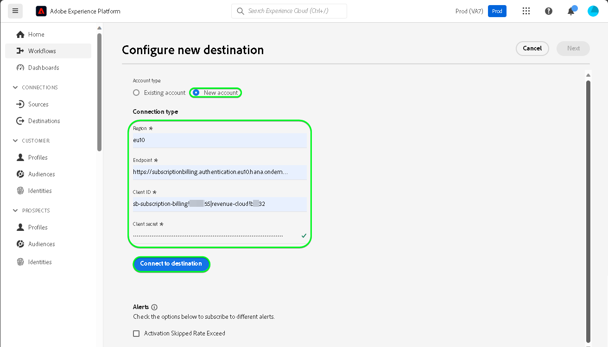
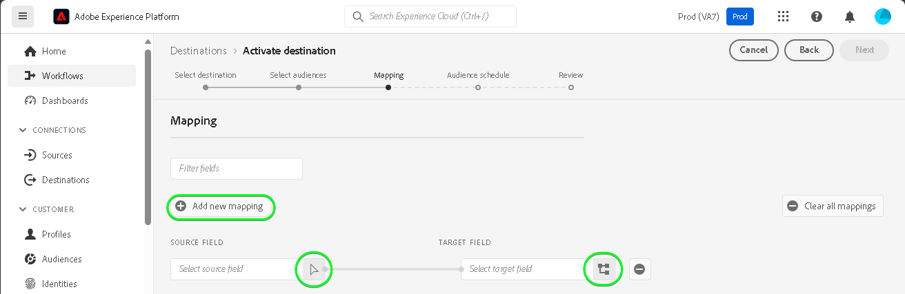
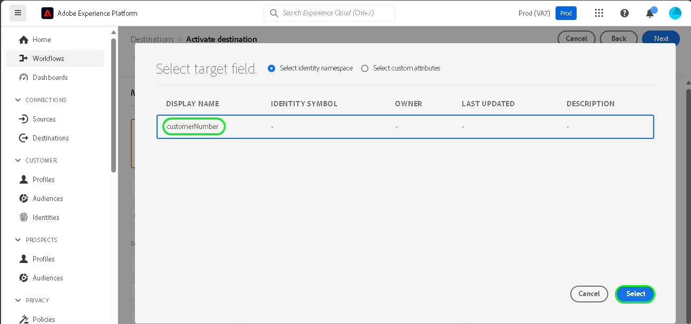

# [!DNL SAP Commerce] conexión

[!DNL SAP Commerce], anteriormente conocido como [[!DNL Hybris]](https://www.sap.com/india/products/acquired-brands/what-is-hybris.html), es una solución de plataforma de comercio electrónico basada en la nube para empresas B2B y B2C y está disponible como parte del portafolio de experiencia del cliente de SAP. [[!DNL SAP] Facturación de suscripción](https://www.sap.com/products/financial-management/subscription-billing.html) es un producto del portafolio y permite administrar por completo el ciclo de vida de la suscripción con experiencias de pago y venta simplificadas mediante integraciones estandarizadas.

Este [!DNL Adobe Experience Platform] [destino](/help/destinations/home.md) usa la [[!DNL SAP Subscription Billing] API de administración de clientes](https://api.sap.com/api/BusinessPartner_APIs/path/PUT_customers-customerNumber) para actualizar los detalles del cliente en [!DNL SAP Commerce] desde una audiencia de Experience Platform existente después de la activación.

Las instrucciones para autenticarse en su instancia de [!DNL SAP Commerce] se encuentran más abajo, en la sección [Autenticar en destino](#authenticate).

## Casos de uso {#use-cases}

Para ayudarle a comprender mejor cómo y cuándo debe utilizar el destino [!DNL SAP Commerce], aquí tiene un ejemplo de uso que los clientes de Adobe Experience Platform pueden solucionar mediante este destino.

[!DNL SAP Commerce] clientes almacenan información sobre personas o entidades organizativas que interactúan con su negocio. Su equipo usa los clientes existentes en [!DNL SAP Commerce] para crear las audiencias de Experience Platform. Después de enviar estas audiencias a [!DNL SAP Commerce], su información se actualiza y a cada cliente se le asigna una propiedad con su valor como nombre de audiencia que indica a qué audiencia pertenece el cliente.

## Requisitos previos {#prerequisites}

Consulte las secciones siguientes para conocer los requisitos previos que debe configurar en Experience Platform y [!DNL SAP Commerce] y para obtener información que debe recopilar antes de trabajar con el destino [!DNL SAP Commerce].

### Requisitos previos de Experience Platform {#prerequisites-in-experience-platform}

Antes de activar datos en el destino [!DNL SAP Commerce], debe tener un [esquema](/help/xdm/schema/composition.md), un [conjunto de datos](https://experienceleague.adobe.com/docs/platform-learn/tutorials/data-ingestion/create-datasets-and-ingest-data.html?lang=es) y [audiencias](https://experienceleague.adobe.com/docs/platform-learn/tutorials/audiences/create-audiences.html?lang=es) creados en [!DNL Experience Platform].

Consulte la documentación de Experience Platform para el [grupo de campos de esquema Detalles de pertenencia a audiencias](/help/xdm/field-groups/profile/segmentation.md) si necesita instrucciones sobre los estados de audiencia.

### Requisitos previos para el destino [!DNL SAP Commerce] {#prerequisites-destination}

Tenga en cuenta los siguientes requisitos previos para exportar datos de Experience Platform a su cuenta de [!DNL SAP Commerce]:

#### Debe tener una cuenta de [!DNL SAP Subscription Billing] {#prerequisites-account}

Para exportar datos de Experience Platform a su cuenta de [!DNL SAP Commerce], necesita tener una cuenta de [!DNL SAP Subscription Billing]. Si no tiene una cuenta de facturación válida, comuníquese con el administrador de cuentas de [!DNL SAP]. Consulte el documento [[!DNL SAP] Configuración de la plataforma](https://help.sap.com/doc/5fd179965d5145fbbe7f2a7aa1272338/latest/en-US/PlatformConfiguration.pdf) para obtener más información.

#### Generación de una clave de servicio {#prerequisites-service-key}

* La clave de servicio [!DNL SAP Commerce] le permite acceder a la API [!DNL SAP Subscription Billing] a través de Experience Platform. Consulte [!DNL SAP Commerce] [crear una clave de servicio con el identificador de cliente y el secreto de cliente](https://help.sap.com/docs/CLOUD_TO_CASH_OD/1216e7b79c984675b0a6f0005e351c74/87c11a0f5dc3494eaf3baa355925c030.html#create-a-service-key-with-client-id-and-client-secret) para crear una clave de servicio. [!DNL SAP Commerce] requiere lo siguiente:
   * ID de cliente
   * Secreto del cliente
   * URL. El patrón de la dirección URL es el siguiente: `https://subscriptionbilling.authentication.eu10.hana.ondemand.com`. Este valor se utilizará más adelante para obtener los valores de `Region` y `Endpoint`.

+++Seleccione para ver un ejemplo de la clave de servicio

```json
{ 
    "url": "https://eu10.revenue.cloud.sap/api",
    "uaa": {
        "clientid": "XXX",
        "clientsecret": "XXX",
        "url": "https://subscriptionbilling.authentication.eu10.hana.ondemand.com",
        "identityzone": "subscriptionbilling",
        "identityzoneid": "XXX",
        "tenantid": "XXX",
        "tenantmode": "dedicated",
        "sburl": "https://internal-xsuaa.authentication.eu10.hana.ondemand.com",
        "apiurl": "https://api.authentication.eu10.hana.ondemand.com",
        "verificationkey": "XXX",
        "xsappname": "XXX",
        "subaccountid": "XXX",
        "uaadomain": "authentication.eu10.hana.ondemand.com",
        "zoneid": "XXX",
        "credential-type": "binding-secret"
    },
    "vendor": "SAP"
}
```

+++

#### Crear referencias personalizadas en [!DNL SAP Subscription Billing] {#prerequisites-custom-reference}

Para actualizar el estado de audiencia de Experience Platform en [!DNL SAP Subscription Billing], necesita un campo de referencia personalizado para cada audiencia seleccionada en Experience Platform.

Para crear las referencias personalizadas, inicia sesión en tu cuenta de [!DNL SAP Subscription Billing] y navega a la página **[Datos maestros y configuración]** > **[Referencias personalizadas]**. A continuación, seleccione **[!UICONTROL Crear]** para agregar una nueva referencia a cada audiencia seleccionada en Experience Platform. Necesitará estos nombres de campo de referencia en el siguiente paso [Programar exportación de audiencias y ejemplo](#schedule-segment-export-example).

A continuación se muestra un ejemplo de cómo crear un **[!UICONTROL Tipo de referencia]** personalizado en [!DNL SAP Subscription Billing]:


Para obtener instrucciones adicionales, consulte la documentación de [!DNL SAP Subscription Billing] [referencias personalizadas](https://help.sap.com/docs/CLOUD_TO_CASH_OD/80d121f216af43648e79664efe5595f7/85696a63c8d8453a934e86c9413a25cf.html?version=2023-11-27).

### Recopilar credenciales necesarias {#gather-credentials}

Para conectar [!DNL SAP Commerce] a Experience Platform, debe proporcionar valores para las siguientes propiedades de conexión:

| Credencial | Descripción |
| --- | --- |
| ID de cliente | El valor de `clientId` de la clave de servicio. |
| Secreto del cliente | El valor de `clientSecret` de la clave de servicio. |
| Punto de conexión | El valor de `url` de la clave de servicio, es similar a `https://subscriptionbilling.authentication.eu10.hana.ondemand.com`. |
| Región | Su ubicación del centro de datos. La región está presente en `url` y tiene un valor similar a `eu10` o `us10`. Por ejemplo, si `url` es `https://eu10.revenue.cloud.sap/api`, necesita `eu10`. |

## Mecanismos de protección {#guardrails}

Las solicitudes de API para [!DNL SAP Cloud Management service] están sujetas a [límites de tarifa](https://help.sap.com/docs/btp/sap-business-technology-platform/account-administration-rate-limiting). Cuando se sobrepase el límite de tasa, se encontrará con un código de estado de respuesta `HTTP 429 Too Many Requests`

## Identidades admitidas {#supported-identities}

[!DNL SAP Commerce] admite la actualización de las identidades descritas en la tabla siguiente. Más información sobre [identidades](/help/identity-service/features/namespaces.md).

| Identidad de destino | Descripción | Consideraciones |
| --- | --- | --- |
| `customerNumberSAP` | Ya existe un identificador de cliente para el cliente individual o corporativo en su cuenta de [!DNL SAP Commerce]. | Obligatorio |

## Audiencias compatibles {#supported-audiences}

Esta sección describe todas las audiencias que puede exportar a este destino.

Este destino admite la activación de todas las audiencias generadas a través del [servicio de segmentación](../../../segmentation/home.md) de Experience Platform.

Este destino también admite la activación de las audiencias que se describen en la tabla siguiente.

| Tipo de público | Admitido | Descripción |
| ------------- | --------- | ----------- |
| [!DNL Segmentation Service] | ✓ | Audiencias generadas a través del [servicio de segmentación](../../../segmentation/home.md) de Experience Platform. |
| Cargas personalizadas | ✓ | Las audiencias [importadas](../../../segmentation/ui/audience-portal.md#import-audience) en Experience Platform desde archivos CSV. |

{style="table-layout:auto"}

## Tipo y frecuencia de exportación {#export-type-frequency}

Consulte la tabla siguiente para obtener información sobre el tipo y la frecuencia de exportación de destino.

| Elemento | Tipo | Notas |
---------|----------|---------|
| Tipo de exportación | **[!UICONTROL Basado en perfil]** | <ul><li>Va a exportar todos los miembros de una audiencia, junto con los campos de esquema deseados *(por ejemplo: dirección de correo electrónico, número de teléfono, apellidos)*, según la asignación de campos.</li><li> Para cada audiencia seleccionada en Experience Platform, el atributo adicional correspondiente [!DNL SAP Commerce] se actualiza con su estado de audiencia de Experience Platform.</li></ul> |
| Frecuencia de exportación | **[!UICONTROL Transmisión]** | <ul><li>Los destinos de streaming son conexiones basadas en API &quot;siempre activadas&quot;. Cuando se actualiza un perfil en Experience Platform en función de la evaluación de audiencias, el conector envía la actualización de forma descendente a la plataforma de destino. Más información sobre [destinos de streaming](/help/destinations/destination-types.md#streaming-destinations).</li></ul> |

{style="table-layout:auto"}

## Conexión al destino {#connect}

>[!IMPORTANT]
>
>Para conectarse al destino, necesita el **[!UICONTROL permiso Administrar destinos]** [control de acceso](/help/access-control/home.md#permissions). Lea la [descripción general del control de acceso](/help/access-control/ui/overview.md) o póngase en contacto con el administrador del producto para obtener los permisos necesarios.

Para conectarse a este destino, siga los pasos descritos en el [tutorial de configuración de destino](../../ui/connect-destination.md). En el flujo de trabajo de configuración de destino, rellene los campos enumerados en las dos secciones siguientes.

En **[!UICONTROL destinos]** > **[!UICONTROL catálogo]**, busque [!DNL SAP Commerce]. También puede ubicarlo en la categoría **[!UICONTROL comercio electrónico]**.

### Autenticarse en el destino {#authenticate}

Rellene los campos obligatorios siguientes. Consulte la sección [Generar una clave de servicio](#prerequisites-service-key) para obtener instrucciones.

| Campo | Descripción |
| --- | --- |
| **[!UICONTROL ID de cliente]** | El valor de `clientId` de la clave de servicio. |
| **[!UICONTROL Secreto de cliente]** | El valor de `clientSecret` de la clave de servicio. |
| **[!UICONTROL Extremo]** | El valor de `url` de la clave de servicio, es similar a `https://subscriptionbilling.authentication.eu10.hana.ondemand.com`. |
| **[!UICONTROL Región]** | Su ubicación del centro de datos. La región está presente en `url` y tiene un valor similar a `eu10` o `us10`. Por ejemplo, si `url` es `https://eu10.revenue.cloud.sap/api`, necesita `eu10`. |

Para autenticarse en el destino, seleccione **[!UICONTROL Conectarse al destino]**.


Si los detalles proporcionados son válidos, la interfaz de usuario mostrará el estado **[!UICONTROL Conectado]** con una marca de verificación verde. A continuación, puede continuar con el paso siguiente.

### Rellenar detalles de destino {#destination-details}

Para configurar los detalles del destino, rellene los campos obligatorios y opcionales a continuación. Un asterisco junto a un campo en la interfaz de usuario indica que el campo es obligatorio.


* **[!UICONTROL Nombre]**: Un nombre por el cual reconocerá este destino en el futuro.
* **[!UICONTROL Descripción]**: Una descripción que le ayudará a identificar este destino en el futuro.
* **[!UICONTROL Tipo de cliente]**: seleccione ***Persona*** o ***Empresa*** según las entidades de la audiencia. El [!DNL SAP Subscription Billing] [esquema](https://api.sap.com/api/BusinessPartner_APIs/schema) cambia los campos obligatorios según esta selección asignada al atributo `customerType`. Si la selección es ***Corporativa***, las asignaciones obligatorias como `firstName` y `lastName` requeridas para un cliente individual se ignorarán y `company` se volverá obligatorio y viceversa.

### Habilitar alertas {#enable-alerts}

Puede activar alertas para recibir notificaciones sobre el estado del flujo de datos a su destino. Seleccione una alerta de la lista a la que suscribirse para recibir notificaciones sobre el estado del flujo de datos. Para obtener más información sobre las alertas, consulte la guía sobre [suscripción a alertas de destinos mediante la interfaz de usuario](../../ui/alerts.md).

Cuando termine de proporcionar detalles para la conexión de destino, seleccione **[!UICONTROL Siguiente]**.

## Activar públicos en este destino {#activate}

>[!IMPORTANT]
> 
>* Para activar los datos, necesita los **[!UICONTROL permisos de control de acceso]**, **[!UICONTROL Activar destinos]**, **[!UICONTROL Ver perfiles]** y **[!UICONTROL Ver segmentos]**&#x200B;[para ](/help/access-control/home.md#permissions). Lea la [descripción general del control de acceso](/help/access-control/ui/overview.md) o póngase en contacto con el administrador del producto para obtener los permisos necesarios.
>* Para exportar *identidades*, necesita el **[[!UICONTROL permiso de control de acceso]](/help/access-control/home.md#permissions) de&rbrack;** Ver gráfico de identidad&lbrack;. <br> {width="100" zoomable="yes"}

Lea [Activar perfiles y audiencias en destinos de exportación de audiencias de streaming](/help/destinations/ui/activate-segment-streaming-destinations.md) para obtener instrucciones sobre cómo activar audiencias en este destino.

### Asignar atributos e identidades {#map}

Para enviar correctamente los datos de audiencia de Adobe Experience Platform al destino [!DNL SAP Commerce], debe pasar por el paso de asignación de campos. La asignación consiste en crear un vínculo entre los campos de esquema del Modelo de datos de experiencia (XDM) en la cuenta de Experience Platform y sus equivalentes correspondientes desde el destino de destino. Para asignar correctamente los campos XDM a los campos de destino [!DNL SAP Commerce], siga los pasos a continuación:

#### Asignar la identidad `customerNumberSAP`

La identidad `customerNumberSAP` es una asignación obligatoria para este destino. Siga los pasos a continuación para asignarlo:

1. En el paso **[!UICONTROL Asignación]**, seleccione **[!UICONTROL Agregar nueva asignación]**. Ahora puede ver una nueva fila de asignación en la pantalla.
   
1. En la ventana **[!UICONTROL Seleccionar campo de origen]**, elija **[!UICONTROL Seleccionar área de nombres de identidad]** y seleccione `customerNumberSAP`.
   
1. En la ventana **[!UICONTROL Seleccionar campo de destino]**, elija **[!UICONTROL Seleccionar área de nombres de identidad]** y seleccione la identidad `customerNumber`.
   

| Campo de origen | Campo de destino | Obligatorio |
| --- | --- | --- |
| `IdentityMap: customerNumberSAP` | `Identity: customerNumber` | Sí |

A continuación, se muestra un ejemplo con la asignación de identidad:


#### Atributos de asignación

Para agregar cualquier otro atributo que desee actualizar entre el esquema de perfil XDM y la cuenta [!DNL SAP Subscription Billing], repita los pasos a continuación:

1. En el paso **[!UICONTROL Asignación]**, seleccione **[!UICONTROL Agregar nueva asignación]**. Ahora puede ver una nueva fila de asignación en la pantalla.
   
1. En la ventana **[!UICONTROL Seleccionar campo de origen]**, elija la categoría **[!UICONTROL Seleccionar atributos]** y seleccione el atributo XDM.
   
1. En la ventana **[!UICONTROL Seleccionar campo de destino]**, elija la categoría **[!UICONTROL Seleccionar atributos personalizados]** y escriba el nombre del atributo [!DNL SAP Subscription Billing] de la lista de atributos del cliente [schema](https://api.sap.com/api/BusinessPartner_APIs/schema).
   

>[!IMPORTANT]
>
> Los nombres de los campos de destino distinguen entre mayúsculas y minúsculas y deben coincidir con los nombres de atributo [!DNL SAP Subscription Billing]. La única excepción es `country`, donde debería usar `countryCode` en su lugar. [!DNL SAP Subscription Billing] admite códigos de país alfa-2 (ISO 3166). El valor distingue entre mayúsculas y minúsculas y debe tener entre 0 y 3 caracteres, por lo que asegúrese de proporcionar exactamente como se definió si no encuentra errores: `The country code {} does not exist` o `size must be between 0 and 3`.

#### Asignar atributos de `mandatory` para el tipo de cliente seleccionado

Las asignaciones de atributos obligatorias dependen del **[!UICONTROL tipo de cliente]** que haya seleccionado. Para asignar los atributos obligatorios, seleccione una de las siguientes opciones:

>[!BEGINTABS]

>[!TAB Cliente individual]

| Campo de origen | Campo de destino | Obligatorio |
| --- | --- | --- |
| `xdm: person.lastName` | `Attribute: lastName` | Sí |
| `xdm: workAddress.countryCode` | `Attribute: countryCode` | Sí |

>[!TAB Cliente corporativo]

| Campo de origen | Campo de destino | Obligatorio |
| --- | --- | --- |
| `xdm: b2b.companyName` | `Attribute: company` | Sí |
| `xdm: workAddress.countryCode` | `Attribute: countryCode` | Sí |

>[!ENDTABS]

#### Asignación de atributos adicionales

A continuación, puede agregar cualquier asignación adicional entre su esquema de perfil XDM y los atributos [!DNL SAP Subscription Billing] [schema](https://api.sap.com/api/BusinessPartner_APIs/schema) para un cliente, como se muestra a continuación:

>[!BEGINTABS]

>[!TAB Cliente individual]

| Campo de origen | Campo de destino | Obligatorio |
| --- | --- | --- |
| `xdm: person.name.firstName` | `Attribute: firstName` | No |
| `xdm: workAddress.street1` | `Attribute: street` | No |
| `xdm: workAddress.city` | `Attribute: city` | No |

A continuación se muestra un ejemplo con asignaciones de atributos obligatorias y opcionales en las que el cliente es un individuo:


>[!TAB Cliente corporativo]

| Campo de origen | Campo de destino | Obligatorio |
| --- | --- | --- |
| `xdm: workAddress.street1` | `Attribute: street` | No |
| `xdm: workAddress.city` | `Attribute: city` | No |

A continuación se muestra un ejemplo con asignaciones de atributos obligatorias y opcionales en las que el cliente es una empresa:


>[!ENDTABS]

Cuando termine de proporcionar las asignaciones para la conexión de destino, seleccione **[!UICONTROL Siguiente]**.

### Programar exportación de audiencias y ejemplo {#schedule-segment-export-example}

Al realizar el paso [Programar exportación de audiencias](/help/destinations/ui/activate-segment-streaming-destinations.md#scheduling), debe asignar manualmente las audiencias de Experience Platform a los [atributos](#prerequisites-attribute) en [!DNL SAP Subscription Billing].

A continuación se muestra un ejemplo del paso de exportación Programar audiencia con la ubicación de [!DNL SAP Commerce] **[!UICONTROL ID de asignación]** resaltada:


Para ello, seleccione cada segmento y, a continuación, introduzca el nombre de la referencia personalizada de [!DNL SAP Subscription Billing] en el campo [!DNL SAP Commerce] **[!UICONTROL ID de asignación]** del conector de destino. Para obtener instrucciones sobre cómo crear referencias personalizadas, consulte la sección [Crear referencias personalizadas en [!DNL SAP Subscription Billing]](#prerequisites-custom-reference).

>[!IMPORTANT]
>
> No utilice la etiqueta de referencia personalizada como valor.
>

Por ejemplo, si la audiencia de Experience Platform seleccionada es `sap_audience1` y desea que su estado se actualice a la referencia personalizada `SAP_1` de [!DNL SAP Subscription Billing], especifique este valor en el campo [!DNL SAP_Commerce] **[!UICONTROL Id. de asignación]**.

A continuación se muestra un ejemplo **[!UICONTROL Tipo de referencia]** de [!DNL SAP Subscription Billing]:


A continuación se muestra un ejemplo del paso Programar exportación de audiencias, con una audiencia seleccionada y su correspondiente [!DNL SAP Commerce] **[!UICONTROL ID. de asignación]** resaltado:


Como se muestra, el valor dentro del campo **[!UICONTROL ID de asignación]** debe coincidir exactamente con el valor [!DNL SAP Subscription Billing] **[!UICONTROL Tipo de referencia]**

Repita esta sección para cada audiencia de Experience Platform activada.

En función de la imagen que se muestra arriba, donde ha seleccionado dos audiencias, la asignación sería la siguiente:

| [!DNL SAP Commerce] nombre de audiencia | [!DNL SAP Subscription Billing] **[!UICONTROL Tipo de referencia]** | [!DNL SAP Commerce] **[!UICONTROL Valor de ID de asignación]** |
| --- | --- | --- |
| sap_audience1 | `SAP_1` | `SAP_1` |
| Audiencia SAP2 | `SAP_2` | `SAP_2` |

## Validar exportación de datos {#exported-data}

Para comprobar que ha configurado correctamente el destino, siga los pasos a continuación:

Inicie sesión en la cuenta de [!DNL SAP Subscription Billing] y luego vaya a la página **[!UICONTROL Contactos]** para comprobar los estados de audiencia. La lista se puede configurar para mostrar columnas para las referencias personalizadas y mostrar los estados de audiencia correspondientes.


## Uso de datos y gobernanza {#data-usage-governance}

Todos los destinos de [!DNL Adobe Experience Platform] cumplen con las políticas de uso de datos al administrar los datos. Para obtener información detallada sobre cómo [!DNL Adobe Experience Platform] aplica el control de datos, consulte la [Información general sobre el control de datos](/help/data-governance/home.md).

## Errores y solución de problemas {#errors-and-troubleshooting}

Consulte la página de documentación de [[!DNL SAP Subscription Billing] Tipos de error](https://help.sap.com/docs/CLOUD_TO_CASH_OD/987aec876092428f88162e438acf80d6/1a6a0dd6129c48e8b235190a1b5409fa.html) para obtener una lista de posibles tipos de error y sus códigos de respuesta.

## Recursos adicionales {#additional-resources}

A continuación encontrará información útil adicional de la documentación de [!DNL SAP]:
* [Facturación de suscripción SAP integrada](https://help.sap.com/docs/CLOUD_TO_CASH_OD/1216e7b79c984675b0a6f0005e351c74/e4b8badf7d124026991e4ab6b57d2a33.html)

### Changelog

Esta sección recoge la funcionalidad y las actualizaciones significativas de la documentación realizadas en este conector de destino.

+++ Ver registro de cambios

| Mes de lanzamiento | Tipo de actualización | Descripción |
|---|---|---|
| Enero de 2024 | Versión inicial | Versión de destino inicial y publicación de documentación. |

{style="table-layout:auto"}

+++
