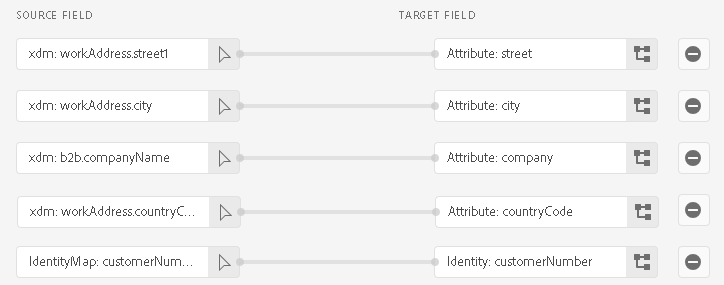

# [!DNL SAP Commerce] conexión

[!DNL SAP Commerce], anteriormente conocido como [[!DNL Hybris]](https://www.sap.com/india/products/acquired-brands/what-is-hybris.html), es una solución de plataforma de comercio electrónico basada en la nube para empresas B2B y B2C y está disponible como parte del catálogo de productos de SAP Customer Experience. [[!DNL SAP] Facturación de suscripción](https://www.sap.com/products/financial-management/subscription-billing.html) es un producto incluido en la cartera de productos y permite una administración completa del ciclo de vida de las suscripciones con experiencias de venta y pago simplificadas mediante integraciones estandarizadas.

Esta [!DNL Adobe Experience Platform] [destino](/help/destinations/home.md) utiliza el [[!DNL SAP Subscription Billing] API de administración de clientes](https://api.sap.com/api/BusinessPartner_APIs/path/PUT_customers-customerNumber), para actualizar los detalles del cliente en [!DNL SAP Commerce] desde una audiencia de Experience Platform existente después de la activación.

Instrucciones para autenticarse en su [!DNL SAP Commerce] más abajo, en la sección [Autenticar en el destino](#authenticate) sección.

## Casos de uso {#use-cases}

Para ayudarle a comprender mejor cómo y cuándo debe utilizar el [!DNL SAP Commerce] Destino, este es un ejemplo de caso de uso que los clientes de Adobe Experience Platform pueden solucionar mediante este destino.

[!DNL SAP Commerce] Los clientes almacenan información sobre personas o entidades organizativas que interactúan con su empresa. Su equipo utiliza los clientes existentes en [!DNL SAP Commerce] para crear audiencias de Experience Platform. Después de enviar estas audiencias a [!DNL SAP Commerce]Sin embargo, su información se actualiza y a cada cliente se le asigna una propiedad con su valor como nombre de audiencia que indica a qué audiencia pertenece el cliente.

## Requisitos previos {#prerequisites}

Consulte las secciones siguientes para conocer todos los requisitos previos que debe configurar en Experience Platform y [!DNL SAP Commerce] y para la información que debe recopilar antes de trabajar con [!DNL SAP Commerce] destino.

### Requisitos previos del Experience Platform {#prerequisites-in-experience-platform}

Antes de activar los datos en [!DNL SAP Commerce] destino, debe tener un [esquema](/help/xdm/schema/composition.md), a [conjunto de datos](https://experienceleague.adobe.com/docs/platform-learn/tutorials/data-ingestion/create-datasets-and-ingest-data.html), y [audiencias](https://experienceleague.adobe.com/docs/platform-learn/tutorials/audiences/create-audiences.html) creado en [!DNL Experience Platform].

Consulte la documentación del Experience Platform para [Grupo de campos de esquema Detalles de pertenencia a audiencia](/help/xdm/field-groups/profile/segmentation.md) si necesita orientación sobre los estados de audiencia.

### Requisitos previos para la [!DNL SAP Commerce] destino {#prerequisites-destination}

Tenga en cuenta los siguientes requisitos previos para exportar datos de Platform a su [!DNL SAP Commerce] cuenta:

#### Debe tener un [!DNL SAP Subscription Billing] account {#prerequisites-account}

Para exportar datos de Platform a su [!DNL SAP Commerce] cuenta, necesita tener un [!DNL SAP Subscription Billing] cuenta. Si no tiene una cuenta de facturación válida, póngase en contacto con su [!DNL SAP] administrador de cuentas. Consulte la [[!DNL SAP] Configuración de plataforma](https://help.sap.com/doc/5fd179965d5145fbbe7f2a7aa1272338/latest/en-US/PlatformConfiguration.pdf) para obtener más información.

#### Generación de una clave de servicio {#prerequisites-service-key}

* El [!DNL SAP Commerce] clave de servicio le permite acceder al [!DNL SAP Subscription Billing] API a través del Experience Platform. Consulte la [!DNL SAP Commerce] [crear una clave de servicio con el ID de cliente y el secreto de cliente](https://help.sap.com/docs/CLOUD_TO_CASH_OD/1216e7b79c984675b0a6f0005e351c74/87c11a0f5dc3494eaf3baa355925c030.html#create-a-service-key-with-client-id-and-client-secret) para crear una clave de servicio. [!DNL SAP Commerce] requiere lo siguiente:
   * ID de cliente
   * Secreto del cliente
   * URL. El patrón de URL es el siguiente: `https://subscriptionbilling.authentication.eu10.hana.ondemand.com`. Este valor se utilizará más adelante para obtener valores para `Region` y `Endpoint`.

+++Seleccione para ver un ejemplo de la clave de servicio

```json
{ 
    "url": "https://eu10.revenue.cloud.sap/api",
    "uaa": {
        "clientid": "XXX",
        "clientsecret": "XXX",
        "url": "https://subscriptionbilling.authentication.eu10.hana.ondemand.com",
        "identityzone": "subscriptionbilling",
        "identityzoneid": "XXX",
        "tenantid": "XXX",
        "tenantmode": "dedicated",
        "sburl": "https://internal-xsuaa.authentication.eu10.hana.ondemand.com",
        "apiurl": "https://api.authentication.eu10.hana.ondemand.com",
        "verificationkey": "XXX",
        "xsappname": "XXX",
        "subaccountid": "XXX",
        "uaadomain": "authentication.eu10.hana.ondemand.com",
        "zoneid": "XXX",
        "credential-type": "binding-secret"
    },
    "vendor": "SAP"
}
```

+++

#### Creación de referencias personalizadas en [!DNL SAP Subscription Billing] {#prerequisites-custom-reference}

Para actualizar el estado de audiencia del Experience Platform en [!DNL SAP Subscription Billing], necesitará un campo de referencia personalizado para cada audiencia seleccionada en Platform.

Para crear las referencias personalizadas, inicie sesión en su [!DNL SAP Subscription Billing] y vaya a la **[Datos maestros y configuración]** > **[Referencias personalizadas]** página. A continuación, seleccione **[!UICONTROL Crear]** para añadir una nueva referencia a cada audiencia seleccionada en Platform. Necesitará estos nombres de campo de referencia en los siguientes [Programar exportación de audiencias y ejemplo](#schedule-segment-export-example) paso.

Ejemplo de cómo crear un formulario personalizado **[!UICONTROL Tipo de referencia]** dentro [!DNL SAP Subscription Billing] se muestra a continuación:


Para obtener más información, consulte la [!DNL SAP Subscription Billing] [referencias personalizadas](https://help.sap.com/docs/CLOUD_TO_CASH_OD/80d121f216af43648e79664efe5595f7/85696a63c8d8453a934e86c9413a25cf.html?version=2023-11-27) documentación.

### Recopilar credenciales necesarias {#gather-credentials}

Para conectar [!DNL SAP Commerce] para acceder a Experience Platform, debe proporcionar valores para las siguientes propiedades de conexión:

| Credencial | Descripción |
| --- | --- |
| ID de cliente | El valor de `clientId` desde la clave de servicio. |
| Secreto del cliente | El valor de `clientSecret` desde la clave de servicio. |
| Punto de conexión | El valor de `url` desde la clave de servicio, es similar a `https://subscriptionbilling.authentication.eu10.hana.ondemand.com`. |
| Región | Su ubicación del centro de datos. La región está presente en el `url` y tiene un valor similar al siguiente `eu10` o `us10`. Por ejemplo, si la variable `url` es `https://eu10.revenue.cloud.sap/api` necesita `eu10`. |

## Mecanismos de protección {#guardrails}

Solicitudes de API a [!DNL SAP Cloud Management service] están sujetos a [Límites de velocidad](https://help.sap.com/docs/btp/sap-business-technology-platform/account-administration-rate-limiting). Cuando se supera el límite de tasa, se encontrará con un `HTTP 429 Too Many Requests` código de estado de respuesta

## Identidades admitidas {#supported-identities}

[!DNL SAP Commerce] admite la actualización de identidades que se describe en la tabla siguiente. Más información sobre [identidades](/help/identity-service/features/namespaces.md).

| Identidad de destino | Descripción | Consideraciones |
| --- | --- | --- |
| `customerNumberSAP` | Un identificador de cliente del cliente individual o corporativo ya presente en su [!DNL SAP Commerce] cuenta. | Obligatorio |

## Audiencias compatibles {#supported-audiences}

Esta sección describe todas las audiencias que puede exportar a este destino.

Este destino admite la activación de todas las audiencias generadas a través del Experience Platform [Servicio de segmentación](../../../segmentation/home.md).

Este destino también admite la activación de las audiencias que se describen en la tabla siguiente.

| Tipo de público | Admitido | Descripción |
| ------------- | --------- | ----------- |
| [!DNL Segmentation Service] | ✓ | Audiencias generadas mediante el Experience Platform [Servicio de segmentación](../../../segmentation/home.md). |
| Cargas personalizadas | ✓ | Audiencias [importado](../../../segmentation/ui/audience-portal.md#import-audience) en el Experience Platform desde archivos CSV. |

{style="table-layout:auto"}

## Tipo y frecuencia de exportación {#export-type-frequency}

Consulte la tabla siguiente para obtener información sobre el tipo y la frecuencia de exportación de destino.

| Elemento | Tipo | Notas |
---------|----------|---------|
| Tipo de exportación | **[!UICONTROL Basado en perfiles]** | <ul><li>Está exportando todos los miembros de una audiencia, junto con los campos de esquema deseados *(por ejemplo: dirección de correo electrónico, número de teléfono, apellidos)*, según la asignación de campo.</li><li> Para cada audiencia seleccionada en Platform, la correspondiente [!DNL SAP Commerce] Un atributo adicional se actualiza con su estado de audiencia de Platform.</li></ul> |
| Frecuencia de exportación | **[!UICONTROL Transmisión]** | <ul><li>Los destinos de streaming son conexiones basadas en API &quot;siempre activadas&quot;. Cuando se actualiza un perfil en Experience Platform en función de la evaluación de audiencias, el conector envía la actualización de forma descendente a la plataforma de destino. Más información sobre [destinos de streaming](/help/destinations/destination-types.md#streaming-destinations).</li></ul> |

{style="table-layout:auto"}

## Conexión al destino {#connect}

>[!IMPORTANT]
>
>Para conectarse al destino, necesita el **[!UICONTROL Administrar destinos]** [permiso de control de acceso](/help/access-control/home.md#permissions). Lea el [información general de control de acceso](/help/access-control/ui/overview.md) o póngase en contacto con el administrador del producto para obtener los permisos necesarios.

Para conectarse a este destino, siga los pasos descritos en la sección [tutorial de configuración de destino](../../ui/connect-destination.md). En el flujo de trabajo de configuración de destino, rellene los campos enumerados en las dos secciones siguientes.

En **[!UICONTROL Destinos]** > **[!UICONTROL Catálogo]**, buscar [!DNL SAP Commerce]. También puede encontrarlo en la sección **[!UICONTROL eCommerce]** categoría.

### Autenticarse en el destino {#authenticate}

Rellene los campos obligatorios siguientes. Consulte la [Generación de una clave de servicio](#prerequisites-service-key) para obtener cualquier guía.

| Campo | Descripción |
| --- | --- |
| **[!UICONTROL ID de cliente]** | El valor de `clientId` desde la clave de servicio. |
| **[!UICONTROL Secreto de cliente]** | El valor de `clientSecret` desde la clave de servicio. |
| **[!UICONTROL Extremo]** | El valor de `url` desde la clave de servicio, es similar a `https://subscriptionbilling.authentication.eu10.hana.ondemand.com`. |
| **[!UICONTROL Región]** | Su ubicación del centro de datos. La región está presente en el `url` y tiene un valor similar al siguiente `eu10` o `us10`. Por ejemplo, si la variable `url` es `https://eu10.revenue.cloud.sap/api` necesita `eu10`. |

Para autenticarse en el destino, seleccione **[!UICONTROL Conectar con destino]**.


Si los detalles proporcionados son válidos, la interfaz de usuario muestra un **[!UICONTROL Conectado]** estado con una marca de verificación verde. A continuación, puede continuar con el paso siguiente.

### Rellenar detalles de destino {#destination-details}

Para configurar los detalles del destino, rellene los campos obligatorios y opcionales a continuación. Un asterisco junto a un campo en la interfaz de usuario indica que el campo es obligatorio.


* **[!UICONTROL Nombre]**: Un nombre con el que reconocerá este destino en el futuro.
* **[!UICONTROL Descripción]**: Una descripción que le ayudará a identificar este destino en el futuro.
* **[!UICONTROL Tipo de cliente]**: seleccione una de las siguientes opciones ***Individual*** o ***Corporativo*** según las entidades de la audiencia. El [!DNL SAP Subscription Billing] [esquema](https://api.sap.com/api/BusinessPartner_APIs/schema) cambia los campos obligatorios en función de esta selección, que se asigna al `customerType` atributo. Si la selección es ***Corporativo***, luego las asignaciones obligatorias como `firstName` y `lastName` requerido para un cliente individual se ignorará y `company` se convierte en obligatorio y viceversa.

### Habilitar alertas {#enable-alerts}

Puede activar alertas para recibir notificaciones sobre el estado del flujo de datos a su destino. Seleccione una alerta de la lista a la que suscribirse para recibir notificaciones sobre el estado del flujo de datos. Para obtener más información sobre las alertas, consulte la guía de [suscripción a alertas de destinos mediante la IU](../../ui/alerts.md).

Cuando haya terminado de proporcionar detalles para la conexión de destino, seleccione **[!UICONTROL Siguiente]**.

## Activar públicos en este destino {#activate}

>[!IMPORTANT]
> 
>* Para activar los datos, necesita el **[!UICONTROL Ver destinos]**, **[!UICONTROL Activar destinos]**, **[!UICONTROL Ver perfiles]**, y **[!UICONTROL Ver segmentos]** [permisos de control de acceso](/help/access-control/home.md#permissions). Lea el [información general de control de acceso](/help/access-control/ui/overview.md) o póngase en contacto con el administrador del producto para obtener los permisos necesarios.
>* Para exportar *identidades*, necesita el **[!UICONTROL Ver gráfico de identidad]** [permiso de control de acceso](/help/access-control/home.md#permissions). <br> {width="100" zoomable="yes"}

Leer [Activación de perfiles y audiencias en destinos de exportación de audiencia de streaming](/help/destinations/ui/activate-segment-streaming-destinations.md) para obtener instrucciones sobre cómo activar audiencias en este destino.

### Asignar atributos e identidades {#map}

Para enviar correctamente los datos de audiencia de Adobe Experience Platform a [!DNL SAP Commerce] destino, debe pasar por el paso de asignación de campos. La asignación consiste en crear un vínculo entre los campos de esquema del Modelo de datos de experiencia (XDM) en la cuenta de Platform y sus equivalentes correspondientes desde el destino de destino. Para asignar correctamente los campos XDM a [!DNL SAP Commerce] campos de destino, siga los pasos a continuación:

#### Asignar el `customerNumberSAP` identidad

El `customerNumberSAP` La identidad es una asignación obligatoria para este destino. Siga los pasos a continuación para asignarlo:
1. En el **[!UICONTROL Asignación]** paso, seleccione **[!UICONTROL Añadir nueva asignación]**. Ahora puede ver una nueva fila de asignación en la pantalla.
   
1. En el **[!UICONTROL Seleccionar campo de origen]** , seleccione la **[!UICONTROL Seleccionar área de nombres de identidad]** y seleccione `customerNumberSAP`.
   
1. En el **[!UICONTROL Seleccionar campo de destino]** , seleccione la **[!UICONTROL Seleccionar área de nombres de identidad]** y seleccione la `customerNumber` identidad.
   

| Campo de origen | Campo de destino | Obligatorio |
| --- | --- | --- |
| `IdentityMap: customerNumberSAP` | `Identity: customerNumber` | Sí |

A continuación, se muestra un ejemplo con la asignación de identidad:


#### Atributos de asignación

Para agregar cualquier otro atributo que desee actualizar entre el esquema de perfil XDM y la variable [!DNL SAP Subscription Billing] Cuenta de, repita los pasos siguientes:
1. En el **[!UICONTROL Asignación]** paso, seleccione **[!UICONTROL Añadir nueva asignación]**. Ahora puede ver una nueva fila de asignación en la pantalla.
   
1. En el **[!UICONTROL Seleccionar campo de origen]** , seleccione la **[!UICONTROL Seleccionar atributos]** y seleccione el atributo XDM.
   
1. En el **[!UICONTROL Seleccionar campo de destino]** ventana, elija **[!UICONTROL Seleccionar atributos personalizados]** categoría y escriba el nombre de la [!DNL SAP Subscription Billing] atributo de la lista de clientes [esquema](https://api.sap.com/api/BusinessPartner_APIs/schema) atributos.
   

>[!IMPORTANT]
>
> Los nombres de los campos de destino distinguen entre mayúsculas y minúsculas y deben coincidir con el [!DNL SAP Subscription Billing] nombres de atributos. La única excepción es `country` dónde debe utilizar `countryCode` en su lugar. [!DNL SAP Subscription Billing] admite códigos de país alfa-2 (ISO 3166). El valor distingue entre mayúsculas y minúsculas y debe tener entre 0 y 3 caracteres, por lo que asegúrese de proporcionar exactamente como se definió. De lo contrario, encontrará errores: `The country code {} does not exist` o `size must be between 0 and 3`.

#### Mapa `mandatory` atributos del tipo de cliente seleccionado

Las asignaciones de atributos obligatorias dependen del **[!UICONTROL Tipo de cliente]** que ha seleccionado. Para asignar los atributos obligatorios, seleccione una de las siguientes opciones:

>[!BEGINTABS]

>[!TAB Cliente individual]

| Campo de origen | Campo de destino | Obligatorio |
| --- | --- | --- |
| `xdm: person.lastName` | `Attribute: lastName` | Sí |
| `xdm: workAddress.countryCode` | `Attribute: countryCode` | Sí |

>[!TAB Cliente corporativo]

| Campo de origen | Campo de destino | Obligatorio |
| --- | --- | --- |
| `xdm: b2b.companyName` | `Attribute: company` | Sí |
| `xdm: workAddress.countryCode` | `Attribute: countryCode` | Sí |

>[!ENDTABS]

#### Asignación de atributos adicionales

A continuación, puede agregar cualquier asignación adicional entre el esquema de perfil XDM y la variable [!DNL SAP Subscription Billing] [esquema](https://api.sap.com/api/BusinessPartner_APIs/schema) atributos para un cliente, como se muestra a continuación:

>[!BEGINTABS]

>[!TAB Cliente individual]

| Campo de origen | Campo de destino | Obligatorio |
| --- | --- | --- |
| `xdm: person.name.firstName` | `Attribute: firstName` | No |
| `xdm: workAddress.street1` | `Attribute: street` | No |
| `xdm: workAddress.city` | `Attribute: city` | No |

A continuación se muestra un ejemplo con asignaciones de atributos obligatorias y opcionales en las que el cliente es un individuo:


>[!TAB Cliente corporativo]

| Campo de origen | Campo de destino | Obligatorio |
| --- | --- | --- |
| `xdm: workAddress.street1` | `Attribute: street` | No |
| `xdm: workAddress.city` | `Attribute: city` | No |

A continuación se muestra un ejemplo con asignaciones de atributos obligatorias y opcionales en las que el cliente es una empresa:


>[!ENDTABS]

Cuando haya terminado de proporcionar las asignaciones para la conexión de destino, seleccione **[!UICONTROL Siguiente]**.

### Programar exportación de audiencias y ejemplo {#schedule-segment-export-example}

Al realizar la [Programar exportación de audiencias](/help/destinations/ui/activate-segment-streaming-destinations.md#scheduling) , debe asignar manualmente las audiencias de Platform a la variable [atributos](#prerequisites-attribute) in [!DNL SAP Subscription Billing].

Ejemplo del paso Programar exportación de audiencias, con la ubicación del [!DNL SAP Commerce] **[!UICONTROL ID de asignación]** resaltado, se muestra a continuación:


Para ello, seleccione cada segmento e introduzca el nombre de la referencia personalizada desde [!DNL SAP Subscription Billing] en el [!DNL SAP Commerce] **[!UICONTROL ID de asignación]** campo conector de destino. Para obtener instrucciones sobre la creación de referencias personalizadas, consulte la [Creación de referencias personalizadas en [!DNL SAP Subscription Billing]](#prerequisites-custom-reference) sección.

>[!IMPORTANT]
>
> No utilice la etiqueta de referencia personalizada como valor.
>

Por ejemplo, si la audiencia de Experience Platform seleccionada es `sap_audience1` y desea que su estado se actualice a la [!DNL SAP Subscription Billing] referencia personalizada `SAP_1`, especifique este valor en [!DNL SAP_Commerce] **[!UICONTROL ID de asignación]** field.

Un ejemplo **[!UICONTROL Tipo de referencia]** de [!DNL SAP Subscription Billing] se muestra a continuación:


Ejemplo del paso Programar exportación de audiencias, con una audiencia seleccionada y su correspondiente [!DNL SAP Commerce] **[!UICONTROL ID de asignación]** resaltado, se muestra a continuación:


Como se muestra, el valor dentro de **[!UICONTROL ID de asignación]** El campo debe coincidir exactamente con el [!DNL SAP Subscription Billing] **[!UICONTROL Tipo de referencia]** valor .

Repita esta sección para cada audiencia de Platform activada.

En función de la imagen que se muestra arriba, donde ha seleccionado dos audiencias, la asignación sería la siguiente: | [!DNL SAP Commerce] nombre de audiencia | [!DNL SAP Subscription Billing] **[!UICONTROL Tipo de referencia]** | [!DNL SAP Commerce] **[!UICONTROL ID de asignación]** valor | | — | — | — | | sap_audience1 | `SAP_1` | `SAP_1` | | Audiencia SAP2 | `SAP_2` | `SAP_2` |

## Validar exportación de datos {#exported-data}

Para comprobar que ha configurado correctamente el destino, siga los pasos a continuación:

Inicie sesión en [!DNL SAP Subscription Billing] y, a continuación, vaya a la **[!UICONTROL Contactos]** para comprobar los estados de audiencia. La lista se puede configurar para mostrar columnas para las referencias personalizadas y mostrar los estados de audiencia correspondientes.


## Uso de datos y gobernanza {#data-usage-governance}

Todo [!DNL Adobe Experience Platform] Los destinos de cumplen con las políticas de uso de datos al gestionar los datos. Para obtener información detallada sobre cómo [!DNL Adobe Experience Platform] aplica la gobernanza de datos. Consulte la [Resumen de gobernanza de datos](/help/data-governance/home.md).

## Errores y solución de problemas {#errors-and-troubleshooting}

Consulte la [[!DNL SAP Subscription Billing] Tipos de error](https://help.sap.com/docs/CLOUD_TO_CASH_OD/987aec876092428f88162e438acf80d6/1a6a0dd6129c48e8b235190a1b5409fa.html) página de documentación de para obtener una lista de los posibles tipos de error y sus códigos de respuesta.

## Recursos adicionales {#additional-resources}

Información útil adicional del [!DNL SAP] Esta documentación es:
* [Facturación de suscripción SAP integrada](https://help.sap.com/docs/CLOUD_TO_CASH_OD/1216e7b79c984675b0a6f0005e351c74/e4b8badf7d124026991e4ab6b57d2a33.html)

### Changelog

Esta sección recoge la funcionalidad y las actualizaciones significativas de la documentación realizadas en este conector de destino.

+++ Ver registro de cambios

| Mes de lanzamiento | Tipo de actualización | Descripción |
|---|---|---|
| Enero de 2024 | Versión inicial | Versión de destino inicial y publicación de documentación. |

{style="table-layout:auto"}

+++
