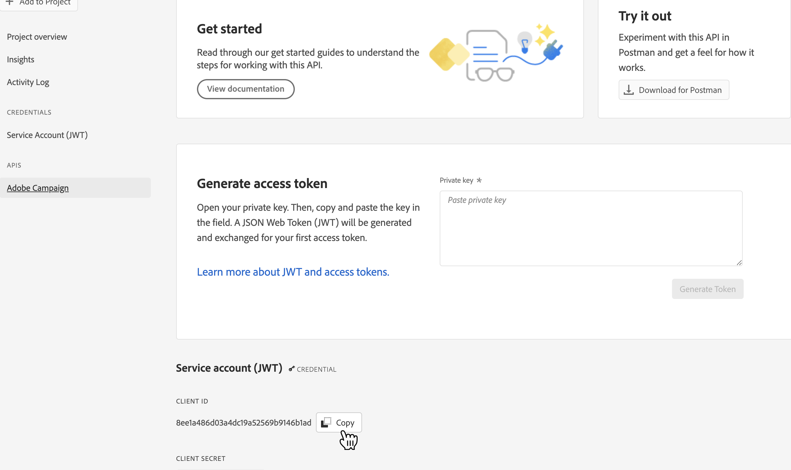

# Conexión Adobe Campaign Managed Cloud Services {#adobe-campaign-managed-services}

>[!IMPORTANT]
>
>Esta integración funciona con [Adobe Campaign versión 8.4 o superior](https://experienceleague.adobe.com/docs/campaign/campaign-v8/new/release-notes.html?lang=en#release-8-4-1).

## Información general {#overview}

Adobe Campaign Managed Cloud Services proporciona una plataforma para diseñar experiencias de clientes en canales múltiples y un entorno para la organización de campañas visuales, la administración de interacciones en tiempo real y la ejecución en canales cruzados. [Introducción a Campaign](https://experienceleague.adobe.com/docs/campaign/campaign-v8/start/get-started.html)

Utilice Campaign para lo siguiente:
* Impulso de la personalización y la participación mediante una única vista accesible del cliente,
* Integración de canales de correo electrónico, móviles, en línea y sin conexión en el recorrido del cliente,
* Automatización de la entrega de mensajes y ofertas significativos y oportunos.

>[!IMPORTANT]
>
>Tenga en cuenta las siguientes limitaciones al utilizar la conexión Adobe Campaign Managed Cloud Services:
>
>* Un máximo de 50 segmentos puede ser [activado](#activate) para el destino,
>* Para cada segmento, puede añadir hasta 20 campos a [map](#map) a Adobe Campaign,
>* Retención de datos en la zona de aterrizaje de datos del almacenamiento del blob de Azure (DLZ) : 7 días,
>* La frecuencia de activación es de 3 horas como mínimo.

## Casos de uso {#use-cases}

Para ayudarle a comprender mejor cómo y cuándo debe utilizar el destino del servicio de administración de Adobe Campaign, aquí tiene un caso de uso de muestra que los clientes de Adobe Experience Platform pueden resolver utilizando este destino.

Adobe Experience Platform crea un perfil de cliente que incorpora información como el gráfico de identidad, datos de comportamiento de analytics, combina datos sin conexión y en línea, etc. Con esta integración, puede aumentar las capacidades de segmentación que ya existen en Adobe Campaign con esas audiencias con tecnología Adobe Experience Platform y, por lo tanto, puede activar esos datos en Campaign.

Por ejemplo, una empresa de indumentaria deportiva desea aprovechar los segmentos inteligentes con tecnología Adobe Experience Platform y activarlos con Adobe Campaign para llegar a su base de clientes en los distintos canales admitidos por Adobe Campaign.

Una vez enviados los mensajes, desean mejorar el perfil del cliente en Adobe Experience Platform con datos de experiencia de Adobe Campaign, como envíos, aperturas y clics.

El resultado son campañas multicanal más coherentes en todo el ecosistema de Adobe Experience Cloud y un perfil de cliente enriquecido que se adapta y aprende rápidamente.

[Obtenga más información sobre la integración de Adobe Campaign con Adobe Experience Platform](https://experienceleague.adobe.com/docs/campaign/campaign-v8/connect/ac-aep.html)

## Requisitos previos {#prerequisites}

Para que Campaign pueda recuperar datos de Adobe Experience Platform, debe crear un proyecto de API de campaña y solicitar al Servicio de atención al cliente que añada el ID de cliente asociado a una lista de permitidos.

>[!NOTE]
>
>La información global sobre cómo crear un proyecto de API se detalla en [esta documentación](https://experienceleague.adobe.com/docs/platform-learn/getting-started-for-data-architects-and-data-engineers/set-up-developer-console-and-postman.html)

1. Iniciar sesión en [Consola de Adobe Developer](https://console.adobe.io/) y cree un nuevo proyecto.

1. Select **[!UICONTROL Añadir API]** y elija **[!UICONTROL Adobe Campaign]**.

   

1. Genere un par de claves.

1. Seleccione el `<Instance Name> - admin` perfil de producto y seleccione **[!UICONTROL Guardar la API configurada]**.

1. Se crea el proyecto de API. Tenga en cuenta que **[!UICONTROL ID de cliente]** se muestra en el proyecto. Póngase en contacto con el Servicio de atención al cliente de Adobe y pídale que añada su ID de cliente a una lista de permitidos.

   

## Identidades compatibles {#supported-identities}

*Adobe Campaign Managed Cloud Services* admite la activación de identidades descritas en la tabla siguiente. Más información sobre [identidades](/help/identity-service/namespaces.md).

| Identidad de Target | Descripción | Consideraciones |
|---|---|---|
| external_id | ID de usuario personalizados | Seleccione esta identidad de destino cuando la identidad de origen sea un área de nombres personalizada. Se recomienda utilizar esta identidad y asignarla al ID de la instancia de Campaign que represente al cliente (loyalty_ID, account_ID, customer_ID...). |
| ECID | Experience Cloud ID | Un espacio de nombres que representa ECID. Este espacio de nombres también puede ser referenciado por los siguientes alias: &quot;Adobe Marketing Cloud ID&quot;, &quot;Adobe Experience Cloud ID&quot;, &quot;Adobe Experience Platform ID&quot;. Consulte el siguiente documento sobre [ECID](/help/identity-service/ecid.md) para obtener más información. |
| email_lc_sha256 | Direcciones de correo electrónico con hash con el algoritmo SHA256 | Adobe Experience Platform admite las direcciones de correo electrónico con texto sin formato y con hash SHA 256. Si el campo de origen contiene atributos sin hash, marque la casilla de verificación **[!UICONTROL Aplicar transformación]** para [!DNL Platform] hash automático de los datos al activarlos. |
| phone_sha256 | Números de teléfono con hash con el algoritmo SHA256 | Adobe Experience Platform admite los números de teléfono con texto sin formato y con hash SHA256. Si el campo de origen contiene atributos sin hash, marque la casilla de verificación **[!UICONTROL Aplicar transformación]** para [!DNL Platform] hash automático de los datos al activarlos. |
| GAID | Google Advertising ID | Seleccione la identidad objetivo GAID cuando su identidad de origen sea un área de nombres GAID. |
| IDFA | Apple ID para anunciantes | Seleccione la identidad de destino IDFA cuando la identidad de origen sea un área de nombres IDFA. |

{style=&quot;table-layout:auto&quot;}

## Tipo de exportación y frecuencia {#export-type-frequency}

Consulte la tabla siguiente para obtener información sobre el tipo y la frecuencia de exportación de destino.

| Elemento | Tipo | Notas |
---------|----------|---------|
| Tipo de exportación | **[!UICONTROL Basado en perfiles]** | Está exportando todos los miembros de un segmento, junto con los campos de esquema deseados (por ejemplo: dirección de correo electrónico, número de teléfono, apellidos), tal como se elige en la pantalla seleccionar atributos de perfil del [flujo de trabajo de activación de destino](/help/destinations/ui/activate-batch-profile-destinations.md#select-attributes). |
| Frecuencia de exportación | **[!UICONTROL Lote]** | Los destinos de lote exportan archivos a plataformas descendentes en incrementos de tres, seis, ocho, doce o veinticuatro horas. Más información sobre [destinos basados en archivos por lotes](/help/destinations/destination-types.md#file-based). |

{style=&quot;table-layout:auto&quot;}

## Conectarse al destino {#connect}

>[!IMPORTANT]
> 
>Para conectarse al destino, necesita la variable **[!UICONTROL Administrar destinos]** [permiso de control de acceso](/help/access-control/home.md#permissions). Lea el [información general sobre el control de acceso](/help/access-control/ui/overview.md) o póngase en contacto con el administrador del producto para obtener los permisos necesarios.

Para conectarse a este destino, siga los pasos descritos en la sección [tutorial de configuración de destino](../../ui/connect-destination.md). En el flujo de trabajo de configuración de destino, rellene los campos que aparecen en las dos secciones siguientes.

### Rellenar detalles de destino {#destination-details}

Para configurar los detalles del destino, rellene los campos opcionales y requeridos a continuación. Un asterisco junto a un campo en la interfaz de usuario indica que el campo es obligatorio.

* **[!UICONTROL Nombre]**: Un nombre por el cual reconocerá este destino en el futuro.
* **[!UICONTROL Descripción]**: Descripción que le ayudará a identificar este destino en el futuro.
* **[!UICONTROL Seleccionar instancia]**: Su **[!DNL Campaign]** instancia de marketing.
* **[!UICONTROL Asignación de destino]**: Seleccione la asignación de destino que está utilizando en **[!DNL Adobe Campaign]** para enviar entregas. [Más información](https://experienceleague.adobe.com/docs/campaign/campaign-v8/profiles-and-audiences/add-profiles/target-mappings.html).

### Habilitar alertas {#enable-alerts}

Puede activar las alertas para recibir notificaciones sobre el estado del flujo de datos a su destino. Seleccione una alerta de la lista para suscribirse y recibir notificaciones sobre el estado de su flujo de datos. Para obtener más información sobre las alertas, consulte la guía de [suscripción a alertas de destinos mediante la interfaz de usuario](../../ui/alerts.md).

Cuando haya terminado de proporcionar detalles para la conexión de destino, seleccione **[!UICONTROL Siguiente]**.

### Política de gobernanza y medidas de aplicación {#governance}

Seleccione las acciones de marketing aplicables a los datos que desea exportar al destino. Para Adobe Campaign, le recomendamos que seleccione la opción **[!UICONTROL Targeting de correo electrónico]** acción de marketing.

Para obtener más información sobre las acciones de marketing, consulte la [información general sobre las políticas de uso de datos](/help/data-governance/policies/overview.md) página.

## Activar segmentos en este destino {#activate}

>[!IMPORTANT]
> 
>Para activar los datos, necesita la variable **[!UICONTROL Administrar destinos]**, **[!UICONTROL Activar destinos]**, **[!UICONTROL Ver perfiles]** y **[!UICONTROL Ver segmentos]** [permisos de control de acceso](/help/access-control/home.md#permissions). Lea el [información general sobre el control de acceso](/help/access-control/ui/overview.md) o póngase en contacto con el administrador del producto para obtener los permisos necesarios.

Lectura [Activar datos de audiencia en destinos de exportación de perfiles en lote](https://experienceleague.adobe.com/docs/experience-platform/destinations/ui/activate/activate-batch-profile-destinations.html) para obtener instrucciones sobre la activación de datos de audiencia en este destino.

### Asignación de atributos e identidades {#map}

Seleccione los campos XDM que desea exportar con los perfiles y asígnelos a los campos correspondientes de Adobe Campaign.[Obtenga más información sobre la selección de identidades y atributos para los destinos de marketing por correo electrónico](overview.md)

1. Seleccionar campos de origen:

   * Seleccione un **identifier** (Por ejemplo: el campo de correo electrónico) como identidad de origen que identifica de forma exclusiva un perfil en Adobe Experience Platform y Adobe Campaign.

   * Seleccionar el resto **Atributos de perfil de origen XDM** que deben exportarse a Adobe Campaign.
   >[!NOTE]
   >
   >El campo &quot;segmentMembershipStatus&quot; es una asignación obligatoria para reflejar el estado segmentMembership . Este campo se añade de forma predeterminada y no se puede modificar ni eliminar.

1. Asigne cada campo con su campo de destino en Adobe Campaign. Los campos de destino disponibles están determinados por la asignación de destino seleccionada al [creación del destino](#destination-details).

1. Identifique los atributos obligatorios y las claves de deduplicación. Tenga en cuenta que los valores de los atributos marcados como &quot;Obligatorio&quot; o &quot;Clave de deduplicación&quot; no pueden ser nulos.

   * [Atributos obligatorios](../../ui/activate-batch-profile-destinations.md#mandatory-attributes) asegúrese de que todos los registros de perfil contienen los atributos seleccionados. Por ejemplo: todos los perfiles exportados contienen una dirección de correo electrónico. La recomendación es establecer como obligatorio tanto el campo de identidad como el campo utilizado como clave de deduplicación.
   * [Una clave de deduplicación](../../ui/activate-batch-profile-destinations.md#mandatory-attributes) es una clave principal que determina la identidad mediante la cual los usuarios desean que se dedupliquen sus perfiles.

      >[!IMPORTANT]
      >
      >Asegúrese de que el nombre del atributo de clave de deduplicación coincide con un nombre de columna de la asignación de destino seleccionada.
   

1. Una vez realizada la asignación, puede revisar y completar la configuración de destino para empezar a enviar datos a **[!DNL Campaign]**.
   [Obtenga información sobre cómo revisar y completar la configuración de destino](/help/destinations/destination-types.md#review).

## Datos exportados / Validar exportación de datos {#exported-data}

Una vez activado un destino, puede acceder al trabajo correspondiente y exportar los datos en Campaign.

### Supervisar trabajos de exportación de datos {#jobs}

Vaya a la **[!UICONTROL Administración]** > **[!UICONTROL Auditoría]** > **[!UICONTROL Trabajos de carga de audiencia]** para controlar todos los trabajos de exportación activados desde Adobe Experience Platform.

### Acceso a datos exportados {#data}

Vaya a la **[!UICONTROL Perfil y destino]** > **[!UICONTROL Lista]** > **[!UICONTROL Audiencias de AEP]** para acceder a las audiencias creadas después de activar un destino.

## Uso y gobernanza de los datos {#data-usage-governance}

Todo [!DNL Adobe Experience Platform] Los destinos de cumplen las políticas de uso de datos al administrar los datos. Para obtener información detallada sobre cómo [!DNL Adobe Experience Platform] exige la administración de datos, lea la [Información general sobre la administración de datos](/help/data-governance/home.md).
