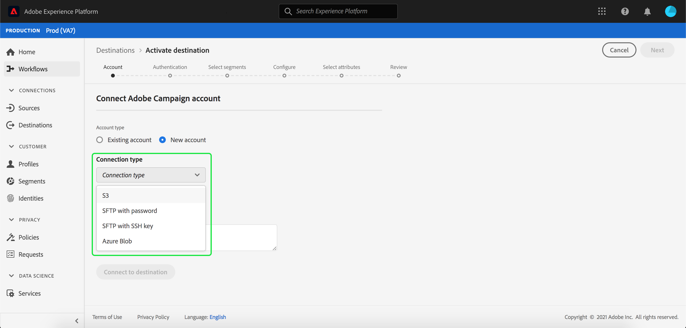

# Conexión Adobe Campaign

## Información general {#overview}

Adobe Campaign es un conjunto de soluciones que le ayudan a personalizar y entregar campañas en todos sus canales en línea y sin conexión. Consulte [Introducción al Campaign Classic](https://experienceleague.adobe.com/docs/campaign-classic/using/getting-started/starting-with-adobe-campaign/about-adobe-campaign-classic.html) para obtener más información.

Para enviar datos de segmentos a Adobe Campaign, primero debe [conectar el destino](#connect-destination) en Adobe Experience Platform y luego [configurar una importación de datos](#import-data-into-campaign) desde la ubicación de almacenamiento en Adobe Campaign.

## Tipo de exportación {#export-type}

**Basado en perfiles** : exporta todos los miembros de un segmento, junto con los campos de esquema deseados (por ejemplo: dirección de correo electrónico, número de teléfono y apellidos), tal como se elige en el paso  **[!UICONTROL Select]** attributess del flujo de trabajo de activación de  [destino](../../ui/activate-destinations.md#select-attributes).

## LISTA DE PERMITIDOS de dirección IP {#allow-list}

Al configurar destinos de marketing por correo electrónico con almacenamiento SFTP, Adobe recomienda que agregue ciertos rangos de IP a la lista de permitidos.

Consulte la [lista de permitidos de direcciones IP para destinos de almacenamiento en la nube](../cloud-storage/ip-address-allow-list.md) si necesita agregar IP de Adobe a su lista de permitidos.

## Conectar destino {#connect-destination}

En **[!UICONTROL Connections]** > **[!UICONTROL Destinations]**, seleccione Adobe Campaign y, a continuación, seleccione **[!UICONTROL Configure]**.

>[!NOTE]
>
>Si ya existe una conexión con este destino, puede ver un botón **[!UICONTROL Activate]** en la tarjeta de destino. Para obtener más información sobre la diferencia entre [!UICONTROL Activate] y [!UICONTROL Configure], consulte la sección [Catalog](../../ui/destinations-workspace.md#catalog) de la documentación del espacio de trabajo de destino.

En el paso **[!UICONTROL Account]** del flujo de trabajo de destino de Connect, seleccione el **[!UICONTROL Connection type]** para su ubicación de almacenamiento. Para Adobe Campaign, puede seleccionar entre **[!UICONTROL Amazon S3]**, **[!UICONTROL SFTP con contraseña]**, **[!UICONTROL SFTP con clave SSH]** y **[!UICONTROL Azure Blob]**. El método preferido para enviar datos a Adobe Campaign es a través de [!DNL Amazon S3] o [!DNL Azure Blob]. Rellene la información siguiente, según el tipo de conexión y, a continuación, seleccione **[!UICONTROL Connect]**.

- Para conexiones **[!UICONTROL Amazon S3]**, debe proporcionar su [!UICONTROL ID de clave de acceso] y [!UICONTROL Clave de acceso secreta].
- Para conexiones **[!UICONTROL SFTP con contraseña]**, debe proporcionar [!UICONTROL Dominio], [!UICONTROL Puerto], [!UICONTROL Nombre de usuario] y [!UICONTROL Contraseña].
- Para conexiones **[!UICONTROL SFTP con clave SSH]**, debe proporcionar [!UICONTROL Domain], [!UICONTROL Port], [!UICONTROL User name] y [!UICONTROL SSH Key].
- Para conexiones **[!UICONTROL Azure Blob]**, debe proporcionar una cadena de conexión.

Opcionalmente, puede adjuntar su clave pública con formato RSA para agregar cifrado con PGP/GPG a los archivos exportados en la sección **[!UICONTROL Clave]**. La clave pública debe escribirse como una cadena codificada [!DNL Base64].

En **[!UICONTROL Autenticación de cuentas]**, rellene la información relevante para su destino, como se muestra a continuación:
- **[!UICONTROL Nombre]**: Elija un nombre relevante para el destino.
- **[!UICONTROL Descripción]**: Escriba una descripción para el destino.
- **[!UICONTROL Nombre del depósito]**:  *Para conexiones* S3. Introduzca la ubicación del espacio S3 donde [!DNL Platform] depositará los datos de exportación como archivos CSV o delimitados por tabuladores.
- **[!UICONTROL Ruta]** de carpeta: Proporcione la ruta en la ubicación de almacenamiento donde  [!DNL Platform] depositará los datos de exportación como archivos CSV o delimitados por tabuladores.
- **[!UICONTROL Contenedor]**:  *Para conexiones* Blob. El contenedor que alberga el Blob en el que se encuentra la ruta de la carpeta.
- **[!UICONTROL Formato]** de archivo:  **** CSVo  **TAB_DELIMITED**. Seleccione el formato de archivo que desea exportar a su ubicación de almacenamiento.
- **[!UICONTROL Acciones]** de marketing: Las acciones de marketing indican la intención para la que se exportarán los datos al destino. Puede seleccionar entre las acciones de marketing definidas por el Adobe o crear su propia acción de marketing. Para obtener más información sobre las acciones de marketing, consulte la página [Información general sobre las políticas de uso de datos](../../../data-governance/policies/overview.md).

Seleccione **[!UICONTROL Crear destino]** después de rellenar los campos anteriores. El destino ahora está conectado y puede [activar segmentos](../../ui/activate-destinations.md) en el destino.

## Activar segmentos {#activate-segments}

Consulte [Activar perfiles y segmentos en un destino](../../ui/activate-destinations.md) para obtener información sobre el flujo de trabajo de activación de segmentos.

## Atributos de destino {#destination-attributes}

Al [activar segmentos](../../ui/activate-destinations.md) en el destino de Adobe Campaign, Adobe recomienda seleccionar un identificador único de su [esquema de unión](../../../profile/home.md#profile-fragments-and-union-schemas). Seleccione el identificador único y cualquier otro campo XDM que desee exportar al destino. Para obtener más información, consulte [Seleccionar qué campos de esquema utilizar como atributos de destino en los archivos exportados](./overview.md#destination-attributes).

## Datos exportados {#exported-data}

Para destinos [!DNL Adobe Campaign], [!DNL Platform] crea un archivo `.csv` delimitado por tabuladores en la ubicación de almacenamiento proporcionada. Para obtener más información sobre los archivos, consulte [Destinos de marketing por correo electrónico y destinos de almacenamiento en la nube](../../ui/activate-destinations.md#esp-and-cloud-storage) en el tutorial de activación de segmentos.

## Configurar la importación de datos en Adobe Campaign {#import-data-into-campaign}

>[!IMPORTANT]
>
>- Tenga en cuenta los límites de almacenamiento [!DNL SFTP], los límites de almacenamiento de la base de datos y los límites de perfil activos según su contrato de Adobe Campaign mientras realiza esta integración.
>- Debe programar, importar y asignar los segmentos exportados en Adobe Campaign mediante [!DNL Campaign] flujos de trabajo. Consulte [Configuración de una importación recurrente](https://experienceleague.adobe.com/docs/campaign-classic/using/automating-with-workflows/use-cases/data-management/recurring-import-workflow.html) en la documentación de Adobe Campaign Classic y [Acerca de las actividades de administración de datos](https://experienceleague.adobe.com/docs/campaign-standard/using/managing-processes-and-data/data-management-activities/about-data-management-activities.html) en la documentación de Adobe Campaign Standard.
>- El método preferido para enviar datos a Adobe Campaign es a través de [!DNL Amazon S3] o [!DNL Azure Blob].

Después de conectar [!DNL Platform] a su almacenamiento [!DNL Amazon S3] o [!DNL Azure Blob], debe configurar la importación de datos desde su ubicación de almacenamiento en Adobe Campaign. Para obtener información sobre cómo hacerlo, consulte las siguientes páginas de documentación de Adobe Campaign:
- [Comience con la importación y ](https://experienceleague.adobe.com/docs/campaign-classic/using/getting-started/importing-and-exporting-data/get-started-data-import-export.html) exportación de datos y la carga  [de datos (archivos)](https://experienceleague.adobe.com/docs/campaign-classic/using/automating-with-workflows/action-activities/data-loading--file-.html) en la documentación de Adobe Campaign Classic.
- [Empiece con los procesos y la ](https://experienceleague.adobe.com/docs/campaign-standard/using/managing-processes-and-data/get-started-workflows.html) administración de datos, y  [Cargue ](https://experienceleague.adobe.com/docs/campaign-standard/using/managing-processes-and-data/data-management-activities/load-file.html) archivos en la documentación de Adobe Campaign Standard.
