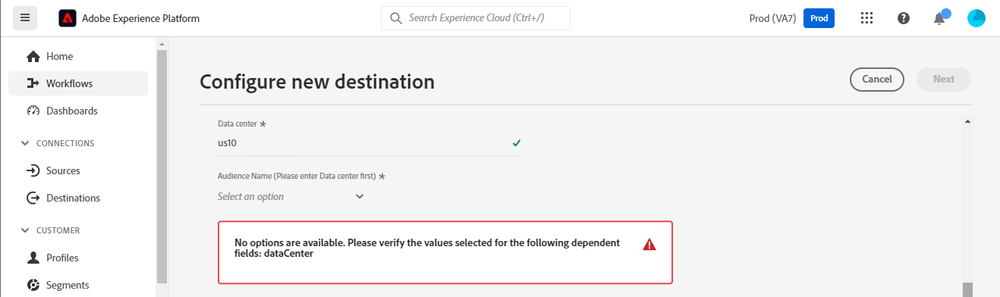

# [!DNL Mailchimp Interest Categories] conexión

[[!DNL Mailchimp]](https://mailchimp.com) es una plataforma de automatización de marketing y un servicio de marketing por correo electrónico populares que usan las empresas para administrar y hablar con los contactos *(clientes, clientes u otras partes interesadas)* mediante listas de correo y campañas de marketing por correo electrónico. Utilice este conector para ordenar contactos según sus intereses y preferencias.

[!DNL Mailchimp Interest Categories] usa [audiencias](https://mailchimp.com/help/getting-started-audience/), [grupos](https://mailchimp.com/help/getting-started-with-groups/) y categorías de interés *(también conocidos como nombres de grupos o títulos de grupos)*. Cada grupo [!DNL Mailchimp] es una lista de categorías de interés. Los contactos se asocian a una categoría de interés cuando se suscriben a una o más categorías de interés a través de un formulario de suscripción en el sitio web. Dentro de una audiencia, también puede organizar los contactos en grupos y asociarlos con categorías de interés, que luego se pueden utilizar para crear segmentos. Puede utilizar estas audiencias para difundir correos electrónicos de campaña segmentados a los contactos suscritos.

<!--
Compared to [!DNL Mailchimp Tags] which you would use for internal classification, [!DNL Mailchimp Interest Categories] is meant to manage subscriptions to topics of interest that your contacts might be interested in. *Note, Experience Platform also has a connection for [!DNL Mailchimp Tags], you can check it out on the [[!DNL Mailchimp Tags]](/help/destinations/catalog/email-marketing/mailchimp-tags.md) page.*
-->

Este [!DNL Adobe Experience Platform] [destino](/help/destinations/home.md) usa la API [[!DNL Mailchimp batch subscribe or unsubscribe API]](https://mailchimp.com/developer/marketing/api/lists/batch-subscribe-or-unsubscribe/) para crear [categorías de interés](https://mailchimp.com/developer/marketing/api/interest-categories/) y, a continuación, agregar contactos de cada una de las audiencias de Platform seleccionadas a una categoría de interés correspondiente. Puedes **agregar nuevos contactos** o **actualizar la información de [!DNL Mailchimp] contactos existentes**, luego **agregarlos o quitarlos de los grupos que deseen** dentro de una audiencia de [!DNL Mailchimp] existente después de activarlos dentro de un nuevo segmento. [!DNL Mailchimp Interest Groups] usa los nombres de audiencia seleccionados de Platform como categorías de interés dentro de [!DNL Mailchimp].

## Casos de uso {#use-cases}

Para ayudarle a comprender mejor cómo y cuándo debe utilizar el destino [!DNL Mailchimp Interest Categories], aquí tiene un ejemplo de uso que los clientes de Adobe Experience Platform pueden solucionar mediante este destino.

### Envío de correos electrónicos a contactos para campañas de marketing {#use-case-send-emails}

El departamento de ventas de un sitio web de artículos deportivos quiere transmitir una campaña de marketing por correo electrónico a una lista de contactos que se han identificado a sí mismos como interesados en el fútbol. Las listas de contactos se separan como lotes en la exportación de datos recibida del equipo de desarrollo del sitio web y, por lo tanto, deben rastrearse. El equipo identifica una audiencia [!DNL Mailchimp] existente y comienza a crear las audiencias de Experience Platform a las que se agregan los contactos de cada lista. Después de enviar estas audiencias a [!DNL Mailchimp Interest Categories], si algún contacto no existe en la audiencia [!DNL Mailchimp] seleccionada, se agrega a un grupo con el nombre de audiencia al que pertenece el contacto. Si ya existen contactos en la audiencia o el grupo [!DNL Mailchimp], se actualiza su información. Una vez que los datos se envíen a [!DNL Mailchimp Interest Categories], el equipo de ventas podrá seleccionar y enviar el correo electrónico de la campaña de marketing al grupo de interés de fútbol dentro de la audiencia [!DNL Mailchimp].

## Requisitos previos {#prerequisites}

Consulte las secciones siguientes para conocer todos los requisitos previos que necesita configurar en Experience Platform y [!DNL Mailchimp], así como la información que debe recopilar antes de trabajar con el destino [!DNL Mailchimp Interest Categories].

### Requisitos previos en Experience Platform {#prerequisites-in-experience-platform}

Antes de activar datos en el destino [!DNL Mailchimp Interest Categories], debe tener un [esquema](/help/xdm/schema/composition.md), un [conjunto de datos](https://experienceleague.adobe.com/docs/platform-learn/tutorials/data-ingestion/create-datasets-and-ingest-data.html) y [segmentos](https://experienceleague.adobe.com/docs/platform-learn/tutorials/segments/create-segments.html) creados en [!DNL Experience Platform].

### Requisitos previos para el destino [!DNL Mailchimp Interest Categories] {#prerequisites-destination}

Tenga en cuenta los siguientes requisitos previos para exportar datos de Platform a su cuenta de [!DNL Mailchimp]:

#### Debe tener una cuenta de [!DNL Mailchimp] {#prerequisites-account}

Para poder crear un destino de [!DNL Mailchimp Interest Categories], primero debe asegurarse de que tiene una cuenta de [!DNL Mailchimp]. Si todavía no tiene una, visite la [[!DNL Mailchimp] página de suscripción](https://login.mailchimp.com/signup/) para registrarse y crear su cuenta.

#### Recopilar clave de API [!DNL Mailchimp] {#gather-credentials}

Necesita su [!DNL Mailchimp] **clave de API** para autenticar el destino [!DNL Mailchimp Interest Categories] con su cuenta de [!DNL Mailchimp]. La **clave API** sirve como **contraseña** al [autenticar el destino](#authenticate).

Si no tienes tu **clave API**, inicia sesión en tu cuenta y consulta la documentación de [[!DNL Mailchimp] Generar tu clave API](https://mailchimp.com/developer/marketing/guides/quick-start/#generate-your-api-key) para crear una.

Un ejemplo de clave de API es `0123456789abcdef0123456789abcde-us14`.

>[!IMPORTANT]
>
>Si genera la **clave API**, anótela, ya que no podrá obtener acceso a ella después de la generación.

#### Identificar el centro de datos [!DNL Mailchimp] {#identify-data-center}

A continuación, debe identificar su centro de datos [!DNL Mailchimp]. Para ello, inicia sesión en tu cuenta de [!DNL Mailchimp] y navega a la **sección de claves API** de tu cuenta.

El valor es la primera parte de la dirección URL que ve en el explorador. Si la dirección URL es *https://`us14`.mailchimp.com/account/api/*, el centro de datos es `us14`.

También se anexa a su clave de API con el formato *key-dc*; si su clave de API es `0123456789abcdef0123456789abcde-us14`, el centro de datos es `us14`.

Anote el valor del centro de datos *(`us14` en este ejemplo)*, necesita este valor cuando [rellene los detalles de destino](#destination-details).

Si necesita más orientación, consulte la [[!DNL Mailchimp] documentación de aspectos básicos](https://mailchimp.com/developer/marketing/docs/fundamentals/#api-structure).

### Mecanismos de protección {#guardrails}

Cada una de las audiencias de [!DNL Mailchimp] puede contener hasta 60 nombres de grupo (o categorías de interés) en un solo grupo o en varios grupos dentro de la misma audiencia. Consulte [!DNL Mailchimp] [grupos](https://mailchimp.com/help/getting-started-with-groups/) para cualquier aclaración necesaria. Cuando llegue a este límite, recibirá un mensaje de `400 BAD_REQUEST Cannot have more than 60 interests per list (Across all categories)` como respuesta de error de la API [!DNL Mailchimp].

Además, consulte [!DNL Mailchimp] [límites de tarifa](https://mailchimp.com/developer/marketing/docs/fundamentals/#api-limits) para obtener información detallada sobre los límites impuestos por la API [!DNL Mailchimp].

## Identidades admitidas {#supported-identities}

[!DNL Mailchimp] admite la activación de las identidades descritas en la tabla siguiente. Más información sobre [identidades](/help/identity-service/features/namespaces.md).

| Identidad de destino | Descripción | Consideraciones |
|---|---|---|
| Correo electrónico | Dirección de correo electrónico del contacto | Obligatorio |

{style="table-layout:auto"}

## Tipo y frecuencia de exportación {#export-type-frequency}

Consulte la tabla siguiente para obtener información sobre el tipo y la frecuencia de exportación de destino.

| Elemento | Tipo | Notas |
---------|----------|---------|
| Tipo de exportación | **[!UICONTROL Basado en perfil]** | <ul><li>Va a exportar todos los miembros de un segmento, junto con los campos de esquema deseados *(por ejemplo: dirección de correo electrónico, número de teléfono, apellidos)*, según la asignación de campos.</li><li> Para cada audiencia seleccionada en Platform, el estado del segmento [!DNL Mailchimp Interest Categories] correspondiente se actualiza con su estado de audiencia de Platform.</li></ul> |
| Frecuencia de exportación | **[!UICONTROL Transmisión]** | Los destinos de streaming son conexiones basadas en API &quot;siempre activadas&quot;. Cuando se actualiza un perfil en Experience Platform en función de la evaluación de audiencias, el conector envía la actualización de forma descendente a la plataforma de destino. Más información sobre [destinos de streaming](/help/destinations/destination-types.md#streaming-destinations). |

{style="table-layout:auto"}

## Conexión al destino {#connect}

>[!IMPORTANT]
>
>Para conectarse al destino, necesita los **[!UICONTROL permisos de control de acceso](/help/access-control/home.md#permissions) de Ver destinos]** y **[!UICONTROL Administrar destinos]**[5}. Lea la [descripción general del control de acceso](/help/access-control/ui/overview.md) o póngase en contacto con el administrador del producto para obtener los permisos necesarios.

Para conectarse a este destino, siga los pasos descritos en el [tutorial de configuración de destino](../../ui/connect-destination.md). En el flujo de trabajo de configuración de destino, rellene los campos enumerados en las dos secciones siguientes.

En **[!UICONTROL destinos]** > **[!UICONTROL catálogo]**, busque [!DNL Mailchimp Interest Categories]. También puede ubicarlo en la categoría **[!UICONTROL Marketing por correo electrónico]**.

### Autenticarse en el destino {#authenticate}

Para autenticarte en el destino, rellena los campos obligatorios a continuación y selecciona **[!UICONTROL Conectarse al destino]**.

| Campo | Descripción |
| --- | --- |
| **[!UICONTROL Nombre de usuario]** | Su nombre de usuario [!DNL Mailchimp Interest Categories]. |
| **[!UICONTROL Contraseña]** | Su [!DNL Mailchimp] **clave de API**, que había anotado en la sección [Recopilar [!DNL Mailchimp] credenciales](#gather-credentials).  Su clave de API adopta la forma de `{KEY}-{DC}`, donde la parte `{KEY}` hace referencia al valor anotado en la sección [[!DNL Mailchimp] clave de API](#gather-credentials) y la parte `{DC}` hace referencia al [[!DNL Mailchimp] centro de datos](#identify-data-center).  Puede proporcionar la parte `{KEY}` o todo el formulario.  Por ejemplo, si su clave de API es  *`0123456789abcdef0123456789abcde-us14`*, , puede proporcionar *`0123456789abcdef0123456789abcde`*o *`0123456789abcdef0123456789abcde-us14`*como valor. |

{style="table-layout:auto"}

Si los detalles proporcionados son válidos, la interfaz de usuario mostrará el estado **[!UICONTROL Conectado]** con una marca de verificación verde. A continuación, puede continuar con el paso siguiente.

### Rellenar detalles de destino {#destination-details}

Para configurar los detalles del destino, rellene los campos obligatorios y opcionales a continuación. Un asterisco junto a un campo en la interfaz de usuario indica que el campo es obligatorio.

| Campo | Descripción |
| --- | --- |
| **[!UICONTROL Nombre]** | Un nombre con el que reconocerá este destino en el futuro. |
| **[!UICONTROL Descripción]** | Una descripción que le ayudará a identificar este destino en el futuro. |
| **[!UICONTROL Centro de datos]** | Su cuenta [!DNL Mailchimp] `data center`. Consulte la sección [Identificar [!DNL Mailchimp] centro de datos](#identify-data-center) para obtener instrucciones. |
| **[!UICONTROL Nombre de audiencia (seleccione primero el centro de datos)]** | Después de seleccionar **[!UICONTROL Centro de datos]**, esta lista desplegable se completa automáticamente con los nombres de audiencia de la cuenta de [!DNL Mailchimp]. Seleccione la audiencia que desee actualizar con los datos de Platform. |
| **[!UICONTROL Categoría de interés (seleccione primero el centro de datos y el nombre de la audiencia)]** | Después de seleccionar su **[!UICONTROL Nombre de audiencia]**, esta lista desplegable se completa automáticamente con los nombres de las categorías de grupos de interés de su cuenta de [!DNL Mailchimp]. Seleccione el nombre de la categoría que desea actualizar con los datos de Platform. |

{style="table-layout:auto"}

>[!TIP]
>
> Si la clave de API proporcionada en el campo **[!UICONTROL Password]** o el valor **[!UICONTROL Data center]** es incorrecta, la interfaz de usuario muestra una respuesta de error de API [!DNL Mailchimp]: *`No options are available. Please verify the values selected for the following dependent fields: dataCenter`*, como se muestra a continuación. En este caso, no podrá seleccionar un valor del campo **[!UICONTROL Nombre de audiencia (seleccione primero el centro de datos)]**. Para corregir este error, proporcione los valores correctos.

### Habilitar alertas {#enable-alerts}

Puede activar alertas para recibir notificaciones sobre el estado del flujo de datos a su destino. Seleccione una alerta de la lista a la que suscribirse para recibir notificaciones sobre el estado del flujo de datos. Para obtener más información sobre las alertas, consulte la guía sobre [suscripción a alertas de destinos mediante la interfaz de usuario](../../ui/alerts.md).

Cuando termine de proporcionar detalles para la conexión de destino, seleccione **[!UICONTROL Siguiente]**.

## Activar públicos en este destino {#activate}

>[!IMPORTANT]
> 
>* Para activar los datos, necesita los **[!UICONTROL permisos de control de acceso]**, **[!UICONTROL Activar destinos]**, **[!UICONTROL Ver perfiles]** y **[!UICONTROL Ver segmentos]**[para ](/help/access-control/home.md#permissions). Lea la [descripción general del control de acceso](/help/access-control/ui/overview.md) o póngase en contacto con el administrador del producto para obtener los permisos necesarios.
>* Para exportar *identidades*, necesita el **[!UICONTROL permiso de control de acceso](/help/access-control/home.md#permissions) de]** Ver gráfico de identidad[.   {width="100" zoomable="yes"}

Lea [Activar perfiles y audiencias en destinos de exportación de audiencias de streaming](/help/destinations/ui/activate-segment-streaming-destinations.md) para obtener instrucciones sobre cómo activar audiencias en este destino.

### Consideraciones sobre asignación y ejemplo {#mapping-considerations-example}

Para enviar correctamente los datos de audiencia de Adobe Experience Platform al destino [!DNL Mailchimp Interest Categories], debe pasar por el paso de asignación de campos. La asignación consiste en crear un vínculo entre los campos de esquema del Modelo de datos de experiencia (XDM) en la cuenta de Platform y sus equivalentes correspondientes desde el destino de destino.

Para asignar correctamente los campos XDM a los campos de destino [!DNL Mailchimp Interest Categories], siga los pasos a continuación:

1. En el paso **[!UICONTROL Asignación]**, seleccione **[!UICONTROL Agregar nueva asignación]**. Ahora puede ver una nueva fila de asignación en la pantalla.
1. En la ventana **[!UICONTROL Seleccionar campo de origen]**, elija la categoría **[!UICONTROL Seleccionar atributos]** y seleccione el atributo XDM o elija **[!UICONTROL Seleccionar área de nombres de identidad]** y seleccione una identidad.
1. En la ventana **[!UICONTROL Seleccionar campo de destino]**, elija **[!UICONTROL Seleccionar área de nombres de identidad]** y seleccione una identidad o elija **[!UICONTROL Seleccionar atributos]** categoría y selecciónela de la lista de atributos rellenados desde la API [!DNL Mailchimp]. *Cualquier atributo personalizado que haya agregado a la audiencia [!DNL Mailchimp] seleccionada también estará disponible para su selección como campos de destino.*

   Las asignaciones disponibles entre su esquema de perfil XDM y [!DNL Mailchimp Interest Categories] son las siguientes:

   | Campo de origen | Campo de destino | Notas |
   | --- | --- | --- |
   | `IdentityMap: Email` | `Identity: email` | Obligatorio: sí |
   | `xdm: person.name.firstName` | `Attribute: FNAME` | |
   | `xdm: person.name.lastName` | `Attribute: LNAME` | |
   | `xdm: person.birthDayAndMonth` | `Attribute: BIRTHDAY` | |

   Además, `ADDRESS` es un campo de destino especial conocido como `merge field` dentro de su audiencia [!DNL Mailchimp]. La [[!DNL Mailchimp] documentación](https://mailchimp.com/developer/marketing/docs/merge-fields/) define las claves necesarias como `addr1`, `city`, `state` y `zip`, y las claves opcionales `addr2` y `country`. Los valores de estos campos deben ser cadenas. Si alguna de las asignaciones de campo `ADDRESS` está presente, el destino pasa el objeto `ADDRESS` a la API [!DNL Mailchimp] para su actualización. Cualquier campo `ADDRESS` que no esté asignado tiene su valor predeterminado `NULL`, excepto el país, que tiene el valor predeterminado `US`.

   Las asignaciones disponibles para el campo `ADDRESS` son las siguientes:

   | Campo de origen | Campo de destino |
   | --- | --- |
   | `xdm: workAddress.street1` | `Attribute: ADDRESS.addr1` |
   | `xdm: workAddress.street2` | `Attribute: ADDRESS.addr2` |
   | `xdm: workAddress.city` | `Attribute: ADDRESS.city` |
   | `xdm: workAddress.state` | `Attribute: ADDRESS.state` |
   | `xdm: workAddress.postalCode` | `Attribute: ADDRESS.zip` |
   | `xdm: workAddress.country` | `Attribute: ADDRESS.country` |

   Por ejemplo, desea actualizar el valor de `country` con los valores del campo de dirección existente `addr1`, `city`, `state` y `zip` del contacto como `132, My Street, Kingston`, `New York`, `New York` y `12401`. Para actualizar `country`, debe pasar los valores existentes con los cambios *(si los hay)* y el nuevo valor de país. Por lo tanto, los valores del conjunto de datos deben ser `132, My Street, Kingston`, `New York`, `New York`, `12401` y `US`. Para reiterar, si solo pasa `country` y no proporciona valores para `addr1`, `city`, `state` y `zip`, `NULL` los sobrescribirá.

   A continuación, se muestra un ejemplo con las asignaciones completadas:
   

Cuando haya terminado de proporcionar las asignaciones para la conexión de destino, seleccione **[!UICONTROL Siguiente]**.

## Validar exportación de datos {#exported-data}

Para comprobar que ha configurado correctamente el destino, siga los pasos a continuación:

* Inicie sesión en su cuenta de [[!DNL Mailchimp]](https://login.mailchimp.com/). A continuación, vaya a la página **[!DNL Audience]**. A continuación, expanda el menú **[!DNL Manage Contacts]** y seleccione **[!DNL Groups]**.

* Seleccione el grupo y compruebe si las audiencias seleccionadas se crean como categorías con el nombre de audiencia de Platform, que puede ir seguido de un sufijo generado automáticamente.
   * Este destino usa los nombres de los segmentos seleccionados para crear la categoría de interés mediante la [[!DNL Mailchimp] API Agregar categoría de interés](https://mailchimp.com/developer/marketing/api/interest-categories/add-interest-category/). Si crea un nuevo destino y vuelve a activar las mismas audiencias, [!DNL Mailchimp] agrega un sufijo para distinguir entre los segmentos existentes y los nuevos.
* Los contactos cuyos correos electrónicos no existían en el grupo se agregan a la categoría recién creada.
* Para los contactos que ya existen dentro del grupo, se actualizan los datos del campo de atributo y el contacto se agrega a la categoría recién creada.

## Uso de datos y gobernanza {#data-usage-governance}

Todos los destinos de [!DNL Adobe Experience Platform] cumplen con las políticas de uso de datos al administrar los datos. Para obtener información detallada sobre cómo [!DNL Adobe Experience Platform] aplica el control de datos, consulte la [Información general sobre el control de datos](/help/data-governance/home.md).

## Errores y solución de problemas {#errors-and-troubleshooting}

### Error si la clave de API [!DNL Mailchimp] o los valores del centro de datos son incorrectos {#incorrect-credentials-error}

Si la clave de API proporcionada en el campo **[!UICONTROL Password]** o el valor **[!UICONTROL Data center]** es incorrecta, la interfaz de usuario muestra una respuesta de error de API [!DNL Mailchimp]: *`No options are available. Please verify the values selected for the following dependent fields: dataCenter`*, como se muestra a continuación. En este caso, no puede seleccionar un valor del campo **[!UICONTROL Nombre de audiencia (seleccione primero el centro de datos)]**.

Para corregir este error y continuar con el siguiente paso, debe proporcionar los valores correctos. Consulte [Identificar [!DNL Mailchimp] centro de datos](#identify-data-center) y
[Recopile [!DNL Mailchimp] secciones de clave de API](#gather-credentials) si necesita orientación.

### Error al superar el límite de nombres de grupo [!DNL Mailchimp] {#group-name-limits-error}

Al crear el destino, podría recibir los siguientes mensajes de error: *`Cannot have more than 60 interests per list (Across all categories)`* o *`400 BAD_REQUEST`*. Esto sucede cuando se exceden los 60 nombres de grupo (o categorías de interés) en un solo grupo o en varios grupos dentro del mismo límite de audiencia, como se describe en la sección [protecciones](#guardrails). Para corregir este error, asegúrese de no exceder el límite de nombres de grupo en [!DNL Mailchimp].

### [!DNL Mailchimp] códigos de estado y error

Consulte la [[!DNL Mailchimp] página de errores](https://mailchimp.com/developer/marketing/docs/errors/) para obtener una lista completa del estado y los códigos de error con explicaciones.

## Recursos adicionales {#additional-resources}

A continuación encontrará información útil adicional de la documentación de [!DNL Mailchimp]:
* [Introducción a [!DNL Mailchimp]](https://mailchimp.com/help/getting-started-with-mailchimp/)
* [Introducción a Audiences](https://mailchimp.com/help/getting-started-audience/)
* [Crear una audiencia](https://mailchimp.com/help/create-audience/)
* [Introducción a los grupos](https://mailchimp.com/help/getting-started-with-groups/)
* [Crear nuevo grupo de audiencia](https://mailchimp.com/help/create-new-audience-group/)
* [Categorías de interés](https://mailchimp.com/developer/marketing/api/interest-categories/)
* [API de marketing](https://mailchimp.com/developer/marketing/api/)
