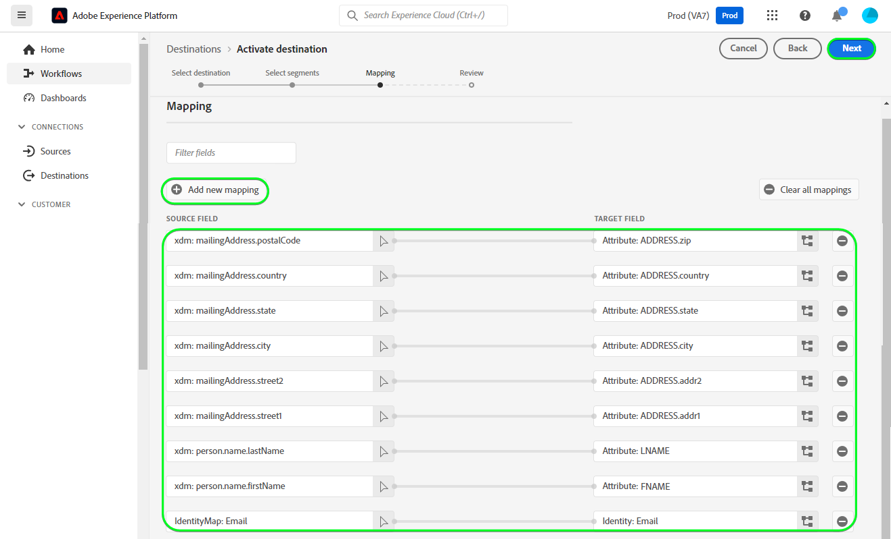

# [!DNL Mailchimp Interest Categories] conexión

[[!DNL Mailchimp]](https://mailchimp.com) es una popular plataforma de automatización de marketing y servicio de marketing por correo electrónico que utilizan las empresas para administrar y hablar con los contactos *(clientes, clientes u otras partes interesadas)* uso de listas de correo y campañas de marketing por correo electrónico. Utilice este conector para ordenar contactos según sus intereses y preferencias.

[!DNL Mailchimp Interest Categories] utiliza [audiencias](https://mailchimp.com/help/getting-started-audience/), [grupos](https://mailchimp.com/help/getting-started-with-groups/), y categorías de interés *(también conocidos como nombres de grupos o títulos de grupos)*. Cada [!DNL Mailchimp] grupo es una lista de categorías de interés. Los contactos se asocian a una categoría de interés cuando se suscriben a una o más categorías de interés a través de un formulario de suscripción en el sitio web. Dentro de una audiencia, también puede organizar los contactos en grupos y asociarlos con categorías de interés, que luego se pueden utilizar para crear segmentos. Puede utilizar estas audiencias para difundir correos electrónicos de campaña segmentados a los contactos suscritos.

<!--
Compared to [!DNL Mailchimp Tags] which you would use for internal classification, [!DNL Mailchimp Interest Categories] is meant to manage subscriptions to topics of interest that your contacts might be interested in. *Note, Experience Platform also has a connection for [!DNL Mailchimp Tags], you can check it out on the [[!DNL Mailchimp Tags]](/help/destinations/catalog/email-marketing/mailchimp-tags.md) page.*
-->

Esta [!DNL Adobe Experience Platform] [destino](/help/destinations/home.md) utiliza el [[!DNL Mailchimp batch subscribe or unsubscribe API]](https://mailchimp.com/developer/marketing/api/lists/batch-subscribe-or-unsubscribe/) API para crear [categorías de interés](https://mailchimp.com/developer/marketing/api/interest-categories/) y, a continuación, añada contactos de cada una de las audiencias de Platform seleccionadas a una categoría de interés correspondiente. Puede **añadir nuevos contactos** o **actualizar la información de [!DNL Mailchimp] contactos**, entonces **añadirlos o eliminarlos de los grupos que deseen** dentro de un existente [!DNL Mailchimp] después de activarlos en un nuevo segmento. [!DNL Mailchimp Interest Groups] utiliza los nombres de audiencia seleccionados de Platform como categorías de interés dentro de [!DNL Mailchimp].

## Casos de uso {#use-cases}

Para ayudarle a comprender mejor cómo y cuándo debe utilizar el [!DNL Mailchimp Interest Categories] Destino, este es un ejemplo de caso de uso que los clientes de Adobe Experience Platform pueden solucionar mediante este destino.

### Envío de correos electrónicos a contactos para campañas de marketing {#use-case-send-emails}

El departamento de ventas de un sitio web de artículos deportivos quiere transmitir una campaña de marketing por correo electrónico a una lista de contactos que se han identificado a sí mismos como interesados en el fútbol. Las listas de contactos se separan como lotes en la exportación de datos recibida del equipo de desarrollo del sitio web y, por lo tanto, deben rastrearse. El equipo identifica un existente [!DNL Mailchimp] y comienza a crear las audiencias de Experience Platform a las que se añaden los contactos de cada lista. Después de enviar estas audiencias a [!DNL Mailchimp Interest Categories], si hay contactos que no existen en el seleccionado [!DNL Mailchimp] audiencia a la que se añaden a un grupo con el nombre de la audiencia a la que pertenece el contacto. Si ya existe algún contacto en [!DNL Mailchimp] audiencia o grupo y, a continuación, se actualiza su información. Una vez que los datos se hayan enviado a [!DNL Mailchimp Interest Categories], el equipo de ventas puede seleccionar y enviar el correo electrónico de campaña de marketing al grupo de interés de fútbol dentro de la [!DNL Mailchimp] audiencia.

## Requisitos previos {#prerequisites}

Consulte las secciones siguientes para conocer todos los requisitos previos que debe configurar en Experience Platform y [!DNL Mailchimp] y para la información que debe recopilar antes de trabajar con [!DNL Mailchimp Interest Categories] destino.

### Requisitos previos en Experience Platform {#prerequisites-in-experience-platform}

Antes de activar los datos en [!DNL Mailchimp Interest Categories] destino, debe tener un [esquema](/help/xdm/schema/composition.md), a [conjunto de datos](https://experienceleague.adobe.com/docs/platform-learn/tutorials/data-ingestion/create-datasets-and-ingest-data.html?lang=es), y [segmentos](https://experienceleague.adobe.com/docs/platform-learn/tutorials/segments/create-segments.html) creado en [!DNL Experience Platform].

### Requisitos previos para la [!DNL Mailchimp Interest Categories] destino {#prerequisites-destination}

Tenga en cuenta los siguientes requisitos previos para exportar datos de Platform a su [!DNL Mailchimp] cuenta:

#### Debe tener un [!DNL Mailchimp] account {#prerequisites-account}

Antes de crear un [!DNL Mailchimp Interest Categories] destino, primero debe asegurarse de que dispone de un [!DNL Mailchimp] cuenta. Si todavía no tiene uno, visite la [[!DNL Mailchimp] página de suscripción](https://login.mailchimp.com/signup/) para registrarse y crear su cuenta.

#### Reunir [!DNL Mailchimp] Clave de API {#gather-credentials}

Necesita su [!DNL Mailchimp] **Clave de API** para autenticar el [!DNL Mailchimp Interest Categories] destino frente a su [!DNL Mailchimp] cuenta. El **Clave de API** sirve como **Contraseña** cuando usted [autenticar el destino](#authenticate).

Si no tiene su **Clave de API**, Inicie sesión en su cuenta de y consulte la [[!DNL Mailchimp] Genere su clave de API](https://mailchimp.com/developer/marketing/guides/quick-start/#generate-your-api-key) documentación para crear uno.

Un ejemplo de clave de API es `0123456789abcdef0123456789abcde-us14`.

>[!IMPORTANT]
>
>Si genera el **Clave de API**, anótelo, ya que no podrá acceder a él después de la generación.

#### Identificar [!DNL Mailchimp] centro de datos {#identify-data-center}

A continuación, debe identificar su [!DNL Mailchimp] centro de datos. Para ello, inicie sesión en su [!DNL Mailchimp] y vaya a la **sección de claves API** de su cuenta.

El valor es la primera parte de la dirección URL que ve en el explorador. Si la dirección URL es *https://`us14`.mailchimp.com/account/api/*, el centro de datos es `us14`.

También se anexa a la clave de API en el formulario *key-dc*; si la clave de API es `0123456789abcdef0123456789abcde-us14`, el centro de datos es `us14`.

Anote el valor del centro de datos *(`us14` en este ejemplo)*, necesita este valor cuando [rellenar detalles de destino](#destination-details).

Si necesita más información, consulte la [[!DNL Mailchimp] Documentación de fundamentos](https://mailchimp.com/developer/marketing/docs/fundamentals/#api-structure).

### Mecanismos de protección {#guardrails}

Cada uno de sus [!DNL Mailchimp] las audiencias pueden contener hasta 60 nombres de grupo (o categorías de interés) en un solo grupo o en varios grupos dentro de la misma audiencia. Consulte [!DNL Mailchimp] [grupos](https://mailchimp.com/help/getting-started-with-groups/) para cualquier aclaración necesaria. Cuando llegue a este límite, obtendrá una `400 BAD_REQUEST Cannot have more than 60 interests per list (Across all categories)` mensaje como respuesta de error del [!DNL Mailchimp] API.

Además, consulte la [!DNL Mailchimp] [límites de velocidad](https://mailchimp.com/developer/marketing/docs/fundamentals/#api-limits) para obtener información detallada sobre los límites impuestos por la [!DNL Mailchimp] API.

## Identidades admitidas {#supported-identities}

[!DNL Mailchimp] admite la activación de identidades descritas en la tabla siguiente. Más información sobre [identidades](/help/identity-service/namespaces.md).

| Identidad de destino | Descripción | Consideraciones |
|---|---|---|
| Correo electrónico | Dirección de correo electrónico del contacto | Obligatorio |

{style="table-layout:auto"}

## Tipo y frecuencia de exportación {#export-type-frequency}

Consulte la tabla siguiente para obtener información sobre el tipo y la frecuencia de exportación de destino.

| Elemento | Tipo | Notas |
---------|----------|---------|
| Tipo de exportación | **[!UICONTROL Basado en perfiles]** | <ul><li>Está exportando todos los miembros de un segmento, junto con los campos de esquema deseados *(por ejemplo: dirección de correo electrónico, número de teléfono, apellidos)*, según la asignación de campo.</li><li> Para cada audiencia seleccionada en Platform, la correspondiente [!DNL Mailchimp Interest Categories] El estado del segmento se actualiza con su estado de audiencia de Platform.</li></ul> |
| Frecuencia de exportación | **[!UICONTROL Transmisión]** | Los destinos de streaming son conexiones basadas en API &quot;siempre activadas&quot;. Cuando se actualiza un perfil en Experience Platform en función de la evaluación de audiencias, el conector envía la actualización de forma descendente a la plataforma de destino. Más información sobre [destinos de streaming](/help/destinations/destination-types.md#streaming-destinations). |

{style="table-layout:auto"}

## Conectar con el destino {#connect}

>[!IMPORTANT]
>
>Para conectarse al destino, necesita el **[!UICONTROL Administrar destinos]** [permiso de control de acceso](/help/access-control/home.md#permissions). Lea el [información general de control de acceso](/help/access-control/ui/overview.md) o póngase en contacto con el administrador del producto para obtener los permisos necesarios.

Para conectarse a este destino, siga los pasos descritos en la sección [tutorial de configuración de destino](../../ui/connect-destination.md). En el flujo de trabajo de configuración de destino, rellene los campos enumerados en las dos secciones siguientes.

En **[!UICONTROL Destinos]** > **[!UICONTROL Catálogo]**, buscar [!DNL Mailchimp Interest Categories]. También puede encontrarlo en la sección **[!UICONTROL Marketing por email]** categoría.

### Autenticar en el destino {#authenticate}

Para autenticarse en el destino, rellene los campos obligatorios a continuación y seleccione **[!UICONTROL Conectar con destino]**.

| Campo | Descripción |
| --- | --- |
| **[!UICONTROL Nombre de usuario]** | Su [!DNL Mailchimp Interest Categories] nombre de usuario. |
| **[!UICONTROL Contraseña]** | Su [!DNL Mailchimp] **Clave de API**, que había anotado en el [Reunir [!DNL Mailchimp] credenciales](#gather-credentials) sección.  La clave de API adopta la forma de `{KEY}-{DC}`, donde la variable `{KEY}` hace referencia al valor anotado en la sección [[!DNL Mailchimp] Clave de API](#gather-credentials) y la sección `{DC}` La parte hace referencia a [[!DNL Mailchimp] centro de datos](#identify-data-center).  Puede proporcionar cualquiera de las `{KEY}` parte o todo el formulario.  Por ejemplo, si la clave de API es  *`0123456789abcdef0123456789abcde-us14`*,  puede proporcionar lo siguiente *`0123456789abcdef0123456789abcde`*o *`0123456789abcdef0123456789abcde-us14`*como el valor. |

{style="table-layout:auto"}

Si los detalles proporcionados son válidos, la interfaz de usuario muestra un **[!UICONTROL Conectado]** estado con una marca de verificación verde. A continuación, puede continuar con el paso siguiente.

### Rellenar detalles de destino {#destination-details}

Para configurar los detalles del destino, rellene los campos obligatorios y opcionales a continuación. Un asterisco junto a un campo en la interfaz de usuario indica que el campo es obligatorio.

| Campo | Descripción |
| --- | --- |
| **[!UICONTROL Nombre]** | Un nombre con el que reconocerá este destino en el futuro. |
| **[!UICONTROL Descripción]** | Una descripción que le ayudará a identificar este destino en el futuro. |
| **[!UICONTROL Centro de datos]** | Su [!DNL Mailchimp] account `data center`. Consulte la [Identificar [!DNL Mailchimp] centro de datos](#identify-data-center) para obtener cualquier guía. |
| **[!UICONTROL Nombre de audiencia (seleccione primero el centro de datos)]** | Después de seleccionar su **[!UICONTROL Centro de datos]**, esta lista desplegable se rellena automáticamente con los nombres de audiencia de su [!DNL Mailchimp] cuenta. Seleccione la audiencia que desee actualizar con los datos de Platform. |
| **[!UICONTROL Categoría de interés (seleccione primero el centro de datos y el nombre de la audiencia)]** | Después de seleccionar su **[!UICONTROL Nombre de audiencia]**, esta lista desplegable se rellena automáticamente con los nombres de las categorías de grupos de interés de su [!DNL Mailchimp] cuenta. Seleccione el nombre de la categoría que desea actualizar con los datos de Platform. |

{style="table-layout:auto"}

>[!TIP]
>
> Si la clave de API proporcionada en la **[!UICONTROL Contraseña]** o el campo **[!UICONTROL Centro de datos]** son incorrectos, la interfaz de usuario muestra un [!DNL Mailchimp] Respuesta de error de API: *`No options are available. Please verify the values selected for the following dependent fields: dataCenter`* como se muestra a continuación. En este caso, no puede seleccionar un valor de la variable **[!UICONTROL Nombre de audiencia (seleccione primero el centro de datos)]** field. Para corregir este error, proporcione los valores correctos.

### Habilitar alertas {#enable-alerts}

Puede activar alertas para recibir notificaciones sobre el estado del flujo de datos a su destino. Seleccione una alerta de la lista a la que suscribirse para recibir notificaciones sobre el estado del flujo de datos. Para obtener más información sobre las alertas, consulte la guía de [suscripción a alertas de destinos mediante la IU](../../ui/alerts.md).

Cuando haya terminado de proporcionar detalles para la conexión de destino, seleccione **[!UICONTROL Siguiente]**.

## Activar audiencias en este destino {#activate}

>[!IMPORTANT]
> 
>* Para activar los datos, necesita el **[!UICONTROL Administrar destinos]**, **[!UICONTROL Activar destinos]**, **[!UICONTROL Ver perfiles]**, y **[!UICONTROL Ver segmentos]** [permisos de control de acceso](/help/access-control/home.md#permissions). Lea el [información general de control de acceso](/help/access-control/ui/overview.md) o póngase en contacto con el administrador del producto para obtener los permisos necesarios.
>* Para exportar *identidades*, necesita el **[!UICONTROL Ver gráfico de identidad]** [permiso de control de acceso](/help/access-control/home.md#permissions).   {width="100" zoomable="yes"}

Leer [Activación de perfiles y audiencias en destinos de exportación de audiencia de streaming](/help/destinations/ui/activate-segment-streaming-destinations.md) para obtener instrucciones sobre cómo activar audiencias en este destino.

### Consideraciones sobre asignación y ejemplo {#mapping-considerations-example}

Para enviar correctamente los datos de audiencia de Adobe Experience Platform a [!DNL Mailchimp Interest Categories] destino, debe pasar por el paso de asignación de campos. La asignación consiste en crear un vínculo entre los campos de esquema del Modelo de datos de experiencia (XDM) en la cuenta de Platform y sus equivalentes correspondientes desde el destino de destino.

Para asignar correctamente los campos XDM a [!DNL Mailchimp Interest Categories] campos de destino, siga los pasos a continuación:

1. En el **[!UICONTROL Asignación]** paso, seleccione **[!UICONTROL Añadir nueva asignación]**. Ahora puede ver una nueva fila de asignación en la pantalla.
1. En el **[!UICONTROL Seleccionar campo de origen]** , seleccione la **[!UICONTROL Seleccionar atributos]** y seleccione el atributo XDM o elija el **[!UICONTROL Seleccionar área de nombres de identidad]** y seleccione una identidad.
1. En el **[!UICONTROL Seleccionar campo de destino]** , seleccione la **[!UICONTROL Seleccionar área de nombres de identidad]** y seleccione una identidad o elija **[!UICONTROL Seleccionar atributos]** y seleccione de la lista de atributos rellenados desde el [!DNL Mailchimp] API. *Cualquier atributo personalizado que haya agregado al seleccionado [!DNL Mailchimp] La audiencia también estará disponible para su selección como campos de destino.*

   Las asignaciones disponibles entre el esquema de perfil XDM y [!DNL Mailchimp Interest Categories] son los siguientes: | Campo de origen | Campo de destino | Notas | | — | — | — | |`IdentityMap: Email`|`Identity: email`| Obligatorio: sí | |`xdm: person.name.firstName`|`Attribute: FNAME`| | |`xdm: person.name.lastName`|`Attribute: LNAME`| | |`xdm: person.birthDayAndMonth`|`Attribute: BIRTHDAY`| |

   Además, `ADDRESS` es un campo de destino especial denominado `merge field` dentro de su [!DNL Mailchimp] audiencia. El [[!DNL Mailchimp] documentación](https://mailchimp.com/developer/marketing/docs/merge-fields/) define las claves necesarias como `addr1`, `city`, `state`, y `zip`y las claves opcionales `addr2` y `country`. Los valores de estos campos deben ser cadenas. Si alguna de las `ADDRESS` están presentes, el destino pasa el `ADDRESS` objeto a [!DNL Mailchimp] API para actualizar. Cualquiera `ADDRESS` los campos que no están asignados tienen su valor predeterminado de `NULL` excepto para el país que toma el valor predeterminado de `US`.

   Las asignaciones disponibles para `ADDRESS` Estos campos son los siguientes:

   | Campo de origen | Campo de destino |
   | --- | --- |
   | `xdm: workAddress.street1` | `Attribute: ADDRESS.addr1` |
   | `xdm: workAddress.street2` | `Attribute: ADDRESS.addr2` |
   | `xdm: workAddress.city` | `Attribute: ADDRESS.city` |
   | `xdm: workAddress.state` | `Attribute: ADDRESS.state` |
   | `xdm: workAddress.postalCode` | `Attribute: ADDRESS.zip` |
   | `xdm: workAddress.country` | `Attribute: ADDRESS.country` |

   Por ejemplo, desea actualizar el valor de `country` con el campo de dirección existente del contacto `addr1`, `city`, `state`, y `zip` valores como `132, My Street, Kingston`, `New York`, `New York` y `12401`. Para actualizar el `country` debe pasar los valores existentes con cambios *(si procede)* y el nuevo valor de país. Por lo tanto, los valores del conjunto de datos deben ser `132, My Street, Kingston`, `New York`, `New York`, `12401`, y `US`. Para reiterar, si solo pasa `country` y no proporcionan valores para `addr1`, `city`, `state`, y `zip` se sobrescribirán con `NULL`.

   A continuación, se muestra un ejemplo con las asignaciones completadas:
   

Cuando haya terminado de proporcionar las asignaciones para la conexión de destino, seleccione **[!UICONTROL Siguiente]**.

## Validar exportación de datos {#exported-data}

Para comprobar que ha configurado correctamente el destino, siga los pasos a continuación:

* Inicie sesión en su [[!DNL Mailchimp]](https://login.mailchimp.com/) cuenta. A continuación, vaya a **[!DNL Audience]** página. A continuación, expanda el **[!DNL Manage Contacts]** y seleccione **[!DNL Groups]**.

* Seleccione el grupo y compruebe si las audiencias seleccionadas se crean como categorías con el nombre de audiencia de Platform, que puede ir seguido de un sufijo generado automáticamente.
   * Este destino utiliza los nombres de los segmentos seleccionados para crear la categoría de interés utilizando [[!DNL Mailchimp] Añadir API de categoría de interés](https://mailchimp.com/developer/marketing/api/interest-categories/add-interest-category/). Si crea un nuevo destino y vuelve a activar las mismas audiencias, [!DNL Mailchimp] añade un sufijo para distinguir entre los segmentos existentes y los nuevos.
* Los contactos cuyos correos electrónicos no existían en el grupo se agregan a la categoría recién creada.
* Para los contactos que ya existen dentro del grupo, se actualizan los datos del campo de atributo y el contacto se agrega a la categoría recién creada.

## Uso de datos y gobernanza {#data-usage-governance}

Todo [!DNL Adobe Experience Platform] Los destinos de cumplen con las políticas de uso de datos al gestionar los datos. Para obtener información detallada sobre cómo [!DNL Adobe Experience Platform] aplica la gobernanza de datos. Consulte la [Resumen de gobernanza de datos](/help/data-governance/home.md).

## Errores y solución de problemas {#errors-and-troubleshooting}

### Error encontrado si [!DNL Mailchimp] Los valores de la clave API o del centro de datos son incorrectos {#incorrect-credentials-error}

Si la clave de API proporcionada en la **[!UICONTROL Contraseña]** o el campo **[!UICONTROL Centro de datos]** son incorrectos, la interfaz de usuario muestra un [!DNL Mailchimp] Respuesta de error de API: *`No options are available. Please verify the values selected for the following dependent fields: dataCenter`* como se muestra a continuación. En este caso, no puede seleccionar un valor de la variable **[!UICONTROL Nombre de audiencia (seleccione primero el centro de datos)]** field.

Para corregir este error y continuar con el siguiente paso, debe proporcionar los valores correctos. Consulte la [Identificar [!DNL Mailchimp] centro de datos](#identify-data-center) y
[Reunir [!DNL Mailchimp] Clave de API](#gather-credentials) secciones si necesita orientación.

### Error encontrado si [!DNL Mailchimp] se ha superado el límite de nombres de grupo {#group-name-limits-error}

Al crear el destino, puede recibir los siguientes mensajes de error: *`Cannot have more than 60 interests per list (Across all categories)`* o *`400 BAD_REQUEST`*. Esto sucede cuando se superan los 60 nombres de grupo (o categorías de interés) en un solo grupo o en varios grupos dentro del mismo límite de audiencia, como se describe en la sección [barandas](#guardrails) sección. Para corregir este error, asegúrese de que no supera el límite de nombres de grupo en [!DNL Mailchimp].

### [!DNL Mailchimp] Códigos de estado y error

Consulte la [[!DNL Mailchimp] página de errores](https://mailchimp.com/developer/marketing/docs/errors/) para obtener una lista completa de estados y códigos de error con explicaciones.

## Recursos adicionales {#additional-resources}

Información útil adicional del [!DNL Mailchimp] Esta documentación es:
* [Introducción a [!DNL Mailchimp]](https://mailchimp.com/help/getting-started-with-mailchimp/)
* [Introducción a Audiences](https://mailchimp.com/help/getting-started-audience/)
* [Crear una audiencia](https://mailchimp.com/help/create-audience/)
* [Introducción a los grupos](https://mailchimp.com/help/getting-started-with-groups/)
* [Crear un nuevo grupo de audiencia](https://mailchimp.com/help/create-new-audience-group/)
* [Categorías de interés](https://mailchimp.com/developer/marketing/api/interest-categories/)
* [API de marketing](https://mailchimp.com/developer/marketing/api/)
