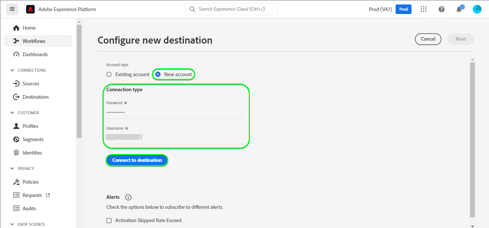

# [!DNL (API) Oracle Eloqua] conexión

[[!DNL Oracle Eloqua]](https://www.oracle.com/cx/marketing/automation/) permite a los especialistas en marketing planificar y ejecutar campañas a la vez que ofrecen una experiencia de cliente personalizada para sus posibles clientes. Con una administración de posibles clientes integrada y una creación de campañas sencilla, ayuda a los especialistas en marketing a atraer a la audiencia adecuada en el momento adecuado en el recorrido del comprador y se escala de forma elegante para llegar a audiencias de varios canales, incluidos correo electrónico, búsqueda en pantalla, vídeo y móvil. Los equipos de ventas pueden cerrar más acuerdos a una velocidad más rápida, lo que aumenta el retorno de la inversión de marketing a través de insight en tiempo real.

Este [!DNL Adobe Experience Platform] [destino](/help/destinations/home.md) aprovecha la operación [Actualizar un contacto](https://docs.oracle.com/en/cloud/saas/marketing/eloqua-rest-api/op-api-rest-1.0-data-contact-id-put.html) de la API de REST [!DNL Oracle Eloqua], que le permite **actualizar identidades** dentro de una audiencia en [!DNL Oracle Eloqua].

[!DNL Oracle Eloqua] usa [autenticación básica](https://docs.oracle.com/en/cloud/saas/marketing/eloqua-rest-api/Authentication_Basic.html) para comunicarse con la API de REST [!DNL Oracle Eloqua]. Las instrucciones para autenticarse en su instancia de [!DNL Oracle Eloqua] se encuentran más abajo, en la sección [Autenticar en destino](#authenticate).

## Casos de uso {#use-cases}

El departamento de marketing de una plataforma en línea desea difundir una campaña de marketing basada en correo electrónico a una audiencia seleccionada de posibles clientes. El equipo de marketing de la plataforma puede actualizar la información de posibles clientes existente a través de Adobe Experience Platform, crear audiencias a partir de sus propios datos sin conexión y enviar estas audiencias a [!DNL Oracle Eloqua], que luego se pueden usar para enviar el correo electrónico de la campaña de marketing.

## Requisitos previos {#prerequisites}

### Requisitos previos de Experience Platform {#prerequisites-in-experience-platform}

Antes de activar datos en el destino [!DNL Oracle Eloqua], debe tener un [esquema](/help/xdm/schema/composition.md), un [conjunto de datos](https://experienceleague.adobe.com/docs/platform-learn/tutorials/data-ingestion/create-datasets-and-ingest-data.html) y [segmentos](https://experienceleague.adobe.com/docs/platform-learn/tutorials/segments/create-segments.html) creados en [!DNL Experience Platform].

Consulte la documentación de Experience Platform para el [grupo de campos de esquema Detalles de pertenencia a audiencias](/help/xdm/field-groups/profile/segmentation.md) si necesita instrucciones sobre los estados de audiencia.

### [!DNL Oracle Eloqua] requisitos previos {#prerequisites-destination}

Para exportar datos de Experience Platform a su cuenta de [!DNL Oracle Eloqua], necesita tener una cuenta de [!DNL Oracle Eloqua].

Además, necesita, como mínimo, los *&quot;Usuarios avanzados - Permisos de marketing&quot;* para su instancia de [!DNL Oracle Eloqua]. Consulte la sección *&quot;Grupos de seguridad&quot;* en la página [Acceso seguro de usuarios](https://docs.oracle.com/en/cloud/saas/marketing/eloqua-user/Help/SecurityOverview/SecuredUserAccess.htm) para obtener instrucciones. El destino requiere acceso para [determinar mediante programación la dirección URL base](https://docs.oracle.com/en/cloud/saas/marketing/eloqua-rest-api/DeterminingBaseURL.html) al invocar la API [!DNL Oracle Eloqua].

#### Recopilar [!DNL Oracle Eloqua] credenciales {#gather-credentials}

Observe los elementos siguientes antes de autenticarse en el destino [!DNL Oracle Eloqua]:

| Credencial | Descripción |
| --- | --- |
| `Company Name` | El nombre de empresa asociado con su cuenta de [!DNL Oracle Eloqua]. <br>Más adelante usará `Company Name` y [!DNL Oracle Eloqua] `Username` como una cadena concatenada para usar como **[!UICONTROL nombre de usuario]** al [autenticarse en el destino](#authenticate). |
| `Username` | El nombre de usuario de su cuenta de [!DNL Oracle Eloqua]. |
| `Password` | Contraseña de su cuenta de [!DNL Oracle Eloqua]. |
| `Pod` | [!DNL Oracle Eloqua] admite varios centros de datos, cada uno con un nombre de dominio único. [!DNL Oracle Eloqua] se refiere a ellos como &quot;pods&quot;, actualmente hay siete en total: p01, p02, p03, p04, p06, p07 y p08. Para saber en qué POD se encuentra, inicie sesión en [!DNL Oracle Eloqua] y anote la dirección URL en su explorador después de haber iniciado sesión correctamente. Por ejemplo, si la dirección URL de su explorador es `secure.p01.eloqua.com`, su `pod` es `p01`. Consulte la página [determinar su POD](https://community.oracle.com/topliners/discussion/4470225/determining-your-pod-number-for-oracle-eloqua) para obtener más información. |

Consulte [Iniciar sesión en [!DNL Oracle Eloqua]](https://docs.oracle.com/en/cloud/saas/marketing/eloqua-user/Help/Administration/Tasks/SigningInToEloqua.htm#Signing) para obtener instrucciones.

## Mecanismos de protección {#guardrails}

>[!NOTE]
>
>* [!DNL Oracle Eloqua] campos de contacto personalizados se crean automáticamente con los nombres de las audiencias seleccionadas durante el paso **[!UICONTROL Seleccionar segmentos]**.

* [!DNL Oracle Eloqua] tiene un límite máximo de 250 campos de contacto personalizados.
* Antes de exportar nuevas audiencias, asegúrese de que el número de audiencias de Experience Platform y el número de audiencias existentes dentro de [!DNL Oracle Eloqua] no superen este límite.
* Si se supera este límite, se producirá un error en Experience Platform. Esto se debe a que la API [!DNL Oracle Eloqua] no puede validar la solicitud y responde con un - *400: hubo un error de validación* - mensaje de error que describe el problema.
* Si ha alcanzado el límite especificado anteriormente, debe quitar las asignaciones existentes del destino y eliminar los campos de contacto personalizados correspondientes de la cuenta de [!DNL Oracle Eloqua] para poder exportar más segmentos.

* Consulte la página [[!DNL Oracle Eloqua] Creando campos de contacto](https://docs.oracle.com/en/cloud/saas/marketing/eloqua-user/Help/ContactFields/Tasks/CreatingContactFields.htm) para obtener información sobre los límites adicionales.

## Identidades admitidas {#supported-identities}

[!DNL Oracle Eloqua] admite la actualización de las identidades descritas en la tabla siguiente. Más información sobre [identidades](/help/identity-service/features/namespaces.md).

| Identidad de destino | Descripción | Obligatorio |
|---|---|---|
| `EloquaId` | Identificador único del contacto. | Sí |

## Tipo y frecuencia de exportación {#export-type-frequency}

Consulte la tabla siguiente para obtener información sobre el tipo y la frecuencia de exportación de destino.

| Elemento | Tipo | Notas |
---------|----------|---------|
| Tipo de exportación | **[!UICONTROL Basado en perfil]** | <ul><li>Va a exportar todos los miembros de un segmento, junto con los campos de esquema deseados *(por ejemplo: dirección de correo electrónico, número de teléfono, apellidos)*, según la asignación de campos.</li><li> Para cada audiencia seleccionada en Experience Platform, el estado del segmento [!DNL Oracle Eloqua] correspondiente se actualiza con su estado de audiencia de Experience Platform.</li></ul> |
| Frecuencia de exportación | **[!UICONTROL Transmisión]** | <ul><li>Los destinos de streaming son conexiones basadas en API &quot;siempre activadas&quot;. Tan pronto como se actualiza un perfil en Experience Platform basado en la evaluación de audiencias, el conector envía la actualización de forma descendente a la plataforma de destino. Más información sobre [destinos de streaming](/help/destinations/destination-types.md#streaming-destinations).</li></ul> |

{style="table-layout:auto"}

## Conexión al destino {#connect}

>[!IMPORTANT]
>
>Para conectarse al destino, necesita los **[[!UICONTROL permisos de control de acceso]](/help/access-control/home.md#permissions) de Ver destinos&rbrack;** y **[!UICONTROL Administrar destinos]**&lbrack;5&rbrace;. Lea la [descripción general del control de acceso](/help/access-control/ui/overview.md) o póngase en contacto con el administrador del producto para obtener los permisos necesarios.

Para conectarse a este destino, siga los pasos descritos en el [tutorial de configuración de destino](../../ui/connect-destination.md). En el flujo de trabajo de configuración de destino, rellene los campos enumerados en las dos secciones siguientes.

En **[!UICONTROL destinos]** > **[!UICONTROL catálogo]**, busque [!DNL (API) Oracle Eloqua]. También puede encontrarlo en la categoría **[!UICONTROL Marketing por correo electrónico]**.

### Autenticarse en el destino {#authenticate}

>[!CONTEXTUALHELP]
>id="platform_destinations_apioracleeloqua_companyname_username"
>title="Nombre de la compañía\Nombre de usuario"
>abstract="Rellene este campo con el nombre de la compañía y el nombre de usuario de Oracle Eloqua en el formulario `{COMPANY_NAME}\{USERNAME}`"

Rellene los campos obligatorios siguientes. Consulte la sección [Recopilar [!DNL Oracle Eloqua] credenciales](#gather-credentials) para obtener instrucciones.
* **[!UICONTROL Contraseña]**: La contraseña de su cuenta de [!DNL Oracle Eloqua].
* **[!UICONTROL Nombre de usuario]**: Una cadena concatenada compuesta por el nombre de la compañía [!DNL Oracle Eloqua] y el nombre de usuario [!DNL Oracle Eloqua].<br>El valor concatenado adopta la forma de `{COMPANY_NAME}\{USERNAME}`.<br> Tenga en cuenta que no utilice llaves ni espacios y conserve `\`. <br>Por ejemplo, si el nombre de empresa de [!DNL Oracle Eloqua] es `MyCompany` y el nombre de usuario de [!DNL Oracle Eloqua] es `Username`, el valor concatenado que usará en el campo **[!UICONTROL Nombre de usuario]** es `MyCompany\Username`.

Para autenticarse en el destino, seleccione **[!UICONTROL Conectarse al destino]**.


Si los detalles proporcionados son válidos, la interfaz de usuario mostrará el estado **[!UICONTROL Conectado]** con una marca de verificación verde. A continuación, puede continuar con el paso siguiente.

### Rellenar detalles de destino {#destination-details}

>[!CONTEXTUALHELP]
>id="platform_destinations_apioracleeloqua_pod"
>title="Pod"
>abstract="Para encontrar su número de pod, inicie sesión en Oracle Eloqua. Tenga en cuenta la dirección URL en el explorador después de iniciar sesión correctamente. "

<!-- >additional-url="https://support.oracle.com/knowledge/Oracle%20Cloud/2307176_1.html" text="Oracle Knowledge base - find out your Pod number" -->

Para configurar los detalles del destino, rellene los campos obligatorios y opcionales a continuación. Un asterisco junto a un campo en la interfaz de usuario indica que el campo es obligatorio.


* **[!UICONTROL Nombre]**: Un nombre por el cual reconocerá este destino en el futuro.
* **[!UICONTROL Descripción]**: Una descripción que le ayudará a identificar este destino en el futuro.
* **[!UICONTROL Pod]**: Para obtener en qué `pod` se encuentra, inicie sesión en [!DNL Oracle Eloqua] y anote la dirección URL en su explorador después de haber iniciado sesión correctamente. Por ejemplo, si la dirección URL del explorador es `secure.p01.eloqua.com`, el valor `pod` que debe seleccionar es `p01`. Consulte la sección [Recopilar [!DNL Oracle Eloqua] credenciales](#gather-credentials) para obtener instrucciones adicionales.

### Habilitar alertas {#enable-alerts}

Puede activar alertas para recibir notificaciones sobre el estado del flujo de datos a su destino. Seleccione una alerta de la lista a la que suscribirse para recibir notificaciones sobre el estado del flujo de datos. Para obtener más información sobre las alertas, consulte la guía sobre [suscripción a alertas de destinos mediante la interfaz de usuario](../../ui/alerts.md).

Cuando termine de proporcionar detalles para la conexión de destino, seleccione **[!UICONTROL Siguiente]**.

## Activar públicos en este destino {#activate}

>[!IMPORTANT]
> 
>* Para activar los datos, necesita los **[!UICONTROL permisos de control de acceso]**, **[!UICONTROL Activar destinos]**, **[!UICONTROL Ver perfiles]** y **[!UICONTROL Ver segmentos]**&#x200B;[para ](/help/access-control/home.md#permissions). Lea la [descripción general del control de acceso](/help/access-control/ui/overview.md) o póngase en contacto con el administrador del producto para obtener los permisos necesarios.
>* Para exportar *identidades*, necesita el **[[!UICONTROL permiso de control de acceso]](/help/access-control/home.md#permissions) de&rbrack;** Ver gráfico de identidad&lbrack;. <br> {width="100" zoomable="yes"}

Lea [Activar perfiles y audiencias en destinos de exportación de audiencias de streaming](/help/destinations/ui/activate-segment-streaming-destinations.md) para obtener instrucciones sobre cómo activar audiencias en este destino.

### Consideraciones sobre asignación y ejemplo {#mapping-considerations-example}

Para enviar correctamente los datos de audiencia de Adobe Experience Platform al destino [!DNL Oracle Eloqua], debe pasar por el paso de asignación de campos. La asignación consiste en crear un vínculo entre los campos de esquema del Modelo de datos de experiencia (XDM) en la cuenta de Experience Platform y sus equivalentes correspondientes desde el destino de destino.

Para asignar los campos XDM a los campos de destino [!DNL Oracle Eloqua], siga estos pasos:

1. En el paso **[!UICONTROL Asignación]**, seleccione **[!UICONTROL Agregar nueva asignación]**. Verá una nueva fila de asignación en la pantalla.
1. En la ventana **[!UICONTROL Seleccionar campo de origen]**, elija la categoría **[!UICONTROL Seleccionar atributos]** y seleccione el atributo XDM o elija **[!UICONTROL Seleccionar área de nombres de identidad]** y seleccione una identidad.
1. En la ventana **[!UICONTROL Seleccionar campo de destino]**, elija **[!UICONTROL Seleccionar área de nombres de identidad]** y seleccione una identidad, o elija **[!UICONTROL Seleccionar atributos personalizados]** y escriba el nombre de atributo deseado en el campo **[!UICONTROL Nombre de atributo]**. El nombre de atributo que proporcione debe coincidir con un atributo de contacto existente en [!DNL Oracle Eloqua]. Vea [[!DNL create a contact]](https://docs.oracle.com/en/cloud/saas/marketing/eloqua-rest-api/op-api-rest-1.0-data-contact-post.html) para conocer los nombres de atributo exactos que puede usar en [!DNL Oracle Eloqua].

   * Repita estos pasos para agregar las asignaciones de atributos necesarias y deseadas entre su esquema de perfil XDM y [!DNL Oracle Eloqua]:

     | Campo de origen | Campo de destino | Obligatorio |
     |---|---|---|
     | `IdentityMap: Eid` | `Identity: EloquaId` | Sí |
     | `xdm: personalEmail.address` | `Attribute: emailAddress` | Sí |
     | `xdm: personName.firstName` | `Attribute: firstName` | |
     | `xdm: personName.lastName` | `Attribute: lastName` | |
     | `xdm: workAddress.street1` | `Attribute: address1` | |
     | `xdm: workAddress.street2` | `Attribute: address2` | |
     | `xdm: workAddress.street3` | `Attribute: address3` | |
     | `xdm: workAddress.postalCode` | `Attribute: postalCode` | |
     | `xdm: workAddress.country` | `Attribute: country` | |
     | `xdm: workAddress.city` | `Attribute: city` | |

   * A continuación, se muestra un ejemplo con las asignaciones anteriores:

     

>[!IMPORTANT]
>
>* Los atributos especificados en el **[!UICONTROL campo de destino]** deben tener exactamente el nombre especificado en [[!DNL Create a contact]](https://docs.oracle.com/en/cloud/saas/marketing/eloqua-rest-api/op-api-rest-1.0-data-contact-post.html), ya que formarán el cuerpo de la solicitud.
>* Los atributos especificados en el **[!UICONTROL campo Source]** no siguen ninguna restricción de este tipo. Puede asignarlo según sus necesidades. Sin embargo, si el formato de datos no es correcto cuando se inserta en [!DNL Oracle Eloqua], se producirá un error. Por ejemplo, puede asignar el **[!UICONTROL campo Source]** área de nombres de identidad `contact key`, `ABC ID`, etc. a **[!UICONTROL Campo de destino]** : `EloquaId` después de asegurarse de que los valores de identificador coinciden con el formato aceptado por [!DNL Oracle Eloqua].
>* La asignación `EloquaID` es obligatoria para actualizar los atributos correspondientes a la identidad.
>* Se requiere la asignación `emailAddress`. Sin ella, la API genera un error como se muestra a continuación:
>
>```json
>{
>     "type":"ObjectValidationError",
>     "container":{
>           "type":"ObjectKey",
>           "objectType":"Contact"
>     },
>     "property":"emailAddress",
>     "requirement":{
>           "type":"EmailAddressRequirement"
>     },
>     "value":"<null>"
>}
>```

Cuando termine de proporcionar las asignaciones para la conexión de destino, seleccione **[!UICONTROL Siguiente]**.

>[!NOTE]
>
>El destino sufijo automáticamente un identificador único a los nombres de audiencia seleccionados en cada ejecución al enviar la información del campo de contacto a [!DNL Oracle Eloqua]. Esto garantiza que los nombres de los campos de contacto correspondientes a sus nombres de audiencia no se superpongan. Consulte el ejemplo de captura de pantalla de la sección [Validar exportación de datos](#exported-data) de una página de detalles de contacto de [!DNL Oracle Eloqua] con un campo de contacto personalizado creado con los nombres de audiencia.

## Validar exportación de datos {#exported-data}

Para comprobar que ha configurado correctamente el destino, siga los pasos a continuación:

1. Seleccione **[!UICONTROL Destinos]** > **[!UICONTROL Examinar]** y vaya a la lista de destinos.
1. A continuación, seleccione el destino y cambie a la ficha **[!UICONTROL Datos de activación]** y, a continuación, seleccione un nombre de audiencia.
   

1. Monitorice el resumen de audiencia y asegúrese de que el recuento de perfiles corresponde al recuento dentro del segmento.
   

1. Inicie sesión en el sitio web de [!DNL Oracle Eloqua] y luego vaya a la página **[!UICONTROL Información general de contactos]** para comprobar si se han agregado los perfiles de la audiencia. Para ver el estado de la audiencia, explore en profundidad una página de **[!UICONTROL Detalles de contacto]** y compruebe si se ha creado el campo de contacto con el nombre de audiencia seleccionado como prefijo.


## Uso de datos y gobernanza {#data-usage-governance}

Todos los destinos de [!DNL Adobe Experience Platform] cumplen con las políticas de uso de datos al administrar los datos. Para obtener información detallada sobre cómo [!DNL Adobe Experience Platform] aplica el control de datos, consulte la [Información general sobre el control de datos](/help/data-governance/home.md).

## Errores y solución de problemas {#errors-and-troubleshooting}

Al crear el destino, podría recibir uno de los siguientes mensajes de error: `400: There was a validation error` o `400 BAD_REQUEST`. Esto sucede cuando se supera el límite de 250 campos de contacto personalizados, tal como se describe en la sección [protecciones](#guardrails). Para corregir este error, asegúrese de no exceder el límite del campo de contacto personalizado en [!DNL Oracle Eloqua].


Consulte las páginas [[!DNL Oracle Eloqua] Códigos de estado HTTP](https://docs.oracle.com/en/cloud/saas/marketing/eloqua-rest-api/APIRequests_HTTPStatusCodes.html) y [[!DNL Oracle Eloqua] Errores de validación](https://docs.oracle.com/en/cloud/saas/marketing/eloqua-rest-api/APIRequests_HTTPValidationErrors.html) para obtener una lista completa del estado y los códigos de error con explicaciones.

## Recursos adicionales {#additional-resources}

Para obtener más información, consulte la documentación de [!DNL Oracle Eloqua]:

* [Automatización de marketing Oracle Eloqua](https://docs.oracle.com/en/cloud/saas/marketing/eloqua.html)
* [API de REST para el servicio Oracle Eloqua Marketing Cloud](https://docs.oracle.com/en/cloud/saas/marketing/eloqua-rest-api/rest-endpoints.html)

### Changelog

Esta sección recoge la funcionalidad y las actualizaciones significativas de la documentación realizadas en este conector de destino.

+++ Ver registro de cambios

| Mes de lanzamiento | Tipo de actualización | Descripción |
|---|---|---|
| Abril de 2023 | Actualización de documentación  | <ul><li>Hemos actualizado la sección [casos de uso](#use-cases) con un ejemplo más claro de cuándo se beneficiarían los clientes de utilizar este destino.</li> <li>Hemos actualizado la sección [asignación](#mapping-considerations-example) con ejemplos claros de asignaciones obligatorias y opcionales.</li> <li>Actualizamos la sección [Conectarse al destino](#connect) con un ejemplo sobre cómo construir el valor concatenado para el campo **[!UICONTROL Nombre de usuario]** usando el Nombre de la compañía [!DNL Oracle Eloqua] y el Nombre de usuario [!DNL Oracle Eloqua]. (PLATIR-28343)</li><li>Actualizamos las secciones [Recopilar [!DNL Oracle Eloqua] credenciales](#gather-credentials) y [Rellenar detalles de destino](#destination-details) con instrucciones sobre la selección de [!DNL Oracle Eloqua] **[!UICONTROL Pod]**. El valor *&quot;Pod&quot;* lo usa el destino para construir la dirección URL base para las llamadas a la API. La sección [[!DNL Oracle Eloqua] requisitos previos](#prerequisites-destination) también se actualizó con instrucciones para asignar *&quot;Usuarios avanzados - Permisos de marketing&quot;* como *&quot;Grupos de seguridad&quot;* necesarios para su instancia de [!DNL Oracle Eloqua].</li></ul> |
| Marzo de 2023 | Versión inicial | Versión de destino inicial y publicación de documentación. |

{style="table-layout:auto"}

+++