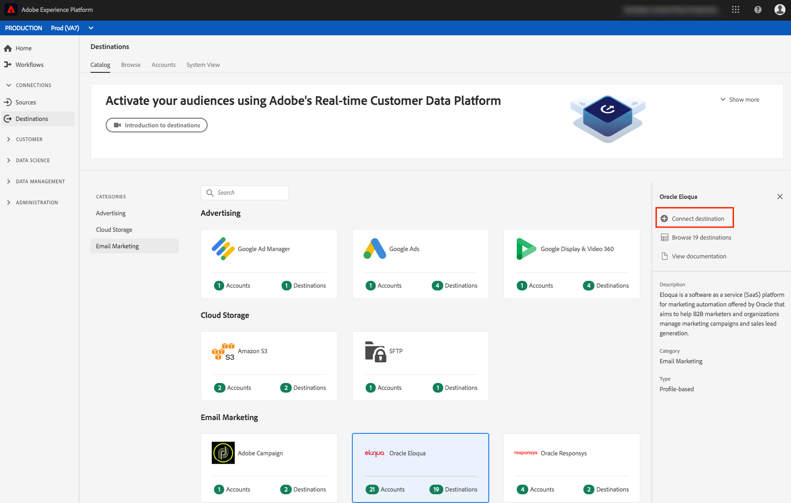

# [!DNL Oracle Eloqua] connection

[[!DNL Oracle Eloqua]](https://www.oracle.com/cx/marketing/automation/) es una plataforma de software como servicio (SaaS) para la automatización de marketing ofrecida por  [!DNL Oracle] que tiene como objetivo ayudar a los especialistas en marketing B2B y a las organizaciones a administrar las campañas de marketing y la generación de posibles clientes de ventas.

Para enviar datos de segmentos a [!DNL Oracle Eloqua], primero debe [conectar el destino](#connect-destination) en Adobe Experience Platform y luego [configurar una importación de datos](#import-data-into-eloqua) desde la ubicación de almacenamiento a [!DNL Oracle Eloqua].

## Tipo de exportación {#export-type}

**Basado en perfiles** : exporta todos los miembros de un segmento, junto con los campos de esquema deseados (por ejemplo: dirección de correo electrónico, número de teléfono y apellidos), tal como se elige en la pantalla de selección de atributos del flujo de trabajo de activación de  [destino](../../ui/activate-destinations.md#select-attributes).

## LISTA DE PERMITIDOS de dirección IP {#allow-list}

Al configurar destinos de marketing por correo electrónico con almacenamiento SFTP, Adobe recomienda que agregue ciertos rangos de IP a la lista de permitidos.

Consulte la [lista de permitidos de direcciones IP para destinos de almacenamiento en la nube](../cloud-storage/ip-address-allow-list.md) si necesita agregar IP de Adobe a su lista de permitidos.

## Conectarse al destino {#connect-destination}

En **[!UICONTROL Connections]** > **[!UICONTROL Destinations]**, seleccione [!DNL Oracle Eloqua] y, a continuación, seleccione **[!UICONTROL Configure]**.

>[!NOTE]
>
>Si ya existe una conexión con este destino, puede ver un botón **[!UICONTROL Activate]** en la tarjeta de destino. Para obtener más información sobre la diferencia entre [!UICONTROL Activate] y [!UICONTROL Configure], consulte la sección [Catalog](../../ui/destinations-workspace.md#catalog) de la documentación del espacio de trabajo de destino.

En el paso **[!UICONTROL Account]**, si ha configurado anteriormente una conexión con su destino de almacenamiento en la nube, seleccione **[!UICONTROL Existing Account]** y elija una de las conexiones existentes. O bien, puede seleccionar **[!UICONTROL New Account]** para configurar una nueva conexión. Complete las credenciales de autenticación de la cuenta y seleccione **[!UICONTROL Connect to destination]**. Para [!DNL Oracle Eloqua], puede seleccionar entre **[!UICONTROL SFTP with Password]** y **[!UICONTROL SFTP with SSH Key]**.

Rellene la información siguiente, según el tipo de conexión y seleccione **[!UICONTROL Connect to destination]**.

- Para las conexiones **[!UICONTROL SFTP with Password]**, debe proporcionar [!UICONTROL Domain], [!UICONTROL Port], [!UICONTROL Username] y [!UICONTROL Password].
- Para las conexiones **[!UICONTROL SFTP with SSH Key]**, debe proporcionar [!UICONTROL Domain], [!UICONTROL Port], [!UICONTROL Username] y [!UICONTROL SSH Key].

Opcionalmente, puede adjuntar su clave pública con formato RSA para agregar cifrado con PGP/GPG a los archivos exportados en la sección **[!UICONTROL Key]**. La clave pública debe escribirse como una cadena codificada [!DNL Base64].

En el paso **[!UICONTROL Authentication]**, rellene la información relevante para su destino como se muestra a continuación:
- **[!UICONTROL Name]**: Elija un nombre relevante para el destino.
- **[!UICONTROL Description]**: Escriba una descripción para el destino.
- **[!UICONTROL Folder Path]**: Proporcione la ruta en su ubicación de almacenamiento donde Platform depositará sus datos de exportación como archivos CSV o delimitados por tabuladores.
- **[!UICONTROL File Format]**:  **** CSVo  **TAB_DELIMITED**. Seleccione el formato de archivo que desea exportar a su ubicación de almacenamiento.
- **[!UICONTROL Marketing actions]**: Las acciones de marketing indican la intención para la que se exportarán los datos al destino. Puede seleccionar entre las acciones de marketing definidas por el Adobe o crear su propia acción de marketing. Para obtener más información sobre las acciones de marketing, consulte [Información general sobre las políticas de uso de datos](../../../data-governance/policies/overview.md).

<!--

Commenting out Amazon S3 bucket part for now until support is clarified

- **[!UICONTROL Bucket name]**: Your Amazon S3 bucket, where Platform will deposit the data export. Your input must be between 3 and 63 characters long. Must begin and end with a letter or number. Must contain only lowercase letters, numbers, or hyphens ( - ). Must not be formatted as an IP address (for example, 192.100.1.1).

-->

Haga clic en **[!UICONTROL Create destination]** después de rellenar los campos anteriores. El destino se ha creado y puede [activar segmentos](../../ui/activate-destinations.md) en el destino.

## Activar segmentos {#activate-segments}

Consulte [Activar perfiles y segmentos en un destino](../../ui/activate-destinations.md) para obtener información sobre el flujo de trabajo de activación de segmentos.

## Atributos de destino {#destination-attributes}

Al [activar segmentos](../../ui/activate-destinations.md) en el destino [!DNL Oracle Eloqua], Adobe recomienda que seleccione un identificador único de su [esquema de unión](../../../profile/home.md#profile-fragments-and-union-schemas). Seleccione el identificador único y cualquier otro campo XDM que desee exportar al destino. Para obtener más información, consulte [Seleccionar qué campos de esquema utilizar como atributos de destino en los archivos exportados](./overview.md#destination-attributes).

## Datos exportados {#exported-data}

Para destinos [!DNL Oracle Eloqua], Platform crea un archivo `.txt` o `.csv` delimitado por tabuladores en la ubicación de almacenamiento proporcionada. Para obtener más información sobre los archivos, consulte [Destinos de marketing por correo electrónico y destinos de almacenamiento en la nube](../../ui/activate-destinations.md#esp-and-cloud-storage) en el tutorial de activación de segmentos.

## Configurar la importación de datos en [!DNL Oracle Eloqua] {#import-data-into-eloqua}

Después de conectar [!DNL Platform] al almacenamiento SFTP, debe configurar la importación de datos desde la ubicación de almacenamiento en [!DNL Oracle Eloqua]. Para obtener información sobre cómo lograr esto, consulte [Importación de contactos o cuentas](https://docs.oracle.com/cloud/latest/marketingcs_gs/OMCAA/Help/DataImportExport/Tasks/ImportingContactsOrAccounts.htm) en [!DNL Oracle Eloqua Help Center].
