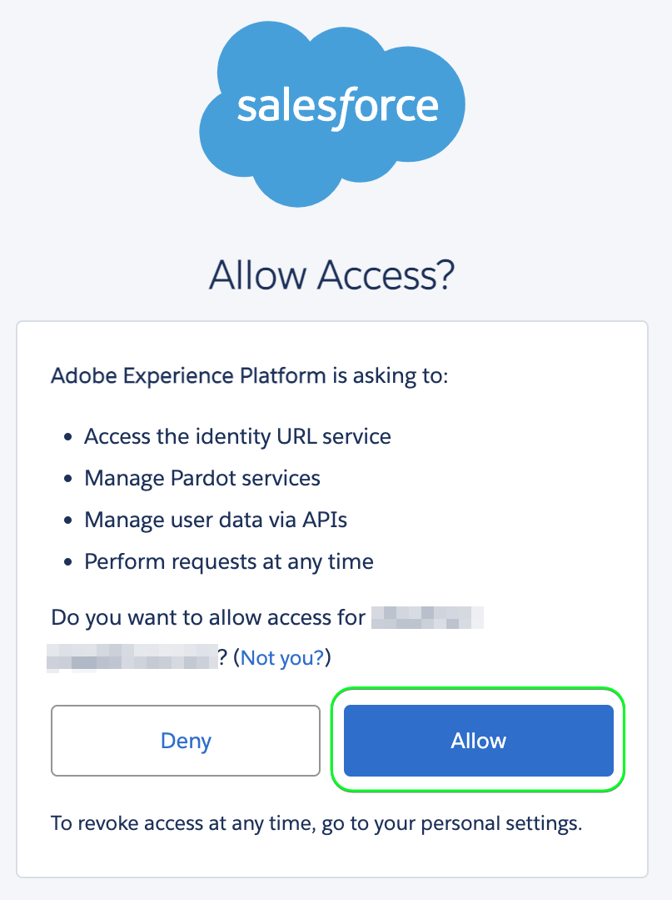

# [!DNL (V2) Salesforce Marketing Cloud Account Engagement] conexión

El destino [[!DNL Salesforce Marketing Cloud Account Engagement]](https://www.salesforce.com/products/marketing-cloud/marketing-automation/) (anteriormente conocido como [!DNL Pardot]) le permite exportar los datos de perfil de Adobe Experience Platform a la plataforma de automatización de marketing B2B de Salesforce.

Esta integración permite la sincronización de datos perfecta entre los perfiles de sus clientes en Adobe Experience Platform y sus campañas de marketing en [!DNL Salesforce Marketing Cloud Account Engagement].

Este destino usa [[!DNL Salesforce Import API v5]](https://developer.salesforce.com/docs/marketing/pardot/guide/import-v5.html) para procesar de manera eficiente las exportaciones de datos por lotes.

>[!IMPORTANT]
> 
> Esta es la versión 2 del destino [Salesforce Marketing Cloud Account Engagement](help/destinations/catalog/email-marketing/salesforce-marketing-cloud-account-engagement.md). Esta versión reemplaza al destino anterior y se encuentra en la versión de Alpha.
> >  
> > Si está utilizando la versión anterior del destino [Salesforce Marketing Cloud Account Engagement](help/destinations/catalog/email-marketing/salesforce-marketing-cloud-account-engagement.md), debe migrar a esta versión 2 antes del **enero de 2026**. A partir de enero de 2026, Adobe eliminará la versión anterior y ya no estará disponible.

## Casos de uso {#use-cases}

Para ayudarle a comprender mejor cómo y cuándo debe utilizar el destino [!DNL (V2) Marketing Cloud Account Engagement], aquí hay casos de uso de ejemplo que los clientes de Adobe Experience Platform pueden solucionar mediante este destino.

### Administración de posibles clientes B2B {#use-case-lead-management}

Sincronice los datos de posibles clientes de Adobe Experience Platform con [!DNL Salesforce Marketing Cloud Account Engagement] para obtener una nutrición y puntuación de posibles clientes completas. Su equipo de marketing puede crear perfiles de audiencia enriquecidos en Experience Platform y exportarlos a [!DNL Salesforce Marketing Cloud Account Engagement] para campañas de marketing B2B automatizadas.

### Automatización de Campaign {#use-case-campaign-automation}

Puede almacenar en déclencheur las campañas de marketing de [!DNL Salesforce Marketing Cloud Account Engagement] mediante las audiencias que defina en Adobe Experience Platform. Después de exportar las audiencias de destino a [!DNL Salesforce], puede usarlas para ejecutar campañas por correo electrónico y administrar los posibles clientes mediante el fomento, la puntuación y la segmentación de campañas.

### Enriquecimiento de perfil {#use-case-profile-enrichment}

Mejore sus perfiles de clientes potenciales [!DNL Salesforce Marketing Cloud Account Engagement] con datos de clientes enriquecidos de Adobe Experience Platform. Exporte atributos de perfil completos para crear registros de clientes potenciales más detallados en [!DNL Salesforce Marketing Cloud Account Engagement] para mejorar el direccionamiento y la personalización.

## Requisitos previos {#prerequisites}

Consulte las secciones siguientes para conocer los requisitos previos que debe configurar en Experience Platform y [!DNL Salesforce] y para obtener la información que necesita recopilar antes de trabajar con el destino [!DNL (V2) Marketing Cloud Account Engagement].

### Requisitos previos de Experience Platform {#prerequisites-in-experience-platform}

Antes de activar datos en el destino [!DNL (V2) Marketing Cloud Account Engagement], debe tener un [esquema](/help/xdm/schema/composition.md), un [conjunto de datos](../../../catalog/datasets/overview.md) y [audiencias](../../../segmentation/types/overview.md) creados en [!DNL Experience Platform].

### [!DNL Salesforce Marketing Cloud Account Engagement] requisitos previos {#prerequisites-destination}

Tenga en cuenta los siguientes requisitos previos para exportar datos de Experience Platform a su cuenta de [!DNL Marketing Cloud Account Engagement]:

#### Necesita tener una cuenta de [!DNL Marketing Cloud Account Engagement] {#prerequisites-account}

Es obligatorio abrir una cuenta de [!DNL Marketing Cloud Account Engagement] con una suscripción al producto [Marketing Cloud Account Engagement](https://www.salesforce.com/products/marketing-cloud/marketing-automation/) para continuar.

#### Recopilar [!DNL Marketing Cloud Account Engagement] credenciales {#gather-credentials}

Anote los elementos siguientes antes de autenticarse en el destino [!DNL (V2) Marketing Cloud Account Engagement].

| Credencial | Descripción |
| --- | --- |
| **[!UICONTROL Id. de unidad de negocio de participación de cuenta]** | Identificador de unidad de negocio de participación de cuenta [!DNL Salesforce]. Consulte la [documentación](https://help.salesforce.com/s/articleView?id=000381973&type=1) de Salesforce para obtener información sobre cómo encontrar el ID. |

{style="table-layout:auto"}

## Identidades admitidas {#supported-identities}

[!DNL (V2) Marketing Cloud Account Engagement] admite la activación de las identidades descritas en la tabla siguiente. Más información sobre [identidades](/help/identity-service/features/namespaces.md).

Si se encuentra una coincidencia utilizando uno de estos identificadores, el registro de cliente potencial de participación de cuenta existente se actualizará con los datos de Adobe Experience Platform. Si no se encuentra ninguna coincidencia, se creará un nuevo registro de clientes potenciales en Participación de la cuenta.

| Identidad de destino | Descripción | Consideraciones |
|---|---|---|
| `matchId` | Identificador de cliente potencial en participación con la cuenta | Se requiere al menos una de estas tres identidades |
| `matchSalesforceId` | Identificador de contacto/posible cliente de Salesforce del cliente potencial | Se requiere al menos una de estas tres identidades |
| `matchEmail` | Dirección de correo electrónico del posible cliente | Se requiere al menos una de estas tres identidades |

{style="table-layout:auto"}

## Tipo y frecuencia de exportación {#export-type-frequency}

Consulte la tabla siguiente para obtener información sobre el tipo y la frecuencia de exportación de destino.

| Elemento | Tipo | Notas |
---------|----------|---------|
| Tipo de exportación | **[!UICONTROL Basado en perfil]** | <ul><li>Va a exportar todos los miembros de una audiencia, junto con los campos de esquema deseados *(por ejemplo: dirección de correo electrónico, número de teléfono, apellidos)*, según la asignación de campos.</li><li>Este destino admite la exportación por lotes de datos de perfil mediante la API de importación de Salesforce v5.</li></ul> |
| Frecuencia de exportación | **[!UICONTROL Lote]** | <ul><li>**Exportación inicial**: exportación completa inmediatamente después de la asignación</li><li>**Exportaciones posteriores**: exportaciones incrementales cada 3 horas</li><li>Esta programación es fija y no se puede personalizar en Alpha</li></ul> |

{style="table-layout:auto"}

## Conectar con el destino {#connect}

>[!IMPORTANT]
>
>Para conectarse al destino, necesita los **[!UICONTROL permisos de control de acceso]** de Ver destinos **[!UICONTROL y]** Administrar destinos5}. Lea la [descripción general del control de acceso](/help/access-control/ui/overview.md) o póngase en contacto con el administrador del producto para obtener los permisos necesarios.

Para conectarse a este destino, siga los pasos descritos en el [tutorial de configuración de destino](../../ui/connect-destination.md). En el flujo de trabajo de configuración de destino, rellene los campos enumerados en las dos secciones siguientes.

### Autenticarse en el destino {#authenticate}

Para autenticarse en el destino, seleccione **[!UICONTROL Conectarse al destino]**.

Se le redirigirá a la página de inicio de sesión [!DNL Salesforce]. Escriba sus credenciales de cuenta de [!DNL Marketing Cloud Account Engagement] y seleccione **[!UICONTROL Iniciar sesión]**.

A continuación, selecciona **[!UICONTROL Permitir]** que dé permisos a la aplicación **Adobe Experience Platform** para acceder a tu cuenta de [!DNL Salesforce Marketing Cloud Account Engagement]. *Solo tienes que hacer esto una vez*.

Si los detalles proporcionados son válidos, la interfaz de usuario muestra un mensaje: *Se ha conectado correctamente a (V2) la cuenta de Salesforce Marketing Cloud Account Engagement* y un estado de **[!UICONTROL Conectado]** con una marca de verificación verde.

### Rellenar detalles de destino {#destination-details}

Para configurar los detalles del destino, rellene los campos obligatorios y opcionales a continuación. Un asterisco junto a un campo en la interfaz de usuario indica que el campo es obligatorio.

* **[!UICONTROL Nombre]**: Un nombre por el cual reconocerá este destino en el futuro.
* **[!UICONTROL Descripción]**: Una descripción que le ayudará a identificar este destino en el futuro.
* **[!UICONTROL Id. de unidad de negocio de participación de cuenta]**: su [!DNL Salesforce] `Account Engagement Business Unit ID`.
* **[!UICONTROL API de participación de cuenta]**: seleccione si desea utilizar los extremos de producción (`https://pi.pardot.com`) o demostración (`https://pi.demo.pardot.com`) de la API de participación de cuenta.
* **[!UICONTROL ID de campaña de participación en la cuenta]**: cada cliente potencial de [!DNL Account Engagement] debe estar asociado a una campaña. Si no establece un ID de campaña, Compromiso de cuenta intentará asignar uno automáticamente, si existe un valor predeterminado en la cuenta de Salesforce.

### Habilitar alertas {#enable-alerts}

Puede activar alertas para recibir notificaciones sobre el estado del flujo de datos a su destino. Seleccione una alerta de la lista a la que suscribirse para recibir notificaciones sobre el estado del flujo de datos. Para obtener más información sobre las alertas, consulte la guía sobre [suscripción a alertas de destinos mediante la interfaz de usuario](../../ui/alerts.md).

Cuando termine de proporcionar detalles para la conexión de destino, seleccione **[!UICONTROL Siguiente]**.

## Activar públicos en este destino {#activate}

>[!IMPORTANT]
> 
>* Para activar los datos, necesita los **[!UICONTROL permisos de control de acceso]**, **[!UICONTROL Activar destinos]**, **[!UICONTROL Ver perfiles]** y **[!UICONTROL Ver segmentos]**[para ](/help/access-control/home.md#permissions). Lea la [descripción general del control de acceso](/help/access-control/ui/overview.md) o póngase en contacto con el administrador del producto para obtener los permisos necesarios.
>* Para exportar *identidades*, necesita el **[!UICONTROL permiso de control de acceso]** de [Ver gráfico de identidad](/help/access-control/home.md#permissions).   {width="100" zoomable="yes"}

Lea [Activar datos de audiencia en destinos de exportación de perfiles por lotes](/help/destinations/ui/activate-batch-profile-destinations.md) para obtener instrucciones sobre cómo activar audiencias en este destino.

### Consideraciones sobre asignación y ejemplo {#mapping-considerations-example}

Para enviar datos de audiencia de Adobe Experience Platform al destino [!DNL (V2) Marketing Cloud Account Engagement], debe asignar los campos de esquema del Modelo de datos de experiencia (XDM) a los campos correspondientes del destino.

Consulte la [Documentación de la API de clientes potenciales de Salesforce v5](https://developer.salesforce.com/docs/marketing/pardot/guide/prospect-v5.html) para obtener una lista completa de los campos admitidos. Tenga en cuenta que la versión de Alpha no admite [campos personalizados](https://developer.salesforce.com/docs/marketing/pardot/guide/custom-field-v5.html).

#### Atributos admitidos {#supported-attributes}

El destino de participación de cuenta de Salesforce Marketing Cloud admite los atributos de destino que se describen en la tabla siguiente.

| Atributo | Tipo | Descripción |
|---------|----------|----------|
| `salesforceId` | Cadena | El Salesforce ID del cliente potencial |
| `salesforceOwnerId` | Entero | El ID de usuario de Salesforce del propietario del cliente potencial |
| `salutation` | Cadena | Saludo del posible cliente (por ejemplo, Sr., Sra., Dr.) |
| `score` | Entero | Puntuación del posible cliente en Participación en la cuenta |
| `source` | Cadena | El origen del registro de clientes potenciales |
| `state` | Cadena | El estado/provincia del posible cliente |
| `territory` | Cadena | El territorio asignado al cliente potencial |
| `userId` | Entero | El ID de usuario asociado con el cliente potencial |
| `website` | Cadena | URL del sitio web del posible cliente |
| `yearsInBusiness` | Cadena | El número de años que el posible cliente ha estado en el negocio |
| `zip` | Cadena | El código postal del posible cliente |

#### Asignaciones requeridas {#required-mappings}

Antes de empezar a asignar los datos, revise las asignaciones de campo requeridas a continuación.

| Campo de destino | Tipo | Requerido | Cuándo se usa |
|---|---|---|---|
| `email` | Atributo | Siempre obligatorio | La dirección de correo electrónico del posible cliente. Este es el identificador principal para buscar y buscar registros de clientes potenciales coincidentes en la participación de la cuenta cuando no tiene un `matchId` o `matchSalesforceId`.   **Nota:** Con la función &quot;Permitir varios clientes potenciales con la misma dirección de correo electrónico&quot; de la participación en la cuenta, confiar únicamente en el correo electrónico puede generar ambigüedad si hay varios clientes potenciales con el mismo correo electrónico. En tales casos, la participación en la cuenta normalmente no actualizará al cliente potencial con la actividad más reciente. |
| `matchId` | Identidad | Se requiere al menos una de estas tres identidades | Un identificador único generado por la participación en la cuenta para cada registro de cliente potencial individual. Utilícelo cuando ya tenga el ID de cliente potencial de participación de la cuenta y desee asegurarse de que las actualizaciones se apliquen al cliente potencial correcto, especialmente cuando varios clientes potenciales compartan la misma dirección de correo electrónico. |
| `matchSalesforceId` | Identidad | Se requiere al menos una de estas tres identidades | El ID de Salesforce de un posible cliente o contacto en Salesforce. Utilícelo cuando un cliente potencial ya esté sincronizado con Salesforce para mantener la coherencia de los datos entre Account Engagement y Salesforce. |
| `matchEmail` | Identidad | Se requiere al menos una de estas tres identidades | La dirección de correo electrónico del posible cliente utilizada para la coincidencia. Utilícelo como identificador alternativo cuando no tenga el ID del posible cliente de participación de la cuenta o el ID de Salesforce específicos. Nota: Si varios clientes potenciales comparten la misma dirección de correo electrónico, Participación de la cuenta generalmente actualizará de forma predeterminada el cliente potencial con la actividad más reciente. |

Siga los pasos a continuación para asignar los campos correctos.

1. En el paso **[!UICONTROL Asignación]**, seleccione **[!UICONTROL Agregar nueva asignación]**. Verá una nueva fila de asignación en la pantalla.
1. En la ventana **[!UICONTROL Seleccionar campo de origen]**, elija la categoría **[!UICONTROL Seleccionar atributos]** y seleccione el atributo XDM o elija **[!UICONTROL Seleccionar área de nombres de identidad]** y seleccione una identidad.
1. En la ventana **[!UICONTROL Seleccionar campo de destino]**, elija **[!UICONTROL Seleccionar área de nombres de identidad]** y seleccione una identidad o elija **[!UICONTROL Seleccionar atributos personalizados]** categoría y especifique en la lista de campos potenciales de participación de cuenta estándar.

## Validar exportación de datos {#exported-data}

Para comprobar que ha configurado correctamente el destino, siga los pasos a continuación:

1. Vaya a una de las audiencias que haya seleccionado. Seleccione la pestaña **[!DNL Activation data]** La columna **[!UICONTROL ID de asignación]** muestra el nombre del campo personalizado que se genera en la página [!DNL Marketing Cloud Account Engagement Prospects].
   

1. Inicie sesión en el sitio web [[!DNL Salesforce]](https://login.salesforce.com/). A continuación, vaya a la página **[!DNL Account Engagement]** > **[!DNL Prospects]** > **[!DNL Pardot Prospects]** y compruebe si se han agregado o actualizado los posibles clientes de la audiencia. También puede tener acceso a [[!DNL Account Engagement]](https://pi.pardot.com/) y a la página **[!DNL Prospects]**.
   

1. Para comprobar si se han actualizado los posibles clientes, seleccione un cliente y verifique si el campo de cliente potencial personalizado se ha actualizado con el estado de audiencia de Experience Platform.
   

## Uso de datos y gobernanza {#data-usage-governance}

Todos los destinos de [!DNL Adobe Experience Platform] cumplen con las políticas de uso de datos al administrar los datos. Para obtener información detallada sobre cómo [!DNL Adobe Experience Platform] aplica el control de datos, consulte la [Información general sobre el control de datos](/help/data-governance/home.md).

## Recursos adicionales {#additional-resources}

* [!DNL Marketing Cloud Account Engagement] [Documentación de API](https://developer.salesforce.com/docs/marketing/pardot/guide/overview.html)
* [Documentación de la API de importación v5 de Salesforce](https://developer.salesforce.com/docs/marketing/pardot/guide/import-v5.html)
* [Documentación de la API de Salesforce Prospect v5](https://developer.salesforce.com/docs/marketing/pardot/guide/prospect-v5.html)