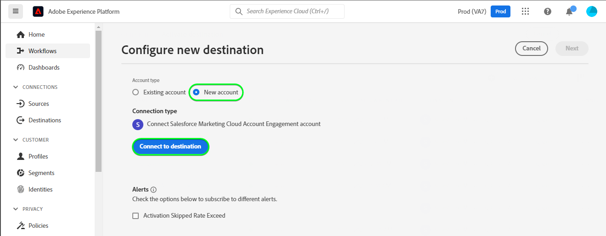

# [!DNL Salesforce Marketing Cloud Account Engagement] conexión

Use el destino [[!DNL Salesforce Marketing Cloud Account Engagement]](https://www.salesforce.com/products/marketing-cloud/marketing-automation/) *(anteriormente conocido como [!DNL Pardot])* para capturar, rastrear, calificar y calificar posibles clientes. También puede diseñar pistas de posibles clientes para todas las etapas de la canalización para audiencias de mercado objetivo y grupos de clientes a través de campañas de correo electrónico por goteo y administración de posibles clientes con nutrición, puntuación y segmentación de campañas.

En comparación con [!DNL Salesforce Marketing Cloud Engagement], que está más orientado al marketing **B2C**, [!DNL Marketing Cloud Account Engagement] es ideal para los casos de uso de **B2B** que involucran varios departamentos y tomadores de decisiones y que requieren ciclos de decisión y ventas más largos. Además, también mantiene una mayor proximidad e integración con su CRM para tomar las decisiones de ventas y marketing adecuadas. *Tenga en cuenta que el Experience Platform también tiene conexiones para [!DNL Salesforce Marketing Cloud Engagement], puede comprobarlas en las páginas [[!DNL Salesforce Marketing Cloud]](/help/destinations/catalog/email-marketing/salesforce-marketing-cloud.md) y [[!DNL (API) Salesforce Marketing Cloud]](/help/destinations/catalog/email-marketing/salesforce-marketing-cloud-exact-target.md).*

Este [!DNL Adobe Experience Platform] [destino](/help/destinations/home.md) aprovecha el extremo [[!DNL Salesforce Account Engagement API > Prospect Upsert by Email]](https://developer.salesforce.com/docs/marketing/pardot/guide/prospect-v5.html#prospect-upsert-by-email) para **agregar o actualizar tus posibles clientes** después de activarlos en un nuevo segmento [!DNL Marketing Cloud Account Engagement].

[!DNL Marketing Cloud Account Engagement] utiliza el protocolo OAuth 2 con código de autorización para autenticarse en la API [!DNL Account Engagement]. Las instrucciones para autenticarse en su instancia de [!DNL Marketing Cloud Account Engagement] se encuentran más abajo, en la sección [Autenticar en destino](#authenticate).

## Casos de uso {#use-cases}

Para ayudarle a comprender mejor cómo y cuándo debe utilizar el destino [!DNL Marketing Cloud Account Engagement], aquí tiene un ejemplo de uso que los clientes de Adobe Experience Platform pueden solucionar mediante este destino.

### Envío de correos electrónicos a contactos para campañas de marketing {#use-case-send-emails}

El departamento de marketing de una plataforma en línea desea difundir una campaña de marketing basada en correo electrónico a una audiencia seleccionada de posibles clientes B2B. El equipo de marketing de la plataforma puede agregar nuevos posibles clientes o actualizar la información de posibles clientes existente a través de Adobe Experience Platform, crear audiencias a partir de sus propios datos sin conexión y enviar estas audiencias a [!DNL Marketing Cloud Account Engagement], que luego se puede usar para enviar el correo electrónico de la campaña de marketing.

## Requisitos previos {#prerequisites}

Consulte las secciones siguientes para conocer todos los requisitos previos que debe configurar en Experience Platform y [!DNL Salesforce], así como la información que debe recopilar antes de trabajar con el destino [!DNL Marketing Cloud Account Engagement].

### Requisitos previos en Experience Platform {#prerequisites-in-experience-platform}

Antes de activar datos en el destino [!DNL Marketing Cloud Account Engagement], debe tener un [esquema](/help/xdm/schema/composition.md), un [conjunto de datos](https://experienceleague.adobe.com/docs/platform-learn/tutorials/data-ingestion/create-datasets-and-ingest-data.html) y [segmentos](https://experienceleague.adobe.com/docs/platform-learn/tutorials/segments/create-segments.html) creados en [!DNL Experience Platform].

### Requisitos previos en [!DNL Marketing Cloud Account Engagement] {#prerequisites-destination}

Tenga en cuenta los siguientes requisitos previos para exportar datos de Platform a su cuenta de [!DNL Marketing Cloud Account Engagement]:

#### Necesita tener una cuenta de [!DNL Marketing Cloud Account Engagement] {#prerequisites-account}

Es obligatorio abrir una cuenta de [!DNL Marketing Cloud Account Engagement] con una suscripción al producto [Participación de cuenta de Marketing Cloud](https://www.salesforce.com/products/marketing-cloud/marketing-automation/) para continuar.

Su cuenta de [!DNL Salesforce] debe tener [!DNL Salesforce] `Account Engagement Administrator role`. Esto es necesario para [crear campos de cliente potencial personalizados](https://help.salesforce.com/s/articleView?id=sf.pardot_fields_create_custom_field.htm&amp;type=5).

Por último, su cuenta también debería poder acceder a [[!DNL Account Engagement Lightning App]](https://help.salesforce.com/s/articleView?id=sf.pardot_lightning_enable.htm&amp;type=5).

Póngase en contacto con [[!DNL Salesforce] Soporte técnico](https://www.salesforce.com/company/contact-us/?d=cta-glob-footer-10) o con el administrador de su cuenta de [!DNL Salesforce] si no tiene una cuenta, o si la cuenta no tiene la suscripción de [!DNL Marketing Cloud Account Engagement] o [!DNL Account Engagement Administrator role].

#### Recopilar [!DNL Marketing Cloud Account Engagement] credenciales {#gather-credentials}

Observe los elementos siguientes antes de autenticarse en el destino [!DNL Marketing Cloud Account Engagement].

| Credencial | Descripción |
| --- | --- |
| `Username` | Su nombre de usuario de la cuenta [!DNL Marketing Cloud Account Engagement]. |
| `Password` | Contraseña de su cuenta de [!DNL Marketing Cloud Account Engagement]. |
| `Account Engagement Business Unit ID` | Para encontrar el Id. de unidad de negocio de participación de cuenta, use la instalación en [!DNL Salesforce]. En Configuración, escriba *Configuración de unidad de negocio* en el cuadro Búsqueda rápida. El identificador de unidad de negocio de participación de cuenta comienza con `0Uv` y tiene 18 caracteres de longitud. Si no puede obtener acceso a la información de configuración de la unidad de negocio, pídale al administrador de cuentas de [!DNL Salesforce] que le proporcione el `Account Engagement Business Unit ID`. Si necesita instrucciones adicionales, consulte la página de directrices [[!DNL Salesforce] Autenticación](https://developer.salesforce.com/docs/marketing/pardot/guide/authentication). |

{style="table-layout:auto"}

### Mecanismos de protección {#guardrails}

Consulte [!DNL Marketing Cloud Account Engagement] [límites de tarifa](https://developer.salesforce.com/docs/marketing/pardot/guide/overview.html#rate-limits) que detallan los límites impuestos por su plan y que también se aplicarán a las ejecuciones de Experience Platform.

>[!IMPORTANT]
>
>Si el administrador de su cuenta de [!DNL Salesforce] ha restringido el acceso a rangos de IP de confianza, deberá ponerse en contacto con ellos para obtener [IP del Experience Platform](/help/destinations/catalog/streaming/ip-address-allow-list.md) incluidas en la lista de permitidos. Consulte la documentación de [!DNL Salesforce] [Restringir el acceso a rangos de IP fiables para una aplicación conectada](https://help.salesforce.com/s/articleView?id=sf.connected_app_edit_ip_ranges.htm&amp;type=5) si necesita instrucciones adicionales.

## Identidades admitidas {#supported-identities}

[!DNL Marketing Cloud Account Engagement] admite la activación de las identidades descritas en la tabla siguiente. Más información sobre [identidades](/help/identity-service/features/namespaces.md).

| Identidad de destino | Descripción | Consideraciones |
|---|---|---|
| Correo electrónico | Dirección de correo electrónico del cliente potencial | Obligatorio |

{style="table-layout:auto"}

## Tipo y frecuencia de exportación {#export-type-frequency}

Consulte la tabla siguiente para obtener información sobre el tipo y la frecuencia de exportación de destino.

| Elemento | Tipo | Notas |
---------|----------|---------|
| Tipo de exportación | **[!UICONTROL Basado en perfil]** | <ul><li>Va a exportar todos los miembros de un segmento, junto con los campos de esquema deseados *(por ejemplo: dirección de correo electrónico, número de teléfono, apellidos)*, según la asignación de campos.</li><li> Para cada audiencia seleccionada en Platform, el estado del segmento [!DNL Salesforce Marketing Cloud Account Engagement] correspondiente se actualiza con su estado de audiencia de Platform.</li></ul> |
| Frecuencia de exportación | **[!UICONTROL Transmisión]** | Los destinos de streaming son conexiones basadas en API &quot;siempre activadas&quot;. Tan pronto como se actualiza un perfil en Experience Platform según la evaluación de audiencias, el conector envía la actualización de forma descendente a la plataforma de destino. Más información sobre [destinos de streaming](/help/destinations/destination-types.md#streaming-destinations). |

{style="table-layout:auto"}

## Conexión al destino {#connect}

>[!IMPORTANT]
>
>Para conectarse al destino, necesita los **[!UICONTROL permisos de control de acceso](/help/access-control/home.md#permissions) de Ver destinos]** y **[!UICONTROL Administrar destinos]**[5}. Lea la [descripción general del control de acceso](/help/access-control/ui/overview.md) o póngase en contacto con el administrador del producto para obtener los permisos necesarios.

Para conectarse a este destino, siga los pasos descritos en el [tutorial de configuración de destino](../../ui/connect-destination.md). En el flujo de trabajo de configuración de destino, rellene los campos enumerados en las dos secciones siguientes.

En **[!UICONTROL destinos]** > **[!UICONTROL catálogo]**, busque [!DNL Salesforce Marketing Cloud Account Engagement]. También puede ubicarlo en la categoría **[!UICONTROL Marketing por correo electrónico]**.

### Autenticarse en el destino {#authenticate}

Para autenticarse en el destino, seleccione **[!UICONTROL Conectarse al destino]**. Se le dirigirá a la página de inicio de sesión de [!DNL Salesforce]. Escriba las credenciales de su cuenta de [!DNL Marketing Cloud Account Engagement] y seleccione [!DNL Log In].

A continuación, selecciona [!UICONTROL Permitir] en la ventana siguiente para dar permisos a la aplicación **Adobe Experience Platform** para acceder a tu cuenta de [!DNL Salesforce Marketing Cloud Account Engagement]. *Solo tendrá que hacer esto una vez*.

Si los detalles proporcionados son válidos, la interfaz de usuario muestra un mensaje: *Se ha conectado correctamente a la cuenta de Salesforce Marketing Cloud Account Engagement* y un mensaje **[!UICONTROL Conectado]** con una marca de verificación verde; a continuación, puede continuar con el siguiente paso.

### Rellenar detalles de destino {#destination-details}

Para configurar los detalles del destino, rellene los campos obligatorios y opcionales a continuación. Un asterisco junto a un campo en la interfaz de usuario indica que el campo es obligatorio. Consulte la sección [Recopilar [!DNL Marketing Cloud Account Engagement] credenciales](#gather-credentials) para obtener instrucciones.

| Campo | Descripción |
| --- | --- |
| **[!UICONTROL Nombre]** | Un nombre con el que reconocerá este destino en el futuro. |
| **[!UICONTROL Descripción]** | Una descripción que le ayudará a identificar este destino en el futuro. |
| **[!UICONTROL Id. de unidad de negocio de participación de cuenta]** | Su [!DNL Salesforce] `Account Engagement Business Unit ID`. |

{style="table-layout:auto"}

### Habilitar alertas {#enable-alerts}

Puede activar alertas para recibir notificaciones sobre el estado del flujo de datos a su destino. Seleccione una alerta de la lista a la que suscribirse para recibir notificaciones sobre el estado del flujo de datos. Para obtener más información sobre las alertas, consulte la guía sobre [suscripción a alertas de destinos mediante la interfaz de usuario](../../ui/alerts.md).

Cuando termine de proporcionar detalles para la conexión de destino, seleccione **[!UICONTROL Siguiente]**.

## Activar públicos en este destino {#activate}

>[!IMPORTANT]
> 
>* Para activar los datos, necesita los **[!UICONTROL permisos de control de acceso]**, **[!UICONTROL Activar destinos]**, **[!UICONTROL Ver perfiles]** y **[!UICONTROL Ver segmentos]**[para ](/help/access-control/home.md#permissions). Lea la [descripción general del control de acceso](/help/access-control/ui/overview.md) o póngase en contacto con el administrador del producto para obtener los permisos necesarios.
>* Para exportar *identidades*, necesita el **[!UICONTROL permiso de control de acceso](/help/access-control/home.md#permissions) de]** Ver gráfico de identidad[.   {width="100" zoomable="yes"}

Lea [Activar perfiles y audiencias en destinos de exportación de audiencias de streaming](/help/destinations/ui/activate-segment-streaming-destinations.md) para obtener instrucciones sobre cómo activar audiencias en este destino.

### Consideraciones sobre asignación y ejemplo {#mapping-considerations-example}

Para enviar correctamente los datos de audiencia de Adobe Experience Platform al destino [!DNL Marketing Cloud Account Engagement], debe pasar por el paso de asignación de campos. La asignación consiste en crear un vínculo entre los campos de esquema del Modelo de datos de experiencia (XDM) en la cuenta de Platform y sus equivalentes correspondientes desde el destino de destino.

Para asignar correctamente los campos XDM a los campos de destino [!DNL Marketing Cloud Account Engagement], siga los pasos a continuación.

1. En el paso **[!UICONTROL Asignación]**, seleccione **[!UICONTROL Agregar nueva asignación]**. Verá una nueva fila de asignación en la pantalla.
1. En la ventana **[!UICONTROL Seleccionar campo de origen]**, elija la categoría **[!UICONTROL Seleccionar atributos]** y seleccione el atributo XDM o elija **[!UICONTROL Seleccionar área de nombres de identidad]** y seleccione una identidad.
1. En la ventana **[!UICONTROL Seleccionar campo de destino]**, elija **[!UICONTROL Seleccionar área de nombres de identidad]** y seleccione una identidad o elija **[!UICONTROL Seleccionar atributos personalizados]** categoría y especifique de la lista de [[!DNL Prospect API fields]](https://developer.salesforce.com/docs/marketing/pardot/guide/prospect-v5.html#fields) del esquema disponible.

   * Repita estos pasos para agregar cualquier asignación entre su esquema de perfil XDM y [!DNL Marketing Cloud Account Engagement]:

     | Campo de origen | Campo de destino | Obligatorio |
     | --- | --- | --- |
     | `IdentityMap: Email` | `Identity: email` | Sí |
     | `xdm: MailingAddress.city` | `xdm: city` | |
     | `xdm: person.name.firstName` | `Attribute: firstName` | |

   * A continuación, se muestra un ejemplo con las asignaciones anteriores:
     

Cuando haya terminado de proporcionar las asignaciones para la conexión de destino, seleccione **[!UICONTROL Siguiente]**.

## Validar exportación de datos {#exported-data}

Para comprobar que ha configurado correctamente el destino, siga los pasos a continuación:

1. Vaya a una de las audiencias que haya seleccionado. Seleccione la pestaña **[!DNL Activation data]** La columna **[!UICONTROL ID de asignación]** muestra el nombre del campo personalizado que se genera en la página [!DNL Marketing Cloud Account Engagement Prospects].
   

1. Inicie sesión en el sitio web [[!DNL Salesforce]](https://login.salesforce.com/). A continuación, vaya a la página **[!DNL Account Engagement]** > **[!DNL Prospects]** > **[!DNL Pardot Prospects]** y compruebe si los posibles clientes de la audiencia se han agregado o actualizado. También puede tener acceso a [[!DNL Salesforce Pardot]](https://pi.pardot.com/) y a la página **[!DNL Prospects]**.
   

1. Para comprobar si se han actualizado los clientes potenciales, seleccione un cliente y verifique si el campo de cliente potencial personalizado se ha actualizado con el estado de audiencia del Experience Platform.
   

## Uso de datos y gobernanza {#data-usage-governance}

Todos los destinos de [!DNL Adobe Experience Platform] cumplen con las políticas de uso de datos al administrar los datos. Para obtener información detallada sobre cómo [!DNL Adobe Experience Platform] aplica el control de datos, consulte la [Información general sobre el control de datos](/help/data-governance/home.md).

## Recursos adicionales {#additional-resources}

* [!DNL Marketing Cloud Account Engagement] [Documentación de API](https://developer.salesforce.com/docs/marketing/pardot/guide/overview.html).
