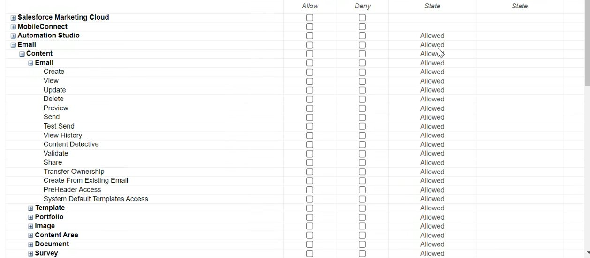
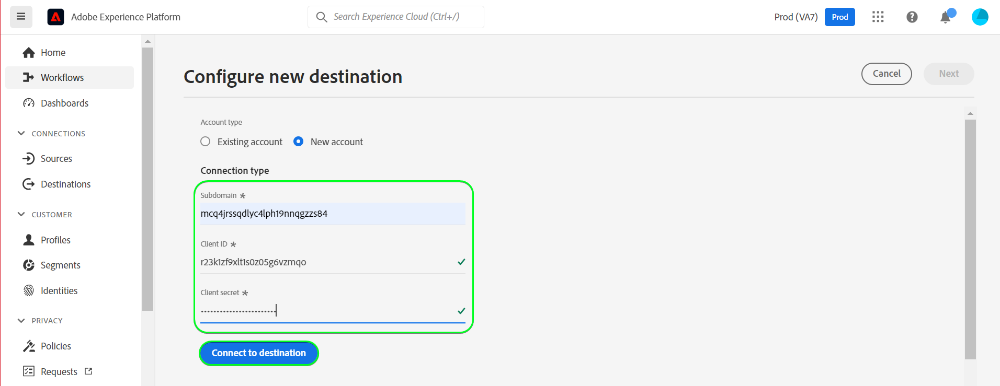
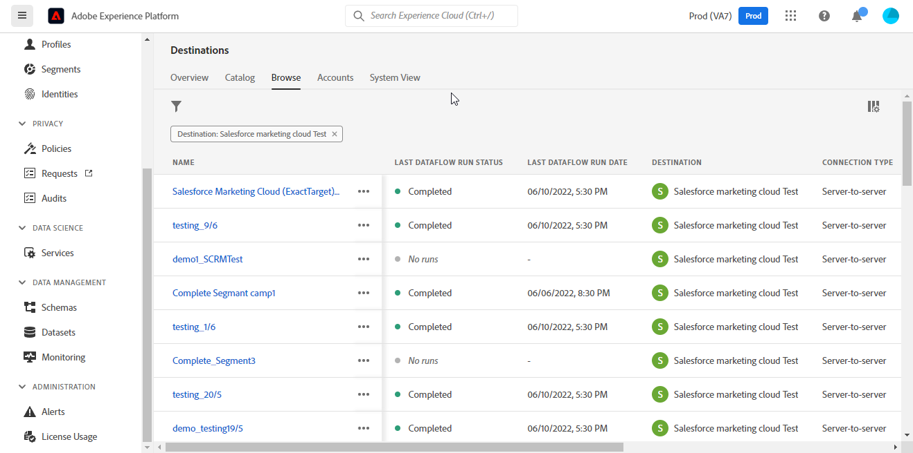

# [!DNL (API) Salesforce Marketing Cloud] conexión

## Información general {#overview}

[[!DNL (API) Salesforce Marketing Cloud]](https://www.salesforce.com/products/marketing-cloud/engagement/) (anteriormente conocido como [!DNL ExactTarget]) es un paquete de marketing digital que le permite crear y personalizar recorridos para que los visitantes y clientes personalicen su experiencia.

>[!IMPORTANT]
>
> Observe la diferencia entre esta conexión y la otra [[!DNL Salesforce Marketing Cloud] conexión](/help/destinations/catalog/email-marketing/salesforce-marketing-cloud.md) que existe en la sección Catálogo de marketing de correo electrónico. La otra conexión de Marketing Cloud de Salesforce le permite exportar archivos a una ubicación de almacenamiento especificada, mientras que esta es una conexión de flujo continuo basada en API.

Comparado con [!DNL Salesforce Marketing Cloud Account Engagement] que está más orientado hacia **B2B** marketing, la [!DNL (API) Salesforce Marketing Cloud] El destino es ideal para **B2C** casos de uso con ciclos de toma de decisiones transaccionales más cortos. Puede consolidar conjuntos de datos más grandes que representen el comportamiento de la audiencia objetivo para ajustar y mejorar las campañas de marketing priorizando y segmentando contactos, especialmente de conjuntos de datos externos [!DNL Salesforce]. *Tenga en cuenta que Experience Platform también tiene una conexión para [[!DNL Salesforce Marketing Cloud Account Engagement]](/help/destinations/catalog/email-marketing/salesforce-marketing-cloud-account-engagement.md).*

Esta [!DNL Adobe Experience Platform] [destino](/help/destinations/home.md) aprovecha el [!DNL Salesforce Marketing Cloud] [actualizar contactos](https://developer.salesforce.com/docs/marketing/marketing-cloud/guide/updateContacts.html) API, que le permite **añadir contactos y actualizar datos de contacto** para sus necesidades empresariales después de activarlas en un nuevo [!DNL Salesforce Marketing Cloud] segmento.

[!DNL Salesforce Marketing Cloud] utiliza OAuth 2 con credenciales de cliente como mecanismo de autenticación para comunicarse con [!DNL Salesforce Marketing Cloud] API. Instrucciones para autenticarse en su [!DNL Salesforce Marketing Cloud] más abajo, en la sección [Autenticar en el destino](#authenticate) sección.

## Casos de uso {#use-cases}

Para ayudarle a comprender mejor cómo y cuándo debe utilizar el [!DNL (API) Salesforce Marketing Cloud] Destino, este es un ejemplo de caso de uso que los clientes de Adobe Experience Platform pueden solucionar mediante este destino.

### Envío de correos electrónicos a contactos para campañas de marketing {#use-case-send-emails}

El departamento de ventas de una plataforma de alquiler de viviendas desea difundir un correo electrónico de marketing a una audiencia de cliente objetivo. El equipo de marketing de la plataforma puede añadir nuevos contactos o actualizar los existentes *(y sus direcciones de correo electrónico)* mediante Adobe Experience Platform, cree audiencias a partir de sus propios datos sin conexión y envíelas a [!DNL Salesforce Marketing Cloud], que se puede utilizar para enviar el correo electrónico de la campaña de marketing.

## Requisitos previos {#prerequisites}

### Requisitos previos en Experience Platform {#prerequisites-in-experience-platform}

Antes de activar los datos en [!DNL (API) Salesforce Marketing Cloud] destino, debe tener un [esquema](/help/xdm/schema/composition.md), a [conjunto de datos](https://experienceleague.adobe.com/docs/platform-learn/tutorials/data-ingestion/create-datasets-and-ingest-data.html?lang=en), y [segmentos](https://experienceleague.adobe.com/docs/platform-learn/tutorials/segments/create-segments.html?lang=en) creado en [!DNL Experience Platform].

### Requisitos previos en [!DNL (API) Salesforce Marketing Cloud] {#prerequisites-destination}

Tenga en cuenta los siguientes requisitos previos para exportar datos de Platform a su [!DNL Salesforce Marketing Cloud] cuenta:

#### Necesita tener un [!DNL Salesforce Marketing Cloud] account {#prerequisites-account}

A [!DNL Salesforce Marketing Cloud] cuenta con una suscripción a [[!DNL Marketing Cloud Engagement]](https://www.salesforce.com/products/marketing-cloud/engagement/) el producto es obligatorio para continuar.

Póngase en contacto con [[!DNL Salesforce] Asistencia](https://www.salesforce.com/company/contact-us/?d=cta-glob-footer-10) si no tiene un [!DNL Salesforce Marketing Cloud] falta el nombre de la cuenta o la cuenta. [!DNL Marketing Cloud Engagement] suscripción del producto.

#### Creación de atributos en [!DNL Salesforce Marketing Cloud] {#prerequisites-attribute}

Al activar audiencias en [!DNL (API) Salesforce Marketing Cloud] destino, debe introducir un valor en la variable **[!UICONTROL ID de asignación]** para cada audiencia activada, en el campo **[Programación de audiencia](#schedule-segment-export-example)** paso.

[!DNL Salesforce] requiere este valor para leer e interpretar correctamente las audiencias que llegan desde Experience Platform y actualizar su estado de audiencia en [!DNL Salesforce Marketing Cloud]. Consulte la documentación del Experience Platform para [Grupo de campos de esquema Detalles de pertenencia a audiencia](/help/xdm/field-groups/profile/segmentation.md) si necesita orientación sobre los estados de audiencia.

Para cada audiencia que active desde Platform a [!DNL Salesforce], debe tener un atributo de tipo `Text` vinculado a [!DNL Email Demographics] extensión de datos en [!DNL Salesforce Marketing Cloud]. Utilice el [!DNL Salesforce Marketing Cloud] [!DNL Contact Builder] para crear atributos. Consulte la [!DNL Salesforce Marketing Cloud] documentación para [crear atributos](https://help.salesforce.com/s/articleView?id=mc_cab_create_an_attribute.htm&amp;type=5&amp;language=en_US) si necesita ayuda para crear atributos.

Los nombres de los campos de atributo se utilizan para [!DNL (API) Salesforce Marketing Cloud] campo de destino durante la **[!UICONTROL Asignación]** paso. Puede definir el carácter de campo con un máximo de 4000 caracteres, según sus necesidades comerciales. Consulte la [!DNL Salesforce Marketing Cloud] [Tipos de datos de extensiones de datos](https://help.salesforce.com/s/articleView?id=sf.mc_es_data_extension_data_types.htm&amp;type=5) página documentación para obtener más información sobre los tipos de atributos.

Ejemplo de la pantalla del diseñador de datos en [!DNL Salesforce Marketing Cloud], en el que añadirá el atributo, se muestra a continuación:

Una vista de un [!DNL Salesforce Marketing Cloud] [!DNL Email Data] grupo de atributos con atributos correspondientes al estado de audiencia dentro de la variable [!DNL Email Demographics] la extensión de datos se muestra a continuación:

El [!DNL (API) Salesforce Marketing Cloud] El destino utiliza el [!DNL Salesforce Marketing Cloud] [!DNL Search Attribute-Set Definitions REST] [API](https://developer.salesforce.com/docs/marketing/marketing-cloud/guide/retrieveAttributeSetDefinitions.html) para recuperar dinámicamente las extensiones de datos y sus atributos vinculados definidos en [!DNL Salesforce Marketing Cloud].

Se muestran en la **[!UICONTROL Campo de destino]** ventana de selección al configurar el [asignación](#mapping-considerations-example) en el flujo de trabajo a [activar audiencias en el destino](#activate).

>[!IMPORTANT]
>
> En [!DNL Salesforce Marketing Cloud], debe crear atributos con un **[!UICONTROL NOMBRE DE CAMPO]** que coincide exactamente con el valor especificado en **[!UICONTROL ID de asignación]** para cada segmento de Platform activado. Por ejemplo, la captura de pantalla siguiente muestra un atributo denominado `salesforce_mc_segment_1`. Al activar una audiencia en este destino, añada `salesforce_mc_segment_1` as **[!UICONTROL ID de asignación]** para rellenar audiencias de audiencia de Experience Platform en este atributo.

Ejemplo de creación de atributos en [!DNL Salesforce Marketing Cloud], se muestra a continuación:

>[!TIP]
>
> * Al crear el atributo, no incluya espacios en blanco en el nombre del campo. En su lugar, utilice el guion bajo `(_)` como separador.
> * Para distinguir entre atributos utilizados para audiencias de Platform y otros atributos dentro de [!DNL Salesforce Marketing Cloud], puede incluir un prefijo o sufijo reconocible para los atributos utilizados para los segmentos de Adobe. Por ejemplo, en lugar de `test_segment`, use `Adobe_test_segment` o `test_segment_Adobe`.
> * Si ya ha creado otros atributos en [!DNL Salesforce Marketing Cloud], puede utilizar el mismo nombre que el segmento de Platform para identificar fácilmente la audiencia en [!DNL Salesforce Marketing Cloud].

#### Asignación de funciones y permisos de usuario dentro de [!DNL Salesforce Marketing Cloud] {#prerequisites-roles-permissions}

Como [!DNL Salesforce Marketing Cloud] admite funciones personalizadas según el caso de uso, se debe asignar al usuario las funciones relevantes para actualizar los atributos en [!DNL Salesforce Marketing Cloud]. A continuación, se muestra un ejemplo de las funciones asignadas a un usuario:

Según las funciones que tenga [!DNL Salesforce Marketing Cloud] Cuando se haya asignado un usuario, también deberá asignar permisos al [!DNL Salesforce Marketing Cloud] extensión de datos que están vinculados a los campos que desea actualizar.

Dado que este destino requiere acceso a `[!DNL data extension]`, debe permitirlos. Por ejemplo, para `Email` [!DNL data extension] debe permitir como se muestra a continuación:

Para restringir el nivel de acceso, también puede anular los accesos individuales con privilegios granulares.

Consulte la [[!DNL Marketing Cloud Roles]](https://help.salesforce.com/s/articleView?language=en_US&amp;id=sf.mc_overview_marketing_cloud_roles.htm&amp;type=5) y [[!DNL Marketing Cloud Roles and Permissions]](https://help.salesforce.com/s/articleView?language=en_US&amp;id=sf.mc_overview_roles.htm&amp;type=5) páginas para obtener instrucciones detalladas.

#### Reunir [!DNL Salesforce Marketing Cloud] credenciales {#gather-credentials}

Tenga en cuenta los elementos siguientes antes de autenticarse en el [!DNL (API) Salesforce Marketing Cloud] destino.

| Credencial | Descripción | Ejemplo |
| --- | --- | --- |
| Subdomain | Consulte [[!DNL Salesforce Marketing Cloud domain prefix]](https://developer.salesforce.com/docs/marketing/marketing-cloud/guide/your-subdomain-tenant-specific-endpoints.html) para obtener información sobre cómo obtener este valor de [!DNL Salesforce Marketing Cloud] interfaz. | Si su [!DNL Salesforce Marketing Cloud] el dominio es  *`mcq4jrssqdlyc4lph19nnqgzzs84`.login.exacttarget.com*,  debe proporcionar lo siguiente `mcq4jrssqdlyc4lph19nnqgzzs84` como el valor. |
| ID del cliente | Consulte la [!DNL Salesforce Marketing Cloud] [documentación](https://developer.salesforce.com/docs/marketing/marketing-cloud/guide/access-token-s2s.html) para obtener información sobre cómo obtener este valor de [!DNL Salesforce Marketing Cloud] interfaz. | r23kxxxxxxxx0z05xxxxxx |
| Secreto de cliente | Consulte la [!DNL Salesforce Marketing Cloud] [documentación](https://developer.salesforce.com/docs/marketing/marketing-cloud/guide/access-token-s2s.html) para obtener información sobre cómo obtener este valor de [!DNL Salesforce Marketing Cloud] interfaz. | ipxxxxxxxxxxT4xxxxxxxxxx |

{style="table-layout:auto"}

### Mecanismos de protección {#guardrails}

* Salesforce impone ciertas [límites de velocidad](https://developer.salesforce.com/docs/marketing/marketing-cloud/guide/rate-limiting.html).
   * Consulte la [!DNL Salesforce Marketing Cloud] [documentación](https://developer.salesforce.com/docs/marketing/marketing-cloud/guide/rate-limiting-errors.html) para resolver cualquier límite probable que pueda encontrar y reducir los errores durante la ejecución.
   * Consulte la [[!DNL Salesforce Marketing Cloud] Precios de participación](https://www.salesforce.com/editions-pricing/marketing-cloud/email/) página a *Descargar el gráfico comparativo de la edición completa* como un pdf que detalla los límites impuestos por su plan.
   * El [Resumen de API](https://developer.salesforce.com/docs/marketing/marketing-cloud/guide/apis-overview.html) La página detalla los límites adicionales.
   * Consulte [aquí](https://salesforce.stackexchange.com/questions/205898/marketing-cloud-api-limits) para una página que recopila estos detalles.
* El recuento de *campos personalizados permitidos por objeto* varía según la edición de Salesforce.
   * Consulte la [!DNL Salesforce] [documentación](https://help.salesforce.com/s/articleView?id=sf.custom_field_allocations.htm&amp;type=5) para obtener más información.
   * Si ha alcanzado el límite definido para *campos personalizados permitidos por objeto* dentro [!DNL Salesforce Marketing Cloud] deberá hacer lo siguiente
      * Quite los atributos más antiguos antes de agregar nuevos atributos en [!DNL Salesforce Marketing Cloud].
      * Actualice o elimine cualquier audiencia activada en destinos de Platform que utilicen estos nombres de atributo antiguos como valor proporcionado para **[!UICONTROL ID de asignación]** durante la [programación de audiencia](#schedule-segment-export-example) paso.

## Identidades admitidas {#supported-identities}

[!DNL (API) Salesforce Marketing Cloud] admite la activación de identidades descritas en la tabla siguiente. Más información sobre [identidades](/help/identity-service/namespaces.md).

| Identidad de destino | Descripción | Consideraciones |
|---|---|---|
| contactKey | [!DNL Salesforce Marketing Cloud] Clave de contacto. Consulte la [!DNL Salesforce Marketing Cloud] [documentación](https://help.salesforce.com/s/articleView?id=sf.mc_cab_contact_builder_best_practices.htm&amp;type=5) si necesita orientación adicional. | Obligatorio |

## Audiencias compatibles {#supported-audiences}

Esta sección describe qué tipo de audiencias puede exportar a este destino.

| Origen de audiencia | Admitido | Descripción |
---------|----------|----------|
| [!DNL Segmentation Service] | ✓ | Audiencias generadas mediante el Experience Platform [Servicio de segmentación](../../../segmentation/home.md). |
| Cargas personalizadas | X | Audiencias [importado](../../../segmentation/ui/overview.md#import-audience) en el Experience Platform desde archivos CSV. |

{style="table-layout:auto"}

## Tipo y frecuencia de exportación {#export-type-frequency}

Consulte la tabla siguiente para obtener información sobre el tipo y la frecuencia de exportación de destino.

| Elemento | Tipo | Notas |
---------|----------|---------|
| Tipo de exportación | **[!UICONTROL Basado en perfiles]** | <ul><li>Está exportando todos los miembros de un segmento, junto con los campos de esquema deseados *(por ejemplo: dirección de correo electrónico, número de teléfono, apellidos)*, según la asignación de campo.</li><li> Cada estado del segmento en [!DNL Salesforce Marketing Cloud] se actualiza con el estado de audiencia correspondiente de Platform, en función de la variable **[!UICONTROL ID de asignación]** valor proporcionado durante la [programación de audiencia](#schedule-segment-export-example) paso.</li></ul> |
| Frecuencia de exportación | **[!UICONTROL Transmisión]** | Los destinos de streaming son conexiones basadas en API &quot;siempre activadas&quot;. Tan pronto como se actualiza un perfil en Experience Platform según la evaluación de audiencias, el conector envía la actualización de forma descendente a la plataforma de destino. Más información sobre [destinos de streaming](/help/destinations/destination-types.md#streaming-destinations). |

{style="table-layout:auto"}

## Conectar con el destino {#connect}

>[!IMPORTANT]
>
> Para conectarse al destino, necesita el **[!UICONTROL Administrar destinos]** [permiso de control de acceso](/help/access-control/home.md#permissions). Lea el [información general de control de acceso](/help/access-control/ui/overview.md) o póngase en contacto con el administrador del producto para obtener los permisos necesarios.

Para conectarse a este destino, siga los pasos descritos en la sección [tutorial de configuración de destino](../../ui/connect-destination.md). En el flujo de trabajo de configuración de destino, rellene los campos enumerados en las dos secciones siguientes.

En **[!UICONTROL Destinos]** > **[!UICONTROL Catálogo]**, buscar [!DNL (API) Salesforce Marketing Cloud]. También puede encontrarlo en la sección **[!UICONTROL Marketing por email]** categoría.

### Autenticar en el destino {#authenticate}

Para autenticarse en el destino, rellene los campos obligatorios a continuación y seleccione **[!UICONTROL Conectar con destino]**. Consulte la [Reunir [!DNL Salesforce Marketing Cloud] credenciales](#gather-credentials) para obtener cualquier guía.

| [!DNL (API) Salesforce Marketing Cloud] destino | [!DNL Salesforce Marketing Cloud] |
| --- | --- |
| **[!UICONTROL Subdomain]** | Su [!DNL Salesforce Marketing Cloud] prefijo de dominio.  Por ejemplo, si el dominio es   *`mcq4jrssqdlyc4lph19nnqgzzs84`.login.exacttarget.com*,   debe proporcionar lo siguiente `mcq4jrssqdlyc4lph19nnqgzzs84` como el valor. |
| **[!UICONTROL ID del cliente]** | Su [!DNL Salesforce Marketing Cloud] `Client ID`. |
| **[!UICONTROL Secreto de cliente]** | Su [!DNL Salesforce Marketing Cloud] `Client Secret`. |

Si los detalles proporcionados son válidos, la interfaz de usuario muestra un **[!UICONTROL Conectado]** estado con una marca de verificación verde, puede continuar con el siguiente paso.

### Rellenar detalles de destino {#destination-details}

Para configurar los detalles del destino, rellene los campos obligatorios y opcionales a continuación. Un asterisco junto a un campo en la interfaz de usuario indica que el campo es obligatorio.

* **[!UICONTROL Nombre]**: Un nombre con el que reconocerá este destino en el futuro.
* **[!UICONTROL Descripción]**: Una descripción que le ayudará a identificar este destino en el futuro.

### Habilitar alertas {#enable-alerts}

Puede activar alertas para recibir notificaciones sobre el estado del flujo de datos a su destino. Seleccione una alerta de la lista a la que suscribirse para recibir notificaciones sobre el estado del flujo de datos. Para obtener más información sobre las alertas, consulte la guía de [suscripción a alertas de destinos mediante la IU](../../ui/alerts.md).

Cuando haya terminado de proporcionar detalles para la conexión de destino, seleccione **[!UICONTROL Siguiente]**.

## Activar audiencias en este destino {#activate}

>[!IMPORTANT]
> 
> * Para activar los datos, necesita el **[!UICONTROL Administrar destinos]**, **[!UICONTROL Activar destinos]**, **[!UICONTROL Ver perfiles]**, y **[!UICONTROL Ver segmentos]** [permisos de control de acceso](/help/access-control/home.md#permissions). Lea el [información general de control de acceso](/help/access-control/ui/overview.md) o póngase en contacto con el administrador del producto para obtener los permisos necesarios.
> * Para exportar *identidades*, necesita el **[!UICONTROL Ver gráfico de identidad]** [permiso de control de acceso](/help/access-control/home.md#permissions).   {width="100" zoomable="yes"}

Leer [Activación de perfiles y audiencias en destinos de exportación de audiencia de streaming](/help/destinations/ui/activate-segment-streaming-destinations.md) para obtener instrucciones sobre cómo activar audiencias en este destino.

### Consideraciones sobre asignación y ejemplo {#mapping-considerations-example}

Para enviar correctamente los datos de audiencia de Adobe Experience Platform a [!DNL (API) Salesforce Marketing Cloud] destino, debe ir a través del paso de asignación de campos. La asignación consiste en crear un vínculo entre los campos de esquema del Modelo de datos de experiencia (XDM) en la cuenta de Platform y sus equivalentes correspondientes desde el destino de destino.

Para asignar correctamente los campos XDM a [!DNL (API) Salesforce Marketing Cloud] campos de destino, siga los pasos a continuación.

>[!IMPORTANT]
>
> * Aunque los nombres de atributo deben ser los siguientes [!DNL Salesforce Marketing Cloud] cuenta, las asignaciones para ambos `contactKey` y `personalEmail.address` son obligatorios.
>
> * La integración con [!DNL Salesforce Marketing Cloud] La API de está sujeta a un límite de paginación en cuanto a la cantidad de atributos que el Experience Platform de puede recuperar de Salesforce. Esto significa que durante la **[!UICONTROL Asignación]** , el esquema de campo de destino puede mostrar un máximo de 2000 atributos de su cuenta de Salesforce.

1. En el **[!UICONTROL Asignación]** paso, seleccione **[!UICONTROL Añadir nueva asignación]**. Verá una nueva fila de asignación en la pantalla.
   
1. En el **[!UICONTROL Seleccionar campo de origen]** , seleccione la **[!UICONTROL Seleccionar atributos]** y seleccione el atributo XDM o elija el **[!UICONTROL Seleccionar área de nombres de identidad]** y seleccione una identidad.
1. En el **[!UICONTROL Seleccionar campo de destino]** , seleccione la **[!UICONTROL Seleccionar área de nombres de identidad]** y seleccione una identidad o elija **[!UICONTROL Seleccionar atributos]** y seleccione un atributo de las extensiones de datos que se muestran según sea necesario. El [!DNL (API) Salesforce Marketing Cloud] El destino utiliza el [!DNL Salesforce Marketing Cloud] [!DNL Search Attribute-Set Definitions REST] [API](https://developer.salesforce.com/docs/marketing/marketing-cloud/guide/retrieveAttributeSetDefinitions.html) para recuperar dinámicamente las extensiones de datos y sus atributos vinculados definidos en [!DNL Salesforce Marketing Cloud]. Se muestran en la **[!UICONTROL Campo de destino]** cuando se configura la variable [asignación](#mapping-considerations-example) en el [activar flujo de trabajo de audiencias](#activate).

   * Repita estos pasos para agregar las siguientes asignaciones entre el esquema de perfil XDM y [!DNL (API) Salesforce Marketing Cloud]:

     | Campo de origen | Campo de destino | Obligatorio |
     |---|---|---|
     | `IdentityMap: contactKey` | `Identity: salesforceContactKey` | `Mandatory` |
     | `xdm: personalEmail.address` | `Attribute: Email Address` desde el [!DNL Salesforce Marketing Cloud] [!DNL Email Addresses] extensión de datos de. | `Mandatory`, al añadir nuevos contactos. |
     | `xdm: person.name.firstName` | `Attribute: First Name` desde el deseado [!DNL Salesforce Marketing Cloud] extensión de datos de. | - |

   * A continuación se muestra un ejemplo con estas asignaciones:
     

Cuando haya terminado de proporcionar las asignaciones para la conexión de destino, seleccione **[!UICONTROL Siguiente]**.

### Programar exportación de audiencias y ejemplo {#schedule-segment-export-example}

Al realizar la [Programar exportación de audiencias](/help/destinations/ui/activate-segment-streaming-destinations.md#scheduling) , debe asignar manualmente las audiencias de Platform a la variable [atributos](#prerequisites-attribute) in [!DNL Salesforce Marketing Cloud].

Para ello, seleccione cada segmento e introduzca el nombre del atributo en [!DNL Salesforce Marketing Cloud] en el [!DNL (API) Salesforce Marketing Cloud] **[!UICONTROL ID de asignación]** field. Consulte la [Crear atributo en [!DNL Salesforce Marketing Cloud]](#prerequisites-custom-field) para obtener instrucciones y prácticas recomendadas sobre la creación de atributos en [!DNL Salesforce Marketing Cloud].

Por ejemplo, si su [!DNL Salesforce Marketing Cloud] el atributo es `salesforce_mc_segment_1`, especifique este valor en [!DNL (API) Salesforce Marketing Cloud] **[!UICONTROL ID de asignación]** para rellenar audiencias de audiencia de Experience Platform en este atributo.

Un atributo de ejemplo de [!DNL Salesforce Marketing Cloud] se muestra a continuación:

Ejemplo que indica la ubicación del [!DNL (API) Salesforce Marketing Cloud] **[!UICONTROL ID de asignación]** se muestra a continuación:

Como se muestra en el [!DNL (API) Salesforce Marketing Cloud] **[!UICONTROL ID de asignación]** debe coincidir exactamente con el valor especificado en [!DNL Salesforce Marketing Cloud] **[!UICONTROL NOMBRE DE CAMPO]**.

Repita esta sección para cada segmento de Platform activado.

Un ejemplo típico basado en la imagen mostrada arriba podría ser.
| [!DNL (API) Salesforce Marketing Cloud] nombre del segmento | [!DNL Salesforce Marketing Cloud] **[!UICONTROL NOMBRE DE CAMPO]** | [!DNL (API) Salesforce Marketing Cloud] **[!UICONTROL ID de asignación]** | | — | — | — | | salesforce mc audience 1 | `salesforce_mc_segment_1` | `salesforce_mc_segment_1` | | salesforce mc audience 2 | `salesforce_mc_segment_2` | `salesforce_mc_segment_2` |

## Validar exportación de datos {#exported-data}

Para comprobar que ha configurado correctamente el destino, siga los pasos a continuación:

1. Seleccionar **[!UICONTROL Destinos]** > **[!UICONTROL Examinar]** para ir a la lista de destinos.
   

1. Seleccione el destino y valide que el estado es **[!UICONTROL activado]**.
   

1. Cambie a la **[!DNL Activation data]** y, a continuación, seleccione un nombre de audiencia.
   

1. Monitorice el resumen de audiencia y asegúrese de que el recuento de perfiles corresponde al recuento creado dentro del segmento.
   

1. Inicie sesión en [[!DNL Salesforce Marketing Cloud]](https://mc.exacttarget.com/) sitio web. A continuación, vaya a **[!DNL Audience Builder]** > **[!DNL Contact Builder]** > **[!DNL All contacts]** > **[!DNL Email]** y compruebe si se han añadido los perfiles de la audiencia.
   

1. Para comprobar si se han actualizado los perfiles, vaya a **[!UICONTROL Correo electrónico]** y compruebe si se han actualizado los valores de atributo del perfil de la audiencia. Si se ejecuta correctamente, puede ver que cada estado de audiencia en [!DNL Salesforce Marketing Cloud] se ha actualizado con el estado de audiencia correspondiente de Platform, según el **[!UICONTROL ID de asignación]** valor proporcionado en la variable [programación de audiencia](#schedule-segment-export-example) paso.
   

## Uso de datos y gobernanza {#data-usage-governance}

Todo [!DNL Adobe Experience Platform] Los destinos de cumplen con las políticas de uso de datos al gestionar los datos. Para obtener información detallada sobre cómo [!DNL Adobe Experience Platform] aplica la gobernanza de datos. Consulte la [Resumen de gobernanza de datos](/help/data-governance/home.md).

## Errores y solución de problemas {#errors-and-troubleshooting}

### Se detectaron errores desconocidos al insertar eventos en el Marketing Cloud de Salesforce {#unknown-errors}

* Al comprobar la ejecución de un flujo de datos, puede encontrar el siguiente mensaje de error: `Unknown errors encountered while pushing events to the destination. Please contact the administrator and try again.`
  

   * Para corregir este error, compruebe que la variable **[!UICONTROL ID de asignación]** que ha proporcionado en el flujo de trabajo de activación a la [!DNL (API) Salesforce Marketing Cloud] El destino coincide exactamente con el nombre del atributo creado en [!DNL Salesforce Marketing Cloud]. Consulte la [Crear atributo en [!DNL Salesforce Marketing Cloud]](#prerequisites-custom-field) para obtener instrucciones.

* Al activar un segmento, puede obtener un mensaje de error: `The client's IP address is unauthorized for this account. Allowlist the client's IP address...`
   * Para solucionar este error, póngase en contacto con su [!DNL Salesforce Marketing Cloud] administrador de cuentas que agregar [Direcciones IP del Experience Platform](/help/destinations/catalog/streaming/ip-address-allow-list.md) a su [!DNL Salesforce Marketing Cloud] rangos de IP de confianza de las cuentas. Consulte la [!DNL Salesforce Marketing Cloud] [Direcciones IP para la inclusión en Listas de permitidos en el Marketing Cloud](https://help.salesforce.com/s/articleView?id=sf.mc_es_ip_addresses_for_inclusion.htm&amp;type=5) documentación de si necesita instrucciones adicionales.

## Recursos adicionales {#additional-resources}

* [!DNL Salesforce Marketing Cloud] [API](https://developer.salesforce.com/docs/marketing/marketing-cloud/guide/apis-overview.html)
* [!DNL Salesforce Marketing Cloud] [documentación](https://developer.salesforce.com/docs/marketing/marketing-cloud/guide/updateContacts.html) explicando cómo se actualizan los contactos con la información especificada.

### Changelog {#changelog}

Esta sección recoge la funcionalidad y las actualizaciones significativas de la documentación realizadas en este conector de destino.

+++ Ver registro de cambios

| Mes de lanzamiento | Tipo de actualización | Descripción |
|---|---|---|
| Octubre de 2023 | Actualización de documentación | <ul><li>Hemos actualizado la [Requisitos previos en el Marketing Cloud de Salesforce de (API)](#prerequisites-destination) y, en general, eliminaba referencias innecesarias a grupos de atributos en todo el documento.</li> <li>Documentación actualizada para indicar que los atributos de los estados de audiencias deben crearse en [!DNL Salesforce Marketing Cloud] dentro de [!DNL Email Demographics] solo extensión de datos de.</li> <li>Hemos actualizado la tabla de asignación en el [Consideraciones sobre asignación y ejemplo](#mapping-considerations-example) , la asignación para `Email Address` dentro del atributo `Email Addresses` la extensión de los datos está marcada como obligatoria, este requisito se mencionó en la llamada marcada como IMPORTANTE, pero se omitió de la tabla.</li></ul> |
| Abril de 2023 | Actualización de documentación | <ul><li>Hemos corregido una instrucción y un vínculo de referencia en la [Requisitos previos en el Marketing Cloud de Salesforce de (API)](#prerequisites-destination) para llamar a esa sección [!DNL Salesforce Marketing Cloud Engagement] es una suscripción obligatoria para utilizar este destino. La sección anteriormente indicaba erróneamente que los usuarios necesitaban una suscripción al Marketing Cloud **Cuenta** Compromiso para continuar.</li> <li>Hemos añadido una sección en [requisitos previos](#prerequisites) para [funciones y permisos](#prerequisites-roles-permissions) para asignar al [!DNL Salesforce] usuario para que este destino funcione. (PLATIR-26299)</li></ul> |
| Febrero de 2023 | Actualización de documentación | Hemos actualizado la [Requisitos previos en el Marketing Cloud de Salesforce de (API)](#prerequisites-destination) para incluir un vínculo de referencia que lo llame [!DNL Salesforce Marketing Cloud Engagement] es una suscripción obligatoria para utilizar este destino. |
| Febrero de 2023 | Actualización de funcionalidad | Se ha corregido un problema por el cual una configuración incorrecta en el destino provocaba que se enviara un JSON con formato incorrecto a Salesforce. Esto provocaba que algunos usuarios vieran un alto número de identidades con errores en la activación. (PLATIR-26299) |
| Enero de 2023 | Actualización de documentación | <ul><li>Hemos actualizado la [Requisitos previos en [!DNL Salesforce]](#prerequisites-destination) para indicar que es necesario crear atributos en la sección [!DNL Salesforce] lado. Esta sección ahora incluye instrucciones detalladas sobre cómo hacerlo y prácticas recomendadas para nombrar los atributos en [!DNL Salesforce]. (PLATIR-25602)</li><li>Hemos añadido instrucciones claras sobre cómo utilizar el ID de asignación para cada audiencia activada en la [programación de audiencia](#schedule-segment-export-example) paso. (PLATIR-25602)</li></ul> |
| Octubre de 2022 | Versión inicial | Versión de destino inicial y publicación de documentación. |

{style="table-layout:auto"}

+++
