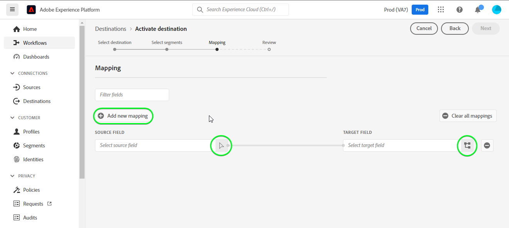

# [!DNL (API) Salesforce Marketing Cloud] connection

## Información general {#overview}

[[!DNL Salesforce Marketing Cloud]](https://www.salesforce.com/products/marketing-cloud/overview/) (anteriormente conocido como [!DNL ExactTarget]) es un grupo de marketing digital que le permite crear y personalizar recorridos para que los visitantes y clientes personalicen su experiencia.

>[!IMPORTANT]
>
>Tenga en cuenta la diferencia entre esta conexión y la otra [[!DNL Salesforce Marketing Cloud] connection](/help/destinations/catalog/email-marketing/salesforce-marketing-cloud.md) que existe en la sección catálogo de marketing por correo electrónico . La otra conexión de Marketing Cloud de Salesforce le permite exportar archivos a una ubicación de almacenamiento especificada, mientras que se trata de una conexión de flujo basada en API.

Esta [!DNL Adobe Experience Platform] [destino](/help/destinations/home.md) aprovecha el [!DNL Salesforce Marketing Cloud] [actualizar contactos](https://developer.salesforce.com/docs/marketing/marketing-cloud/guide/updateContacts.html) API, que le permite añadir contactos o actualizar los datos de contacto para sus necesidades comerciales después de activarlos en un nuevo [!DNL Salesforce Marketing Cloud] segmento.

[!DNL Salesforce Marketing Cloud] utiliza OAuth 2 con Credenciales de cliente como mecanismo de autenticación para comunicarse con el [!DNL Salesforce Marketing Cloud] API. Instrucciones para autenticarse en su [!DNL Salesforce Marketing Cloud] más abajo, en la [Autenticar en destino](#authenticate) para obtener más información.

## Casos de uso {#use-cases}

Para ayudarle a comprender mejor cómo y cuándo debe usar la variable [!DNL Salesforce Marketing Cloud] destino, aquí hay un ejemplo de caso de uso que los clientes de Adobe Experience Platform pueden resolver utilizando este destino.

### Enviar correos electrónicos a contactos para campañas de marketing {#use-case-send-emails}

El departamento de ventas de una plataforma de alquiler de viviendas quiere transmitir un correo electrónico de marketing a una audiencia de cliente objetivo. El equipo de marketing de la plataforma puede agregar nuevos contactos o actualizar contactos existentes *(y sus direcciones de correo electrónico)* a través de Adobe Experience Platform, cree segmentos a partir de sus propios datos sin conexión y envíelos a [!DNL Salesforce Marketing Cloud], que se puede utilizar para enviar el correo electrónico de la campaña de marketing.

## Requisitos previos {#prerequisites}

### Requisitos previos en el Experience Platform {#prerequisites-in-experience-platform}

Antes de activar los datos en la variable [!DNL Salesforce Marketing Cloud] destino, debe tener un [esquema](/help/xdm/schema/composition.md), [conjunto de datos](https://experienceleague.adobe.com/docs/platform-learn/tutorials/data-ingestion/create-datasets-and-ingest-data.html?lang=en)y [segmentos](https://experienceleague.adobe.com/docs/platform-learn/tutorials/segments/create-segments.html?lang=en) creado en [!DNL Experience Platform].

### Requisitos previos en [!DNL Salesforce Marketing Cloud] {#prerequisites-destination}

Tenga en cuenta los siguientes requisitos previos para exportar datos de Platform a su [!DNL Salesforce Marketing Cloud] cuenta:

#### Debe tener un [!DNL Salesforce Marketing Cloud] account {#prerequisites-account}

Póngase en contacto con su [!DNL Salesforce Account Executive] para suscribirse al [!DNL Salesforce Marketing Cloud Account Engagement] producto si todavía no lo tiene.

#### Crear campo personalizado en [!DNL Salesforce Marketing Cloud] {#prerequisites-custom-field}

Debe crear un atributo personalizado del tipo `Text Area Long`, que el Experience Platform utilizará para actualizar el estado del segmento en [!DNL Salesforce Marketing Cloud]. En el flujo de trabajo para activar segmentos en el destino, en la variable **[Programación de segmentos](#schedule-segment-export-example)** paso, utilizará el atributo personalizado como **[!UICONTROL ID de asignación]** para cada segmento que active.

Consulte la [!DNL Salesforce Marketing Cloud] documentación para [crear campos personalizados](https://help.salesforce.com/s/articleView?id=mc_cab_create_an_attribute.htm&amp;type=5&amp;language=en_US) si necesita más instrucciones.

>[!IMPORTANT]
>
> Asegúrese de crear el atributo personalizado en la sección `Email Demographics` dentro de su [!DNL Salesforce Marketing Cloud] cuenta.

Consulte la documentación de Adobe Experience Platform para [Grupo de campos de esquema Detalles de pertenencia a segmentos](/help/xdm/field-groups/profile/segmentation.md) si necesita instrucciones sobre los estados de los segmentos.

#### Recopilar credenciales de Salesforce {#gather-credentials}

Tenga en cuenta los elementos siguientes antes de autenticarse en la variable [!DNL Salesforce Marketing Cloud] destino.

| Credencial | Descripción | Ejemplo |
| --- | --- | --- |
| <ul><li>[!DNL Salesforce Marketing Cloud] prefix</li></ul> | Consulte [[!DNL Salesforce Marketing Cloud domain prefix]](https://developer.salesforce.com/docs/marketing/marketing-cloud/guide/your-subdomain-tenant-specific-endpoints.html) para obtener más información. | <ul><li>Si su dominio es el siguiente, necesita el valor resaltado.  <i>`mcq4jrssqdlyc4lph19nnqgzzs84`.login.exacttarget.com</i></li></ul> |
| <ul><li>ID del cliente</li><li>Secreto del cliente</li></ul> | Consulte la [!DNL Salesforce Marketing Cloud] [documentación](https://developer.salesforce.com/docs/marketing/marketing-cloud/guide/access-token-s2s.html) si necesita más instrucciones. | <ul><li>r23kxxxxxxx0z05xxxxxx</li><li>ipxxxxxxxxxxT4xxxxxxxxx</li></ul> |

{style=&quot;table-layout:auto&quot;}

## Límites en [!DNL Salesforce Marketing Cloud] {#limits}

* Salesforce impone ciertos [límites de tasa](https://developer.salesforce.com/docs/marketing/marketing-cloud/guide/rate-limiting.html).
   * Consulte la [!DNL Salesforce Marketing Cloud] [documentación](https://developer.salesforce.com/docs/marketing/marketing-cloud/guide/rate-limiting-errors.html) para abordar los límites probables con los que podría encontrar y reducir los errores durante la ejecución.
   * Consulte la [[!DNL Salesforce Marketing Cloud] Precio de participación](https://www.salesforce.com/editions-pricing/marketing-cloud/email/) a *Descargar el gráfico comparativo de la edición completa* como pdf que detalla los límites impuestos por su plan.
   * La variable [Información general de API](https://developer.salesforce.com/docs/marketing/marketing-cloud/guide/apis-overview.html) detalles de la página límites adicionales.
   * Consulte [here](https://salesforce.stackexchange.com/questions/205898/marketing-cloud-api-limits) para una página que recopila estos detalles.
* El recuento de *campos personalizados permitidos por objeto* varía según su edición de Salesforce.
   * Consulte la [!DNL Salesforce] [documentación](https://help.salesforce.com/s/articleView?id=sf.custom_field_allocations.htm&amp;type=5) para obtener más información.
   * Si ha alcanzado el límite definido para *campos personalizados permitidos por objeto* en [!DNL Salesforce Marketing Cloud] necesitará
      * Elimine los campos personalizados antiguos antes de agregar nuevos campos personalizados en [!DNL Salesforce Marketing Cloud].
      * Actualice o elimine cualquier destino en Platform que utilice estos nombres de campo personalizados antiguos como valor proporcionado para **[!UICONTROL ID de asignación]** durante el [programación de segmentos](#schedule-segment-export-example) paso a paso.

## Identidades compatibles {#supported-identities}

[!DNL Salesforce Marketing Cloud] admite la activación de identidades descritas en la tabla siguiente. Más información sobre [identidades](/help/identity-service/namespaces.md).

| Identidad de Target | Descripción | Consideraciones |
|---|---|---|
| contactKey | [!DNL Salesforce Marketing Cloud] Clave de contacto. Consulte la [!DNL Salesforce Marketing Cloud] [documentación](https://help.salesforce.com/s/articleView?id=sf.mc_cab_contact_builder_best_practices.htm&amp;type=5) si necesita más instrucciones. | Obligatorio |

## Tipo de exportación y frecuencia {#export-type-frequency}

Consulte la tabla siguiente para obtener información sobre el tipo y la frecuencia de exportación de destino.

| Elemento | Tipo | Notas |
---------|----------|---------|
| Tipo de exportación | **[!UICONTROL Basado en perfiles]** | <ul><li>Está exportando todos los miembros de un segmento, junto con los campos de esquema deseados *(por ejemplo: dirección de correo electrónico, número de teléfono, apellidos)*, según la asignación de campos.</li><li> Cada estado de segmento en [!DNL Salesforce Marketing Cloud] se actualiza con el estado del segmento correspondiente de Platform, en función de la variable **[!UICONTROL ID de asignación]** valor proporcionado durante el [programación de segmentos](#schedule-segment-export-example) paso a paso.</li></ul> |
| Frecuencia de exportación | **[!UICONTROL Transmisión]** | Los destinos de flujo continuo son conexiones basadas en API &quot;siempre activadas&quot;. Tan pronto como un perfil se actualiza en el Experience Platform en función de la evaluación de segmentos, el conector envía la actualización descendente a la plataforma de destino. Más información sobre [destinos de flujo continuo](/help/destinations/destination-types.md#streaming-destinations). |

{style=&quot;table-layout:auto&quot;}

## Conectarse al destino {#connect}

>[!IMPORTANT]
>
>Para conectarse al destino, necesita la variable **[!UICONTROL Administrar destinos]** [permiso de control de acceso](/help/access-control/home.md#permissions). Lea el [información general sobre el control de acceso](/help/access-control/ui/overview.md) o póngase en contacto con el administrador del producto para obtener los permisos necesarios.

Para conectarse a este destino, siga los pasos descritos en la sección [tutorial de configuración de destino](../../ui/connect-destination.md). En el flujo de trabajo de configuración de destino, rellene los campos que aparecen en las dos secciones siguientes.

Within **[!UICONTROL Destinos]** > **[!UICONTROL Catálogo]**, busque [!DNL (API) Salesforce Marketing Cloud]. También puede localizarlo en la sección **[!UICONTROL Marketing por correo electrónico]** categoría.

### Autenticar en destino {#authenticate}

Para autenticarse en el destino, rellene los campos obligatorios y seleccione **[!UICONTROL Conectarse al destino]**.

* **[!UICONTROL Subdominio]**: Su [!DNL Salesforce Marketing Cloud] prefijo de dominio. Por ejemplo, si su dominio es *`mcq4jrssqdlyc4lph19nnqgzzs84`.login.exacttarget.com*, necesita el valor resaltado.
* **[!UICONTROL ID de cliente]**: Su [!DNL Salesforce Marketing Cloud] ID de cliente.
* **[!UICONTROL Secreto del cliente]**: Su [!DNL Salesforce Marketing Cloud] Secreto del cliente.

Si los detalles proporcionados son válidos, la interfaz de usuario muestra un **[!UICONTROL Conectado]** con una marca de verificación verde, puede continuar con el siguiente paso.

### Rellenar detalles de destino {#destination-details}

Para configurar los detalles del destino, rellene los campos opcionales y requeridos a continuación. Un asterisco junto a un campo en la interfaz de usuario indica que el campo es obligatorio.

* **[!UICONTROL Nombre]**: Un nombre por el cual reconocerá este destino en el futuro.
* **[!UICONTROL Descripción]**: Descripción que le ayudará a identificar este destino en el futuro.

### Habilitar alertas {#enable-alerts}

Puede activar las alertas para recibir notificaciones sobre el estado del flujo de datos a su destino. Seleccione una alerta de la lista para suscribirse y recibir notificaciones sobre el estado de su flujo de datos. Para obtener más información sobre las alertas, consulte la guía de [suscripción a alertas de destinos mediante la interfaz de usuario](../../ui/alerts.md).

Cuando haya terminado de proporcionar detalles para la conexión de destino, seleccione **[!UICONTROL Siguiente]**.

## Activar segmentos en este destino {#activate}

>[!IMPORTANT]
>
>Para activar los datos, necesita la variable **[!UICONTROL Administrar destinos]**, **[!UICONTROL Activar destinos]**, **[!UICONTROL Ver perfiles]** y **[!UICONTROL Ver segmentos]** [permisos de control de acceso](/help/access-control/home.md#permissions). Lea el [información general sobre el control de acceso](/help/access-control/ui/overview.md) o póngase en contacto con el administrador del producto para obtener los permisos necesarios.

Lectura [Activar perfiles y segmentos en destinos de exportación de segmentos de flujo continuo](/help/destinations/ui/activate-segment-streaming-destinations.md) para obtener instrucciones sobre la activación de segmentos de audiencia en este destino.

### Consideraciones de asignación y ejemplo {#mapping-considerations-example}

Para enviar correctamente los datos de audiencia de Adobe Experience Platform a [!DNL Salesforce Marketing Cloud] destino, debe pasar por el paso de asignación de campos. La asignación consiste en la creación de un vínculo entre los campos de esquema del Modelo de datos de experiencia (XDM) en la cuenta de Platform y sus equivalentes correspondientes desde el destino de destino. Para asignar correctamente los campos XDM a la variable [!DNL Salesforce Marketing Cloud] campos de destino, siga los pasos a continuación.

>[!IMPORTANT]
>
>Aunque los nombres de atributos serían según su [!DNL Salesforce Marketing Cloud] cuenta, las asignaciones para ambas `contactKey` y `personalEmail.address` son obligatorios.

1. En el **[!UICONTROL Asignación]** paso, seleccione **[!UICONTROL Añadir nueva asignación]**. Verá una nueva fila de asignación en la pantalla.
   

1. En el **[!UICONTROL Seleccionar campo de origen]** , seleccione **[!UICONTROL Seleccionar atributos]** categoría y seleccione `contactKey`.
   

1. En el **[!UICONTROL Seleccionar campo de destino]** , seleccione el tipo de campo de destino al que desea asignar el campo de origen.
   * **[!UICONTROL Seleccionar área de nombres de identidad]**: seleccione esta opción para asignar el campo de origen a un área de nombres de identidad de la lista.
      

   * Añada la siguiente asignación entre el esquema de perfil XDM y el [!DNL Salesforce Marketing Cloud] instancia: |Esquema de perfil XDM|[!DNL Salesforce Marketing Cloud] Instancia| Obligatoria| |—|—|—| |`contactKey`|`salesforceContactKey`| Sí |

   * **[!UICONTROL Seleccionar atributos personalizados]**: seleccione esta opción para asignar el campo de origen a un atributo personalizado que defina en la variable **[!UICONTROL Nombre del atributo]** campo . Consulte [!DNL Salesforce Marketing Cloud] [documentación](https://developer.salesforce.com/docs/marketing/marketing-cloud/guide/updateContacts.html) para obtener una lista de los atributos admitidos. Tenga en cuenta también que el destino utiliza la variable [API de REST de definiciones de conjunto de atributos de búsqueda de Salesforce](https://developer.salesforce.com/docs/marketing/marketing-cloud/guide/retrieveAttributeSetDefinitions.html) para recuperar los atributos definidos en Salesforce para sus contactos y específicos de su cuenta.
      

   * Por ejemplo, según los valores que desee actualizar, agregue la siguiente asignación entre el esquema de perfil XDM y el [!DNL Salesforce Marketing Cloud] instancia: |Esquema de perfil XDM|[!DNL Salesforce Marketing Cloud] Instancia| |—|—| |`person.name.firstName`|`Email Demographics.First Name`| |`personalEmail.address`|`Email Addresses.Email Address`|

   * A continuación se muestra un ejemplo con estas asignaciones:
      

### Programar exportación de segmentos y ejemplo {#schedule-segment-export-example}

Al realizar el [Programar exportación de segmentos](/help/destinations/ui/activate-segment-streaming-destinations.md#scheduling) paso, debe asignar manualmente los segmentos de Platform al [atributo personalizado](#prerequisites-custom-field) en Salesforce.

Para ello, seleccione cada segmento e introduzca el atributo personalizado correspondiente de Salesforce en la **[!UICONTROL ID de asignación]** campo .

>[!IMPORTANT]
>
>El valor utilizado para el ID de asignación debe coincidir exactamente con el nombre del atributo personalizado creado dentro de Salesforce en el conjunto de atributos &quot;Información demográfica de correo electrónico&quot;.

A continuación se muestra un ejemplo:

## Validación de la exportación de datos {#exported-data}

Para validar que ha configurado correctamente el destino, siga los pasos a continuación:

1. Select **[!UICONTROL Destinos]** > **[!UICONTROL Examinar]** para navegar a la lista de destinos.
   

1. Seleccione el destino y valide que el estado es **[!UICONTROL enabled]**.
   

1. Cambie a la **[!DNL Activation data]** y, a continuación, seleccione un nombre de segmento.
   

1. Monitorice el resumen del segmento y asegúrese de que el recuento de perfiles corresponde al recuento creado dentro del segmento.
   

1. Inicie sesión en la [[!DNL Salesforce Marketing Cloud]](https://mc.exacttarget.com/) sitio web. A continuación, vaya a la **[!DNL Audience Builder]** > **[!DNL Contact Builder]** > **[!DNL All contacts]** > **[!DNL Email]** y compruebe si se han añadido los perfiles del segmento.
   

1. Para comprobar si se ha actualizado algún perfil, vaya a la **[!UICONTROL Correo electrónico]** y compruebe si se han actualizado los valores de atributo del perfil del segmento. Si se realiza correctamente, puede ver que cada estado de segmento en [!DNL Salesforce Marketing Cloud] se actualizó con el estado del segmento correspondiente de Platform, en función de la variable **[!UICONTROL ID de asignación]** valor proporcionado en la variable [programación de segmentos](#schedule-segment-export-example) paso a paso.
   

## Uso y gobernanza de los datos {#data-usage-governance}

Todo [!DNL Adobe Experience Platform] Los destinos de cumplen las políticas de uso de datos al administrar los datos. Para obtener información detallada sobre cómo [!DNL Adobe Experience Platform] exige el control de datos; consulte [Información general sobre la administración de datos](/help/data-governance/home.md).

## Errores y solución de problemas {#errors-and-troubleshooting}

### Se han encontrado errores desconocidos al insertar eventos en el Marketing Cloud de Salesforce {#unknown-errors}

Al comprobar la ejecución de un flujo de datos, podría encontrar el siguiente mensaje de error: `Unknown errors encountered while pushing events to the destination. Please contact the administrator and try again.`

Para solucionar este error, compruebe que la variable **[!UICONTROL ID de asignación]** que ha proporcionado [!DNL Salesforce Marketing Cloud] para su segmento de Platform es válido y existe dentro de [!DNL Salesforce Marketing Cloud].

## Recursos adicionales {#additional-resources}

* [[!DNL Salesforce Marketing Cloud] API](https://developer.salesforce.com/docs/marketing/marketing-cloud/guide/apis-overview.html)
