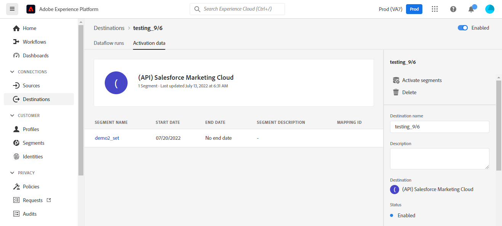
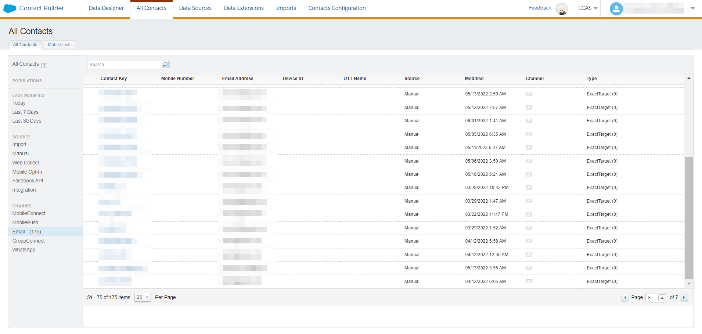

# [!DNL (API) Salesforce Marketing Cloud] connection

## Información general {#overview}

[[!DNL Salesforce Marketing Cloud]](https://www.salesforce.com/products/marketing-cloud/overview/) (anteriormente conocido como ExactTarget) es un grupo de marketing digital que le permite crear y personalizar recorridos para que los visitantes y clientes personalicen su experiencia.

>[!IMPORTANT]
> 
> Tenga en cuenta la diferencia entre esta conexión y la otra [Conexión de Marketing Cloud de Salesforce](https://experienceleague.adobe.com/docs/experience-platform/destinations/catalog/email-marketing/salesforce-marketing-cloud.html?lang=en) que existe en la sección catálogo de marketing por correo electrónico . La otra conexión de Marketing Cloud de Salesforce le permite exportar archivos a una ubicación de almacenamiento especificada, mientras que se trata de una conexión de flujo basada en API.

Esta [!DNL Adobe Experience Platform] [destino](/help/destinations/home.md) aprovecha el [API de REST de contactos de Salesforce Update](https://developer.salesforce.com/docs/marketing/marketing-cloud/guide/updateContacts.html), que le permite agregar contactos o actualizar datos de contacto para sus necesidades comerciales después de activarlos en un nuevo segmento de Salesforce.

El Marketing Cloud de Salesforce utiliza OAuth 2 con Credenciales de cliente como mecanismo de autenticación para comunicarse con la API de REST de Salesforce. Las instrucciones para autenticarse en su instancia de Salesforce se detallan a continuación, en la sección [Autenticar en destino](#authenticate) para obtener más información.

## Casos de uso {#use-cases}

Para ayudarle a comprender mejor cómo y cuándo debe utilizar el destino de Marketing Cloud de Salesforce, aquí tiene un caso de uso de muestra que los clientes de Adobe Experience Platform pueden resolver utilizando este destino.

### Enviar correos electrónicos a contactos para campañas de marketing {#use-case-send-emails}

El departamento de ventas de una plataforma de alquiler de viviendas quiere transmitir un correo electrónico de marketing a una audiencia de cliente objetivo. El equipo de marketing de la plataforma puede agregar nuevos contactos o actualizar contactos existentes *(y sus direcciones de correo electrónico)* a través de Adobe Experience Platform, genere segmentos a partir de sus propios datos sin conexión y envíelos a Salesforce Marketing Cloud, que puede utilizarse para enviar el correo electrónico de la campaña de marketing.

## Requisitos previos {#prerequisites}

### Requisitos previos en el Experience Platform {#prerequisites-in-experience-platform}

Antes de activar los datos en el destino de Marketing Cloud de Salesforce, debe tener una [esquema](/help/xdm/schema/composition.md), [conjunto de datos](https://experienceleague.adobe.com/docs/platform-learn/tutorials/data-ingestion/create-datasets-and-ingest-data.html?lang=en)y [segmentos](https://experienceleague.adobe.com/docs/platform-learn/tutorials/segments/create-segments.html?lang=en) creado en [!DNL Experience Platform].

### Requisitos previos de Salesforce CRM {#prerequisites-destination}

Tenga en cuenta los siguientes requisitos previos de Salesforce para exportar datos de Platform a su cuenta de Marketing Cloud de Salesforce:

#### Necesita una cuenta de Salesforce {#prerequisites-account}

Vaya a Salesforce [prueba](https://www.salesforce.com/in/form/signup/freetrial-sales/) para registrar y crear una cuenta de Salesforce, si todavía no la tiene.

#### Crear campo personalizado en Salesforce {#prerequisites-custom-field}

Cree el atributo personalizado de tipo `Text Area Long` qué Experience Platform utilizará para actualizar el estado del segmento dentro del Marketing Cloud de Salesforce.

Consulte la documentación del Marketing Cloud de Salesforce para [crear campos personalizados](https://help.salesforce.com/s/articleView?id=mc_cab_create_an_attribute.htm&amp;type=5&amp;language=en_US) si necesita más instrucciones.

>[!IMPORTANT]
>
> Asegúrese de crear el atributo personalizado en el conjunto de atributos &quot;Información demográfica de correo electrónico&quot; dentro de la cuenta de Marketing Cloud de Salesforce.

>[!NOTE]
>
> * El número de atributos personalizados permitidos por objeto varía según la edición de Salesforce. Consulte la documentación de Salesforce para [campos personalizados permitidos por objeto](https://help.salesforce.com/s/articleView?id=sf.custom_field_allocations.htm&amp;type=5) si necesita más instrucciones.
> * Si ha alcanzado este límite en Salesforce, deberá eliminar el atributo personalizado de Salesforce que se utilizó para almacenar el estado del segmento en segmentos antiguos dentro de Experience Platform antes de poder usar un nuevo mappingId.

Consulte la documentación de Adobe Experience Platform para [Grupo de campos de esquema Detalles de pertenencia a segmentos](/help/xdm/field-groups/profile/segmentation.md) si necesita instrucciones sobre los estados de los segmentos.

#### Recopilar credenciales de Salesforce {#gather-credentials}

Anote los elementos siguientes antes de autenticarse en el destino de Marketing Cloud de Salesforce.

| Credencial | Descripción | Ejemplo |
| --- | --- | --- |
| <ul><li>Prefijo de Marketing Cloud de Salesforce</li></ul> | Consulte [Prefijo de dominio de Marketing Cloud de Salesforce](https://help.salesforce.com/s/articleView?id=sf.domain_name_setting_login_policy.htm&amp;type=5) para obtener más información. | <ul><li>Si su dominio es el siguiente, necesita el valor resaltado.  <i>`mcq4jrssqdlyc4lph19nnqgzzs84`.login.exacttarget.com</i></li></ul> |
| <ul><li>ID del cliente</li><li>Secreto del cliente</li></ul> | Consulte la [Documentación de Salesforce](https://developer.salesforce.com/docs/marketing/marketing-cloud/guide/access-token-s2s.html) si necesita más instrucciones. | <ul><li>r23kxxxxxxx0z05xxxxxx</li><li>ipxxxxxxxxxxT4xxxxxxxxx</li></ul> |

## Identidades compatibles {#supported-identities}

El Marketing Cloud de Salesforce admite la activación de identidades descritas en la tabla siguiente. Más información sobre [identidades](/help/identity-service/namespaces.md).

| Identidad de Target | Descripción | Consideraciones |
|---|---|---|
| contactKey | Clave de contacto de Salesforce. Consulte la [Documentación de Salesforce](https://help.salesforce.com/s/articleView?id=sf.mc_cab_contact_builder_best_practices.htm&amp;type=5) si necesita más instrucciones. | Obligatorio |

## Tipo de exportación y frecuencia {#export-type-frequency}

Consulte la tabla siguiente para obtener información sobre el tipo y la frecuencia de exportación de destino.

| Elemento | Tipo | Notas |
---------|----------|---------|
| Tipo de exportación | **[!UICONTROL Basado en perfiles]** | Está exportando todos los miembros de un segmento, junto con los campos de esquema deseados (por ejemplo: dirección de correo electrónico, número de teléfono, apellidos), tal como se elige en la pantalla seleccionar atributos de perfil del [flujo de trabajo de activación de destino](/help/destinations/ui/activate-batch-profile-destinations.md#select-attributes). |
| Frecuencia de exportación | **[!UICONTROL Transmisión]** | Los destinos de flujo continuo son conexiones basadas en API &quot;siempre activadas&quot;. Tan pronto como un perfil se actualiza en el Experience Platform en función de la evaluación de segmentos, el conector envía la actualización descendente a la plataforma de destino. Más información sobre [destinos de flujo continuo](/help/destinations/destination-types.md#streaming-destinations). |

{style=&quot;table-layout:auto&quot;}

## Conectarse al destino {#connect}

>[!IMPORTANT]
> 
>Para conectarse al destino, necesita la variable **[!UICONTROL Administrar destinos]** [permiso de control de acceso](/help/access-control/home.md#permissions). Lea el [información general sobre el control de acceso](/help/access-control/ui/overview.md) o póngase en contacto con el administrador del producto para obtener los permisos necesarios.

Para conectarse a este destino, siga los pasos descritos en la sección [tutorial de configuración de destino](../../ui/connect-destination.md). En el flujo de trabajo de configuración de destino, rellene los campos que aparecen en las dos secciones siguientes.

### Autenticar en destino {#authenticate}

Para autenticarse en el destino, rellene los campos obligatorios y seleccione **[!UICONTROL Conectarse al destino]**.

* **[!UICONTROL Subdominio]**: El prefijo del dominio de Marketing Cloud de Salesforce. Por ejemplo, si su dominio es *`mcq4jrssqdlyc4lph19nnqgzzs84`.login.exacttarget.com*, necesita el valor resaltado.
* **[!UICONTROL ID de cliente]**: Su ID de cliente de Salesforce.
* **[!UICONTROL Secreto del cliente]**: El Secreto Del Cliente De Salesforce.

Si los detalles proporcionados son válidos, la interfaz de usuario muestra un **Conectado** con una marca de verificación verde, puede continuar con el siguiente paso.

### Rellenar detalles de destino {#destination-details}

Para configurar los detalles del destino, rellene los campos opcionales y requeridos a continuación. Un asterisco junto a un campo en la interfaz de usuario indica que el campo es obligatorio.

* **[!UICONTROL Nombre]**: Un nombre por el cual reconocerá este destino en el futuro.
* **[!UICONTROL Descripción]**: Descripción que le ayudará a identificar este destino en el futuro.
* **[!UICONTROL Nombre del cliente]**: Puede ser cualquier valor, aunque un valor es obligatorio. De lo contrario, la activación del destino fallará.

### Habilitar alertas {#enable-alerts}

Puede activar las alertas para recibir notificaciones sobre el estado del flujo de datos a su destino. Seleccione una alerta de la lista para suscribirse y recibir notificaciones sobre el estado de su flujo de datos. Para obtener más información sobre las alertas, consulte la guía de [suscripción a alertas de destinos mediante la interfaz de usuario](../../ui/alerts.md).

Cuando haya terminado de proporcionar detalles para la conexión de destino, seleccione **[!UICONTROL Siguiente]**.

## Activar segmentos en este destino {#activate}

>[!IMPORTANT]
> 
>Para activar los datos, necesita la variable **[!UICONTROL Administrar destinos]**, **[!UICONTROL Activar destinos]**, **[!UICONTROL Ver perfiles]** y **[!UICONTROL Ver segmentos]** [permisos de control de acceso](/help/access-control/home.md#permissions). Lea el [información general sobre el control de acceso](/help/access-control/ui/overview.md) o póngase en contacto con el administrador del producto para obtener los permisos necesarios.

Lectura [Activar perfiles y segmentos en destinos de exportación de segmentos de flujo continuo](/help/destinations/ui/activate-segment-streaming-destinations.md) para obtener instrucciones sobre la activación de segmentos de audiencia en este destino.

### Consideraciones de asignación y ejemplo {#mapping-considerations-example}

Para enviar correctamente los datos de audiencia de Adobe Experience Platform al destino de Marketing Cloud de Salesforce, debe pasar por el paso de asignación de campos. La asignación consiste en la creación de un vínculo entre los campos de esquema del Modelo de datos de experiencia (XDM) en la cuenta de Platform y sus equivalentes correspondientes desde el destino de destino. Para asignar correctamente los campos XDM a los campos de destino de Marketing Cloud de Salesforce, siga estos pasos:

La lista de asignaciones de atributos que se pueden configurar para la variable [API de REST de Salesforce](https://developer.salesforce.com/docs/atlas.en-us.api_rest.meta/api_rest/dome_composite_upsert_example.htm?q=contacts) a continuación. El destino utiliza la variable [API de REST de definiciones de conjunto de atributos de búsqueda de Salesforce](https://developer.salesforce.com/docs/marketing/marketing-cloud/guide/retrieveAttributeSetDefinitions.html) para recuperar los atributos definidos en Salesforce para sus contactos y específicos de su cuenta.

>[!IMPORTANT]
> 
> Aunque los nombres de atributos serían según su cuenta de Salesforce, las asignaciones para `contactKey` y `personalEmail.address` son obligatorios.

1. En el paso Asignación , haga clic en **[!UICONTROL Añadir nueva asignación]**, verá una nueva fila de asignación en la pantalla .
   

1. En la ventana seleccionar campo de origen, al seleccionar el campo de origen, elija la opción **[!UICONTROL Seleccionar atributos]** y añada las asignaciones que desee.
   

1. En la ventana select target field , seleccione el campo target y elija la **[!UICONTROL Seleccionar área de nombres de identidad]** y añada las asignaciones que desee.
   

1. Para asignar cualquier atributo personalizado, seleccione la ventana de campo de destino, seleccione el campo de destino y elija la opción **[!UICONTROL Seleccionar atributos]** > **Información demográfica del correo electrónico** categoría. A continuación, proporcione el nombre de atributo de destino deseado y añada las asignaciones deseadas.
   

1. Por ejemplo, puede añadir la siguiente asignación entre el esquema de perfil XDM y el [!DNL Salesforce Marketing Cloud] instancia:

   |  | Esquema de perfil XDM | [!DNL Salesforce Marketing Cloud] Instancia | Obligatorio |
   |---|---|---|---|
   | Atributos | <ul><li>person.name.firstName</code></li><li>personalEmail.address</code></li></ul> | <ul><li>Información demográfica de correo electrónico.Nombre</code></li><li>Direcciones de correo electrónico.Dirección de correo electrónico</code></li></ul> | <ul><li>-</li><li>Sí</code></li></ul> |
   | Identidades | <ul><li>contactKey</code></li></ul> | <ul><li>salesforceContactKey</code></li></ul> | Sí |

1. A continuación se muestra un ejemplo con estas asignaciones:
   

### Programar exportación de segmentos y ejemplo {#schedule-segment-export-example}

Al realizar el [Programar exportación de segmentos](/help/destinations/ui/activate-segment-streaming-destinations.md#scheduling) debe asignar manualmente los segmentos de Platform al atributo personalizado en Salesforce.

Para ello, seleccione cada segmento e introduzca el atributo personalizado correspondiente de Salesforce en la **[!UICONTROL ID de asignación]** campo .

>[!IMPORTANT]
>
> El valor utilizado para el ID de asignación debe coincidir exactamente con el nombre del atributo personalizado creado dentro de Salesforce en el conjunto de atributos &quot;Información demográfica de correo electrónico&quot;.

A continuación se muestra un ejemplo:

## Validación de la exportación de datos {#exported-data}

Para validar que ha configurado correctamente el destino, siga los pasos a continuación:

1. Select **[!UICONTROL Destinos]** > **[!UICONTROL Examinar]** para navegar a la lista de destinos.

   

1. Seleccione el destino y valide que el estado es **[!UICONTROL enabled]**.

   

1. Cambie a la **[!DNL Activation data]** y, a continuación, seleccione un nombre de segmento.

   

1. Monitorice el resumen del segmento y asegúrese de que el recuento de perfiles corresponde al recuento creado dentro del segmento.

   

1. Inicie sesión en el sitio web de Marketing Cloud de Salesforce. A continuación, vaya a la **[!DNL Audience Builder]** > **[!DNL Contact Builder]** > **[!DNL All contacts]** > **[!DNL Email]** y compruebe si se han añadido los perfiles del segmento.

   

1. Para comprobar si se ha actualizado algún perfil, vaya a la **[!DNL Email]** compruebe si se han actualizado los valores de atributo del perfil del segmento.

   

## Uso y gobernanza de los datos {#data-usage-governance}

Todo [!DNL Adobe Experience Platform] Los destinos de cumplen las políticas de uso de datos al administrar los datos. Para obtener información detallada sobre cómo [!DNL Adobe Experience Platform] exige el control de datos; consulte [Información general sobre la administración de datos](/help/data-governance/home.md).

## Errores y solución de problemas {#errors-and-troubleshooting}

### Se han encontrado errores desconocidos al insertar eventos en el Marketing Cloud de Salesforce {#unknown-errors}

Cuando compruebe que se ejecute un flujo de datos, si ve el siguiente mensaje de error, compruebe que el ID de asignación que ha proporcionado en [!DNL Salesforce CRM] para su segmento de Platform es válido y existe dentro de [!DNL Salesforce CRM].

## Recursos adicionales {#additional-resources}

* [Portal para desarrolladores de Salesforce](https://developer.salesforce.com/)

### Límites {#limits}

* Salesforce impone ciertos [límites de tasa](https://developer.salesforce.com/docs/marketing/marketing-cloud/guide/rate-limiting.html).
* Consulte la [errores de límites de tasa](https://developer.salesforce.com/docs/marketing/marketing-cloud/guide/rate-limiting-errors.html) para comprobar los errores que pueda encontrar.
* Consulte la [Precio de participación de Marketing Cloud de Salesforce](https://www.salesforce.com/editions-pricing/marketing-cloud/email/) a *Descargar el gráfico comparativo de la edición completa* como pdf que detalla los límites impuestos por su plan.
* La variable [Información general de API](https://developer.salesforce.com/docs/marketing/marketing-cloud/guide/apis-overview.html) detalles de la página límites adicionales.
* Hay disponible un elemento KB que recopila estos detalles [here](https://salesforce.stackexchange.com/questions/205898/marketing-cloud-api-limits#:~:text=Day%2FHour%2FMinute%20Limit&amp;text=We%20recommend%20a%20limit%20of,per%20minute%20for%20SOAP%20calls.&amp;text=As%20has%20been%20added%20in,interactuando%20with%20the%20REST%2DAPI).

