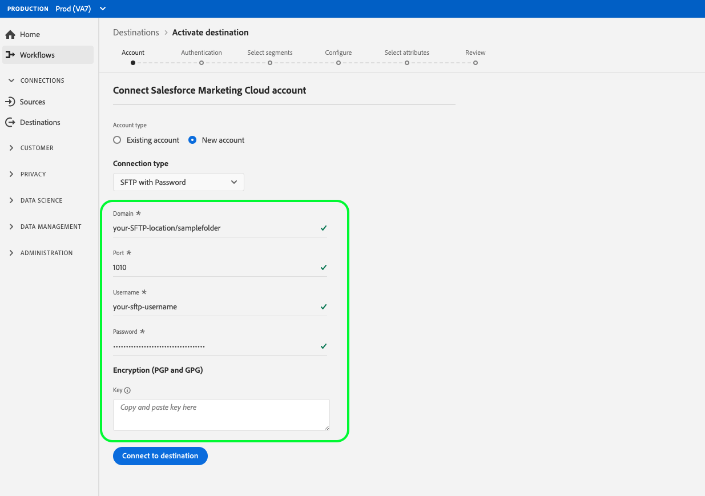

# [!DNL Salesforce Marketing Cloud]

## Información general

[[!DNL Salesforce Marketing Cloud]](https://www.salesforce.com/products/marketing-cloud/email-marketing/) es un grupo de marketing digital anteriormente conocido como ExactTarget que le permite crear y personalizar viajes para que los visitantes y clientes puedan personalizar su experiencia.

Para enviar datos de segmentos a [!DNL Salesforce Marketing Cloud], primero debe [conectar el destino](#connect-destination) en CDP en tiempo real y luego [configurar una importación](#import-data-into-salesforce) de datos desde la ubicación de almacenamiento a [!DNL Salesforce Marketing Cloud].

## Tipo de exportación {#export-type}

**Basado** en perfiles: está exportando todos los miembros de un segmento, junto con los campos de esquema deseados (por ejemplo: dirección de correo electrónico, número de teléfono, apellidos), tal como se elige en la pantalla de selección de atributos del flujo de trabajo [de activación de](../../ui/activate-destinations.md#select-attributes)destino.

## Destino de Connect {#connect-destination}

En **[!UICONTROL Conexiones]** > **[!UICONTROL Destinos]**, seleccione [!DNL Salesforce Marketing Cloud]y, a continuación, seleccione Destino **[!UICONTROL de]** Connect.

En el paso **[!UICONTROL Autenticación]** , si previamente ha configurado una conexión con el destino de almacenamiento de nube, seleccione Cuenta **** existente y seleccione una de las conexiones existentes. O bien, puede seleccionar **[!UICONTROL Nueva cuenta]** para configurar una nueva conexión. Rellene las credenciales de autenticación de cuenta y seleccione **[!UICONTROL Conectar con destino]**. Por [!DNL Salesforce Marketing Cloud], puede seleccionar entre **[!UICONTROL SFTP con contraseña]** y **[!UICONTROL SFTP con clave]** SSH. Rellene la información siguiente, según el tipo de conexión, y seleccione **[!UICONTROL Conectar con destino]**.

Para **[!UICONTROL SFTP con conexiones de contraseña]** , debe proporcionar Dominio, Puerto, Nombre de usuario y Contraseña.

Para **[!UICONTROL SFTP con conexiones SSH Key]** , debe proporcionar Dominio, Puerto, Nombre de usuario y Clave SSH.

En el paso **[!UICONTROL Configuración]** , rellene la información relevante para su destino como se muestra a continuación:
- **[!UICONTROL Nombre]**: Elija un nombre relevante para el destino.
- **[!UICONTROL Descripción]**: Escriba una descripción para el destino.
- **[!UICONTROL Ruta]** de carpeta: Proporcione la ruta en la ubicación del almacenamiento donde CDP en tiempo real depositará sus datos de exportación como archivos CSV o separados por tabuladores.
- **[!UICONTROL Formato]** de archivo: **[!UICONTROL CSV]** o **[!UICONTROL TAB_DELIMITED]**. Seleccione el formato de archivo que desea exportar a la ubicación de almacenamiento.

Haga clic en **[!UICONTROL Crear destino]** después de rellenar los campos anteriores. El destino ya está conectado y puede [activar segmentos](../../ui/activate-destinations.md) en el destino.

## Activar segmentos {#activate-segments}

Consulte [Activar perfiles y segmentos en un destino](../../ui/activate-destinations.md) para obtener información sobre el flujo de trabajo de activación de segmentos.

## Atributos de destino {#destination-attributes}

Al [activar segmentos](../../ui/activate-destinations.md) en el [!DNL Salesforce Marketing Cloud] destino, le recomendamos que seleccione un identificador único en el esquema [de](../../../profile/home.md#profile-fragments-and-union-schemas)unión. Seleccione el identificador único y cualquier otro campo XDM que desee exportar al destino. Para obtener más información, consulte [Selección de los campos de esquema que se utilizarán como atributos de destino en los archivos](./overview.md#destination-attributes) exportados en Destinos de marketing por correo electrónico.

## Datos exportados {#exported-data}

Para [!DNL Salesforce Marketing Cloud] los destinos, CDP en tiempo real crea un archivo delimitado por tabuladores `.txt` o `.csv` en la ubicación de almacenamiento proporcionada. Para obtener más información sobre los archivos, consulte Destinos de [correo electrónico de Marketing y Destinos](../../ui/activate-destinations.md#esp-and-cloud-storage) de almacenamiento de Cloud en el tutorial de activación de segmentos.

## Configurar la importación de datos en [!DNL Salesforce Marketing Cloud] {#import-data-into-salesforce}

Después de conectar CDP en tiempo real con su almacenamiento [!DNL Amazon S3] o SFTP, debe configurar la importación de datos desde la ubicación del almacenamiento a [!DNL Salesforce Marketing Cloud]. Para obtener más información sobre cómo realizar esto, consulte [Importación de suscriptores en Marketing Cloud desde un archivo](https://help.salesforce.com/articleView?id=mc_es_import_subscribers_from_file.htm&amp;type=5) en el [!DNL Salesforce Help Center].