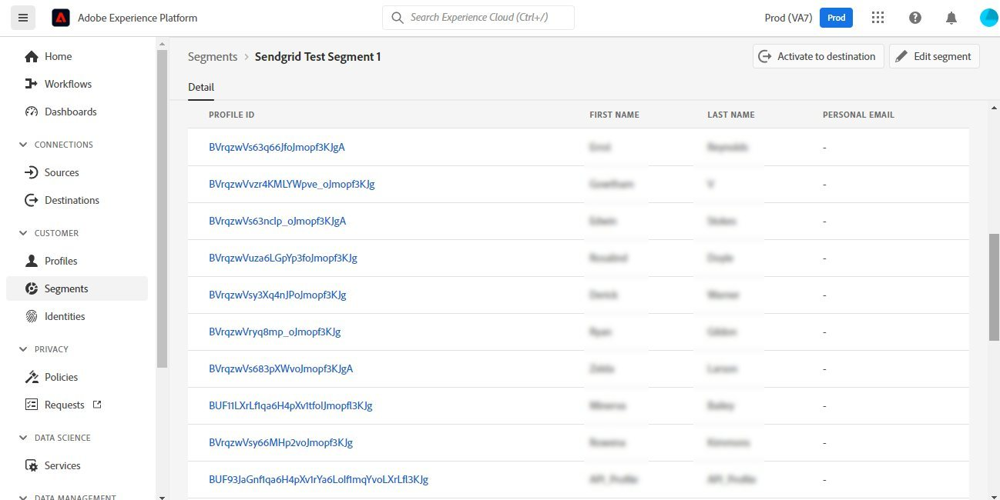
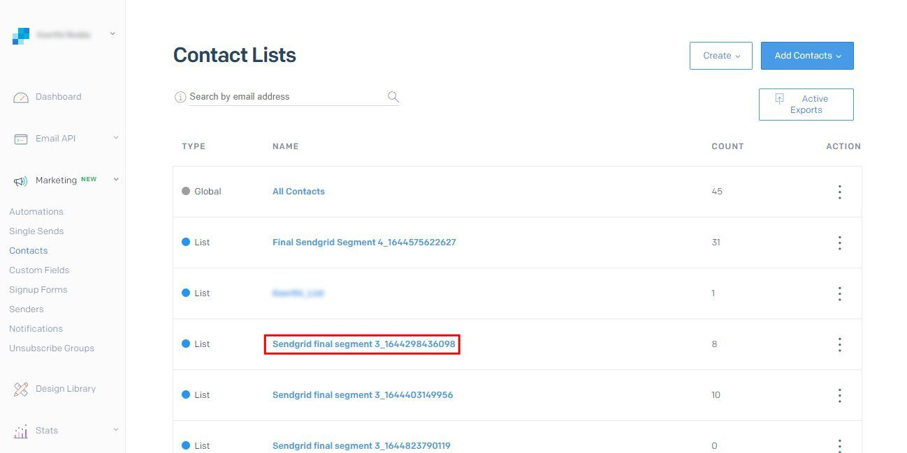

# [!DNL SendGrid] conexión

## Información general {#overview}

[SendGrid](https://www.sendgrid.com) es una plataforma de comunicación popular entre los clientes para correos electrónicos transaccionales y de marketing.

Esta [!DNL Adobe Experience Platform] [destino](/help/destinations/home.md) aprovecha el [[!DNL SendGrid Marketing Contacts API]](https://api.sendgrid.com/v3/marketing/contacts), que le permite exportar perfiles de correo electrónico de origen y activarlos dentro de una nueva audiencia de SendGrid para sus necesidades comerciales.

SendGrid utiliza tokens de portador de API como mecanismo de autenticación para comunicarse con la API SendGrid.

## Requisitos previos {#prerequisites}

Se requieren los siguientes elementos antes de comenzar a configurar el destino.

1. Necesita tener una cuenta de SendGrid.
   * Ir a SendGrid [registro](https://signup.sendgrid.com/) página para registrarse y crear una cuenta de SendGrid, si todavía no la tiene.
1. Después de iniciar sesión en el portal SendGrid, también debe generar un token de API.
1. Vaya al sitio web de SendGrid y acceda al **[!DNL Settings]** > **[!DNL API Keys]** página. También puede consultar la [Documentación de SendGrid](https://app.sendgrid.com/settings/api_keys) para acceder a la sección adecuada en la aplicación SendGrid.
1. Finalmente, seleccione la **[!DNL Create API Key]** botón.
   * Consulte la [Documentación de SendGrid](https://docs.sendgrid.com/ui/account-and-settings/api-keys#creating-an-api-key), si necesita orientación sobre qué acciones realizar.
   * Si desea generar su clave de API mediante programación, consulte la [Documentación de SendGrid](https://docs.sendgrid.com/api-reference/api-keys/create-api-keys).

Antes de activar datos en el destino SendGrid, debe tener un [esquema](https://experienceleague.adobe.com/docs/experience-platform/xdm/schema/composition.html?lang=es), a [conjunto de datos](https://experienceleague.adobe.com/docs/platform-learn/tutorials/data-ingestion/create-datasets-and-ingest-data.html?lang=es), y [segmentos](https://experienceleague.adobe.com/docs/platform-learn/tutorials/segments/create-segments.html) creado en [!DNL Experience Platform]. Consulte también la [límites](#limits) más abajo en esta página.

>[!IMPORTANT]
>
>* La API SendGrid utilizada para crear la lista de correo a partir de perfiles de correo electrónico requiere que se proporcionen direcciones de correo electrónico únicas dentro de cada perfil. Esto ocurre independientemente de si se utiliza como valor para *email* o *correo electrónico alternativo*. Dado que la conexión SendGrid admite asignaciones tanto para valores de correo electrónico como para valores de correo electrónico alternativos, asegúrese de que todas las direcciones de correo electrónico utilizadas deban ser únicas dentro de cada perfil del *Conjunto de datos*. De lo contrario, cuando los perfiles de correo electrónico se envíen a SendGrid, el resultado será un error y el perfil de correo electrónico no estará presente en la exportación de datos.
>
>* Actualmente, no hay ninguna funcionalidad para quitar perfiles de SendGrid cuando se eliminan de audiencias en Experience Platform.

## Identidades admitidas {#supported-identities}

SendGrid admite la activación de identidades descritas en la tabla siguiente. Más información sobre [identidades](/help/identity-service/features/namespaces.md).

| Identidad de destino | Descripción | Consideraciones |
|---|---|---|
| email | Correo electrónico | Tenga en cuenta que las direcciones de correo electrónico con hash SHA256 y texto sin formato son compatibles con [!DNL Adobe Experience Platform]. Si el campo Origen de Experience Platform contiene atributos sin hash, consulte la **[!UICONTROL Aplicar transformación]** opción, para tener [!DNL Platform] hash automático de los datos en la activación.   Tenga en cuenta que **SendGrid** no admite direcciones de correo electrónico con hash, por lo que solo se envían al destino datos de texto sin transformación. |

{style="table-layout:auto"}

## Tipo y frecuencia de exportación {#export-type-frequency}

Consulte la tabla siguiente para obtener información sobre el tipo y la frecuencia de exportación de destino.

| Elemento | Tipo | Notas |
---------|----------|---------|
| Tipo de exportación | **[!UICONTROL Basado en perfiles]** | Va a exportar todos los miembros de un segmento, junto con los campos de esquema deseados (por ejemplo: dirección de correo electrónico, número de teléfono, apellidos), tal como se elige en la pantalla seleccionar atributos de perfil del [flujo de trabajo de activación de destino](/help/destinations/ui/activate-batch-profile-destinations.md#select-attributes). |
| Frecuencia de exportación | **[!UICONTROL Transmisión]** | Los destinos de streaming son conexiones basadas en API &quot;siempre activadas&quot;. Tan pronto como se actualiza un perfil en Experience Platform según la evaluación de audiencias, el conector envía la actualización de forma descendente a la plataforma de destino. Más información sobre [destinos de streaming](/help/destinations/destination-types.md#streaming-destinations). |

{style="table-layout:auto"}

## Casos de uso {#use-cases}

Para ayudarle a comprender mejor cómo y cuándo debe utilizar el destino SendGrid, aquí hay ejemplos de casos de uso que [!DNL Experience Platform] Los clientes de pueden resolver utilizando este destino.

### Creación de una lista de marketing para varias actividades de marketing

Los equipos de marketing que utilizan SendGrid pueden crear una lista de correo dentro de SendGrid y rellenarla con direcciones de correo electrónico. La lista de correo ahora creada en SendGrid se puede utilizar posteriormente para varias actividades de marketing.

## Conectar con destino {#connect}

>[!IMPORTANT]
> 
>Para conectarse al destino, necesita el **[!UICONTROL Ver destinos]** y **[!UICONTROL Administrar destinos]** [permisos de control de acceso](/help/access-control/home.md#permissions). Lea el [información general de control de acceso](/help/access-control/ui/overview.md) o póngase en contacto con el administrador del producto para obtener los permisos necesarios.

Para conectarse a este destino, siga los pasos descritos en la sección [tutorial de configuración de destino](../../ui/connect-destination.md). En el flujo de trabajo de configuración de destino, rellene los campos enumerados en las dos secciones siguientes.

### Autenticarse en el destino {#authenticate}

1. Dentro de [!DNL Adobe Experience Platform] consola, vaya a **Destinos**.

1. Seleccione el **Catálogo** pestaña y busque *SendGrid*. A continuación seleccione **Configuración de**. Después de establecer una conexión con el destino, la etiqueta de la interfaz de usuario cambia a **Activar segmentos**.
   

1. Se le mostrará un asistente que le ayudará a configurar el destino de SendGrid. Cree el nuevo destino seleccionando **Configurar nuevo destino**.
   

1. Seleccione el **Nueva cuenta** y rellene el campo **Token de portador** valor. Este valor es SendGrid *Clave de API* anteriormente mencionado en la [sección de requisitos previos](#prerequisites).
   

1. Seleccionar **Conectar con destino**. Si la propiedad SendGrid *Clave de API* Si el valor proporcionado es válido, la interfaz de usuario muestra un **Conectado** estado con una marca de verificación verde, puede continuar con el siguiente paso para rellenar campos de información adicional.

### Rellenar detalles de destino {#destination-details}

While [configuración](https://experienceleague.adobe.com/docs/experience-platform/destinations/ui/connect-destination.html) Para este destino, debe proporcionar la siguiente información:

* **[!UICONTROL Nombre]**: Nombre con el que reconocerá este destino en el futuro.
* **[!UICONTROL Descripción]**: una descripción opcional que le ayudará a identificar este destino en el futuro.

### Habilitar alertas {#enable-alerts}

Puede activar alertas para recibir notificaciones sobre el estado del flujo de datos a su destino. Seleccione una alerta de la lista a la que suscribirse para recibir notificaciones sobre el estado del flujo de datos. Para obtener más información sobre las alertas, consulte la guía de [suscripción a alertas de destinos mediante la IU](../../ui/alerts.md).

Cuando haya terminado de proporcionar detalles para la conexión de destino, seleccione **[!UICONTROL Siguiente]**.

## Activar públicos en este destino {#activate}

>[!IMPORTANT]
> 
>* Para activar los datos, necesita el **[!UICONTROL Ver destinos]**, **[!UICONTROL Activar destinos]**, **[!UICONTROL Ver perfiles]**, y **[!UICONTROL Ver segmentos]** [permisos de control de acceso](/help/access-control/home.md#permissions). Lea el [información general de control de acceso](/help/access-control/ui/overview.md) o póngase en contacto con el administrador del producto para obtener los permisos necesarios.
>* Para exportar *identidades*, necesita el **[!UICONTROL Ver gráfico de identidad]** [permiso de control de acceso](/help/access-control/home.md#permissions).   {width="100" zoomable="yes"}

Leer [Activación de perfiles y audiencias en destinos de exportación de audiencia de streaming](/help/destinations/ui/activate-segment-streaming-destinations.md) para obtener instrucciones sobre cómo activar audiencias en este destino.

Consulte las siguientes imágenes para obtener detalles específicos sobre este destino.

1. Seleccione una o varias audiencias para exportarlas a SendGrid.
   

1. En el **[!UICONTROL Asignación]** paso, después de seleccionar **[!UICONTROL Añadir nueva asignación]** A continuación, se muestra la página de asignación para asignar los campos XDM de origen a los campos de destino de la API SendGrid. Las siguientes imágenes muestran cómo asignar áreas de nombres de identidad entre Experience Platform y SendGrid. Asegúrese de que **[!UICONTROL Campo de origen]** *Correo electrónico* debe asignarse al **[!UICONTROL Campo de destino]** *external_id* como se muestra a continuación.
   
   
   
   

1. Del mismo modo, asigne los [!DNL Adobe Experience Platform] atributos que desea exportar al destino SendGrid.
   
   

1. Después de completar las asignaciones, seleccione **[!UICONTROL Siguiente]** para avanzar a la pantalla de revisión.
   

1. Seleccionar **[!UICONTROL Finalizar]** para completar la configuración.
   

La lista completa de asignaciones de atributos admitidas que se pueden configurar para la variable [Contactos de marketing de SendGrid > Agregar o actualizar API de contacto](https://docs.sendgrid.com/api-reference/contacts/add-or-update-a-contact) es inferior a.

| Campo de origen | Campo de destino | Tipo | Descripción | Límites |
|---|---|---|---|---|
| xdm:  homeAddress.street1 | xdm:  address_line_1 | Cadena | La primera línea de la dirección. | Longitud máxima:  100 caracteres |
| xdm:  homeAddress.street2 | xdm:  address_line_2 | Cadena | Una segunda línea opcional para la dirección. | Longitud máxima:  100 caracteres |
| xdm:  _extconndev.alternate_emails | xdm:  alternate_emails | Matriz de cadena | Correos electrónicos adicionales asociados con el contacto. | <ul><li>Máx.: 5 elementos</li><li>Mín.: 0 elementos</li></ul> |
| xdm:  homeAddress.city | xdm:  ciudad | Cadena | La ciudad del contacto. | Longitud máxima:  60 caracteres |
| xdm:  homeAddress.country | xdm:  país | Cadena | El país del contacto. Puede ser un nombre completo o una abreviatura. | Longitud máxima:  50 caracteres |
| identityMap:  Correo electrónico | Identidad:  external_id | Cadena | Correo electrónico principal del contacto. Debe ser un correo electrónico válido. | Longitud máxima:  254 caracteres |
| xdm:  person.name.firstName | xdm:  first_name | Cadena | El nombre del contacto | Longitud máxima:  50 caracteres |
| xdm:  person.name.lastName | xdm:  last_name | Cadena | El apellido del contacto | Longitud máxima:  50 caracteres |
| xdm:  homeAddress.postalCode | xdm:  postal_code | Cadena | El código postal del contacto u otro código postal. | |
| xdm:  homeAddress.stateProvince | xdm:  state_Province_region | Cadena | El estado, la provincia o la región del contacto. | Longitud máxima:  50 caracteres |

## Validar la exportación de datos en SendGrid {#validate}

Para comprobar que ha configurado correctamente el destino, siga los pasos a continuación:

1. Seleccionar **[!UICONTROL Destinos]** > **[!UICONTROL Examinar]** para ir a la lista de destinos.
   

1. Seleccione el destino y valide que el estado es **[!UICONTROL activado]**.
   

1. Cambie a la **[!DNL Activation data]** y, a continuación, seleccione un nombre de audiencia.
   

1. Monitorice el resumen de audiencia y compruebe que el recuento de perfiles corresponde al recuento creado dentro del conjunto de datos.
   

1. El [Listas de marketing de SendGrid > Crear lista API](https://docs.sendgrid.com/api-reference/lists/create-list) se utiliza para crear listas de contactos únicas dentro de SendGrid uniendo el valor del *list_name* y la marca de tiempo de la exportación de datos. Vaya al sitio SendGrid y compruebe si se ha creado la nueva lista de contactos que se ajusta al patrón de nombre.
   
   

1. Seleccione la lista de contactos recién creada y compruebe si el nuevo registro de correo electrónico del conjunto de datos que ha creado se está rellenando dentro de la nueva lista de contactos.

1. Además, compruebe también un par de correos electrónicos para validar si la asignación de campos es correcta.
   
   

## Uso de datos y gobernanza {#data-usage-governance}

Todo [!DNL Adobe Experience Platform] Los destinos de cumplen con las políticas de uso de datos al gestionar los datos. Para obtener información detallada sobre cómo [!DNL Adobe Experience Platform] aplica la gobernanza de datos. Consulte la [Resumen de gobernanza de datos](/help/data-governance/home.md).

## Recursos adicionales {#additional-resources}

Este destino de SendGrid aprovecha las siguientes API:
* [Listas de marketing de SendGrid > Crear lista API](https://docs.sendgrid.com/api-reference/lists/create-list)
* [Contactos de marketing de SendGrid > Agregar o actualizar API de contacto](https://docs.sendgrid.com/api-reference/contacts/add-or-update-a-contact)

### Límites {#limits}

* El [Contactos de marketing de SendGrid > Agregar o actualizar API de contacto](https://api.sendgrid.com/v3/marketing/contacts) puede aceptar 30.000 contactos o 6 MB de datos, el valor que sea menor.
