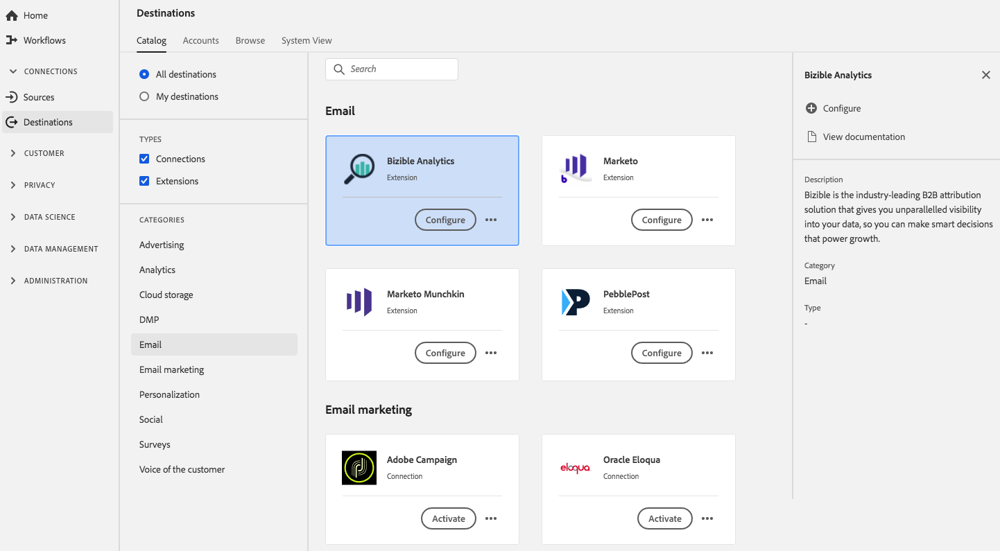

# Extensión [!DNL Bizible] {#bizible-extension}

## Información general {#overview}

[!DNL Bizible] es la solución de atribución B2B líder del sector que le proporciona una visibilidad sin igual de sus datos, para que pueda tomar decisiones inteligentes que impulsen el crecimiento.

[!DNL Bizible] es una extensión de correo electrónico en Adobe Experience Platform. Para obtener más información sobre Bizible, lea [Atribución de marketing](https://experienceleague.adobe.com/docs/bizible/using/introduction-to-bizible/overview-resources/marketing-attribution.html) en los recursos de información general de Bizible.

Este destino es una extensión de etiqueta. Para obtener más información sobre cómo funcionan las extensiones de etiquetas en Experience Platform, consulte [descripción general de las extensiones de etiquetas](../launch-extensions/overview.md).

## Requisitos previos {#prerequisites}

Esta extensión está disponible en el catálogo [!DNL Destinations] para todos los clientes que hayan adquirido Experience Platform.

Para utilizar esta extensión, debe tener acceso a las etiquetas en Adobe Experience Platform. Las etiquetas se ofrecen a los clientes de Adobe Experience Cloud como una función incluida que añade valor. Póngase en contacto con el administrador de su organización para obtener acceso a las etiquetas y pídale que le conceda el permiso **[!UICONTROL manage_properties]** para poder instalar extensiones.

## Instalar extensión {#install-extension}

Para instalar la extensión [!DNL Bizible]:

En la [interfaz de Experience Platform](https://platform.adobe.com/), vaya a **[!UICONTROL Destinos]** > **[!UICONTROL Catálogo]**.

Seleccione la extensión del catálogo o utilice la barra de búsqueda.

Haga clic en el destino para resaltarlo y, a continuación, seleccione **[!UICONTROL Configurar]** en el carril derecho. Si el control **[!UICONTROL Configure]** está deshabilitado, no tendrá el permiso **[!UICONTROL manage_properties]**. Consulte [Requisitos previos](#prerequisites).

Seleccione la propiedad de etiqueta en la que desea instalar la extensión. También tiene la opción de crear una nueva propiedad. Una propiedad es una colección de reglas, elementos de datos, extensiones configuradas, entornos y bibliotecas. Obtenga información acerca de las propiedades en la [documentación de etiquetas](../../../tags/ui/administration/companies-and-properties.md).

El flujo de trabajo le lleva a la IU de recopilación de datos para completar la instalación.

También puede instalar la extensión directamente en la [IU de recopilación de datos](https://experience.adobe.com/#/data-collection/). Consulte la guía de [adición de una nueva extensión](../../../tags/ui/managing-resources/extensions/overview.md#add-a-new-extension) para obtener más información.

## Uso de la extensión {#how-to-use}

Una vez instalada la extensión, puede empezar a configurar reglas. En la IU de recopilación de datos, puede configurar reglas para las extensiones instaladas a fin de enviar datos de evento al destino de la extensión solo en determinadas situaciones. Para obtener más información sobre la configuración de reglas para las extensiones, consulte la descripción general de [rules](../../../tags/ui/managing-resources/rules.md) en la documentación de etiquetas.

## Configuración, actualización y eliminación de extensiones {#configure-upgrade-delete}

Puede configurar, actualizar y eliminar extensiones en la IU de recopilación de datos.

>[!TIP]
>
>Si la extensión ya está instalada en una de las propiedades, la interfaz de usuario seguirá mostrando **[!UICONTROL Install]** para la extensión. Inicie el flujo de trabajo de instalación como se describe en [Instalar extensión](#install-extension) para configurar o eliminar la extensión.

Para actualizar la extensión, consulte la guía sobre el [proceso de actualización de la extensión](../../../tags/ui/managing-resources/extensions/extension-upgrade.md) en la documentación de etiquetas.
