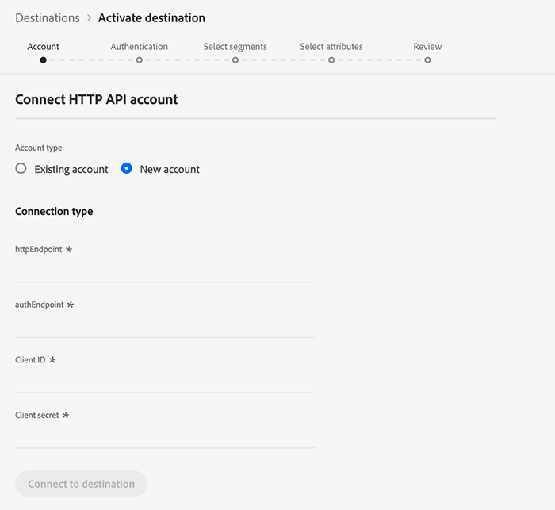

# Conexión (Alpha) [!DNL HTTP]

>[!IMPORTANT]
>
>El destino [!DNL HTTP] de Platform está actualmente en alfa. La documentación y las funciones están sujetas a cambios.

El destino [!DNL HTTP] es un destino de flujo [!DNL Adobe Experience Platform] que le ayuda a enviar datos de perfil a extremos [!DNL HTTP] de terceros.

Para enviar datos de perfil a [!DNL HTTP] extremos, primero debe conectarse al destino en [[!DNL Adobe Experience Platform]](#connect-destination).

## Casos de uso {#use-cases}

El [!DNL HTTP] destino está dirigido a clientes que necesitan exportar datos de perfil XDM y segmentos de audiencia a extremos [!DNL HTTP] genéricos.

[!DNL HTTP] los extremos pueden ser sistemas propios de los clientes o soluciones de terceros.

## Conectar con destino {#connect-destination}

En **[!UICONTROL Conexiones]** > **[!UICONTROL Destinos]**, seleccione [!DNL HTTP API] y seleccione **[!UICONTROL Configurar]**.


>[!NOTE]
>
>Si ya existe una conexión con este destino, puede ver un botón **[!UICONTROL Activar]** en la tarjeta de destino. Para obtener más información sobre la diferencia entre **[!UICONTROL Activar]** y **[!UICONTROL Configurar]**, consulte la sección [Catálogo](../ui/destinations-workspace.md#catalog) de la documentación del espacio de trabajo de destino.
>
>

En el paso [!UICONTROL Cuenta], debe definir los detalles de conexión del extremo HTTP. Seleccione **[!UICONTROL Nueva cuenta]** e introduzca los detalles de conexión para el extremo HTTP al que desea conectarse.
- **[!UICONTROL httpEndpoint]**: la finalización  [!DNL URL] del extremo HTTP al que desea enviar los datos de perfil.
   - Opcionalmente, puede agregar parámetros de consulta a [!UICONTROL httpEndpoint] [!DNL URL].
- **[!UICONTROL authEndpoint]**: la finalización  [!DNL URL] del extremo HTTP utilizado para la  [!DNL OAuth2] autenticación.
- **[!UICONTROL ID]** del cliente: el  [!DNL clientID] parámetro utilizado en las credenciales del  [!DNL OAuth2] cliente.
- **[!UICONTROL Secreto]** del cliente: el  [!DNL clientSecret] parámetro utilizado en las credenciales del  [!DNL OAuth2] cliente.

>[!NOTE]
>
>Actualmente solo se admiten [!DNL OAuth2] credenciales de cliente.


Haga clic en **[!UICONTROL Conectar al destino]**. Una vez que la conexión se haya realizado correctamente, haga clic en **[!UICONTROL Siguiente]**.

En el paso [!UICONTROL Autenticación], introduzca las credenciales de autenticación de la cuenta:
- **[!UICONTROL Nombre]**: escriba un nombre por el cual reconocerá este destino en el futuro.
- **[!UICONTROL Descripción]**: escriba una descripción que le ayudará a identificar este destino en el futuro.
- **[!UICONTROL Encabezados]** personalizados: introduzca los encabezados personalizados que desee incluir en las llamadas de destino, siguiendo este formato:  `header1:value1,header2:value2,...headerN:valueN`.

>[!IMPORTANT]
>
>La implementación actual requiere al menos un encabezado personalizado. Esta limitación se resolverá en una actualización futura.


**[!UICONTROL Caso]** de uso de marketing: Los casos de uso de mercadotecnia indican la intención para la cual se exportarán los datos al destino. Puede seleccionar entre los casos de uso de mercadotecnia definidos por el Adobe o puede crear su propio caso de uso de mercadotecnia. Para obtener más información acerca de los casos de uso de mercadotecnia, consulte la [información general de las directivas de uso de datos](../../data-governance/policies/overview.md).

Haga clic en **[!UICONTROL Crear destino]**.

## Activar segmentos

Consulte [Activar perfiles y segmentos en un destino](../ui/activate-destinations.md#select-attributes) para obtener información sobre el flujo de trabajo de activación de segmentos.

## Atributos de destino

Durante el paso [[!UICONTROL Seleccionar atributos]](../ui/activate-destinations.md#select-attributes), cuando [active segmentos](../ui/activate-destinations.md) en un destino [!DNL HTTP], le recomendamos que seleccione un identificador único del esquema de [unión](../../profile/home.md#profile-fragments-and-union-schemas). Seleccione el identificador único y cualquier otro campo XDM que desee exportar al destino.

## Datos exportados {#exported-data}

Los datos exportados [!DNL Experience Platform] llegan al destino [!DNL HTTP] en formato JSON. Por ejemplo, el evento siguiente contiene el atributo de perfil de dirección de correo electrónico de una audiencia que se ha cualificado para un segmento determinado y ha salido de otro. Las identidades de este cliente potencial son [!DNL ECID] y email.

```json
{
  "person": {
    "email": "yourstruly@adobe.con"
  },
  "segmentMembership": {
    "ups": {
      "7841ba61-23c1-4bb3-a495-00d3g5fe1e93": {
        "lastQualificationTime": "2020-05-25T21:24:39Z",
        "status": "exited"
      },
      "59bd2fkd-3c48-4b18-bf56-4f5c5e6967ae": {
        "lastQualificationTime": "2020-05-25T23:37:33Z",
        "status": "existing"
      }
    }
  },
  "identityMap": {
    "ecid": [
      {
        "id": "14575006536349286404619648085736425115"
      },
      {
        "id": "66478888669296734530114754794777368480"
      }
    ],
    "email_lc_sha256": [
      {
        "id": "655332b5fa2aea4498bf7a290cff017cb4"
      },
      {
        "id": "66baf76ef9de8b42df8903f00e0e3dc0b7"
      }
    ]
  }
}
```
