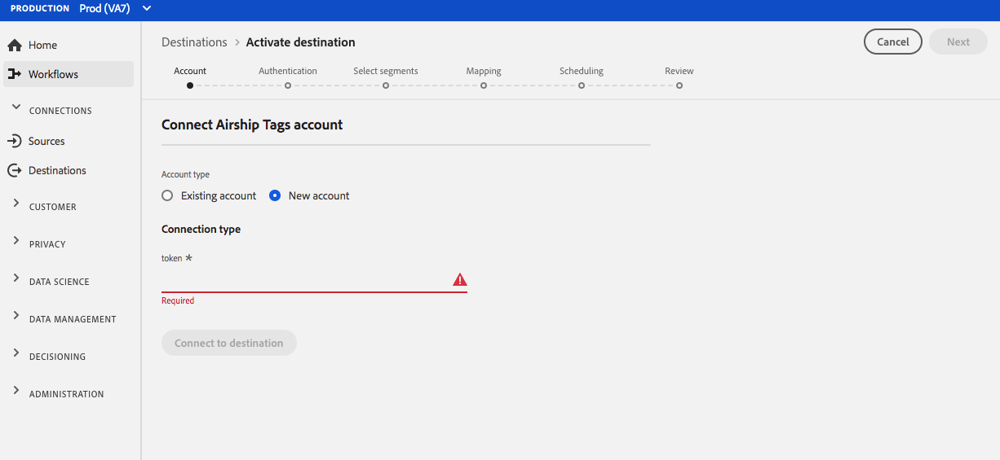

# (Beta) [!DNL Airship Tags] destino {#airship-tags-destination}

>[!IMPORTANT]
>
>El destino [!DNL Airship Tags] de Adobe Experience Platform está actualmente en versión beta. La documentación y las funciones están sujetas a cambios.

## Información general

[!DNL Airship] es la plataforma líder de compromiso con el cliente, que le ayuda a enviar mensajes de canal omnicho significativos y personalizados a sus usuarios en cada etapa del ciclo vital del cliente.

Esta integración pasa los datos de segmentos de Adobe Experience Platform a [!DNL Airship] como [Etiquetas](https://docs.airship.com/guides/audience/tags/) para objetivos o activaciones.

Para obtener más información sobre [!DNL Airship], consulte los [documentos de Airship](https://docs.airship.com).

>[!TIP]
>
>Esta página de documentación fue creada por el equipo [!DNL Airship]. Para cualquier consulta o solicitud de actualización, póngase en contacto con ellos directamente en [support.airship.com](https://support.airship.com/).

## Requisitos previos

Para poder enviar los segmentos de Adobe Experience Platform a [!DNL Airship], debe:

* Cree un grupo de etiquetas en su proyecto [!DNL Airship].
* Genere un token portador para la autenticación.

>[!TIP]
> 
>Cree una cuenta [!DNL Airship] mediante [este vínculo de inicio de sesión](https://go.airship.eu/accounts/register/plan/starter/) si aún no lo ha hecho.

### Grupos de etiquetas

El concepto de segmentos en Adobe Experience Platorm es similar a [Etiquetas](https://docs.airship.com/guides/audience/tags/) en Airship, con ligeras diferencias en la implementación. Esta integración asigna el estado de la [pertenencia de un usuario a un segmento de Experience Platform](https://experienceleague.adobe.com/docs/experience-platform/xdm/mixins/profile/segmentation.html?lang=en#mixins) a la presencia o no presencia de una etiqueta [!DNL Airship]. Por ejemplo, en un segmento de plataforma en el que `xdm:status` cambia a `realized`, la etiqueta se agrega al canal [!DNL Airship] o al usuario con nombre, este perfil se asigna. Si `xdm:status` cambia a `exited`, se elimina la etiqueta.

Para habilitar esta integración, cree un *grupo de etiquetas* en [!DNL Airship] con el nombre `adobe-segments`.

>[!IMPORTANT]
>
>Al crear el nuevo grupo de etiquetas **No marque** el botón de opción que dice &quot;[!DNL Allow these tags to be set only from your server]&quot;. Al hacerlo, se producirá un error en la integración de las etiquetas Adobe.

Consulte [Administrar grupos de etiquetas](https://docs.airship.com/tutorials/manage-project/messaging/tag-groups) para obtener instrucciones sobre cómo crear el grupo de etiquetas.

### Testigo del portador

Vaya a **[!UICONTROL Settings]**&quot; **[!UICONTROL APIs &amp; Integrations]** en el [panel de Airship](https://go.airship.com) y seleccione **[!UICONTROL Tokens]** en el menú de la izquierda.

Haga clic en **[!UICONTROL Crear token]**.

Proporcione un nombre descriptivo para el token, por ejemplo, &quot;Destino de etiquetas de Adobe&quot;, y seleccione &quot;Acceso total&quot; para el rol.

Haga clic en **[!UICONTROL Crear token]** y guarde los detalles como confidenciales.

## Casos de uso

Para ayudarle a comprender mejor cómo y cuándo debe utilizar el destino [!DNL Airship Tags], a continuación se muestran ejemplos de casos de uso que los clientes de Adobe Experience Platform pueden resolver usando este destino.

### Caso de uso n.º 1

Los minoristas o las plataformas de entretenimiento pueden crear perfiles de usuarios en función de sus clientes fieles y pasar dichos segmentos a [!DNL Airship] para dirigir mensajes en campañas móviles.

### Caso de uso n.º 2

Déclencheur mensajes uno a uno en tiempo real cuando los usuarios entran o salen de segmentos específicos dentro o fuera de Adobe Experience Platform.

Por ejemplo, un minorista configura un segmento específico de jeans en la plataforma. Ese minorista ahora puede enviar un déclencheur de un mensaje móvil tan pronto como alguien establezca sus preferencias de jeans en una marca específica.

## Conectar con [!DNL Airship Tags] {#connect-airship-tags}

En **[!UICONTROL Destinations]** > **[!UICONTROL Catalog]**, desplácese a la categoría **[!UICONTROL Mobile Engagement]**. Seleccione **[!DNL Airship Tags]** y, a continuación, seleccione **[!UICONTROL Configurar]**.

>[!NOTE]
>
>Si ya existe una conexión con este destino, puede ver un botón **[!UICONTROL Activar]** en la tarjeta de destino. Para obtener más información sobre la diferencia entre **[!UICONTROL Activar]** y **[!UICONTROL Configurar]**, consulte la sección [Catálogo](../../ui/destinations-workspace.md#catalog) de la documentación del espacio de trabajo de destino.

En el paso **Cuenta**, si anteriormente había configurado una conexión con su destino [!DNL Airship Tags], seleccione **[!UICONTROL Cuenta existente]** y seleccione la conexión existente. O bien, puede seleccionar **[!UICONTROL Nueva cuenta]** para configurar una nueva conexión a [!DNL Airship Tags]. Seleccione **[!UICONTROL Conectar a destino]** para conectar Adobe Experience Platform al proyecto [!DNL Airship] utilizando el distintivo portador que generó a partir del panel [!DNL Airship].

>[!NOTE]
>
>Adobe Experience Platform admite la validación de credenciales en el proceso de autenticación y muestra un mensaje de error si introduce credenciales incorrectas en su cuenta [!DNL Airship]. Esto garantiza que no se complete el flujo de trabajo con credenciales incorrectas.

Una vez confirmadas las credenciales y que Adobe Experience Platform esté conectado al proyecto [!DNL Airship], puede seleccionar **[!UICONTROL Siguiente]** para continuar con el paso **[!UICONTROL Configuración]**.

En el paso **[!UICONTROL Autenticación]**, escriba un **[!UICONTROL Nombre]** y una **[!UICONTROL Descripción]** para el flujo de activación.

También en este paso, puede seleccionar un centro de datos de EE. UU. o de la UE, según el [!DNL Airship] centro de datos que se aplique a este destino. Finalmente, seleccione uno o varios casos de uso de mercadotecnia para los que se exportarán datos al destino. Puede seleccionar entre los casos de uso de mercadotecnia definidos por el Adobe o puede crear los suyos propios. Para obtener más información acerca de los casos de uso de mercadotecnia, consulte la [información general de las directivas de uso de datos](../../../data-governance/policies/overview.md).

Seleccione **[!UICONTROL Crear destino]** después de completar los campos anteriores.

Se ha creado el destino. Puede seleccionar **[!UICONTROL Guardar y salir]** si desea activar segmentos más adelante o puede seleccionar **[!UICONTROL Siguiente]** para continuar el flujo de trabajo y seleccionar los segmentos que desea activar. En cualquier caso, consulte la siguiente sección, [Activar segmentos](#activate-segments), para el resto del flujo de trabajo.

## Activar segmentos {#activate-segments}

Para activar segmentos en [!DNL Airship Tags], siga los pasos a continuación:

En **[!UICONTROL Destinos > Examinar]**, seleccione el [!DNL Airship Tags] destino en el que desea activar los segmentos.

Haga clic en el nombre del destino. Esto le lleva al flujo Activar.

Tenga en cuenta que si ya existe un flujo de activación para un destino, puede ver los segmentos que se están enviando al destino. Seleccione **[!UICONTROL Editar activación]** en el carril derecho y siga los pasos a continuación para modificar los detalles de la activación.

Seleccione **[!UICONTROL Activar]**. En el flujo de trabajo **[!UICONTROL Activar destino]**, en la página **[!UICONTROL Seleccionar segmentos]**, seleccione los segmentos que se enviarán a [!DNL Airship Tags].

En el paso **[!UICONTROL Mapping]**, seleccione qué atributos e identidades del esquema [XDM](../../../xdm/home.md) se asignarán al esquema de destino. Seleccione **[!UICONTROL Añadir nueva asignación]** para examinar el esquema y asignarlo a la identidad de destinatario correspondiente.

[!DNL Airship] las etiquetas se pueden establecer en un canal, que representa la instancia de dispositivo, por ejemplo, iPhone, o en un usuario designado, que asigna todos los dispositivos de un usuario a un identificador común, como un ID de cliente. Si tiene direcciones de correo electrónico de texto sin formato (sin hash) como identidad principal en el esquema, seleccione el campo de correo electrónico en los **[!UICONTROL Atributos de origen]** y asigne al [!DNL Airship] usuario con nombre en la columna derecha debajo de **[!UICONTROL Identidades de Destinatario]**, como se muestra a continuación.

Para los identificadores que deben asignarse a un canal, es decir, un dispositivo, se asigna al canal apropiado en función del origen. Las siguientes imágenes muestran cómo asignar un ID de publicidad de Google a un [!DNL Airship] canal de Android.

En la página **[!UICONTROL Programación de segmentos]**, la programación está deshabilitada. Haga clic en **[!UICONTROL Siguiente]** para continuar con el paso de revisión.

En la página **[!UICONTROL Revisar]**, puede ver un resumen de su selección. Seleccione **[!UICONTROL Cancelar]** para desglosar el flujo, **[!UICONTROL Atrás]** para modificar la configuración o **[!UICONTROL Finalizar]** para confirmar la selección y el inicio al enviar datos al destino.

>[!IMPORTANT]
>
>En este paso, Adobe Experience Platform comprueba si hay infracciones de la directiva de uso de datos. A continuación se muestra un ejemplo de violación de una política. No puede completar el flujo de trabajo de activación de segmentos hasta que no haya resuelto la infracción. Para obtener información sobre cómo resolver las violaciones de políticas, consulte [Aplicación de políticas](../../../data-governance/enforcement/auto-enforcement.md) en la sección de documentación de administración de datos.

Si no se ha detectado ninguna infracción de directiva, seleccione **[!UICONTROL Finalizar]** para confirmar la selección y el inicio al enviar datos al destino.

## Administración y uso de datos {#data-usage-governance}

Todos los destinos [!DNL Adobe Experience Platform] son compatibles con las políticas de uso de datos al administrar los datos. Para obtener información detallada sobre cómo [!DNL Adobe Experience Platform] aplica la administración de datos, consulte [Información general sobre la administración de datos](../../../data-governance/home.md).

