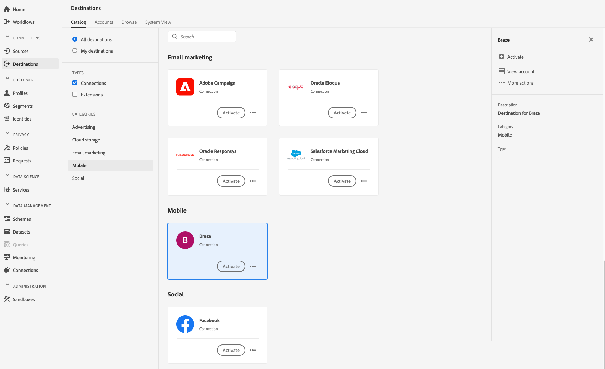
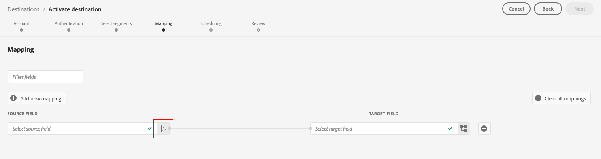

# (Beta) [!DNL Braze] destino

>[!IMPORTANT]
>
>El destino Braze de Adobe Experience Platform está actualmente en fase beta. La documentación y las funciones están sujetas a cambios.

## Información general {#overview}

El [!DNL Braze] destino le ayuda a enviar datos de perfil a [!DNL Braze].

[!DNL Braze] es una completa plataforma de compromiso con el cliente que ofrece experiencias relevantes e inolvidables entre los clientes y las marcas que les gustan.

Para enviar datos de perfil a [!DNL Braze], primero debe conectarse al destino.

## Especificaciones de destino {#destination-specs}

Tenga en cuenta los siguientes detalles específicos del [!DNL Braze] destino:

* Puede enviar cualquier [identidad](../../../identity-service/namespaces.md) al [!DNL Braze] destino, siempre y cuando lo asigne al [!DNL Braze] destino [`external_id`](https://www.braze.com/docs/api/basics/#external-user-id-explanation).
* [!DNL Adobe Experience Platform] los segmentos se exportan a [!DNL Braze] bajo el `AdobeExperiencePlatformSegments` atributo .

>[!NOTE]
>
>Tenga en cuenta que el envío de atributos personalizados adicionales puede [!DNL Braze] provocar un aumento en el consumo de puntos [!DNL Braze] de datos. Consulte con el administrador [!DNL Braze] de cuentas antes de enviar atributos personalizados adicionales.

## Casos de uso {#use-cases}

Como especialista en mercadotecnia, deseo hacer un destinatario de los usuarios en un destino de compromiso móvil, con segmentos integrados [!DNL Adobe Experience Platform]. Además, quiero ofrecerles experiencias personalizadas, basadas en atributos de sus [!DNL Adobe Experience Platform] perfiles, tan pronto como se actualicen los segmentos y perfiles en [!DNL Adobe Experience Platform].

## Tipo de exportación {#export-type}

**[!DNL Profile-based]** - está exportando todos los miembros de un segmento, junto con los campos de esquema deseados (por ejemplo: dirección de correo electrónico, número de teléfono, apellido) y/o identidades, según la asignación de campos.
[!DNL Adobe Experience Platform] los segmentos se exportan a [!DNL Braze] bajo el `AdobeExperiencePlatformSegments` atributo .

## Conectar al destino {#connect-destination}

En **[!UICONTROL Conexiones]** > **[!UICONTROL Destinos]**, seleccione [!DNL Braze]y seleccione **[!UICONTROL Configurar]**.

>[!NOTE]
>
>Si ya existe una conexión con este destino, puede ver un botón **[!UICONTROL Activar]** en la tarjeta de destino. Para obtener más información sobre la diferencia entre **[!UICONTROL Activar]** y **[!UICONTROL Configurar]**, consulte la sección [Catálogo](../../ui/destinations-workspace.md#catalog) de la documentación del espacio de trabajo de destino.
>
>

En el paso [!UICONTROL Cuenta] , debe proporcionar el token [!DNL Braze] de cuenta. Esta es tu [!DNL Braze][!DNL API] llave. Puede encontrar instrucciones detalladas sobre cómo obtener su [!DNL API] clave aquí: [Información general](https://www.braze.com/docs/api/api_key/)de la clave de API de REST. Introduzca el token y haga clic en **[!UICONTROL Conectar al destino]**.

Haga clic en **[!UICONTROL Siguiente]**. En el paso [!UICONTROL Autenticación] , debe introducir los detalles de [!DNL Braze] conexión:
* **[!UICONTROL Nombre]**: escriba un nombre por el cual reconocerá este destino en el futuro.
* **[!UICONTROL Descripción]**: escriba una descripción que le ayudará a identificar este destino en el futuro.
* **[!UICONTROL Instancia]** de extremo: pregunte a su [!DNL Braze] representante qué instancia de extremo debe utilizar.
* **[!UICONTROL Caso]** de uso de marketing: los casos de uso de mercadotecnia indican la intención de exportar los datos al destino. Puede seleccionar entre los casos de uso de mercadotecnia definidos por el Adobe o puede crear su propio caso de uso de mercadotecnia. Para obtener más información sobre los casos de uso de mercadotecnia, consulte la página Gobierno [de datos en Adobe Experience Platform](../../../rtcdp/privacy/data-governance-overview.md#destinations) . Para obtener información sobre los casos individuales de uso de mercadotecnia definidos por el Adobe, consulte la descripción general [de las políticas de uso de](../../../data-governance/policies/overview.md#core-actions)datos.

Haga clic en **[!UICONTROL Crear destino]**. Se ha creado el destino. Puede hacer clic en **[!UICONTROL Guardar y salir]** si desea activar segmentos más adelante, o bien puede seleccionar **[!UICONTROL Siguiente]** para continuar el flujo de trabajo y seleccionar los segmentos que desea activar. En cualquier caso, consulte la siguiente sección, [Activar segmentos](#activate-segments), para el resto del flujo de trabajo.

## Activar segmentos {#activate-segments}

Consulte [Activar perfiles y segmentos en un destino](../../ui/activate-destinations.md#select-attributes) para obtener información sobre el flujo de trabajo de activación de segmentos.

## Asignación de campos {#field-mapping}

Para enviar correctamente los datos de audiencia desde [!DNL Adobe Experience Platform] al destino [!DNL Braze] , debe pasar por el paso de asignación de campos.

La asignación consiste en crear un vínculo entre los campos de esquema [!DNL Experience Data Model] (XDM) de la [!DNL Platform] cuenta y sus equivalentes correspondientes desde el destino de destinatario.

Para asignar correctamente los campos XDM a los [!DNL Braze] campos de destino, siga estos pasos:

En el paso [!UICONTROL Asignación] , haga clic en **[!UICONTROL Añadir nueva asignación]**.

En la sección Campo  de origen, haga clic en el botón de flecha situado junto al campo vacío.

En la ventana [!UICONTROL Seleccionar campo] de origen, puede elegir entre dos categorías de campos XDM:
* [!UICONTROL Seleccionar atributos]: utilice esta opción para asignar un campo específico del esquema XDM a un [!DNL Braze] atributo.

* [!UICONTROL Seleccionar Área de nombres]de identidad: Utilice esta opción para asignar una Área de nombres de [!DNL Platform] identidad a una [!DNL Braze] Área de nombres.

Elija el campo de origen y haga clic en **[!UICONTROL Seleccionar]**.

En la sección Campo [!UICONTROL de] Destinatario, haga clic en el icono de asignación a la derecha del campo.

En la ventana del campo  Seleccionar destinatario, puede elegir entre tres categorías de campos de destinatario:
* [!UICONTROL Seleccionar atributos]: Utilice esta opción para asignar los atributos XDM a [!DNL Braze] atributos estándar.
* [!UICONTROL Seleccionar Área de nombres]de identidad: Utilice esta opción para asignar [!DNL Platform] Áreas de nombres de identidad a Áreas de nombres [!DNL Braze] de identidad.
* [!UICONTROL Seleccionar atributos]personalizados: Utilice esta opción para asignar atributos XDM a [!DNL Braze] atributos personalizados que haya definido en su [!DNL Braze] cuenta.
* También puede utilizar esta opción para cambiar el nombre de los atributos XDM existentes a [!DNL Braze]. Por ejemplo, la asignación de un atributo `lastName` XDM a un `Last_Name` atributo personalizado en [!DNL Braze], creará el `Last_Name` atributo en [!DNL Braze], si no existe, y le asignará el atributo `lastName` XDM.

Elija el campo destinatario y haga clic en **[!UICONTROL Seleccionar]**.

Ahora debería ver la asignación de campos en la lista.

Para agregar más asignaciones, repita los pasos anteriores.

### Ejemplo {#mapping-example}

Supongamos que su esquema de perfil XDM y su [!DNL Braze] instancia contienen los atributos e identidades siguientes:

|  | Esquema de Perfil XDM | [!DNL Braze] Instancia |
|---|---|---|
| Atributos | <ul><li>person.name.firstName</code></li><li>person.name.lastName</code></li><li>mobilePhone.number</code></li></ul> | <ul><li>FirstName</code></li><li>LastName</code></li><li>NúmeroTeléfono</code></li></ul> |
| Identidades | <ul><li>Correo electrónico</code></li><li>ID de publicidad de Google (GAID)</code></li><li>ID de Apple para anunciantes (IDFA)</code></li></ul> | <ul><li>external_id</code></li></ul> |

La asignación correcta tendría este aspecto:

## Datos exportados {#exported-data}

Para verificar si los datos se han exportado correctamente al [!DNL Braze] destino, compruebe su [!DNL Braze] cuenta. [!DNL Adobe Experience Platform] los segmentos se exportan a [!DNL Braze] bajo el `AdobeExperiencePlatformSegments` atributo .

## Uso y gobernanza de los datos {#data-usage-governance}

Todos los [!DNL Adobe Experience Platform] destinos cumplen con las directivas de uso de datos al administrar los datos. Para obtener información detallada sobre cómo [!DNL Adobe Experience Platform] implementar la administración de datos, consulte Administración de [datos en CDP](../../../rtcdp/privacy/data-governance-overview.md)en tiempo real.

