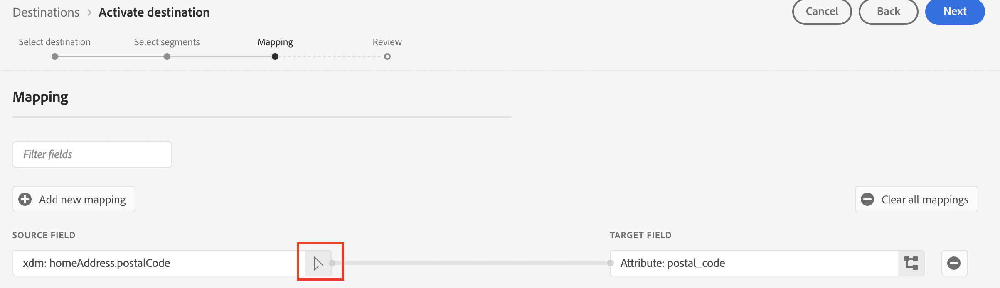

# [!DNL Moengage] conexión

## Información general {#overview}

Utilice el destino [!DNL Moengage] para conectar y asignar los datos de Adobe (atributos de usuario, segmentos y eventos) a MoEngage en tiempo real. A continuación, los clientes pueden actuar sobre estos datos y ofrecer experiencias personalizadas y específicas.

Con Adobe, la integración es muy sencilla e intuitiva. Simplemente, tome cualquier perfil de usuario de Adobe y asígnelo a un atributo de usuario de MoEngage.

>[!IMPORTANT]
>
>Este conector de destino y esta página de documentación son creados y mantenidos por el equipo *Moengage*. Para cualquier consulta o solicitud de actualización, comuníquese directamente con ellos en *`https://help.moengage.com/hc/en-us`.*

## Casos de uso {#use-cases}

Un especialista en marketing desea segmentar un segmento de usuario (integrado en Adobe Experience Platform) mediante [!DNL Moengage] campañas. Además, desean personalizar el contenido de la campaña en función de los atributos de los perfiles de Adobe Experience Platform. Con esta integración, los usuarios y atributos se actualizan en MoEngage en cuanto los segmentos y perfiles se actualizan en Adobe Experience Platform.

## Requisitos previos {#prerequisites}

Para poder enviar los datos de Adobe Experience Platform a [!DNL Moengage], tenga en cuenta los siguientes requisitos previos:

* Para usar el destino MoEngage con Adobe Experience Platform, los usuarios deben tener acceso primero a su cuenta de [!DNL Moengage]. Visite la siguiente página para registrarse o iniciar sesión en su cuenta de MoEngage: https://app.moengage.com

## Identidades admitidas {#supported-identities}

[!DNL Moengage] admite la activación de las identidades descritas en la tabla siguiente.

| Identidad de destino | Descripción | Consideraciones |
|---|------------------------------------------------------------------------------------------|----------------------------------------------------------------------------------------|
| user_id | Identificador único que identifica de manera única un perfil de usuario en el sistema [!DNL Moengage]. | Este identificador admite el tipo de cadena. Se requiere uno de user_id o anonymous_id |
| anonymous_id | Otro identificador para un perfil de usuario desconocido: es decir, un perfil que no existe en el sistema. | Este identificador admite el tipo de cadena. Se requiere uno de user_id o anonymous_id |

{style="table-layout:auto"}

## Tipo y frecuencia de exportación {#export-type-frequency}

Consulte la tabla siguiente para obtener información sobre el tipo y la frecuencia de exportación de destino.

| Elemento | Tipo | Notas |
---------|----------|------------------------------------------------------------------------------------------------------------------------------------------------------------------------------------------------------------------------------------------------------------------------------------------------------------------------------------|
| Tipo de exportación | **[!UICONTROL Basado en perfil]** | Va a exportar todos los miembros de un segmento (audiencia) con los identificadores (user_id, anonymous_id) junto con los atributos personalizados definidos por ha exportado a [!DNL Moengage]. |
| Frecuencia de exportación | **[!UICONTROL Transmisión]** | Los destinos de streaming son conexiones basadas en API &quot;siempre activadas&quot;. Tan pronto como se actualiza un perfil en Experience Platform basado en la evaluación de segmentos, el conector envía la actualización de forma descendente a la plataforma de destino. Más información sobre [destinos de streaming](/help/destinations/destination-types.md#streaming-destinations). |

{style="table-layout:auto"}

## Conexión al destino {#connect}

>[!IMPORTANT]
> 
>Para conectarse al destino, necesita los **[!UICONTROL permisos de control de acceso](/help/access-control/home.md#permissions) de Ver destinos]** y **[!UICONTROL Administrar destinos]**[5}. Lea la [descripción general del control de acceso](/help/access-control/ui/overview.md) o póngase en contacto con el administrador del producto para obtener los permisos necesarios.

Para conectarse a este destino, siga los pasos descritos en el [tutorial de configuración de destino](../../ui/connect-destination.md). En el flujo de trabajo de configuración de destino, rellene los campos enumerados en las dos secciones siguientes.

### Autenticarse en el destino {#authenticate}

Para autenticarse en el destino, rellene los campos obligatorios y seleccione **[!UICONTROL Conectar con destino]**.

### Rellenar detalles de destino {#destination-details}

Para configurar los detalles del destino, rellene los campos obligatorios y opcionales a continuación. Un asterisco junto a un campo en la interfaz de usuario indica que el campo es obligatorio.

* **[!UICONTROL NOMBRE DE USUARIO]**: ID DE APLICACIÓN DE DATOS de la página de configuración del tablero [!DNL Moengage].
* **[!UICONTROL CONTRASEÑA]**: CLAVE DE APLICACIÓN DE DATOS de la página de configuración del tablero [!DNL Moengage].

* **[!UICONTROL Nombre]**: Un nombre por el cual reconocerá este destino en el futuro.
* **[!UICONTROL Descripción]**: Una descripción que le ayudará a identificar este destino en el futuro.
* **[!UICONTROL Región]**: tu aplicación *centro de datos*.

### Habilitar alertas {#enable-alerts}

Puede activar alertas para recibir notificaciones sobre el estado del flujo de datos a su destino. Seleccione una alerta de la lista a la que suscribirse para recibir notificaciones sobre el estado del flujo de datos. Para obtener más información sobre las alertas, consulte la guía sobre [suscripción a alertas de destinos mediante la interfaz de usuario](../../ui/alerts.md).

Cuando termine de proporcionar detalles para la conexión de destino, seleccione **[!UICONTROL Siguiente]**.

## Activar segmentos en este destino {#activate}

>[!IMPORTANT]
> 
>Para activar los datos, necesita los **[!UICONTROL permisos de control de acceso]**, **[!UICONTROL Activar destinos]**, **[!UICONTROL Ver perfiles]** y **[!UICONTROL Ver segmentos]**[para ](/help/access-control/home.md#permissions). Lea la [descripción general del control de acceso](/help/access-control/ui/overview.md) o póngase en contacto con el administrador del producto para obtener los permisos necesarios.

Consulte [Activar datos de audiencia en destinos de exportación de segmentos de streaming](../../ui/activate-segment-streaming-destinations.md) para obtener instrucciones sobre cómo activar segmentos de audiencia en este destino.

### Asignar atributos e identidades {#map}

Para enviar correctamente los datos de audiencia de [!DNL Adobe Experience Platform] al destino [!DNL Moengage], debe pasar por el paso de asignación de campos.

La asignación consiste en crear un vínculo entre los campos de esquema [!DNL Experience Data Model] (XDM) de la cuenta [!DNL Experience Platform] y sus equivalentes correspondientes del destino.

Para asignar correctamente los campos XDM a los campos de destino [!DNL Moengage], siga estos pasos:

En el paso [!UICONTROL Asignación], seleccione **[!UICONTROL Casilla]**.

En el paso [!UICONTROL Asignación], seleccione **[!UICONTROL Agregar nueva asignación]**.

En la sección [!UICONTROL Campo de Source], seleccione el botón de flecha situado junto al campo vacío.

En la ventana [!UICONTROL Seleccionar campo de origen], puede elegir entre dos categorías de campos XDM:
* [!UICONTROL Seleccionar atributos]: utilice esta opción para asignar un campo específico del esquema XDM al atributo [!DNL Moengage].

Elija su campo de origen y luego seleccione **[!UICONTROL Seleccionar]**.

En la sección [!UICONTROL Campo de destino], seleccione el icono de asignación a la derecha del campo.

En la ventana [!UICONTROL Seleccionar campo de destino], puede elegir entre dos categorías de campos de destino:
* [!UICONTROL Seleccionar área de nombres de identidad]: utilice esta opción para asignar [!DNL Experience Platform] áreas de nombres de identidad a [!DNL Moengage] áreas de nombres de identidad.
* [!UICONTROL Seleccionar atributos personalizados]: utilice esta opción para asignar atributos XDM a atributos personalizados [!DNL Moengage] que haya definido en su cuenta de [!DNL Moengage].   También puede utilizar esta opción para cambiar el nombre de los atributos XDM existentes a [!DNL Moengage]. Por ejemplo, si se asigna un atributo XDM `lastName` a un atributo `Last_Name` personalizado en [!DNL Moengage], se creará el atributo `Last_Name` en [!DNL Moengage], si aún no existe, y se le asignará el atributo XDM `lastName`.

Elija su campo de destino y luego seleccione **[!UICONTROL Seleccionar]**.

Ahora debería ver la asignación de campos en la lista.

Para agregar más asignaciones, repita los pasos anteriores.

## Datos exportados / Validar exportación de datos {#exported-data}

Para comprobar si los datos se han exportado correctamente al destino [!DNL Moengage], vaya al perfil de usuario de la cuenta de [!DNL Moengage]. Aquí encontrará un atributo de usuario denominado `AEPSegments`, creado automáticamente y los demás atributos personalizados que se han asignado en los pasos anteriores de Adobe Experience Platform.

`AEPSegments` es un atributo de tipo matriz en [!DNL Moengage]. Enumera todos los nombres de audiencia de Adobe a los que está asociado el usuario en Experience Platform.

## Uso de datos y gobernanza {#data-usage-governance}

Todos los destinos de [!DNL Adobe Experience Platform] cumplen con las políticas de uso de datos al administrar los datos. Para obtener información detallada sobre cómo [!DNL Adobe Experience Platform] aplica el control de datos, lea la [Información general sobre el control de datos](/help/data-governance/home.md).
