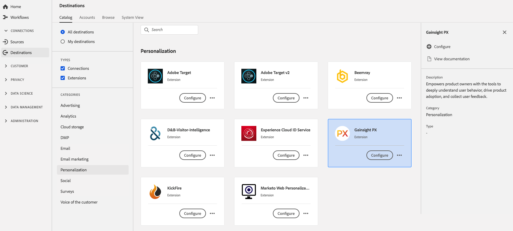

# Extensión [!DNL Gainsight] {#gainsight-extension}

## Información general {#overview}

[!DNL Gainsight] proporciona a los propietarios de productos las herramientas necesarias para comprender en profundidad el comportamiento de los usuarios, impulsar la adopción de productos y recopilar comentarios de los usuarios.

[!DNL Gainsight] es una extensión de personalización en [!DNL Adobe Experience Platform]. Para obtener más información acerca de la funcionalidad de la extensión, consulte la página de extensión en [Adobe Exchange](https://www.adobeexchange.com/experiencecloud.details.103343.html).

Este destino es una extensión de etiqueta. Para obtener más información sobre cómo funcionan las extensiones de etiquetas en Experience Platform, consulte [descripción general de las extensiones de etiquetas](../launch-extensions/overview.md).

## Requisitos previos {#prerequisites}

Esta extensión está disponible en el catálogo [!DNL Destinations] para todos los clientes que hayan adquirido Experience Platform.

Para usar esta extensión, necesita tener acceso a las etiquetas de [!DNL Adobe Experience Platform]. Las etiquetas se ofrecen a [!DNL Adobe Experience Cloud] clientes como una característica incluida que añade valor. Póngase en contacto con el administrador de su organización para obtener acceso a las etiquetas y pídale que le conceda el permiso **[!UICONTROL manage_properties]** para que pueda instalar extensiones.

## Instalar extensión {#install-extension}

Para instalar la extensión [!DNL Gainsight]:

En la [interfaz de Experience Platform](https://platform.adobe.com/), vaya a **[!UICONTROL Destinations]** > **[!UICONTROL Catalog]**.

Seleccione la extensión del catálogo o utilice la barra de búsqueda.

Seleccione el destino y, a continuación, seleccione **[!UICONTROL Configure]** en el carril derecho. Si el control **[!UICONTROL Configure]** está deshabilitado, no tiene el permiso **[!UICONTROL manage_properties]**. Consulte [Requisitos previos](#prerequisites).

Seleccione la propiedad en la que desea instalar la extensión. También tiene la opción de crear una nueva propiedad. Una propiedad es una colección de reglas, elementos de datos, extensiones configuradas, entornos y bibliotecas. Obtenga información acerca de las propiedades en la [sección de la página Propiedades](../../../tags/ui/administration/companies-and-properties.md#properties-page) de en la documentación de etiquetas.

El flujo de trabajo le guía para completar la instalación.

Para obtener información sobre las opciones de configuración de la extensión y la compatibilidad con la instalación, consulte la [página Gainsight en Adobe Exchange](https://www.adobeexchange.com/experiencecloud.details.103343.html).

También puede instalar la extensión directamente en la [IU de recopilación de datos](https://experience.adobe.com/#/data-collection/). Para obtener más información, consulte la sección sobre [agregar una nueva extensión](../../../tags/ui/managing-resources/extensions/overview.md#add-a-new-extension) en la documentación de etiquetas.

## Uso de la extensión {#how-to-use}

Una vez instalada la extensión, puede empezar a configurar reglas.

Puede configurar reglas para las extensiones instaladas a fin de enviar datos de evento al destino de la extensión solo en determinadas situaciones. Para obtener más información sobre cómo configurar reglas para las extensiones, consulte la [documentación de etiquetas](../../../tags/ui/managing-resources/rules.md).

## Configuración, actualización y eliminación de extensiones {#configure-upgrade-delete}

Puede configurar, actualizar y eliminar extensiones en la IU de recopilación de datos.

>[!TIP]
>
>Si la extensión ya está instalada en una de las propiedades, la interfaz de usuario de Experience Platform seguirá mostrando **[!UICONTROL Install]** para la extensión. Inicie el flujo de trabajo de instalación como se describe en [Instalar extensión](#install-extension) para configurar o eliminar la extensión.

Para actualizar la extensión, consulte la guía sobre el [proceso de actualización de la extensión](../../../tags/ui/managing-resources/extensions/extension-upgrade.md) en la documentación de etiquetas.
