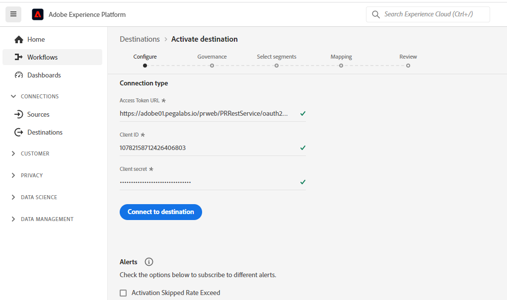

# (V2) Conexión de audiencia en tiempo real Pega CDH

## Información general {#overview}

Utilice el destino [!DNL Pega CDH Realtime Audience] (V2) de Adobe Experience Platform para enviar atributos de perfil y datos de pertenencia a audiencias a [!DNL Pega Customer Decision Hub] para la toma de decisiones de la mejor acción siguiente.

El abono a audiencia de perfil de Adobe Experience Platform, cuando se carga en [!DNL Pega Customer Decision Hub], puede usarse como predictor en modelos adaptables y ayudar a entregar los datos contextuales y de comportamiento adecuados para la toma de decisiones de la siguiente mejor acción.

>[!IMPORTANT]
>
>Pegasystems crea y mantiene este conector de destino y esta página de documentación. Para cualquier consulta o solicitud de actualización, comuníquese directamente con Pega [aquí](mailto:support@pega.com).

## Casos de uso {#use-cases}

Para ayudarle a comprender mejor cómo y cuándo debe utilizar el destino [!DNL Customer Decision Hub], aquí hay casos de uso de ejemplo que los clientes de Adobe Experience Platform pueden solucionar mediante este destino.

### Telecomunicaciones {#telecommunications}

Un experto en marketing desea aprovechar las perspectivas de la siguiente mejor acción basada en el modelo de ciencia de datos según lo entregado por [!DNL Pega Customer Decision Hub] para la participación de los clientes. [!DNL Pega Customer Decision Hub] se basa significativamente en la intención del cliente, como &quot;Interested_In_5G&quot;, &quot;Interested_in_Unlimited_Dataplan&quot; o &quot;Interest_in_iPhone_Accessories&quot; para determinar la toma de decisiones de la mejor acción siguiente (NBA) en los canales salientes.

### Servicios financieros {#financial-services}

Un experto en marketing desea optimizar las ofertas para los clientes que se suscribieron o cancelaron su suscripción a los boletines del Plan de pensiones o del Plan de jubilación. Las empresas de servicios financieros pueden ingerir varios ID de cliente desde sus propios CRM en Adobe Experience Platform, crear audiencias a partir de sus propios datos sin conexión y enviar perfiles que entren y salgan de las audiencias a [!DNL Pega Customer Decision Hub] para la toma de decisiones de la mejor acción siguiente (NBA) en los canales salientes.

## Requisitos previos {#prerequisites}

Antes de poder usar este destino para exportar datos desde Adobe Experience Platform, asegúrese de completar los siguientes requisitos previos en [!DNL Pega Customer Decision Hub]:

* Configure [el perfil de Adobe Experience Platform y el componente de integración de pertenencia a audiencias](https://docs.pega.com/bundle/components/page/customer-decision-hub/components/adobe-membership-component.html) en su instancia de [!DNL Pega Customer Decision Hub].
* Configurar el registro de cliente OAuth 2.0 [mediante credenciales de cliente](https://docs.pega.com/bundle/platform/page/platform/security/configure-oauth-2-client-registration.html) tipo de concesión en su instancia [!DNL Pega Customer Decision Hub].
* Configure [flujo de datos en tiempo real](https://docs.pega.com/bundle/platform/page/platform/decision-management/data-flow-run-real-time-create.html) para el flujo de datos de pertenencia a audiencias de Adobe en su instancia de [!DNL Pega Customer Decision Hub].

## Identidades admitidas {#supported-identities}

[!DNL Pega Customer Decision Hub] admite la activación de los identificadores de usuario personalizados que se describen en la tabla siguiente. Para obtener más información, consulte [identidades](/help/identity-service/features/namespaces.md).

| Identidad de destino | Descripción | Consideraciones |
|---|---|---|
| `CustomerID` | ID de cliente | Identificador de usuario común que identifica de manera única un perfil en [!DNL Pega Customer Decision Hub] y Adobe Experience Platform. |

{style="table-layout:auto"}

## Tipo y frecuencia de exportación {#export-type-frequency}

Consulte la tabla siguiente para obtener información sobre el tipo y la frecuencia de exportación de destino.

| Elemento | Tipo | Notas |
---------|----------|---------|
| Tipo de exportación | **[!UICONTROL Basado en perfil]** | Exporte todos los miembros de una audiencia con el identificador (*CustomerID*), atributos (apellidos, nombre, ubicación, etc.) y datos de pertenencia a audiencias. |
| Frecuencia de exportación | **[!UICONTROL Transmisión]** | Los destinos de streaming son conexiones basadas siempre en API. Tan pronto como se actualiza un perfil en Experience Platform, según la evaluación de audiencias, el conector envía la actualización de forma descendente a la plataforma de destino. Para obtener más información, consulte [destinos de streaming](/help/destinations/destination-types.md#streaming-destinations). |

{style="table-layout:auto"}

## Conexión al destino {#connect}

Para conectarse a este destino, siga los pasos descritos en el [tutorial de configuración de destino](../../ui/connect-destination.md). En el flujo de trabajo de configuración de destino, rellene los campos enumerados en las dos secciones siguientes.

### Autenticarse en el destino {#authenticate}

#### Autenticación de credenciales de cliente de OAuth 2 {#oauth-2-client-credentials-authentication}

Rellene los campos siguientes y seleccione **[!UICONTROL Conectar con destino]**:

* **[!UICONTROL URL de token de acceso]**: La URL del token de acceso de OAuth 2 en su instancia de [!DNL Pega Customer Decision Hub].
* **[!UICONTROL ID de cliente]**: el OAuth 2 [!DNL client ID] que generó en su instancia de [!DNL Pega Customer Decision Hub].
* **[!UICONTROL Secreto de cliente]**: El OAuth 2 [!DNL client secret] que generó en su instancia de [!DNL Pega Customer Decision Hub].

### Rellenar detalles de destino {#destination-details}

Después de establecer la conexión de autenticación con [!DNL Pega Customer Decision Hub], proporcione la siguiente información para el destino:

Para configurar los detalles del destino, rellena los campos obligatorios y selecciona **[!UICONTROL Siguiente]**.

* **[!UICONTROL Nombre]**: Un nombre por el cual reconocerá este destino en el futuro.
* **[!UICONTROL Descripción]**: Una descripción que le ayudará a identificar este destino en el futuro.
* **[!UICONTROL Nombre de host Pega CDH]**: El nombre de host Pega Customer Decision Hub al que se exporta el perfil como datos JSON.
* **[!UICONTROL Alias de aplicación]**: El alias de aplicación que configuró para su cuenta de Customer Decision Hub. Para obtener más información, consulte [Agregar un alias de URL de aplicación](https://docs.pega.com/bundle/platform/page/platform/user-experience/adding-application-url-alias.html) en su instancia de [!DNL Pega Customer Decision Hub].

## Activar públicos en este destino {#activate}

>[!IMPORTANT]
> 
>* Para activar los datos, necesita los **[!UICONTROL permisos de control de acceso]**, **[!UICONTROL Activar destinos]**, **[!UICONTROL Ver perfiles]** y **[!UICONTROL Ver segmentos]**&#x200B;[para ](/help/access-control/home.md#permissions). Lea la [descripción general del control de acceso](/help/access-control/ui/overview.md) o póngase en contacto con el administrador del producto para obtener los permisos necesarios.
>* Para exportar *identidades*, necesita el **[[!UICONTROL permiso de control de acceso]](/help/access-control/home.md#permissions) de&rbrack;** Ver gráfico de identidad&lbrack;.   {width="100" zoomable="yes"}

Consulte [Activar datos de audiencia en destinos de exportación de perfiles de flujo continuo](../../ui/activate-streaming-profile-destinations.md) para obtener instrucciones sobre cómo activar audiencias en este destino.

### Asignación {#mapping}

En el paso [!UICONTROL Mapping], selecciona un identificador único de tu esquema de unión y de cualquier otro campo XDM que quieras exportar al destino.

### Ejemplo de asignación: activación de actualizaciones de perfil en [!DNL Pega Customer Decision Hub] {#mapping-example}

A continuación se muestra un ejemplo de asignación de identidad correcta al exportar perfiles a [!DNL Pega Customer Decision Hub].

* Seleccione una identidad de origen que identifique de manera única un perfil en Adobe Experience Platform y [!DNL Pega Customer Decision Hub]. Por ejemplo: `CustomerID`.
* Seleccione los atributos de perfil de destino a los que desea asignar los atributos de perfil de origen seleccionados.

## Datos exportados / Validar exportación de datos {#exported-data}

Una actualización correcta de la pertenencia a audiencias de un perfil insertaría el identificador de audiencia, el nombre y los estados en el almacén de datos de pertenencia a audiencias de marketing de Pega. Los datos de pertenencia están asociados a un cliente que usa Designer de perfil de cliente en [!DNL Pega Customer Decision Hub], como se muestra a continuación.

Los datos de pertenencia a audiencias se utilizan en las políticas de participación de Designer de la siguiente mejor acción de Pega para la toma de decisiones de la siguiente mejor acción, como se muestra a continuación.

Los campos de datos de pertenencia a audiencias del cliente se agregan como predictores en los modelos adaptables, como se muestra a continuación.

## Recursos adicionales {#additional-resources}

Consulte la siguiente documentación de [!DNL Pega] para obtener más información:

* [Configuración de un registro de cliente de OAuth 2.0](https://docs.pega.com/bundle/platform/page/platform/security/configure-oauth-2-client-registration.html)
* [Creación de una ejecución en tiempo real para flujos de datos](https://docs.pega.com/bundle/platform/page/platform/decision-management/data-flow-run-real-time-create.html)
* [Administrar registros de clientes en el perfil de cliente de Designer](https://docs.pega.com/bundle/customer-decision-hub/page/customer-decision-hub/implement/profile-designer-data-management.html)

## Uso de datos y gobernanza {#data-usage-governance}

Todos los destinos de [!DNL Adobe Experience Platform] cumplen con las políticas de uso de datos al administrar los datos. Para obtener información detallada sobre cómo [!DNL Adobe Experience Platform] aplica el control de datos, consulte la [Información general sobre el control de datos](/help/data-governance/home.md).
