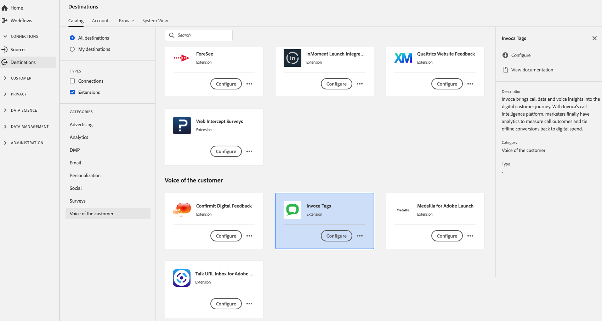

# [!DNL Invoca Tags] Extensión {#invoca-extension}

## Información general {#overview}

[!DNL Invoca] incorpora datos de llamadas y perspectivas de voz en el recorrido digital del cliente. Con [!DNL Invoca’s] plataforma de inteligencia de llamadas, los especialistas en marketing finalmente tienen analytics para medir los resultados de las llamadas y enlazar las conversiones sin conexión con el gasto digital.

[!DNL Invoca Tags] es la voz de la extensión del cliente en Adobe Experience Platform. Para obtener más información sobre la funcionalidad de la extensión, consulte la página de extensión sobre [Intercambio de Adobe](https://exchange.adobe.com/experiencecloud.details.100067.invoca.html).

Este destino es una extensión de etiqueta. Para obtener más información sobre cómo funcionan las extensiones de etiquetas en Platform, consulte la [información general sobre extensiones de etiquetas](../launch-extensions/overview.md).

## Requisitos previos {#prerequisites}

Esta extensión está disponible en el [!DNL Destinations] para todos los clientes que han adquirido Platform.

Para utilizar esta extensión, debe tener acceso a las etiquetas en Adobe Experience Platform. Las etiquetas se ofrecen a los clientes de Adobe Experience Cloud como una función incluida que añade valor. Póngase en contacto con el administrador de su organización para obtener acceso a las etiquetas y pídale que le conceda el **[!UICONTROL manage_properties]** para poder instalar extensiones.

## Instalar extensión {#install-extension}

Para instalar el [!DNL Invoca Tags] extensión:

En el [Interfaz de plataforma](https://platform.adobe.com/), vaya a **[!UICONTROL Destinos]** > **[!UICONTROL Catálogo]**.

Seleccione la extensión del catálogo o utilice la barra de búsqueda.

Haga clic en el destino para resaltarlo y luego seleccione **[!UICONTROL Configurar]** en el carril derecho. Si la variable **[!UICONTROL Configurar]** el control está atenuado, falta el **[!UICONTROL manage_properties]** permiso. Consulte [Requisitos previos](#prerequisites).

Seleccione la propiedad en la que desea instalar la extensión. También tiene la opción de crear una nueva propiedad. Una propiedad es una colección de reglas, elementos de datos, extensiones configuradas, entornos y bibliotecas. Obtenga información sobre las propiedades en [Sección de página Propiedades](../../../tags/ui/administration/companies-and-properties.md#properties-page) de en la documentación de etiquetas.

El flujo de trabajo le guía para completar la instalación.

Para obtener información sobre las opciones de configuración de la extensión y la compatibilidad con la instalación, consulte la [Invocar la página de etiquetas en Adobe Exchange](https://exchange.adobe.com/experiencecloud.details.100067.invoca.html).

También puede instalar la extensión directamente en [IU de recopilación de datos](https://experience.adobe.com/#/data-collection/). Para obtener más información, consulte la sección sobre [adición de una nueva extensión](../../../tags/ui/managing-resources/extensions/overview.md#add-a-new-extension) en la documentación de etiquetas.

## Uso de la extensión {#how-to-use}

Una vez instalada la extensión, puede empezar a configurar reglas.

Puede configurar reglas para las extensiones instaladas a fin de enviar datos de evento al destino de la extensión solo en determinadas situaciones. Para obtener más información sobre la configuración de reglas para las extensiones, consulte la [documentación de etiquetas](../../../tags/ui/managing-resources/rules.md).

## Configuración, actualización y eliminación de extensiones {#configure-upgrade-delete}

Puede configurar, actualizar y eliminar extensiones en la IU de recopilación de datos.

>[!TIP]
>
>Si la extensión ya está instalada en una de las propiedades, la interfaz de usuario de Platform sigue apareciendo **[!UICONTROL Instalar]** para la extensión de. Inicie el flujo de trabajo de instalación como se describe en [Instalar extensión](#install-extension) para configurar o eliminar la extensión de.

Para actualizar la extensión, consulte la guía de [proceso de actualización de extensiones](../../../tags/ui/managing-resources/extensions/extension-upgrade.md) en la documentación de etiquetas.
