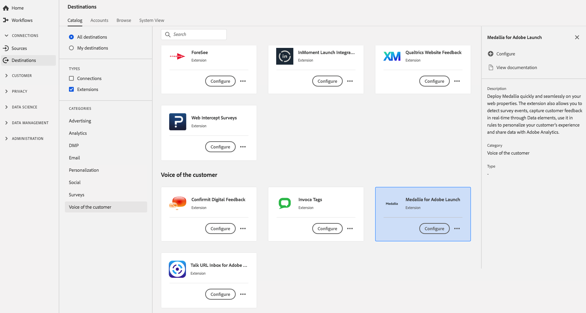

# Extensión de [!DNL Medallia] {#medallia-extension}

## Información general {#overview}

Implemente [!DNL Medallia] de forma rápida y transparente en las propiedades web. La extensión también le permite detectar eventos de encuesta, capturar comentarios de clientes en tiempo real a través de elementos de datos, utilizarlos en reglas para personalizar la experiencia de su cliente y compartir datos con Adobe Analytics.

[!DNL Medallia] es una voz de la extensión de cliente en Adobe Experience Platform. Para obtener más información sobre la funcionalidad de la extensión, consulte la página de extensión en [Adobe Exchange](https://exchange.adobe.com/experiencecloud.details.103279.medallia-for-adobe-launch.html).

Este destino es una extensión de Adobe Experience Platform Launch. Para obtener más información sobre cómo funcionan las extensiones de Launch de plataforma en Platform, consulte [Información general sobre extensiones de Adobe Experience Platform Launch](../launch-extensions/overview.md).

## Requisitos previos {#prerequisites}

Esta extensión está disponible en el catálogo [!DNL Destinations] para todos los clientes que han adquirido Platform.

Para utilizar esta extensión, necesita acceder a Adobe Experience Platform Launch. Platform Launch se ofrece a los clientes de Adobe Experience Cloud como una función de valor añadido incluida. Póngase en contacto con el administrador de su organización para obtener acceso a Inicio de plataforma y pídale que le conceda el permiso **[!UICONTROL manage_properties]** para poder instalar extensiones.

## Extensión de instalación {#install-extension}

Para instalar la extensión [!DNL Medallia]:

En la interfaz [Plataforma](http://platform.adobe.com/), vaya a **[!UICONTROL Destinations]** > **[!UICONTROL Catalog]**.

Seleccione la extensión del catálogo o utilice la barra de búsqueda.

Haga clic en el destino para resaltarlo y, a continuación, seleccione **[!UICONTROL Configurar]** en el carril derecho. Si el control **[!UICONTROL Configurar]** está atenuado, le falta el permiso **[!UICONTROL manage_properties]**. Consulte [Requisitos previos](#prerequisites).

En la ventana **[!UICONTROL Seleccione la propiedad Lanzamiento de plataforma disponible]**, seleccione la propiedad Lanzamiento de plataforma en la que desea instalar la extensión. También tiene la opción de crear una nueva propiedad en Inicio de plataforma. Una propiedad es una colección de reglas, elementos de datos, extensiones configuradas, entornos y bibliotecas. Obtenga información sobre las propiedades en la sección [Propiedades de la página](https://experienceleague.adobe.com/docs/launch/using/reference/admin/companies-and-properties.html#properties-page) de la documentación de Launch de plataforma.

El flujo de trabajo lo lleva al inicio de plataforma para completar la instalación.

Para obtener más información sobre las opciones de configuración de la extensión y la compatibilidad con la instalación, consulte la página [Media en Adobe Exchange](https://exchange.adobe.com/experiencecloud.details.103279.medallia-for-adobe-launch.html).

También puede instalar la extensión directamente en la [interfaz de Adobe Experience Platform Launch](https://launch.adobe.com/). Consulte [Añadir una nueva extensión](https://experienceleague.adobe.com/docs/launch/using/reference/manage-resources/extensions/overview.html?lang=en#add-a-new-extension) en la documentación de Launch de plataforma.

## Cómo usar la extensión {#how-to-use}

Una vez instalada la extensión, puede configurar inicios directamente en Inicio de plataforma.

En Inicio de plataforma, puede configurar reglas para las extensiones instaladas a fin de enviar datos de evento al destino de la extensión únicamente en determinadas situaciones. Para obtener más información sobre la configuración de reglas para las extensiones, consulte [Documentación de reglas](https://experienceleague.adobe.com/docs/launch/using/reference/manage-resources/rules.html).

## Configurar, actualizar y eliminar la extensión {#configure-upgrade-delete}

Puede configurar, actualizar y eliminar extensiones en la interfaz de inicio de plataforma.

>[!TIP]
>
>Si la extensión ya está instalada en una de sus propiedades, la interfaz de usuario de la plataforma aún muestra **[!UICONTROL Install]** para la extensión. Inicie el flujo de trabajo de instalación tal como se describe en [Instalar extensión](#install-extension) para llegar a Inicio de plataforma y configurar o eliminar la extensión.

Para actualizar la extensión, consulte [Actualización de la extensión](https://experienceleague.adobe.com/docs/launch/using/reference/manage-resources/extensions/extension-upgrade.html) en la documentación de Inicio de plataforma.