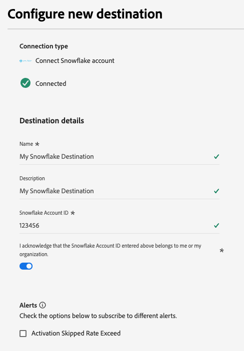

# Conexión por lotes de Snowflake {#snowflake-destination}

>[!AVAILABILITY]
>
>Este conector de destino tiene disponibilidad limitada y solo está disponible para los clientes de Real-Time CDP Ultimate aprovisionados en la [región VA7](/help/landing/multi-cloud.md#azure-regions).

## Información general {#overview}

Utilice este destino para enviar datos de audiencia a tablas dinámicas desde su cuenta de Snowflake. Las tablas dinámicas proporcionan acceso a los datos sin necesidad de copias de datos físicas.

Lea las siguientes secciones para comprender cómo funciona el destino de Snowflake y cómo se transfieren los datos entre Adobe y Snowflake.

### Funcionamiento del uso compartido de datos Snowflake {#data-sharing}

Este destino usa un recurso compartido de datos de [!DNL Snowflake], lo que significa que no se exportarán ni transferirán físicamente datos a su propia instancia de Snowflake. En su lugar, Adobe Systems le concede acceso de solo lectura a una tabla activa alojada en el entorno de Snowflake de Adobe Systems. Puede consultar esta tabla compartida directamente desde su cuenta de Snowflake, pero no es el propietario de la tabla y no puede modificarla ni conservarla más allá del período de retención especificado. Adobe Systems administra completamente el ciclo de vida y la estructura de la tabla compartida.

La primera vez después de configurar un flujo de datos de Adobe Systems a su cuenta de Snowflake, se le pedirá que acepte la lista privada de Adobe Systems.

### Retención de datos y tiempo de vida (TTL) {#ttl}

Todos los datos compartidos a través de esta integración tienen un tiempo de vida (TTL) fijo de siete días. Siete días después de la última exportación, la tabla dinámica caduca automáticamente y se vuelve inaccesible, independientemente de si el flujo de datos sigue activo. Si necesita conservar los datos durante más de siete días, debe copiar el contenido en una tabla suya en su propia instancia de Snowflake antes de que caduque el TTL.

>[!IMPORTANT]
>
>Al eliminar un flujo de datos en Experience Platform, la tabla dinámica desaparecerá de su cuenta de Snowflake.

### Comportamiento de actualización de audiencia {#audience-update-behavior}

Si la audiencia se evalúa en [modo por lotes](../../../segmentation/methods/batch-segmentation.md), los datos de la tabla compartida se actualizarán cada 24 horas. Esto significa que puede haber un retraso de hasta 24 horas entre los cambios en la pertenencia a la audiencia y cuando esos cambios se reflejan en la tabla compartida.

### Lógica de uso compartido de datos por lotes {#batch-data-sharing}

Cuando un flujo de datos se ejecuta para una audiencia por primera vez, realiza un relleno y comparte todos los perfiles cualificados actualmente. Después de este relleno inicial, el destino proporciona instantáneas periódicas del abono de audiencia completo. Cada instantánea reemplaza los datos anteriores de la tabla compartida, lo que garantiza que siempre vea la última vista completa de la audiencia sin datos históricos.

## Streaming frente a uso compartido de datos por lotes {#batch-vs-streaming}

Experience Platform proporciona dos tipos de destinos Snowflake: [Snowflake Streaming](snowflake.md) y [Snowflake Batch](snowflake-batch.md).

Aunque ambos destinos le proporcionan acceso a los datos en Snowflake de forma de copia cero, hay algunas prácticas recomendadas en términos de casos de uso para cada conector.

La siguiente tabla le ayudará a decidir qué conector utilizar, describiendo las situaciones en las que cada método de uso compartido de datos es más adecuado.

|  | Elija [Snowflake Batch](snowflake-batch.md) cuando lo necesite | Elija [Snowflake Streaming](snowflake.md) cuando lo necesite |
|--------|-------------------|----------------------|
| **Frecuencia de actualización** | Instantáneas periódicas | Actualizaciones continuas en tiempo real |
| **Presentación de datos** | Instantánea de audiencia completa que sustituye a los datos anteriores | Actualizaciones incrementales basadas en cambios de perfil |
| **Enfoque en el caso de uso** | Cargas de trabajo analíticas/ML en las que la latencia no es crítica | Situaciones de acción inmediata que requieren actualizaciones en tiempo real |
| **Administración de datos** | Ver siempre la instantánea completa más reciente | Actualizaciones incrementales basadas en los cambios de miembros de audiencia |
| **Escenarios de ejemplo** | Creación de informes empresariales, análisis de datos, formación sobre modelos XML | Supresión de campañas de marketing, personalización en tiempo real |

Para obtener más información sobre el uso compartido de datos de streaming, consulte la [documentación de Snowflake Streaming connection](snowflake.md).

## Casos de uso {#use-cases}

El uso compartido de datos por lotes es ideal para aquellos casos en los que necesita una instantánea completa de su audiencia y no se requieren actualizaciones en tiempo real, como las siguientes:

* **Cargas de trabajo analíticas**: al realizar tareas de análisis de datos, creación de informes o inteligencia empresarial que requieran una vista completa de la pertenencia a audiencias
* **Flujos de trabajo de aprendizaje automático**: para entrenar modelos XML o ejecutar análisis predictivos que se beneficien de instantáneas de audiencia completas
* **Almacenamiento de datos**: Cuando necesite mantener una copia actual de los datos de audiencia en su propia instancia de Snowflake
* **Informes periódicos**: para informes comerciales regulares donde necesita el último estado de audiencia sin seguimiento de cambios históricos
* **Procesos de ETL**: Cuando necesite transformar o procesar datos de audiencia por lotes

El uso compartido de datos por lotes simplifica la administración de datos al proporcionar instantáneas completas, lo que elimina la necesidad de administrar actualizaciones incrementales o combinar los cambios manualmente.

## Requisitos previos {#prerequisites}

Antes de configurar la conexión de Snowflake, asegúrese de cumplir los siguientes requisitos previos:

* Tiene acceso a una cuenta de [!DNL Snowflake].
* Tu cuenta de Snowflake está suscrita a anuncios privados. Usted o alguien de su compañía que tenga privilegios de administrador de cuentas en Snowflake puede configurarlo.

Lea la [[!DNL Snowflake] documentación](https://docs.snowflake.com/en/collaboration/consumer-listings-access#access-a-private-listing) para obtener más información sobre los permisos necesarios.

## Audiencias compatibles {#supported-audiences}

Esta sección describe qué tipos de audiencias puede exportar a este destino. Las dos tablas siguientes indican qué audiencias admite este conector, según los _tipos de origen de audiencia_ y _perfil incluidos en la audiencia_:

| Origen de audiencia | Admitido | Descripción |
|---------|----------|----------|
| [!DNL Segmentation Service] | ✓ | Audiencias generadas a través del [servicio de segmentación](../../../segmentation/home.md) de Experience Platform. |
| Todos los demás orígenes de audiencia | ✓ | Esta categoría incluye todos los orígenes de audiencia fuera de las audiencias generadas a través de [!DNL Segmentation Service]. Obtenga información acerca de [varios orígenes de audiencia](/help/segmentation/ui/audience-portal.md#customize). Algunos ejemplos son: <ul><li> audiencias de carga personalizadas [importadas](../../../segmentation/ui/audience-portal.md#import-audience) a Experience Platform desde archivos CSV,</li><li> audiencias de similitud, </li><li> audiencias federadas, </li><li> audiencias generadas en otras aplicaciones de Experience Platform, como Adobe Systems Journey Optimizer, </li><li> y más. </li></ul> |

{style="table-layout:auto"}

Audiencias admitidas por tipo audiencia datos:

| Tipo de datos de audiencia | Admitido | Descripción | Casos de uso |
|--------------------|-----------|-------------|-----------|
| [Audiencias de personas](/help/segmentation/types/people-audiences.md) | ✓ | Basado en perfiles de clientes, lo que le permite dirigirse a grupos específicos de personas para campañas de marketing. | Compradores frecuentes, abandonadores del carro de compras |
| [Audiencias de la cuenta](/help/segmentation/types/account-audiences.md) | No | Segmente a individuos dentro de organizaciones específicas para estrategias de marketing basadas en cuentas. | Marketing B2B |
| [Audiencias potenciales](/help/segmentation/types/prospect-audiences.md) | No | Dirija la actividad a personas que aún no sean clientes, pero que compartan características con la audiencia a la que va dirigida. | Prospección con datos de terceros |
| [Exportaciones de conjuntos de datos](/help/catalog/datasets/overview.md) | No | Recopilaciones de datos estructurados almacenados en el lago de datos de Adobe Experience Platform. | Informes, flujos de trabajo de ciencia de datos |

{style="table-layout:auto"}

## Tipo y frecuencia de exportación {#export-type-frequency}

Consulte la tabla siguiente para obtener información sobre el tipo y la frecuencia de exportación de destino.

| Elemento | Tipo | Notas |
|---------|----------|---------|
| Tipo de exportación | **[!UICONTROL Audience export]** | Está exportando todos los miembros de una audiencia con los identificadores (nombre, número de teléfono u otros) utilizados en el destino [!DNL Snowflake]. |
| Frecuencia de exportación | **[!UICONTROL Batch]** | Este destino proporciona instantáneas periódicas de todos los miembros de la audiencia a través del uso compartido de datos de Snowflake. Cada instantánea reemplaza a los datos anteriores, lo que garantiza que siempre tenga la última vista completa de la audiencia. |

{style="table-layout:auto"}

## Conectar con el destino {#connect}

>[!IMPORTANT]
> 
>Para conectarse al destino, necesita los **[!UICONTROL View Destinations]** y **[!UICONTROL Manage Destinations]** [permisos de control de acceso](/help/access-control/home.md#permissions). Lea la [descripción general del control de acceso](/help/access-control/ui/overview.md) o póngase en contacto con el administrador del producto para obtener los permisos necesarios.

Para conectarse a este destino, siga los pasos descritos en el [tutorial de configuración de destino](../../ui/connect-destination.md). En el flujo de trabajo de configuración de destino, rellene los campos enumerados en las dos secciones siguientes.

### Autenticarse en el destino {#authenticate}

Para autenticarse en el destino, seleccione **[!UICONTROL Connect to destination]** y proporcione un nombre de cuenta y, opcionalmente, una descripción de cuenta.

### Rellenar detalles de destino {#destination-details}

>[!CONTEXTUALHELP]
>id="platform_destinations_snowflake_batch_accountID"
>title="Escriba su ID de cuenta técnica de Snofwflake "
>abstract="Si su cuenta está vinculada a una organización, use este formato: `OrganizationName.AccountName`   Si su cuenta no está vinculada a una organización, use este formato:`AccountName`"

Para configurar los detalles del destino, rellene los campos obligatorios y opcionales a continuación. Un asterisco junto a un campo en la interfaz de usuario indica que el campo es obligatorio.

* **[!UICONTROL Name]**: un nombre con el cual reconocerá este destino en el futuro.
* **[!UICONTROL Description]**: una descripción que le ayudará a identificar este destino en el futuro.
* **[!UICONTROL Snowflake Account ID]**: su ID de cuenta de Snowflake. Utilice el siguiente formato de ID de cuenta en función de si su cuenta está vinculada a una organización:
   * Si su cuenta está vinculada a una organización:`OrganizationName.AccountName`.
   * Si su cuenta no está vinculada a una organización:`AccountName`.
* **[!UICONTROL Account acknowledgment]**: active la confirmación de ID de cuenta de Snowflake para confirmar que el ID de cuenta es correcto y le pertenece.

>[!IMPORTANT]
>
> Los caracteres especiales utilizados en el nombre de destino y en el nombre de la zona protegida de Experience Platform se convierten automáticamente en guiones bajos (`_`) en Snowflake. Para evitar confusiones, no utilice caracteres especiales en el nombre del destino y de la zona protegida.

### Habilitar alertas {#enable-alerts}

Puede activar alertas para recibir notificaciones sobre el estado del flujo de datos a su destino. Seleccione una alerta de la lista a la que suscribirse para recibir notificaciones sobre el estado del flujo de datos. Para obtener más información sobre las alertas, lea la guía sobre [suscripción a alertas de destinos mediante la interfaz de usuario](../../ui/alerts.md).

Cuando termine de proporcionar detalles para la conexión de destino, seleccione **[!UICONTROL Next]**.

## Activar públicos en este destino {#activate}

>[!IMPORTANT]
> 
>* Para activar los datos, necesita los permisos de control de acceso **[!UICONTROL View Destinations]**, **[!UICONTROL Activate Destinations]**, **[!UICONTROL View Profiles]** y **[!UICONTROL View Segments]** [5}. ](/help/access-control/home.md#permissions) Lea la [descripción general del control de acceso](/help/access-control/ui/overview.md) o póngase en contacto con el administrador del producto para obtener los permisos necesarios.
>* Para exportar *identidades*, necesita el **[!UICONTROL View Identity Graph]** [permiso de control de acceso](/help/access-control/home.md#permissions).   {width="100" zoomable="yes"}

Consulte [Activar audiencia datos para lotes perfil destinos de exportación](/help/destinations/ui/activate-batch-profile-destinations.md) para obtener instrucciones sobre cómo activar audiencias en este destino.

### Atributos de mapa {#map}

Puede exportar identidades y atributos de perfil a este destino.

Puede usar el [control de campos calculados](../../ui/data-transformations-calculated-fields.md) para exportar y realizar operaciones en matrices.

Los atributos de destino se crean automáticamente en Snowflake utilizando el nombre de atributo proporcionado en el campo **[!UICONTROL Attribute name]**.

## Datos exportados / Validar exportación de datos {#exported-data}

Los datos se almacenan en zona intermedia en la cuenta de Snowflake a través de una tabla dinámica. Compruebe su cuenta de Snowflake para comprobar que los datos se exportaron correctamente.

### Estructura de datos {#data-structure}

La tabla dinámica contiene las siguientes columnas:

* **TS**: una columna de marca de tiempo que representa cuándo se actualizó cada fila por última vez
* **Atributos de asignación**: cada atributo de asignación que seleccione durante el flujo de trabajo de activación se representa como un encabezado de columna en Snowflake
* **Pertenencia a audiencias**: La pertenencia a cualquier audiencia asignada al flujo de datos se indica mediante una entrada de `active` en la celda correspondiente

## Limitaciones conocidas {#known-limitations}

### Restricción de política de combinación predeterminada {#default-merge-policy-restriction}

Actualmente, solo se pueden exportar las audiencias asignadas al directiva de combinación predeterminado.

### Disponibilidad regional {#regional-availability}

Actualmente, el [!DNL Snowflake] destino del lote solo está disponible para los clientes de CDP en tiempo real aprovisionados en el área geográfica Experience Platform VA7.

## Uso y control de datos {#data-usage-governance}

Todos los destinos de [!DNL Adobe Experience Platform] cumplen con las políticas de uso de datos al administrar los datos. Para obtener información detallada sobre cómo [!DNL Adobe Experience Platform] aplica el control de datos, lea la [Información general sobre el control de datos](/help/data-governance/home.md).
