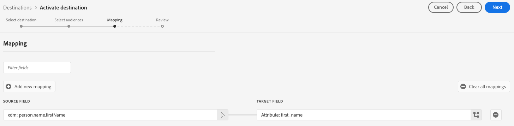
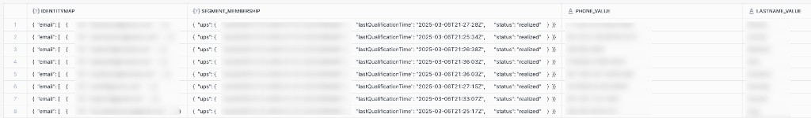

# Conexión de flujo Snowflake {#snowflake-destination}

>[!AVAILABILITY]
>
>Este conector de destino tiene disponibilidad limitada y solo está disponible para [!DNL Real-Time CDP] clientes de Ultimate aprovisionados en la [región VA7](/help/landing/multi-cloud.md#azure-regions).

## Información general {#overview}

Use el conector de destino de Snowflake para exportar datos a la instancia de Snowflake de Adobe, que Adobe luego compartirá con su instancia a través de [listados privados](https://other-docs.snowflake.com/en/collaboration/collaboration-listings-about).

Lea las siguientes secciones para comprender cómo funciona el destino de Snowflake y cómo se transfieren los datos entre Adobe y Snowflake.

### Funcionamiento del uso compartido de datos Snowflake {#data-sharing}

Este destino usa un recurso compartido de datos de [!DNL Snowflake], lo que significa que no se exportarán ni transferirán físicamente datos a su propia instancia de Snowflake. En su lugar, Adobe le concede acceso de solo lectura a una tabla activa alojada en el entorno de Snowflake de Adobe. Puede consultar esta tabla compartida directamente desde su cuenta de Snowflake, pero no es el propietario de la tabla y no puede modificarla ni conservarla más allá del período de retención especificado. Adobe administra completamente el ciclo de vida y la estructura de la tabla compartida.

La primera vez que comparta datos de la instancia de Snowflake de Adobe con la suya, se le pedirá que acepte el anuncio privado de Adobe.

### Retención de datos y tiempo de vida (TTL) {#ttl}

Todos los datos compartidos a través de esta integración tienen un tiempo de vida (TTL) fijo de siete días. Siete días después de la última exportación, la tabla compartida caduca automáticamente y se vuelve inaccesible, independientemente de si el flujo de datos sigue activo. Si necesita conservar los datos durante más de siete días, debe copiar el contenido en una tabla suya en su propia instancia de Snowflake antes de que caduque el TTL.

### Comportamiento de actualización de audiencia {#audience-update-behavior}

Si la audiencia se evalúa en [modo por lotes](../../../segmentation/methods/batch-segmentation.md), los datos de la tabla compartida se actualizarán cada 24 horas. Esto significa que puede haber un retraso de hasta 24 horas entre los cambios en la pertenencia a la audiencia y cuando esos cambios se reflejan en la tabla compartida.

### Lógica de exportación incremental {#incremental-export}

Cuando un flujo de datos se ejecuta para una audiencia por primera vez, realiza un relleno y comparte todos los perfiles cualificados actualmente. Después de este relleno inicial, solo las actualizaciones incrementales se reflejan en la tabla compartida. Esto significa que los perfiles se añaden o eliminan de la audiencia. Este método garantiza actualizaciones eficientes y mantiene la tabla compartida actualizada.

## Streaming frente a uso compartido de datos por lotes {#batch-vs-streaming}

[!DNL Adobe Experience Platform] proporciona dos tipos de destinos [!DNL Snowflake]: [Flujo Snowflake](snowflake.md) y [Lote Snowflake](snowflake-batch.md).

La siguiente tabla le ayudará a decidir qué destino utilizar. Describa las situaciones en las que cada método de uso compartido de datos es más adecuado.

|  | Elija [Snowflake Batch](snowflake-batch.md) cuando lo necesite | Elija [Snowflake Streaming](snowflake.md) cuando lo necesite |
|--------|-------------------|----------------------|
| **Frecuencia de actualización** | Instantáneas periódicas | Actualizaciones continuas en tiempo real |
| **Presentación de datos** | Instantánea de audiencia completa que sustituye a los datos anteriores | Actualizaciones incrementales basadas en cambios de perfil |
| **Enfoque en el caso de uso** | Cargas de trabajo analíticas/ML en las que la latencia no es crítica | Situaciones de acción inmediata que requieren actualizaciones en tiempo real |
| **Administración de datos** | Ver siempre la instantánea completa más reciente | Actualizaciones incrementales basadas en los cambios de miembros de audiencia |
| **Escenarios de ejemplo** | Creación de informes empresariales, análisis de datos, formación sobre modelos XML | Supresión de campañas de marketing, personalización en tiempo real |

Para obtener más información sobre el uso compartido de datos por lotes, consulte la [documentación sobre la conexión por lotes de Snowflake](snowflake-batch.md).

## Casos de uso {#use-cases}

El uso compartido de datos de streaming es ideal para situaciones en las que se necesita una actualización inmediata cuando un perfil cambia su pertenencia u otros atributos. Esto es crucial para los casos de uso que requieren capacidad de respuesta en tiempo real, como:

* **Supresión de campañas de marketing**: elimine inmediatamente las campañas de marketing de los usuarios que hayan realizado acciones específicas, como suscribirse a un servicio o realizar una compra
* **Personalización en tiempo real**: Actualice las experiencias del usuario de forma instantánea cuando cambian los atributos del perfil, como cuando un usuario visita un sitio web, ve una página de producto o agrega artículos a un carro de compras
* **Escenarios de acción inmediata**: ejecute la supresión rápida y el retargeting según los datos en tiempo real para reducir los retrasos y garantizar que las campañas de marketing sean más relevantes y oportunas
* **Eficiencia y matices**: Habilite una mayor eficiencia y matices en los esfuerzos de marketing al permitir una respuesta rápida a los cambios de comportamiento del usuario
* **Optimización del recorrido de clientes en tiempo real**: Actualice las experiencias de los clientes inmediatamente cuando cambie la pertenencia a segmentos o los atributos de perfil

El uso compartido de datos de streaming proporciona actualizaciones continuas en función de cambios de segmento, cambios de mapa de identidad o cambios de atributo, lo que lo hace adecuado cuando importa la baja latencia.

## Requisitos previos {#prerequisites}

Antes de configurar la conexión de Snowflake, asegúrese de cumplir los siguientes requisitos previos:

* Tiene acceso a una cuenta de [!DNL Snowflake].
* Su cuenta de [!DNL Snowflake] está suscrita a anuncios privados. Usted o alguien de su compañía que tenga privilegios de administrador de cuentas en [!DNL Snowflake] puede configurarlo.
* Conoce la región de su cuenta de [!DNL Snowflake], que seleccionará en un menú desplegable al conectarse al destino.

Lea la [[!DNL Snowflake] documentación](https://docs.snowflake.com/en/collaboration/consumer-listings-access#access-a-private-listing) para obtener más información sobre los permisos necesarios.

## Audiencias compatibles {#supported-audiences}

Esta sección describe qué tipos de audiencias puede exportar a este destino. Las dos tablas siguientes indican qué audiencias admite este conector, según los _tipos de origen de audiencia_ y _perfil incluidos en la audiencia_:

| Origen de audiencia | Admitido | Descripción |
|---------|----------|----------|
| [!DNL Segmentation Service] | Sí | Audiencias generadas a través del [!DNL Adobe Experience Platform] [servicio de segmentación](../../../segmentation/home.md). |
| Todos los demás orígenes de audiencia | Sí | Esta categoría incluye todos los orígenes de audiencia fuera de las audiencias generadas a través de [!DNL Segmentation Service]. Obtenga información acerca de [varios orígenes de audiencia](/help/segmentation/ui/audience-portal.md#customize). Algunos ejemplos son: <ul><li> audiencias de carga personalizadas [importadas](../../../segmentation/ui/audience-portal.md#import-audience) en [!DNL Adobe Experience Platform] desde archivos CSV,</li><li> audiencias de similitud, </li><li> audiencias federadas, </li><li> audiencias generadas en otras [!DNL Adobe Experience Platform] aplicaciones como [!DNL Adobe Journey Optimizer], </li><li> y más. </li></ul> |

{style="table-layout:auto"}

Audiencias compatibles por tipo de datos de audiencia:

| Tipo de datos de audiencia | Admitido | Descripción | Casos de uso |
|--------------------|-----------|-------------|-----------|
| [Audiencias de personas](/help/segmentation/types/people-audiences.md) | Sí | Basado en perfiles de clientes, lo que le permite dirigirse a grupos específicos de personas para campañas de marketing. | Compradores frecuentes, abandonadores del carro de compras |
| [Audiencias de la cuenta](/help/segmentation/types/account-audiences.md) | No | Segmente a individuos dentro de organizaciones específicas para estrategias de marketing basadas en cuentas. | Marketing B2B |
| [Audiencias potenciales](/help/segmentation/types/prospect-audiences.md) | No | Dirija la actividad a personas que aún no sean clientes, pero que compartan características con la audiencia a la que va dirigida. | Prospección con datos de terceros |
| [Exportaciones de conjuntos de datos](/help/catalog/datasets/overview.md) | No | Colecciones de datos estructurados almacenados en el lago de datos [!DNL Adobe Experience Platform]. | Informes, flujos de trabajo de ciencia de datos |

{style="table-layout:auto"}

## Tipo y frecuencia de exportación {#export-type-frequency}

Consulte la tabla siguiente para obtener información sobre el tipo y la frecuencia de exportación de destino.

| Elemento | Tipo | Notas |
|---------|----------|---------|
| Tipo de exportación | **[!UICONTROL Audience export]** | Está exportando todos los miembros de una audiencia con los identificadores (nombre, número de teléfono u otros) utilizados en el destino [!DNL Snowflake]. |
| Frecuencia de exportación | **[!UICONTROL Streaming]** | Los destinos de streaming son conexiones basadas en API &quot;siempre activadas&quot;. Tan pronto como se actualiza un perfil en [!DNL Adobe Experience Platform] según la evaluación de audiencia, el conector envía la actualización descendente a la plataforma de destino. Más información sobre [destinos de streaming](/help/destinations/destination-types.md#streaming-destinations). |

{style="table-layout:auto"}

## Conectar con el destino {#connect}

>[!IMPORTANT]
>
>Para conectarse al destino, necesita los **[!UICONTROL View Destinations]** y **[!UICONTROL Manage Destinations]** [permisos de control de acceso](/help/access-control/home.md#permissions). Lea la [descripción general del control de acceso](/help/access-control/ui/overview.md) o póngase en contacto con el administrador del producto para obtener los permisos necesarios.

Para conectarse a este destino, siga los pasos descritos en el [tutorial de configuración de destino](../../ui/connect-destination.md). En el flujo de trabajo de configuración de destino, rellene los campos enumerados en las dos secciones siguientes.

### Autenticarse en el destino {#authenticate}

Para autenticarse en el destino, seleccione **[!UICONTROL Connect to destination]**.

### Rellenar detalles de destino {#destination-details}

>[!CONTEXTUALHELP]
>id="platform_destinations_snowflake_accountID"
>title="Escriba su ID de cuenta técnica de Snofwflake "
>abstract="Si su cuenta está vinculada a una organización, use este formato: `OrganizationName.AccountName`  Si su cuenta no está vinculada a una organización, use este formato: `AccountName`"

Para configurar los detalles del destino, rellene los campos obligatorios y opcionales a continuación. Un asterisco junto a un campo en la interfaz de usuario indica que el campo es obligatorio.

* **[!UICONTROL Name]**: un nombre con el cual reconocerá este destino en el futuro.
* **[!UICONTROL Description]**: una descripción que le ayudará a identificar este destino en el futuro.
* **[!UICONTROL Snowflake Account ID]**: su ID de cuenta de Snowflake. Utilice el siguiente formato de ID de cuenta en función de si su cuenta está vinculada a una organización:
   * Si su cuenta está vinculada a una organización:`OrganizationName.AccountName`.
   * Si su cuenta no está vinculada a una organización:`AccountName`.
* **[!UICONTROL Account acknowledgment]**: active la confirmación de ID de cuenta de Snowflake para confirmar que el ID de cuenta es correcto y le pertenece.

>[!NOTE]
>
> No se puede editar **[!UICONTROL Snowflake Account ID]** a través del flujo de trabajo [editar destino](../../ui/edit-destination.md) después de crear el destino. Para usar una cuenta diferente, [cree una nueva conexión de destino](../../ui/connect-destination.md).

>[!IMPORTANT]
>
> Los caracteres especiales utilizados en el nombre de destino y en el nombre de la zona protegida [!DNL Adobe Experience Platform] se convierten automáticamente en guiones bajos (`_`) en [!DNL Snowflake]. Para evitar confusiones, no utilice caracteres especiales en el nombre del destino y de la zona protegida.

### Habilitar alertas {#enable-alerts}

Puede activar alertas para recibir notificaciones sobre el estado del flujo de datos a su destino. Seleccione una alerta de la lista a la que suscribirse para recibir notificaciones sobre el estado del flujo de datos. Para obtener más información sobre las alertas, lea la guía sobre [suscripción a alertas de destinos mediante la interfaz de usuario](../../ui/alerts.md).

Cuando termine de proporcionar detalles para la conexión de destino, seleccione **[!UICONTROL Next]**.

## Activar públicos en este destino {#activate}

>[!IMPORTANT]
>
>* Para activar los datos, necesita los permisos de control de acceso **[!UICONTROL View Destinations]**, **[!UICONTROL Activate Destinations]**, **[!UICONTROL View Profiles]** y **[!UICONTROL View Segments]** [5}. ](/help/access-control/home.md#permissions) Lea la [descripción general del control de acceso](/help/access-control/ui/overview.md) o póngase en contacto con el administrador del producto para obtener los permisos necesarios.
>* Para exportar *identidades*, necesita el **[!UICONTROL View Identity Graph]** [permiso de control de acceso](/help/access-control/home.md#permissions).   {width="100" zoomable="yes"}

Lea [Activar perfiles y audiencias en destinos de exportación de audiencias de streaming](/help/destinations/ui/activate-segment-streaming-destinations.md) para obtener instrucciones sobre cómo activar audiencias en este destino.

### Asignar atributos {#map}

El destino de Snowflake admite la asignación de atributos de perfil a atributos personalizados.

Los atributos de destino se crean automáticamente en Snowflake utilizando el nombre de atributo proporcionado en el campo **[!UICONTROL Attribute name]**.

## Datos exportados / Validar exportación de datos {#exported-data}

Los datos se comparten en la cuenta de Snowflake a través de una tabla compartida. Compruebe su cuenta de Snowflake para comprobar que los datos se exportaron correctamente.

El siguiente ejemplo muestra filas de muestra de una tabla compartida: algunas columnas almacenan identidades y pertenencia a segmentos como JSON; los atributos de perfil asignados aparecen como columnas de cadena independientes.

 {align="center" zoomable="yes"}

### Estructura de datos {#data-structure}

La captura de pantalla anterior muestra las siguientes columnas:

* **IDENTITYMAP**: objeto JSON para cada mapa de identidad de perfil.
* **SEGMENT_MEMBERSHIP**: objeto JSON para cada audiencia activada en el flujo de datos. Los valores incluyen `lastQualificationTime` y `status` (por ejemplo `realized` cuando el perfil se califica para el segmento).
* **Atributos de asignación**: cada atributo de asignación que seleccione durante el flujo de trabajo de activación se representa como un encabezado de columna en [!DNL Snowflake].

## Uso de datos y gobernanza {#data-usage-governance}

Todos los destinos de [!DNL Adobe Experience Platform] cumplen con las políticas de uso de datos al administrar los datos. Para obtener información detallada sobre cómo [!DNL Adobe Experience Platform] aplica el control de datos, lea la [Información general sobre el control de datos](/help/data-governance/home.md).
