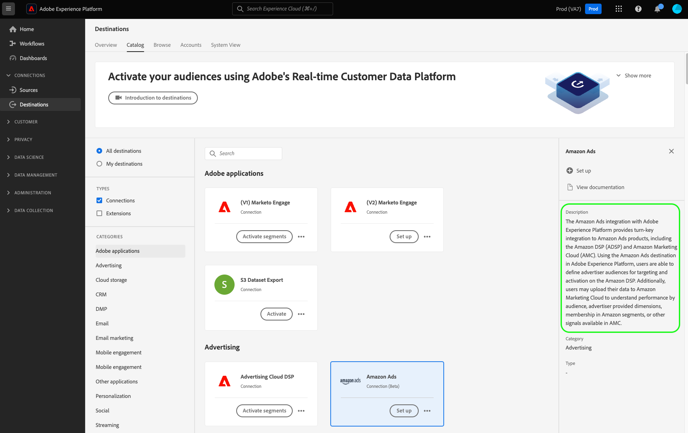
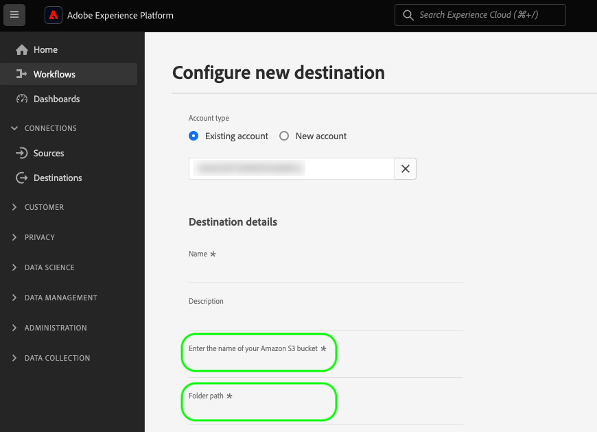
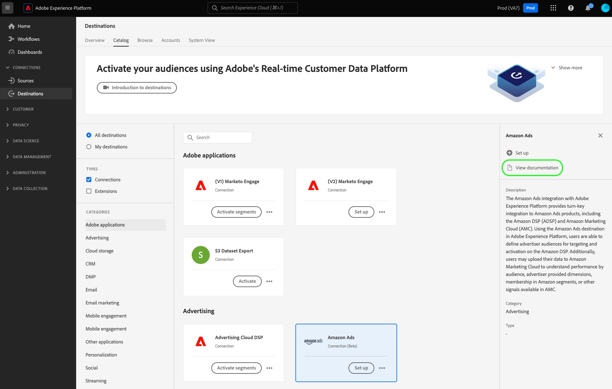

# Crear una configuración de destino

Esta página ejemplifica la solicitud de API y la carga útil que puede utilizar para crear su propia configuración de destino mediante el extremo de API `/authoring/destinations`.

Para obtener una descripción detallada de las capacidades que puede configurar a través de este extremo, lea los siguientes artículos:

* [Configuración de autenticación del cliente](../../functionality/destination-configuration/customer-authentication.md)
* [Autorización de OAuth2](../../functionality/destination-configuration/oauth2-authorization.md)
* [Campos de datos del cliente](../../functionality/destination-configuration/customer-data-fields.md)
* [Atributos de IU](../../functionality/destination-configuration/ui-attributes.md)
* [Configuración del esquema](../../functionality/destination-configuration/schema-configuration.md)
* [Configuración del área de nombres de identidad](../../functionality/destination-configuration/identity-namespace-configuration.md)
* [Envío de destino](../../functionality/destination-configuration/destination-delivery.md)
* [Configuración de metadatos de audiencia](../../functionality/destination-configuration/audience-metadata-configuration.md)
* [Configuración de metadatos de audiencia](../../functionality/destination-configuration/audience-metadata-configuration.md)
* [Política de agregación](../../functionality/destination-configuration/aggregation-policy.md)
* [Configuración por lotes](../../functionality/destination-configuration/batch-configuration.md)
* [Cualificaciones históricas del perfil](../../functionality/destination-configuration/historical-profile-qualifications.md)

>[!IMPORTANT]
>
>Todos los nombres y valores de parámetro admitidos por Destination SDK distinguen entre mayúsculas y minúsculas **1&rbrace;.** Para evitar errores de distinción entre mayúsculas y minúsculas, utilice los nombres y valores de los parámetros exactamente como se muestra en la documentación.

## Introducción a las operaciones de la API de configuración de destino {#get-started}

Antes de continuar, revisa la [guía de introducción](../../getting-started.md) para obtener información importante que necesitas saber para realizar llamadas a la API correctamente, incluyendo cómo obtener el permiso de creación de destino requerido y los encabezados requeridos.

## Crear una configuración de destino {#create}

Puede crear una nueva configuración de destino realizando una petición POST al extremo `/authoring/destinations`.

>[!TIP]
>
>**extremo de API**: `platform.adobe.io/data/core/activation/authoring/destinations`

**Formato de API**

```http
POST /authoring/destinations
```

La siguiente solicitud crea una nueva configuración de destino [!DNL Amazon S3], configurada por los parámetros proporcionados en la carga útil. La carga útil siguiente incluye todos los parámetros para destinos basados en archivos aceptados por el extremo `/authoring/destinations`.

Tenga en cuenta que no tiene que añadir todos los parámetros a la llamada de API y que la carga útil se puede personalizar, según los requisitos de la API.

+++Solicitud

```shell
curl -X POST https://platform.adobe.io/data/core/activation/authoring/destinations \
 -H 'Authorization: Bearer {ACCESS_TOKEN}' \
 -H 'Content-Type: application/json' \
 -H 'x-gw-ims-org-id: {ORG_ID}' \
 -H 'x-api-key: {API_KEY}' \
 -H 'x-sandbox-name: {SANDBOX_NAME}' \
 -d '
{
   "name":"Amazon S3 destination with predefined CSV formatting options",
   "description":"Amazon S3 destination with predefined CSV formatting options",
   "status":"TEST",
   "customerAuthenticationConfigurations":[
      {
         "authType":"S3"
      }
   ],
   "customerDataFields":[
      {
         "name":"bucket",
         "title":"Enter the name of your Amazon S3 bucket",
         "description":"Amazon S3 bucket name",
         "type":"string",
         "isRequired":true,
         "readOnly":false,
         "hidden":false
      },
      {
         "name":"path",
         "title":"Enter the path to your S3 bucket folder",
         "description":"Enter the path to your S3 bucket folder",
         "type":"string",
         "isRequired":true,
         "pattern":"^[A-Za-z]+$",
         "readOnly":false,
         "hidden":false
      },
      {
         "name":"compression",
         "title":"Compression format",
         "description":"Select the desired file compression format.",
         "type":"string",
         "isRequired":true,
         "readOnly":false,
         "enum":[
            "SNAPPY",
            "GZIP",
            "DEFLATE",
            "NONE"
         ]
      },
      {
         "name":"fileType",
         "title":"Select a fileType",
         "description":"Select fileType",
         "type":"string",
         "isRequired":true,
         "readOnly":false,
         "hidden":false,
         "enum":[
            "csv",
            "json",
            "parquet"
         ],
         "default":"csv"
      }
   ],
   "uiAttributes":{
      "documentationLink":"https://www.adobe.com/go/destinations-amazon-s3-en",
      "category":"cloudStorage",
      "icon":{
         "key":"amazonS3"
      },
      "connectionType":"S3",
      "frequency":"Batch"
   },
   "destinationDelivery":[
      {
         "deliveryMatchers":[
            {
               "type":"SOURCE",
               "value":[
                  "batch"
               ]
            }
         ],
         "authenticationRule":"CUSTOMER_AUTHENTICATION",
         "destinationServerId":"{{destinationServerId}}"
      }
   ],
   "schemaConfig":{
      "profileRequired":true,
      "segmentRequired":true,
      "identityRequired":true
   },
   "batchConfig":{
      "allowMandatoryFieldSelection":true,
      "allowDedupeKeyFieldSelection":true,
      "defaultExportMode":"DAILY_FULL_EXPORT",
      "allowedExportMode":[
         "DAILY_FULL_EXPORT",
         "FIRST_FULL_THEN_INCREMENTAL"
      ],
      "allowedScheduleFrequency":[
         "DAILY",
         "EVERY_3_HOURS",
         "EVERY_6_HOURS",
         "EVERY_8_HOURS",
         "EVERY_12_HOURS",
         "ONCE"
      ],
      "defaultFrequency":"DAILY",
      "defaultStartTime":"00:00",
      "filenameConfig":{
         "allowedFilenameAppendOptions":[
            "SEGMENT_NAME",
            "DESTINATION_INSTANCE_ID",
            "DESTINATION_INSTANCE_NAME",
            "ORGANIZATION_NAME",
            "SANDBOX_NAME",
            "DATETIME",
            "CUSTOM_TEXT"
         ],
         "defaultFilenameAppendOptions":[
            "DATETIME"
         ],
         "defaultFilename":"%DESTINATION%_%SEGMENT_ID%"
      },
      "backfillHistoricalProfileData":true
   }
}'
```

| Parámetro | Tipo | Descripción |
|---------|----------|------|
| `name` | Cadena | Indica el título del destino en el catálogo de Experience Platform. |
| `description` | Cadena | Proporcione una descripción que Adobe utilizará en el catálogo de destinos de Experience Platform para la tarjeta de destino. Apunte a no más de 4-5 oraciones. {width="100" zoomable="yes"} |
| `status` | Cadena | Indica el estado del ciclo vital de la tarjeta de destino. Los valores aceptados son `TEST`, `PUBLISHED` y `DELETED`. Use `TEST` la primera vez que configure el destino. |
| `customerAuthenticationConfigurations.authType` | Cadena | Indica la configuración utilizada para autenticar clientes de Experience Platform en el servidor de destino. Consulte [configuración de autenticación de cliente](../../functionality/destination-configuration/customer-authentication.md) para obtener información detallada sobre los tipos de autenticación admitidos. |
| `customerDataFields.name` | Cadena | Proporcione un nombre para el campo personalizado que está introduciendo. <br/><br/> Consulte [Campos de datos del cliente](../../functionality/destination-configuration/customer-data-fields.md) para obtener información detallada sobre esta configuración. {width="100" zoomable="yes"} |
| `customerDataFields.type` | Cadena | Indica qué tipo de campo personalizado está introduciendo. Los valores aceptados son `string`, `object`, `integer`. <br/><br/> Consulte [Campos de datos del cliente](../../functionality/destination-configuration/customer-data-fields.md) para obtener información detallada sobre esta configuración. |
| `customerDataFields.title` | Cadena | Indica el nombre del campo tal como lo ven los clientes en la interfaz de usuario de Experience Platform. <br/><br/> Consulte [Campos de datos del cliente](../../functionality/destination-configuration/customer-data-fields.md) para obtener información detallada sobre esta configuración. |
| `customerDataFields.description` | Cadena | Proporcione una descripción para el campo personalizado. Consulte [Campos de datos de clientes](../../functionality/destination-configuration/customer-data-fields.md) para obtener información detallada sobre esta configuración. |
| `customerDataFields.isRequired` | Booleano | Indica si este campo es necesario en el flujo de trabajo de configuración de destino. <br/><br/> Consulte [Campos de datos del cliente](../../functionality/destination-configuration/customer-data-fields.md) para obtener información detallada sobre esta configuración. |
| `customerDataFields.enum` | Cadena | Procesa el campo personalizado como un menú desplegable y enumera las opciones disponibles para el usuario. <br/><br/> Consulte [Campos de datos del cliente](../../functionality/destination-configuration/customer-data-fields.md) para obtener información detallada sobre esta configuración. |
| `customerDataFields.default` | Cadena | Define el valor predeterminado de una lista `enum`. |
| `customerDataFields.pattern` | Cadena | Aplica un motivo al campo personalizado, si es necesario. Utilice expresiones regulares para aplicar un patrón. Por ejemplo, si los ID de cliente no incluyen números ni guiones bajos, escriba `^[A-Za-z]+$` en este campo. <br/><br/> Consulte [Campos de datos del cliente](../../functionality/destination-configuration/customer-data-fields.md) para obtener información detallada sobre esta configuración. |
| `uiAttributes.documentationLink` | Cadena | Hace referencia a la página de documentación del [catálogo de destinos](https://experienceleague.adobe.com/docs/experience-platform/destinations/catalog/overview.html#catalog) para su destino. Use `https://www.adobe.com/go/destinations-YOURDESTINATION-en`, donde `YOURDESTINATION` es el nombre de su destino. Para un destino llamado Moviestar, utilizaría `https://www.adobe.com/go/destinations-moviestar-en`. Tenga en cuenta que este vínculo solo funciona después de que Adobe active el destino y se publique la documentación. <br/><br/> Consulte [atributos de interfaz de usuario](../../functionality/destination-configuration/ui-attributes.md) para obtener información detallada sobre esta configuración. {width="100" zoomable="yes"} |
| `uiAttributes.category` | Cadena | Hace referencia a la categoría asignada a su destino en [!DNL Adobe Experience Platform]. Para obtener más información, lea [Categorías de destino](https://experienceleague.adobe.com/docs/experience-platform/rtcdp/destinations/destination-types.html#destination-categories). Use uno de los siguientes valores: `adobeSolutions, advertising, analytics, cdp, cloudStorage, crm, customerSuccess, database, dmp, ecommerce, email, emailMarketing, enrichment, livechat, marketingAutomation, mobile, personalization, protocols, social, streaming, subscriptions, surveys, tagManagers, voc, warehouses, payments`. <br/><br/> Consulte [atributos de interfaz de usuario](../../functionality/destination-configuration/ui-attributes.md) para obtener información detallada sobre esta configuración. |
| `uiAttributes.connectionType` | Cadena | El tipo de conexión, según el destino. Valores compatibles: <ul><li>`Server-to-server`</li><li>`Cloud storage`</li><li>`Azure Blob`</li><li>`Azure Data Lake Storage`</li><li>`S3`</li><li>`SFTP`</li><li>`DLZ`</li></ul> |
| `uiAttributes.frequency` | Cadena | Se refiere al tipo de exportación de datos compatible con el destino. Se establece en `Streaming` para integraciones basadas en API o en `Batch` al exportar archivos a sus destinos. |
| `identityNamespaces.externalId.acceptsAttributes` | Booleano | Indica si los clientes pueden asignar atributos de perfil estándar a la identidad que está configurando. |
| `identityNamespaces.externalId.acceptsCustomNamespaces` | Booleano | Indica si los clientes pueden asignar identidades que pertenecen a [áreas de nombres personalizadas](/help/identity-service/features/namespaces.md#create-namespaces) a la identidad que está configurando. |
| `identityNamespaces.externalId.transformation` | Cadena | _No se muestra en la configuración de ejemplo_. Se utiliza, por ejemplo, cuando el cliente [!DNL Experience Platform] tiene direcciones de correo electrónico sin formato como atributo y la plataforma solo acepta correos electrónicos con hash. Aquí es donde proporcionaría la transformación que debe aplicarse (por ejemplo, transformar el correo electrónico a minúsculas y, a continuación, a hash). |
| `identityNamespaces.externalId.acceptedGlobalNamespaces` | - | Indica qué [áreas de nombres de identidad estándar](/help/identity-service/features/namespaces.md#standard) (por ejemplo, IDFA) los clientes pueden asignar a la identidad que está configurando. <br> Si usa `acceptedGlobalNamespaces`, puede usar `"requiredTransformation":"sha256(lower($))"` para escribir direcciones de correo electrónico o números de teléfono en minúsculas y hash. |
| `destinationDelivery.authenticationRule` | Cadena | Indica cómo se conectan los clientes de [!DNL Experience Platform] a su destino. Los valores aceptados son `CUSTOMER_AUTHENTICATION`, `PLATFORM_AUTHENTICATION`, `NONE`. <br> <ul><li>Use `CUSTOMER_AUTHENTICATION` si los clientes de Experience Platform inician sesión en el sistema con un nombre de usuario y una contraseña, un token de portador u otro método de autenticación. Por ejemplo, seleccionaría esta opción si también seleccionara `authType: OAUTH2` o `authType:BEARER` en `customerAuthenticationConfigurations`. </li><li> Use `PLATFORM_AUTHENTICATION` si existe un sistema de autenticación global entre Adobe y su destino y el cliente [!DNL Experience Platform] no necesita proporcionar credenciales de autenticación para conectarse a su destino. En este caso, debe crear un objeto de credenciales utilizando la configuración de la API [credentials](../../credentials-api/create-credential-configuration.md) y pasar el ID del objeto de credencial en el parámetro `authenticationId` en la configuración de [entrega de destino](/help/destinations/destination-sdk/functionality/destination-configuration/destination-delivery.md#platform-authentication). </li><li>Use `NONE` si no se requiere autenticación para enviar datos a la plataforma de destino. </li></ul> |
| `destinationDelivery.destinationServerId` | Cadena | `instanceId` de la [plantilla de servidor de destino](../destination-server/create-destination-server.md) utilizada para este destino. |
| `backfillHistoricalProfileData` | Booleano | Controla si los datos de perfil históricos se exportan cuando las audiencias se activan en el destino. Establezca siempre esto en `true`. |
| `segmentMappingConfig.mapUserInput` | Booleano | Controla si el usuario introduce el ID de asignación de audiencia en el flujo de trabajo de activación de destino. |
| `segmentMappingConfig.mapExperiencePlatformSegmentId` | Booleano | Controla si el ID de asignación de audiencia en el flujo de trabajo de activación de destino es el ID de audiencia de Experience Platform. |
| `segmentMappingConfig.mapExperiencePlatformSegmentName` | Booleano | Controla si el ID de asignación de audiencia en el flujo de trabajo de activación de destino es el nombre de audiencia de Experience Platform. |
| `segmentMappingConfig.audienceTemplateId` | Cadena | `instanceId` de la [plantilla de metadatos de audiencia](../../metadata-api/create-audience-template.md) utilizada para este destino. |
| `schemaConfig.profileFields` | Matriz | Cuando agregue `profileFields` predefinido como se muestra en la configuración anterior, los usuarios tendrán la opción de asignar atributos de Experience Platform a los atributos predefinidos del lado del destino. |
| `schemaConfig.profileRequired` | Booleano | Use `true` si los usuarios deben poder asignar atributos de perfil de Experience Platform a atributos personalizados del lado del destino, como se muestra en el ejemplo de configuración anterior. |
| `schemaConfig.segmentRequired` | Booleano | Usar siempre `segmentRequired:true`. |
| `schemaConfig.identityRequired` | Booleano | Utilice `true` si los usuarios deben poder asignar áreas de nombres de identidad de Experience Platform al esquema deseado. |

{style="table-layout:auto"}

+++

+++Respuesta

Una respuesta correcta devuelve el estado HTTP 200 con detalles de la configuración de destino recién creada.

+++

## Administración de errores de API {#error-handling}

Los extremos de la API de Destination SDK siguen los principios generales del mensaje de error de la API de Experience Platform. Consulte [Códigos de estado de API](../../../../landing/troubleshooting.md#api-status-codes) y [errores de encabezado de solicitud](../../../../landing/troubleshooting.md#request-header-errors) en la guía de solución de problemas de Experience Platform.

## Próximos pasos {#next-steps}

Después de leer este documento, ahora sabe cómo crear una nueva configuración de destino a través del extremo de la API de Destination SDK `/authoring/destinations`.

Para obtener más información acerca de lo que puede hacer con este extremo, consulte los siguientes artículos:

* [Recuperación de una configuración de destino](retrieve-destination-configuration.md)
* [Actualizar una configuración de destino](update-destination-configuration.md)
* [Eliminar una configuración de destino](delete-destination-configuration.md)

Para saber dónde encaja este extremo en el proceso de creación de destinos, consulte los siguientes artículos:

* [Usar Destination SDK para configurar un destino de flujo continuo](../../guides/configure-destination-instructions.md#create-destination-configuration)
* [Usar Destination SDK para configurar un destino basado en archivos](../../guides/configure-file-based-destination-instructions.md#create-destination-configuration)
