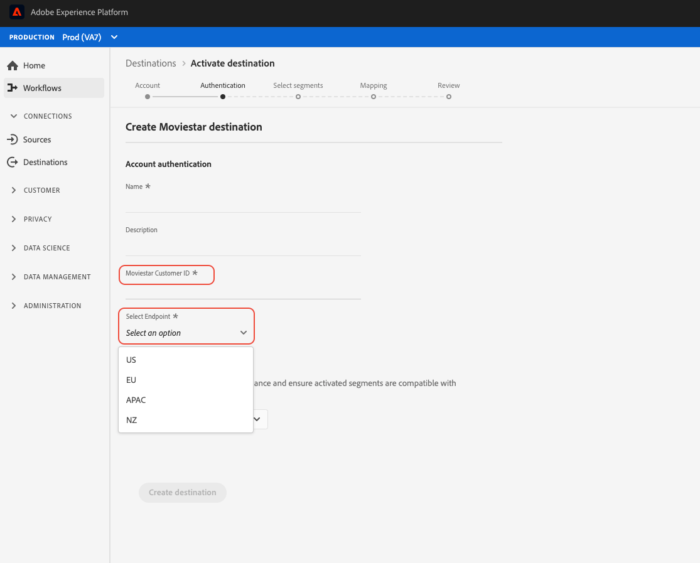

# Configuración de destino de transmisión {#destination-configuration}

## Información general {#overview}

Esta configuración le permite indicar información esencial para su destino de flujo continuo, como el nombre de destino, la categoría, la descripción y mucho más. Los ajustes de esta configuración también determinan cómo se autentican los usuarios Experience Platform en el destino, cómo aparece en la interfaz de usuario del Experience Platform y las identidades que se pueden exportar al destino.

Esta configuración también conecta a esta las demás configuraciones necesarias para que funcione su destino (servidor de destino y metadatos de audiencia). Lea cómo puede hacer referencia a las dos configuraciones en una [sección siguiente](./destination-configuration.md#connecting-all-configurations).

Puede configurar la funcionalidad descrita en este documento utilizando la variable `/authoring/destinations` extremo de API. Lectura [Operaciones de extremo de la API de destinos](./destination-configuration-api.md) para obtener una lista completa de las operaciones que puede realizar en el punto final.

## Ejemplo de configuración de flujo continuo {#example-configuration}

Este es un ejemplo de configuración de un destino ficticio de transmisión, Moviestar, que tiene extremos en cuatro ubicaciones en el mundo. El destino pertenece a la categoría destinos móviles .

```json
{
   "name":"Moviestar",
   "description":"Moviestar is a fictional destination, used for this example.",
   "status":"TEST",
   "customerAuthenticationConfigurations":[
      {
         "authType":"BEARER"
      }
   ],
   "customerDataFields":[
      {
         "name":"endpointRegion",
         "type":"string",
         "title":"Select Endpoint",
         "description":"Moviestar manages several instances across the globe for REST endpoints that our customers are provisioned for. Select your endpoint in the dropdown list.",
         "isRequired":true,
         "enum":[
            "US",
            "EU",
            "APAC",
            "NZ"
         ]
      },
      {
         "name":"customerID",
         "type":"string",
         "title":"Moviestar Customer ID",
         "description":"Your customer ID in the Moviestar destination (e.g. abcdef).",
         "isRequired":true,
         "pattern":"^[A-Za-z]+$"
      }
   ],
   "uiAttributes":{
      "documentationLink":"http://www.adobe.com/go/destinations-moviestar-en",
      "category":"mobile",
      "connectionType":"Server-to-server",
      "frequency":"Streaming"
   },
   "identityNamespaces":{
      "external_id":{
         "acceptsAttributes":true,
         "acceptsCustomNamespaces":true,
         "acceptedGlobalNamespaces":{
            "Email":{
               
            }
         }
      },
      "another_id":{
         "acceptsAttributes":true,
         "acceptsCustomNamespaces":true
      }
   },
   "schemaConfig":{
      "profileRequired":false,
      "segmentRequired":true,
      "identityRequired":true
   },
   "destinationDelivery":[
      {
         "authenticationRule":"CUSTOMER_AUTHENTICATION",
         "destinationServerId":"9c77000a-4559-40ae-9119-a04324a3ecd4"
      }
   ],
   "segmentMappingConfig":{
      "mapExperiencePlatformSegmentName":false,
      "mapExperiencePlatformSegmentId":false,
      "mapUserInput":false,
      "audienceTemplateId":"cbf90a70-96b4-437b-86be-522fbdaabe9c"
   },
   "aggregation":{
      "aggregationType":"CONFIGURABLE_AGGREGATION",
      "configurableAggregation":{
         "splitUserById":true,
         "maxBatchAgeInSecs":2400,
         "maxNumEventsInBatch":5000,
         "aggregationKey":{
            "includeSegmentId":true,
            "includeSegmentStatus":true,
            "includeIdentity":true,
            "oneIdentityPerGroup":false,
            "groups":[
               {
                  "namespaces":[
                     "IDFA",
                     "GAID"
                  ]
               },
               {
                  "namespaces":[
                     "EMAIL"
                  ]
               }
            ]
         }
      }
   },
   "backfillHistoricalProfileData":true
}
```

| Parámetro | Tipo | Descripción |
|---------|----------|------|
| `name` | Cadena | Indica el título del destino en el catálogo de Experience Platform. |
| `description` | Cadena | Proporcione una descripción para su tarjeta de destino en el catálogo de destinos de Experience Platform. Apunte a no más de 4-5 frases. |
| `status` | Cadena | Indica el estado del ciclo vital de la tarjeta de destino. Los valores aceptados son `TEST`, `PUBLISHED` y `DELETED`. Uso `TEST` la primera vez que configure el destino. |

{style=&quot;table-layout:auto&quot;}

## Configuraciones de autenticación de clientes {#customer-authentication-configurations}

Esta sección en la configuración de destinos genera la variable [Configurar nuevo destino](/help/destinations/ui/connect-destination.md) en la interfaz de usuario del Experience Platform, donde los usuarios se conectan Experience Platform a las cuentas que tienen con el destino. Según la opción de autenticación que indique en la variable `authType` , la página Experience Platform se genera para los usuarios de la siguiente manera:

### Autenticación del portador

Al configurar el tipo de autenticación al portador, los usuarios deben introducir el token al portador que obtienen de su destino.


### Autenticación OAuth 2

Usuarios seleccionar **[!UICONTROL Conectarse al destino]** para almacenar en déclencheur el flujo de autenticación de OAuth 2 en el destino, como se muestra en el ejemplo siguiente para el destino Audiencias personalizadas de Twitter . Para obtener información detallada sobre la configuración de la autenticación OAuth 2 en el punto final de destino, lea la [Página de autenticación de Destination SDK OAuth 2](./oauth2-authentication.md).


| Parámetro | Tipo | Descripción |
|---------|----------|------|
| `customerAuthenticationConfigurations` | Cadena | Indica la configuración utilizada para autenticar a los clientes Experience Platform en el servidor. Consulte `authType` abajo para los valores aceptados. |
| `authType` | Cadena | Los valores aceptados para los destinos de flujo continuo son:<ul><li>`BEARER`. Si el destino admite la autenticación de portador, establezca `"authType":"Bearer"` y  `"authenticationRule":"CUSTOMER_AUTHENTICATION"` en el [sección de envío de destino](./destination-configuration.md).</li><li>`OAUTH2`. Si su destino admite la autenticación OAuth 2, establezca `"authType":"OAUTH2"` y añada los campos requeridos para OAuth 2, como se muestra en la [Página de autenticación de Destination SDK OAuth 2](./oauth2-authentication.md). Además, establezca `"authenticationRule":"CUSTOMER_AUTHENTICATION"` en el [sección de envío de destino](./destination-configuration.md).</li> |

{style=&quot;table-layout:auto&quot;}

## Campos de datos del cliente {#customer-data-fields}

Utilice esta sección para solicitar a los usuarios que rellenen campos personalizados, específicos de su destino, al conectarse al destino en la interfaz de usuario del Experience Platform. La configuración se refleja en el flujo de autenticación como se muestra a continuación.



>[!TIP]
>
>Puede acceder y utilizar las entradas de cliente de los campos de datos del cliente en la plantilla. Utilice la macro `{{customerData.name}}`. Por ejemplo, si pide a los usuarios que introduzcan un campo de ID de cliente con el nombre `userId`, puede acceder a ella en la plantilla mediante la macro `{{customerData.userId}}`. Vea un ejemplo de cómo se utiliza un campo de datos de cliente en la dirección URL del extremo de la API, en la [configuración del servidor de destino](/help/destinations/destination-sdk/server-and-template-configuration.md#server-specs).

| Parámetro | Tipo | Descripción |
|---------|----------|------|
| `name` | Cadena | Proporcione un nombre para el campo personalizado que está introduciendo. |
| `type` | Cadena | Indica qué tipo de campo personalizado está introduciendo. Los valores aceptados son `string`, `object`, `integer`. |
| `title` | Cadena | Indica el nombre del campo, tal como lo ven los clientes en la interfaz de usuario del Experience Platform. |
| `description` | Cadena | Proporcione una descripción para el campo personalizado. |
| `isRequired` | Booleano | Indica si este campo es necesario en el flujo de trabajo de configuración de destino. |
| `enum` | Cadena | Representa el campo personalizado como un menú desplegable y enumera las opciones disponibles para el usuario. |
| `pattern` | Cadena | Aplica un patrón para el campo personalizado, si es necesario. Utilice expresiones regulares para aplicar un patrón. Por ejemplo, si los ID de cliente no incluyen números o guiones bajos, introduzca `^[A-Za-z]+$` en este campo. |

{style=&quot;table-layout:auto&quot;}

## Atributos de interfaz de usuario {#ui-attributes}

Esta sección se refiere a los elementos de IU de la configuración anterior que el Adobe debe utilizar para el destino en la interfaz de usuario de Adobe Experience Platform. Vea lo siguiente:


| Parámetro | Tipo | Descripción |
|---------|----------|------|
| `documentationLink` | Cadena | Se refiere a la página de documentación de la [Catálogo de destinos](https://experienceleague.adobe.com/docs/experience-platform/destinations/catalog/overview.html?lang=en#catalog) para su destino. Uso `http://www.adobe.com/go/destinations-YOURDESTINATION-en`, donde `YOURDESTINATION` es el nombre de su destino. Para un destino llamado Moviestar, debe usar `http://www.adobe.com/go/destinations-moviestar-en`. Tenga en cuenta que este vínculo solo funciona después de que el Adobe establezca el destino en vivo y la documentación se publique. |
| `category` | Cadena | Se refiere a la categoría asignada a su destino en Adobe Experience Platform. Para obtener más información, lea [Categorías de destino](https://experienceleague.adobe.com/docs/experience-platform/destinations/destination-types.html). Utilice uno de los siguientes valores: `adobeSolutions, advertising, analytics, cdp, cloudStorage, crm, customerSuccess, database, dmp, ecommerce, email, emailMarketing, enrichment, livechat, marketingAutomation, mobile, personalization, protocols, social, streaming, subscriptions, surveys, tagManagers, voc, warehouses, payments`. <br> Tenga en cuenta que actualmente solo puede seleccionar una categoría por destino. |
| `connectionType` | Cadena | `Server-to-server` actualmente es la única opción disponible. |
| `frequency` | Cadena | Se refiere al tipo de exportación de datos compatible con el destino. Valores compatibles: <ul><li>`Streaming`</li><li>`Batch`</li></ul> |

{style=&quot;table-layout:auto&quot;}

## Configuración del esquema en el paso de asignación {#schema-configuration}


Utilice los parámetros de `schemaConfig` para habilitar el paso de asignación del flujo de trabajo de activación de destino. Mediante los parámetros que se describen a continuación, puede determinar si los usuarios Experience Platform pueden asignar atributos de perfil o identidades al esquema deseado en el lado del destino.

| Parámetro | Tipo | Descripción |
|---------|----------|------|
| `profileFields` | Matriz | *No se muestra en la configuración de ejemplo anterior.* Al agregar una `profileFields`, los usuarios Experience Platform tienen la opción de asignar atributos de Platform a los atributos predefinidos en el lado del destino. |
| `profileRequired` | Booleano | Uso `true` si los usuarios deben poder asignar atributos de perfil de Experience Platform a atributos personalizados en el lado del destino, como se muestra en el ejemplo de configuración anterior. |
| `segmentRequired` | Booleano | Utilice siempre `segmentRequired:true`. |
| `identityRequired` | Booleano | Uso `true` si los usuarios deben poder asignar áreas de nombres de identidad desde el Experience Platform al esquema deseado. |

{style=&quot;table-layout:auto&quot;}

## Identidades y atributos {#identities-and-attributes}

Los parámetros de esta sección determinan qué identidades acepta el destino. Esta configuración también rellena las identidades y atributos de destino en la variable [paso de asignación](/help/destinations/ui/activate-segment-streaming-destinations.md#mapping) de la interfaz de usuario del Experience Platform, donde los usuarios asignan identidades y atributos de sus esquemas XDM al esquema en el destino.

Debe indicar qué [!DNL Platform] identidades que los clientes pueden exportar a su destino. Algunos ejemplos son [!DNL Experience Cloud ID], correo electrónico con hash, ID de dispositivo ([!DNL IDFA], [!DNL GAID]). Estos valores son [!DNL Platform] áreas de nombres de identidad que los clientes pueden asignar a áreas de nombres de identidad desde su destino. También puede indicar si los clientes pueden asignar áreas de nombres personalizadas a identidades compatibles con el destino (`acceptsCustomNamespaces: true`) y si los clientes pueden asignar atributos XDM estándar a identidades compatibles con el destino (`acceptsAttributes: true`).

Las áreas de nombres de identidad no requieren una correspondencia de 1 a 1 entre [!DNL Platform] y su destino.
Por ejemplo, los clientes podrían asignar un [!DNL Platform] [!DNL IDFA] espacio de nombres a un [!DNL IDFA] del destino o pueden asignar el mismo [!DNL Platform] [!DNL IDFA] espacio de nombres a [!DNL Customer ID] en el destino.

Obtenga más información sobre las identidades en la [Información general sobre el área de nombres de identidad](/help/identity-service/namespaces.md).


| Parámetro | Tipo | Descripción |
|---------|----------|------|
| `acceptsAttributes` | Booleano | Indica si los clientes pueden asignar atributos de perfil estándar a la identidad que está configurando. |
| `acceptsCustomNamespaces` | Booleano | Indica si los clientes pueden configurar áreas de nombres personalizadas en el destino. |
| `transformation` | Cadena | *No se muestra en la configuración de ejemplo*. Se utiliza, por ejemplo, cuando la variable [!DNL Platform] El cliente tiene direcciones de correo electrónico simples como atributo y la plataforma solo acepta correos electrónicos con hash. En este objeto, puede aplicar la transformación que debe aplicarse (por ejemplo, transformar el correo electrónico en minúsculas y, a continuación, en hash). Para ver un ejemplo, consulte `requiredTransformation` en el [referencia de la API de configuración de destino](./destination-configuration-api.md#update). |
| `acceptedGlobalNamespaces` | - | Indica qué [áreas de nombres de identidad estándar](/help/identity-service/namespaces.md#standard) (por ejemplo, IDFA) Los clientes pueden asignarse a la identidad que está configurando. <br> Cuando utilice `acceptedGlobalNamespaces`, puede usar `"requiredTransformation":"sha256(lower($))"` a direcciones de correo electrónico en minúsculas y hash o números de teléfono. |

{style=&quot;table-layout:auto&quot;}

## Entrega de destino {#destination-delivery}

| Parámetro | Tipo | Descripción |
|---------|----------|------|
| `authenticationRule` | Cadena | Indica cómo [!DNL Platform] los clientes se conectan a su destino. Los valores aceptados son `CUSTOMER_AUTHENTICATION`, `PLATFORM_AUTHENTICATION`, `NONE`. <br> <ul><li>Uso `CUSTOMER_AUTHENTICATION` si los clientes de Platform inician sesión en su sistema mediante un nombre de usuario y una contraseña, un token al portador u otro método de autenticación. Por ejemplo, puede seleccionar esta opción si también selecciona `authType: OAUTH2` o `authType:BEARER` en `customerAuthenticationConfigurations`. </li><li> Uso `PLATFORM_AUTHENTICATION` si hay un sistema de autenticación global entre el Adobe y el destino y la variable [!DNL Platform] El cliente no necesita proporcionar credenciales de autenticación para conectarse al destino. En este caso, debe crear un objeto credentials utilizando la variable [Credenciales](./credentials-configuration-api.md) configuración. </li><li>Uso `NONE` si no se requiere autenticación para enviar datos a la plataforma de destino. </li></ul> |
| `destinationServerId` | Cadena | La variable `instanceId` del [configuración del servidor de destino](./destination-server-api.md) para este destino. |

{style=&quot;table-layout:auto&quot;}

## Configuración de asignación de segmentos {#segment-mapping}


Esta sección de la configuración de destino se relaciona con la forma en que los metadatos de segmento, como los nombres o ID de segmentos, deben compartirse entre el Experience Platform y el destino.

A través de `audienceTemplateId`, esta sección también vincula esta configuración con el [configuración de metadatos de audiencia](./audience-metadata-management.md).

Los parámetros que se muestran en la configuración anterior se describen en la sección [referencia de la API del extremo de destinos](./destination-configuration-api.md).

## Política de agregación {#aggregation}


Esta sección le permite establecer las políticas de agregación que debe utilizar el Experience Platform al exportar los datos a su destino.

Una política de agregación determina cómo se combinan los perfiles exportados en las exportaciones de datos. Entre las opciones disponibles se encuentran:
* Mejor agregación de esfuerzos
* Agregación configurable (tal y como se muestra en la configuración anterior)

Lea la sección en [uso de plantillas](./message-format.md#using-templating) y [ejemplos clave de agregación](./message-format.md#template-aggregation-key) para comprender cómo incluir la política de agregación en la plantilla de transformación de mensajes en función de la política de agregación seleccionada.

### Mejor agregación de esfuerzos {#best-effort-aggregation}

>[!TIP]
>
>Utilice esta opción si el extremo de la API acepta menos de 100 perfiles por llamada de API.

Esta opción funciona mejor para destinos que prefieren menos perfiles por solicitud y prefieren aceptar más solicitudes con menos datos que menos solicitudes con más datos.

Utilice la variable `maxUsersPerRequest` para especificar el número máximo de perfiles que el destino puede tener en una solicitud.

### Agregación configurable {#configurable-aggregation}

Esta opción funciona mejor si prefiere tomar lotes grandes, con miles de perfiles en la misma llamada. Esta opción también le permite agregar los perfiles exportados en función de reglas de agregación complejas.

Esta opción le permite:

* Establezca el tiempo máximo y el número máximo de perfiles que se agregarán antes de que se realice una llamada de API al destino.
* Agregue los perfiles exportados asignados al destino en función de:
   * ID de segmento;
   * Estado del segmento;
   * Identidad o grupos de identidades.

>[!NOTE]
>
>Al utilizar la opción de agregación configurable para el destino, tenga en cuenta los valores mínimo y máximo que puede utilizar para los dos parámetros `maxBatchAgeInSecs` (mínimo 1.800 y máximo 3.600) y `maxNumEventsInBatch` (mínimo 1.000, máximo 10.000).

Para obtener explicaciones detalladas de los parámetros de agregación, consulte la [Operaciones de extremo de la API de destinos](./destination-configuration-api.md) página de referencia, donde se describe cada parámetro.

## Calificaciones históricas de perfil {#profile-backfill}

Puede usar la variable `backfillHistoricalProfileData` en la configuración de destinos para determinar si se deben exportar a su destino las cualificaciones históricas de perfil.

| Parámetro | Tipo | Descripción |
|---------|----------|------|
| `backfillHistoricalProfileData` | Booleano | Controla si los datos del perfil histórico se exportan cuando los segmentos se activan en el destino. <br> <ul><li> `true`: [!DNL Platform] envía los perfiles de usuario históricos que cumplen los requisitos para el segmento antes de que se active el segmento. </li><li> `false`: [!DNL Platform] solo incluye perfiles de usuario que cumplen los requisitos para el segmento una vez activado el segmento. </li></ul> |

{style=&quot;table-layout:auto&quot;}

## Conexión de esta configuración a toda la información necesaria para el destino {#connecting-all-configurations}

Algunos de los ajustes de destino deben configurarse mediante el [servidor de destino](./server-and-template-configuration.md) o [configuración de metadatos de audiencia](./audience-metadata-management.md). La configuración de destino descrita conecta todos estos ajustes haciendo referencia a las otras dos configuraciones de la siguiente manera:

* Utilice la variable `destinationServerId` para hacer referencia al servidor de destino y a la configuración de plantilla configurada para el destino.
* Utilice la variable `audienceMetadataId` para hacer referencia a la configuración de metadatos de audiencia configurada para el destino.