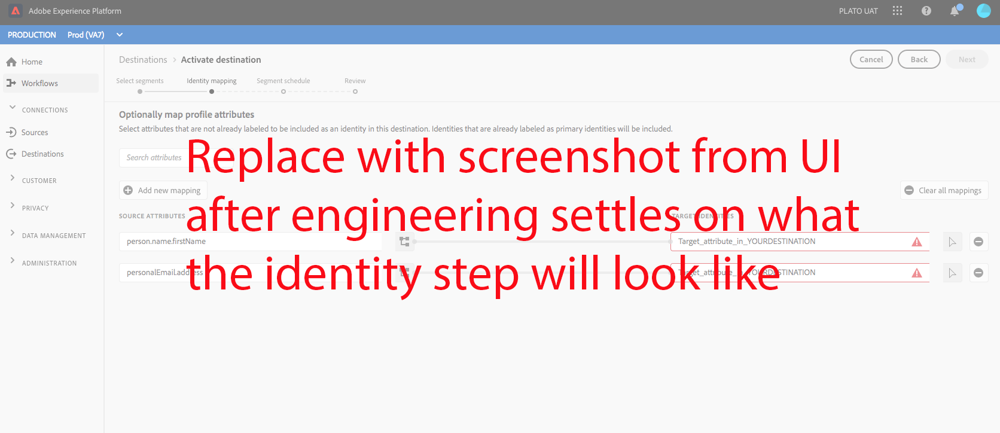

# YOURDESTINATION {#your-destination}

*A medida que recorre esta plantilla, reemplace o elimine todos los párrafos en cursiva (a partir de este).*

*Comience por actualizar los metadatos (título y descripción) en la parte superior de la página. Ignore todas las instancias de UICONTROL en esta página. Esta es una etiqueta que ayuda a nuestros procesos de traducción automática a traducir correctamente la página a los múltiples idiomas compatibles. Añadiremos etiquetas a su documentación después de enviarla.*

## Información general {#overview}

*Proporcione una breve descripción general para su empresa, incluido el valor que proporciona a los clientes. Incluya un vínculo a la página de inicio de la documentación del producto para obtener más información.*

>[!IMPORTANT]
>
>Esta página de documentación la creó el equipo de *YOURDESTINATION*. Para cualquier solicitud de consulta o actualización, póngase en contacto con ellos directamente en *Insert link or email address donde puede ser contactado para actualizaciones*

## Requisitos previos {#prerequisites}

*Agregue información en esta sección sobre cualquier cosa que los clientes deban tener en cuenta antes de comenzar a configurar el destino en la interfaz de usuario de Adobe Experience Platform. Esto puede ser acerca de:*

* *necesidad de añadirlo a una lista de permitidos*
* *requisitos para el hash de correo electrónico*
* *cualquier información específica de la cuenta de su parte*
* *cómo obtener una clave de API para conectarse a la plataforma*

*Puede vincular a su documentación relevante si esto resulta útil para los clientes.*

## Identidades compatibles {#supported-identities}

*Agregue información en esta sección sobre las identidades admitidas por el destino. Hemos rellenado previamente la tabla con algunos valores estándar. Elimine los valores que no se apliquen al destino y los que no estén prerellenados.*

** YOURDESTINATIONadmite la activación de identidades descritas en la tabla siguiente. Obtenga más información sobre [identities](https://experienceleague.adobe.com/docs/experience-platform/identity/namespaces.html?lang=en#getting-started).

| Identidad de Target | Descripción | Consideraciones |
|---|---|---|
| GAID | Google Advertising ID | Seleccione la identidad objetivo GAID cuando su identidad de origen sea un área de nombres GAID. |
| IDFA | Apple ID para anunciantes | Seleccione la identidad de destino IDFA cuando la identidad de origen sea un área de nombres IDFA. |
| ECID | Experience Cloud ID | Un espacio de nombres que representa ECID. Este espacio de nombres también puede ser referenciado por los siguientes alias: &quot;Adobe Marketing Cloud ID&quot;, &quot;Adobe Experience Cloud ID&quot;, &quot;Adobe Experience Platform ID&quot;. Consulte el siguiente documento sobre [ECID](https://experienceleague.adobe.com/docs/experience-platform/identity/ecid.html) para obtener más información. |
| phone_sha256 | Números de teléfono con hash con el algoritmo SHA256 | Adobe Experience Platform admite los números de teléfono con texto sin formato y con hash SHA256. Cuando el campo de origen contiene atributos sin hash, marque la opción **[!UICONTROL Apply transformation]** para que [!DNL Platform] hash automáticamente los datos en la activación. |
| email_lc_sha256 | Direcciones de correo electrónico con hash con el algoritmo SHA256 | Adobe Experience Platform admite las direcciones de correo electrónico con texto sin formato y con hash SHA 256. Cuando el campo de origen contiene atributos sin hash, marque la opción **[!UICONTROL Apply transformation]** para que [!DNL Platform] hash automáticamente los datos en la activación. |
| extern_id | ID de usuario personalizados | Seleccione esta identidad de destino cuando la identidad de origen sea un área de nombres personalizada. |

{style=&quot;table-layout:auto&quot;}

## Tipo de exportación {#export-type}

**Exportación de segmentos** : exporta todos los miembros de un segmento (audiencia) con los identificadores (nombre, número de teléfono u otros) utilizados en  ** YOURDESTINATIONdestination.

## Casos de uso

Para ayudarle a comprender mejor cómo y cuándo debe utilizar el destino *YOURDESTINATION*, estos son ejemplos de casos de uso que los clientes de Adobe Experience Platform pueden resolver utilizando este destino.

### Caso de uso número 1

*Para plataformas de mensajería móvil:*

*Una plataforma de ventas y alquiler de casas quiere enviar notificaciones móviles a los dispositivos Android e iOS de los clientes para informarles de que hay 100 listas actualizadas en el área donde antes buscaron un alquiler.*

### Caso de uso n.º 2

*Para plataformas de redes sociales:*

*Una marca de ropa deportiva quiere llegar a los clientes existentes a través de sus cuentas de medios sociales. La marca de ropa puede introducir direcciones de correo electrónico de su propio CRM a Adobe Experience Platform, generar segmentos a partir de sus propios datos sin conexión y enviar estos segmentos a YOURDESTINATION para mostrar anuncios en las fuentes de medios sociales de sus clientes.*

## Conectarse al destino {#connect}

Para conectarse a este destino, siga los pasos descritos en el [tutorial de configuración de destino](https://experienceleague.adobe.com/docs/experience-platform/destinations/ui/connect-destination.html).

### Parámetros de conexión {#parameters}

Mientras [configura](https://experienceleague.adobe.com/docs/experience-platform/destinations/ui/connect-destination.html) este destino, debe proporcionar la siguiente información:

*Agregue los campos que los clientes deben rellenar al configurar un nuevo destino. Estos campos son específicos del destino y dependen de la configuración en el SDK de destino. Es posible que los campos del destino no sean los mismos que los que se enumeran a continuación.*

* **[!UICONTROL Nombre]**: Un nombre por el cual reconocerá este destino en el futuro.
* **[!UICONTROL Descripción]**: Descripción que le ayudará a identificar este destino en el futuro.
* **[!UICONTROL ID de cuenta]**: Su  ** ID de cuenta de DESTINO.


<!--

*Replace YOURDESTINATION with your destination name and TOBEFILLEDIN with the category that your destination belongs to.*

1. In **[!UICONTROL Destinations]** > **[!UICONTROL Catalog]**, scroll to the ***TOBEFILLEDIN*** category. Select ***YOURDESTINATION***, then select **[!UICONTROL Configure]**.


    >[!NOTE]
    >
    >If a connection with this destination already exists, you can see an **[!UICONTROL Activate]** button on the destination card. For more information about the difference between **[!UICONTROL Activate]** and **[!UICONTROL Configure]**, refer to the [Catalog](https://experienceleague.adobe.com/docs/experience-platform/destinations/ui/destinations-workspace.html#catalog) section of the destination workspace documentation.  

    

2. In the **Account** step, if you had previously set up a connection to your *YOURDESTINATION* destination, select **[!UICONTROL Existing Account]** and select your existing connection. Or, you can select **[!UICONTROL New Account]** to set up a new connection to *YOURDESTINATION*. Select **[!UICONTROL Connect to destination]** to log in and connect Adobe Experience Cloud to your *YOURDESTINATION* account.

    >[!NOTE]
    >
    >Adobe Experience Platform supports credentials validation in the authentication process and displays an error message if you input incorrect credentials to your ***YOURDESTINATION*** account. This ensures that you don't complete the workflow with incorrect credentials.

3. Once your credentials are confirmed and Adobe Experience Cloud is connected to your ***YOURDESTINATION*** account, you can select **[!UICONTROL Next]** to proceed to the **[!UICONTROL Setup]** step.

4. In the **[!UICONTROL Authentication]** step, enter a **[!UICONTROL Name]** and a **[!UICONTROL Description]** for your activation flow and fill your account ID. <br> Also in this step, you can select any marketing action that should apply to this destination. Marketing actions indicate the intent for which data will be exported to the destination. You can select from Adobe-defined marketing actions or you can create your own marketing action. For more information about marketing actions, see the [Data usage policies overview](https://experienceleague.adobe.com/docs/experience-platform/data-governance/policies/overview.html).

    

5. Your destination is now created. You can select **[!UICONTROL Save & Exit]** if you want to activate segments later on or you can select **[!UICONTROL Next]** to continue the workflow and select segments to activate. In either case, see the next section, [Activate segments](#activate-segments), for the rest of the workflow.

-->

## Activar segmentos en este destino {#activate}

Lea [Activar perfiles y segmentos en destinos de exportación de segmentos de flujo continuo](https://experienceleague.adobe.com/docs/experience-platform/destinations/ui/activate/activate-segment-streaming-destinations.html?lang=en) para obtener instrucciones sobre cómo activar segmentos de audiencia en este destino.

<!--

To activate segments to *YOURDESTINATION*, follow the steps below: 

1. In **[!UICONTROL Destinations > Browse]**, select the *YOURDESTINATION* destination where you want to activate your segments.

2. Click the name of the destination. This takes you to the Activate flow.
    
    Note that if an activation flow already exists for a destination, you can see the segments that are currently being sent to the destination. Select **[!UICONTROL Edit activation]** in the right rail and follow the steps below to modify the activation details.
3. Select **[!UICONTROL Activate]**;
4. In the **[!UICONTROL Activate destination]** workflow, on the **[!UICONTROL Select Segments]** page, select which segments to send to *YOURDESTINATION*.
    
5.  In the **[!UICONTROL Mapping]** step, select which attributes and identities from the source XDM schema to map to the target schema. Select **[!UICONTROL Add new mapping]** and browse your schema, select identity namespaces and map them to the corresponding target identity.  
 <br>&nbsp;
   *Plain text email address as primary identity*: If you have plain text (unhashed) email addresses as primary identity in your schema, select the email field in your **[!UICONTROL Source Attributes]** and map to the Email field in the right column under **[!UICONTROL Target Identities]**, as shown below. Set up a mapping between any other attributes you plan to use.
    <br>&nbsp;
6. On the **[!UICONTROL Segment schedule]** page, you can set the start date for sending data to the destination.
7. On the **[!UICONTROL Review]** page, you can see a summary of your selection. Select **[!UICONTROL Cancel]** to break up the flow, **[!UICONTROL Back]** to modify your settings, or **[!UICONTROL Finish]** to confirm your selection and start sending data to the destination.

>[!IMPORTANT]
>
>In this step, Adobe Experience Platform checks for data usage policy violations. Shown below is an example where a policy is violated. You cannot complete the segment activation workflow until you have resolved the violation. For information on how to resolve policy violations, see [Policy enforcement](https://experienceleague.adobe.com/docs/experience-platform/data-governance/enforcement/auto-enforcement.html#enforcement) in the data governance documentation section.
 


If no policy violations have been detected, select **[!UICONTROL Finish]** to confirm your selection and start sending data to the destination.


-->

## Datos exportados {#exported-data}

*Agregue una nota sobre cómo se exportan los datos al destino. Esto ayudaría al cliente a asegurarse de que se ha integrado correctamente con su destino. Por ejemplo, puede proporcionar un JSON de muestra como el que se muestra a continuación.*

```
{
  "person": {
    "email": "yourstruly@adobe.con"
  },
  "segmentMembership": {
    "ups": {
      "7841ba61-23c1-4bb3-a495-00d3g5fe1e93": {
        "lastQualificationTime": "2020-05-25T21:24:39Z",
        "status": "exited"
      },
      "59bd2fkd-3c48-4b18-bf56-4f5c5e6967ae": {
        "lastQualificationTime": "2020-05-25T23:37:33Z",
        "status": "existing"
      }
    }
  },
  "identityMap": {
    "ecid": [
      {
        "id": "14575006536349286404619648085736425115"
      },
      {
        "id": "66478888669296734530114754794777368480"
      }
    ],
    "email_lc_sha256": [
      {
        "id": "655332b5fa2aea4498bf7a290cff017cb4"
      },
      {
        "id": "66baf76ef9de8b42df8903f00e0e3dc0b7"
      }
    ]
  }
}
```

## Uso y gobernanza de los datos {#data-usage-governance}

Todos los destinos [!DNL Adobe Experience Platform] cumplen las políticas de uso de datos al administrar los datos. Para obtener información detallada sobre cómo [!DNL Adobe Experience Platform] aplica el control de datos, lea la [Información general sobre el control de datos](https://experienceleague.adobe.com/docs/experience-platform/data-governance/home.html).

## Recursos adicionales {#additional-resources}

*Puede proporcionar más vínculos a la documentación del producto o a cualquier otro recurso que considere importante para que el cliente tenga éxito.*
