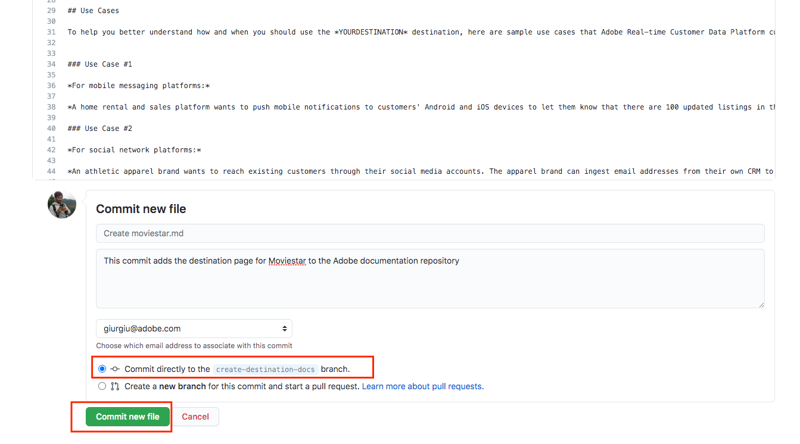

# Utilice la interfaz web de GitHub para crear una página de documentación de destino {#github-interface}

Las instrucciones siguientes muestran cómo utilizar la interfaz web de GitHub para crear documentación y enviar una solicitud de extracción (PR). Antes de seguir los pasos indicados aquí, asegúrate de leer [Documentar tu destino en Destinos de Adobe Experience Platform](./documentation-instructions.md).

>[!TIP]
>
>Consulte también la documentación de soporte en la Guía del colaborador de Adobe:
>* [Instalar las herramientas de creación de Git y Markdown](https://experienceleague.adobe.com/docs/contributor/contributor-guide/setup/install-tools.html?lang=es)
>* [Configurar el repositorio Git localmente para la documentación](https://experienceleague.adobe.com/docs/contributor/contributor-guide/setup/local-repo.html?lang=es)
>* [Flujo de trabajo de contribución en GitHub para cambios importantes](https://experienceleague.adobe.com/docs/contributor/contributor-guide/setup/full-workflow.html?lang=es).

## Configuración del entorno de creación de GitHub {#set-up-environment}

1. En su explorador, vaya a `https://github.com/AdobeDocs/experience-platform.en`.
2. Para [ramificar](https://experienceleague.adobe.com/docs/contributor/contributor-guide/setup/local-repo.html?lang=es#fork-the-repository) el repositorio, haga clic en **Ramificar** como se muestra a continuación. Esto crea una copia del repositorio de Experience Platform en su propia cuenta de GitHub.

   

3. En la ramificación del repositorio, cree una nueva rama para el proyecto, como se muestra a continuación. Utilice esta nueva rama para su trabajo.

   

4. En la estructura de carpetas de GitHub del repositorio ramificado, vaya a `experience-platform.en/help/destinations/catalog/[...]`, donde `[...]` es la categoría deseada para el destino. Por ejemplo, si está agregando un destino de personalización al Experience Platform, seleccione la categoría `personalization`. Seleccione **Agregar archivo > Crear nuevo archivo**.

   

5. Asigne un nombre a su destino `YOURDESTINATION.md`, donde YOURDESTINATION es el nombre de su destino en Adobe Experience Platform. Por ejemplo, si su compañía se llama Moviestar, debe asignar un nombre al archivo `moviestar.md`.

## Crear la página de documentación de su destino {#author-documentation}

1. Creará el contenido de su página de destino en función de la [plantilla de autoservicio de documentación](./self-service-template.md). **[Descargue](../assets/docs-framework/yourdestination-template.zip)** la plantilla y descomprímala para extraer la plantilla de archivo `.md`.
2. Pegue y edite el contenido de la plantilla con información relevante para su destino en un editor de markdown en línea, como [dillinger.io](https://dillinger.io/). Siga las instrucciones de la plantilla para obtener más información sobre lo que debe rellenar y los párrafos que se pueden eliminar.

   >[!TIP]
   >
   >Puede cerrar la ventana del explorador en cualquier momento y volver a abrirla más tarde. Su trabajo se guarda automáticamente y le estará esperando cuando vuelva a abrir el explorador.
3. Copie el contenido del editor de markdown en el nuevo archivo en GitHub.
4. Para cualquier captura de pantalla o imagen que planee usar, use la interfaz de GitHub para cargar los archivos en `experience-platform.en/help/destinations/assets/catalog/[...]`, donde `[...]` es la categoría deseada para el destino. Por ejemplo, si está agregando un destino de personalización al Experience Platform, seleccione la categoría `personalization`. Debe vincular a las imágenes de la página que está creando. Vea [instrucciones sobre cómo vincular a imágenes](https://experienceleague.adobe.com/docs/contributor/contributor-guide/writing-essentials/linking.html?lang=es#link-to-images).

   

5. Cuando esté listo, guarde el archivo en la rama.

## Envíe su documentación para su revisión {#submit-review}

>[!TIP]
>
>Tenga en cuenta que no hay nada que pueda romper aquí. Al seguir las instrucciones de esta sección, simplemente sugiere una actualización de la documentación. El equipo de documentación de Adobe Experience Platform aprobará o editará la actualización sugerida.

1. Después de guardar el archivo y cargar las imágenes deseadas, puede abrir una solicitud de extracción (PR) para fusionar la rama de trabajo en la rama maestra del repositorio de documentación de Adobe. Asegúrese de que la rama en la que trabajó esté seleccionada y seleccione **Contribute > Abrir solicitud de extracción**.

1. Asegúrese de que las ramas base y de comparación son correctas. Agregue una nota al PR, describiendo su actualización, y seleccione **Crear solicitud de extracción**. Esto abre una PR para fusionar la rama de trabajo de la ramificación en la rama maestra del repositorio de Adobe.

   >[!TIP]
   >
   >Deje seleccionada la casilla de verificación **Permitir ediciones por responsables** para que el equipo de documentación de Adobe pueda realizar ediciones en la PR.

   

1. En este punto, aparece una notificación que le solicita que firme el Acuerdo de licencia para colaboradores de Adobe (CLA). Este es un paso obligatorio. Después de firmar el CLA, actualice la página PR y envíe la solicitud de extracción.

1. Puede confirmar que la solicitud de extracción se ha enviado inspeccionando la ficha **Solicitudes de extracción** en `https://github.com/AdobeDocs/experience-platform.en`.

   

1. ¡Gracias! El equipo de documentación del Adobe se pondrá en contacto con en caso de que sea necesario realizar alguna edición y le informará de cuándo se publicará la documentación.

>[!TIP]
>
>Para agregar imágenes y vínculos a tu documentación y para cualquier otra pregunta sobre Markdown, lee [Using Markdown](https://experienceleague.adobe.com/docs/contributor/contributor-guide/writing-essentials/markdown.html?lang=es) en la guía de escritura colaborativa de Adobe.
