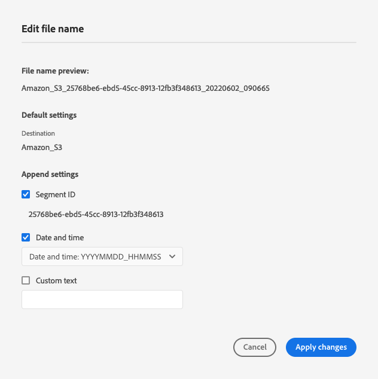

# Configuración por lotes {#batch-configuration}

Utilice las opciones de configuración por lotes de Destination SDK para permitir a los usuarios personalizar los nombres de archivo exportados y configurar la programación de exportación según sus preferencias.

Al crear destinos basados en archivos a través de Destination SDK, puede configurar programaciones predeterminadas de nomenclatura y exportación de archivos, o puede dar a los usuarios la opción de configurar estas opciones desde la interfaz de usuario de Experience Platform. Por ejemplo, puede configurar comportamientos como:

* Incluir información específica en el nombre del archivo, como ID de audiencia, ID de destino o información personalizada.
* Permite a los usuarios personalizar el nombre de archivo desde la interfaz de usuario de Experience Platform.
* Configure las exportaciones de archivos para que se produzcan a intervalos de tiempo establecidos.
* Defina las opciones de nomenclatura de archivos y de personalización de programación de exportación que los usuarios pueden ver en la interfaz de usuario de Experience Platform.

Los ajustes de configuración por lotes forman parte de la configuración de destino para destinos basados en archivos.

Para saber dónde encaja este componente en una integración creada con Destination SDK, consulte el diagrama en la documentación de [opciones de configuración](../configuration-options.md) o vea la guía sobre cómo [usar Destination SDK para configurar un destino basado en archivos](../../guides/configure-file-based-destination-instructions.md#create-server-file-configuration).

Puede configurar la nomenclatura de archivos y exportar la configuración de programación a través del extremo `/authoring/destinations`. Consulte las siguientes páginas de referencia de la API para ver ejemplos detallados de llamadas de la API donde puede configurar los componentes que se muestran en esta página.

* [Crear una configuración de destino](../../authoring-api/destination-configuration/create-destination-configuration.md)
* [Actualizar una configuración de destino](../../authoring-api/destination-configuration/update-destination-configuration.md)

Este artículo describe todas las opciones de configuración por lotes admitidas que puede utilizar para su destino y muestra lo que los clientes verán en la interfaz de usuario de Experience Platform.

>[!IMPORTANT]
>
>Todos los nombres y valores de parámetro admitidos por Destination SDK distinguen entre mayúsculas y minúsculas **1}.** Para evitar errores de distinción entre mayúsculas y minúsculas, utilice los nombres y valores de los parámetros exactamente como se muestra en la documentación.

## Tipos de integración admitidos {#supported-integration-types}

Consulte la tabla siguiente para obtener detalles sobre qué tipos de integraciones admiten la funcionalidad descrita en esta página.

| Tipo de integración | Admite funcionalidad |
|---|---|
| Integraciones en tiempo real (streaming) | No |
| Integraciones basadas en archivos (por lotes) | Sí |

## Parámetros admitidos {#supported-parameters}

Los valores que configuró aquí aparecen en el paso [Programar exportación de audiencias](../../../ui/activate-batch-profile-destinations.md#scheduling) del flujo de trabajo de activación de destinos basados en archivos.

```json
"batchConfig":{
   "allowMandatoryFieldSelection":true,
   "allowDedupeKeyFieldSelection":true,
   "defaultExportMode":"DAILY_FULL_EXPORT",
   "allowedExportMode":[
      "DAILY_FULL_EXPORT",
      "FIRST_FULL_THEN_INCREMENTAL"
   ],
   "allowedScheduleFrequency":[
      "DAILY",
      "EVERY_3_HOURS",
      "EVERY_6_HOURS",
      "EVERY_8_HOURS",
      "EVERY_12_HOURS",
      "ONCE",
      "WEEKLY",
      "MONTHLY"
   ],
   "defaultFrequency":"DAILY",
   "defaultStartTime":"00:00",
   "filenameConfig":{
         "allowedFilenameAppendOptions":[
            "SEGMENT_NAME",
            "DESTINATION_INSTANCE_ID",
            "DESTINATION_INSTANCE_NAME",
            "ORGANIZATION_NAME",
            "SANDBOX_NAME",
            "DATETIME",
            "CUSTOM_TEXT"
         ],
         "defaultFilenameAppendOptions":[
            "DATETIME"
         ],
         "defaultFilename":"%DESTINATION%_%SEGMENT_ID%"
      },
   "segmentGroupingEnabled": true
   }
```

| Parámetro | Tipo | Descripción |
|---------|----------|------|
| `allowMandatoryFieldSelection` | Booleano | Se establece en `true` para permitir que los clientes especifiquen qué atributos de perfil son obligatorios. El valor predeterminado es `false`. Consulte [Atributos obligatorios](../../../ui/activate-batch-profile-destinations.md#mandatory-attributes) para obtener más información. |
| `allowDedupeKeyFieldSelection` | Booleano | Establezca en `true` para permitir que los clientes especifiquen las claves de anulación de duplicación. El valor predeterminado es `false`.  Consulte [Claves de deduplicación](../../../ui/activate-batch-profile-destinations.md#deduplication-keys) para obtener más información. |
| `defaultExportMode` | Enumeración | Define el modo de exportación de archivos predeterminado. Valores compatibles:<ul><li>`DAILY_FULL_EXPORT`</li><li>`FIRST_FULL_THEN_INCREMENTAL`</li></ul> El valor predeterminado es `DAILY_FULL_EXPORT`. Consulte la [documentación de activación por lotes](../../../ui/activate-batch-profile-destinations.md#scheduling) para obtener detalles acerca de la programación de exportaciones de archivos. |
| `allowedExportModes` | Lista | Define los modos de exportación de archivos disponibles para los clientes de. Valores compatibles:<ul><li>`DAILY_FULL_EXPORT`</li><li>`FIRST_FULL_THEN_INCREMENTAL`</li></ul> |
| `allowedScheduleFrequency` | Lista | Define la frecuencia de exportación de archivos disponible para los clientes. Valores compatibles:<ul><li>`ONCE`</li><li>`EVERY_3_HOURS`</li><li>`EVERY_6_HOURS`</li><li>`EVERY_8_HOURS`</li><li>`EVERY_12_HOURS`</li><li>`DAILY`</li><li>`WEEKLY`</li><li>`MONTHLY`</li></ul> |
| `defaultFrequency` | Enumeración | Define la frecuencia predeterminada de exportación de archivos. Valores compatibles:<ul><li>`ONCE`</li><li>`EVERY_3_HOURS`</li><li>`EVERY_6_HOURS`</li><li>`EVERY_8_HOURS`</li><li>`EVERY_12_HOURS`</li><li>`DAILY`</li><li>`WEEKLY`</li><li>`MONTHLY`</li></ul> El valor predeterminado es `DAILY`. |
| `defaultStartTime` | Cadena | Define la hora de inicio predeterminada para la exportación de archivos. Utiliza el formato de archivo de 24 horas. El valor predeterminado es &quot;00:00&quot;. |
| `filenameConfig.allowedFilenameAppendOptions` | Cadena | *Requerido*. Lista de macros de nombre de archivo disponibles para que los usuarios elijan. Esto determina qué elementos se anexan a los nombres de archivo exportados (ID de audiencia, nombre de organización, fecha y hora de exportación, etc.). Al establecer `defaultFilename`, asegúrese de evitar la duplicación de macros. <br><br>Valores compatibles: <ul><li>`DESTINATION`</li><li>`SEGMENT_ID`</li><li>`SEGMENT_NAME`</li><li>`DESTINATION_INSTANCE_ID`</li><li>`DESTINATION_INSTANCE_NAME`</li><li>`ORGANIZATION_NAME`</li><li>`SANDBOX_NAME`</li><li>`DATETIME`</li><li>`CUSTOM_TEXT`</li></ul>Independientemente del orden en que defina las macros, la interfaz de usuario de Experience Platform siempre las mostrará en el orden presentado aquí. <br><br> Si `defaultFilename` está vacío, la lista `allowedFilenameAppendOptions` debe contener al menos una macro. |
| `filenameConfig.defaultFilenameAppendOptions` | Cadena | *Requerido*. Macros de nombre de archivo predeterminado preseleccionadas que los usuarios pueden desmarcar.<br><br> Las macros de esta lista son un subconjunto de las definidas en `allowedFilenameAppendOptions`. |
| `filenameConfig.defaultFilename` | Cadena | *Opcional*. Define las macros de nombre de archivo predeterminadas para los archivos exportados. Los usuarios no pueden sobrescribirlos. <br><br>Cualquier macro definida por `allowedFilenameAppendOptions` se anexará después de las macros `defaultFilename`. <br><br>Si `defaultFilename` está vacío, debe definir al menos una macro en `allowedFilenameAppendOptions`. |
| `segmentGroupingEnabled` | Booleano | Define si las audiencias activadas deben exportarse en un solo archivo o en varios, según la audiencia [política de combinación](../../../../profile/merge-policies/overview.md). Valores compatibles: <ul><li>`true`: exporta un archivo por política de combinación.</li><li>`false`: exporta un archivo por audiencia, independientemente de la política de combinación. Este es el comportamiento predeterminado. Puede lograr el mismo resultado omitiendo este parámetro por completo.</li></ul> |

{style="table-layout:auto"}

## Configuración del nombre de archivo {#file-name-configuration}

Utilice macros de configuración de nombres de archivo para definir qué nombres de archivo exportados deben incluir. Las macros de la tabla siguiente describen los elementos que se encuentran en la interfaz de usuario de la pantalla [configuración de nombre de archivo](../../../ui/activate-batch-profile-destinations.md#file-names).

>[!TIP]
>
>Como práctica recomendada, siempre debe incluir la macro `SEGMENT_ID` en los nombres de archivo exportados. Los ID de segmento son únicos, por lo que incluirlos en el nombre de archivo es la mejor manera de asegurarse de que los nombres de archivo también sean únicos.

| Macro | Etiqueta de IU | Descripción | Ejemplo |
|---|---|---|---|
| `DESTINATION` | [!UICONTROL Destination] | Nombre del destino en la interfaz de usuario. | Amazon S3 |
| `SEGMENT_ID` | [!UICONTROL Segment ID] | ID único de audiencia generado por Experience Platform | ce5c5482-2813-4a80-99bc-57113f6acde2 |
| `SEGMENT_NAME` | [!UICONTROL Segment Name] | Nombre de audiencia definido por el usuario | suscriptor de VIP |
| `DESTINATION_INSTANCE_ID` | [!UICONTROL Destination ID] | ID único de la instancia de destino generado por Experience Platform | 7b891e5f-025a-4f0d-9e73-1919e71da3b0 |
| `DESTINATION_INSTANCE_NAME` | [!UICONTROL Destination Name] | Nombre definido por el usuario de la instancia de destino. | Mi destino de Advertising 2022 |
| `ORGANIZATION_NAME` | [!UICONTROL Organization Name] | Nombre de la organización del cliente en Adobe Experience Platform. | Nombre de mi organización |
| `SANDBOX_NAME` | [!UICONTROL Sandbox Name] | Nombre de la zona protegida utilizada por el cliente. | picar |
| `DATETIME` / `TIMESTAMP` | [!UICONTROL Date and time] | `DATETIME` y `TIMESTAMP` definen cuándo se generó el archivo, pero en formatos diferentes. <br><br><ul><li>`DATETIME` usa el siguiente formato: AAAAMMDD_HHMMSS.</li><li>`TIMESTAMP` usa el formato Unix de 10 dígitos. </li></ul> `DATETIME` y `TIMESTAMP` se excluyen mutuamente y no se pueden usar simultáneamente. | <ul><li>`DATETIME`: 20220509_210543</li><li>`TIMESTAMP`: 1652131584</li></ul> |
| `CUSTOM_TEXT` | [!UICONTROL Custom text] | Texto personalizado definido por el usuario que se incluirá en el nombre del archivo. No se puede usar en `defaultFilename`. | My_Custom_Text |
| `TIMESTAMP` | [!UICONTROL Date and time] | Marca de tiempo de 10 dígitos de la hora en la que se generó el archivo, en formato Unix. | 1652131584 |
| `MERGE_POLICY_ID` | [!UICONTROL Merge Policy ID] | El identificador de [política de combinación](../../../../profile/merge-policies/overview.md) usado para generar la audiencia exportada. Utilice esta macro cuando agrupe audiencias exportadas en archivos, según la política de combinación. Use esta macro junto con `segmentGroupingEnabled:true`. | e8591fdb-2873-4b12-b63e-15275b1c1439 |
| `MERGE_POLICY_NAME` | [!UICONTROL Merge Policy Name] | Nombre de [política de combinación](../../../../profile/merge-policies/overview.md) que se utilizó para generar la audiencia exportada. Utilice esta macro cuando agrupe audiencias exportadas en archivos, según la política de combinación. Use esta macro junto con `segmentGroupingEnabled:true`. | Mi política de combinación personalizada |

{style="table-layout:auto"}

### Ejemplo de configuración de nombre de archivo {#file-name-configuration-example}

El ejemplo de configuración siguiente muestra la correspondencia entre la configuración utilizada en la llamada de API y las opciones que se muestran en la interfaz de usuario.

```json
"filenameConfig":{
   "allowedFilenameAppendOptions":[
      "CUSTOM_TEXT",
      "SEGMENT_ID",
      "DATETIME"
   ],
   "defaultFilenameAppendOptions":[
      "SEGMENT_ID",
      "DATETIME"
   ],
   "defaultFilename": "%DESTINATION%"
}
```



## Próximos pasos {#next-steps}

Después de leer este artículo, debería tener una mejor comprensión de cómo puede configurar la nomenclatura de archivos y las programaciones de exportación para sus destinos basados en archivos.

Para obtener más información acerca de los demás componentes de destino, consulte los siguientes artículos:

* [Configuración de autenticación del cliente](customer-authentication.md)
* [Autorización de OAuth2](oauth2-authorization.md)
* [Campos de datos del cliente](customer-data-fields.md)
* [Atributos de IU](ui-attributes.md)
* [Configuración del esquema](schema-configuration.md)
* [Configuración del área de nombres de identidad](identity-namespace-configuration.md)
* [Configuraciones de asignación compatibles](supported-mapping-configurations.md)
* [Envío de destino](destination-delivery.md)
* [Configuración de metadatos de audiencia](audience-metadata-configuration.md)
* [Política de agregación](aggregation-policy.md)
* [Cualificaciones históricas del perfil](historical-profile-qualifications.md)
