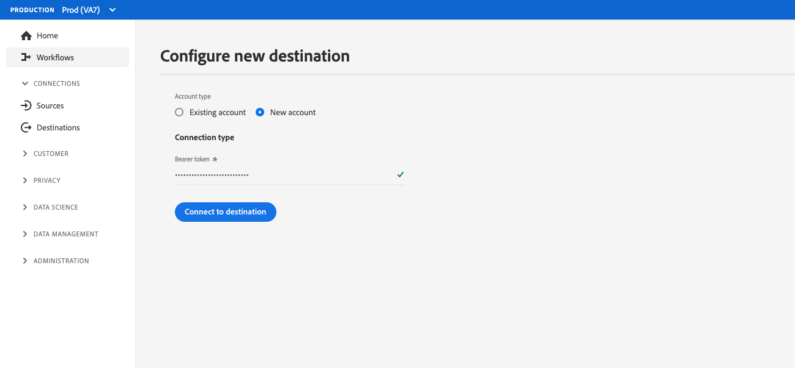

# Configuración de autenticación del cliente

Experience Platform proporciona una gran flexibilidad en los protocolos de autenticación disponibles para socios y clientes. Puede configurar su destino para que admita cualquiera de los métodos de autenticación estándar del sector, como [!DNL OAuth2], autenticación de token de portador, autenticación de contraseña y muchos más.

Esta página explica cómo configurar su destino utilizando el método de autenticación preferido. En función de la configuración de autenticación que utilice al crear el destino, los clientes verán diferentes tipos de páginas de autenticación al conectarse al destino en la interfaz de usuario de Experience Platform.

Para saber dónde encaja este componente en una integración creada con Destination SDK, consulte el diagrama en la documentación de [opciones de configuración](../configuration-options.md) o consulte las siguientes páginas de información general sobre la configuración de destino:

* [Usar Destination SDK para configurar un destino de flujo continuo](../../guides/configure-destination-instructions.md#create-destination-configuration)
* [Usar Destination SDK para configurar un destino basado en archivos](../../guides/configure-file-based-destination-instructions.md#create-destination-configuration)

Para que los clientes puedan exportar datos de Experience Platform a su destino, deben crear una nueva conexión entre Experience Platform y su destino, siguiendo los pasos que se describen en el tutorial [conexión de destino](../../../ui/connect-destination.md).

Al [crear un destino](../../authoring-api/destination-configuration/create-destination-configuration.md) mediante Destination SDK, la sección `customerAuthenticationConfigurations` define lo que los clientes ven en la [pantalla de autenticación](../../../ui/connect-destination.md#authenticate). Según el tipo de autenticación de destino, los clientes deben proporcionar varios detalles de autenticación, como:

* Para destinos que utilizan [autenticación básica](#basic), los usuarios deben proporcionar un nombre de usuario y una contraseña directamente en la página de autenticación de la interfaz de usuario de Experience Platform.
* Para destinos que usan [autenticación de portador](#bearer), los usuarios deben proporcionar un token de portador.
* Para destinos que utilizan la [autorización de OAuth2](#oauth2), se redirige a los usuarios a la página de inicio de sesión del destino, donde podrán iniciar sesión con sus credenciales.
* Para los destinos de [Amazon S3](#s3), los usuarios deben proporcionar su clave de acceso y clave secreta [!DNL Amazon S3].
* Para los destinos de [Azure Blob](#blob), los usuarios deben proporcionar su cadena de conexión [!DNL Azure Blob].

Puede configurar los detalles de autenticación del cliente a través del extremo `/authoring/destinations`. Consulte las siguientes páginas de referencia de la API para ver ejemplos detallados de llamadas de la API donde puede configurar los componentes que se muestran en esta página.

* [Crear una configuración de destino](../../authoring-api/destination-configuration/create-destination-configuration.md)
* [Actualizar una configuración de destino](../../authoring-api/destination-configuration/update-destination-configuration.md)

Este artículo describe todas las configuraciones de autenticación de cliente admitidas que puede utilizar para su destino y muestra lo que los clientes verán en la interfaz de usuario de Experience Platform en función del método de autenticación que configure para su destino.

>[!IMPORTANT]
>
>La configuración de autenticación del cliente no requiere que configure ningún parámetro. Puede copiar y pegar los fragmentos que se muestran en esta página en sus llamadas de API al [crear](../../authoring-api/destination-configuration/create-destination-configuration.md) o [actualizar](../../authoring-api/destination-configuration/update-destination-configuration.md) una configuración de destino, y los usuarios verán la pantalla de autenticación correspondiente en la interfaz de usuario de Experience Platform.

>[!IMPORTANT]
>
>Todos los nombres y valores de parámetro admitidos por Destination SDK distinguen entre mayúsculas y minúsculas **1}.** Para evitar errores de distinción entre mayúsculas y minúsculas, utilice los nombres y valores de los parámetros exactamente como se muestra en la documentación.

## Tipos de integración admitidos {#supported-integration-types}

Consulte la tabla siguiente para obtener detalles sobre qué tipos de integraciones admiten la funcionalidad descrita en esta página.

| Tipo de integración | Admite funcionalidad |
|---|---|
| Integraciones en tiempo real (streaming) | Sí |
| Integraciones basadas en archivos (por lotes) | Sí |

## Configuración de regla de autenticación {#authentication-rule}

Cuando use cualquiera de las configuraciones de autenticación de clientes descritas en esta página, establezca siempre el parámetro `authenticationRule` en [entrega de destino](destination-delivery.md) en `"CUSTOMER_AUTHENTICATION"`, como se muestra a continuación.

```json {line-numbers="true" highlight="4"
{
   "destinationDelivery":[
      {
         "authenticationRule":"CUSTOMER_AUTHENTICATION",
         "destinationServerId":"{{destinationServerId}}"
      }
   ]
}
```

## Autenticación básica {#basic}

La autenticación básica es compatible con integraciones en tiempo real (streaming) en Experience Platform.

Al configurar el tipo de autenticación básico, los usuarios deben introducir un nombre de usuario y una contraseña para conectarse al destino.


Para configurar la autenticación básica para su destino, configure la sección `customerAuthenticationConfigurations` a través del extremo `/destinations` como se muestra a continuación:

```json
"customerAuthenticationConfigurations":[
   {
      "authType":"BASIC"
   }
]
```

## Autenticación del portador {#bearer}

Al configurar el tipo de autenticación de portador, los usuarios deben introducir el token de portador que obtienen de su destino.



Para configurar la autenticación de tipo portador para su destino, configure la sección `customerAuthenticationConfigurations` a través del punto de conexión `/destinations` como se muestra a continuación:

```json
"customerAuthenticationConfigurations":[
   {
      "authType":"BEARER"
   }
]
```

## Autenticación OAuth 2 {#oauth2}

Los usuarios seleccionan **[!UICONTROL Conectar con destino]** para almacenar en déclencheur el flujo de autenticación de OAuth 2 en su destino, como se muestra en el ejemplo siguiente para el destino de Audiencias personalizadas de Twitter. Para obtener información detallada sobre la configuración de la autenticación OAuth 2 en el extremo de destino, lea la [página de autenticación OAuth 2 de Destination SDK](oauth2-authorization.md).


Para configurar la autenticación [!DNL OAuth2] para su destino, configure la sección `customerAuthenticationConfigurations` a través del extremo `/destinations` como se muestra a continuación:

```json
"customerAuthenticationConfigurations":[
   {
      "authType":"OAUTH2"
   }
]
```

## Autenticación de Amazon S3 {#s3}

La autenticación [!DNL Amazon S3] es compatible con destinos basados en archivos en Experience Platform.

Al configurar el tipo de autenticación de Amazon S3, los usuarios deben introducir sus credenciales de S3.


Para configurar la autenticación [!DNL Amazon S3] para su destino, configure la sección `customerAuthenticationConfigurations` a través del extremo `/destinations` como se muestra a continuación:

```json
"customerAuthenticationConfigurations":[
   {
      "authType":"S3"
   }
]
```

## Autenticación de Azure Blob  {#blob}

La autenticación [!DNL Azure Blob Storage] es compatible con destinos basados en archivos en Experience Platform.

Al configurar el tipo de autenticación de Azure Blob, los usuarios deben introducir la cadena de conexión.


Para configurar la autenticación [!DNL Azure Blob] para su destino, configure el parámetro `customerAuthenticationConfigurations` en el extremo `/destinations` como se muestra a continuación:

```json
"customerAuthenticationConfigurations":[
   {
      "authType":"AZURE_CONNECTION_STRING"
   }
]
```

## Autenticación [!DNL Azure Data Lake Storage] {#adls}

La autenticación [!DNL Azure Data Lake Storage] es compatible con destinos basados en archivos en Experience Platform.

Al configurar el tipo de autenticación [!DNL Azure Data Lake Storage], los usuarios deben especificar las credenciales principales del servicio de Azure y su información de inquilino.

![Procesamiento de IU con [!DNL Azure Data Lake Storage] autenticación](../../assets/functionality/destination-configuration/adls-authentication-ui.png)

Para configurar la autenticación [!DNL Azure Data Lake Storage] (ADLS) para su destino, configure el parámetro `customerAuthenticationConfigurations` en el extremo `/destinations` como se muestra a continuación:

```json
"customerAuthenticationConfigurations":[
   {
      "authType":"AZURE_SERVICE_PRINCIPAL"
   }
]
```

## SFTP con autenticación de contraseña

Se admite la autenticación [!DNL SFTP] con contraseña para destinos basados en archivos en Experience Platform.

Al configurar el SFTP con un tipo de autenticación por contraseña, los usuarios deben introducir el nombre de usuario y la contraseña del SFTP, así como el dominio y el puerto del SFTP (el puerto predeterminado es 22).


Para configurar la autenticación SFTP con contraseña para su destino, configure el parámetro `customerAuthenticationConfigurations` en el extremo `/destinations` como se muestra a continuación:

```json
"customerAuthenticationConfigurations":[
   {
      "authType":"SFTP_WITH_PASSWORD"
   }
]
```

## SFTP con autenticación de clave SSH

La autenticación [!DNL SFTP] con la clave [!DNL SSH] es compatible con destinos basados en archivos en Experience Platform.

Al configurar el SFTP con el tipo de autenticación de clave SSH, los usuarios deben introducir el nombre de usuario y la clave SSH del SFTP, así como el dominio y el puerto del SFTP (el puerto predeterminado es 22).


Para configurar la autenticación SFTP con clave SSH para su destino, configure el parámetro `customerAuthenticationConfigurations` en el extremo `/destinations` como se muestra a continuación:

```json
"customerAuthenticationConfigurations":[
   {
      "authType":"SFTP_WITH_SSH_KEY"
   }
]
```

## Autenticación [!DNL Google Cloud Storage] {#gcs}

La autenticación [!DNL Google Cloud Storage] es compatible con destinos basados en archivos en Experience Platform.

Al configurar el tipo de autenticación [!DNL Google Cloud Storage], los usuarios deben especificar [!DNL Google Cloud Storage] [!UICONTROL identificador de clave de acceso] y [!UICONTROL clave de acceso secreta].


Para configurar la autenticación [!DNL Google Cloud Storage] para su destino, configure el parámetro `customerAuthenticationConfigurations` en el extremo `/destinations` como se muestra a continuación:

```json
"customerAuthenticationConfigurations":[
   {
      "authType":"GOOGLE_CLOUD_STORAGE"
   }
]
```

## Pasos siguientes {#next-steps}

Después de leer este artículo, debería comprender mejor cómo puede configurar la autenticación de usuarios en la plataforma de destino.

Para obtener más información acerca de los demás componentes de destino, consulte los siguientes artículos:

* [Autorización de OAuth2](oauth2-authorization.md)
* [Campos de datos del cliente](customer-data-fields.md)
* [Atributos de IU](ui-attributes.md)
* [Configuración del esquema](schema-configuration.md)
* [Configuración del área de nombres de identidad](identity-namespace-configuration.md)
* [Configuraciones de asignación compatibles](supported-mapping-configurations.md)
* [Envío de destino](destination-delivery.md)
* [Configuración de metadatos de audiencia](audience-metadata-configuration.md)
* [Política de agregación](aggregation-policy.md)
* [Configuración por lotes](batch-configuration.md)
* [Cualificaciones históricas del perfil](historical-profile-qualifications.md)
