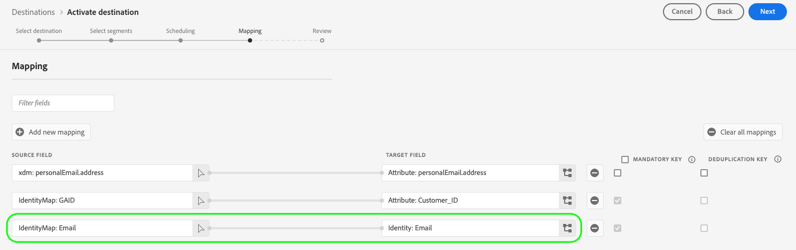

# Configuraciones de asignación admitidas

Los destinos creados con el Destination SDK admiten configuraciones específicas de área de nombres de identidad y asignación de atributos, según el tipo de destino.

Este artículo describe todas las configuraciones de asignación admitidas que puede utilizar al configurar su destino.

>[!WARNING]
>
>El Destination SDK no admite ninguna configuración de asignación que no se describa en este artículo.

Al crear el destino, configure el esquema y los espacios de nombres de identidad según una de las configuraciones de asignación descritas en esta página.

>[!IMPORTANT]
>
>Todos los nombres y valores de parámetro admitidos por el Destination SDK son **con distinción de mayúsculas y minúsculas**. Para evitar errores de distinción entre mayúsculas y minúsculas, utilice los parámetros nombres y valores exactamente como se muestra en la documentación.

## Asignaciones admitidas para destinos de flujo continuo {#streaming-mappings}

Los destinos en tiempo real (flujo continuo) creados con el Destination SDK admiten las configuraciones de asignación descritas en la siguiente tabla.

| Campo de origen | Campo de destino |
| --- | --- |
| Atributo XDM | Atributo personalizado |
| Área de nombres de identidad | Área de nombres de identidad |

El ejemplo de configuración siguiente permite a los clientes utilizar ambas asignaciones en la tabla anterior.

```json
"schemaConfig":{
   "profileRequired":true,
   "segmentRequired":true,
   "identityRequired":true
},
"identityNamespaces":{
   "Customer_contact":{
      "acceptsAttributes":false,
      "acceptsCustomNamespaces":true,
      "acceptedGlobalNamespaces":{
         "Email":{
            
         },
         "Phone":{
            
         }
      }
   }
},
```

### Asignación de atributos XDM a atributos personalizados {#streaming-xdm-to-custom}

Los usuarios pueden asignar atributos de su perfil XDM de origen a atributos personalizados en el lado del destino.

Los usuarios deben introducir manualmente el nombre del atributo personalizado de destino al seleccionar la asignación de campo de destino.


La experiencia de IU resultante se muestra en la siguiente imagen.


### Asignación de áreas de nombres de identidad a áreas de nombres de identidad de socios {#streaming-identity-to-identity}

Los usuarios pueden asignar áreas de nombres de identidad personalizadas o globales desde Platform a los áreas de nombres de identidad que haya definido.

La experiencia de IU resultante se muestra en la siguiente imagen.


## Asignaciones compatibles con destinos basados en archivos {#batch-mappings}

Los destinos basados en archivos creados con Destination SDK admiten las configuraciones de asignación descritas en la siguiente tabla. Consulte las secciones siguientes para ver ejemplos de asignación detallados.

| Campo de origen | Campo de destino |
| --- | --- |
| Atributo XDM | Atributo/Atributo personalizado |
| Área de nombres de identidad | Atributo/Atributo personalizado |
| Área de nombres de identidad | Área de nombres de identidad |

El siguiente ejemplo de configuración permite a los clientes utilizar todas las asignaciones de la tabla anterior.

```json
"schemaConfig":{
   "profileRequired":true,
   "segmentRequired":true,
   "identityRequired":true
},
"identityNamespaces":{
   "Customer_contact":{
      "acceptsAttributes":false,
      "acceptsCustomNamespaces":true,
      "acceptedGlobalNamespaces":{
         "Email":{
         },
         "Phone":{
         }
      }
   }
},
```

### Asignación de atributos XDM a atributos personalizados {#batch-xdm-to-custom}

Los usuarios pueden asignar atributos de su perfil XDM de origen a atributos personalizados en el lado del destino.

Para destinos basados en archivos, el campo de destino se rellena automáticamente con un atributo predeterminado del mismo nombre que el campo de origen.

La experiencia de IU resultante se muestra en la siguiente imagen.


Los usuarios pueden dejar el nombre predeterminado en su lugar o introducir un nombre de atributo personalizado en la pantalla de selección del campo de destino.


### Asignación de áreas de nombres de identidad a atributos personalizados {#batch-identity-to-custom}

Los usuarios pueden asignar áreas de nombres de identidad personalizadas o globales desde Platform a atributos personalizados en el lado del destino.

Al seleccionar un área de nombres de identidad como campo de origen, el campo de destino se rellena automáticamente con un área de nombres de identidad equivalente. Para reemplazar el campo de destino con un atributo personalizado, los usuarios deben introducir un nombre de atributo personalizado en la pantalla de selección del campo de destino.


La experiencia de IU resultante se muestra en la siguiente imagen.


### Asignación de áreas de nombres de identidad a áreas de nombres de identidad de socios {#batch-identity-to-identity}

Los usuarios pueden asignar áreas de nombres de identidad personalizadas o globales desde Platform a áreas de nombres de identidad equivalentes.

Al seleccionar un área de nombres de identidad como campo de origen, el campo de destino se rellena automáticamente con un área de nombres de identidad equivalente.

La experiencia de IU resultante se muestra en la siguiente imagen.




## Pasos siguientes {#next-steps}

Después de leer este artículo, debe comprender mejor qué asignaciones son compatibles con los destinos creados con Destination SDK.

Para obtener más información sobre los otros componentes de destino, consulte los siguientes artículos:

* [Autenticación del cliente](customer-authentication.md)
* [Autenticación OAuth2](oauth2-authentication.md)
* [Campos de datos del cliente](customer-data-fields.md)
* [Atributos de interfaz de usuario](ui-attributes.md)
* [Configuración del esquema](schema-configuration.md)
* [Configuración del área de nombres de identidad](identity-namespace-configuration.md)
* [Entrega de destino](destination-delivery.md)
* [Configuración de metadatos de audiencia](audience-metadata-configuration.md)
* [Política de agregación](aggregation-policy.md)
* [Configuración por lotes](batch-configuration.md)
* [Calificaciones históricas de perfil](historical-profile-qualifications.md)