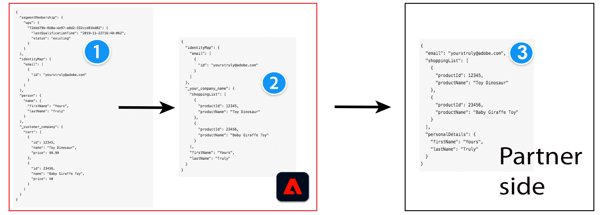

# Formato del mensaje

## Requisitos previos: conceptos de Adobe Experience Platform {#prerequisites}

Para comprender el formato de mensaje y el proceso de configuración y transformación de perfiles en el lado del Adobe, familiarícese con los siguientes conceptos de Experience Platform:

* **Modelo de datos de experiencia (XDM)**. [Información general de XDM](../../../../xdm/home.md) y [Cómo crear un esquema XDM en Adobe Experience Platform](../../../../xdm/tutorials/create-schema-ui.md).
* **Clase**. [Cree y edite clases en la interfaz de usuario](../../../../xdm/ui/resources/classes.md).
* **mapa de identidad**. El mapa de identidad representa un mapa de todas las identidades de los usuarios finales en Adobe Experience Platform. Consulte `xdm:identityMap` en el [diccionario de campo XDM](../../../../xdm/schema/field-dictionary.md).
* **PertenenciaSegmento**. El atributo XDM [segmentMembership](../../../../xdm/schema/field-dictionary.md) informa a qué audiencias pertenece un perfil. Para los tres valores diferentes del campo `status`, lea la documentación sobre [Grupo de campos de esquema Detalles de pertenencia a audiencias](../../../../xdm/field-groups/profile/segmentation.md).

>[!IMPORTANT]
>
>Todos los nombres y valores de parámetro admitidos por el Destination SDK distinguen entre mayúsculas y minúsculas **1&rbrace;.** Para evitar errores de distinción entre mayúsculas y minúsculas, utilice los nombres y valores de los parámetros exactamente como se muestra en la documentación.

## Tipos de integración admitidos {#supported-integration-types}

Consulte la tabla siguiente para obtener detalles sobre qué tipos de integraciones admiten la funcionalidad descrita en esta página.

| Tipo de integración | Admite funcionalidad |
|---|---|
| Integraciones en tiempo real (streaming) | Sí |
| Integraciones basadas en archivos (por lotes) | Sí (solo los pasos 1 y 2 del diagrama siguiente) |

## Información general {#overview}

Esta página aborda el formato de mensaje y la transformación de perfil en datos exportados de Adobe Experience Platform a destinos.

Adobe Experience Platform exporta datos a un número significativo de destinos, en varios formatos. Algunos ejemplos de tipos de destinos son plataformas publicitarias (Google), redes sociales (Facebook) y ubicaciones de almacenamiento en la nube (Amazon S3, Azure Event Hubs).

El Experience Platform puede ajustar el formato de mensaje de los perfiles exportados para que coincida con el formato esperado de su lado. Para comprender esta personalización, son importantes los siguientes conceptos:

* El esquema XDM de origen (1) y destino (2) en Adobe Experience Platform
* El formato de mensaje esperado del lado del socio (3), y
* La capa de transformación entre el esquema XDM y el formato de mensaje esperado, que puede definir creando una [plantilla de transformación de mensaje](#using-templating).


Experience Platform utiliza esquemas XDM para describir la estructura de los datos de una manera uniforme y reutilizable.

<!--

Users who want to activate data to your destination need to map the fields in their Experience Platform datasets to a schema that translates to your destination's expected format. Adobe will create a custom field group for your company to add to the target schema. The fields in the field group depend on the profile attribute fields that you can receive.

-->

**Esquema XDM de Source (1)**: Este elemento hace referencia al esquema que los clientes utilizan en Experience Platform. En Experience Platform, en el [paso de asignación](../../../ui/activate-segment-streaming-destinations.md#mapping) del flujo de trabajo de activación de destino, los clientes asignan campos de su esquema XDM al esquema de destino (2).

**Esquema XDM de destino (2)**: según el esquema estándar JSON (3) del formato esperado del destino y los atributos que el destino puede interpretar, puede definir atributos e identidades de perfil en el esquema XDM de destino. Puede hacerlo en la configuración de destinos, en los objetos [schemaConfig](../../functionality/destination-configuration/schema-configuration.md) e [identityNamespaces](../../functionality/destination-configuration/identity-namespace-configuration.md).

**Esquema estándar JSON de sus atributos de perfil de destino (3)**: Este ejemplo representa un [esquema JSON](https://json-schema.org/learn/miscellaneous-examples.html) de todos los atributos de perfil que admite su plataforma y sus tipos (por ejemplo: objeto, cadena, matriz). Campos de ejemplo compatibles con su destino: `firstName`, `lastName`, `gender`, `email`, `phone`, `productId`, `productName`, etc. Necesita una [plantilla de transformación de mensajes](#using-templating) para adaptar los datos exportados fuera de Experience Platform al formato esperado.

En función de las transformaciones de esquema descritas anteriormente, así es como cambia una configuración de perfil entre el esquema XDM de origen y un esquema de muestra en el lado del socio:



## Introducción: transformación de tres atributos básicos {#getting-started}

Para mostrar el proceso de transformación de perfiles, el ejemplo siguiente utiliza tres atributos de perfil comunes en Adobe Experience Platform: **nombre**, **apellido** y **dirección de correo electrónico**.

>[!NOTE]
>
>El cliente asigna los atributos del esquema XDM de origen al esquema XDM del socio en la interfaz de usuario de Adobe Experience Platform, en el paso **Mapping** del flujo de trabajo [activate destination workflow](../../../ui/activate-segment-streaming-destinations.md#mapping).

Supongamos que su plataforma puede recibir un formato de mensaje como:

```shell
POST https://YOUR_REST_API_URL/users/
Content-Type: application/json
Authorization: Bearer YOUR_REST_API_KEY

{
  "attributes":
    {
      "first_name": "Yours",
      "last_name": "Truly",
      "external_id": "yourstruly@adobe.com"
    }
}
```

Teniendo en cuenta el formato del mensaje, las transformaciones correspondientes son las siguientes:

| Atributo en el esquema XDM del socio en el lado del Adobe | Transformación | Atributo en el mensaje HTTP de su lado |
|---------|----------|---------|
| `_your_custom_schema.firstName` | ` attributes.first_name` | `first_name` |
| `_your_custom_schema.lastName` | `attributes.last_name` | `last_name` |
| `personalEmail.address` | `attributes.external_id` | `external_id` |

{style="table-layout:auto"}

## Estructura de perfil en el Experience Platform {#profile-structure}

Para comprender los ejemplos que se muestran a continuación en la página, es importante conocer la estructura de un perfil en Experience Platform.

Los perfiles tienen 3 secciones:

* `segmentMembership` (siempre presente en un perfil)
   * esta sección contiene todas las audiencias que están presentes en el perfil. Las audiencias pueden tener uno de estos dos estados: `realized` o `exited`.
* `identityMap` (siempre presente en un perfil)
   * esta sección contiene todas las identidades presentes en el perfil (correo electrónico, GAID de Google, IDFA de Apple, etc.) y que el usuario asignó para la exportación en el flujo de trabajo de activación.
* atributos (según la configuración de destino, estos pueden estar presentes en el perfil). También hay una ligera diferencia entre los atributos predefinidos y los atributos de forma libre:
   * para *atributos de forma libre*, contienen una ruta de acceso `.value` si el atributo está presente en el perfil (consulte el atributo `lastName` del ejemplo 1). Si no están presentes en el perfil, no contendrán la ruta de acceso `.value` (consulte el atributo `firstName` del ejemplo 1).
   * para *atributos predefinidos*, no contienen una ruta de acceso `.value`. Todos los atributos asignados que están presentes en un perfil están presentes en la asignación de atributos. Las que no están presentes (consulte Ejemplo 2: el atributo `firstName` no existe en el perfil).

Consulte a continuación dos ejemplos de perfiles en Experience Platform:

### Ejemplo 1 con `segmentMembership`, `identityMap` y atributos para atributos de forma libre {#example-1}

```json
{
  "segmentMembership": {
    "ups": {
      "11111111-1111-1111-1111-111111111111": {
        "lastQualificationTime": "2019-04-15T02:41:50.000+0000",
        "status": "realized"
      }
    }
  },
  "identityMap": {
    "mobileIds": [
      {
        "id": "e86fb215-0921-4537-bc77-969ff775752c"
      }
    ]
  },
  "attributes": {
    "firstName": {
    },
    "lastName": {
      "value": "lastName"
    }
  }
}
```

### Ejemplo 2 con `segmentMembership`, `identityMap` y atributos para atributos predefinidos {#example-2}

```json
{
  "segmentMembership": {
    "ups": {
      "11111111-1111-1111-1111-111111111111": {
        "lastQualificationTime": "2019-04-15T02:41:50.000+0000",
        "status": "realized"
      }
    }
  },
  "identityMap": {
    "mobileIds": [
      {
        "id": "e86fb215-0921-4537-bc77-969ff775752c"
      }
    ]
  },
  "attributes": {
    "lastName": "lastName"
  }
}
```

## Uso de un idioma de plantilla para las transformaciones de identidad, atributos y pertenencia a audiencias {#using-templating}

Adobe usa [Pebble templates](https://pebbletemplates.io/), un lenguaje de creación de plantillas similar a [Jinja](https://jinja.palletsprojects.com/en/2.11.x/), para transformar los campos del esquema XDM de Experience Platform en un formato compatible con el destino.

Esta sección proporciona varios ejemplos de cómo se realizan estas transformaciones: desde el esquema XDM de entrada, pasando por la plantilla, y la salida en formatos de carga útil aceptados por el destino. Los ejemplos siguientes se presentan por el aumento de la complejidad, de la siguiente manera:

1. Ejemplos de transformación simples. Descubra cómo funciona la creación de plantillas con transformaciones sencillas para los campos [Atributos de perfil](#attributes), [Pertenencia a audiencias](#segment-membership) e [Identidad](#identities).
2. Ejemplos de complejidad aumentada de plantillas que combinan los campos anteriores: [Cree una plantilla que envíe audiencias e identidades](./message-format.md#segments-and-identities) y [Cree una plantilla que envíe segmentos, identidades y atributos de perfil](#segments-identities-attributes).
3. Plantillas que incluyen la clave de agregación. Cuando usa [agregación configurable](../../functionality/destination-configuration/aggregation-policy.md#configurable-aggregation) en la configuración de destino, Experience Platform agrupa los perfiles exportados a su destino según criterios como ID de audiencia, estado de audiencia o áreas de nombres de identidad.

### Atributos de perfil {#attributes}

Para transformar los atributos de perfil exportados a su destino, consulte los ejemplos de código JSON y a continuación.

>[!IMPORTANT]
>
>Para obtener una lista de todos los atributos de perfil disponibles en Adobe Experience Platform, consulte el [diccionario de campos XDM](../../../../xdm/schema/field-dictionary.md).


**Entrada**

Perfil 1:

```json
{
    "attributes": {
        "firstName": {
            "value": "Hermione"
    },
    "birthDate": {}
  }
}
```

Perfil 2:

```json
{
  "attributes": {
    "firstName": {
      "value": "Harry"
    },
    "birthDate": {
        "value": "1980/07/31"
    }
  }
}
```

**Plantilla**

>[!IMPORTANT]
>
>Para todas las plantillas que use, debe omitir los caracteres no válidos, como las comillas dobles `""` antes de insertar la [plantilla](../../functionality/destination-server/templating-specs.md) en la [configuración del servidor de destino](../../authoring-api/destination-server/create-destination-server.md). Para obtener más información sobre cómo escapar comillas dobles, consulte el capítulo 9 del [estándar JSON](https://www.ecma-international.org/publications-and-standards/standards/ecma-404/).

```python
{
    "profiles": [
        
        {
            
            "{{ attribute.key }}":
                
                    null
                
                    "{{ attribute.value.value }}"
                
            ,
            
        },
        
    ]
}
```

**Resultado**


```json
{
    "profiles": [
        {
            "firstName": "Hermione",
            "birthDate": null
        },
        {
            "firstName": "Harry",
            "birthDate": "1980/07/31"
        }
    ]
}
```

### Abono de público {#audience-membership}

El atributo XDM [segmentMembership](../../../../xdm/schema/field-dictionary.md) informa a qué audiencias pertenece un perfil.
Para los tres valores diferentes del campo `status`, lea la documentación sobre [Grupo de campos de esquema Detalles de pertenencia a audiencias](../../../../xdm/field-groups/profile/segmentation.md).

**Entrada**

Perfil 1:

```json
{
  "segmentMembership": {
    "ups": {
      "36a51c13-9dd6-4d2c-8aa3-07d785ea5075": {
        "lastQualificationTime": "2019-11-20T13:15:49Z",
        "status": "realized"
      },
      "788d8874-8007-4253-92b7-ee6b6c20c6f3": {
        "lastQualificationTime": "2019-11-20T13:15:49Z",
        "status": "realized"
      },
      "8f812592-3f06-416b-bd50-e7831848a31a": {
        "lastQualificationTime": "2019-11-20T13:15:49Z",
        "status": "exited"
      }
    }
  }
}
```

Perfil 2:

```json
{
  "segmentMembership": {
    "ups": {
      "32396e4b-16f6-4033-9702-fc69b5e24e7c": {
        "lastQualificationTime": "2021-08-20T17:23:04Z",
        "status": "realized"
      },
      "af854278-894a-4192-a96b-320fbf2623fd": {
        "lastQualificationTime": "2021-08-20T16:44:37Z",
        "status": "realized"
      },
      "66505bf9-bc08-4bac-afbc-8b6706650ea4": {
        "lastQualificationTime": "2019-08-20T17:23:04Z",
        "status": "realized"
      }
    }
  }
}
```

**Plantilla**

>[!IMPORTANT]
>
>Para todas las plantillas que use, debe omitir los caracteres no válidos, como las comillas dobles `""` antes de insertar la [plantilla](../../functionality/destination-server/templating-specs.md) en la [configuración del servidor de destino](../../authoring-api/destination-server/create-destination-server.md). Para obtener más información sobre cómo escapar comillas dobles, consulte el capítulo 9 del [estándar JSON](https://www.ecma-international.org/publications-and-standards/standards/ecma-404/).


```python
{
    "profiles": [
        
        {
            "AdobeExperiencePlatformSegments": {
                "add": [
                
                "{{ segment.key }}",
                
                ],
                "remove": [
                {# Alternative syntax for filtering audiences by status: #}
                
                "{{ segment.key }}",
                
                ]
            }
        },
        
    ]
}
```

**Resultado**

```json
{
    "profiles": [
        {
            "AdobeExperiencePlatformSegments": {
                "add": [
                    "36a51c13-9dd6-4d2c-8aa3-07d785ea5075",
                    "788d8874-8007-4253-92b7-ee6b6c20c6f3"
                ],
                "remove": [
                    "8f812592-3f06-416b-bd50-e7831848a31a"
                ]
            }
        },
        {
            "AdobeExperiencePlatformSegments": {
                "add": [
                    "32396e4b-16f6-4033-9702-fc69b5e24e7c",
                    "af854278-894a-4192-a96b-320fbf2623fd",
                    "66505bf9-bc08-4bac-afbc-8b6706650ea4"
                ],
                "remove": [
                ]
            }
        }
    ]
}
```

### Identidades {#identities}

Para obtener información acerca de las identidades en Experience Platform, consulte la [descripción general del área de nombres de identidad](../../../../identity-service/features/namespaces.md).

**Entrada**

Perfil 1:

```json
{
    "identityMap": {
        "email": [
            {
                "id": "johndoe@example.com"
            },
            {
                "id": "jd@example.com"
            }
        ],
        "external_id": [
            {
                "id": "123456"
            }
        ]
    }
}
```

Perfil 2:

```json
{
    "identityMap": {
        "email": [
            {
                "id": "jane.doe@example.com"
            }
        ]
    }
}
```

**Plantilla**

>[!IMPORTANT]
>
>Para todas las plantillas que use, debe omitir los caracteres no válidos, como las comillas dobles `""` antes de insertar la [plantilla](../../functionality/destination-server/templating-specs.md) en la [configuración del servidor de destino](../../authoring-api/destination-server/create-destination-server.md). Para obtener más información sobre cómo escapar comillas dobles, consulte el capítulo 9 del [estándar JSON](https://www.ecma-international.org/publications-and-standards/standards/ecma-404/).

```python
{
    "profiles": [
        
        {
            "identities": [
                
                {
                    "type": "email",
                    "id": "{{ email.id }}"
                },
                

                {# Add a comma only if you have both emails and external_ids. #}
                
                    ,
                

                
                {
                    "type": "external_id",
                    "id": "{{ external.id }}"
                },
                
            ]
        },
        
    ]
}
```

**Resultado**

```json
{
    "profiles": [
        {
            "identities": [
                {
                    "type": "email",
                    "id": "johndoe@example.com"
                },
                {
                    "type": "email",
                    "id": "jd@example.com"
                },
                {
                    "type": "external_id",
                    "id": "123456"
                }
            ]
        },
        {
            "identities": [
                {
                    "type": "email",
                    "id": "jane.doe@example.com"
                }
            ]
        }
    ]
}
```

### Creación de una plantilla que envíe audiencias e identidades {#segments-and-identities}

Esta sección proporciona un ejemplo de una transformación utilizada comúnmente entre el esquema XDM de Adobe y el esquema de destino de socio.
El ejemplo siguiente muestra cómo transformar el formato de pertenencia e identidades de la audiencia y mostrarlos en su destino.

**Entrada**

Perfil 1:

```json
{
    "identityMap": {
        "email": [
            {
                "id": "johndoe@example.com"
            },
            {
                "id": "jd@example.com"
            }
        ],
        "external_id": [
            {
                "id": "123456"
            }
        ]
    },
    "segmentMembership": {
        "ups": {
            "36a51c13-9dd6-4d2c-8aa3-07d785ea5075": {
                "lastQualificationTime": "2019-11-20T13:15:49Z",
                "status": "realized"
            },
            "788d8874-8007-4253-92b7-ee6b6c20c6f3": {
              "lastQualificationTime": "2019-11-20T13:15:49Z",
              "status": "realized"
            },
            "8f812592-3f06-416b-bd50-e7831848a31a": {
                "lastQualificationTime": "2019-11-20T13:15:49Z",
                "status": "exited"
            }
        }
    }
}
```

Perfil 2:

```json
{
    "identityMap": {
        "email": [
            {
                "id": "jane.doe@example.com"
            }
        ]
    },
    "segmentMembership": {
        "ups": {
            "36a51c13-9dd6-4d2c-8aa3-07d785ea5075": {
                "lastQualificationTime": "2021-08-31T10:01:42Z",
                "status": "realized"
            }
        }
    }
}
```

**Plantilla**

>[!IMPORTANT]
>
>Para todas las plantillas que use, debe omitir los caracteres no válidos, como las comillas dobles `""` antes de insertar la [plantilla](../../functionality/destination-server/templating-specs.md) en la [configuración del servidor de destino](../../authoring-api/destination-server/create-destination-server.md). Para obtener más información sobre cómo escapar comillas dobles, consulte el capítulo 9 del [estándar JSON](https://www.ecma-international.org/publications-and-standards/standards/ecma-404/).

```python
{
    "profiles": [
        
        {
            "identities": [
                
                {
                    "type": "email",
                    "id": "{{ email.id }}"
                },
                
                
                {# Add a comma only if you have both emails and external_ids. #}
                
                    ,
                
                
                
                {
                    "type": "external_id",
                    "id": "{{ external.id }}"
                },
                
            ],
            "AdobeExperiencePlatformSegments": {
                "add": [
                    
                    "{{ segment.key }}",
                    
                ],
                "remove": [
                    {# Alternative syntax for filtering audiences by status: #}
                    
                    "{{ segment.key }}",
                    
                ]
            }
        },
        
    ]
}
```

**Resultado**

El(la) `json` siguiente representa los datos exportados fuera de Adobe Experience Platform.

```json
{
    "profiles": [
        {
            "identities": [
                {
                    "type": "email",
                    "id": "johndoe@example.com"
                },
                {
                    "type": "email",
                    "id": "jd@example.com"
                },
                {
                    "type": "external_id",
                    "id": "123456"
                }
            ],
            "AdobeExperiencePlatformSegments": {
                "add": [
                    "36a51c13-9dd6-4d2c-8aa3-07d785ea5075",
                    "788d8874-8007-4253-92b7-ee6b6c20c6f3"
                ],
                "remove": [
                    "8f812592-3f06-416b-bd50-e7831848a31a"
                ]
            }
        },
        {
            "identities": [
                {
                    "type": "email",
                    "id": "jane.doe@example.com"
                }
            ],
            "AdobeExperiencePlatformSegments": {
                "add": [
                    "36a51c13-9dd6-4d2c-8aa3-07d785ea5075"
                ],
                "remove": []
            }
        }
    ]
}
```

### Crear una plantilla que envíe segmentos, identidades y atributos de perfil {#segments-identities-attributes}

Esta sección proporciona un ejemplo de una transformación utilizada comúnmente entre el esquema XDM de Adobe y el esquema de destino de socio.

Otro caso de uso común es la exportación de datos que contienen miembros de la audiencia, identidades (por ejemplo: dirección de correo electrónico, número de teléfono, ID de publicidad) y atributos de perfil. Para exportar datos de esta manera, consulte el ejemplo siguiente:

**Entrada**

Perfil 1:

```json
{
    "attributes": {
        "firstName": {
            "value": "Hermione"
        },
        "birthDate": {}
    },
    "identityMap": {
        "email": [
            {
                "id": "johndoe@example.com"
            },
            {
                "id": "jd@example.com"
            }
        ],
        "external_id": [
            {
                "id": "123456"
            }
        ]
    },
    "segmentMembership": {
        "ups": {
            "36a51c13-9dd6-4d2c-8aa3-07d785ea5075": {
                "lastQualificationTime": "2019-11-20T13:15:49Z",
                "status": "realized"
            },
            "788d8874-8007-4253-92b7-ee6b6c20c6f3": {
              "lastQualificationTime": "2019-11-20T13:15:49Z",
              "status": "realized"
            },
            "8f812592-3f06-416b-bd50-e7831848a31a": {
                "lastQualificationTime": "2019-11-20T13:15:49Z",
                "status": "exited"
            }
        }
    }
}
```

Perfil 2:

```json
{
    "attributes": {
        "firstName": {
            "value": "Harry"
        },
        "birthDate": {
            "value": "1980/07/31"
        }
    },
    "identityMap": {
        "email": [
            {
                "id": "harry.p@example.com"
            }
        ]
    },
    "segmentMembership": {
        "ups": {
            "36a51c13-9dd6-4d2c-8aa3-07d785ea5075": {
                "lastQualificationTime": "2019-11-20T13:15:49Z",
                "status": "realized"
            }
        }
    }
}
```

**Plantilla**

>[!IMPORTANT]
>
>Para todas las plantillas que use, debe omitir los caracteres no válidos, como las comillas dobles `""` antes de insertar la [plantilla](../../functionality/destination-server/templating-specs.md) en la [configuración del servidor de destino](../../authoring-api/destination-server/create-destination-server.md). Para obtener más información sobre cómo escapar comillas dobles, consulte el capítulo 9 del [estándar JSON](https://www.ecma-international.org/publications-and-standards/standards/ecma-404/).

```python
{
    "profiles": [
        
        {
            "attributes": {
            
                "{{ attribute.key }}":
                    
                        null
                    
                        "{{ attribute.value.value }}"
                    
                ,
            
            },
            "identities": [
                
                {
                    "type": "email",
                    "id": "{{ email.id }}"
                },
                

                {# Add a comma only if we have both emails and external_ids. #}
                
                    ,
                

                
                {
                    "type": "external_id",
                    "id": "{{ external.id }}"
                },
                
            ],
            "AdobeExperiencePlatformSegments": {
                "add": [
                
                    "{{ segment.key }}",
                
                ],
                "remove": [
                {# Alternative syntax for filtering audiences by status: #}
                
                    "{{ segment.key }}",
                
                ]
            }
        }
    ]
}
```

**Resultado**

El(la) `json` siguiente representa los datos exportados fuera de Adobe Experience Platform.

```json
{
    "profiles": [
        {
            "attributes": {
                "firstName": "Hermione",
                "birthDate": null
            },
            "identities": [
                {
                    "type": "email",
                    "id": "johndoe@example.com"
                },
                {
                    "type": "email",
                    "id": "jd@example.com"
                },
                {
                    "type": "external_id",
                    "id": "123456"
                }
            ],
            "AdobeExperiencePlatformSegments": {
                "add": [
                    "36a51c13-9dd6-4d2c-8aa3-07d785ea5075",
                    "788d8874-8007-4253-92b7-ee6b6c20c6f3"
                ],
                "remove": [
                    "8f812592-3f06-416b-bd50-e7831848a31a"
                ]
            }
        },
        {
            "attributes": {
                "firstName": "Harry",
                "birthDate": "1980/07/21"
            },
            "identities": [
                {
                    "type": "email",
                    "id": "harry.p@example.com"
                }
            ],
            "AdobeExperiencePlatformSegments": {
                "add": [
                    "36a51c13-9dd6-4d2c-8aa3-07d785ea5075"
                ],
                "remove": []
            }
        }
    ]
}
```

### Incluya una clave de agregación en la plantilla para acceder a los perfiles exportados agrupados por varios criterios {#template-aggregation-key}

Cuando usa [agregación configurable](../../functionality/destination-configuration/aggregation-policy.md#configurable-aggregation) en la configuración de destino, puede agrupar los perfiles exportados a su destino según criterios como ID de audiencia, alias de audiencia, pertenencia de audiencia o áreas de nombres de identidad.

En la plantilla de transformación de mensajes, puede acceder a las claves de agregación mencionadas anteriormente, como se muestra en los ejemplos de las secciones siguientes. Utilice claves de agregación para estructurar el mensaje HTTP exportado fuera del Experience Platform de modo que coincida con el formato y los límites de velocidad esperados por el destino.

#### Usar clave de agregación de ID de audiencia en la plantilla {#aggregation-key-segment-id}

Si usa [la agregación configurable](../../functionality/destination-configuration/aggregation-policy.md#configurable-aggregation) y establece `includeSegmentId` como verdadero, los perfiles de los mensajes HTTP exportados a su destino se agrupan por ID de audiencia. Consulte a continuación cómo puede acceder al ID de audiencia en la plantilla.

**Entrada**

Considere los cuatro perfiles siguientes, donde:

* los dos primeros forman parte de la audiencia con el ID de audiencia `788d8874-8007-4253-92b7-ee6b6c20c6f3`
* el tercer perfil forma parte de la audiencia con el ID de audiencia `8f812592-3f06-416b-bd50-e7831848a31a`
* el cuarto perfil forma parte de las dos audiencias anteriores.

Perfil 1:

```json
{
   "attributes":{
      "firstName":{
         "value":"Hermione"
      }
   },
   "segmentMembership":{
      "ups":{
         "788d8874-8007-4253-92b7-ee6b6c20c6f3":{
            "lastQualificationTime":"2020-11-20T13:15:49Z",
            "status":"realized"
         }
      }
   }
}
```

Perfil 2:

```json
{
   "attributes":{
      "firstName":{
         "value":"Harry"
      }
   },
   "segmentMembership":{
      "ups":{
         "788d8874-8007-4253-92b7-ee6b6c20c6f3":{
            "lastQualificationTime":"2020-11-20T13:15:49Z",
            "status":"realized"
         }
      }
   }
}
```

Perfil 3:

```json
{
   "attributes":{
      "firstName":{
         "value":"Tom"
      }
   },
   "segmentMembership":{
      "ups":{
         "8f812592-3f06-416b-bd50-e7831848a31a":{
            "lastQualificationTime":"2021-02-20T12:00:00Z",
            "status":"realized"
         }
      }
   }
}
```

Perfil 4:

```json
{
   "attributes":{
      "firstName":{
         "value":"Jerry"
      }
   },
   "segmentMembership":{
      "ups":{
         "8f812592-3f06-416b-bd50-e7831848a31a":{
            "lastQualificationTime":"2021-02-20T12:00:00Z",
            "status":"realized"
         },
         "788d8874-8007-4253-92b7-ee6b6c20c6f3":{
            "lastQualificationTime":"2020-11-20T13:15:49Z",
            "status":"realized"
         }
      }
   }
}
```

**Plantilla**

>[!IMPORTANT]
>
>Para todas las plantillas que use, debe omitir los caracteres no válidos, como las comillas dobles `""` antes de insertar la [plantilla](../../functionality/destination-server/templating-specs.md) en la [configuración del servidor de destino](../../authoring-api/destination-server/create-destination-server.md). Para obtener más información sobre cómo escapar comillas dobles, consulte el capítulo 9 del [estándar JSON](https://www.ecma-international.org/publications-and-standards/standards/ecma-404/).

Observe a continuación cómo se utiliza `audienceId` en la plantilla para acceder a los ID de audiencia. En este ejemplo se supone que se usa `audienceId` para la pertenencia a audiencias en la taxonomía de destino. Puede utilizar cualquier otro nombre de campo en su lugar, según su propia taxonomía.

```python
{
    "audienceId": "{{ input.aggregationKey.segmentId }}",
    "profiles": [
        
        {
            "first_name": "{{ profile.attributes.firstName.value }}"
        },
        
    ]
}
```

**Resultado**

Cuando se exportan al destino, los perfiles se dividen en dos grupos, según su ID de audiencia.

```json
{
   "audienceId":"788d8874-8007-4253-92b7-ee6b6c20c6f3",
   "profiles":[
      {
         "firstName":"Hermione"
      },
      {
         "firstName":"Harry"
      },
      {
         "firstName":"Jerry"
      }
   ]
}
```

```json
{
   "audienceId":"8f812592-3f06-416b-bd50-e7831848a31a",
   "profiles":[
      {
         "firstName":"Tom"
      },
      {
         "firstName":"Jerry"
      }
   ]
}
```

#### Usar clave de agregación de alias de audiencia en la plantilla {#aggregation-key-segment-alias}

Si usa [la agregación configurable](../../functionality/destination-configuration/aggregation-policy.md#configurable-aggregation) y establece `includeSegmentId` como verdadero, también puede obtener acceso al alias de audiencia en la plantilla.

Añada la línea siguiente a la plantilla para acceder a los perfiles exportados agrupados por alias de audiencia.

```python
customerList={{input.aggregationKey.segmentAlias}}
```

#### Utilizar la clave de agregación del estado de audiencia en la plantilla {#aggregation-key-segment-status}

Si usa [la agregación configurable](../../functionality/destination-configuration/aggregation-policy.md#configurable-aggregation) y establece `includeSegmentId` y `includeSegmentStatus` en true, puede obtener acceso al estado de la audiencia en la plantilla. De este modo, puede agrupar perfiles en los mensajes HTTP exportados a su destino en función de si los perfiles deben añadirse o eliminarse de los segmentos.

Los valores posibles son:

* realizado
* existente
* abandonado

Añada la línea de abajo a la plantilla para añadir o quitar perfiles de segmentos, según los valores anteriores:

```python
action=REMOVEADD
```

#### Usar clave de agregación del área de nombres de identidad en la plantilla {#aggregation-key-identity}

A continuación se muestra un ejemplo en el que la agregación [configurable](../../functionality/destination-configuration/aggregation-policy.md#configurable-aggregation) de la configuración de destino está establecida para agregar perfiles exportados por áreas de nombres de identidad, con el formato `"namespaces": ["email", "phone"]` y `"namespaces": ["GAID", "IDFA"]`. Consulte el parámetro `groups` en la documentación de [crear configuración de destino](../../authoring-api/destination-configuration/create-destination-configuration.md) para obtener más información sobre la agrupación.

**Entrada**

Perfil 1:

```json
{
   "identityMap":{
      "email":[
         {
            "id":"e1@example.com"
         },
         {
            "id":"e2@example.com"
         }
      ],
      "phone":[
         {
            "id":"+40744111222"
         }
      ],
      "IDFA":[
         {
            "id":"AEBE52E7-03EE-455A-B3C4-E57283966239"
         }
      ],
      "GAID":[
         {
            "id":"e4fe9bde-caa0-47b6-908d-ffba3fa184f2"
         }
      ]
   }
}
```

Perfil 2:

```json
{
   "identityMap":{
      "email":[
         {
            "id":"e3@example.com"
         }
      ],
      "phone":[
         {
            "id":"+40744333444"
         },
         {
            "id":"+40744555666"
         }
      ],
      "IDFA":[
         {
            "id":"134GHU45-34HH-GHJ7-K0H8-LHN665998NN0"
         }
      ],
      "GAID":[
         {
            "id":"47bh00i9-8jv6-334n-lll8-nb7f24sghg76"
         }
      ]
   }
}
```

**Plantilla**

>[!IMPORTANT]
>
>Para todas las plantillas que use, debe omitir los caracteres no válidos, como las comillas dobles `""` antes de insertar la [plantilla](../../functionality/destination-server/templating-specs.md) en la [configuración del servidor de destino](../../authoring-api/destination-server/create-destination-server.md). Para obtener más información sobre cómo escapar comillas dobles, consulte el capítulo 9 del [estándar JSON](https://www.ecma-international.org/publications-and-standards/standards/ecma-404/).

Observe que `input.aggregationKey.identityNamespaces` se usa en la plantilla siguiente

```python
{
            "profiles": [
            
            {
                
                "{{ns}}": [
                    
                    "{{id.id}}",
                    
                ],
                
            },
            
        ]
}
```

**Resultado**

Cuando se exportan al destino, los perfiles se dividen en dos grupos, según sus áreas de nombres de identidad. El correo electrónico y el teléfono están en un grupo, mientras que GAID e IDFA están en otro.

```json
{
   "profiles":[
      {
         "email":[
            "e1@example.com",
            "e2@example.com"
         ],
         "phone":[
            "+40744111222"
         ]
      },
      {
         "email":[
            "e3@example.com"
         ],
         "phone":[
            "+40744333444",
            "+40744555666"
         ]
      }
   ]
}
```

```json
{
   "profiles":[
      {
         "IDFA":[
            "AEBE52E7-03EE-455A-B3C4-E57283966239"
         ],
         "GAID":[
            "e4fe9bde-caa0-47b6-908d-ffba3fa184f2"
         ]
      },
      {
         "IDFA":[
            "134GHU45-34HH-GHJ7-K0H8-LHN665998NN0"
         ],
         "GAID":[
            "47bh00i9-8jv6-334n-lll8-nb7f24sghg76"
         ]
      }
   ]
}
```

#### Uso de la clave de agregación en una plantilla URL {#aggregation-key-url-template}

Según el caso de uso, también puede utilizar las claves de agregación que se describen aquí en una dirección URL, como se muestra a continuación:

```python
https://api.example.com/audience/{{input.aggregationKey.segmentId}}
```

### Referencia: Contexto y funciones utilizadas en las plantillas de transformación {#reference}

El contexto proporcionado a la plantilla contiene `input` (los perfiles/datos exportados en esta llamada) y `destination` (datos sobre el destino al que el Adobe está enviando datos, válidos para todos los perfiles).

En la tabla siguiente se proporcionan descripciones de las funciones de los ejemplos anteriores.

| Función | Descripción | Ejemplo |
|---------|----------|----------|
| `input.profile` | El perfil, representado como [JsonNode](https://fasterxml.github.io/jackson-databind/javadoc/2.11/com/fasterxml/jackson/databind/node/JsonNodeType.html). Sigue el esquema XDM de socio mencionado anteriormente en esta página. |
| `hasSegments` | Esta función toma un mapa de ID de audiencia de área de nombres como parámetro. La función devuelve `true` si hay al menos una audiencia en el mapa (independientemente de su estado) y `false` en caso contrario. Puede utilizar esta función para decidir si desea iterar en un mapa de audiencias o no. | `hasSegments(input.profile.segmentMembership)` |
| `destination.namespaceSegmentAliases` | Mapa de ID de audiencia en un área de nombres de Adobe Experience Platform específica a alias de audiencia en el sistema del socio. | `destination.namespaceSegmentAliases["ups"]["seg-id-1"]` |
| `destination.namespaceSegmentNames` | Mapa de nombres de audiencia en áreas de nombres de Adobe Experience Platform específicas a nombres de audiencia en el sistema del socio. | `destination.namespaceSegmentNames["ups"]["seg-name-1"]` |
| `destination.namespaceSegmentTimestamps` | Devuelve la hora en la que se creó, actualizó o activó una audiencia en formato de marca de tiempo UNIX. | <ul><li>`destination.namespaceSegmentTimestamps["ups"]["seg-id-1"].createdAt`: devuelve la hora en la que se creó el segmento con el ID `seg-id-1`, del área de nombres `ups`, en formato de marca de tiempo UNIX.</li><li>`destination.namespaceSegmentTimestamps["ups"]["seg-id-1"].updatedAt`: devuelve la hora en que se actualizó la audiencia con el ID `seg-id-1`, del área de nombres `ups`, en formato de marca de tiempo UNIX.</li><li>`destination.namespaceSegmentTimestamps["ups"]["seg-id-1"].mappingCreatedAt`: devuelve la hora en que la audiencia con el ID `seg-id-1`, desde el área de nombres `ups`, se activó en el destino, en formato de marca de tiempo UNIX.</li><li>`destination.namespaceSegmentTimestamps["ups"]["seg-id-1"].mappingUpdatedAt`: devuelve la hora en que se actualizó la activación de audiencia en el destino, en formato de marca de tiempo UNIX.</li></ul> |
| `addedSegments(mapOfNamespacedSegmentIds)` | Devuelve solo las audiencias que tienen el estado `realized`, en todas las áreas de nombres. | `addedSegments(input.profile.segmentMembership)` |
| `removedSegments(mapOfNamespacedSegmentIds)` | Devuelve solo las audiencias que tienen el estado `exited`, en todas las áreas de nombres. | `removedSegments(input.profile.segmentMembership)` |
| `destination.segmentAliases` | **Obsoleto. Se reemplazó por`destination.namespaceSegmentAliases`** <br><br>. Se ha asignado un mapa de los ID de audiencia en el área de nombres de Adobe Experience Platform a alias de audiencia en el sistema del socio. | `destination.segmentAliases["seg-id-1"]` |
| `destination.segmentNames` | **Obsoleto. Se reemplazó por`destination.namespaceSegmentNames`** <br><br> Asignación de nombres de audiencia en el área de nombres de Adobe Experience Platform a nombres de audiencia en el sistema del socio. | `destination.segmentNames["seg-name-1"]` |
| `destination.segmentTimestamps` | **Obsoleto. Reemplazado por`destination.namespaceSegmentTimestamps`** <br><br> Devuelve la hora en que se creó, actualizó o activó una audiencia en formato de marca de tiempo UNIX. | <ul><li>`destination.segmentTimestamps["seg-id-1"].createdAt`: devuelve la hora en que se creó la audiencia con el ID `seg-id-1`, en formato de marca de tiempo UNIX.</li><li>`destination.segmentTimestamps["seg-id-1"].updatedAt`: devuelve la hora en que se actualizó la audiencia con el ID `seg-id-1`, en formato de marca de tiempo UNIX.</li><li>`destination.segmentTimestamps["seg-id-1"].mappingCreatedAt`: devuelve la hora en que la audiencia con el ID `seg-id-1` se activó en el destino, en formato de marca de tiempo UNIX.</li><li>`destination.segmentTimestamps["seg-id-1"].mappingUpdatedAt`: devuelve la hora en que se actualizó la activación de audiencia en el destino, en formato de marca de tiempo UNIX.</li></ul> |

{style="table-layout:auto"}

## Pasos siguientes {#next-steps}

Después de leer este documento, ahora sabe cómo se transforman los datos exportados fuera de Experience Platform. A continuación, lea las siguientes páginas para completar sus conocimientos sobre la creación de plantillas de transformación de mensajes para su destino:

* [Creación y prueba de una plantilla de transformación de mensajes](../../testing-api/streaming-destinations/create-template.md)
* [Procesar operaciones de API de plantilla](../../testing-api/streaming-destinations/render-template-api.md)
* [Funciones de transformación compatibles en Destination SDK](../destination-server/supported-functions.md)

Para obtener más información acerca de los demás componentes del servidor de destino, consulte los siguientes artículos:

* [Especificaciones del servidor para destinos creados con Destination SDK](server-specs.md)
* [Especificaciones de plantilla](templating-specs.md)
* [Configuración de formato de archivo](file-formatting.md)
