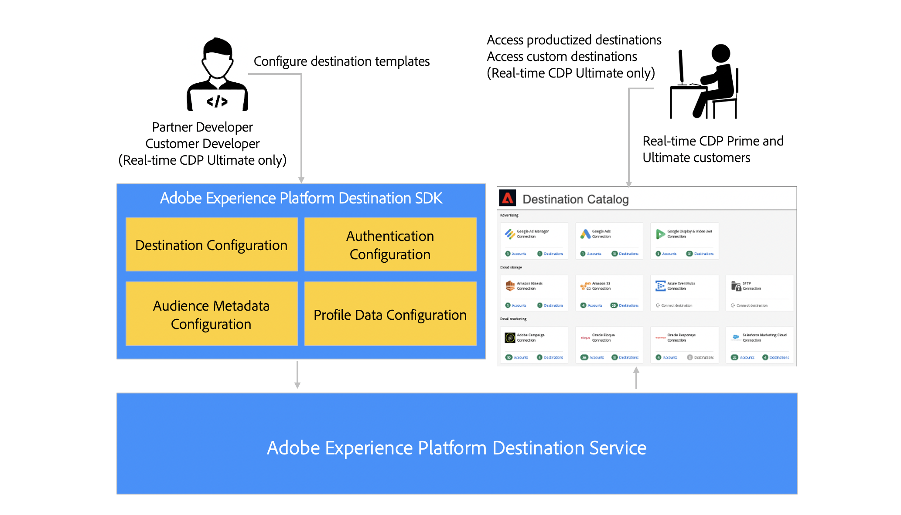

# Adobe Experience Platform Destination SDK

Adobe Experience Platform Destination SDK es un conjunto de API de configuración que le permiten configurar patrones de integración de destino para que Experience Platform envíe datos de audiencia y perfil a su punto final o ubicación de almacenamiento, en función de los datos y los formatos de autenticación de su elección. Las configuraciones se almacenan en el Experience Platform y se pueden recuperar mediante API para actualizaciones adicionales.

En la documentación del Destination SDK se proporcionan instrucciones para utilizar el Adobe Experience Platform Destination SDK con el fin de configurar, probar y publicar una integración de destino producida con Adobe Experience Platform, y para que su destino forme parte del creciente catálogo de destinos. Con Destination SDK, también puede crear su propio destino privado personalizado para exportar datos adaptados a sus necesidades.

## Inicio rápido: explorar información esencial {#quick-start}

Consulte la documentación de los vínculos siguientes para configurar y enviar rápidamente el destino mediante Destination SDK.

>[!BEGINSHADEBOX]

<table style="border: 0;">
  <tbody>
    <tr>
        <td>
            
<b>Páginas de configuración</b>

            <ul>
                <li><a href="/help/destinations/destination-sdk/functionality/configuration-options.md">Se explican todas las opciones de configuración</a></li>
                <li> Configuración del servidor de destino: <a href="/help/destinations/destination-sdk/functionality/destination-server/server-specs.md">especificaciones del servidor</a> y <a href="/help/destinations/destination-sdk/functionality/destination-server/templating-specs.md">especificaciones de plantilla</a></li>
                <li><a href="/help/destinations/destination-sdk/functionality/destination-configuration/customer-data-fields.md">Campos de datos del cliente y otros componentes de configuración de destino</a></li>
                <li><a href="https://experienceleague.adobe.com/en/docs/experience-platform/destinations/destination-sdk/functionality/destination-server/message-format">Plantillas y macros</a></li>
            </ul>
        </td>
        <td>
            
<b>Guías</b>

            <ul>
                <li><a href="/help/destinations/destination-sdk/overview.md#process">Proceso de integración de alto nivel</a></li>
                <li><a href="/help/destinations/destination-sdk/guides/configure-destination-instructions.md">Configuración de un destino de flujo continuo</a></li>
                <li><a href="/help/destinations/destination-sdk/guides/configure-file-based-destination-instructions.md">Configuración de un destino basado en archivos</a></li>
                <li><a href="/help/destinations/destination-sdk/guides/batch/configure-prospect-audience-destination.md">Configurar un destino para exportar perfiles de clientes potenciales</a></li>
                <li><a href="/help/destinations/destination-sdk/guides/submit-destination.md">Enviar destino para publicación</a></li>
            </ul>
        </td>
                <td>
            
<b>Referencias de API</b>

            <ul>
                <li><a href="https://developer.adobe.com/experience-platform-apis/references/destination-authoring/#tag/Destination-servers-and-templates">Referencia de API de extremo de servidor de destino</a></li>
                <li><a href="https://developer.adobe.com/experience-platform-apis/references/destination-authoring/#tag/Destination-configurations">Referencia de API de extremo de destino</a></li>
                <li><a href="https://developer.adobe.com/experience-platform-apis/references/destination-authoring/#tag/Audience-metadata-templates">Referencia de API de metadatos de Audiencia</a></li>
                <li><a href="https://developer.adobe.com/experience-platform-apis/references/destination-authoring/#tag/Destination-testing">Referencia de API de prueba</a></li>
                <li><a href="https://developer.adobe.com/experience-platform-apis/references/destination-authoring/#tag/Destination-publishing">Referencia de API de publicación de destino</a></li>
            </ul>
        </td>
    </tr>
  </tbody>
</table>

<table style="border: 0;">
  <tbody>
    <tr>
        <td>
            
<b>Configuración de un destino de flujo continuo: hoja de trucos</b>

            <ul>
                <li><a href="/help/destinations/destination-sdk/guides/configure-destination-instructions.md">Configuración de una guía completa de destino de streaming</a></li>
                <li><a href="/help/destinations/destination-sdk/functionality/destination-server/message-format.md">Comprenda la transformación de datos a través de las plantillas Pebble</a> y <a href="/help/destinations/destination-sdk/functionality/destination-server/supported-functions.md">vea las funciones de creación de plantillas compatibles</a></li>
                <li><a href="/help/destinations/destination-sdk/functionality/destination-configuration/aggregation-policy.md">Comprender las políticas de agregación de datos</a></li>
                <li><a href="https://experienceleague.adobe.com/en/docs/experience-platform/destinations/destination-sdk/functionality/destination-server/message-format">Ejemplo de configuración activa</a></li>
                <li><a href="/help/destinations/destination-sdk/testing-api/streaming-destinations/streaming-destination-testing-overview.md">Prueba del destino de flujo continuo</a></li>
            </ul>
        </td>
        <td>
            
<b>Configuración de un destino basado en archivos: hoja de trucos</b>

            <ul>
                <li><a href="/help/destinations/destination-sdk/guides/configure-file-based-destination-instructions.md">Configurar una guía de extremo a extremo de destino basada en archivos</a></li>
                <li><a href="/help/destinations/destination-sdk/guides/batch/configure-file-formatting-options.md">Configurar formatos de archivo para los archivos exportados</a></li>
                <li><a href="/help/destinations/destination-sdk/guides/batch/configure-amazon-s3-destination-with-predefined-file-formatting.md">Ejemplo de configuración activa para un destino de Amazon S3</a></li>
                <li><a href="/help/destinations/destination-sdk/functionality/destination-configuration/batch-configuration.md">Configuración por lotes</a> para la programación de exportación de archivos y nombres de archivos</li>
                <li><a href="/help/destinations/destination-sdk/testing-api/batch-destinations/file-based-destination-testing-overview.md">Prueba del destino basado en archivos</a></li>
            </ul>
        </td>
        <td>
            
<b>Otra información esencial</b>

            <ul>
                <li><a href="/help/destinations/destination-sdk/getting-started.md#obtain-authentication-credentials">Obtenga las credenciales de autenticación necesarias para utilizar la API</a></li>
                <li><a href="/help/destinations/destination-sdk/integration-prerequisites.md">Requisitos previos de integración</a></li>
                <li><a href="/help/destinations/destination-sdk/glossary.md">Glosario de términos del Destination SDK</a></li>                
                <li><a href="/help/destinations/destination-sdk/functionality/rate-limiting-retry-policy.md">Límites de velocidad y política de reintentos</a></li>
                <li><a href="/help/destinations/destination-sdk/docs-framework/self-service-template.md">Plantilla de autoservicio para documentar el destino</a></li>
            </ul>
        </td>
    </tr>
  </tbody>
</table>

>[!ENDSHADEBOX]

## Integraciones personalizadas y producidas {#productized-custom-integrations}

>[!IMPORTANT]
>
> Esta funcionalidad para crear destinos personalizados privados solo está disponible para los clientes de [Adobe Real-time Customer Data Platform Ultimate](https://helpx.adobe.com/legal/product-descriptions/real-time-customer-data-platform.html?lang=es).

Como socio Destination SDK, puede beneficiarse de agregar su destino de productos al [catálogo de Experience Platform](../catalog/overview.md):

1. Estandarice las configuraciones de integración entre clientes con parámetros preconfigurados y simplifique la experiencia de configuración para los clientes.
2. Introduzca una tarjeta de destino con marca en el catálogo de destinos de Experience Platform para facilitar la configuración y la concienciación del cliente.
3. Incluirse como una integración de destino de producción con Adobe Experience Platform y Adobe Real-time Customer Data Platform.

Como cliente Experience Platform, también puede crear su propio destino personalizado privado, que mejor se adapte a sus necesidades de activación.

## Tipos de integración admitidos {#supported-integration-types}

### Integraciones en tiempo real (streaming) {#real-time-integrations}

A través de Destination SDK, Adobe Experience Platform admite integraciones en tiempo real (también denominadas &quot;streaming&quot;) con destinos que tienen un extremo de API de REST. La integración en tiempo real con Experience Platform admite funciones como:

* Transformación y agregación de mensajes
* Relleno de perfil
* Integración de metadatos configurable para inicializar la configuración de audiencia y la transferencia de datos
* Autenticación configurable
* Un conjunto de API de prueba y validación para probar e iterar las configuraciones de destino

### Integraciones basadas en archivos {#file-based-integrations}

Mediante Destination SDK, también puede configurar integraciones para exportar archivos periódicamente a la ubicación de almacenamiento que elija. La integración basada en archivos con Experience Platform admite funciones como:

* Exportación de archivos en varios formatos compatibles (CSV, Parquet, JSON)
* Opciones de formato de archivo configurables, que permiten estructurar el formato de los archivos exportados para satisfacer los requisitos de flujo descendente.

Lea los requisitos técnicos del lado de los destinos en el artículo [requisitos previos de integración](integration-prerequisites.md) y lea todas las configuraciones admitidas en el artículo [opciones de configuración](functionality/configuration-options.md)

## Obtener acceso al Destination SDK {#get-access}

El acceso de Destination SDK varía en función de su estado como socio o Experience Platform, cliente de Real-Time CDP. Consulte la tabla siguiente para obtener más información.

| Tipo de socio o cliente | Cómo acceder al Destination SDK |
---------|----------|
| Proveedor de software independiente (ISV) | Únase al [Programa de socios de tecnología de Adobe](https://partners.adobe.com/technologyprogram/experiencecloud.html) y solicite que se aprovisione una zona protegida de Experience Platform para acceder al Destination SDK. |
| Integrador de sistemas (SI) | Debe tener nivel Gold o Platinum en el [Programa de socios de soluciones de Adobe](https://solutionpartners.adobe.com/home.html) para disponer de una zona protegida para Experience Platform y tener acceso a Destination SDK. |
| cliente Experience Platform en [Real-Time CDP Ultimate package](https://helpx.adobe.com/legal/product-descriptions/real-time-customer-data-platform.html?lang=es) | De forma predeterminada, se obtiene acceso a los entornos limitados y a Destination SDK de Experience Platform, lo que le permite crear destinos privados para su organización. |

{style="table-layout:auto"}

## Proceso de alto nivel {#process}

El proceso para configurar el destino en Experience Platform se describe a continuación:

1. Si es ISV o SI, consulte la información de [obtención de acceso](#get-access) en la sección anterior. [Los clientes del paquete Real-Time CDP Ultimate](https://helpx.adobe.com/legal/product-descriptions/real-time-customer-data-platform.html?lang=es) pueden omitir este paso.
2. [Solicite aprovisionar una zona protegida de Experience Platform](https://adobeexchangeec.zendesk.com/hc/en-us/articles/360037457812-Adobe-Experience-Platform-Sandbox-Accounts-Access-Adding-Users-and-Support) y habilitar el permiso de creación de destinos.
3. Cree su integración. Siga las instrucciones de la documentación del producto para configurar [destinos de streaming](guides/configure-destination-instructions.md) o [destinos basados en archivos](guides/configure-file-based-destination-instructions.md).
4. Pruebe la integración. Siga las instrucciones de la documentación del producto para probar [destinos de streaming](testing-api/streaming-destinations/streaming-destination-testing-overview.md) o [destinos basados en archivos](testing-api/batch-destinations/file-based-destination-testing-overview.md).
5. Si usted es un ISV o un ISP que está creando una [integración de productos](./overview.md#productized-custom-integrations), [envíe su integración](guides/submit-destination.md) para que el Adobe la revise (el tiempo de respuesta estándar es de cinco días hábiles).
6. Si usted es un ISV o un ISP que está creando una integración de productos, use el [proceso de documentación de autoservicio](docs-framework/documentation-instructions.md) para crear una página de documentación del producto en el Experience League para su destino.
7. Para las integraciones de productos, una vez aprobadas por el Adobe, la integración se mostrará en el [catálogo de Experience Platform](../catalog/overview.md).
8. Si desea actualizar la integración, siga el mismo proceso.

## Referencia {#reference}

El Adobe recomienda leer y comprender la siguiente documentación de Experience Platform:

* [información general sobre destinos de Adobe Experience Platform](https://experienceleague.adobe.com/docs/experience-platform/destinations/home.html?lang=es)
* [Base de composición de esquema XDM](https://experienceleague.adobe.com/docs/experience-platform/xdm/schema/composition.html?lang=es)
* [Descripción general del área de nombres de identidad](https://experienceleague.adobe.com/docs/experience-platform/identity/namespaces.html?lang=es)
