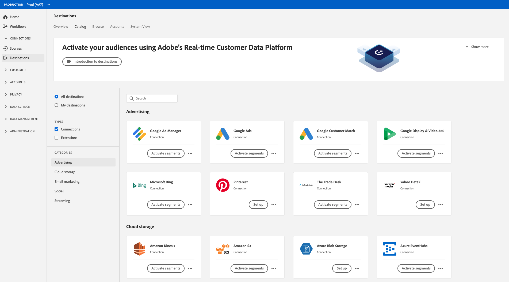

# SDK de destino de Adobe Experience Platform

## Información general {#destinations-sdk}

El SDK de destino de Adobe Experience Platform es un conjunto de API de configuración que le permiten configurar patrones de integración de destino para que el Experience Platform entregue datos de audiencia y perfil a su extremo, en función de los formatos de autenticación y datos que elija. Las configuraciones se almacenan en Experience Platform y se pueden recuperar mediante API para obtener actualizaciones adicionales.

La documentación del SDK de destino le proporciona instrucciones para utilizar el SDK de destino de Adobe Experience Platform para configurar, probar y publicar una integración de destino de productos con Adobe Experience Platform, y para que su destino forme parte del catálogo de destinos en constante crecimiento.

## Integraciones personalizadas y producidas {#productized-custom-integrations}

Como socio de SDK de destino, puede beneficiarse de añadir su destino de producto al [catálogo de Experience Platform](/help/destinations/catalog/overview.md):
1. Estandarizar las configuraciones de integración entre clientes con parámetros preconfigurados y simplificar la experiencia de configuración para los clientes.
2. Introduzca una tarjeta de destino con marca en el catálogo de destinos de Experience Platform para simplificar la configuración y el conocimiento del cliente.
3. Se presenta como una integración de destino productiva con Adobe Experience Platform y la plataforma de datos del cliente en tiempo real.

Como cliente Experience Platform, puede crear un destino personalizado privado propio que se adapte mejor a sus necesidades de activación.

<!--

## Types of destinations in Adobe Experience Platform {#types-of-destinations}

In Adobe Experience Platform, we distinguish between two destination types - *connections* and *extensions*. In the user interface, customers can choose between two types of connection destinations, Profile Export destinations and Segment Export destinations. For more details around the difference between the different destination types, read [Destination Types and Categories](https://experienceleague.adobe.com/docs/experience-platform/destinations/destination-types.html?lang=en).

This documentation set provides you with all the necessary information to add your destination to Adobe Experience Platform, as a *connection*, either Profile Export or Segment Export. To set up an extension, visit the [Experience Platform Launch developer portal](https://developer.adobelaunch.com/extensions/).

-->

## Tipos de integraciones compatibles {#supported-integration-types}

A través del SDK de destino, Adobe Experience Platform admite integraciones en tiempo real con destinos que tienen un extremo de API de REST. La integración en tiempo real con Experience Platform admite funciones como:
* Transformación y agregación de mensajes
* Relleno de perfiles
* Integración de metadatos configurables para inicializar la configuración de audiencias y la transferencia de datos
* Autenticación configurable
* Un conjunto de API de prueba y validación para que pueda probar e iterar las configuraciones de destino

Lea sobre los requisitos técnicos del lado de los destinos en el artículo [requisitos previos de integración](./integration-prerequisites.md).

## Obtener acceso al SDK de destino {#get-access}

El acceso al SDK de destino varía en función de su estado como cliente socio o Experience Platform. Para obtener más información, consulte la siguiente tabla.

| Tipo de socio o cliente | Acceso al SDK de destino |
---------|----------|
| Proveedor de software independiente (ISV) | Únase al [programa de intercambio de Adobe](https://partners.adobe.com/exchangeprogram/experiencecloud.html) y solicite obtener un simulador para pruebas de Experience Platform aprovisionado para acceder al SDK de destino. |
| Integrador de sistemas (SI) | Debe encontrarse en el nivel Gold o Platinum en el [Programa de socios de soluciones de Adobe](https://solutionpartners.adobe.com/home.html), y obtendrá un simulador de pruebas para Experience Platform y acceso al SDK de destino. |
| Cliente Experience Platform en el [paquete de activación](https://helpx.adobe.com/legal/product-descriptions/adobe-experience-platform0.html) | De forma predeterminada, se obtiene acceso a los entornos limitados de Experience Platform y al SDK de destino. |
| Cliente Experience Platform en el [paquete CDP en tiempo real](https://helpx.adobe.com/legal/product-descriptions/real-time-customer-data-platform.html) | No tiene acceso al SDK de destino, pero tiene acceso a todos los destinos de producción configurados por otras empresas que utilizan el SDK de destino y publicados en distintas organizaciones de Experience Platform. |

{style=&quot;table-layout:auto&quot;}

## Proceso de alto nivel {#process}

A continuación se describe el proceso para configurar el destino en Experience Platform:

1. Si es un ISV o SI, consulte la información de acceso de la sección anterior. [Adobe Experience Platform ](https://helpx.adobe.com/legal/product-descriptions/adobe-experience-platform0.html) Activationlos clientes pueden omitir este paso.
2. [Solicite la provisión de un ](https://adobeexchangeec.zendesk.com/hc/en-us/articles/360037457812-Adobe-Experience-Platform-Sandbox-Accounts-Access-Adding-Users-and-Support) entorno limitado de Experience Platform y habilite el permiso de creación de destino.
3. [Cree su ](./configure-destination-instructions.md) integración siguiendo la documentación del producto.
4. [Pruebe la ](./test-destination.md) integración siguiendo la documentación del producto.
5. [Envíe la ](./destination-publish-api.md) integración para que el Adobe lo revise (el tiempo de respuesta estándar es de 5 días hábiles).
6. Si es un ISV o SI que crea una [integración de productos](./overview.md#productized-custom-integrations), utilice el [proceso de documentación de autoservicio](./docs-framework/documentation-instructions.md) para crear una página de documentación del producto en el Experience League para su destino.
7. Una vez aprobada por Adobe, la integración se mostrará en el [catálogo de Experience Platform](/help/destinations/catalog/overview.md).
8. Si desea actualizar la integración, siga el mismo proceso.

## Referencia {#reference}

Adobe recomienda leer y comprender la siguiente documentación del Experience Platform:

* [Información general sobre los destinos de Adobe Experience Platform](https://experienceleague.adobe.com/docs/experience-platform/destinations/home.html?lang=en)
* [Base de la composición del esquema XDM](https://experienceleague.adobe.com/docs/experience-platform/xdm/schema/composition.html?lang=en)
* [Información general del área de nombres de identidad](https://experienceleague.adobe.com/docs/experience-platform/identity/namespaces.html?lang=en)
