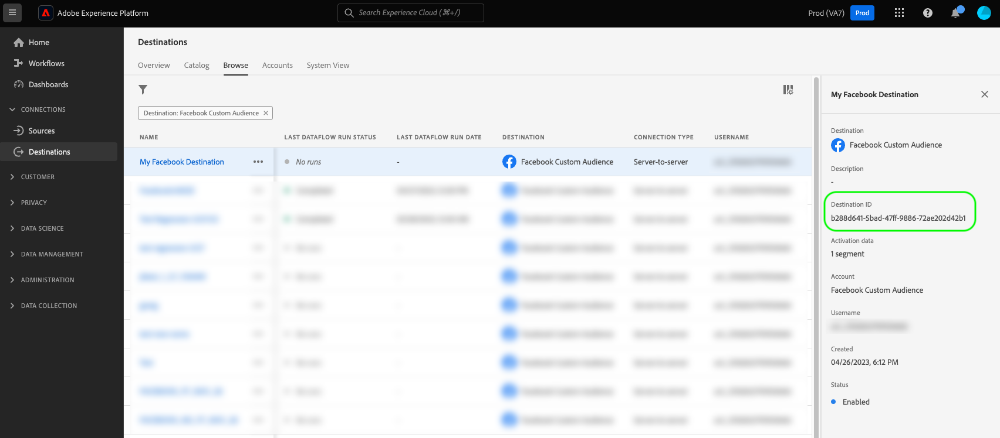

# Probar el destino de flujo continuo con perfiles de muestra {#template-api-operations}

>[!IMPORTANT]
>
>**Punto de conexión de API**: `https://platform.adobe.io/data/core/activation/authoring/testing/destinationInstance/`

En esta página se enumeran y describen todas las operaciones de API que puede realizar mediante la `/authoring/testing/destinationInstance/` punto final de la API, para comprobar si el destino está configurado correctamente y verificar la integridad de los flujos de datos en el destino configurado. Para obtener una descripción de la funcionalidad admitida por este extremo, lea [Probar la configuración de destino](streaming-destination-testing-overview.md).

Se realizan solicitudes al extremo de prueba con o sin añadir perfiles a la llamada. Si no envía ningún perfil en la solicitud, Adobe los generará internamente y los agregará a la solicitud.

Puede usar la variable [API de generación de perfiles de muestra](sample-profile-generation-api.md) para crear perfiles para utilizarlos en solicitudes a la API de prueba de destino.

## Obtención del ID de instancia de destino {#get-destination-instance-id}

>[!IMPORTANT]
>
>* Para utilizar esta API, debe tener una conexión existente con el destino en la interfaz de usuario del Experience Platform. Lectura [conectar con destino](https://experienceleague.adobe.com/docs/experience-platform/destinations/ui/connect-destination.html?lang=en) y [activar perfiles y segmentos en un destino](https://experienceleague.adobe.com/docs/experience-platform/destinations/ui/activate/activate-segment-streaming-destinations.html?lang=en) para obtener más información.
> * Después de establecer la conexión con su destino, obtenga el ID de instancia de destino que debería usar en las llamadas de API a este extremo cuando [navegación por una conexión con su destino](https://experienceleague.adobe.com/docs/experience-platform/destinations/ui/destination-details-page.html?lang=en).
   >


## Introducción a las operaciones de API de prueba de destino {#get-started}

Antes de continuar, revise la [guía de introducción](../../getting-started.md) para obtener información importante que debe conocer para realizar llamadas correctamente a la API de , incluido cómo obtener el permiso de creación de destino requerido y los encabezados necesarios.

## Pruebe la configuración de destino sin añadir perfiles a la llamada {#test-without-adding-profiles}

Puede probar la configuración de destino realizando una solicitud de POST al `authoring/testing/destinationInstance/{DESTINATION_INSTANCE_ID}` y proporcionando el ID de instancia de destino del destino que está probando.

**Formato de API**


```http
POST authoring/testing/destinationInstance/{DESTINATION_INSTANCE_ID}
```

| Parámetro de consulta | Descripción |
| -------- | ----------- |
| `{DESTINATION_INSTANCE_ID}` | El ID de instancia de destino del destino que está probando. |

**Solicitud**

La siguiente solicitud llama al extremo de la API de REST de su destino. La solicitud la configura el `{DESTINATION_INSTANCE_ID}` parámetro de consulta.

```shell
curl --location --request POST 'https://platform.adobe.io/data/core/activation/authoring/testing/destinationInstance/49966037-32cd-4457-a105-2cbf9c01826a' \
--header 'Content-Type: application/json' \
--header 'Accept: application/json' \
--header 'x-api-key: {API_KEY}' \
--header 'Authorization: Bearer {ACCESS_TOKEN}' \
--header 'x-gw-ims-org-id: {ORG_ID}' \
--header 'x-sandbox-name: {SANDBOX_NAME}' \
```

**Respuesta**

Una respuesta correcta devuelve el estado HTTP 200 junto con la respuesta de API del extremo de la API REST de su destino.

```json
{
   "results":[
      {
         "aggregationKey":{
            "destinationInstanceId":"string",
            "segmentId":"string",
            "segmentStatus":"realized",
            "identityNamespaces":[
               [
                  "email",
                  "phone"
               ]
            ]
         },
         "httpCalls":[
            {
               "traceId":"a06fec2d-a886-4219-8975-4e4b7ed26539",
               "request":{
                  "body":"{ \"attributes\": [  { \"external_id\": \"external_id-h29Fq\"  , \"AdobeExperiencePlatformSegments\": { \"add\": [  \"Nirvana fans\" ,  \"RHCP fans\"   ], \"remove\": [  ] }  ,  \"key\":  \"string\"    }  ] }",
                  "headers":[
                     {
                        "Content-Type":"application/json"
                     }
                  ],
                  "method":"POST",
                  "uri":"https://api.moviestar.com/users/track"
               },
               "response":{
                  "body":"{\"status\": \"success\"}",
                  "code":"200",
                  "headers":[
                     {
                        "Connection":"keep-alive"
                     },
                     {
                        "Content-Type":"application/json"
                     },
                     {
                        "Server":"nginx"
                     },
                     {
                        "Vary":"Origin,Accept-Encoding"
                     },
                     {
                        "transfer-encoding":"chunked"
                     }
                  ]
               }
            }
         ]
      }
   ],
   "inputProfiles":[
      {
         "segmentMembership":{
            "ups":{
               "03fb9938-8537-4b4c-87f9-9c4d413a0ee5":{
                  "lastQualificationTime":"2021-06-17T12:25:12.872039Z",
                  "status":"realized"
               },
               "27e05542-d6a3-46c7-9c8e-d59d50229530":{
                  "lastQualificationTime":"2021-06-17T12:25:12.872042Z",
                  "status":"realized"
               }
            }
         },
         "personalEmail":{
            "address":"john.smith@abc.com"
         },
         "identityMap":{
            "ECID":[
               {
                  "id":"ECID-vlnt6"
               }
            ]
         },
         "person":{
            "name":{
               "firstName":"string"
            }
         }
      }
   ]
}
```

| Propiedad | Descripción |
| -------- | ----------- |
| `aggregationKey` | Incluye información sobre la directiva de agregación configurada para el destino. Para obtener más información, lea la [Política de agregación](../../functionality/destination-configuration/aggregation-policy.md) documentación. |
| `traceId` | Identificador único de la operación. Cuando encuentre errores, puede compartir este ID con el equipo de Adobe para solucionar problemas. |
| `results.httpCalls.request` | Incluye la solicitud que se envió por Adobe al destino. |
| `results.httpCalls.response` | Incluye la respuesta recibida por Adobe desde el destino. |
| `inputProfiles` | Incluye los perfiles que se exportaron en la llamada al destino. Los perfiles coinciden con el esquema de origen. |

{style="table-layout:auto"}

## Pruebe la configuración de destino con perfiles añadidos a la llamada {#test-with-added-profiles}

Puede probar la configuración de destino realizando una solicitud de POST al `authoring/testing/destinationInstance/{DESTINATION_INSTANCE_ID}` y proporcionando el ID de instancia de destino del destino que está probando.

**Formato de API**

```http
POST authoring/testing/destinationInstance/{DESTINATION_INSTANCE_ID}
```

| Parámetro de consulta | Descripción |
| -------- | ----------- |
| `{DESTINATION_INSTANCE_ID}` | El ID de instancia de destino del destino que está probando. |

**Solicitud**

La siguiente solicitud llama al extremo de la API de REST de su destino. La solicitud se configura con los parámetros proporcionados en la carga útil y en la variable `{DESTINATION_INSTANCE_ID}` parámetro de consulta.

```shell
curl --location --request POST 'https://platform.adobe.io/data/core/activation/authoring/testing/destinationInstance/49966037-32cd-4457-a105-2cbf9c01826a' \
--header 'Content-Type: application/json' \
--header 'Accept: application/json' \
--header 'x-api-key: {API_KEY}' \
--header 'Authorization: Bearer {ACCESS_TOKEN}' \
--header 'x-gw-ims-org-id: {ORG_ID}' \
--header 'x-sandbox-name: {SANDBOX_NAME}' \
--data-raw '{
   "profiles":[
      {
         "segmentMembership":{
            "ups":{
               "374a9a6c-c719-4cdb-a660-155a2838e6d6":{
                  "lastQualificationTime":"2021-05-13T12:16:27.248585Z",
                  "status":"realized"
               },
               "896f8776-9498-47b4-b994-51cb3f61c2c5":{
                  "lastQualificationTime":"2021-05-13T12:16:27.248605Z",
                  "status":"realized"
               }
            }
         },
         "identityMap":{
            "ECID":[
               {
                  "id":"ECID-Z3i2t"
               }
            ],
            "external_id":[
               {
                  "id":"external_id-h29Fq"
               }
            ]
         },
         "attributes":{
            "firstName":{
               "value":"John"
            }
         }
      }
   ]
}'
```

**Respuesta**

Una respuesta correcta devuelve el estado HTTP 200 junto con la respuesta de API del extremo de la API REST de su destino.

```json
{
   "results":[
      {
         "aggregationKey":{
            "destinationInstanceId":"string",
            "segmentId":"string",
            "segmentStatus":"realized",
            "identityNamespaces":[
               [
                  "email",
                  "phone"
               ]
            ]
         },
         "httpCalls":[
            {
               "traceId":"a06fec2d-a886-4219-8975-4e4b7ed26539",
               "request":{
                  "body":"{ \"attributes\": [  { \"external_id\": \"external_id-h29Fq\"  , \"AdobeExperiencePlatformSegments\": { \"add\": [  \"Nirvana fans\" ,  \"RHCP fans\"   ], \"remove\": [  ] }  ,  \"key\":  \"string\"    }  ] }",
                  "headers":[
                     {
                        "Content-Type":"application/json"
                     }
                  ],
                  "method":"POST",
                  "uri":"https://api.moviestar.com/users/track"
               },
               "response":{
                  "body":"{\"status\": \"success\"}",
                  "code":"200",
                  "headers":[
                     {
                        "Connection":"keep-alive"
                     },
                     {
                        "Content-Type":"application/json"
                     },
                     {
                        "Server":"nginx"
                     },
                     {
                        "Vary":"Origin,Accept-Encoding"
                     },
                     {
                        "transfer-encoding":"chunked"
                     }
                  ]
               }
            }
         ]
      }
   ],
   "inputProfiles":[
      {
         "segmentMembership":{
            "ups":{
               "374a9a6c-c719-4cdb-a660-155a2838e6d6":{
                  "lastQualificationTime":"2021-05-13T12:16:27.248585Z",
                  "status":"realized"
               },
               "896f8776-9498-47b4-b994-51cb3f61c2c5":{
                  "lastQualificationTime":"2021-05-13T12:16:27.248605Z",
                  "status":"realized"
               }
            }
         },
         "identityMap":{
            "ECID":[
               {
                  "id":"ECID-Z3i2t"
               }
            ],
            "external_id":[
               {
                  "id":"external_id-h29Fq"
               }
            ]
         },
         "attributes":{
            "firstName":{
               "value":"John"
            }
         }
      }
   ]
}
```

## Gestión de errores de API {#api-error-handling}

Los extremos de la API del Destination SDK siguen los principios generales del mensaje de error de la API del Experience Platform. Consulte [Códigos de estado de API](../../../../landing/troubleshooting.md#api-status-codes) y [errores en el encabezado de la solicitud](../../../../landing/troubleshooting.md#request-header-errors) en la guía de solución de problemas de Platform.

## Pasos siguientes

Después de leer este documento, ahora sabe cómo probar el destino. Ahora puede utilizar el Adobe [proceso de documentación de autoservicio](../../docs-framework/documentation-instructions.md) para crear una página de documentación para el destino.
