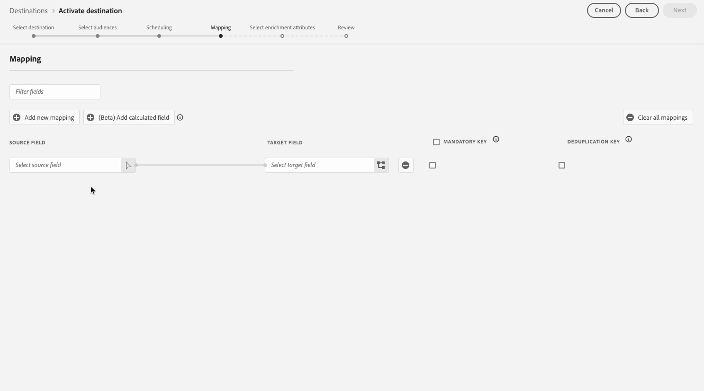
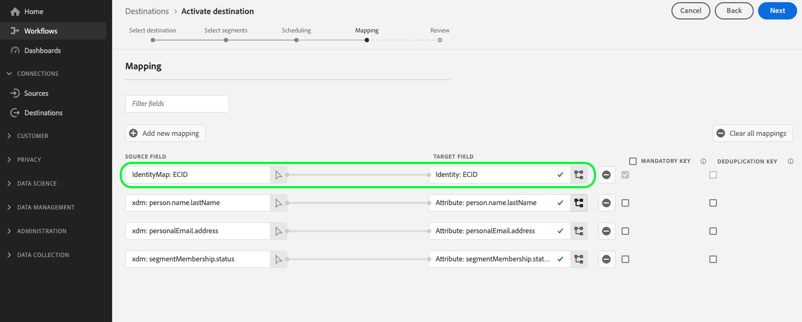

# Activar audiencias para destinos de exportación de perfiles por lotes

>[!IMPORTANT]
> 
> * Para activar audiencias y habilitar el [paso de asignación](#mapping) del flujo de trabajo, necesita los **[!UICONTROL permisos de control de acceso[Ver destinos]**, **[!UICONTROL Activar destinos]**, **[!UICONTROL Ver perfiles]** y **[!UICONTROL Ver segmentos]**](/help/access-control/home.md#permissions).
> * Para activar audiencias sin pasar por el [paso de asignación](#mapping) del flujo de trabajo, necesita **[!UICONTROL Ver destinos]**, **[!UICONTROL Activar segmento sin asignación]**, **[!UICONTROL Ver perfiles]** y **[!UICONTROL Ver segmentos]** [permisos de control de acceso](/help/access-control/home.md#permissions).
>* Para exportar *identidades*, necesita el **[!UICONTROL permiso de control de acceso](/help/access-control/home.md#permissions) de]** Ver gráfico de identidad[. <br> {width="100" zoomable="yes"}
> 
> Lea la [descripción general del control de acceso](/help/access-control/ui/overview.md) o póngase en contacto con el administrador del producto para obtener los permisos necesarios.

## Información general {#overview}

En este artículo se explica el flujo de trabajo necesario para activar audiencias en Adobe Experience Platform en destinos basados en archivos de perfil por lotes, como el almacenamiento en la nube y los destinos de marketing por correo electrónico.

## Requisitos previos {#prerequisites}

Para activar audiencias en destinos, debes haber [conectado correctamente a un destino](./connect-destination.md). Si aún no lo ha hecho, vaya al [catálogo de destinos](../catalog/overview.md), examine los destinos admitidos y configure el destino que desee utilizar.

## Formatos de archivo admitidos para la exportación {#supported-file-formats-export}

Se admiten los siguientes formatos de archivo al exportar audiencias:

* CSV
* JSON
* Parquet

Tenga en cuenta que la exportación de archivos CSV ofrece una mayor flexibilidad en cuanto a la estructura que desea aplicar a los archivos exportados. Obtenga más información acerca de la configuración de formato de archivo [para archivos CSV](/help/destinations/ui/batch-destinations-file-formatting-options.md#file-configuration).

Seleccione el formato de archivo que desee exportar al [crear una conexión con el destino basado en archivos](/help/destinations/ui/connect-destination.md).

## Seleccione su destino {#select-destination}

1. Vaya a **[!UICONTROL Conexiones > Destinos]** y seleccione la pestaña **[!UICONTROL Catálogo]**.

   

1. Seleccione **[!UICONTROL Activar audiencias]** en la tarjeta correspondiente al destino donde desea activar las audiencias, como se muestra en la imagen siguiente.

   

1. Seleccione la conexión de destino que desee usar para activar las audiencias y, a continuación, seleccione **[!UICONTROL Siguiente]**.

   

1. Pasa a la siguiente sección para [seleccionar tus audiencias](#select-audiences).

## Selección de audiencias {#select-audiences}

Para seleccionar las audiencias que desea activar en el destino, utilice las casillas de verificación que aparecen a la izquierda de los nombres de audiencia y luego seleccione **[!UICONTROL Siguiente]**.

Puede seleccionar entre varios tipos de audiencias, según su origen:

* **[!UICONTROL Servicio de segmentación]**: Audiencias generadas en Experience Platform por el servicio de segmentación. Consulte la [documentación de segmentación](../../segmentation/ui/overview.md) para obtener más información.
* **[!UICONTROL Carga personalizada]**: audiencias generadas fuera de Experience Platform y cargadas en Experience Platform como archivos CSV. Para obtener más información sobre audiencias externas, consulte la documentación sobre [importación de una audiencia](../../segmentation/ui/audience-portal.md#import-audience). Al seleccionar audiencias que se originan en **[!UICONTROL cargas personalizadas]**, se habilita automáticamente el paso [Seleccionar atributos de enriquecimiento](#select-enrichment-attributes).
* Otros tipos de audiencias, originadas en otras soluciones de Adobe, como [!DNL Audience Manager].

>[!IMPORTANT]
>
>Al activar audiencias de carga personalizadas en destinos basados en archivos por lotes, hay un límite de 10 de estas audiencias que puede activar en un flujo de datos.


>[!TIP]
>
>Para quitar audiencias de flujos de activación existentes, use la página **[!UICONTROL Datos de activación]**. Lea la sección sobre cómo [quitar varias audiencias de los flujos de activación](../ui/destination-details-page.md#bulk-remove) para obtener más información.

## Programar exportación de público {#scheduling}

>[!CONTEXTUALHELP]
>id="platform_destinations_activate_schedule"
>title="Programación"
>abstract="Utilice el icono de lápiz para establecer el tipo de exportación de archivos (archivos completos o archivos incrementales) y la frecuencia de exportación."

>[!CONTEXTUALHELP]
>id="platform_destinations_activate_schedule_weekly_messaging"
>title="Exportaciones semanales"
>abstract="Seleccione la fecha de inicio y las exportaciones posteriores se producirán ese día de la semana hasta la fecha de finalización seleccionada."

>[!CONTEXTUALHELP]
>id="platform_destinations_activate_schedule_monthly_messaging"
>title="Exportaciones mensuales"
>abstract="Seleccione la fecha de inicio y las exportaciones posteriores se producirán en esa fecha del mes hasta la fecha de finalización seleccionada. En el caso de los meses con menos de 30 o 31 días, la exportación se produce el último día del mes."

[!DNL Adobe Experience Platform] exporta datos para destinos de marketing por correo electrónico y almacenamiento en la nube como [diferentes tipos de archivos](#supported-file-formats-export). En la página **[!UICONTROL Programación]**, puede configurar la programación y los nombres de archivo para cada audiencia que esté exportando.

Experience Platform establece automáticamente una programación predeterminada para cada exportación de archivo. Puede modificar la programación predeterminada según sus necesidades seleccionando el icono de lápiz situado junto a cada programación y definiendo una programación personalizada.


Para editar varias programaciones al mismo tiempo, selecciona las audiencias mediante las casillas de verificación de la izquierda de la pantalla y, a continuación, selecciona **[!UICONTROL Editar programación]**. La programación que configure se aplicará a todos los archivos exportados para las audiencias seleccionadas.


>[!TIP]
>
>Puede editar las programaciones de activación de audiencia para los flujos de activación existentes desde la página **[!UICONTROL Datos de activación]**. Consulte la documentación sobre [programación de activación de edición masiva](../ui/destination-details-page.md#bulk-edit-schedule) para obtener más información.

>[!IMPORTANT]
>
>[!DNL Adobe Experience Platform] divide automáticamente los archivos de exportación en 5 millones de registros (filas) por archivo. Cada fila representa un perfil.
>
>Los nombres de los archivos divididos se anexan con un número que indica que el archivo forma parte de una exportación mayor, como por ejemplo: `filename.csv`, `filename_2.csv`, `filename_3.csv`.

### Exportación de archivos completos {#export-full-files}

>[!CONTEXTUALHELP]
>id="platform_destinations_activate_exportoptions"
>title="Opciones de exportación de archivos"
>abstract="Seleccione **Exportar archivos completos** para exportar una instantánea completa de todos los perfiles que cumplen los requisitos para el público. Seleccione **Exportar archivos incrementales** para exportar solo los perfiles que cumplen los requisitos para el público desde la última exportación. <br> La primera exportación incremental de archivos incluye todos los perfiles que cumplen los requisitos para el público, actuando como relleno. Los futuros archivos incrementales incluyen solo los perfiles que cumplen los requisitos para el público desde la primera exportación de archivos incrementales."
>additional-url="https://experienceleague.adobe.com/docs/experience-platform/destinations/ui/activate/activate-batch-profile-destinations.html?lang=es#export-incremental-files" text="Exportación de archivos incrementales"

>[!CONTEXTUALHELP]
>id="platform_destinations_activationchaining_aftersegmentevaluation"
>title="Activar después de la evaluación de público"
>abstract="La activación se ejecuta inmediatamente después de que se complete el trabajo de segmentación diaria. Esto garantiza que se exporten los perfiles más actualizados."

>[!CONTEXTUALHELP]
>id="platform_destinations_activationchaining_scheduled"
>title="Activación programada"
>abstract="La activación se ejecuta a una hora fija del día."

Seleccione **[!UICONTROL Exportar archivos completos]** para almacenar en déclencheur la exportación de un archivo que contenga una instantánea completa de todas las calificaciones de perfil para la audiencia seleccionada.


1. Utilice el selector **[!UICONTROL Frecuencia]** para seleccionar la frecuencia de exportación:

   * **[!UICONTROL Una vez]**: programe una exportación de archivos completa bajo demanda única.
   * **[!UICONTROL Diario]**: programe exportaciones de archivos completas una vez al día, todos los días y a la hora que especifique.

2. Use el conmutador **[!UICONTROL Tiempo]** para seleccionar si la exportación debe realizarse inmediatamente después de la evaluación de la audiencia o de forma programada a una hora especificada. Al seleccionar la opción **[!UICONTROL Programado]**, puede utilizar el selector para elegir la hora del día, en formato [!DNL UTC], en la que debe realizarse la exportación.

   Utilice la opción **[!UICONTROL Después de la evaluación del segmento]** para que el trabajo de activación se ejecute inmediatamente después de que se complete el trabajo diario de segmentación por lotes de Experience Platform. Esta opción garantiza que, cuando se ejecute el trabajo de activación, los perfiles más actualizados se exporten al destino. Esto puede hacer que la audiencia se exporte varias veces al día según las acciones que realice.

   >[!IMPORTANT]
   >
   >Si ejecuta una [evaluación de público flexible](../../segmentation/ui/audience-portal.md#flexible-audience-evaluation) en públicos que ya están configuradas para activarse después de la evaluación de segmentos, los públicos se activarán en cuanto finalice el trabajo de evaluación de público flexible, independientemente de cualquier trabajo de activación diario anterior. Esto puede hacer que las audiencias se exporten varias veces al día, según las acciones que realice.

   <!-- Batch segmentation currently runs at {{insert time of day}} and lasts for an average {{x hours}}. Adobe reserves the right to modify this schedule. -->

   
Use la opción **[!UICONTROL Programado]** para que el trabajo de activación se ejecute a una hora fija. Esta opción garantiza que los datos de perfil de Experience Platform se exporten a la misma hora cada día. Sin embargo, es posible que los perfiles que exporte no estén los más actualizados, en función de si el trabajo de segmentación por lotes se ha completado antes de que se inicie el trabajo de activación.

   

   >[!IMPORTANT]
   >
   >Al asignar una audiencia que se creó en las últimas 24 horas y evaluó mediante [segmentación por lotes](../../segmentation/methods/batch-segmentation.md), establezca la programación diaria de exportación para que comience el día siguiente como muy pronto. Esto garantiza que el trabajo de evaluación por lotes diario se ejecute primero y que se exporten los datos de audiencia completos.

3. Utilice el selector **[!UICONTROL Fecha]** para elegir el día o el intervalo en el que debe realizarse la exportación. Para las exportaciones diarias, la práctica recomendada es establecer las fechas de inicio y finalización para que se alineen con la duración de las campañas en las plataformas de flujo descendente.

   >[!IMPORTANT]
   >
   > Al seleccionar un intervalo de exportación, el último día del intervalo no se incluye en las exportaciones. Por ejemplo, si selecciona un intervalo del 4 al 11 de enero, la última exportación de archivos se realizará el 10 de enero.

4. Seleccione **[!UICONTROL Crear]** para guardar la programación.

### Exportación de archivos incrementales

>[!CONTEXTUALHELP]
>id="platform_destinations_activate_something"
>title="Configurar nombre de archivo"
>abstract="Para los destinos basados en archivos, se genera un nombre de archivo único por público. Utilice el editor de nombres de archivo para crear y editar un nombre de archivo único o mantener el nombre predeterminado."

Seleccione **[!UICONTROL Exportar archivos incrementales]** para almacenar en déclencheur una exportación en la que el primer archivo sea una instantánea completa de todas las clasificaciones de perfil para la audiencia seleccionada y los archivos siguientes sean clasificaciones de perfil incrementales desde la exportación anterior.

>[!IMPORTANT]
>
>El primer archivo incremental exportado incluye todos los perfiles aptos para una audiencia que funciona como relleno.


1. Utilice el selector **[!UICONTROL Frecuencia]** para seleccionar la frecuencia de exportación:

   * **[!UICONTROL Diario]**: programe las exportaciones de archivos incrementales una vez al día, todos los días y a la hora especificada.
   * **[!UICONTROL Por hora]**: programe exportaciones de archivos incrementales cada 3, 6, 8 o 12 horas.

2. Utilice el selector **[!UICONTROL Time]** para elegir la hora del día, en formato [!DNL UTC], en que debe realizarse la exportación.

3. Utilice el selector **[!UICONTROL Fecha]** para elegir el intervalo en el que debe realizarse la exportación. La práctica recomendada es establecer las fechas de inicio y finalización para que se alineen con la duración de las campañas en las plataformas de flujo descendente.

   >[!IMPORTANT]
   >
   >El último día del intervalo no se incluye en las exportaciones. Por ejemplo, si selecciona un intervalo del 4 al 11 de enero, la última exportación de archivos se realizará el 10 de enero.

4. Seleccione **[!UICONTROL Crear]** para guardar la programación.

### Configuración de nombres de archivo {#configure-file-names}

>[!CONTEXTUALHELP]
>id="platform_destinations_activate_filename"
>title="Configurar nombre de archivo"
>abstract="Para los destinos basados en archivos, se genera un nombre de archivo único por público. Utilice el editor de nombres de archivo para crear y editar un nombre de archivo único o mantener el nombre predeterminado."

Para la mayoría de los destinos, los nombres de archivo predeterminados constan del nombre de destino, el ID de audiencia y un indicador de fecha y hora. Por ejemplo, puede editar los nombres de archivo exportados para distinguir entre diferentes campañas o para que el tiempo de exportación de datos se anexe a los archivos. Tenga en cuenta que algunos desarrolladores de destinos pueden elegir que se muestren opciones de adición de nombres de archivo predeterminadas diferentes para sus destinos.

Para abrir una ventana modal y editar los nombres de archivo, seleccione el icono de lápiz. Los nombres de archivo están limitados a 255 caracteres.

>[!NOTE]
>
>La siguiente imagen muestra cómo se pueden editar los nombres de archivo para los destinos de [!DNL Amazon S3], pero el proceso es idéntico para todos los destinos por lotes (por ejemplo, SFTP, [!DNL Azure Blob Storage] o [!DNL Google Cloud Storage]).


En el editor de nombres de archivo, puede seleccionar diferentes componentes para agregarlos al nombre del archivo.


El nombre de destino y el ID de audiencia no se pueden eliminar de los nombres de archivo. Además de estas opciones, puede agregar las siguientes opciones:

| Opción de nombre de archivo | Descripción |
|---------|----------|
| **[!UICONTROL Nombre de audiencia]** | Nombre de la audiencia exportada. |
| **[!UICONTROL Fecha y hora]** | Seleccione entre agregar un formato `MMDDYYYY_HHMMSS` o una marca de tiempo UNIX de 10 dígitos de la hora en que se generan los archivos. Elija una de estas opciones si desea que los archivos tengan un nombre de archivo dinámico generado con cada exportación incremental. |
| **[!UICONTROL Texto personalizado]** | Cualquier texto personalizado que desee agregar a los nombres de archivo. |
| **[!UICONTROL ID de destino]** | El ID del flujo de datos de destino que se utiliza para exportar la audiencia. |
| **[!UICONTROL Nombre de destino]** | Nombre del flujo de datos de destino que se utiliza para exportar la audiencia. |
| **[!UICONTROL Nombre de organización]** | Nombre de su organización en Experience Platform. |
| **[!UICONTROL Nombre de zona protegida]** | El ID de la zona protegida que utiliza para exportar la audiencia. |

{style="table-layout:auto"}

Para editar varios nombres de archivo al mismo tiempo, seleccione las audiencias mediante las casillas de verificación de la izquierda de la pantalla y, a continuación, seleccione **[!UICONTROL Editar nombre de archivo]**. Las opciones de nombre de archivo que configure se aplicarán a todos los archivos exportados para las audiencias seleccionadas.


Seleccione **[!UICONTROL Aplicar cambios]** para confirmar su selección.

>[!IMPORTANT]
> 
>Si no selecciona el componente **[!UICONTROL Fecha y hora]**, los nombres de archivo serán estáticos y el nuevo archivo exportado sobrescribirá el archivo anterior en su ubicación de almacenamiento con cada exportación. Cuando se ejecuta un trabajo de importación recurrente desde una ubicación de almacenamiento a una plataforma de marketing por correo electrónico, esta es la opción recomendada.

Una vez que haya terminado de configurar todas sus audiencias, seleccione **[!UICONTROL Siguiente]** para continuar.

## Asignación {#mapping}

En este paso, debe seleccionar los atributos de perfil que desea añadir a los archivos exportados al destino de destino. Para seleccionar atributos e identidades de perfil para la exportación:

1. En la página **[!UICONTROL Asignación]**, seleccione **[!UICONTROL Agregar nueva asignación]**.

   

1. Seleccione la flecha a la derecha de la entrada **[!UICONTROL Source field]**.

   

1. En la página **[!UICONTROL Seleccionar campo de origen]**, seleccione los atributos e identidades de perfil que desee incluir en los archivos exportados al destino y, a continuación, elija **[!UICONTROL Seleccionar]**.

   >[!TIP]
   > 
   >Puede utilizar el campo de búsqueda para reducir la selección, como se muestra en la siguiente imagen.

   Use la opción **[!UICONTROL Mostrar solo campos con datos]** para mostrar solo los campos de esquema rellenados con valores. De forma predeterminada, solo se muestran los campos de esquema rellenados.

   


1. El campo seleccionado para la exportación ahora aparece en la vista de asignación. Si lo desea, puede editar el nombre del encabezado en el archivo exportado. Para ello, seleccione el icono en el campo de destinatario.

   

1. En la página **[!UICONTROL Seleccionar campo de destino]**, escriba el nombre deseado del encabezado en el archivo exportado y, a continuación, elija **[!UICONTROL Seleccionar]**.

   

1. El campo seleccionado para la exportación aparece ahora en la vista de asignación y muestra el encabezado editado en el archivo exportado.

   

1. (Opcional) El orden de los campos asignados en la interfaz de usuario se refleja en el orden de las columnas del archivo CSV exportado, de arriba a abajo, siendo la fila superior la columna situada más a la izquierda en el archivo CSV. Puede reordenar los campos asignados del modo que desee, arrastrando y soltando las filas de asignación, como se muestra a continuación.

   >[!NOTE]
   >
   >Esta función está en versión beta y solo está disponible para clientes seleccionados. Para solicitar acceso a esta función, póngase en contacto con el representante del Adobe.

   

1. (Opcional) Puede seleccionar que su campo exportado sea una [clave obligatoria](#mandatory-keys) o una [clave de anulación de duplicación](#deduplication-keys).

   

1. Para agregar más campos para exportar, repita los pasos anteriores.

### Atributos obligatorios {#mandatory-attributes}

>[!CONTEXTUALHELP]
>id="platform_destinations_activate_mandatorykey"
>title="Acerca de los atributos obligatorios"
>abstract="Seleccione los atributos de esquema XDM que deben incluir todos los perfiles exportados. Los perfiles sin la clave obligatoria no se exportan al destino. Al no seleccionar una clave obligatoria, se exportan todos los perfiles cualificados independientemente de sus atributos."

Un atributo obligatorio es una casilla de verificación activada por el usuario que garantiza que todos los registros de perfil contengan el atributo seleccionado. Por ejemplo: todos los perfiles exportados contienen una dirección de correo electrónico&#x200B;

Puede marcar los atributos como obligatorios para asegurarse de que [!DNL Experience Platform] exporta únicamente los perfiles que incluyen el atributo específico. Como resultado, se puede utilizar como una forma adicional de filtrado. Marcar un atributo como obligatorio es **no** obligatorio.

Al no seleccionar un atributo obligatorio, se exportan todos los perfiles cualificados independientemente de sus atributos.

Se recomienda que uno de los atributos sea un [identificador único](../../destinations/catalog/email-marketing/overview.md#identity) de su esquema. Para obtener más información sobre los atributos obligatorios, consulte la sección de identidad en la documentación de [destinos de marketing por correo electrónico](../../destinations/catalog/email-marketing/overview.md#identity).

### Claves de anulación de duplicación {#deduplication-keys}

>[!CONTEXTUALHELP]
>id="platform_destinations_activate_deduplicationkey"
>title="Acerca de las claves de deduplicación"
>abstract="Elimine varios registros del mismo perfil en los archivos de exportación seleccionando una clave de deduplicación. Seleccione una sola área de nombres o hasta dos atributos de esquema XDM como clave de deduplicación. Si no se selecciona una clave de deduplicación, es posible que se dupliquen entradas de perfil en los archivos de exportación."

Una clave de anulación de duplicación es una clave principal definida por el usuario que determina la identidad por la que los usuarios desean que se dedupliquen sus perfiles&#x200B;

Las claves de deduplicación eliminan la posibilidad de tener varios registros del mismo perfil en un archivo de exportación.

Hay tres formas de usar claves de anulación de duplicación en [!DNL Experience Platform]:

* Usando un área de nombres de identidad única como [!UICONTROL clave de anulación de duplicación]
* Usando un único atributo de perfil de un perfil [!DNL XDM] como [!UICONTROL clave de anulación de duplicación]
* Usando una combinación de dos atributos de perfil de un perfil [!DNL XDM] como clave compuesta

>[!IMPORTANT]
>
> Puede exportar un área de nombres de identidad única a un destino y el área de nombres se establece automáticamente como clave de anulación de duplicación. No se permite enviar varias áreas de nombres a un destino.
> 
> No se puede utilizar una combinación de áreas de nombres de identidad y atributos de perfil como claves de anulación de duplicación.

### Ejemplo de deduplicación {#deduplication-example}

Este ejemplo ilustra el funcionamiento de la deduplicación en función de las claves de deduplicación seleccionadas.

Consideremos los dos perfiles siguientes.

**Perfil A**

```json
{
  "identityMap": {
    "Email": [
      {
        "id": "johndoe_1@example.com"
      },
      {
        "id": "doejohn_1@example.com"
      }
    ]
  },
  "segmentMembership": {
    "ups": {
      "fa5c4622-6847-4199-8dd4-8b7c7c7ed1d6": {
        "status": "realized",
        "lastQualificationTime": "2021-03-10 10:03:08"
      }
    }
  },
  "person": {
    "name": {
      "lastName": "Doe",
      "firstName": "John"
    }
  },
  "personalEmail": {
    "address": "johndoe@example.com"
  }
}
```

**Perfil B**

```json
{
  "identityMap": {
    "Email": [
      {
        "id": "johndoe_2@example.com"
      },
      {
        "id": "doejohn_2@example.com"
      }
    ]
  },
  "segmentMembership": {
    "ups": {
      "fa5c4622-6847-4199-8dd4-8b7c7c7ed1d6": {
        "status": "realized",
        "lastQualificationTime": "2021-04-10 11:33:28"
      }
    }
  },
  "person": {
    "name": {
      "lastName": "D",
      "firstName": "John"
    }
  },
  "personalEmail": {
    "address": "johndoe@example.com"
  }
}
```

### Caso de uso 1 de deduplicación: sin deduplicación {#deduplication-use-case-1}

Sin anulación de duplicación, el archivo de exportación contendría las siguientes entradas.

| personalEmail | firstName | lastName |
|---|---|---|
| johndoe@example.com | John | Doe |
| johndoe@example.com | John | D |


### Caso de uso de deduplicación 2: deduplicación basada en el área de nombres de identidad {#deduplication-use-case-2}

Suponiendo la anulación de duplicación por el espacio de nombres [!DNL Email], el archivo de exportación contendría las siguientes entradas. El perfil B es el más reciente que se clasifica para la audiencia, por lo que es el único que se exporta.

| Correo electrónico* | personalEmail | firstName | lastName |
|---|---|---|---|
| johndoe_2@example.com | johndoe@example.com | John | D |
| doejohn_2@example.com | johndoe@example.com | John | D |

### Caso de uso de deduplicación 3: deduplicación basada en un único atributo de perfil {#deduplication-use-case-3}

Suponiendo la anulación de duplicación por el atributo `personal Email`, el archivo de exportación contendría la siguiente entrada. El perfil B es el más reciente que se clasifica para la audiencia, por lo que es el único que se exporta.

| personalEmail* | firstName | lastName |
|---|---|---|
| johndoe@example.com | John | D |


### Caso de uso 4 de deduplicación: deduplicación basada en dos atributos de perfil {#deduplication-use-case-4}

Suponiendo la anulación de duplicación por la clave compuesta `personalEmail + lastName`, el archivo de exportación contendría las siguientes entradas.

| personalEmail* | lastName* | firstName |
|---|---|---|
| johndoe@example.com | D | John |
| johndoe@example.com | Doe | John |

Adobe recomienda seleccionar un área de nombres de identidad como [!DNL CRM ID] o una dirección de correo electrónico como clave de anulación de duplicación para garantizar que todos los registros de perfil se identifiquen de forma exclusiva.

### Comportamiento de deduplicación para perfiles con la misma marca de tiempo {#deduplication-same-timestamp}

Al exportar perfiles a destinos basados en archivos, la deduplicación garantiza que solo se exporte un perfil cuando varios perfiles comparten la misma clave de deduplicación y la misma marca de tiempo de referencia. Esta marca de tiempo representa el momento en el que se actualizó por última vez el gráfico de identidad o la pertenencia a audiencias de un perfil. Para obtener más información sobre cómo se actualizan y exportan los perfiles, consulte el documento [comportamiento de exportación de perfiles](https://experienceleague.adobe.com/en/docs/experience-platform/destinations/how-destinations-work/profile-export-behavior#what-determines-a-data-export-and-what-is-included-in-the-export-2).

#### Consideraciones clave

* **Selección determinística**: cuando varios perfiles tienen claves de anulación de duplicación idénticas y la misma marca de tiempo de referencia, la lógica de anulación de duplicación determina qué perfil se va a exportar ordenando los valores de otras columnas seleccionadas (excluyendo tipos complejos como matrices, mapas u objetos). Los valores ordenados se evalúan en orden lexicográfico y se selecciona el primer perfil.

* **Ejemplo de escenario**

Considere los siguientes datos, donde la clave de anulación de duplicación es la columna `Email`:

| Correo electrónico* | first_name | last_name | timestamp |
|---|---|---|---|  
| `test1@test.com` | John | Morris | 2024-10-12T09:50 |
| `test1@test.com` | John | Doe | 2024-10-12T09:50 |
| `test2@test.com` | Frank | Smith | 2024-10-12T09:50 |

{style="table-layout:auto"}

Después de la deduplicación, el archivo de exportación contiene:

| Correo electrónico* | first_name | last_name | timestamp |
|---|---|---|---|  
| `test1@test.com` | John | Doe | 2024-10-12T09:50 |
| `test2@test.com` | Frank | Smith | 2024-10-12T09:50 |

{style="table-layout:auto"}

**Explicación**: Para `test1@test.com`, ambos perfiles comparten la misma clave de anulación de duplicación y la misma marca de tiempo. El algoritmo ordena lexicográficamente los valores de las columnas `first_name` y `last_name`. Dado que los nombres son idénticos, la hora se resuelve usando la columna `last_name`, donde &quot;Doe&quot; va antes que &quot;Morris&quot;.

**Confiabilidad mejorada**: Este proceso de deduplicación actualizado garantiza que las ejecuciones sucesivas con las mismas coordenadas siempre produzcan los mismos resultados, lo que mejora la coherencia.

### Realizar transformaciones de datos mediante campos calculados {#calculated-fields}

Puede usar el control [Campos calculados](/help/destinations/ui/data-transformations-calculated-fields.md) para realizar varias transformaciones de datos en los datos exportados a destinos basados en archivos.

### Limitaciones conocidas {#known-limitations}

La nueva página **[!UICONTROL Mapping]** tiene las siguientes limitaciones conocidas:

#### El atributo de pertenencia a audiencia no se puede seleccionar mediante el flujo de trabajo de asignación

Debido a una limitación conocida, actualmente no puede usar la ventana **[!UICONTROL Seleccionar campo]** para agregar `segmentMembership.seg_namespace.seg_id.status` a sus exportaciones de archivos. En su lugar, debe pegar manualmente el valor `xdm: segmentMembership.seg_namespace.seg_id.status` en el campo de esquema, como se muestra a continuación.




>[!NOTE]
>
>Para los destinos de almacenamiento en la nube, se añaden los siguientes atributos a la asignación de forma predeterminada:
>
>* `segmentMembership.seg_namespace.seg_id.status`
>* `segmentMembership.seg_namespace.seg_id.lastQualificationTime`

Las exportaciones de archivos variarán de las siguientes maneras, dependiendo de si `segmentMembership.seg_namespace.seg_id.status` está seleccionado o no:

* Si se selecciona el campo `segmentMembership.seg_namespace.seg_id.status`, los archivos exportados incluyen **[!UICONTROL miembros activos]** en la instantánea completa inicial y **[!UICONTROL miembros activos]** y **[!UICONTROL caducados]** recientemente en las exportaciones incrementales posteriores.
* Si no se selecciona el campo `segmentMembership.seg_namespace.seg_id.status`, los archivos exportados incluyen solo **[!UICONTROL miembros activos]** en la instantánea completa inicial y en las exportaciones incrementales posteriores.

Obtenga más información sobre [comportamiento de exportación de perfiles para destinos basados en archivos](/help/destinations/how-destinations-work/profile-export-behavior.md#file-based-destinations).

#### Actualmente no se pueden seleccionar áreas de nombres de identidad para las exportaciones

Actualmente no se admite la selección de áreas de nombres de identidad para exportar, como se muestra en la imagen siguiente. Si se seleccionan áreas de nombres de identidad para exportar, se producirá un error en el paso **[!UICONTROL Revisar]**.



Como solución temporal si necesita agregar áreas de nombres de identidad a los archivos exportados durante la versión beta, puede:
* Utilice los destinos de almacenamiento en la nube heredados para los flujos de datos donde desee incluir áreas de nombres de identidad en las exportaciones
* Cargue identidades como atributos en Experience Platform para luego exportarlas a sus destinos de almacenamiento en la nube.

## Seleccionar atributos de perfil {#select-attributes}

>[!IMPORTANT]
> 
>Todos los destinos de almacenamiento en la nube del catálogo pueden ver un [[!UICONTROL Asignación] paso](#mapping) mejorado que reemplaza el paso **[!UICONTROL Seleccionar atributos]** descrito en esta sección.
>
>Este paso de **[!UICONTROL Seleccionar atributos]** todavía se muestra para los destinos de marketing por correo electrónico de Adobe Campaign, Oracle Responsys, Oracle Eloqua y Salesforce Marketing Cloud.

Para los destinos basados en perfiles, debe seleccionar los atributos de perfil que desea enviar al destino de destino.

1. En la página **[!UICONTROL Seleccionar atributos]**, seleccione **[!UICONTROL Agregar nuevo campo]**.

   

2. Seleccione la flecha a la derecha de la entrada **[!UICONTROL Campo de esquema]**.

   

3. En la página **[!UICONTROL Seleccionar campo]**, seleccione los atributos XDM o áreas de nombres de identidad que desee enviar al destino y, a continuación, elija **[!UICONTROL Seleccionar]**.

   

4. Para agregar más asignaciones, repita los pasos del uno al tres.

>[!NOTE]
>
> Adobe Experience Platform rellena previamente su selección con cuatro atributos recomendados y utilizados con frecuencia en su esquema: `person.name.firstName`, `person.name.lastName`, `personalEmail.address`, `segmentMembership.seg_namespace.seg_id.status`.


>[!IMPORTANT]
>
>Debido a una limitación conocida, actualmente no puede usar la ventana **[!UICONTROL Seleccionar campo]** para agregar `segmentMembership.seg_namespace.seg_id.status` a sus exportaciones de archivos. En su lugar, debe pegar manualmente el valor `xdm: segmentMembership.seg_namespace.seg_id.status` en el campo de esquema, como se muestra a continuación.
>
>

Las exportaciones de archivos varían de las siguientes maneras, dependiendo de si `segmentMembership.seg_namespace.seg_id.status` está seleccionado o no:
* Si se selecciona el campo `segmentMembership.seg_namespace.seg_id.status`, los archivos exportados incluyen **[!UICONTROL miembros activos]** en la instantánea completa inicial y **[!UICONTROL miembros activos]** y **[!UICONTROL caducados]** en las exportaciones incrementales posteriores.
* Si no se selecciona el campo `segmentMembership.seg_namespace.seg_id.status`, los archivos exportados incluyen solo **[!UICONTROL miembros activos]** en la instantánea completa inicial y en las exportaciones incrementales posteriores.

## Seleccionar atributos de enriquecimiento {#select-enrichment-attributes}

>[!CONTEXTUALHELP]
>id="platform_destinations_activate_exclude_enrichment_attributes"
>title="Excluir atributos de enriquecimiento"
>abstract="Active esta opción para exportar los perfiles de los públicos que se han cargado, personalizado y seleccionado a su destino, excluyendo al mismo tiempo todos sus atributos."

>[!IMPORTANT]
>
>Este paso solo se muestra si ha seleccionado **[!UICONTROL Audiencias de carga personalizada]** durante el paso [Selección de audiencias](#select-audiences).

Los atributos de enriquecimiento corresponden a audiencias cargadas personalizadas introducidas en Experience Platform como **[!UICONTROL cargas personalizadas]**. En este paso, puede seleccionar qué atributos desea exportar a su destino para cada audiencia externa seleccionada.


Siga los pasos a continuación para seleccionar atributos de enriquecimiento para cada audiencia externa:

1. En la columna **[!UICONTROL Atributos de enriquecimiento]**, seleccione el botón  (Editar).
1. Seleccione **[!UICONTROL Agregar atributo de enriquecimiento]**. Se muestra un nuevo campo de esquema vacío.
   
1. Seleccione el botón a la derecha del campo vacío para abrir la pantalla de selección de campos.
1. Seleccione los atributos que desee exportar para la audiencia.
   
1. Después de agregar todos los atributos que desea exportar, seleccione **[!UICONTROL Guardar y cerrar]**.
1. Repita estos pasos para cada audiencia externa.

Si desea activar audiencias externas en sus destinos sin exportar ningún atributo, habilite la opción **[!UICONTROL Excluir atributos de enriquecimiento]**. Esta opción exporta los perfiles de las audiencias externas, pero ninguno de sus atributos correspondientes se envía al destino.


Seleccione **[!UICONTROL Siguiente]** para pasar al paso [Revisar](#review).

## Revisar {#review}

>[!NOTE]
> 
>Si se han aplicado etiquetas de uso de datos a ciertos campos dentro de un conjunto de datos (en lugar de a todo el conjunto de datos), la aplicación de esas etiquetas de nivel de campo en la activación se produce en las siguientes condiciones:
>
>* Los campos se utilizan en la definición de audiencia.
>* Los campos se configuran como atributos proyectados para el destino final.
>
> Por ejemplo, si el campo `person.name.firstName` tiene ciertas etiquetas de uso de datos que entran en conflicto con la acción de marketing del destino, se le mostrará una infracción de directiva de uso de datos en el paso de revisión. Para obtener más información, consulte [Administración de datos en Adobe Experience Platform](../../rtcdp/privacy/data-governance-overview.md#destinations).

En la página **[!UICONTROL Revisar]**, puedes ver un resumen de tu selección. Seleccione **[!UICONTROL Cancelar]** para dividir el flujo, **[!UICONTROL Atrás]** para modificar la configuración o **[!UICONTROL Finalizar]** para confirmar su selección y comenzar a enviar datos al destino.


### Evaluación de directiva de consentimiento {#consent-policy-evaluation}

>[!CONTEXTUALHELP]
>id="platform_governance_policies_viewApplicableConsentPolicies"
>title="Ver directivas de consentimiento aplicables"
>abstract="Si su organización ha adquirido **Adobe Healthcare Shield** o **Adobe Privacy &amp; Security Shield**, seleccione **[!UICONTROL Ver directivas de consentimiento aplicables]** para ver qué directivas de consentimiento se aplican y cuántos perfiles se incluyen en la activación como resultado de ellas. Este control está deshabilitado si su empresa no tiene acceso a los SKU mencionados anteriormente."

Si su organización ha adquirido **Adobe Healthcare Shield** o **Adobe Privacy &amp; Security Shield**, seleccione **[!UICONTROL Ver directivas de consentimiento aplicables]** para ver qué directivas de consentimiento se aplican y cuántos perfiles se incluyen en la activación como resultado de ellas. Lea acerca de [evaluación de directivas de consentimiento](/help/data-governance/enforcement/auto-enforcement.md#consent-policy-evaluation) para obtener más información.

### Comprobaciones de políticas de uso de datos {#data-usage-policy-checks}

En el paso **[!UICONTROL Revisar]**, Experience Platform también comprueba si hay alguna infracción de la directiva de uso de datos. A continuación se muestra un ejemplo de infracción de una directiva. No puede completar el flujo de trabajo de activación de audiencia hasta que haya resuelto la infracción. Para obtener información sobre cómo resolver infracciones de directivas, lea acerca de [infracciones de directivas de uso de datos](/help/data-governance/enforcement/auto-enforcement.md#data-usage-violation) en la sección de documentación de control de datos.


### Filtrado de audiencias {#filter-audiences}

Además, en este paso puede utilizar los filtros disponibles en la página para mostrar solo las audiencias cuya programación o asignación se haya actualizado como parte de este flujo de trabajo. También puede alternar qué columnas de tabla desea ver.


Si está satisfecho con su selección y no se han detectado infracciones de directivas, seleccione **[!UICONTROL Finalizar]** para confirmar su selección y comenzar a enviar datos al destino.

## Verificar activación de audiencia {#verify}

Al exportar audiencias a destinos de almacenamiento en la nube, Adobe Experience Platform crea un archivo de `.csv`, `.json` o `.parquet` en la ubicación de almacenamiento proporcionada. Es de esperar que se cree un nuevo archivo en su ubicación de almacenamiento según la programación establecida en el flujo de trabajo. El formato de archivo predeterminado se muestra a continuación, pero puede [editar los componentes del nombre de archivo](#file-names):
`<destinationName>_segment<segmentID>_<timestamp-yyyymmddhhmmss>.csv`

Por ejemplo, si seleccionara una frecuencia de exportación diaria, los archivos que recibiría en tres días consecutivos podrían tener este aspecto:

```console
Salesforce_Marketing_Cloud_segment12341e18-abcd-49c2-836d-123c88e76c39_20200408061804.csv
Salesforce_Marketing_Cloud_segment12341e18-abcd-49c2-836d-123c88e76c39_20200409052200.csv
Salesforce_Marketing_Cloud_segment12341e18-abcd-49c2-836d-123c88e76c39_20200410061130.csv
```

La presencia de estos archivos en su ubicación de almacenamiento es la confirmación de la activación correcta. Para comprender cómo están estructurados los archivos exportados, puede [descargar un archivo .csv de ejemplo](../assets/common/sample_export_file_segment12341e18-abcd-49c2-836d-123c88e76c39_20200408061804.csv). Este archivo de muestra incluye los atributos de perfil `person.firstname`, `person.lastname`, `person.gender`, `person.birthyear` y `personalEmail.address`.
