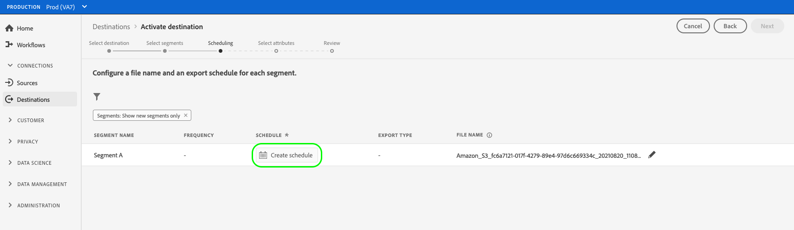
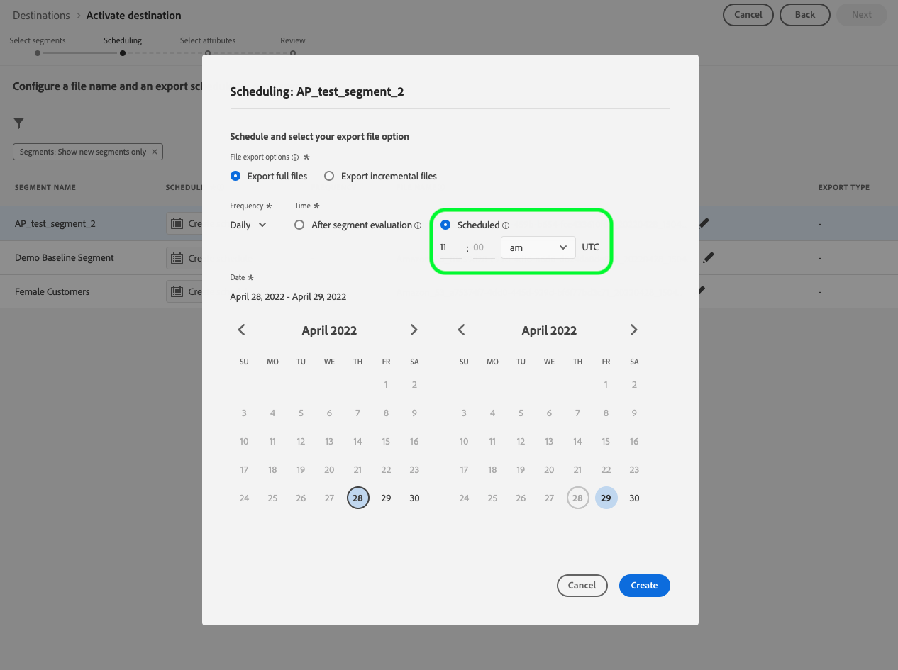
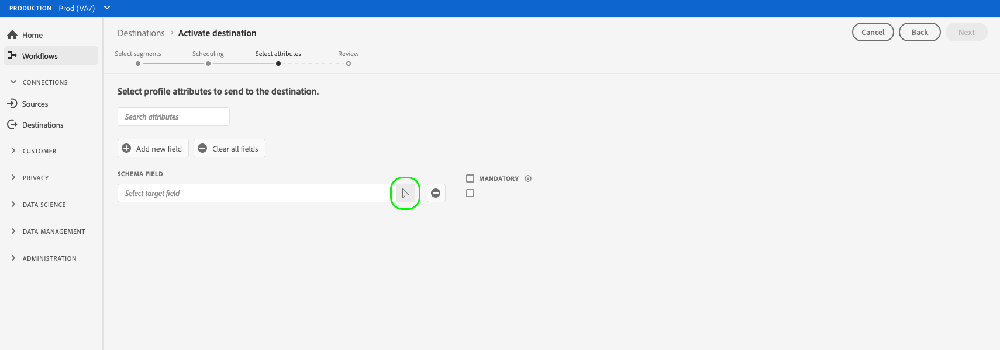
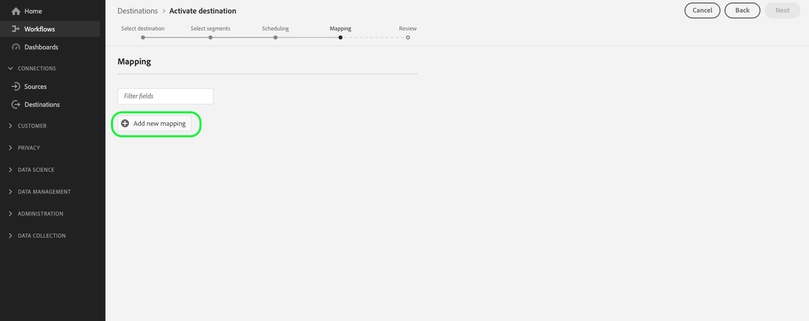
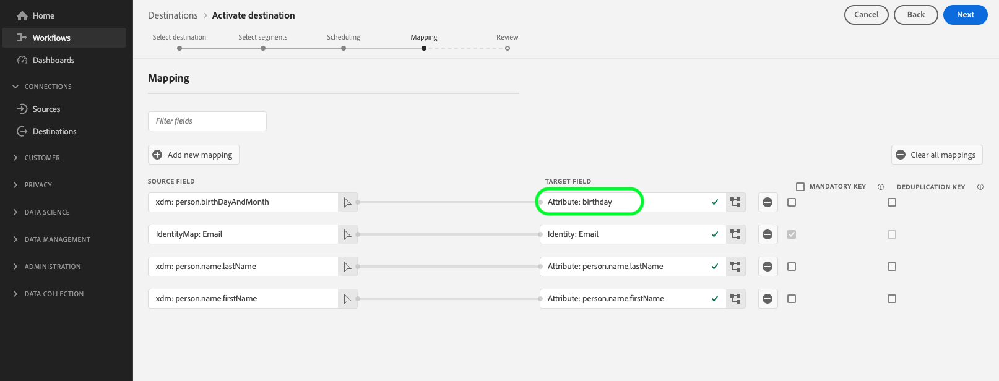

# Activar datos de audiencia en destinos de exportación de perfiles en lote

>[!IMPORTANT]
> 
> * Para activar los datos y habilitar la variable [paso de asignación](#mapping) del flujo de trabajo, necesita la variable **[!UICONTROL Administrar destinos]**, **[!UICONTROL Activar destinos]**, **[!UICONTROL Ver perfiles]** y **[!UICONTROL Ver segmentos]** [permisos de control de acceso](/help/access-control/home.md#permissions).
> * Para activar los datos sin tener que pasar por el [paso de asignación](#mapping) del flujo de trabajo, necesita la variable **[!UICONTROL Administrar destinos]**, **[!UICONTROL Activar segmento sin asignación]**, **[!UICONTROL Ver perfiles]** y **[!UICONTROL Ver segmentos]** [permisos de control de acceso](/help/access-control/home.md#permissions).
> 
> Lea el [información general sobre el control de acceso](/help/access-control/ui/overview.md) o póngase en contacto con el administrador del producto para obtener los permisos necesarios.
>
> Algunos clientes que participan en el programa beta de funcionalidad mejorada de exportación de archivos están viendo la nueva **[!UICONTROL Asignación]** como parte de su flujo de trabajo de activación para [nuevos destinos de almacenamiento en la nube beta](/help/release-notes/2022/october-2022.md#destinations). Tenga en cuenta también que [limitaciones conocidas](#known-limitations) como parte de la versión.

## Información general {#overview}

En este artículo se explica el flujo de trabajo necesario para activar los datos de audiencia en destinos basados en perfiles por lotes de Adobe Experience Platform, como almacenamiento en la nube y destinos de marketing por correo electrónico.

## Requisitos previos {#prerequisites}

Para activar datos en destinos, debe haber [conectado a un destino](./connect-destination.md). Si aún no lo ha hecho, vaya a la [catálogo de destinos](../catalog/overview.md), busque los destinos compatibles y configure el destino que desea utilizar.

## Seleccione el destino {#select-destination}

1. Vaya a **[!UICONTROL Conexiones > Destinos]** y seleccione **[!UICONTROL Catálogo]** pestaña .

   

1. Select **[!UICONTROL Activar segmentos]** en la tarjeta correspondiente al destino en el que desea activar los segmentos, como se muestra en la imagen siguiente.

   

1. Seleccione la conexión de destino que desee utilizar para activar los segmentos y, a continuación, seleccione **[!UICONTROL Siguiente]**.

   

1. Mover a la siguiente sección a [seleccione sus segmentos](#select-segments).

## Seleccione los segmentos {#select-segments}

Utilice las casillas de verificación a la izquierda de los nombres de los segmentos para seleccionar los segmentos que desea activar en el destino y, a continuación, seleccione **[!UICONTROL Siguiente]**.


## Programar exportación de segmentos {#scheduling}

>[!CONTEXTUALHELP]
>id="platform_destinations_activate_schedule"
>title="Programación"
>abstract="Utilice el icono de lápiz para establecer el tipo de exportación del archivo (archivos completos o archivos incrementales) y la frecuencia de exportación."

[!DNL Adobe Experience Platform] exporta datos para destinos de marketing por correo electrónico y almacenamiento en la nube en forma de [!DNL CSV] archivos. En el **[!UICONTROL Programación]** , puede configurar la programación y los nombres de archivo para cada segmento que exporte. La configuración de la programación es obligatoria, pero la configuración del nombre del archivo es opcional.

>[!IMPORTANT]
> 
>[!DNL Adobe Experience Platform] divide automáticamente los archivos de exportación en 5 millones de registros (filas) por archivo. Cada fila representa un perfil.
>
>Los nombres de archivos divididos se añaden con un número que indica que el archivo forma parte de una exportación más grande, como por ejemplo: `filename.csv`, `filename_2.csv`, `filename_3.csv`.

Seleccione el **[!UICONTROL Crear programación]** correspondiente al segmento que desea enviar al destino.



### Exportar archivos completos {#export-full-files}

>[!CONTEXTUALHELP]
>id="platform_destinations_activate_exportoptions"
>title="Opciones de exportación de archivos"
>abstract="Select **Exportar archivos completos** para exportar una instantánea completa de todos los perfiles que cumplen los requisitos para el segmento. Select **Exportar archivos incrementales** para exportar solo los perfiles que cumplen los requisitos para el segmento desde la última exportación. <br> La primera exportación incremental de archivos incluye todos los perfiles que cumplen los requisitos para el segmento, actuando como relleno. Los futuros archivos incrementales incluyen solo los perfiles que cumplen los requisitos para el segmento desde la primera exportación de archivos incrementales."
>additional-url="https://experienceleague.adobe.com/docs/experience-platform/destinations/ui/activate/activate-batch-profile-destinations.html#export-incremental-files" text="Exportar archivos incrementales"

>[!CONTEXTUALHELP]
>id="platform_destinations_activationchaining_aftersegmentevaluation"
>title="Activar después de la evaluación de segmentos"
>abstract="La activación se ejecuta inmediatamente después de que se complete el trabajo de segmentación diaria. Esto garantiza que se exporten los perfiles más actualizados."

>[!CONTEXTUALHELP]
>id="platform_destinations_activationchaining_scheduled"
>title="Activación programada"
>abstract="La activación se ejecuta a una hora fija del día."

Select **[!UICONTROL Exportar archivos completos]** para almacenar en déclencheur la exportación de un archivo que contenga una instantánea completa de todas las cualificaciones de perfil del segmento seleccionado.


1. Utilice la variable **[!UICONTROL Frecuencia]** para seleccionar la frecuencia de exportación:

   * **[!UICONTROL Una vez]**: programe una única exportación de archivos completos bajo demanda.
   * **[!UICONTROL Diario]**: programar exportaciones de archivos completas una vez al día, todos los días, en el momento especificado.

1. Utilice la variable **[!UICONTROL Tiempo]** alterne para seleccionar si la exportación debe realizarse inmediatamente después de la evaluación del segmento o de forma programada, a una hora especificada. Al seleccionar la variable **[!UICONTROL Programado]** , puede utilizar el selector para elegir la hora del día, en [!DNL UTC] , cuándo se debe realizar la exportación.

   >[!NOTE]
   >
   >La variable **[!UICONTROL Después de la evaluación de segmentos]** actualmente, la opción descrita a continuación solo está disponible para algunos clientes de Beta.

   Utilice la variable **[!UICONTROL Después de la evaluación de segmentos]** para que el trabajo de activación se ejecute inmediatamente después de que se complete el trabajo diario de segmentación por lotes de Platform. Esto garantiza que, cuando se ejecute el trabajo de activación, los perfiles más actualizados se exporten a su destino.

   <!-- Batch segmentation currently runs at {{insert time of day}} and lasts for an average {{x hours}}. Adobe reserves the right to modify this schedule. -->

   
Utilice la variable **[!UICONTROL Programado]** para que el trabajo de activación se ejecute en un tiempo fijo. Esto garantiza que los datos de perfil de Experience Platform se exporten a la misma hora cada día, pero es posible que los perfiles que exporta no estén más actualizados, dependiendo de si el trabajo de segmentación por lotes se ha completado antes de que se inicie el trabajo de activación.

   

   >[!IMPORTANT]
   >
   >Debido a la forma en que se configuran los procesos de Experience Platform internos, es posible que la primera exportación incremental o completa de archivos no contenga todos los datos de relleno. <br> <br> Para garantizar una exportación de datos de relleno completa y actualizada tanto para archivos completos como incrementales, Adobe recomienda configurar la hora de exportación del primer archivo después de las 22 PM GMT del día siguiente. Esta limitación se abordará en futuras versiones.

1. Utilice la variable **[!UICONTROL Fecha]** para elegir el día o el intervalo en el que se debe realizar la exportación. Para las exportaciones diarias, se recomienda configurar la fecha de inicio y finalización para que coincidan con la duración de las campañas en las plataformas descendentes.

   >[!IMPORTANT]
   >
   > Al seleccionar un intervalo de exportación, el último día del intervalo no se incluye en las exportaciones. Por ejemplo, si selecciona un intervalo del 4 al 11 de enero, la última exportación del archivo se realizará el 10 de enero.

1. Select **[!UICONTROL Crear]** para guardar la programación.

### Exportar archivos incrementales {#export-incremental-files}

Select **[!UICONTROL Exportar archivos incrementales]** para almacenar en déclencheur una exportación en la que el primer archivo es una instantánea completa de todas las cualificaciones de perfil del segmento seleccionado y los archivos posteriores son cualificaciones de perfil incrementales desde la exportación anterior.

>[!IMPORTANT]
>
>El primer archivo incremental exportado incluye todos los perfiles aptos para un segmento que funcionan como relleno.


1. Utilice la variable **[!UICONTROL Frecuencia]** para seleccionar la frecuencia de exportación:

   * **[!UICONTROL Diario]**: programar exportaciones de archivos incrementales una vez al día, todos los días, en el momento especificado.
   * **[!UICONTROL Por hora]**: programar exportaciones de archivos incrementales cada 3, 6, 8 o 12 horas.

1. Utilice la variable **[!UICONTROL Tiempo]** para elegir la hora del día, en [!DNL UTC] , cuándo se debe realizar la exportación.

   >[!IMPORTANT]
   >
   >Debido a la forma en que se configuran los procesos de Experience Platform internos, es posible que la primera exportación incremental o completa de archivos no contenga todos los datos de relleno. <br> <br> Para garantizar una exportación de datos de relleno completa y actualizada tanto para archivos completos como incrementales, Adobe recomienda configurar la hora de exportación del primer archivo después de las 22 PM GMT del día siguiente. Esta limitación se abordará en futuras versiones.

1. Utilice la variable **[!UICONTROL Fecha]** para elegir el intervalo en el que se debe realizar la exportación. Una práctica recomendada es configurar las fechas de inicio y finalización para que coincidan con la duración de las campañas en las plataformas descendentes.

   >[!IMPORTANT]
   >
   >El último día del intervalo no se incluye en las exportaciones. Por ejemplo, si selecciona un intervalo del 4 al 11 de enero, la última exportación del archivo se realizará el 10 de enero.

1. Select **[!UICONTROL Crear]** para guardar la programación.

### Configurar nombres de archivo {#file-names}

>[!CONTEXTUALHELP]
>id="platform_destinations_activate_filename"
>title="Configurar nombre de archivo"
>abstract="Para los destinos basados en archivos, se genera un nombre de archivo único por segmento. Utilice el editor de nombres de archivo para crear y editar un nombre de archivo único o mantener el nombre predeterminado."

Para la mayoría de los destinos, los nombres de archivo predeterminados consisten en el nombre de destino, el ID de segmento y un indicador de fecha y hora. Por ejemplo, puede editar los nombres de archivo exportados para distinguir entre diferentes campañas o para que se añada el tiempo de exportación de datos a los archivos. Tenga en cuenta que algunos desarrolladores de destino pueden seleccionar que se muestren diferentes opciones de adición de nombres de archivo predeterminadas para sus destinos.

Seleccione el icono de lápiz para abrir una ventana modal y editar los nombres de archivo. Los nombres de archivo están limitados a 255 caracteres.

>[!NOTE]
>
>La siguiente imagen muestra cómo se pueden editar los nombres de archivo para [!DNL Amazon S3] los destinos, pero el proceso es idéntico para todos los destinos de lote (por ejemplo, SFTP, [!DNL Azure Blob Storage]o [!DNL Google Cloud Storage]).


En el editor de nombres de archivo, puede seleccionar diferentes componentes para agregarlos al nombre del archivo.


El nombre de destino y el ID de segmento no se pueden eliminar de los nombres de archivo. Además de esto, puede agregar lo siguiente:

| Opción Nombre de archivo | Descripción |
|---------|----------|
| **[!UICONTROL Nombre del segmento]** | Nombre del segmento exportado. |
| **[!UICONTROL Fecha y hora]** | Seleccione entre añadir una `MMDDYYYY_HHMMSS` o una marca de tiempo de Unix de 10 dígitos del momento en que se generan los archivos. Elija una de estas opciones si desea que los archivos tengan un nombre de archivo dinámico generado con cada exportación incremental. |
| **[!UICONTROL Texto personalizado]** | Cualquier texto personalizado que desee agregar a los nombres de archivo. |
| **[!UICONTROL ID de destino]** | ID del flujo de datos de destino que se utiliza para exportar el segmento. <br> **Nota**: Esta opción de adición de nombre de archivo solo está disponible para los clientes beta que participan en el programa beta de la funcionalidad mejorada de exportación de archivos. Póngase en contacto con su representante de Adobe o con el Servicio de atención al cliente si desea acceder al programa beta. |
| **[!UICONTROL Nombre de destino]** | Nombre del flujo de datos de destino que se utiliza para exportar el segmento. <br> **Nota**: Esta opción de adición de nombre de archivo solo está disponible para los clientes beta que participan en el programa beta de la funcionalidad mejorada de exportación de archivos. Póngase en contacto con su representante de Adobe o con el Servicio de atención al cliente si desea acceder al programa beta. |
| **[!UICONTROL Nombre de la organización]** | El nombre de su organización en Experience Platform. <br> **Nota**: Esta opción de adición de nombre de archivo solo está disponible para los clientes beta que participan en el programa beta de la funcionalidad mejorada de exportación de archivos. Póngase en contacto con su representante de Adobe o con el Servicio de atención al cliente si desea acceder al programa beta. |
| **[!UICONTROL Nombre de la zona protegida]** | ID del simulador de pruebas que se utiliza para exportar el segmento. <br> **Nota**: Esta opción de adición de nombre de archivo solo está disponible para los clientes beta que participan en el programa beta de la funcionalidad mejorada de exportación de archivos. Póngase en contacto con su representante de Adobe o con el Servicio de atención al cliente si desea acceder al programa beta. |

{style="table-layout:auto"}

Select **[!UICONTROL Aplicar cambios]** para confirmar la selección.

>[!IMPORTANT]
> 
>Si no selecciona el **[!UICONTROL Fecha y hora]** , los nombres de archivo serán estáticos y el nuevo archivo exportado sobrescribirá el archivo anterior en su ubicación de almacenamiento con cada exportación. Cuando se ejecuta un trabajo de importación recurrente desde una ubicación de almacenamiento a una plataforma de marketing por correo electrónico, esta es la opción recomendada.

Una vez que haya terminado de configurar todos los segmentos, seleccione **[!UICONTROL Siguiente]** para continuar.

## Seleccionar atributos de perfil {#select-attributes}

Para los destinos basados en perfiles, debe seleccionar los atributos de perfil que desea enviar al destino de destino.

1. En el **[!UICONTROL Seleccionar atributos]** página, seleccione **[!UICONTROL Añadir nuevo campo]**.

   

1. Seleccione la flecha a la derecha del **[!UICONTROL Campo Esquema]** entrada.

   

1. En el **[!UICONTROL Seleccionar campo]** , seleccione los atributos XDM o los espacios de nombres de identidad que desea enviar al destino y, a continuación, elija **[!UICONTROL Select]**.

   

1. Para agregar más asignaciones, repita los pasos del uno al tres.

>[!NOTE]
>
> Adobe Experience Platform prefiere la selección con cuatro atributos recomendados y utilizados comúnmente del esquema: `person.name.firstName`, `person.name.lastName`, `personalEmail.address`, `segmentMembership.status`.

>[!IMPORTANT]
>
>Debido a una limitación conocida, actualmente no puede usar la variable **[!UICONTROL Seleccionar campo]** ventana para agregar `segmentMembership.status` a las exportaciones de archivos. En su lugar, debe pegar manualmente el valor `xdm: segmentMembership.status` en el campo schema , como se muestra a continuación.
>
>

Las exportaciones de archivos variarán de las siguientes maneras, en función de si `segmentMembership.status` está seleccionada:
* Si la variable `segmentMembership.status` está seleccionado, los archivos exportados incluyen **[!UICONTROL Activo]** miembros en la instantánea completa inicial y **[!UICONTROL Activo]** y **[!UICONTROL Caducado]** miembros en exportaciones incrementales posteriores.
* Si la variable `segmentMembership.status` no está seleccionado, los archivos exportados solo incluyen **[!UICONTROL Activo]** miembros en la instantánea completa inicial y en las exportaciones incrementales posteriores.


### Atributos obligatorios {#mandatory-attributes}

>[!CONTEXTUALHELP]
>id="platform_destinations_activate_mandatorykey"
>title="Acerca de los atributos obligatorios"
>abstract="Seleccione los atributos de esquema XDM que deben incluir todos los perfiles exportados. Los perfiles sin la clave obligatoria no se exportan al destino. Al no seleccionar una clave obligatoria, se exportan todos los perfiles cualificados independientemente de sus atributos."

Un atributo obligatorio es una casilla de verificación habilitada por el usuario que garantiza que todos los registros de perfil contengan el atributo seleccionado. Por ejemplo: todos los perfiles exportados contienen una dirección de correo electrónico. &#x200B;

Puede marcar los atributos como obligatorios para asegurarse de que [!DNL Platform] exporta solo los perfiles que incluyen el atributo específico. Como resultado, se puede utilizar como una forma adicional de filtrado. Marcar un atributo como obligatorio es **not** obligatorio.

Al no seleccionar un atributo obligatorio, se exportan todos los perfiles cualificados independientemente de sus atributos.

Se recomienda que uno de los atributos sea un [identificador único](../../destinations/catalog/email-marketing/overview.md#identity) del esquema. Para obtener más información sobre los atributos obligatorios, consulte la sección de identidad en la sección [Destinos de marketing por correo electrónico](../../destinations/catalog/email-marketing/overview.md#identity) documentación.

### Claves de deduplicación {#deduplication-keys}

>[!CONTEXTUALHELP]
>id="platform_destinations_activate_deduplicationkey"
>title="Acerca de las claves de deduplicación"
>abstract="Elimine varios registros del mismo perfil en los archivos de exportación seleccionando una clave de deduplicación. Seleccione un solo espacio de nombres o hasta dos atributos de esquema XDM como clave de deduplicación. Si no se selecciona una clave de deduplicación, es posible que se dupliquen entradas de perfil en los archivos de exportación."

Una clave de deduplicación es una clave principal definida por el usuario que determina la identidad por la cual los usuarios desean que sus perfiles se dedupliquen. &#x200B;

Las claves de deduplicación eliminan la posibilidad de tener varios registros del mismo perfil en un archivo de exportación.

Existen tres maneras de utilizar las claves de deduplicación en [!DNL Platform]:

* Uso de un solo área de nombres de identidad como [!UICONTROL clave de deduplicación]
* Uso de un atributo de perfil único de un [!DNL XDM] perfil como [!UICONTROL clave de deduplicación]
* Uso de una combinación de dos atributos de perfil de un [!DNL XDM] perfil como clave compuesta

>[!IMPORTANT]
>
> Puede exportar un solo área de nombres de identidad a un destino y el área de nombres se establece automáticamente como clave de deduplicación. No se admite el envío de varias áreas de nombres a un destino.
> 
> No puede utilizar una combinación de áreas de nombres de identidad y atributos de perfil como claves de deduplicación.

### Ejemplo de deduplicación {#deduplication-example}

Este ejemplo ilustra cómo funciona la deduplicación, según las claves de deduplicación seleccionadas.

Consideremos los dos perfiles siguientes.

**Perfil A**

```json
{
  "identityMap": {
    "Email": [
      {
        "id": "johndoe_1@example.com"
      },
      {
        "id": "johndoe_2@example.com"
      }
    ]
  },
  "segmentMembership": {
    "ups": {
      "fa5c4622-6847-4199-8dd4-8b7c7c7ed1d6": {
        "status": "realized",
        "lastQualificationTime": "2021-03-10 10:03:08"
      }
    }
  },
  "person": {
    "name": {
      "lastName": "Doe",
      "firstName": "John"
    }
  },
  "personalEmail": {
    "address": "johndoe@example.com"
  }
}
```

**Perfil B**

```json
{
  "identityMap": {
    "Email": [
      {
        "id": "johndoe_1@example.com"
      },
      {
        "id": "johndoe_2@example.com"
      }
    ]
  },
  "segmentMembership": {
    "ups": {
      "fa5c4622-6847-4199-8dd4-8b7c7c7ed1d6": {
        "status": "realized",
        "lastQualificationTime": "2021-04-10 11:33:28"
      }
    }
  },
  "person": {
    "name": {
      "lastName": "D",
      "firstName": "John"
    }
  },
  "personalEmail": {
    "address": "johndoe@example.com"
  }
}
```

### Caso de uso de deduplicación 1: sin deduplicación {#deduplication-use-case-1}

Si no se utiliza ninguna deduplicación, el archivo de exportación contendría las siguientes entradas.

| personalEmail | firstName | lastName |
|---|---|---|
| johndoe@example.com | John | Doe |
| johndoe@example.com | John | D |


### Caso de uso de deduplicación 2: deduplicación basada en el área de nombres de identidad {#deduplication-use-case-2}

Suponiendo que la deduplicación se realice mediante la función [!DNL Email] , el archivo de exportación contendría las siguientes entradas. El Perfil B es el último que cumple los requisitos para el segmento, por lo que es el único que se exporta.

| Correo electrónico* | personalEmail | firstName | lastName |
|---|---|---|---|
| johndoe_1@example.com | johndoe@example.com | John | D |
| johndoe_2@example.com | johndoe@example.com | John | D |

### Caso de uso de deduplicación 3: deduplicación basada en un único atributo de perfil {#deduplication-use-case-3}

Suponiendo que la deduplicación se realice mediante la función `personal Email` , el archivo de exportación contendría la siguiente entrada. El Perfil B es el último que cumple los requisitos para el segmento, por lo que es el único que se exporta.

| personalEmail* | firstName | lastName |
|---|---|---|
| johndoe@example.com | John | D |


### Caso de uso de deduplicación 4: deduplicación basada en dos atributos de perfil {#deduplication-use-case-4}

Suponiendo la deduplicación por la clave compuesta `personalEmail + lastName`, el archivo de exportación contendría las siguientes entradas.

| personalEmail* | lastName* | firstName |
|---|---|---|
| johndoe@example.com | D | John |
| johndoe@example.com | Doe | John |


Adobe recomienda seleccionar un área de nombres de identidad como un [!DNL CRM ID] o dirección de correo electrónico como clave de deduplicación, para garantizar que todos los registros de perfil se identifiquen de forma única.

>[!NOTE]
> 
>Si se ha aplicado alguna etiqueta de uso de datos a ciertos campos dentro de un conjunto de datos (en lugar de todo el conjunto de datos), la aplicación de esas etiquetas de nivel de campo en la activación se produce bajo las siguientes condiciones:
>
>* Los campos se utilizan en la definición del segmento.
>* Los campos se configuran como atributos proyectados para el destino de destino.
>
> Por ejemplo, si el campo `person.name.firstName` tiene ciertas etiquetas de uso de datos que entran en conflicto con la acción de marketing del destino, se le mostraría una infracción de la política de uso de datos en el paso de revisión. Para obtener más información, consulte [Control de datos en Adobe Experience Platform](../../rtcdp/privacy/data-governance-overview.md#destinations).

## Asignación (Beta) {#mapping}

>[!IMPORTANT]
> 
>Los clientes de Select beta pueden ver una **[!UICONTROL Asignación]** paso que reemplaza al [Seleccionar atributos de perfil](#select-attributes) paso descrito más arriba. Esta nueva **[!UICONTROL Asignación]** permite editar los encabezados de los archivos exportados con los nombres personalizados que desee.
> 
> La funcionalidad y la documentación están sujetas a cambios. Póngase en contacto con su representante de Adobe o con el Servicio de atención al cliente si desea acceder a este programa beta.

En este paso, debe seleccionar los atributos de perfil que desea añadir a los archivos exportados al destino de destino. Para seleccionar atributos de perfil e identidades para la exportación:

1. En el **[!UICONTROL Asignación]** página, seleccione **[!UICONTROL Añadir nuevo campo]**.

   

1. Seleccione la flecha a la derecha del **[!UICONTROL Campo de origen]** entrada.

   

1. En el **[!UICONTROL Seleccionar campo de origen]** , seleccione los atributos de perfil y las identidades que desea incluir en los archivos exportados al destino y, a continuación, elija **[!UICONTROL Select]**.

   >[!TIP]
   > 
   >Puede utilizar el campo de búsqueda para reducir la selección, como se muestra en la imagen siguiente.

   


1. El campo seleccionado para la exportación aparece ahora en la vista de asignación. Si lo desea, puede editar el nombre del encabezado en el archivo exportado. Para ello, seleccione el icono en el campo de destino.

   

1. En el **[!UICONTROL Seleccionar campo de destino]** , escriba el nombre deseado del encabezado en el archivo exportado y, a continuación, elija **[!UICONTROL Select]**.

   

1. El campo seleccionado para la exportación ahora aparece en la vista de asignación y muestra el encabezado editado en el archivo exportado.

   

1. (Opcional) Puede seleccionar el campo exportado para que sea un [clave obligatoria](#mandatory-keys) o [clave de deduplicación](#deduplication-keys).

   

1. Para añadir más campos para la exportación, repita los pasos anteriores.

### Limitaciones conocidas {#known-limitations}

El nuevo **[!UICONTROL Asignación]** tiene las siguientes limitaciones conocidas:

#### El atributo de pertenencia a segmentos no se puede seleccionar a través del flujo de trabajo de asignación

Debido a una limitación conocida, actualmente no puede usar la variable **[!UICONTROL Seleccionar campo]** ventana para agregar `segmentMembership.status` a las exportaciones de archivos. En su lugar, debe pegar manualmente el valor `xdm: segmentMembership.status` en el campo schema , como se muestra a continuación.


Las exportaciones de archivos variarán de las siguientes maneras, en función de si `segmentMembership.status` está seleccionada:
* Si la variable `segmentMembership.status` está seleccionado, los archivos exportados incluyen **[!UICONTROL Activo]** miembros en la instantánea completa inicial y **[!UICONTROL Activo]** y **[!UICONTROL Caducado]** miembros en exportaciones incrementales posteriores.
* Si la variable `segmentMembership.status` no está seleccionado, los archivos exportados solo incluyen **[!UICONTROL Activo]** miembros en la instantánea completa inicial y en las exportaciones incrementales posteriores.

#### Actualmente, los espacios de nombres de identidad no se pueden seleccionar para las exportaciones

Actualmente no se puede seleccionar áreas de nombres de identidad para la exportación, como se muestra en la imagen siguiente. Si se selecciona cualquier área de nombres de identidad para la exportación, se producirá un error en la variable **[!UICONTROL Consulte]** paso a paso.


Como solución temporal si necesita añadir áreas de nombres de identidad a los archivos exportados durante la versión beta, puede:
* Utilice los destinos de almacenamiento en la nube heredados para los flujos de datos donde desea incluir áreas de nombres de identidad en las exportaciones
* Cargue identidades como atributos en Experience Platform para luego exportarlas a sus destinos de almacenamiento en la nube.

## Consulte {#review}

En el **[!UICONTROL Consulte]** , puede ver un resumen de su selección. Select **[!UICONTROL Cancelar]** para desglosar el flujo, **[!UICONTROL Atrás]** para modificar la configuración, o **[!UICONTROL Finalizar]** para confirmar la selección y empezar a enviar datos al destino.


### Evaluación de la directiva de consentimiento {#consent-policy-evaluation}

>[!CONTEXTUALHELP]
>id="platform_governance_policies_viewApplicableConsentPolicies"
>title="Ver directivas de consentimiento aplicables"
>abstract="Si su organización ha adquirido **Adobe Escudo Sanitario** o **Protección de seguridad y privacidad de Adobe**, seleccione **[!UICONTROL Ver directivas de consentimiento aplicables]** para ver qué políticas de consentimiento se aplican y cuántos perfiles se incluyen en la activación como resultado de ellas. Este control está deshabilitado si su empresa no tiene acceso a los SKU mencionados anteriormente."

Si su organización ha adquirido **Adobe Escudo Sanitario** o **Protección de seguridad y privacidad de Adobe**, seleccione **[!UICONTROL Ver directivas de consentimiento aplicables]** para ver qué políticas de consentimiento se aplican y cuántos perfiles se incluyen en la activación como resultado de ellas. Más información [evaluación de la política de consentimiento](/help/data-governance/enforcement/auto-enforcement.md#consent-policy-evaluation) para obtener más información.

### Comprobaciones de políticas de uso de datos {#data-usage-policy-checks}

En el **[!UICONTROL Consulte]** , el Experience Platform también comprueba si hay alguna infracción de la directiva de uso de datos. A continuación se muestra un ejemplo en el que se infringe una política. No puede completar el flujo de trabajo de activación de segmentos hasta que no haya resuelto la infracción. Para obtener información sobre cómo resolver violaciones de políticas, lea acerca de [infracciones de directiva de uso de datos](/help/data-governance/enforcement/auto-enforcement.md#data-usage-violation) en la sección documentación de control de datos .


### Filtrar segmentos. {#filter-segments}

Además, en este paso puede utilizar los filtros disponibles en la página para mostrar solo los segmentos cuya programación o asignación se haya actualizado como parte de este flujo de trabajo. También puede alternar qué columnas de tabla desea ver.


Si está satisfecho con la selección y no se han detectado infracciones de directiva, seleccione **[!UICONTROL Finalizar]** para confirmar la selección y empezar a enviar datos al destino.

## Verificación de la activación de segmentos {#verify}

Para destinos de marketing por correo electrónico y destinos de almacenamiento en la nube, Adobe Experience Platform crea un `.csv` en la ubicación de almacenamiento proporcionada. Espere a que se cree un nuevo archivo en la ubicación de almacenamiento según la programación configurada en el flujo de trabajo. El formato de archivo predeterminado se muestra a continuación, pero puede [editar los componentes del nombre del archivo](#file-names):
`<destinationName>_segment<segmentID>_<timestamp-yyyymmddhhmmss>.csv`

Por ejemplo, si selecciona una frecuencia de exportación diaria, los archivos que recibirá en tres días consecutivos podrían tener este aspecto:

```console
Salesforce_Marketing_Cloud_segment12341e18-abcd-49c2-836d-123c88e76c39_20200408061804.csv
Salesforce_Marketing_Cloud_segment12341e18-abcd-49c2-836d-123c88e76c39_20200409052200.csv
Salesforce_Marketing_Cloud_segment12341e18-abcd-49c2-836d-123c88e76c39_20200410061130.csv
```

La presencia de estos archivos en su ubicación de almacenamiento es la confirmación de que la activación se ha realizado correctamente. Para comprender la estructura de los archivos exportados, puede [descargar un archivo .csv de ejemplo](../assets/common/sample_export_file_segment12341e18-abcd-49c2-836d-123c88e76c39_20200408061804.csv). Este archivo de ejemplo incluye los atributos de perfil `person.firstname`, `person.lastname`, `person.gender`, `person.birthyear`y `personalEmail.address`.
