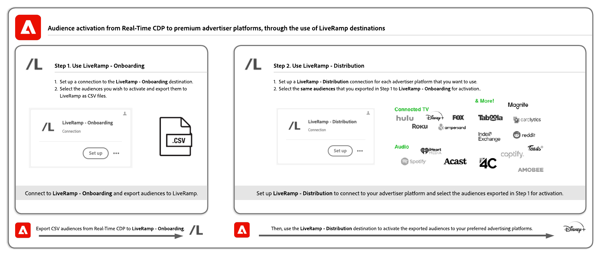

# Activar audiencias en destinos depurados según identificadores de LiveRamp

Use la integración de Adobe Real-Time CDP con [!DNL LiveRamp] para activar audiencias en una lista revisada de destinos que usan [!DNL [LiveRamp RampID]](https://docs.liveramp.com/connect/en/interpreting-rampid,-liveramp-s-people-based-identifier.html) para la activación, incluidos destinos de audio y TV conectados, como los que se enumeran a continuación.

>[!IMPORTANT]
>
>No es necesario ingerir ni trabajar de ninguna manera con LiveRamp RampIDs en la interfaz de Experience Platform.
>
> Puede exportar identidades desde Real-Time CDP, como identificadores basados en PII, identificadores conocidos e ID personalizados, tal como se describe en la [documentación oficial de LiveRamp](https://docs.liveramp.com/connect/en/identity-and-identifier-terms-and-concepts.html#known-identifiers). Estas identidades coinciden con [!DNL LiveRamp RampIDs] más abajo en el proceso de activación.

* [[!DNL 4C Insights]](#insights)
* [[!DNL Acast]](#acast)
* [[!DNL Ampersand.tv]](#ampersand-tv)
* [[!DNL Captify]](#captify)
* [[!DNL Cardlytics]](#cardlytics)
* [[!DNL Disney (Hulu/ESPN/ABC)]](#disney)
* [[!DNL iHeartMedia]](#iheartmedia)
* [[!DNL Index Exchange]](#index-exchange)
* [[!DNL Magnite CTV Platform]](#magnite)
* [[!DNL Magnite DV+ (Rubicon Project)]](#magnite-dv)
* [[!DNL Nexxen]](#nexxen)
* [[!DNL One Fox]](#fox)
* [[!DNL Pandora]](#pandora)
* [[!DNL Reddit]](#reddit)
* [[!DNL Roku]](#roku)
* [[!DNL Spotify]](#spotify)
* [[!DNL Taboola]](#taboola)
* [[!DNL TargetSpot]](#targetspot)
* [[!DNL Teads]](#teads)
* [[!DNL WB Discovery]](#wb-discovery)

En este artículo se explica el flujo de trabajo necesario para activar audiencias desde Real-Time CDP a los destinos enumerados anteriormente, directamente desde la interfaz de usuario de Real-Time CDP.

## Flujo de trabajo de activación {#workflow}

Para activar audiencias en destinos de audio y TV conectados, siga un proceso de dos pasos y use los destinos [LiveRamp - Incorporación](../catalog/advertising/liveramp-onboarding.md) y [LiveRamp - Distribución](../catalog/advertising/liveramp-distribution.md), como se muestra en la imagen siguiente.

{width="1920" zoomable="yes"}

En primer lugar, exporte las audiencias de Real-Time CDP al destino [[!DNL LiveRamp - Onboarding]](../catalog/advertising/liveramp-onboarding.md) como archivos CSV.

Después de exportar las audiencias, las activa usando el destino [[!DNL LiveRamp - Distribution]](../catalog/advertising/liveramp-distribution.md).

>[!TIP]
>
>Este proceso le permite activar audiencias en destinos como [[!DNL Roku]](../catalog/advertising/liveramp-distribution.md#roku), [[!DNL Disney]](../catalog/advertising/liveramp-distribution.md#disney) y más, directamente desde la interfaz de usuario de Real-Time CDP, sin necesidad de iniciar sesión en su cuenta de [!DNL LiveRamp] para la activación.

### Tutorial de vídeo {#video}

Vea el siguiente vídeo para obtener una explicación completa del flujo de trabajo descrito en esta página.

>[!VIDEO](https://video.tv.adobe.com/v/3425367)

### Paso 1: Envío de audiencias de Experience Platform a LiveRamp, a través del destino [!DNL LiveRamp - Onboarding] {#onboarding}

Lo primero que debe hacer para activar sus audiencias en destinos depurados basados en LiveRamp RampID es **exportar sus audiencias de Experience Platform a[!DNL LiveRamp]**.

Para ello, utilice el destino **[!DNL LiveRamp - Onboarding]**.

Para obtener información sobre cómo configurar el destino [!DNL LiveRamp - Onboarding] y exportar las audiencias desde Experience Platform, lea la documentación de destino [[!DNL LiveRamp - Onboarding]](../catalog/advertising/liveramp-onboarding.md).

>[!IMPORTANT]
>
>Al exportar archivos al destino [!DNL LiveRamp - Onboarding], Experience Platform genera un archivo CSV para cada [ID de política de combinación](../../profile/merge-policies/overview.md). Consulte la documentación de destino [[!DNL LiveRamp - Onboarding]](../catalog/advertising/liveramp-onboarding.md) para obtener información detallada sobre cómo validar la exportación de datos a LiveRamp.

Después de exportar correctamente las audiencias a LiveRamp, continúe con el [paso 2](#distribution).

>[!TIP]
>
>Antes de pasar al [paso 2](#distribution), [valide](../catalog/advertising/liveramp-onboarding.md#exported-data) que sus audiencias se han exportado correctamente a LiveRamp. Consulte la documentación sobre [supervisión de flujos de datos de destino](../../dataflows/ui/monitor-destinations.md#dataflow-runs-for-batch-destinations) y lea los detalles de supervisión específicos de [[!DNL LiveRamp - Onboarding]](../catalog/advertising/liveramp-onboarding.md#exported-data).

### Paso 2: Activar las audiencias integradas en destinos de audio y TV conectados, a través del destino [!DNL LiveRamp - Distribution] {#distribution}

Después de [validar](../catalog/advertising/liveramp-onboarding.md#exported-data) que sus audiencias se han exportado correctamente a LiveRamp, es hora de activar las audiencias en sus destinos preferidos, como [[!DNL Roku]](../catalog/advertising/liveramp-distribution.md#roku), [[!DNL Disney]](../catalog/advertising/liveramp-distribution.md#disney) y más.

Las audiencias se activan (exportadas en [paso 1](#onboarding)) mediante el destino **[!DNL LiveRamp - Distribution]**.

Para obtener información sobre cómo configurar el destino **[!DNL LiveRamp - Distribution]** y activar las audiencias que exportó en el [paso 1](#onboarding), lea la documentación de destino [[!DNL LiveRamp - Distribution]](../catalog/advertising/liveramp-distribution.md).

>[!IMPORTANT]
>
>En el paso de **selección de audiencias** del destino **[!DNL LiveRamp - Distribution]**, debe seleccionar las *mismas audiencias* que ha exportado al destino [LiveRamp - Incorporación](../catalog/advertising/liveramp-onboarding.md) en el [paso 1](#onboarding).

Al configurar el destino **[!DNL LiveRamp - Distribution]**, debe crear una conexión dedicada para cada destino descendente que desee utilizar (Roku, Disney, etc.).

>[!TIP]
>
>Al asignar un nombre al destino, Adobe recomienda seguir este formato: `LiveRamp - Downstream Destination Name`. Este patrón de nomenclatura le ayuda a identificar rápidamente sus destinos en la ficha [Examinar](../ui/destinations-workspace.md#browse) del área de trabajo de destinos.
> 
>Ejemplo: `LiveRamp - Roku`.

## Datos exportados / Validar exportación de datos {#exported-data}

Para validar la exportación correcta de las audiencias al destino [[!DNL LiveRamp - Onboarding]](../catalog/advertising/liveramp-onboarding.md), consulte la documentación sobre [supervisión de flujos de datos de destino](../../dataflows/ui/monitor-destinations.md#dataflow-runs-for-batch-destinations) y lea los detalles de supervisión específicos de [[!DNL LiveRamp - Onboarding]](../catalog/advertising/liveramp-onboarding.md#exported-data).

Para validar la activación correcta de las audiencias en la plataforma de publicidad que elija (como Roku, Disney y otras), inicie sesión en la cuenta de la plataforma de destino y compruebe las métricas de activación.
