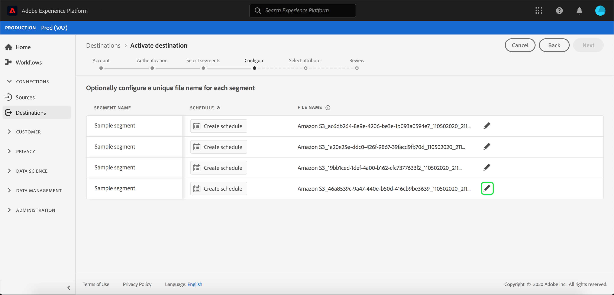

# Activar perfiles y segmentos en un destino

Active los datos que tiene en Adobe Experience Platform asignando segmentos a destinos. Para lograrlo, siga los pasos a continuación.

## Requisitos previos {#prerequisites}

Para activar datos en destinos, debe haber [conectado correctamente un destino](./connect-destination.md). Si aún no lo ha hecho, vaya al [catálogo de destinos](../catalog/overview.md), busque los destinos admitidos y configure uno o varios destinos.

## Activar datos {#activate-data}

Los pasos del flujo de trabajo de activación varían ligeramente entre los tipos de destino. El flujo de trabajo completo para todos los tipos de destino se describe a continuación.

### Seleccione el destino en el que desea activar los datos para {#select-destination}

Se aplica a: Todos los destinos

En la interfaz de usuario de Adobe Experience Platform, vaya a **[!UICONTROL Destinations]** > **[!UICONTROL Browse]** y seleccione el destino en el que desea activar los segmentos.


Seleccione el nombre del destino para desplazarse al flujo de trabajo de activación.


Tenga en cuenta que si ya existe un flujo de trabajo de activación para un destino, puede ver los segmentos que se están activando en ese momento en el destino. Seleccione **[!UICONTROL Editar activación]** en el carril derecho y siga los pasos a continuación para modificar los detalles de la activación.

Una vez seleccionado un destino, seleccione **[!UICONTROL Activar]**.

### [!UICONTROL Seleccionar ] segmentos, paso  {#select-segments}

Se aplica a: Todos los destinos


En el flujo de trabajo **[!UICONTROL Activar destino]**, en la página **[!UICONTROL Seleccionar segmentos]**, seleccione uno o varios segmentos para activarlos en el destino. Seleccione **[!UICONTROL Siguiente]** para continuar con el paso siguiente.


### [!UICONTROL Paso de ] asignación de identidad  {#identity-mapping}

Se aplica a: destinos sociales y destino publicitario de Coincidencia de clientes de Google


Para los destinos sociales, debe seleccionar atributos de origen o Áreas de nombres de identidad para asignarlos como identidades de destinatario en el destino.

#### Ejemplo: activación de datos de audiencia en [!DNL Facebook Custom Audience] {#example-facebook}

Este es un ejemplo de asignación de identidad correcta al activar datos de audiencia en [!DNL Facebook].

Selección de campos de origen:

* Seleccione la Área de nombres `Email` como identidad de origen si las direcciones de correo electrónico que está utilizando no tienen hash.
* Seleccione la Área de nombres `Email_LC_SHA256` como identidad de origen si ha introducido hash en [!DNL Platform] las direcciones de correo electrónico de los clientes en la ingestión de datos, de acuerdo con [!DNL Facebook] [requisitos de hash de correo electrónico](../catalog/social/facebook.md#email-hashing-requirements).
* Seleccione la Área de nombres `PHONE_E.164` como identidad de origen si los datos están formados por números de teléfono sin hash. [!DNL Platform] hará un hash de los números de teléfono para cumplir con  [!DNL Facebook] los requisitos.
* Seleccione la Área de nombres `Phone_SHA256` como identidad de origen si ha hash los números de teléfono en la ingestión de datos en [!DNL Platform], de acuerdo con los [!DNL Facebook] [requisitos de hash de número de teléfono](../catalog/social/facebook.md#phone-number-hashing-requirements).
* Seleccione la Área de nombres `IDFA` como identidad de origen si los datos constan de [!DNL Apple] ID de dispositivo.
* Seleccione la Área de nombres `GAID` como identidad de origen si los datos constan de [!DNL Android] ID de dispositivo.
* Seleccione la Área de nombres `Custom` como identidad de origen si los datos constan de otro tipo de identificadores.

Selección de campos de destinatario:

* Seleccione la Área de nombres `Email_LC_SHA256` como identidad de destinatario cuando las Áreas de nombres de origen sean `Email` o `Email_LC_SHA256`.
* Seleccione la Área de nombres `Phone_SHA256` como identidad de destinatario cuando las Áreas de nombres de origen sean `PHONE_E.164` o `Phone_SHA256`.
* Seleccione las Áreas de nombres `IDFA` o `GAID` como identidad de destinatario cuando las Áreas de nombres de origen sean `IDFA` o `GAID`.
* Seleccione la Área de nombres `Extern_ID` como identidad de destinatario cuando la Área de nombres de origen sea personalizada.


Los datos de las Áreas de nombres sin hash se hash automáticamente mediante [!DNL Platform] en el momento de la activación.

Los datos de origen de atributos no se hash automáticamente. Cuando el campo de origen contenga atributos sin hash, marque la opción **[!UICONTROL Aplicar transformación]** para que [!DNL Platform] hash automáticamente los datos en la activación.


 

#### Ejemplo: activación de datos de audiencia en [!DNL Google Customer Match] {#example-gcm}

Este es un ejemplo de asignación de identidad correcta al activar datos de audiencia en [!DNL Google Customer Match].

Selección de campos de origen:

* Seleccione la Área de nombres `Email` como identidad de origen si las direcciones de correo electrónico que está utilizando no tienen hash.
* Seleccione la Área de nombres `Email_LC_SHA256` como identidad de origen si ha introducido hash en [!DNL Platform] las direcciones de correo electrónico de los clientes en la ingestión de datos, de acuerdo con [!DNL Google Customer Match] [requisitos de hash de correo electrónico](../catalog/social/../advertising/google-customer-match.md).
* Seleccione la Área de nombres `PHONE_E.164` como identidad de origen si los datos están formados por números de teléfono sin hash. [!DNL Platform] hará un hash de los números de teléfono para cumplir con  [!DNL Google Customer Match] los requisitos.
* Seleccione la Área de nombres `Phone_SHA256_E.164` como identidad de origen si ha hash los números de teléfono en la ingestión de datos en [!DNL Platform], de acuerdo con los [!DNL Facebook] [requisitos de hash de número de teléfono](../catalog/social/../advertising/google-customer-match.md).
* Seleccione la Área de nombres `IDFA` como identidad de origen si los datos constan de [!DNL Apple] ID de dispositivo.
* Seleccione la Área de nombres `GAID` como identidad de origen si los datos constan de [!DNL Android] ID de dispositivo.
* Seleccione la Área de nombres `Custom` como identidad de origen si los datos constan de otro tipo de identificadores.

Selección de campos de destinatario:

* Seleccione la Área de nombres `Email_LC_SHA256` como identidad de destinatario cuando las Áreas de nombres de origen sean `Email` o `Email_LC_SHA256`.
* Seleccione la Área de nombres `Phone_SHA256_E.164` como identidad de destinatario cuando las Áreas de nombres de origen sean `PHONE_E.164` o `Phone_SHA256_E.164`.
* Seleccione las Áreas de nombres `IDFA` o `GAID` como identidad de destinatario cuando las Áreas de nombres de origen sean `IDFA` o `GAID`.
* Seleccione la Área de nombres `User_ID` como identidad de destinatario cuando la Área de nombres de origen sea personalizada.


Los datos de las Áreas de nombres sin hash se hash automáticamente mediante [!DNL Platform] en el momento de la activación.

Los datos de origen de atributos no se hash automáticamente. Cuando el campo de origen contenga atributos sin hash, marque la opción **[!UICONTROL Aplicar transformación]** para que [!DNL Platform] hash automáticamente los datos en la activación.


<!-- 
`IDFA` IDs will be mapped to:

* [MADID](https://developers.facebook.com/docs/marketing-api/audiences/guides/custom-audiences#hash) if you are activating audiences in [[!DNL Facebook]](../../destinations/catalog/social/facebook.md).
* [mobileId](https://developers.google.com/adwords/api/docs/reference/v201809/AdwordsUserListService.Member#mobileid) if you are activating audiences in [[!DNL Google Customer Match]](../../destinations/catalog/advertising/google-customer-match.md).

Select `GAID` as target identity if your data consists of Android device IDs. `GAID` IDs will be mapped to:

* [MADID](https://developers.facebook.com/docs/marketing-api/audiences/guides/custom-audiences#hash) if you are activating audiences in [[!DNL Facebook]](../../destinations/catalog/social/facebook.md).
* [mobileId](https://developers.google.com/adwords/api/docs/reference/v201809/AdwordsUserListService.Member#mobileid) if you are activating audiences in [[!DNL Google Customer Match]](../../destinations/catalog/advertising/google-customer-match.md).

If you are using another ID, such as "Rewards ID" or "Loyalty ID", as primary identity in your schema, you need to map it to the following target identities:

* [EXTERN_ID](https://developers.facebook.com/docs/marketing-api/audiences/guides/custom-audiences#external_identifiers) if you are activating audiences in [[!DNL Facebook]](../../destinations/catalog/social/facebook.md).
* [USER_ID](https://developers.google.com/adwords/api/docs/reference/v201809/AdwordsUserListService.Member#userid) if you are activating audiences in [[!DNL Google Customer Match]](../../destinations/catalog/advertising/google-customer-match.md). -->

### **** Configurestep  {#configure}

Se aplica a: Destinos de marketing por correo electrónico y destinos de almacenamiento en la nube


En el paso **[!UICONTROL Configurar]**, puede configurar la programación y los nombres de archivo para cada segmento que esté exportando. La configuración de la programación es obligatoria, pero la configuración del nombre del archivo es opcional.

Para agregar una programación para el segmento, seleccione **[!UICONTROL Crear programación]**.


Aparece una ventana emergente con las opciones para crear la programación de segmentos.

* **Exportación** de archivos: Tiene la opción de exportar archivos completos o incrementales. Exportar un archivo completo publica una instantánea completa de todos los perfiles que cumplen los requisitos para ese segmento. Al exportar un archivo incremental, se publica el delta de perfiles que cumplen los requisitos para ese segmento desde la última exportación.
* **Frecuencia**: Si  **[!UICONTROL Exportar]** archivo completo está seleccionado, tiene la opción de exportar  **** Onceor  **[!UICONTROL Daily]**. Si **[!UICONTROL Exportar archivos incrementales]** está seleccionado, solo tiene la opción de exportar **[!UICONTROL Daily]**. Exportar un archivo **[!UICONTROL Una vez]** exporta el archivo una vez. Al exportar un archivo **[!UICONTROL Diario]**, se exporta todos los días desde la fecha de inicio hasta la fecha de finalización a las 12:00 AM UTC (7:00 PM EST) si se seleccionan archivos completos y a las 12:00 PM UTC (7:00 AM EST) si se seleccionan archivos incrementales.
* **Fecha**: Si  **** se selecciona una vez, puede seleccionar la fecha para la exportación única. Si selecciona **[!UICONTROL Diario]**, puede seleccionar las fechas de inicio y finalización de las exportaciones.


Los nombres de archivo predeterminados constan de nombre de destino, ID de segmento y un indicador de fecha y hora. Por ejemplo, puede editar los nombres de archivo exportados para distinguir entre diferentes campañas o para que el tiempo de exportación de datos se anexe a los archivos.

Seleccione el icono de lápiz para abrir una ventana modal y editar los nombres de archivo. Tenga en cuenta que los nombres de archivo tienen un límite de 255 caracteres.



En el editor de nombres de archivo, puede seleccionar diferentes componentes para agregarlos al nombre de archivo. El nombre de destino y la ID de segmento no se pueden eliminar de los nombres de archivo. Además de esto, puede agregar lo siguiente:

* **[!UICONTROL Nombre]** del segmento: Puede anexar el nombre del segmento al nombre del archivo.
* **[!UICONTROL Fecha y hora]**: Seleccione entre agregar un  `MMDDYYYY_HHMMSS` formato o una marca de tiempo de 10 dígitos Unix del momento en que se generan los archivos. Elija una de estas opciones si desea que los archivos tengan un nombre de archivo dinámico generado con cada exportación incremental.
* **[!UICONTROL Texto]** personalizado: Añada el texto personalizado en los nombres de archivo.

Seleccione **[!UICONTROL Aplicar cambios]** para confirmar la selección.

>[!IMPORTANT]
> 
>Si no selecciona el componente **[!UICONTROL Fecha y hora]**, los nombres de archivo serán estáticos y el nuevo archivo exportado sobrescribirá el archivo anterior en la ubicación del almacenamiento con cada exportación. Esta es la opción recomendada cuando se ejecuta un trabajo de importación recurrente desde una ubicación de almacenamiento a una plataforma de marketing por correo electrónico.


Una vez que haya terminado de configurar todos los segmentos, seleccione **[!UICONTROL Siguiente]** para continuar.

### **[!UICONTROL Programación]** de segmentos  {#segment-schedule}

Se aplica a: destinos de publicidad, destinos sociales


En la página **[!UICONTROL Programación de segmentos]** puede establecer la fecha de inicio para enviar datos al destino, así como la frecuencia con la que se envían datos al destino.

>[!IMPORTANT]
>
>Para los destinos sociales, debe seleccionar el origen de la audiencia en este paso. Sólo puede continuar con el paso siguiente después de seleccionar una de las opciones de la siguiente imagen.


>[!IMPORTANT]
>
>Para la Coincidencia de clientes de Google, debe proporcionar el [!UICONTROL ID de la aplicación] en este paso, al activar segmentos [!DNL IDFA] o [!DNL GAID].


### **** Schedulingstep  {#scheduling}

Se aplica a: destinos de marketing por correo electrónico y destinos de almacenamiento en la nube


En la página **[!UICONTROL Programación]**, puede ver la fecha de inicio para enviar datos al destino, así como la frecuencia de envío de datos al destino. Estos valores no se pueden editar.

### **[!UICONTROL Seleccionar paso]** de atributos  {#select-attributes}

Se aplica a: destinos de marketing por correo electrónico y destinos de almacenamiento en la nube


En la página **[!UICONTROL Seleccionar atributos]**, seleccione **[!UICONTROL Añadir nuevo campo]** y elija los atributos que desee enviar al destino.

>[!NOTE]
>
> Adobe Experience Platform prefiere la selección con cuatro atributos de uso común recomendados del esquema: `person.name.firstName`, `person.name.lastName`, `personalEmail.address`, `segmentMembership.status`.

Las exportaciones de archivos variarán de las siguientes maneras, dependiendo de si se selecciona `segmentMembership.status`:
* Si se selecciona el campo `segmentMembership.status`, los archivos exportados incluyen **[!UICONTROL miembros activos]** en la instantánea completa inicial y **[!UICONTROL miembros activos]** y **[!UICONTROL caducados]** en las posteriores exportaciones incrementales.
* Si el campo `segmentMembership.status` no está seleccionado, los archivos exportados incluyen sólo **[!UICONTROL miembros activos]** en la instantánea completa inicial y en las posteriores exportaciones incrementales.


Además, puede marcar diferentes atributos como obligatorios. Si se marca un atributo como obligatorio, el segmento exportado debe contener dicho atributo. Como resultado, puede utilizarse como una forma adicional de filtrado. Marcar un atributo como obligatorio **no** es obligatorio.

Se recomienda que uno de los atributos sea un [identificador único](../../destinations/catalog/email-marketing/overview.md#identity) de su esquema. Para obtener más información sobre los atributos obligatorios, consulte la sección de identidad en la documentación de [destinos de mercadotecnia de correo electrónico](../../destinations/catalog/email-marketing/overview.md#identity).

>[!NOTE]
> 
>Si se han aplicado etiquetas de uso de datos a ciertos campos dentro de un conjunto de datos (en lugar de a todo el conjunto de datos), la aplicación de las etiquetas de nivel de campo en la activación se produce bajo las siguientes condiciones:
>* Los campos se utilizan en la definición del segmento.
>* Los campos se configuran como atributos proyectados para el destino de destinatario.

>
> 
Por ejemplo: si el campo `person.name.firstName` tiene ciertas etiquetas de uso de datos que entran en conflicto con el caso de uso de mercadotecnia del destino, se le mostrará una infracción de directiva de uso de datos en el paso de revisión. Para obtener más información, consulte [Administración de datos en Adobe Experience Platform](../../rtcdp/privacy/data-governance-overview.md#destinations).

### **** Reviewstep  {#review}

Se aplica a: todos los destinos


En la página **[!UICONTROL Revisar]**, puede ver un resumen de su selección. Seleccione **[!UICONTROL Cancelar]** para desglosar el flujo, **[!UICONTROL Atrás]** para modificar la configuración o **[!UICONTROL Finalizar]** para confirmar la selección y el inicio al enviar datos al destino.

>[!IMPORTANT]
>
>En este paso, Adobe Experience Platform comprueba si hay infracciones de la directiva de uso de datos. A continuación se muestra un ejemplo de violación de una política. No puede completar el flujo de trabajo de activación de segmentos hasta que no haya resuelto la infracción. Para obtener información sobre cómo resolver las violaciones de políticas, consulte [Aplicación de políticas](../../rtcdp/privacy/data-governance-overview.md#enforcement) en la sección de documentación de administración de datos.


Si no se ha detectado ninguna infracción de directiva, seleccione **[!UICONTROL Finalizar]** para confirmar la selección y el inicio al enviar datos al destino.


## Editar activación {#edit-activation}

Siga los pasos a continuación para editar los flujos de activación existentes en Adobe Experience Platform:

1. Seleccione **[!UICONTROL Destinations]** en la barra de navegación izquierda, haga clic en la ficha **[!UICONTROL Browse]** y haga clic en el nombre del destino.
2. Seleccione **[!UICONTROL Editar activación]** en el carril derecho para cambiar los segmentos que se enviarán al destino.

## Verifique que la activación del segmento se haya realizado correctamente {#verify-activation}

### Destinos de marketing por correo electrónico y destinos de almacenamiento en la nube {#esp-and-cloud-storage}

Para los destinos de marketing por correo electrónico y los destinos de almacenamiento en la nube, Adobe Experience Platform crea un archivo `.csv` o `.txt` delimitado por tabuladores en la ubicación de almacenamiento proporcionada. Se espera que cada día se cree un nuevo archivo en la ubicación del almacenamiento. El formato de archivo predeterminado es:
`<destinationName>_segment<segmentID>_<timestamp-yyyymmddhhmmss>.csv|txt`

Tenga en cuenta que puede editar el formato de archivo. Para obtener más información, vaya al paso [Configurar](#configure) para los destinos de almacenamiento en la nube y los destinos de mercadotecnia por correo electrónico.

Con el formato de archivo predeterminado, los archivos que recibiría en tres días consecutivos podrían tener este aspecto:

```console
Salesforce_Marketing_Cloud_segment12341e18-abcd-49c2-836d-123c88e76c39_20200408061804.csv
Salesforce_Marketing_Cloud_segment12341e18-abcd-49c2-836d-123c88e76c39_20200409052200.csv
Salesforce_Marketing_Cloud_segment12341e18-abcd-49c2-836d-123c88e76c39_20200410061130.csv
```

La presencia de estos archivos en la ubicación del almacenamiento es la confirmación de la activación correcta. Para comprender cómo se estructuran los archivos exportados, puede [descargar un archivo .csv de muestra](../assets/common/sample_export_file_segment12341e18-abcd-49c2-836d-123c88e76c39_20200408061804.csv). Este archivo de muestra incluye los atributos de perfil `person.firstname`, `person.lastname`, `person.gender`, `person.birthyear` y `personalEmail.address`.

### Destinos publicitarios

Compruebe su cuenta en el destino de publicidad correspondiente en el que está activando sus datos. Si la activación se ha realizado correctamente, las audiencias se rellenan en la plataforma de publicidad.

### Destinos de redes sociales

Para [!DNL Facebook], una activación exitosa significa que se crearía una audiencia personalizada [!DNL Facebook] mediante programación en [[!UICONTROL Administrador de publicidades para Facebook]](https://www.facebook.com/adsmanager/manage/). La pertenencia a segmentos en la audiencia se agregaría y eliminaría a medida que los usuarios estuvieran cualificados o descalificados para los segmentos activados.

>[!TIP]
>
>La integración entre Adobe Experience Platform y [!DNL Facebook] admite los rellenos de audiencia históricos. Todas las cualificaciones del segmento histórico se envían a [!DNL Facebook] al activar los segmentos en el destino.

## Deshabilitar activación {#disable-activation}

Para deshabilitar un flujo de activación existente, siga los pasos a continuación:

1. Seleccione **[!UICONTROL Destinations]** en la barra de navegación izquierda, haga clic en la ficha **[!UICONTROL Browse]** y haga clic en el nombre del destino.
2. Haga clic en el control **[!UICONTROL Enabled]** en el carril derecho para cambiar el estado del flujo de activación.
3. En la ventana **Actualizar estado de flujo de datos**, seleccione **Confirmar** para deshabilitar el flujo de activación.
